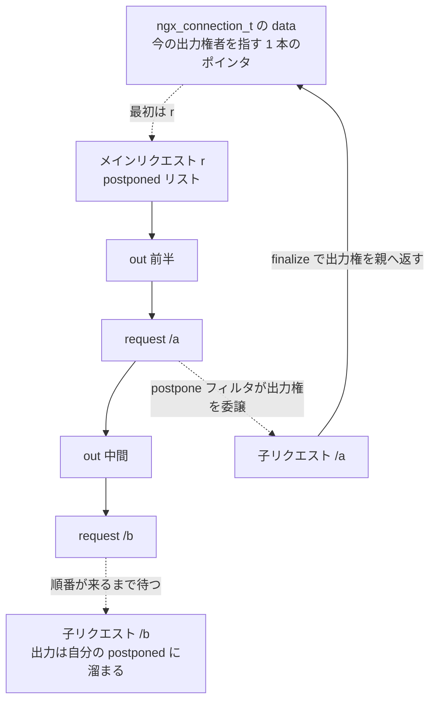

## この層の責務

`auth_request /auth;` と書くと、Nginx はリクエスト処理の途中で `/auth` への内部リクエストを走らせ、その応答コードで元のリクエストを通すか弾くかを決める。SSI の `<!--# include virtual="/header" -->` は、応答の途中に別の URI の内容を差し込む。`mirror` は同じリクエストを別の場所へも投げる。`proxy_cache_background_update` は古いキャッシュを返しながら裏で取り直す。

これらを実装するのに HTTP クライアントを内蔵するのは無駄が多い。`/auth` は `location` にマッチさせたいし、`proxy_pass` も `fastcgi_pass` も使いたいし、[キャッシュ](../file-cache/)も効かせたい。**リクエスト処理の機構をまるごと再利用したい。**

厄介なのは出力の順序だ。SSI が

```
[本文の前半] <!--# include virtual="/a" --> [中間] <!--# include virtual="/b" --> [本文の後半]
```

を処理するとき、`/a` と `/b` は独立に走る。`/b` が先に終わることも普通にある。それでもクライアントには **前半 → a → 中間 → b → 後半** の順で届けなければならない。しかもワーカーは 1 スレッドなので、`/a` の完了を待つ間、元のリクエストは中断している。

この層が引き受けるのは 3 つだ。

1. `ngx_http_request_t` をもう 1 個作り、何を親から借りて何を作り直すかを決める
2. 「今この接続で出力してよいのは誰か」を表現し、順番でない出力を溜める
3. 子が終わったときに、親に値を渡し、親を再開させる

コードは 3 箇所に散っている。子を作る `ngx_http_subrequest()` が [`src/http/ngx_http_core_module.c#L2392-L2581`](https://github.com/nginx/nginx/blob/release-1.31.4/src/http/ngx_http_core_module.c#L2392-L2581)、出力順序を裁く `ngx_http_postpone_filter_module` が 259 行、子の終了処理が `ngx_http_finalize_request()` の中にある。

## 主要な型とその関係

### 子リクエストは何を借り、何を作り直すか

`ngx_http_subrequest()` は `ngx_pcalloc` で `ngx_http_request_t` を 1 個作り、フィールドを埋めていく。埋め方は 3 種類に分かれる。

| フィールド                            | 扱い                          | 理由                                                       |
| ------------------------------------- | ----------------------------- | ---------------------------------------------------------- |
| `connection`                          | 親と同じポインタ              | 出力先のソケットは 1 本                                    |
| `pool`                                | 親と同じポインタ              | 子の寿命は親を超えない ([プールのページ](../memory-pool/)) |
| `headers_in`                          | 構造体ごとコピー              | 子も同じクライアントのヘッダを見る                         |
| `request_body`                        | 親と同じポインタ              | 読み直さない                                               |
| `variables`                           | 親と同じ配列                  | 評価済みの値を共有する ([変数のページ](../variables/))     |
| `main`                                | `r->main` をそのまま          | 参照カウントとタイマの集約先                               |
| `parent`                              | `r`                           | 出力順序を戻す先                                           |
| `ctx`                                 | 新規に `pcalloc`              | モジュールごとの状態は独立                                 |
| `headers_out.headers` / `trailers`    | 新規に `ngx_list_init`        | 子は自分の応答ヘッダを持つ                                 |
| `main_conf` / `srv_conf` / `loc_conf` | **server レベルから取り直す** | location は URI から決め直す                               |
| `postponed`                           | NULL                          | 子は自分の子を後から並べる                                 |

```c title="src/http/ngx_http_core_module.c:2460-2513 (抜粋)"
    cscf = ngx_http_get_module_srv_conf(r, ngx_http_core_module);
    sr->main_conf = cscf->ctx->main_conf;
    sr->srv_conf = cscf->ctx->srv_conf;
    sr->loc_conf = cscf->ctx->loc_conf;

    sr->pool = r->pool;
    sr->headers_in = r->headers_in;
    /* ... */
    sr->request_body = r->request_body;

    sr->method = NGX_HTTP_GET;
    sr->http_version = r->http_version;
    /* ... */
    sr->main = r->main;
    sr->parent = r;
    sr->post_subrequest = ps;
    sr->read_event_handler = ngx_http_request_empty_handler;
    sr->write_event_handler = ngx_http_handler;

    sr->variables = r->variables;
```

`sr->variables = r->variables` が特に効いている。**親が `$remote_addr` を評価済みなら子は評価しない。逆に子が評価した値は親からも見える。** これが `auth_request_set` で「子の応答から取った値を親で使う」ができる理由になっている。

`sr->read_event_handler = ngx_http_request_empty_handler` は「子はクライアントから読まない」の意味。読むのは常にメインリクエストだ。`sr->write_event_handler = ngx_http_handler` で、起こされたら [フェーズエンジン](../phase-engine/) の最初から走る。

`sr->method = NGX_HTTP_GET` に固定されるのも重要で、**POST の中で立てた子リクエストも既定では GET になる**。`CLONE` フラグを付けたときだけ親のメソッドを引き継ぐ。

### 深さと参照カウント

入口に 3 つの門番がある。

```c title="src/http/ngx_http_core_module.c:2404-2424"
    if (r->subrequests == 0) {
        ngx_log_error(NGX_LOG_ERR, r->connection->log, 0,
                      "subrequests cycle while processing \"%V\"", uri);
        return NGX_ERROR;
    }

    /*
     * 1000 is reserved for other purposes.
     */
    if (r->main->count >= 65535 - 1000) {
        ngx_log_error(NGX_LOG_CRIT, r->connection->log, 0,
                      "request reference counter overflow "
                      "while processing \"%V\"", uri);
        return NGX_ERROR;
    }

    if (r->subrequest_in_memory) {
        ngx_log_error(NGX_LOG_ERR, r->connection->log, 0,
                      "nested in-memory subrequest \"%V\"", uri);
        return NGX_ERROR;
    }
```

`r->subrequests` は入れ子の深さ。メインリクエストの生成時に `NGX_HTTP_MAX_SUBREQUESTS + 1` = 51 が入り ([`src/http/ngx_http_request.c#L661`](https://github.com/nginx/nginx/blob/release-1.31.4/src/http/ngx_http_request.c#L661))、子は `r->subrequests - 1` を持つ。0 まで減ったらそこで止まる。

`r->main->count` は [リクエストの終わらせ方のページ](../finalize-request/) の参照カウント。16 ビットのビットフィールドなので上限は 65535 で、そこから 1000 を余裕として引いている。**AIO やキャッシュロックも `count` を増やすので、その余地を残してある。**

3 つ目は「`IN_MEMORY` の子の中でさらに子を作らせない」。理由は後述する。

SSI で自分自身を include すると無限に増えるので、この 3 つが最後の砦になる。**「壊れた設定が書けてしまう」ことを認めた上で、暴走を検出可能な形で止める。** ログの文言が `"subrequests cycle while processing"` なのは、運用者が循環参照を疑うのに十分な情報を渡すためだ。

### 完了通知のコールバック

```c title="src/http/ngx_http_request.h:355-361"
typedef ngx_int_t (*ngx_http_post_subrequest_pt)(ngx_http_request_t *r,
    void *data, ngx_int_t rc);

typedef struct {
    ngx_http_post_subrequest_pt       handler;
    void                             *data;
} ngx_http_post_subrequest_t;
```

`ngx_http_subrequest()` の第 5 引数に渡す。`handler` は**子の `ngx_http_finalize_request()` の早い段階**で、子自身を `r` として呼ばれる。戻り値がそのまま `rc` に上書きされるので、コールバックは終了コードを差し替えられる。

### 出力順序を表す 2 本のリスト

```c title="src/http/ngx_http_request.h:364-378"
typedef struct ngx_http_postponed_request_s  ngx_http_postponed_request_t;

struct ngx_http_postponed_request_s {
    ngx_http_request_t               *request;
    ngx_chain_t                      *out;
    ngx_http_postponed_request_t     *next;
};


typedef struct ngx_http_posted_request_s  ngx_http_posted_request_t;

struct ngx_http_posted_request_s {
    ngx_http_request_t               *request;
    ngx_http_posted_request_t        *next;
};
```

名前が 1 文字違いで紛らわしいが、役割は全く別だ。

- **`postponed`** は各リクエストが持つ「出力の順序の予約」。`request` が入っていれば「ここに子リクエストの出力が入る」、`out` が入っていれば「ここに自分自身の出力がある」。この 2 種類が 1 本のリストに時系列で並ぶ
- **`posted_requests`** は `r->main` だけが持つ「次に走らせるリクエストのキュー」。イベントループに戻る直前に消化される

SSI の例なら、親の `postponed` はこうなる。

```
r->postponed: [out: 前半] → [request: /a] → [out: 中間] → [request: /b] → [out: 後半]
```

**このリストの順序が、そのまま出力の順序になる。**

### `c->data` が出力権を表す

複数のリクエストが 1 本の接続を共有していて、下流に書けるのは 1 人だけ。**この排他を、`c->data` というポインタ 1 個の値で表している。** `r == c->data` なら出力してよく、そうでなければ溜める。ロックもフラグの組み合わせも要らない。



### 4 つのフラグ

```c title="src/http/ngx_http_request.h:65-69"
/* unused                                  1 */
#define NGX_HTTP_SUBREQUEST_IN_MEMORY      2
#define NGX_HTTP_SUBREQUEST_WAITED         4
#define NGX_HTTP_SUBREQUEST_CLONE          8
#define NGX_HTTP_SUBREQUEST_BACKGROUND     16
```

| フラグ       | 何が変わるか                                                                                            |
| ------------ | ------------------------------------------------------------------------------------------------------- |
| `IN_MEMORY`  | 子の応答ボディを下流に流さず、1 枚のバッファに集める。`postpone` フィルタが専用の分岐に入る             |
| `WAITED`     | 親が「終わったか」を問い合わせる子になる。出力権を持たないまま終わっても `r->done` が立つ               |
| `CLONE`      | メソッド・`loc_conf`・`phase_handler`・正規表現のキャプチャを親から引き継ぎ、フェーズの途中から再開する |
| `BACKGROUND` | `postponed` に登録しない。出力順序の管理から外れ、終了時も親を起こさない                                |

`IN_MEMORY` は `subrequest_in_memory` と `filter_need_in_memory` の 2 つを立てる ([`#L2515-L2517`](https://github.com/nginx/nginx/blob/release-1.31.4/src/http/ngx_http_core_module.c#L2515-L2517))。集める先は `subrequest_output_buffer_size` (既定はページサイズ) のバッファ 1 枚だけで、溢れると `too big subrequest response` でエラーになる ([`src/http/ngx_http_postpone_filter_module.c#L193-L239`](https://github.com/nginx/nginx/blob/release-1.31.4/src/http/ngx_http_postpone_filter_module.c#L193-L239))。入口で入れ子を禁じているのは、この 1 枚のバッファが誰のものか決まらなくなるからだ。

`CLONE` だけ処理の位置が違って、`ngx_http_subrequest()` の最後で上書きする。

```c title="src/http/ngx_http_core_module.c:2559-2578"
    if (flags & NGX_HTTP_SUBREQUEST_CLONE) {
        sr->method = r->method;
        sr->method_name = r->method_name;
        sr->loc_conf = r->loc_conf;
        sr->valid_location = r->valid_location;
        sr->valid_unparsed_uri = r->valid_unparsed_uri;
        sr->content_handler = r->content_handler;
        sr->phase_handler = r->phase_handler;
        sr->write_event_handler = ngx_http_core_run_phases;

#if (NGX_PCRE)
        sr->ncaptures = r->ncaptures;
        sr->captures = r->captures;
        sr->captures_data = r->captures_data;
        sr->realloc_captures = 1;
        r->realloc_captures = 1;
#endif

        ngx_http_update_location_config(sr);
    }
```

`write_event_handler` が `ngx_http_handler` ではなく `ngx_http_core_run_phases` になる。**フェーズの最初からではなく、親が今いるフェーズから始まる。** 正規表現のキャプチャ配列を共有しつつ両方に `realloc_captures` を立てるのは、以後どちらかが評価したときに配列を作り直させるためだ。`proxy_cache_background_update` はこの `CLONE | BACKGROUND` を使う。

## 処理の流れ

### 1. 出力順序を予約する

構造体を埋めたあと、親の `postponed` の末尾に自分を予約する。

```c title="src/http/ngx_http_core_module.c:2519-2540"
    if (!sr->background) {
        pr = ngx_palloc(r->pool, sizeof(ngx_http_postponed_request_t));
        if (pr == NULL) {
            return NGX_ERROR;
        }

        pr->request = sr;
        pr->out = NULL;
        pr->next = NULL;

        if (c->data == r && r->postponed == NULL) {
            c->data = sr;
        }

        if (r->postponed) {
            for (p = r->postponed; p->next; p = p->next) { /* void */ }
            p->next = pr;

        } else {
            r->postponed = pr;
        }
    }
```

`if (c->data == r && r->postponed == NULL) c->data = sr;` の条件が肝で、**「今出力権を持っているのが自分で、かつ自分より前に予約が無い」ときだけ、出力権を子に渡す**。既に `postponed` に何かあれば、そちらが先なので渡さない。

`background` な子はこのブロックに入らない。**出力を待たない子**なので、順序の管理から外れる。

最後にカウンタを進めて、実行キューに積む。

```c title="src/http/ngx_http_core_module.c:2548-2580 (抜粋)"
    sr->uri_changes = NGX_HTTP_MAX_URI_CHANGES + 1;
    sr->subrequests = r->subrequests - 1;
    /* ... */
    r->main->count++;

    *psr = sr;
    /* ... CLONE の処理 ... */
    return ngx_http_post_request(sr, posted);
```

### 2. なぜ「その場で呼ぶ」のではなく post するのか

`ngx_http_post_request()` は `r->main->posted_requests` の末尾に繋ぐだけで、**その場では実行しない**。

```c title="src/http/ngx_http_request.c:2653-2678 (抜粋)"
    for (p = &r->main->posted_requests; *p; p = &(*p)->next) {
        if ((*p)->request == r) {
            ngx_log_debug0(NGX_LOG_DEBUG_HTTP, r->connection->log, 0,
                           "http request already posted");
            return NGX_OK;
        }
    }

    if (pr == NULL) {
        pr = ngx_palloc(r->pool, sizeof(ngx_http_posted_request_t));
        /* ... */
    }

    pr->request = r;
    pr->next = NULL;

    *p = pr;
```

**リストを舐めて重複を弾いている。** 同じリクエストが 2 回積まれても 1 回しか走らない。子が終わるときに親を積み、その親がさらに別の子を起こす、という連鎖で同じリクエストが複数回積まれうるので、この検査が要る。

消化するのが `ngx_http_run_posted_requests()`。

```c title="src/http/ngx_http_request.c:2620-2650"
void
ngx_http_run_posted_requests(ngx_connection_t *c)
{
    ngx_http_request_t         *r;
    ngx_http_posted_request_t  *pr;

    for ( ;; ) {

        if (c->destroyed) {
            return;
        }

        r = c->data;
        pr = r->main->posted_requests;

        if (pr == NULL) {
            return;
        }

        r->main->posted_requests = pr->next;

        r = pr->request;

        ngx_http_set_log_request(c->log, r);

        ngx_log_debug2(NGX_LOG_DEBUG_HTTP, c->log, 0,
                       "http posted request: \"%V?%V\"", &r->uri, &r->args);

        r->write_event_handler(r);
    }
}
```

毎周 `c->destroyed` を見るのが要点で、**キューを消化している最中に接続が閉じられたら即座に抜ける**。`r = c->data` を毎回取り直すのも同じ理由で、リストのヘッダは「今の出力権者のメインリクエスト」から辿る。

これが呼ばれるのは、**接続のイベントハンドラの直後**だ。

```c title="src/http/ngx_http_request.c:2609-2616"
    if (ev->write) {
        r->write_event_handler(r);

    } else {
        r->read_event_handler(r);
    }

    ngx_http_run_posted_requests(c);
```

同じ形が `ngx_http_process_request_line` / `ngx_http_process_request_headers` の末尾、[upstream](../upstream/) の 4 箇所、[キャッシュ](../file-cache/)のロック待ちと AIO、copy フィルタの AIO 完了、HTTP/2 と HTTP/3 の各所にある。**「イベントハンドラとして直接呼ばれる関数は、出口で必ずポストキューを回す」というのが Nginx 全体の規約になっている。**

その場で親を呼ばない理由は 2 つある。**スタックが深くなる**こと。SSI が 10 段入れ子になっていると、その場呼び出しでは 10 段ぶんのフレームが積み上がる。そして**再入する**こと。子の終了処理の途中で親が動き出すと、まだ後始末が終わっていない状態で親が子を参照しうる。post に落とすと、常に「フラットなループから 1 つずつ」になる。

### 3. postpone フィルタが溜めるか流すかを決める

`ngx_http_postpone_filter` は [出力フィルタチェーン](../output-filter-chain/) の 1 つで、`auto/modules` の登録順から gzip より上流・SSI より下流に位置する。

```c title="src/http/ngx_http_postpone_filter_module.c:65-101"
    if (r->subrequest_in_memory) {
        return ngx_http_postpone_filter_in_memory(r, in);
    }

    if (r != c->data) {

        if (in) {
            if (ngx_http_postpone_filter_add(r, in) != NGX_OK) {
                return NGX_ERROR;
            }

            return NGX_OK;
        }
        /* ... */
        return NGX_OK;
    }

    if (r->postponed == NULL) {

        if (in || c->buffered) {
            return ngx_http_next_body_filter(r->main, in);
        }

        return NGX_OK;
    }

    if (in) {
        if (ngx_http_postpone_filter_add(r, in) != NGX_OK) {
            return NGX_ERROR;
        }
    }
```

4 つの場合に分かれる。

1. **`subrequest_in_memory`** → 専用の分岐。バッファ 1 枚に集める
2. **`r != c->data`** (出力権が無い) → **溜める**。自分の `postponed` の末尾に積む
3. **`r == c->data` で `postponed` が空** → **そのまま下流へ**。待つべきものが無い
4. **`r == c->data` で `postponed` がある** → 自分の出力もいったんリストに積んでから、リストを頭から消化する

**`ngx_http_next_body_filter(r->main, in)` の第 1 引数が `r` ではなく `r->main`** なのがポイントで、これ以降のフィルタ (gzip / chunked / write) は**常にメインリクエストとして扱う**。子リクエストの出力も、メインの応答ストリームの一部として圧縮され、chunked に包まれる。ここがサブリクエストの出力とメインの出力が合流する地点になっている。

積む側は、末尾のノードを再利用できるなら再利用する。

```c title="src/http/ngx_http_postpone_filter_module.c:146-176 (抜粋)"
    if (r->postponed) {
        for (pr = r->postponed; pr->next; pr = pr->next) { /* void */ }

        if (pr->request == NULL) {
            goto found;
        }

        ppr = &pr->next;

    } else {
        ppr = &r->postponed;
    }

    pr = ngx_palloc(r->pool, sizeof(ngx_http_postponed_request_t));
    /* ... */
    pr->request = NULL;
    pr->out = NULL;
    pr->next = NULL;

found:

    if (ngx_chain_add_copy(r->pool, &pr->out, in) == NGX_OK) {
        return NGX_OK;
    }
```

**末尾が「出力ノード」ならそこに追記し、そうでなければ新しいノードを作る。** 連続する出力が 1 ノードにまとまるので、リストが無駄に長くならない。[buf のページ](../buf-chain/) の `ngx_chain_add_copy` を使っているので、**溜めているのはリンクだけで、バッファの実体はコピーされない**。

### 4. リストの消化

```c title="src/http/ngx_http_postpone_filter_module.c:103-137 (抜粋)"
    do {
        pr = r->postponed;

        if (pr->request) {

            ngx_log_debug2(NGX_LOG_DEBUG_HTTP, c->log, 0,
                           "http postpone filter wake \"%V?%V\"",
                           &pr->request->uri, &pr->request->args);

            r->postponed = pr->next;
            c->data = pr->request;

            return ngx_http_post_request(pr->request, NULL);
        }

        if (pr->out == NULL) {
            ngx_log_error(NGX_LOG_ALERT, c->log, 0,
                          "http postpone filter NULL output");

        } else {
            if (ngx_http_next_body_filter(r->main, pr->out) == NGX_ERROR) {
                return NGX_ERROR;
            }
        }

        r->postponed = pr->next;

    } while (r->postponed);
```

**先頭が子リクエストなら、そこで止まる。** `c->data` をその子に渡し (出力権の委譲)、ポストキューに積んで `return` する。この時点で親は「その子が終わるまで何もできない」状態になる。

**先頭が出力なら、下流に流してリストを進める。** 次も出力なら続けて流し、子に当たったら止まる。

### 5. 子が終わったとき

`ngx_http_finalize_request()` の前半で、まずコールバックが呼ばれる。

```c title="src/http/ngx_http_request.c:2711-2713"
    if (r != r->main && r->post_subrequest) {
        rc = r->post_subrequest->handler(r, r->post_subrequest->data, rc);
    }
```

その後、サブリクエスト専用の分岐に入る。

```c title="src/http/ngx_http_request.c:2755-2826 (抜粋)"
    if (r != r->main) {

        if (r->buffered || r->postponed) {

            if (ngx_http_set_write_handler(r) != NGX_OK) {
                ngx_http_terminate_request(r, 0);
            }

            return;
        }

        pr = r->parent;

        if (r == c->data || r->background) {
            /* ... log_subrequest ならログを書く ... */
            r->done = 1;

            if (r->background) {
                ngx_http_finalize_connection(r);
                return;
            }

            r->main->count--;
            r->write_event_handler = ngx_http_request_empty_handler;

            if (pr->postponed && pr->postponed->request == r) {
                pr->postponed = pr->postponed->next;
            }

            c->data = pr;

        } else {
            ngx_log_debug2(NGX_LOG_DEBUG_HTTP, c->log, 0,
                           "http finalize non-active request: \"%V?%V\"",
                           &r->uri, &r->args);

            r->write_event_handler = ngx_http_request_finalizer;

            if (r->waited) {
                r->done = 1;
            }
        }

        if (ngx_http_post_request(pr, NULL) != NGX_OK) {
            r->main->count++;
            ngx_http_terminate_request(r, 0);
            return;
        }

        return;
    }
```

**まだ自分の出力が残っている (`r->buffered || r->postponed`) なら、終われない。** 書き出し用の handler に切り替えて待つ。

出力権を持ったまま終わった場合 (`r == c->data`) は、**`c->data = pr` で親に返し、親をポストキューに積む**。親が再開すると `postpone` フィルタがまた呼ばれ、リストの続きを処理する。

出力権を持っていない子が先に終わった場合 (`else` 節) は、**`c->data` を触らない**。`ngx_http_request_finalizer` に差し替えて、後で自分の番が来たときに即座に終わるようにしておく。この関数は `ngx_http_finalize_request(r, 0)` を呼ぶだけの 1 行だ ([`#L3124-L3131`](https://github.com/nginx/nginx/blob/release-1.31.4/src/http/ngx_http_request.c#L3124-L3131))。SSI の `/b` が `/a` より先に終わるケースがこれで、**`/b` の出力は `postponed` に溜まったまま、順番が来るのを待つ**。

`r->waited` が立っているときだけ `r->done = 1` にするのが細かい。`WAITED` フラグで作られた子は「親が終わったかどうかを問い合わせる子」なので、出力の番が来ていなくても完了を宣言する必要がある。

`background` な子は `r->main->count--` を通らず、`ngx_http_finalize_connection(r)` に直行する。親を起こすこともない。

### 6. auth_request — フェーズの途中から使う

`auth_request` は ACCESS フェーズにハンドラを刺す。同じハンドラが 2 回呼ばれ、`ctx` の有無で段階を区別する。

```c title="src/http/modules/ngx_http_auth_request_module.c:119-124, 182-218 (抜粋)"
    ctx = ngx_http_get_module_ctx(r, ngx_http_auth_request_module);

    if (ctx != NULL) {
        if (!ctx->done) {
            return NGX_AGAIN;
        }
        /* ... ctx->status を見て通すか弾くかを決める ... */
    }

    ctx = ngx_pcalloc(r->pool, sizeof(ngx_http_auth_request_ctx_t));
    /* ... */
    ps->handler = ngx_http_auth_request_done;
    ps->data = ctx;

    if (ngx_http_subrequest(r, &arcf->uri, NULL, &sr, ps,
                            NGX_HTTP_SUBREQUEST_WAITED)
        != NGX_OK)
    {
        return NGX_ERROR;
    }

    /*
     * allocate fake request body to avoid attempts to read it and to make
     * sure real body file (if already read) won't be closed by upstream
     */

    sr->request_body = ngx_pcalloc(r->pool, sizeof(ngx_http_request_body_t));
    /* ... */
    sr->header_only = 1;

    ctx->subrequest = sr;

    ngx_http_set_ctx(r, ctx, ngx_http_auth_request_module);

    return NGX_AGAIN;
```

初回は子を立てて `NGX_AGAIN` を返す。ACCESS フェーズの checker が `NGX_AGAIN` を「まだ終わっていない」として扱い、フェーズを進めずに帰る。

```c title="src/http/ngx_http_core_module.c:1118-1135 (抜粋)"
    if (r != r->main) {
        r->phase_handler = ph->next;
        return NGX_AGAIN;
    }
    /* ... */
    rc = ph->handler(r);

    if (rc == NGX_DECLINED) {
        r->phase_handler++;
        return NGX_AGAIN;
    }

    if (rc == NGX_AGAIN || rc == NGX_DONE) {
        return NGX_OK;
    }
```

先頭の 3 行にも注目したい。**ACCESS フェーズはサブリクエストでは丸ごとスキップされる。** `/auth` への子リクエスト自身が `auth_request` に捕まって無限ループする、という事故がここで防がれている。

完了コールバックは記録しかしない。

```c title="src/http/modules/ngx_http_auth_request_module.c:222-234 (抜粋)"
static ngx_int_t
ngx_http_auth_request_done(ngx_http_request_t *r, void *data, ngx_int_t rc)
{
    ngx_http_auth_request_ctx_t   *ctx = data;
    /* ... */
    ctx->done = 1;
    ctx->status = r->headers_out.status;

    return rc;
}
```

**判断は親のハンドラが再度呼ばれたときに行う。** コールバックの実行文脈は「子の終了処理の途中」なので、ここで親のフェーズを進めると、子の後始末が終わっていない状態で親が動く。値の記録だけに留めて、判断は親が再開してから、という分離になっている。

`sr->header_only = 1` で子の応答ボディは捨てる。認証の判定に必要なのはステータスコードだけだ。`request_body` に空の構造体を入れるのはコメントのとおり 2 つの理由で、「まだ読んでいない」と「読んだが空だった」を `request_body == NULL` で区別しているので、空の構造体が「読んだことにする」を表す。もう 1 つは**親が既に読んで一時ファイルに落としたボディを、子の upstream 処理が閉じてしまう**のを防ぐためだ。

### 7. SSI — フィルタの途中から使う

SSI はボディフィルタなので、呼ばれる場所が全く違う。にもかかわらず、使う API は同じだ。

```c title="src/http/modules/ngx_http_ssi_filter_module.c:2171-2228 (抜粋)"
    if (wait) {
        flags |= NGX_HTTP_SUBREQUEST_WAITED;
    }

    if (set) {
        /* ... psr->handler = ngx_http_ssi_set_variable ... */
        flags |= NGX_HTTP_SUBREQUEST_IN_MEMORY|NGX_HTTP_SUBREQUEST_WAITED;
    }

    if (ngx_http_subrequest(r, uri, &args, &sr, psr, flags) != NGX_OK) {
        return NGX_HTTP_SSI_ERROR;
    }

    if (wait == NULL && set == NULL) {
        return NGX_OK;
    }

    if (ctx->wait == NULL) {
        ctx->wait = sr;

        return NGX_AGAIN;

    } else {
        ngx_log_error(NGX_LOG_ERR, r->connection->log, 0,
                      "can only wait for one subrequest at a time");
    }
```

**既定の `include` は待たない。** 子を立てて `NGX_OK` を返し、SSI は本文のパースを続ける。順序は `postponed` リストが保証してくれるので、SSI 自身が待つ必要がない。`wait="yes"` か `set=` が付いたときだけ `NGX_AGAIN` を返して自分を止める。`set=` に `IN_MEMORY` が付くのは、子の応答を変数の値として使うからだ。

「前半」がリストに入るのは、コマンドを実行する直前の flush だ。

```c title="src/http/modules/ngx_http_ssi_filter_module.c:833-851 (抜粋)"
                if (cmd->flush && ctx->out) {

                    ngx_log_debug0(NGX_LOG_DEBUG_HTTP, r->connection->log, 0,
                                   "ssi flush");

                    if (ngx_http_ssi_output(r, ctx) == NGX_ERROR) {
                        return NGX_ERROR;
                    }
                }

                rc = cmd->handler(r, ctx, params);

                if (rc == NGX_OK) {
                    continue;
                }

                if (rc == NGX_DONE || rc == NGX_AGAIN || rc == NGX_ERROR) {
                    ngx_http_ssi_buffered(r, ctx);
                    return rc;
                }
```

`include` は `flush` フラグ付きで登録されている。**`ngx_http_subrequest()` を呼ぶ前に、それまでの出力を下流に押し出す。** 押し出した先で `postpone` フィルタが `[out: 前半]` としてリストに積む。その直後に子が `[request: /a]` として積まれるので、順序が確定する。この 2 行の順番が入れ替わると SSI の出力順序が崩れる。

待つ側の判定は、`c->data` を直接見る。

```c title="src/http/modules/ngx_http_ssi_filter_module.c:454-477 (抜粋)"
    if (ctx->wait) {

        if (r != r->connection->data) {
            /* ... "wait ... non-active" ... */
            return NGX_AGAIN;
        }

        if (ctx->wait->done) {
            /* ... "wait ... done" ... */
            ctx->wait = NULL;

        } else {
            /* ... "wait ..." ... */
            return ngx_http_next_body_filter(r, NULL);
        }
    }
```

**出力権が自分に無ければ何もせず帰り、あって子が `done` なら再開する。** `WAITED` フラグを付けた子だけが、出力の番が来ていなくても `done` を立てる。ここで `r->done` の意味が効いてくる。

こうして、**ACCESS フェーズの途中から呼ぶ `auth_request` と、ボディフィルタの途中から呼ぶ SSI が、`ngx_http_subrequest()` / `post_subrequest` / `postponed` / `c->data` という同じ 4 つの部品を使っている**。呼び出し側が「フェーズの続き」を持つか「パースの続き」を持つかの違いだけが、`NGX_AGAIN` の受け取られ方に出る。

## 守られている不変条件

**`c->data` は常にちょうど 1 つのリクエストを指す。** 初期値はメインリクエスト。委譲するのは 2 箇所 (`ngx_http_subrequest` の登録時と `postpone` フィルタの消化時)、返すのは 1 箇所 (`ngx_http_finalize_request` の `c->data = pr`) だけだ。

**`c->data` を持っていない子は、下流に 1 バイトも書かない。** `postpone` フィルタの最初の分岐がこれを強制する。`ngx_event_pipe` の中にも `p->downstream->data == p->output_ctx` という同じ判定が出てくる ([event_pipe のページ](../upstream-event-pipe/))。「下流に流せるか」の判定が、出力権を持っているかの判定と一致している。

**`r->main->count` は子 1 本につき 1 増え、子が終わるとき 1 減る。** 増やすのは `ngx_http_subrequest` の末尾、減らすのは `finalize` の `r == c->data` 側。`background` な子は `ngx_http_finalize_connection` 経由で減る。`ngx_http_post_request` が失敗したときに `r->main->count++` してから `terminate` するのは、`terminate` が減らす前提で書かれているためだ。

**親の `postponed` の先頭が自分なら、終わるときに自分で外す。**

```c title="src/http/ngx_http_request.c:2797-2799"
            if (pr->postponed && pr->postponed->request == r) {
                pr->postponed = pr->postponed->next;
            }
```

`postpone` フィルタが子を起こすときにも `r->postponed = pr->next` で外しているので、二重に外れないよう `pr->postponed->request == r` を確認している。

**同じリクエストがポストキューに 2 回入らない。** `ngx_http_post_request` の先頭のループが保証する。

**深さと参照カウントには上限がある。** 51 段と 64535。どちらも「正しい設定なら絶対に到達しない」値で、到達したときのログは設定の誤りを指す文言になっている。

## つまずきどころ

### `r != r->main` の判定がコード全体に散らばる

子リクエストを「普通のリクエスト」として扱えるのは利点だが、**「子ではやってはいけないこと」を各所で書く必要が出る**。ACCESS フェーズの丸ごとスキップ、`finalize` の分岐、`postpone` フィルタ、not_modified フィルタ、ログの書き込み、`cache_send` の `last_buf` 判定。コアだけで 20 箇所以上ある。

この判定を書き忘れたサードパーティモジュールは、サブリクエストで妙な挙動をする。典型的なバグの 1 つになっている。

### 共有しているリソースの所有権が曖昧

親子で `r->pool` も `request_body` も共有している。「どちらが片付けるか」は暗黙で、`auth_request` が偽の `request_body` を置いているのはその曖昧さへの対処療法だ。素直な解は「子はボディを所有しない」というフラグを足すことだが、既存のコードを触らずに済ませる方を選んでいる。

プールを共有していることの帰結もある。**子が確保したメモリはメインリクエストが終わるまで解放されない。** SSI で 100 個の include を並べると、100 個ぶんの `ngx_http_request_t` と `ctx` 配列がプールに残り続ける。

### `c->data` の付け替えを間違えると、静かに固まる

出力権を持ったまま終了しない子がいると、親は永遠に再開しない。**ポインタ 1 個で表現している以上、「誰も持っていない」「2 人が持っている」を検出する手段が無い。** タイムアウトも掛からず、接続がハングしたままになる。

デバッグの取っ掛かりは `ngx_http_finalize_request` のデバッグログに入っている `a:%d` (= `r == c->data`) と、`postpone` フィルタの `wake` ログだ。**「今誰が出力権を持っているか」がログの 1 フィールドで読める**ようにはなっている。

### `NGX_AGAIN` の意味が呼び出し文脈で変わる

`auth_request` の `NGX_AGAIN` はフェーズの checker が解釈し、SSI の `NGX_AGAIN` はボディフィルタの呼び出し元が解釈する。同じ値が「フェーズを進めるな」と「まだ出力できるものがない」の 2 つの意味で使われている。サブリクエストを使うモジュールを書くときは、**自分がどのフェーズ・どのフィルタから呼ばれているか**で戻り値の意味が変わる。

### `IN_MEMORY` はバッファ 1 枚ぶんしか入らない

`subrequest_output_buffer_size` は既定でページサイズ (通常 4096)。SSI の `set=` で大きめの内容を取り込もうとすると `too big subrequest response` で失敗する。`Content-Length` が付いていればサイズを見て先に弾くが、chunked なら書きながら溢れる。

### 参照カウントが 16 ビットであること

`count:16` は構造体を詰めた結果で、65535 という上限が設計に現れてしまっている。そこから 1000 を予約しているのも実務的な判断だ。**上限に安全マージンを含めておく**という考え方自体は真似できるが、カウンタを素直に 32 ビット以上にできるなら、そのほうがいい。

## 関連

- `r->main->count` と終了処理の全体は [リクエストの終わらせ方のページ](../finalize-request/)。
- `postpone` フィルタがチェーンのどこにいるかは [出力フィルタチェーンのページ](../output-filter-chain/)。
- `NGX_AGAIN` を返した先で何が起きるかは [フェーズエンジンのページ](../phase-engine/)。
- 親子でプールを共有することの意味は [メモリプールのページ](../memory-pool/)。
- 親子で共有される変数のキャッシュは [変数のページ](../variables/)。
- `p->downstream->data == p->output_ctx` が使われる場所は [event_pipe のページ](../upstream-event-pipe/)。
- `CLONE | BACKGROUND` の実際の利用例は [キャッシュのページ](../file-cache/)。
