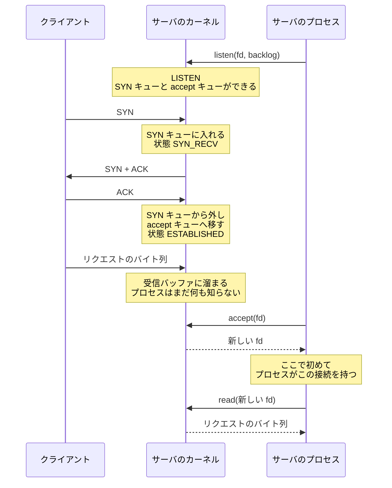

## なぜこれを先に知る必要があるか

Web サーバのソースを読むと、`accept()` を呼んでいる場所は数行しかない。その数行の周りに、ロック、フラグ、条件分岐、ワーカー間の調停が積み重なっている。なぜそんなに複雑なのかは、**`accept()` が何を取り出しているのか** — つまりカーネル側に何があるのか — を知らないと分からない。

「接続が来た」という 1 つの出来事に見えるものは、実際には 2 段階になっている。カーネルが 3 ウェイハンドシェイクを完了させるところまでと、それをアプリケーションが受け取るところ。この 2 つのあいだにキューがあり、キューには長さがあり、溢れたときの挙動がある。

サーバのチューニングでよく出てくる `backlog`、`somaxconn`、`SO_REUSEPORT`、TIME_WAIT の山 — これらは全部この構造の話だ。ここでは nginx のコードを出さず、Linux のソケット API とカーネルの挙動だけを見る。

## socket → bind → listen → accept の 4 段

サーバ側の TCP は、次の 4 つのシステムコールで組み立てる。

```c
int fd = socket(AF_INET, SOCK_STREAM, IPPROTO_TCP);

int one = 1;
setsockopt(fd, SOL_SOCKET, SO_REUSEADDR, &one, sizeof(one));

struct sockaddr_in addr = {
    .sin_family = AF_INET,
    .sin_port   = htons(80),
    .sin_addr   = { .s_addr = htonl(INADDR_ANY) },
};
bind(fd, (struct sockaddr *) &addr, sizeof(addr));

listen(fd, 511);

for (;;) {
    struct sockaddr_storage peer;
    socklen_t len = sizeof(peer);
    int c = accept(fd, (struct sockaddr *) &peer, &len);
    /* ... */
}
```

4 段それぞれで、カーネル側の状態が変わる。

- **`socket()`** — ファイル記述子と `struct socket` ができる。プロトコルは決まったが、アドレスは付いていない。TCP の状態でいえば CLOSED。
- **`bind()`** — ローカルのアドレスとポートを予約する。この時点でもまだ接続は受け付けない。
- **`listen()`** — ここが本番。ソケットが LISTEN 状態になり、**カーネルの中に 2 本のキューができる。** 以後、この宛先に届いた SYN にカーネルが自動で応答するようになる。
- **`accept()`** — キューの片方から 1 本取り出して、**新しい fd** として返す。

`listen()` の前と後で、外から見た挙動が決定的に変わる。`bind()` しただけのポートに SYN を送れば RST が返る。`listen()` した後なら SYN+ACK が返る。**接続を受け付ける主体はアプリケーションではなくカーネルで、アプリケーションはその結果を後から拾いに行くだけだ。**

## listen が作る 2 本のキュー

`listen()` を呼んだ瞬間、カーネルはそのソケットに 2 本の待ち行列を紐付ける。

```
                 SYN 到着
                    |
                    v
        +---------------------------+
        |   SYN キュー (半接続)      |   状態: SYN_RECV
        |   ハンドシェイク進行中     |   長さ: tcp_max_syn_backlog
        +---------------------------+
                    |
             最後の ACK 到着
                    |
                    v
        +---------------------------+
        |  accept キュー (完成済み)  |   状態: ESTABLISHED
        |  取り出されるのを待つ      |   長さ: min(backlog, somaxconn)
        +---------------------------+
                    |
                accept()
                    |
                    v
              新しい fd
```

### SYN キュー — ハンドシェイク中の半接続

クライアントの SYN が届くと、カーネルは SYN+ACK を返し、その接続を SYN キューに入れる。この時点の TCP 状態は SYN_RECV で、**接続はまだ完成していない**。半接続 (half-open) と呼ぶ。

このキューの長さは Linux では `net.ipv4.tcp_max_syn_backlog` で決まる。

ここが溢れると何が起きるかが、SYN flood 攻撃の話になる。攻撃者は SYN だけを送って ACK を返さない。半接続がキューに溜まり続け、正規のクライアントの SYN が入る場所がなくなる。

Linux の答えが SYN cookie (`net.ipv4.tcp_syncookies`) で、既定では「1」= キューが溢れたときだけ有効になる。**SYN キューにエントリを作らずに、必要な情報をシーケンス番号に埋め込んで SYN+ACK を返す。** クライアントが ACK を返してきたら、そのシーケンス番号から接続の情報を復元する。状態を持たないので溢れようがない。

代償として、SYN cookie で復元できる情報は限られる。シーケンス番号 32 ビットに詰められるだけなので、TCP のオプション (ウィンドウスケールなど) の一部が失われる。だから常時有効ではなく、溢れたときだけの緊急手段になっている。

### accept キュー — 完成した接続

クライアントからの最後の ACK が届くと、その接続は SYN キューから外され、accept キューに移される。TCP 状態は ESTABLISHED になる。

**ここが重要な点だ。アプリケーションが `accept()` を 1 回も呼ばなくても、接続は既に確立している。** クライアントから見れば `connect()` は成功していて、リクエストを送ることもできる。送られたデータは、その接続の受信バッファに溜まる。

サーバプロセスが忙しくて `accept()` を呼べていない状態と、サーバが正常に応答している状態は、クライアントからは区別できない。これがタイムアウトの設計を難しくしている。

### 3 ウェイハンドシェイクとキューの移動



`accept()` を呼ぶタイミングと、接続が確立するタイミングが、完全に分離している。

## backlog が指しているもの

`listen()` の 2 番目の引数の意味は、歴史的に揺れてきた。

```c
int listen(int sockfd, int backlog);
```

BSD の元の実装では、backlog は 2 本のキューの合計だった。Linux 2.2 以降は違う。**`backlog` は accept キューの長さだけを指し、SYN キューは `tcp_max_syn_backlog` で別に決まる。**

そして、指定した値がそのまま使われるわけではない。カーネルは `net.core.somaxconn` で上限を掛ける。

```
実効値 = min(backlog, net.core.somaxconn)
```

`somaxconn` の既定値は Linux 5.4 より前は 128、5.4 以降は 4096 になった。長らく 128 だったので、アプリケーションが `listen(fd, 1024)` と書いていても静かに 128 に丸められる、という状況が広く存在した。**丸められてもエラーにならない**ので、気づかない。

キューが満杯かどうかの厳密な判定はカーネルのバージョンで細部が違う (Linux では実効的に backlog + 1 本入ることがある) ので、backlog は正確な本数ではなく目安として扱うのが正しい。

### backlog を大きくすべきか

大きくすることの意味は 1 つしかない。**アプリケーションが `accept()` を呼べていない時間を、どれだけ吸収するか。** 定常状態では、accept キューは空に近いはずだ。溜まるのは以下のときだけ:

- 起動直後や再起動直後、接続が一斉に来る
- ワーカープロセスが GC や重い処理でブロックしている
- リクエストのバーストが来た

つまり backlog はバッファであって、スループットを上げるものではない。大きくしすぎると、**溢れる代わりに待たされる**ようになる。キューの奥に 4000 本目として入った接続は、`accept()` されるまでに何秒もかかりうる。その間クライアントはタイムアウトを待っている。すぐ拒否されたほうがマシな場合もある。

### 溢れたとき

accept キューが満杯のときに最後の ACK が届くと、Linux の既定 (`net.ipv4.tcp_abort_on_overflow = 0`) では **その ACK を黙って捨てる**。

捨てられると何が起きるか。サーバ側はまだ SYN_RECV のままなので、SYN+ACK を再送する。クライアントは既に ESTABLISHED だと思っているので、ACK を再送する。この往復が、キューに空きができるまで続く。空きができれば接続は成立する。空かないまま再送回数の上限 (`net.ipv4.tcp_synack_retries`、既定 5) に達すれば、接続は諦められる。

`tcp_abort_on_overflow = 1` にすると、代わりに RST を返す。クライアントは即座に「接続拒否」を知る。

どちらが良いかは状況による。既定が「黙って捨てる」なのは、**溢れが一時的なバーストなら、数百ミリ秒待てば入れる**という前提があるからだ。恒常的に溢れているなら、待たせても意味がない。

溢れの回数は Linux では観測できる。

```
$ netstat -s | grep -i listen
    12345 times the listen queue of a socket overflowed
    12345 SYNs to LISTEN sockets dropped
```

`ListenOverflows` が accept キューの溢れ、`ListenDrops` がそれを含む全体。**この数字が増えていることと、アプリケーションのレイテンシが悪化していることは、同じ現象の別の見え方になる。**

## accept が返すもの

```c
int accept(int sockfd, struct sockaddr *addr, socklen_t *addrlen);
```

戻り値は **新しいファイル記述子** で、`sockfd` (listen ソケット) とは別物だ。ここを取り違えると全部おかしくなる。

|              | listen ソケット                   | accept が返した fd                          |
| ------------ | --------------------------------- | ------------------------------------------- |
| TCP 状態     | LISTEN                            | ESTABLISHED                                 |
| 対応するもの | ローカルの addr:port              | 4 つ組 (src IP, src port, dst IP, dst port) |
| 読み書き     | できない                          | できる                                      |
| 寿命         | サーバの寿命                      | 接続の寿命                                  |
| 個数         | listen する addr:port ごとに 1 個 | 同時接続数だけ                              |

`addr` に相手のアドレスが書かれる。要らなければ両方 `NULL` を渡せる。

`accept()` が返しうるエラーのうち、サーバの実装で必ず扱うことになるものが 4 つある。

- **`EAGAIN` / `EWOULDBLOCK`** — ノンブロッキングで、accept キューが空。「今は無い」であって異常ではない。多重化 API が「読める」と言った直後でも起きる。
- **`ECONNABORTED`** — キューに入った後、`accept()` する前にクライアントが RST を送って接続が消えた。これも異常ではないので、ログを出して次に進む。
- **`EMFILE` / `ENFILE`** — fd が枯渇した。**これが一番厄介で、接続はキューに残ったまま**なので、次のループでまた「読める」と言われ、また `EMFILE` になる。多重化 API がレベルトリガなら、CPU を 100% 使って空回りする。fd を 1 本予備に確保しておいて枯渇時にそれを閉じて `accept()` してすぐ閉じる、というのが古典的な回避策になる。
- **`EINTR`** — シグナルで中断された。再試行する。

### accept4 と SOCK_NONBLOCK

`accept()` が返す fd は、**listen ソケットのノンブロッキング属性を継承しない**。Linux ではブロッキングの fd として返ってくる。イベント駆動のサーバは全 fd をノンブロッキングにしたいので、毎回こう書くことになる。

```c
int c = accept(fd, NULL, NULL);
int flags = fcntl(c, F_GETFL, 0);
fcntl(c, F_SETFL, flags | O_NONBLOCK);
```

システムコールが 3 回になる。Linux 2.6.28 で追加された `accept4()` は、これを 1 回にする。

```c
#define _GNU_SOURCE
#include <sys/socket.h>

int accept4(int sockfd, struct sockaddr *addr, socklen_t *addrlen, int flags);
```

`flags` に `SOCK_NONBLOCK` と `SOCK_CLOEXEC` を渡せる。1 接続あたりシステムコールが 2 回減るので、秒間数万接続を扱うサーバでは効く。

`SOCK_CLOEXEC` のほうも重要で、これが無いと `fork()` + `exec()` したときに子プロセスへ fd が漏れる。競合状態を避けるために「fd を作るシステムコール自体にフラグを持たせる」というのが、この世代の Linux API の設計方針になっている (`pipe2`、`dup3`、`epoll_create1`、`open` の `O_CLOEXEC` も同じ)。

### accept の手前で待たせる — TCP_DEFER_ACCEPT

`accept()` が返った時点では、まだリクエストのバイトは 1 つも届いていないかもしれない。接続を確立しただけで何も送ってこないクライアントに対して、サーバは fd と、それに紐づくバッファや構造体を割り当ててしまう。

Linux の `TCP_DEFER_ACCEPT` は、これを遅らせる。

```c
int secs = 30;
setsockopt(fd, IPPROTO_TCP, TCP_DEFER_ACCEPT, &secs, sizeof(secs));
```

こうすると、**最初のデータが届くまで、その接続は accept キューに移されない。** `accept()` は「データが読める接続」だけを返すようになる。指定した秒数のあいだデータが来なければ、接続は破棄される。

得られるのは 2 つ。空の接続でサーバの資源を消費しない、そして `accept()` の直後に `read()` を呼べば必ずデータが取れる (システムコールが 1 回減る)。

失われるものもある。接続の確立をアプリケーションが知るタイミングが遅れるので、**接続してから何も言わないクライアントを、アプリケーション側のログやメトリクスで観測できなくなる**。また、サーバが先に話し始めるプロトコル (SMTP のように、接続したらサーバが挨拶を返すもの) では、そもそも使えない。

FreeBSD には `SO_ACCEPTFILTER` という似た仕組みがあり、こちらは「HTTP のリクエストヘッダが揃うまで待つ」といったフィルタをカーネル側に指定できる。

### listen ソケットは 1 個とは限らない

サーバが `0.0.0.0:80`、`0.0.0.0:443`、`[::]:80`、`/var/run/app.sock` を同時に待ち受けるなら、listen ソケットは 4 つある。それぞれに accept キューが 1 本ずつある。

イベント駆動のサーバは、これらを全部 1 つの多重化 API に登録して、まとめて待つ。だから「listen fd が読めるようになった」というイベントが来たとき、**どの listen fd なのかによって、その後の扱いが変わる**。443 番なら TLS のハンドシェイクが要り、Unix ドメインソケットなら相手の IP アドレスが存在しない。

`accept()` した fd には、どの listen ソケットから来たかの情報が付いていない。だからサーバ側で、listen ソケットごとの設定を fd に紐付けて持ち回る必要がある。listen ソケットが「設定の入口」になる、という構造はここから来ている。

## SO_REUSEADDR と SO_REUSEPORT

名前が似ているが、解いている問題がまったく違う。

### SO_REUSEADDR — TIME_WAIT を跨いで bind する

サーバを再起動したときに `bind()` が `EADDRINUSE` で失敗する、という現象への対処。

前のプロセスは終了していて、listen ソケットも閉じている。それでも失敗するのは、**そのポートを使っていた接続が TIME_WAIT で残っている**からだ。カーネルは「まだ生きている 4 つ組がある」と見なして bind を拒否する。

`SO_REUSEADDR` を立てると、TIME_WAIT 状態の接続があってもその addr:port に bind できるようになる。

```c
int one = 1;
setsockopt(fd, SOL_SOCKET, SO_REUSEADDR, &one, sizeof(one));
```

`bind()` より前に呼ぶ必要がある。サーバプログラムがほぼ例外なくこれを立てているのは、これが無いと再起動が数十秒待たされるからだ。

**Linux では、`SO_REUSEADDR` があっても、同じ addr:port で LISTEN 中のソケットが 2 つ存在することはできない。** ワイルドカード (`0.0.0.0:80`) と具体アドレス (`192.0.2.1:80`) のように、アドレスが厳密に一致しない場合は共存できる。この点で BSD 系とは挙動が違う。

### SO_REUSEPORT — 同じ addr:port に複数のソケットを bind する

Linux 3.9 で入った、まったく別のもの。**完全に同じ addr:port に、複数のソケットを bind して、同時に listen できる。**

```c
int one = 1;
setsockopt(fd, SOL_SOCKET, SO_REUSEPORT, &one, sizeof(one));
bind(fd, ...);
listen(fd, backlog);
```

条件が 2 つある。**そのポートに bind する全てのソケットがこのオプションを立てていること** と、**同じ実効 UID であること**。後者は、他人のプロセスが同じポートに割り込んでトラフィックを盗むのを防ぐためにある。

こうすると、accept キューがソケットの数だけ独立に作られる。カーネルは届いた接続の 4 つ組をハッシュして、どのソケットのキューに入れるかを決める。

```
                  SYN 到着
                     |
          4 つ組をハッシュして分配
            /        |        \
           v         v         v
      accept キュー  accept キュー  accept キュー
        (worker 1)   (worker 2)   (worker 3)
```

2 つの効果がある。

1. **ロックの競合が消える。** 1 本の listen ソケットを N プロセスで共有すると、accept キューへのアクセスがロックで直列化される。分ければそれが無くなる。
2. **分配がカーネルの仕事になる。** アプリケーション側で「どのワーカーが accept するか」を調停しなくてよくなる。

代償もある。**ワーカーが死ぬと、そのワーカーの accept キューに入っていた接続が失われる。** 既に ESTABLISHED になっているのに、`accept()` される前に消える。クライアントから見れば接続が RST される。設定リロードでワーカーを入れ替える構成では、これが顕在化する。

もう 1 つ、**分配が均等とは限らない。** ハッシュはクライアントの IP とポートに基づくので、少数のクライアントから大量の接続が来ると偏る。処理の重さは考慮されないので、たまたま重いリクエストが集まったワーカーが遅れる。

### 2 つを並べる

|                              | SO_REUSEADDR                 | SO_REUSEPORT                 |
| ---------------------------- | ---------------------------- | ---------------------------- |
| 解く問題                     | 再起動時の TIME_WAIT         | 複数プロセスへの接続分配     |
| 同じ addr:port で複数 listen | できない (Linux)             | できる                       |
| accept キュー                | 1 本を共有                   | ソケットごとに独立           |
| 必要な設定                   | 1 つのソケットに立てればよい | 全ソケットに立てる必要がある |
| 導入                         | 古くからある                 | Linux 3.9                    |

## 同じ listen fd を複数プロセスが持つとき

`SO_REUSEPORT` を使わない古典的な構成では、こうする。

1. 親プロセスが `socket()` → `bind()` → `listen()` を 1 回だけやる
2. `fork()` する
3. 子プロセスは fd をそのまま継承しているので、全員が同じ listen ソケットに `accept()` できる

fd テーブルは `fork()` でコピーされるが、**指している先のカーネルオブジェクトは 1 つ**なので、accept キューも 1 本を共有する。

この構成には利点がある。接続がどのワーカーに行くかを、カーネルではなく「先に `accept()` を呼んだ者勝ち」で決められる。手が空いているワーカーが取るので、自然に負荷が均される。`SO_REUSEPORT` の静的なハッシュ分配より、この点では優れている。

問題は起こし方にある。

### thundering herd

N 個のプロセスが同じ listen ソケットで待っているところに、接続が 1 本届く。**カーネルは何個のプロセスを起こすべきか。**

答えは 1 個だ。1 本の接続を取れるのは 1 プロセスだけなので、残りの N-1 個は起きて `accept()` を呼んで `EAGAIN` を食らって寝直すだけになる。この無駄が thundering herd (雷鳴のような群れ) と呼ばれる。

`accept()` でブロックしている場合については、Linux はかなり前に対処している。listen ソケットの待ち行列には排他的なフラグが付いていて、1 プロセスだけを起こす。

**問題が残るのは、`accept()` ではなく多重化 API で待っている場合だ。** イベント駆動のサーバは `accept()` でブロックしない。listen fd も含めて `epoll_wait()` で待つ。このとき listen fd は N 個の epoll インスタンスにそれぞれ登録されているので、接続が 1 本届くと **N 個の `epoll_wait()` が全部返る**。

epoll から見れば、これは間違いではない。「listen fd が読める」のは事実だからだ。読めることと、読んで自分が取れることは違う、という情報が epoll には無い。

対処は 3 通りある。

- **アプリケーション側でロックを取る。** listen fd を epoll に登録する権利を、共有メモリ上のロックで 1 プロセスに限る。取れたプロセスだけが listen fd を epoll に入れ、取れなければ外す。移植性はあるが、ロックの取得と epoll への登録・解除のコストが毎回かかる。
- **`EPOLLEXCLUSIVE`。** Linux 4.5 で追加された epoll のフラグで、同じ fd を待っている複数の epoll のうち 1 つだけを起こす。カーネルが解決するので、アプリケーション側のロックが要らない。
- **`SO_REUSEPORT`。** そもそも listen ソケットを分けてしまえば、起こす対象が 1 つしかない。

**問題を、アプリケーションのロック → epoll のフラグ → ソケットの分割、と下の層に押し下げていった歴史**として読める。Nginx がこの 3 つ全部を実装として持っているのは、対応する OS とカーネルバージョンの幅が広いからだ。[accept 分配のページ](../accept-distribution/) でその経緯を追う。

### listen fd を別のプロセスへ引き継ぐ

`fork()` で fd が継承されることの応用として、**listen ソケットを閉じずにサーバのバイナリを入れ替える**というやり方がある。

listen ソケットを閉じてから新しいプロセスが開き直すと、そのあいだに届いた SYN は RST を食らう。接続が落ちる。これを避けるには、新しいプロセスが古いプロセスの listen fd をそのまま使うしかない。

手段は 2 つある。1 つは `fork()` + `exec()` で、`SOCK_CLOEXEC` を立てずに fd を継承させ、どの fd 番号が listen ソケットかを環境変数で新プロセスに伝える。もう 1 つは `SCM_RIGHTS` で、Unix ドメインソケット経由で無関係なプロセスに fd を送りつける。

前者のほうが単純なので、Web サーバの無停止アップグレードは大抵これでできている。**「fd はプロセスをまたげる資源である」というのが、この機能の全部の根拠になっている。** 実際の手順は [master/worker のページ](../master-worker/) で見る。

## TIME_WAIT は誰の側に溜まるか

`close()` した側 — 正確には **先に FIN を送った側 (能動的に閉じた側)** に TIME_WAIT が残る。受動的に閉じた側には残らない。

```
能動側                      受動側
  |  --------- FIN ------->  |
  |  <-------- ACK --------  |   受動側: CLOSE_WAIT
  |  <-------- FIN --------  |
  |  --------- ACK ------->  |   受動側: CLOSED (即座に消える)
  |                          |
TIME_WAIT                    |
(Linux では 60 秒固定)        |
  |                          |
CLOSED
```

TIME_WAIT が要る理由は 2 つある。

1. **最後の ACK が失われたときのため。** 受動側は ACK が来なければ FIN を再送する。能動側が既に CLOSED になっていると、その FIN に RST を返してしまい、受動側は正常な終了ができない。
2. **同じ 4 つ組が再利用されたときのため。** 前の接続の遅延パケットが、新しい接続に紛れ込むのを防ぐ。

継続時間は 2×MSL (Maximum Segment Lifetime) とされる。**Linux では `TCP_TIMEWAIT_LEN` としてカーネルに 60 秒がハードコードされていて、sysctl では変更できない。**

「誰の側に溜まるか」が実務で効くのは、次の理由からだ。

- **クライアントが閉じるなら、TIME_WAIT はクライアント側に溜まる。** 普通の Web サーバ + ブラウザではこうなる。サーバ側にはほとんど溜まらない。
- **サーバが閉じるなら、サーバ側に溜まる。** `Connection: close` を返す構成や、keepalive のタイムアウトでサーバから切る構成では、サーバに数万個の TIME_WAIT が積まれる。
- **リバースプロキシは、上流に対して能動側になりやすい。** 上流への接続を毎回張って毎回閉じると、プロキシ側に TIME_WAIT が溜まる。溜まった 4 つ組は 60 秒間再利用できないので、**上流 1 台あたりの秒間新規接続数に上限ができる。**

最後の点が、上流への接続をプールする動機になる。ローカルポートの範囲 (`net.ipv4.ip_local_port_range`、典型的には 32768〜60999 の約 28000 個) を 60 秒で割ると、上流 1 台に対して秒間 470 接続程度が理論上の天井になる。これを超えたければ、接続を張り直さないしかない。[接続の再利用のページ](../connection-reuse/) の背景がここにある。

なお、TIME_WAIT は「消すべき異常」ではない。`net.ipv4.tcp_tw_reuse` は能動的な接続 (`connect()` 側) が TIME_WAIT のソケットを再利用することを許すもので、これはタイムスタンプが有効なら安全だ。かつて存在した `tcp_tw_recycle` は NAT 配下のクライアントを壊すため Linux 4.12 で削除された。

## Nginx ではどうなるか

- listen ソケットを開いてから worker を `fork()` するまでの順序 (bind するのは master、accept するのは worker) は [master/worker のページ](../master-worker/)。
- thundering herd を、アプリケーションのロック・`EPOLLEXCLUSIVE`・`SO_REUSEPORT` の 3 通りで扱ってきた経緯は [accept 分配のページ](../accept-distribution/)。
- `accept()` の戻り値が `ngx_connection_t` になり、HTTP の入口へ渡るまでは [接続の受け入れのページ](../accept-to-connection/)。
- `EAGAIN` や `EMFILE` を含む accept のエラー処理が、イベントループの中でどう配置されているかは [ステートマシンのページ](../state-machine/)。
- `accept4` の有無のような OS ごとの差を、能力のフラグで吸収する仕組みは [イベントメソッドのページ](../event-methods/)。
- TIME_WAIT を作らないために上流への接続を持ち回る仕組みは [接続の再利用のページ](../connection-reuse/)。
