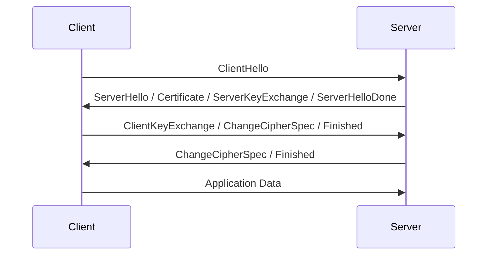
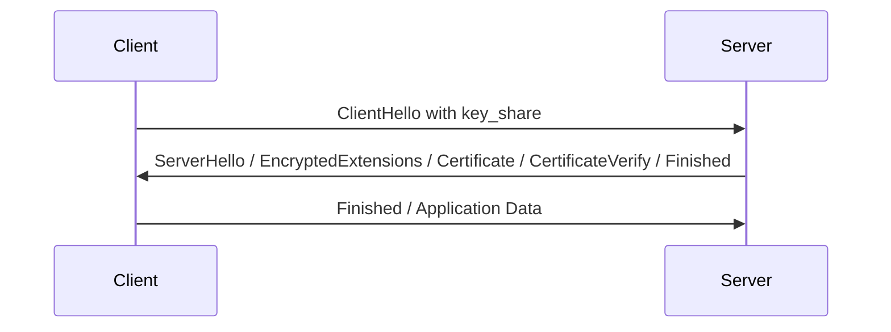
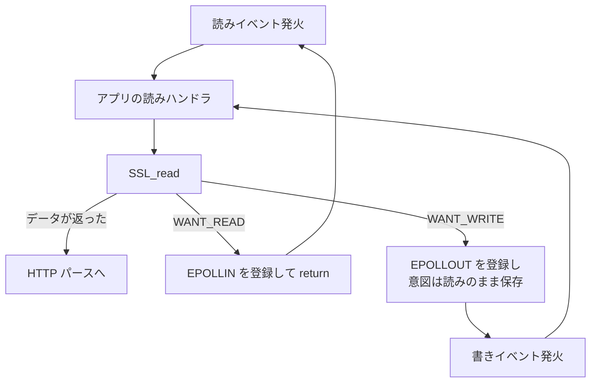

## なぜこれを先に知る必要があるか

[ノンブロッキング I/O と多重化のページ](../nonblocking-multiplexing/) までで、サーバの中心は「fd が読めるようになった/書けるようになったという通知を受けて、その fd に対して `read()` / `write()` を呼ぶ」という形になった。TLS はこの形を素直には壊さない、ように見える。`read()` を `SSL_read()` に、`write()` を `SSL_write()` に差し替えればいいだけに見える。

実際には壊れる。理由は 1 つで、**`SSL_read()` は読むためにネットワークへ書くことがある**。アプリケーションが 1 バイトも送るつもりがなくても、TLS 層は自分の都合でパケットを送りたがる。ハンドシェイクがそうだし、鍵更新もそうだし、TLS 1.2 の再ネゴシエーションもそうだ。

イベント駆動サーバは「この fd について何を待っているか」を epoll に登録して寝る。その「何を待っているか」を決めるのがアプリケーションではなく TLS ライブラリになる、というのがこのページの主題だ。加えて、TLS はハンドシェイクの途中でサーバに 2 つの判断を要求する。どの証明書を出すか (SNI) と、この接続でどのアプリケーションプロトコルを話すか (ALPN)。後者は HTTP/1.1 の実装を使うか HTTP/2 の実装を使うかの分岐そのもので、ハンドシェイクが終わるまで確定しない。

## ハンドシェイクが何往復するか

### TLS 1.2 の 2-RTT

RFC 5246 のフルハンドシェイクは、アプリケーションデータが流れ始めるまでに 2 往復かかる。



TCP の 3-way handshake が先に 1 往復かかっているので、クライアントが「GET / HTTP/1.1」を送れるのは接続開始から 3 RTT 後になる。東京とバージニアの間で RTT が 150ms なら 450ms、まだ 1 バイトも HTTP を話していない。

サーバがこの間に何を待っているかを段階ごとに書き出すと、以下になる。

| 段階                   | サーバが待っているもの    | サーバが持っている情報                         |
| ---------------------- | ------------------------- | ---------------------------------------------- |
| 接続確立直後           | ClientHello (読み)        | 何も無い。ローカルアドレスだけ                 |
| ClientHello 受信後     | 送信バッファの空き (書き) | SNI・ALPN・cipher suite 候補・supported_groups |
| ServerHelloDone 送信後 | ClientKeyExchange (読み)  | 選んだ証明書と cipher                          |
| Finished 受信後        | 送信バッファの空き (書き) | セッション鍵                                   |
| ハンドシェイク完了     | HTTP リクエスト (読み)    | 全部                                           |

読みたい状態と書きたい状態が交互に来る。しかも各段階の境界は、アプリケーションからは見えない。

### TLS 1.3 の 1-RTT

RFC 8446 は、ClientHello に鍵共有のパラメータ (`key_share` 拡張) を投機的に載せることで往復を 1 つ削った。



クライアントは「サーバはたぶん X25519 を使うだろう」と当たりをつけて、その群での公開鍵を最初から送る。当たれば ServerHello の時点で共有鍵が計算でき、サーバは同じフライトで証明書まで送り切れる。証明書が暗号化された状態で飛ぶようになったのも 1.3 の変化で、`EncryptedExtensions` 以降はハンドシェイク鍵で保護される。

外れたときは `HelloRetryRequest` が返り、クライアントが正しい群で `key_share` を送り直す。このときだけ 2-RTT に戻る。**「1.3 は 1-RTT」は投機が当たった場合の話**で、サーバが対応する群を絞りすぎると全接続が 2-RTT になる。

### 1.3 が消したもの

TLS 1.3 は往復を削るだけでなく、選択肢を大きく削った。サーバ実装の観点では、消えたもののほうが影響が大きい。

- **静的 RSA 鍵交換。** クライアントが乱数を証明書の公開鍵で暗号化して送る方式が無くなり、鍵交換は (EC)DHE だけになった。前方秘匿性が常に得られる代わりに、「サーバの秘密鍵さえあれば通信をあとから復号できる」という運用 (受動的な復号による監視) が成立しなくなった。
- **再ネゴシエーション。** 後述のクライアント証明書の要求も含め、ハンドシェイクのやり直しという機構が無くなった。
- **TLS レベルの圧縮。** CRIME 攻撃の原因だったもの。
- **cipher suite の中身の統合。** 1.2 の cipher suite は「鍵交換 + 認証 + 暗号 + MAC」を 1 つの識別子で表していたが、1.3 では暗号と MAC だけになり、鍵交換と署名は別の拡張で決まる。組み合わせ爆発が消え、選択肢は 5 個程度になった。

結果として、**サーバが設定できるつまみが減り、間違えられる余地も減った**。1.2 の cipher suite の並び順を手で書くという作業が、1.3 では実質不要になっている。ただし 1.2 を切れない限り両方の設定が残るので、実装は 2 つのモデルを同時に抱える。

### 0-RTT と、その代償

一度接続したことのあるサーバに対しては、前回もらった PSK (`NewSessionTicket`) を使って、ClientHello と同じパケットにアプリケーションデータを載せられる。`early_data` 拡張で宣言し、`0-RTT` 用に導出した鍵で暗号化する。往復は 0 になる。

問題は、この early data に **リプレイ耐性が無い**ことだ。0-RTT のデータは、ハンドシェイクがまだ完了していない時点で送られる。つまりサーバは「このデータが今このクライアントから来た」ことを確認できていない。経路上でパケットを記録した第三者が、同じバイト列を後からもう一度サーバに投げると、サーバは同じリクエストをもう一度処理してしまう。

RFC 8446 は完全な対策を規定していない。緩和策として挙がるのは以下で、どれも部分的だ。

- **チケットを 1 回しか使えないようにする。** サーバ側にチケットの使用済み記録が要る。プロセスが複数あればその記録を共有しなければならず、マシンが複数あればさらに厳しくなる。
- **`obfuscated_ticket_age` で新鮮さを見る。** チケット発行からの経過時間が申告と合わなければ拒否する。時計のずれと、リプレイの遅延が短い場合に効かない。
- **アプリケーション側で冪等なリクエストにだけ許す。** GET と HEAD は通し、POST は 0-RTT を拒否して 1-RTT のハンドシェイク完了を待たせる。

3 つ目が実務上の答えになっている。つまり **TLS の設定が HTTP のメソッドを見る**ということで、層の分離が破れている。0-RTT を有効にすると、TLS 終端層が HTTP のセマンティクスを知っていなければならなくなる。

サーバがこれを実装するには、「このバイト列は early data として届いた」という印を、復号したデータに付けて上へ渡す仕組みが要る。OpenSSL では `SSL_read_early_data()` という別の関数と、`SSL_get_early_data_status()` による判定が用意されている。受け取ったリクエストを解釈して、危ないと判断したら `425 Too Early` を返して再送させる。HTTP のステータスコードが 1 つ、TLS のリプレイ問題のために存在している。

### 往復だけでなく計算も高い

RTT を削る話とは別に、ハンドシェイクは CPU を食う。フルハンドシェイクでサーバが払うのは、証明書の秘密鍵による署名 (RSA 2048 の署名、あるいは ECDSA P-256 の署名) と、鍵共有の演算 (ECDHE の点乗算) だ。以降のレコード暗号化 (AES-GCM や ChaCha20-Poly1305) は AES-NI などのハードウェア支援があれば桁違いに安いので、**TLS のコストは接続数に比例し、転送量にはあまり比例しない**。

この非対称性が、そのまま設計判断につながる。

- 短い接続を大量に張られると、ハンドシェイクだけで CPU が飽和する。TLS ハンドシェイクを大量に投げる攻撃が成立するのはこのためで、接続レート制限が転送量の制限より先に要る。
- 再開機構 (次節) の価値が、単なるレイテンシ改善ではなくスループットの問題になる。
- keepalive を長く保つことに、平文のとき以上の意味が出る。接続を使い回すたびにハンドシェイク 1 回ぶんの CPU が浮く。

RSA 鍵と ECDSA 鍵で署名のコストが違い、しかも RSA は検証が安く署名が高い (クライアント側が楽でサーバ側が重い) という非対称性もある。ECDSA はその逆に近い。サーバ実装にとっては、**証明書の鍵の種類が CPU 予算を決める**。

## サーバ実装から見た TLS の本質

### read と write の間に挟まる変換層

平文のサーバは、fd とアプリケーションの間が直結している。

```
[NIC] -> [socket recv buffer] -> read() -> [アプリのバッファ]
```

TLS が入ると、あいだに状態を持った変換器が挟まる。

```
[NIC] -> [socket recv buffer] -> read() -> [TLS レコード層] -> SSL_read() -> [アプリのバッファ]
                                              |
                                              +-- ハンドシェイク状態機械
                                              +-- 鍵と sequence number
                                              +-- 未完成レコードのバッファ
```

ここまでなら、単にレイヤが 1 枚増えただけだ。厄介なのは矢印の向きで、TLS レコード層は **下向きの矢印も自分で使う**。ハンドシェイクのフライト、`ChangeCipherSpec`、鍵更新の `KeyUpdate`、警告の `Alert`、そして TLS 1.2 の再ネゴシエーション。これらはアプリケーションが `SSL_write()` を呼んでいないのに送信を必要とする。

言い換えると、TLS 層は自分の下にある I/O を、アプリケーションとは独立に駆動する権利を持っている。アプリケーションから見た `SSL_read()` は「読む関数」だが、その内部では送信が起きうる。

### SSL_read が「書きたい」と言う

OpenSSL の API はこの非対称性を、エラーコードで表に出している。`SSL_read()` / `SSL_write()` が失敗したとき、`SSL_get_error()` は次のどれかを返す。

```c
#define SSL_ERROR_NONE                  0
#define SSL_ERROR_SSL                   1
#define SSL_ERROR_WANT_READ             2
#define SSL_ERROR_WANT_WRITE            3
#define SSL_ERROR_WANT_X509_LOOKUP      4
#define SSL_ERROR_SYSCALL               5
#define SSL_ERROR_ZERO_RETURN           6
#define SSL_ERROR_WANT_CONNECT          7
#define SSL_ERROR_WANT_ACCEPT           8
#define SSL_ERROR_WANT_ASYNC            9
#define SSL_ERROR_WANT_CLIENT_HELLO_CB 12
```

`SSL_read()` が `SSL_ERROR_WANT_WRITE` を返すのは、この操作を先に進めるにはソケットに書けなければならない、という意味だ。逆に `SSL_write()` が `SSL_ERROR_WANT_READ` を返すこともある。

イベント駆動サーバはここで 2 つの情報を分けて持つ必要が出る。

1. **アプリケーションがやりたいこと** — 「HTTP リクエストを読みたい」
2. **TLS がそのために待っているもの** — 「送信バッファが空くのを待っている」

epoll に登録するのは 2 のほうだ。そして通知が来たら 1 に戻る。つまり、読みハンドラが呼ばれたのに書きイベントを登録する、書きイベントで起きたのに読みハンドラを再開する、という交差が起きる。平文のサーバでは「読みイベント → 読みハンドラ」が固定だったところが、固定でなくなる。

```
アプリ: リクエストを読みたい
  -> SSL_read()
  -> SSL_ERROR_WANT_WRITE
  -> epoll に EPOLLOUT を登録して return
  ...
  -> EPOLLOUT で起床
  -> 「自分は読みたかった」ことを思い出して SSL_read() を再試行
```

「自分は読みたかった」をどこに覚えておくかが、実装上の設計判断になる。接続オブジェクトに保存する、ハンドラの関数ポインタを保存しておく、あるいは読みと書きの両方のハンドラを同じ関数に向ける。

図にすると、平文のときは 1 本だった経路が 2 本に分かれる。



`WANT_WRITE` の枝だけ、epoll に登録するイベントの種類とハンドラの意図がずれる。この 1 本の枝のために、接続ごとに「今この接続は何をしようとしていたか」を保持する場所が要る。

もう 1 点、**リトライは同じ引数で行わなければならない**という制約がある。`SSL_write()` が `WANT_WRITE` で戻ったとき、次に呼ぶときは同じバッファの同じ長さを渡す必要がある (`SSL_MODE_ACCEPT_MOVING_WRITE_BUFFER` や `SSL_MODE_ENABLE_PARTIAL_WRITE` を立てない限り)。既に一部のレコードを暗号化してバッファに積んでいるので、途中で内容が変わると整合性が壊れるからだ。書きかけのバッファを保持し続ける責任がアプリケーション側に残る。

### レコード境界というもう 1 つの単位

TLS はバイトストリームではなくレコードの列を送る。1 レコードの平文は最大 2^14 = 16384 バイト (RFC 8446 の `TLSPlaintext.length` の上限)、これに MAC/AEAD タグとヘッダが付く。

```
+--------+--------+--------+--------+--------+
|  type  |     version     |     length      |
| 1 byte |     2 bytes     |     2 bytes     |
+--------+--------+--------+--------+--------+
|                 fragment                   |
|              length bytes                  |
+--------------------------------------------+
```

復号は **レコード全体が揃わないとできない**。AEAD の認証タグはレコード末尾にあり、タグを検証する前に平文を上位に渡すわけにいかない。だから TCP から 16KB のレコードの先頭 1KB だけ届いた状態では、`SSL_read()` は 1 バイトも返せない。ここでも TLS 層は自前のバッファを持つことになる。

この性質は、レイテンシに直結する。レスポンスを 16KB のレコード 1 個で送ると、クライアントは 16KB 全部が届くまで先頭 1 バイトも処理できない。回線が細ければこれは体感できる遅延になる。逆にレコードを小さく刻むと、レコードあたりのオーバーヘッド (ヘッダ 5 バイト + タグ 16 バイト) とシステムコール回数が増える。**最初の数レコードだけ小さくして、あとは大きくする**という調整が実装側でよく行われるのは、この trade-off に対する応答だ。

初期輻輳ウィンドウに収まるサイズ (おおむね 1.4KB × 10) までを小さいレコードで送れば、最初の往復で届いたぶんをクライアントが即座に処理できる。HTML の先頭が届いた時点でブラウザがパースを始められるかどうかが変わる。そのあとは 16KB に戻してオーバーヘッドを削る。つまり **同じ接続の中でレコードサイズを動的に変える**という制御が、TLS 終端層の責務として乗ってくる。

さらに、レコード境界はバイト数の会計にも影響する。アプリケーションが `SSL_write()` に 100KB 渡しても、実際にソケットへ出るのはレコードに分割されヘッダとタグが付いたバイト列で、平文より数百バイト多い。ソケットの送信バッファが埋まって部分的にしか書けなかったとき、「平文で何バイト消費したか」と「暗号文で何バイト送ったか」は一致しない。この 2 つの座標系を混同すると、送信位置がずれる。ライブラリが平文側の座標を返してくれるので普段は意識しないが、[バッファとチェーンのページ](../buf-chain/) のようにバッファの消費位置を自分で管理する層とつなぐときに問題になる。

### 接続 1 本あたりのメモリが増える

[並行性モデルのページ](../concurrency-models/) で見たとおり、数万接続を捌くサーバは接続あたりのメモリに敏感になる。平文なら接続オブジェクトと読み書きのバッファで済むところに、TLS は次を上乗せする。

- ハンドシェイクの状態機械と、そのための中間データ (トランスクリプトハッシュ、鍵スケジュール)
- 受信レコードの組み立てバッファと、送信レコードの生成バッファ。デフォルトではどちらもレコード上限に合わせて 16KB 前後を確保する実装が多い
- ネゴシエートされた結果 — cipher、ALPN で選ばれたプロトコル、SNI で受け取ったホスト名、検証済みのピア証明書
- 再開のためのセッションオブジェクト

このうち **バッファは、ハンドシェイクが終わってアイドルになった接続でも確保されたまま**になりやすい。keepalive で 60 秒待っている接続が 5 万本あれば、それだけで数 GB になる。OpenSSL に `SSL_MODE_RELEASE_BUFFERS` があるのは、この事情への対処だ。アイドル時にバッファを解放し、必要になったら取り直す。

TLS 終端をどこに置くかという判断 (このページの最後の節) が、単なるセキュリティ境界の話ではなく容量計画の話にもなるのは、この上乗せがあるからだ。

## ハンドシェイクの途中でサーバが決めること

### SNI — 証明書はまだ選べていない

1 つの IP アドレスと 1 つのポートで複数のホスト名を扱いたい。HTTP/1.1 なら `Host:` ヘッダで解決できる (詳しくは [HTTP/1.1 の線の上のページ](../http1-wire/))。ところが TLS では、証明書を送るのは `Host:` を読むよりずっと前だ。証明書はハンドシェイクの中で送られ、`Host:` はハンドシェイクが終わってから届く。

RFC 6066 の `server_name` 拡張がこれを解いた。クライアントが ClientHello に、これから接続したいホスト名を載せる。

```
struct {
    NameType name_type;
    select (name_type) {
        case host_name: HostName;
    } name;
} ServerName;

enum { host_name(0), (255) } NameType;
opaque HostName<1..2^16-1>;
```

ClientHello は **まだ暗号化されていない**。鍵交換が済んでいないのだから当然だが、結果として **アクセス先のホスト名が経路上のあらゆる装置から平文で見える**。TLS がホスト名を隠せないという事実は、検閲と SNI ベースのフィルタリングの土台になっている。ECH (Encrypted Client Hello) はこれを塞ぐための拡張で、外側の ClientHello に別のホスト名を書き、本物を暗号化して内側に入れる。

サーバ実装への影響は、証明書の選択がコールバックになることだ。OpenSSL では次の 2 つが用意されている。

```c
/* SNI だけを見る。ServerHello を作る直前に呼ばれる */
int SSL_CTX_set_tlsext_servername_callback(SSL_CTX *ctx,
                                           int (*cb)(SSL *s, int *al, void *arg));

/* ClientHello 全体を生のまま見る。より早い段階で呼ばれる */
void SSL_CTX_set_client_hello_cb(SSL_CTX *c, SSL_client_hello_cb_fn cb, void *arg);
```

コールバックの中でやることは、ホスト名から仮想サーバの設定を引き、その設定に紐づく `SSL_CTX` に切り替える (`SSL_set_SSL_CTX()`) ことだ。つまり **接続を受け付けた時点ではどの仮想サーバの設定が適用されるか決まっていない** ということで、TLS の設定項目のうち何がホストごとに切り替え可能かは、ライブラリのコールバック位置で決まる。証明書は切り替えられるが、cipher suite の一部やプロトコルバージョンは、コールバックが呼ばれる時点で既に確定していることがある。

`SSL_CTX_set_client_hello_cb` のほうが早い段階で呼ばれるのは、この制約を緩めるために後から追加されたものだ。ClientHello のパース結果を全部見られるので、cipher の選択より前に `SSL_CTX` を差し替えられる。

### ALPN — プロトコル実装の選択がここに乗る

RFC 7301 の `application_layer_protocol_negotiation` 拡張は、クライアントが話せるプロトコルのリストを ClientHello に載せ、サーバが 1 つ選んで ServerHello で返す仕組みだ。値は `"http/1.1"`, `"h2"`, `"h3"` などのバイト列。

```c
typedef int (*SSL_CTX_alpn_select_cb_func)(SSL *ssl,
                                           const unsigned char **out,
                                           unsigned char *outlen,
                                           const unsigned char *in,
                                           unsigned int inlen,
                                           void *arg);
```

`in` にクライアントの候補リストが `[長さ1バイト][文字列]...` の形で入っていて、サーバは選んだ 1 つを `out` に書く。選ばなければ、クライアントは HTTP/1.1 にフォールバックする。

RFC 9113 は、TLS 上の HTTP/2 では ALPN による `"h2"` の合意を **必須** としている。Upgrade ヘッダによる HTTP/2 への昇格は平文の場合しか無く、しかもそちらも RFC 9113 で削除された。つまり **HTTPS で HTTP/2 を話すかどうかは、ハンドシェイクの中でしか決まらない**。

サーバ実装から見ると、これは重い。ハンドシェイクを終えた時点で、この接続の読み書きを担当するコードが分岐する。HTTP/1.1 ならリクエスト行をパースする状態機械へ、HTTP/2 なら接続プリフェイスを待ってフレームをパースする状態機械へ。この 2 つは扱う単位がまるで違う (1 接続 1 リクエスト vs 1 接続 N ストリーム、詳しくは [HTTP/2 と HTTP/3 のページ](../http2-http3/))。TLS 終端のコードは、その分岐の直前まで両方に共通でなければならない。

## 接続を張り直さないための仕組み

フルハンドシェイクは往復だけでなく計算も高い。RSA の署名なり ECDHE の鍵導出なりが接続ごとに走る。同じクライアントが戻ってきたときに、これを省略したい。

### session ID キャッシュ

TLS 1.2 までの古典的な方法。サーバがセッションに ID を振り、鍵を含むセッション状態を自分の側に保存する。クライアントは次回の ClientHello にその ID を載せ、サーバがキャッシュを引ければ短縮ハンドシェイク (1 往復) で済む。

サーバが状態を持つので、**キャッシュはハンドシェイクを行うプロセス全員から見えなければならない**。ワーカープロセスが 8 個あって、それぞれが独立したキャッシュを持っていたら、ヒット率は 1/8 になる。プロセス間で共有するには共有メモリが要り、そこにポインタを含むデータ構造を置けないという別の制約が来る (この問題そのものについては [スラブとメモリ共有のページ](../slab-shared-memory/))。

### session ticket

RFC 5077 の方法。サーバは状態を持たず、セッション状態を自分だけが知っている鍵 (STEK, Session Ticket Encryption Key) で暗号化して、クライアントに持たせる。次回クライアントがチケットを送り返してきたら、復号して中身を取り出す。

サーバ側の状態が消えるので、プロセス間の共有問題は「キャッシュの共有」から「鍵の共有」に変わる。鍵は小さいので、設定ファイルに書いたファイルから読ませればいい。ただし今度は別の問題が 2 つ出る。

- **鍵のローテーション。** STEK を一度も更新しなければ、その鍵が漏れた時点で過去に記録された全通信が復号できる。前方秘匿性が壊れる。定期的に更新し、古い鍵は復号用にしばらく残す必要がある。
- **マシンをまたぐ共有。** ロードバランサの後ろに 10 台あるなら、どの台に着弾してもチケットが通るように 10 台で同じ鍵を持たなければならない。持たなければ再開が失敗してフルハンドシェイクに落ちる。持たせるなら、鍵を配る仕組みと更新の同期が要る。

TLS 1.3 では session ID による再開が廃止され、`NewSessionTicket` で配る PSK に一本化された。0-RTT もこの PSK の上に乗る。つまり **再開機構の共有問題は、そのまま 0-RTT のリプレイ防止の共有問題になる**。単一使用を保証したければ、使用済みチケットの記録を全プロセス・全マシンで共有する必要がある。

### 再開しても省略されないもの

再開が成立しても、SNI と ALPN のネゴシエーションは毎回やり直される。クライアントは再開のときも ClientHello に `server_name` と ALPN を載せるし、サーバはそれに応えなければならない。省略されるのは証明書の送信と署名、鍵交換の演算だけだ。

つまり **SNI のコールバックは接続のたびに呼ばれる**。ここでホスト名から設定を引く処理が重ければ、再開で節約したぶんが相殺される。ホスト名から仮想サーバへの索引が、線形探索ではなくハッシュや木でなければならない理由がここにある。

もう 1 つ、再開の成否をサーバが完全には制御できないという点がある。クライアントがチケットを捨てていれば (プライベートブラウジング、プロセス再起動、キャッシュ上限)、フルハンドシェイクになる。再開率は環境依存で、**CPU の見積もりは「全部フルハンドシェイクだったら」で立てるしかない**。

### OCSP stapling

証明書が失効していないかをクライアントが確かめる方法は、素朴には OCSP レスポンダに問い合わせることだ。しかしそれではクライアントが接続のたびに第三者と通信することになり、遅いし、どのサイトを見たかがレスポンダに漏れる。

RFC 6066 の `status_request` 拡張による stapling は、**サーバが代わりに OCSP レスポンスを取ってきて、ハンドシェイクの中で一緒に渡す**。TLS 1.2 では `CertificateStatus` メッセージ、TLS 1.3 では `Certificate` メッセージの中の拡張として運ばれる。

サーバ実装から見ると、これはハンドシェイクの外側にネットワーク I/O を 1 本追加するということだ。OCSP レスポンスには有効期限があるので、定期的に取り直す必要がある。取りに行っている最中に来た接続をどうするかという判断も要る (stapling 無しで進めるか、待たせるか)。そして OCSP レスポンダへの HTTP リクエストを、自分がイベントループを回しながら発行しなければならない。**TLS 終端が、外向きの HTTP クライアントを内包することになる。**

## 証明書チェーンでサーバが背負うもの

サーバが送るのは自分の証明書 1 枚ではなく、そこからルート CA の手前までのチェーンだ。

```
[end-entity: example.com]  <- サーバの秘密鍵に対応する証明書
        ^ 署名
[intermediate CA]           <- サーバが一緒に送らなければならない
        ^ 署名
[root CA]                   <- クライアントの信頼ストアにある。送らない
```

中間証明書を送り忘れると、**動くクライアントと動かないクライアントに分かれる**。証明書に AIA (Authority Information Access) 拡張があり、クライアントがそれを辿って中間証明書を自分で取りに行く実装なら繋がる。多くのブラウザはこれをやるが、`curl` や言語ランタイムの HTTP クライアント、モバイルアプリの中の TLS スタックはやらないことが多い。「ブラウザでは見えるのに API 呼び出しだけ失敗する」という症状の典型的な原因がこれだ。

サーバ実装から見た帰結は、証明書ファイルの読み込みが「1 枚の証明書」ではなく「順序のあるチェーン」を扱うということ。そして SNI で証明書を切り替えるなら、チェーンも一緒に切り替わる。証明書と鍵とチェーンと OCSP レスポンスが 1 組で、SNI のキーごとにその組を持つ、というデータ構造になる。

## クライアント証明書を要求するとき

相互 TLS では、サーバが `CertificateRequest` を送ってクライアントにも証明書を出させる。ここにも、往復とサーバ構造への影響がある。

TLS 1.2 では `CertificateRequest` は最初のフライトに含まれる。つまり **接続を受け付けた時点で、クライアント証明書を要求するかどうかを決めていなければならない**。ところが「`/admin` 以下だけクライアント証明書を要求する」といった要求は、URI を見てから決めたい。URI が読めるのはハンドシェイクが終わったあとだ。この矛盾を埋めるために使われたのが再ネゴシエーションで、ハンドシェイク完了後に改めてハンドシェイクをやり直し、そこで `CertificateRequest` を送る。既存の接続の上でハンドシェイクが再度走るので、アプリケーションデータの流れの途中に TLS のメッセージが割り込む。`SSL_read()` が書きたがる典型的な場面がこれだった。

TLS 1.3 は再ネゴシエーションを廃止し、代わりに post-handshake authentication を用意した。ハンドシェイク完了後に `CertificateRequest` を単独で送れる。仕組みとしては整理されたが、サーバ実装から見た性質は変わらない。**アプリケーションデータを読んでいる最中に、TLS 層が独自の往復を始める。**

検証そのものにもコストがある。クライアント証明書の失効確認は stapling ができない (staple するのはサーバ側の証明書だけ) ので、CRL を持つか OCSP を自分で引くかになる。前者はファイルを読んでメモリに持つ話、後者はハンドシェイクの途中で外向きの HTTP を投げる話になる。

## 接続の終わり方も TLS が握る

平文の TCP なら、終わりは `read()` が 0 を返すことで分かる。TLS はその上に `close_notify` アラートを重ねる。

```
enum { warning(1), fatal(2), (255) } AlertLevel;
enum {
    close_notify(0),
    unexpected_message(10),
    bad_record_mac(20),
    handshake_failure(40),
    bad_certificate(42),
    certificate_expired(45),
    protocol_version(70),
    internal_error(80),
    user_canceled(90),
    no_renegotiation(100),
    unrecognized_name(112),
    (255)
} AlertDescription;
```

`close_notify` を受け取らずに TCP が切れた場合、それは相手が正常に終わったのか、経路上の誰かが接続を切ったのかを区別できない。区別できないと **truncation attack** が成立する。レスポンスの後半を攻撃者が切り落として、クライアントに「これで全部だ」と思わせられる。だから TLS はストリームの終端を明示的に伝える。

サーバ実装への影響は 3 つある。

- **終了処理そのものが I/O を要求する。** `close()` を呼ぶ前に `close_notify` を送らなければならない。`SSL_shutdown()` は送信バッファが埋まっていれば `WANT_WRITE` を返す。つまり接続を閉じる処理が、ノンブロッキングで、リトライ可能で、しかもいつまでも待てないので上限付きでなければならない。
- **相手の `close_notify` を待つかどうかの判断が要る。** `SSL_shutdown()` は 1 回目の呼び出しで自分のアラートを送り、`0` を返す。相手のアラートを受け取るともう一度呼んで `1` が返る。サーバは大抵、相手のアラートを待たない。待つと、応答しないクライアントに対して接続と fd を握り続けることになる。
- **切断のログが曖昧になる。** `close_notify` 無しの切断は、正常なクライアントの打ち切り (ブラウザのタブを閉じた) でも起きるし、異常でも起きる。ここを一律にエラーとして記録すると、ログがノイズで埋まる。

さらに、TLS は TCP のハーフクローズをそのままは表現しない。TCP なら `shutdown(fd, SHUT_WR)` で「もう送らないが受け取りは続ける」と言えるが、TLS で `close_notify` を送ると、実装によってはそこで双方向が終わったとみなされる。**「レスポンスは送り切ったが、クライアントがまだ送っているリクエストボディを読み捨てたい」** という、HTTP では日常的に起きる状況の処理が、平文のときより面倒になる。

## TLS 終端をどこに置くか

TLS を解く場所は、経路上のどこか 1 箇所以上になる。選択肢は大きく 3 つ。

**ロードバランサで終端する。** L7 ロードバランサや CDN が TLS を解き、後段には平文で流す。証明書の管理が 1 箇所に寄り、アプリケーションサーバは TLS を一切知らなくてよくなる。後段が平文なので、[ファイル配信のページ](../os-file-serving/) で扱う `sendfile()` のようなゼロコピーがそのまま効く。代償は、ロードバランサとアプリケーションサーバの間のネットワークを信頼しなければならないこと。そして、クライアント証明書やクライアントの IP アドレスといった「TLS/TCP レベルの情報」を、別の手段 (`X-Forwarded-For` や PROXY protocol) でアプリケーションに伝え直す必要がある。

**リバースプロキシで終端する。** [リバースプロキシのページ](../reverse-proxy/) の構成で、プロキシが TLS を解いて後段のアプリケーションサーバへ渡す。上と同じ性質だが、プロキシ自身が HTTP を理解しているぶん、キャッシュや圧縮を TLS の内側でかけられる。プロキシから上流へ改めて TLS を張り直す (再暗号化) 構成も取れて、その場合プロキシは TLS サーバであると同時に TLS クライアントにもなる。ハンドシェイクの状態機械を、下流側と上流側の両方に持つことになる。

**アプリケーションで終端する。** 中間装置が無く、経路上のどこにも平文が出ない。代わりに、アプリケーションのプロセスが証明書と鍵を持ち、ハンドシェイクの CPU を払い、OCSP を取りに行き、SNI のコールバックを書く。

終端の位置を決めると、それに引きずられて決まることがもう 1 つある。**TLS でしか分からない情報を、どうやって後段へ渡すか**だ。クライアント証明書の Subject、ネゴシエートされた cipher とプロトコルバージョン、SNI で送られてきたホスト名、セッションが再開されたかどうか。これらは終端した装置しか知らない。後段がこれらを使って認可を判断するなら、リクエストヘッダに詰めて渡すことになる。

そのとき、**同じ名前のヘッダをクライアントが送ってきたら消す**という処理が必須になる。`X-Client-Cert-Subject` をクライアントが自称できてしまうと、認可が丸ごと迂回される。終端点が「信頼できるヘッダを作る唯一の場所」になると同時に、「信頼できないヘッダを消す唯一の場所」にもなる。

どれを選んでも、**終端した点より後ろが平文かどうか**が設計上の分水嶺になる。平文なら OS のゼロコピー機構が使え、ペイロードを触らずに転送できる。暗号化されているなら、バイト列は必ず一度ユーザ空間に上がってくる。カーネル TLS (kTLS) はこの境界を動かそうとする仕組みで、対称鍵をカーネルに渡してレコードの暗号化をカーネル側でやらせる。そうすればページキャッシュからソケットへの直接転送と TLS が両立する。ただしハンドシェイクはユーザ空間のままで、鍵更新のたびにカーネルへ鍵を入れ直す必要がある。

## Nginx ではどうなるか

- TLS 層が `c->recv` / `c->send` という関数ポインタの差し替えとして割り込み、`SSL_ERROR_WANT_WRITE` をイベント登録に翻訳する具体的な形は [TLS 層のページ](../ssl-layer/)。SNI と ALPN のコールバックがどこで呼ばれるかもここで扱う。
- 差し替えられる側の `c->recv` / `c->send` が何であり、どうやってイベントメソッドごとの差を吸収しているかは [イベントメソッドのページ](../event-methods/)。
- ALPN で `"h2"` が選ばれたあと、「1 接続 1 リクエスト」を前提に書かれた HTTP 層にどう接続するかは [HTTP/2 多重化のページ](../http2-multiplexing/)。
- TLS 1.3 のハンドシェイクをトランスポートの一部として組み込んだ QUIC の側は [QUIC トランスポートのページ](../quic-transport/)。
- session ID キャッシュをワーカープロセス間で共有するための、ポインタを使えないアロケータは [スラブとメモリ共有のページ](../slab-shared-memory/)。
- OCSP レスポンダへの問い合わせがイベントループの中の外向き通信になる話は、名前解決を自前で持つ [リゾルバのページ](../resolver/) と同じ構図になる。
