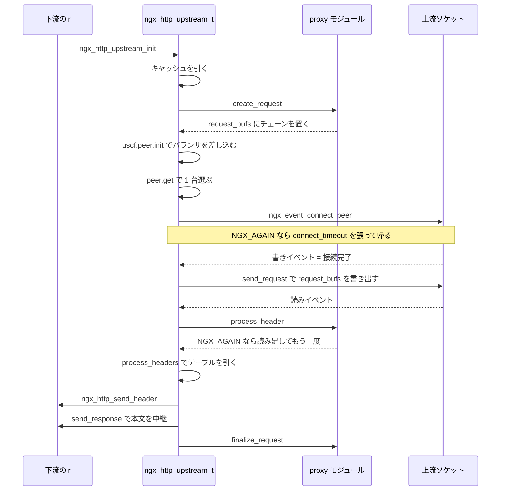

## この層の責務

`src/http/ngx_http_upstream.c` は 7352 行ある。単一ファイルとしては Nginx でも最大級だが、やっている仕事は 1 文で書ける。**上流に繋いでリクエストを送り、応答を受けて下流へ流す。**

そこに「どんなバイト列を送るか」「返ってきたバイト列をどう解釈するか」は入っていない。それは利用者側のモジュールが持つ。

| モジュール                    | 行数 | プロトコル       |
| ----------------------------- | ---- | ---------------- |
| `ngx_http_proxy_module.c`     | 5467 | HTTP/1.x         |
| `ngx_http_proxy_v2_module.c`  | 4314 | HTTP/2           |
| `ngx_http_grpc_module.c`      | 5344 | gRPC             |
| `ngx_http_fastcgi_module.c`   | 3991 | FastCGI          |
| `ngx_http_uwsgi_module.c`     | 2803 | uwsgi            |
| `ngx_http_scgi_module.c`      | 2179 | SCGI             |
| `ngx_http_memcached_module.c` | 736  | memcached        |
| `ngx_http_tunnel_module.c`    | 537  | CONNECT トンネル |

8 モジュール、合計 25371 行。これらが共有している骨格が `ngx_http_upstream.c` の 7352 行と、負荷分散の `ngx_http_upstream_round_robin.c` の 1279 行、応答の中継の `ngx_event_pipe.c` の 1146 行になる。

memcached が 736 行で済んでいるのが、この分割の効き方を一番よく示している。memcached プロキシとして必要なコード — 接続、再試行、負荷分散、タイムアウト、キャッシュ、バッファ管理 — のうち、memcached 固有なのは `get <key>\r\n` を組み立てることと `VALUE <key> <flags> <bytes>\r\n` を読むことだけだ。

リバースプロキシが何を引き受けるかという一般論は [reverse-proxy](../reverse-proxy/) を参照。ここでは Nginx がその仕事をどう配線したかだけを追う。

## 主要な型とその関係

### `ngx_http_upstream_t` — リクエスト 1 本ぶんの上流側の状態

[`src/http/ngx_http_upstream.h#L342-L426`](https://github.com/nginx/nginx/blob/release-1.31.4/src/http/ngx_http_upstream.h#L342-L426)。85 行の構造体を、役割ごとに分類するとこうなる。

| 役割                            | フィールド                                                                                          |
| ------------------------------- | --------------------------------------------------------------------------------------------------- |
| 状態に応じて差し替わるハンドラ  | `read_event_handler` / `write_event_handler`                                                        |
| 上流への接続                    | `peer` (`ngx_peer_connection_t`)                                                                    |
| 送信するリクエスト              | `request_bufs` / `output` / `writer`                                                                |
| 受信したヘッダ                  | `headers_in` / `buffer` / `length`                                                                  |
| 応答の中継 (バッファリングあり) | `pipe`                                                                                              |
| 応答の中継 (バッファリングなし) | `out_bufs` / `busy_bufs` / `free_bufs`                                                              |
| プロトコル固有の差し替え点      | 関数ポインタ 10 本                                                                                  |
| 設定                            | `conf` / `upstream` / `caches`                                                                      |
| 名前解決の結果                  | `resolved`                                                                                          |
| 計測                            | `start_time` / `state`                                                                              |
| フラグ                          | `store` / `cacheable` / `buffering` / `keepalive` / `upgrade` / `request_sent` / `header_sent` ほか |

`buffer` と `length` の組が受信側の中心にいる。`buffer` は「まずヘッダを読むための 1 枚」で、大きさは `proxy_buffer_size` (既定でページサイズ)。`length` は「あと何バイト来るはずか」で、`-1` は「分からない」を表す。

`peer` の型 `ngx_peer_connection_t` ([`src/event/ngx_event_connect.h#L36-L79`](https://github.com/nginx/nginx/blob/release-1.31.4/src/event/ngx_event_connect.h#L36-L79)) には `get` / `free` / `notify` の 3 本と、SSL セッション用の `set_session` / `save_session` が入っている。**上流への接続の実体は `ngx_http_upstream_t` ではなく `ngx_peer_connection_t` が持つ。** この分離があるので、同じ負荷分散モジュールを HTTP と [stream モジュール](../stream-module/) の両方から使える。

### 10 本の関数ポインタ

[`src/http/ngx_http_upstream.h#L375-L391`](https://github.com/nginx/nginx/blob/release-1.31.4/src/http/ngx_http_upstream.h#L375-L391)。

```c title="src/http/ngx_http_upstream.h"
    ngx_int_t                      (*input_filter_init)(void *data);
    ngx_int_t                      (*input_filter)(void *data, ssize_t bytes);
    void                            *input_filter_ctx;

#if (NGX_HTTP_CACHE)
    ngx_int_t                      (*create_key)(ngx_http_request_t *r);
#endif
    ngx_int_t                      (*create_request)(ngx_http_request_t *r);
    ngx_int_t                      (*reinit_request)(ngx_http_request_t *r);
    ngx_int_t                      (*process_header)(ngx_http_request_t *r);
    void                           (*abort_request)(ngx_http_request_t *r);
    void                           (*finalize_request)(ngx_http_request_t *r,
                                         ngx_int_t rc);
    ngx_int_t                      (*rewrite_redirect)(ngx_http_request_t *r,
                                         ngx_table_elt_t *h, size_t prefix);
    ngx_int_t                      (*rewrite_cookie)(ngx_http_request_t *r,
                                         ngx_table_elt_t *h);
```

proxy モジュールがこれらに何を入れるかは [`src/http/modules/ngx_http_proxy_module.c#L920-L960`](https://github.com/nginx/nginx/blob/release-1.31.4/src/http/modules/ngx_http_proxy_module.c#L920-L960) の 40 行に固まっている。`rewrite_redirect` と `rewrite_cookie` だけは条件つきで、`proxy_redirect` / `proxy_cookie_*` が書かれていなければ NULL のまま残る。**フックが NULL であることが「この加工はしない」の表現になっている。**

対応表にするとこうなる。

| フック               | proxy が渡すもの                          | 呼ばれる場所                                     |
| -------------------- | ----------------------------------------- | ------------------------------------------------ |
| `create_key`         | `ngx_http_proxy_create_key`               | `ngx_http_upstream_cache` (キャッシュキーの生成) |
| `create_request`     | `ngx_http_proxy_create_request`           | `ngx_http_upstream_init_request` L669            |
| `reinit_request`     | `ngx_http_proxy_reinit_request`           | `ngx_http_upstream_reinit` L2080                 |
| `process_header`     | `ngx_http_proxy_process_status_line`      | `ngx_http_upstream_process_header` L2580         |
| `input_filter_init`  | `ngx_http_proxy_input_filter_init`        | `ngx_http_upstream_send_response` L3357 / L3605  |
| `input_filter`       | `ngx_http_proxy_non_buffered_copy_filter` | 非バッファ経路の受信ごと                         |
| `pipe->input_filter` | `ngx_http_proxy_copy_filter`              | バッファ経路の受信ごと                           |
| `abort_request`      | `ngx_http_proxy_abort_request`            | **どこからも呼ばれない**                         |
| `finalize_request`   | `ngx_http_proxy_finalize_request`         | `ngx_http_upstream_finalize_request` L4807       |
| `rewrite_redirect`   | `ngx_http_proxy_rewrite_redirect`         | `ngx_http_upstream_rewrite_location` L5734       |
| `rewrite_cookie`     | `ngx_http_proxy_rewrite_cookie`           | `ngx_http_upstream_rewrite_set_cookie`           |

`input_filter` が 2 種類あるのが読み間違えやすいところで、**`u->input_filter` と `u->pipe->input_filter` は別のフック**だ。前者は `(void *data, ssize_t bytes)` で「今 `u->buffer` に何バイト増えたか」を受け取り、後者は `(ngx_event_pipe_t *p, ngx_buf_t *buf)` で「埋まった生バッファ 1 枚」を受け取る。バッファリングの有無で使われるほうが変わる ([upstream-event-pipe](../upstream-event-pipe/))。

`abort_request` は 8 モジュール全部が実装しているのに、`src` 全体を検索しても呼び出し側が存在しない。proxy 版 ([`#L2718-L2725`](https://github.com/nginx/nginx/blob/release-1.31.4/src/http/modules/ngx_http_proxy_module.c#L2718-L2725)) は `ngx_log_debug0` を 1 行出すだけの中身になっている。

### `ngx_http_upstream_conf_t` — 設定の器と 4 つのタイムアウト

[`src/http/ngx_http_upstream.h#L165-L268`](https://github.com/nginx/nginx/blob/release-1.31.4/src/http/ngx_http_upstream.h#L165-L268)。100 行あるが、先頭に並ぶ 4 つのタイムアウトが構造の話に効く。

| タイムアウト            | 張られる場所                                          | 何を測るか                 |
| ----------------------- | ----------------------------------------------------- | -------------------------- |
| `connect_timeout`       | `ngx_http_upstream_connect` L1729、`c->write` に      | `connect()` が完了するまで |
| `send_timeout`          | `ngx_http_upstream_send_request` L2198、`c->write` に | リクエストを送り切るまで   |
| `read_timeout`          | `ngx_http_upstream_send_request` L2269、`c->read` に  | 次の 1 バイトが来るまで    |
| `next_upstream_timeout` | タイマではなく `ngx_http_upstream_next` L4696 の比較  | 再試行を含めた全体の締切   |

**最初の 3 つはソケットのイベントに紐づくタイマで、4 つ目だけがタイマではない。** `next_upstream_timeout` は `ngx_current_msec - u->peer.start_time >= timeout` という比較でしか使われない。「もう次を試す時間がない」という判定であって、進行中の転送を切ることはない。既定値は 0、つまり無制限になっている。

### ロードバランサの差し替え点

`upstream {}` ブロック 1 つが `ngx_http_upstream_srv_conf_t` 1 つになる ([`src/http/ngx_http_upstream.h#L135-L153`](https://github.com/nginx/nginx/blob/release-1.31.4/src/http/ngx_http_upstream.h#L135-L153))。その先頭が `peer` で、型は 3 フィールドしかない。

```c title="src/http/ngx_http_upstream.h#L94-L98"
typedef struct {
    ngx_http_upstream_init_pt        init_upstream;
    ngx_http_upstream_init_peer_pt   init;
    void                            *data;
} ngx_http_upstream_peer_t;
```

`init_upstream` は設定読み込み時に 1 回、`init` はリクエストごとに 1 回呼ばれる。そして `init` の中で `r->upstream->peer.get` / `free` / `notify` が差し込まれる。5 段の差し替えになっている。

| 段              | 型                                                        | いつ           | 何をするか                       |
| --------------- | --------------------------------------------------------- | -------------- | -------------------------------- |
| `init_upstream` | `(ngx_conf_t *, ngx_http_upstream_srv_conf_t *)`          | 設定読み込み   | サーバのリストを実行時の形に組む |
| `peer.init`     | `(ngx_http_request_t *, ngx_http_upstream_srv_conf_t *)`  | リクエスト開始 | リクエストごとの選択状態を作る   |
| `peer.get`      | `(ngx_peer_connection_t *, void *data)`                   | 接続の直前     | 1 台選ぶ                         |
| `peer.free`     | `(ngx_peer_connection_t *, void *data, ngx_uint_t state)` | 接続の終了     | 成否を記録する                   |
| `peer.notify`   | `(ngx_peer_connection_t *, void *data, ngx_uint_t type)`  | ヘッダ受信時   | 上流の状態変化を知らせる         |

既定は round robin で、`init_upstream` が未設定なら埋められる。

```c title="src/http/ngx_http_upstream.c#L7309-L7317"
    for (i = 0; i < umcf->upstreams.nelts; i++) {

        init = uscfp[i]->peer.init_upstream ? uscfp[i]->peer.init_upstream:
                                            ngx_http_upstream_init_round_robin;

        if (init(cf, uscfp[i]) != NGX_OK) {
            return NGX_CONF_ERROR;
        }
    }
```

`ip_hash` / `least_conn` / `hash` / `random` はここに刺さる。刺さり方が全部同じで、**round robin を呼んでから 1 段だけ上書きする**。

```c title="src/http/modules/ngx_http_upstream_least_conn_module.c#L65-L96 (骨格)"
ngx_http_upstream_init_least_conn(ngx_conf_t *cf, ...)
{
    ngx_http_upstream_init_round_robin(cf, us);
    us->peer.init = ngx_http_upstream_init_least_conn_peer;
}

ngx_http_upstream_init_least_conn_peer(ngx_http_request_t *r, ...)
{
    ngx_http_upstream_init_round_robin_peer(r, us);
    r->upstream->peer.get = ngx_http_upstream_get_least_conn_peer;
}
```

**負荷分散モジュールは round robin を置き換えるのではなく、その上に載る。** ピアのリスト、失敗カウント、`tried` のビットマップ、`peer.free` の実装は全部 round robin のものを使い、`get` だけを自分のものにする。`least_conn` は自前の `get` の中で決着がつかないとき `ngx_http_upstream_get_round_robin_peer` にそのまま委譲する。

`keepalive` モジュールだけは刺さり方が違い、`peer.init` の中で**元の `get` / `free` / `notify` を `kp->original_*` に保存してから包む** ([`#L181-L197`](https://github.com/nginx/nginx/blob/release-1.31.4/src/http/modules/ngx_http_upstream_keepalive_module.c#L181-L197))。差し替えではなくデコレータなので、`ip_hash` と `keepalive` を同時に使える ([connection-reuse](../connection-reuse/))。

### 重みつき round robin の平滑化

ピア 1 台は `ngx_http_upstream_rr_peer_t` ([`src/http/ngx_http_upstream_round_robin.h#L47-L105`](https://github.com/nginx/nginx/blob/release-1.31.4/src/http/ngx_http_upstream_round_robin.h#L47-L105))。重みが `weight` / `effective_weight` / `current_weight` の 3 つある。設定値、障害を反映した実効値、選択のたびに動く残高、という役割分担になっている。選ぶ側はこうだ。

```c title="src/http/ngx_http_upstream_round_robin.c#L858-L910"
    for (peer = rrp->peers->peer, i = 0;
         peer;
         peer = peer->next, i++)
    {
        /* ... tried / down / max_fails / max_conns で弾く ... */

        peer->current_weight += peer->effective_weight;
        total += peer->effective_weight;

        if (peer->effective_weight < peer->weight) {
            peer->effective_weight++;
        }

        if (best == NULL || peer->current_weight > best->current_weight) {
            best = peer;
            p = i;
        }
    }
    /* ... best == NULL なら NULL を返す ... */

    best->current_weight -= total;
```

全ピアの `current_weight` に `effective_weight` を足し、一番大きいものを選び、選ばれたものから合計を引く。**重み 5 : 1 のとき `AAAAAB` ではなく `AABAAA` のように散る。** 素朴に「5 回続けて A」とやると 5 回ぶんのバーストが 1 台に当たるので、それを避けている。

`effective_weight` は失敗すると減り、成功が続くとループの中で 1 ずつ `weight` に向かって戻る。減らす側は `peer.free` にある。

```c title="src/http/ngx_http_upstream_round_robin.c#L1056-L1078"
    if (state & NGX_PEER_FAILED) {
        now = ngx_time();

        peer->fails++;
        peer->accessed = now;
        peer->checked = now;

        if (peer->max_fails) {
            peer->effective_weight -= peer->weight / peer->max_fails;

            if (peer->fails >= peer->max_fails) {
                ngx_log_error(NGX_LOG_WARN, pc->log, 0,
                              "upstream server temporarily disabled");
            }
        }

        if (peer->effective_weight < 0) {
            peer->effective_weight = 0;
        }
```

`max_fails` 回の失敗でちょうど 0 になるよう `weight / max_fails` ずつ引く。復帰は 1 ずつなので、**落とすのは速く、戻すのは遅い。** `"upstream server temporarily disabled"` の出どころもここになる。

### `ngx_http_upstream_header_t` — ヘッダ 1 本 1 エントリ

[`src/http/ngx_http_upstream.h#L271-L278`](https://github.com/nginx/nginx/blob/release-1.31.4/src/http/ngx_http_upstream.h#L271-L278)。

```c title="src/http/ngx_http_upstream.h"
typedef struct {
    ngx_str_t                        name;
    ngx_http_header_handler_pt       handler;
    ngx_uint_t                       offset;
    ngx_http_header_handler_pt       copy_handler;
    ngx_uint_t                       conf;
    ngx_uint_t                       redirect;  /* unsigned   redirect:1; */
} ngx_http_upstream_header_t;
```

**ハンドラが 2 本ある。** `handler` は「上流のヘッダを `u->headers_in` のどこにしまうか」、`copy_handler` は「下流の `r->headers_out` にどう出すか」を決める。この 2 つが独立していることが、表のテーブルとして意味を持つ。

`ngx_http_upstream_headers_in[]` ([`src/http/ngx_http_upstream.c#L206-L340`](https://github.com/nginx/nginx/blob/release-1.31.4/src/http/ngx_http_upstream.c#L206-L340)) に 28 エントリある。代表的な 3 本を抜くとパターンが見える。

```c title="src/http/ngx_http_upstream.c"
    { ngx_string("Date"),
                 ngx_http_upstream_process_header_line,
                 offsetof(ngx_http_upstream_headers_in_t, date),
                 ngx_http_upstream_copy_header_line,
                 offsetof(ngx_http_headers_out_t, date), 0 },

    { ngx_string("Content-Length"),
                 ngx_http_upstream_process_content_length, 0,
                 ngx_http_upstream_ignore_header_line, 0, 0 },

    { ngx_string("Location"),
                 ngx_http_upstream_process_header_line,
                 offsetof(ngx_http_upstream_headers_in_t, location),
                 ngx_http_upstream_rewrite_location, 0, 0 },
```

- `Date` — しまって、そのまま出す。
- `Content-Length` — しまうときに `content_length_n` として解釈し、**出さない**。下流向けの `Content-Length` は Nginx が改めて決めるので、上流のものをコピーすると壊れる。`Transfer-Encoding` と `Connection` も同じ形で、ホップバイホップのヘッダは中継されない。
- `Location` — しまって、`copy_handler` の中で `rewrite_redirect` フックを呼ぶ機会を作る。

`copy_handler` が `ngx_http_upstream_ignore_header_line` になっているエントリが、**「上流から来ても下流に出さないヘッダ」の宣言**になっている。設定ではなくテーブルで決まっているので、`proxy_pass_header` では上書きできない。

## 処理の流れ



### 1. `ngx_http_upstream_init` — 下流のイベント設定を整える

[`src/http/ngx_http_upstream.c#L542-L583`](https://github.com/nginx/nginx/blob/release-1.31.4/src/http/ngx_http_upstream.c#L542-L583)。やることは 2 つだけで、下流の読みタイマを消し、エッジトリガの環境では下流の書きイベントを登録する。**これから長い時間クライアント側で何も起きないので、「読めない」を理由に切らない**ようにしている。HTTP/2 と HTTP/3 のときはこの処理を飛ばして `init_request` に直行する。ストリームは接続ではないので、接続レベルのタイマを触ってはいけない。

### 2. `ngx_http_upstream_init_request` — キャッシュ、`create_request`、ピアの決定

[`src/http/ngx_http_upstream.c#L586-L863`](https://github.com/nginx/nginx/blob/release-1.31.4/src/http/ngx_http_upstream.c#L586-L863)。277 行あるが、順番だけ追えばよい。

まずキャッシュを引く。

```c title="src/http/ngx_http_upstream.c#L606-L643"
    if (u->conf->cache) {
        rc = ngx_http_upstream_cache(r, u);

        if (rc == NGX_BUSY) {
            r->write_event_handler = ngx_http_upstream_init_request;
            return;
        }
        /* ... rc == NGX_OK なら ngx_http_upstream_cache_send ... */

        if (rc != NGX_DECLINED) {
            ngx_http_finalize_request(r, rc);
            return;
        }
    }
```

`NGX_BUSY` は `proxy_cache_lock` で他のリクエストの完了を待っている状態で、そのとき **`r->write_event_handler` に自分自身を入れて帰る**。次に書きイベントが来たらまた `init_request` の先頭から始まる。再入可能に書いてあるので、状態を別に持たずに済んでいる。キャッシュの中身は [file-cache](../file-cache/)。

キャッシュを外れたら、リクエストボディを `request_bufs` に繋いで `create_request` を呼ぶ。

```c title="src/http/ngx_http_upstream.c#L665-L672"
    if (r->request_body) {
        u->request_bufs = r->request_body->bufs;
    }

    if (u->create_request(r) != NGX_OK) {
        /* ... 500 で finalize ... */
    }
```

**`create_request` は戻り値でチェーンを返さず、`u->request_bufs` の先頭に自分のヘッダを継ぎ足す。** ボディはすでにそこにいるので、モジュールは「前に付けるもの」だけを作ればよい。送信は `ngx_output_chain` と `ngx_chain_writer` の共通コードが担当する ([buf-chain](../buf-chain/)、[request-body](../request-body/))。

次にピアの決定 ([`#L736-L830`](https://github.com/nginx/nginx/blob/release-1.31.4/src/http/ngx_http_upstream.c#L736-L830))。ここで 2 通りに分かれる。`u->resolved == NULL` なら `proxy_pass http://backend;` のように `upstream {}` ブロックを指しているので、設定時に確定した `uscf` をそのまま使う。

`u->resolved` が入っているのは `proxy_pass http://$host;` のように**実行時に決まる**とき。まず同じ名前の `upstream {}` があるか線形に探し、無ければ DNS を引きに行く。

```c title="src/http/ngx_http_upstream.c#L800-L829"
        ctx = ngx_resolve_start(clcf->resolver, &temp);
        /* ... */
        if (ctx == NGX_NO_RESOLVER) {
            ngx_log_error(NGX_LOG_ERR, r->connection->log, 0,
                          "no resolver defined to resolve %V", host);

            ngx_http_upstream_finalize_request(r, u, NGX_HTTP_BAD_GATEWAY);
            return;
        }

        ctx->name = *host;
        ctx->handler = ngx_http_upstream_resolve_handler;
        ctx->data = r;
        ctx->timeout = clcf->resolver_timeout;

        u->resolved->ctx = ctx;
        /* ... ngx_resolve_name(ctx) ... */

        return;
```

**ここで `return` する。** 続きは `ngx_http_upstream_resolve_handler` から `ngx_http_upstream_connect` に入る。運用でよく見る `"no resolver defined to resolve ..."` の出どころもここになる ([resolver](../resolver/))。

`uscf` が決まったら、`uscf->peer.init(r, uscf)` でバランサを差し込み、`u->peer.start_time` を打ってから `ngx_http_upstream_connect` に進む ([`#L848-L862`](https://github.com/nginx/nginx/blob/release-1.31.4/src/http/ngx_http_upstream.c#L848-L862))。`u->peer.tries` の初期値はピアの台数で、`proxy_next_upstream_tries` があればそこで頭打ちにする。**「試せる回数」がピアの台数に等しい**のが既定になっている。

### 3. `ngx_http_upstream_connect` — 「繋がった」は書きイベントで来る

[`src/http/ngx_http_upstream.c#L1570-L1743`](https://github.com/nginx/nginx/blob/release-1.31.4/src/http/ngx_http_upstream.c#L1570-L1743)。`ngx_event_connect_peer` の戻り値が 5 種類あり、全部意味が違う。

```c title="src/http/ngx_http_upstream.c#L1598-L1642"
    rc = ngx_event_connect_peer(&u->peer);
    /* ... rc == NGX_ERROR なら 500 で finalize ... */

    if (rc == NGX_BUSY) {
        ngx_log_error(NGX_LOG_ERR, r->connection->log, 0, "no live upstreams");
        ngx_http_upstream_next(r, u, NGX_HTTP_UPSTREAM_FT_NOLIVE);
        return;
    }

    if (rc == NGX_DECLINED) {
        ngx_http_upstream_next(r, u, NGX_HTTP_UPSTREAM_FT_ERROR);
        return;
    }

    /* rc == NGX_OK || rc == NGX_AGAIN || rc == NGX_DONE */
```

`NGX_ERROR` は諦める、`NGX_BUSY` は「生きているピアが無い」、`NGX_DECLINED` は「このピアがダメなので次へ」、`NGX_OK` は即座に接続完了、`NGX_AGAIN` は接続中、`NGX_DONE` はキープアライブ接続の再利用。`"no live upstreams"` はここでしか出ない。

そのあとハンドラを差す。

```c title="src/http/ngx_http_upstream.c#L1644-L1657"
    c = u->peer.connection;

    c->requests++;
    c->data = r;

    c->write->handler = ngx_http_upstream_handler;
    c->read->handler = ngx_http_upstream_handler;

    u->write_event_handler = ngx_http_upstream_send_request_handler;
    u->read_event_handler = ngx_http_upstream_process_header;

    c->sendfile &= r->connection->sendfile;
    u->output.sendfile = c->sendfile;
```

[state-machine](../state-machine/) と同じ二段構えで、接続レベルの handler は固定、その中で `u->*_event_handler` に振り分ける。`c->sendfile &= r->connection->sendfile` は、上流と下流の両方が使えるときだけ `sendfile` を有効にする。片方が SSL なら落ちる。

`ngx_http_upstream_handler` ([`#L1316-L1346`](https://github.com/nginx/nginx/blob/release-1.31.4/src/http/ngx_http_upstream.c#L1316-L1346)) の書き出しが特徴的だ。

```c title="src/http/ngx_http_upstream.c"
    c = ev->data;
    r = c->data;

    u = r->upstream;
    c = r->connection;
```

`ev->data` は上流の接続なのに、`r` を取り出したあと `c` を**下流の接続で上書きする**。以降のログも `ngx_http_run_posted_requests(c)` も下流基準になる。「リクエストの本体はクライアント側の接続で、上流はその付属物」という位置づけがこの 2 行に出ている。

そして接続の完了判定。

```c title="src/http/ngx_http_upstream.c#L1728-L1742"
    if (rc == NGX_AGAIN) {
        ngx_add_timer(c->write, u->conf->connect_timeout);
        return;
    }

#if (NGX_HTTP_SSL)

    if (u->ssl && c->ssl == NULL) {
        ngx_http_upstream_ssl_init_connection(r, u, c);
        return;
    }

#endif

    ngx_http_upstream_send_request(r, u, 1);
```

**`NGX_AGAIN` のときに `c->write` にタイマを張って帰る。** ノンブロッキングソケットの `connect()` は即座に `EINPROGRESS` を返すので、完了は「書けるようになった」というイベントとして届く。次に `ngx_http_upstream_send_request_handler` が呼ばれたら、それが接続完了の合図になる ([nonblocking-multiplexing](../nonblocking-multiplexing/))。

だから「接続が成功したか」の確認は、送信の直前で `ngx_http_upstream_test_connect` が `getsockopt(SO_ERROR)` を使ってやり直すことになる ([`#L2177-L2180`](https://github.com/nginx/nginx/blob/release-1.31.4/src/http/ngx_http_upstream.c#L2177-L2180))。失敗していれば `ngx_http_upstream_next` に落ちる。

上流の接続には 128 バイトの専用プールが作られる。

```c title="src/http/ngx_http_upstream.c#L1663-L1667"
    if (c->pool == NULL) {

        /* we need separate pool here to be able to cache SSL connections */

        c->pool = ngx_create_pool(128, r->connection->log);
```

**上流の接続はリクエストより長生きしうる**ので、`r->pool` から取れない。プールを選ぶことが寿命の宣言になっている ([memory-pool](../memory-pool/))。

### 4. `ngx_http_upstream_send_request` — 送り終わったら読みに切り替える

[`src/http/ngx_http_upstream.c#L2161-L2276`](https://github.com/nginx/nginx/blob/release-1.31.4/src/http/ngx_http_upstream.c#L2161-L2276)。送り切ったあとの後始末が見どころになる。

```c title="src/http/ngx_http_upstream.c#L2247-L2275"
    if (!u->conf->preserve_output) {
        u->write_event_handler = ngx_http_upstream_dummy_handler;
    }
    /* ... */
    if (!u->request_body_sent) {
        u->request_body_sent = 1;
        /* ... header_sent / ignore_input の早期 return ... */

        ngx_add_timer(c->read, u->conf->read_timeout);

        if (c->read->ready) {
            ngx_http_upstream_process_header(r, u);
            return;
        }
    }
```

書きハンドラを**何もしない関数に差し替える**。イベントを外すのではなく、来ても無視する。そのうえで `read_timeout` を張り、すでに読めるならその場で `process_header` に入る。`preserve_output` が立っているのは gRPC のように送信が続くプロトコルで、そのときは書きハンドラを残す。

### 5. `ngx_http_upstream_process_header` — `NGX_AGAIN` のループ

[`src/http/ngx_http_upstream.c#L2458-L2644`](https://github.com/nginx/nginx/blob/release-1.31.4/src/http/ngx_http_upstream.c#L2458-L2644)。`u->buffer` を 1 枚だけ確保して、そこに読み溜めながら `u->process_header` を繰り返す。

```c title="src/http/ngx_http_upstream.c#L2529-L2605"
    for ( ;; ) {

        n = c->recv(c, u->buffer.last, u->buffer.end - u->buffer.last);
        /* ... NGX_AGAIN なら読みイベントを張って return ... */
        /* ... n == 0 なら "upstream prematurely closed connection" ... */

        u->buffer.last += n;
        u->response_received = 1;

again:

        rc = u->process_header(r);

        if (rc == NGX_AGAIN) {

            if (u->buffer.last == u->buffer.end) {
                ngx_log_error(NGX_LOG_ERR, c->log, 0,
                              "upstream sent too big header");

                ngx_http_upstream_next(r, u,
                                       NGX_HTTP_UPSTREAM_FT_INVALID_HEADER);
                return;
            }

            continue;
        }

        break;
    }
```

**`process_header` は `NGX_AGAIN` を返してよい。** 「まだヘッダが揃っていない」という意味で、そのときは読み足してもう一度呼ぶ。`u->buffer` が満杯になったら `"upstream sent too big header"` で打ち切る。`proxy_buffer_size` がヘッダの最大長になっているのは、この 1 行のためだ。

`process_header` 自身も状態を持つ。proxy の初期値は `ngx_http_proxy_process_status_line` で、ステータス行を読み終わると自分を差し替える。

```c title="src/http/modules/ngx_http_proxy_module.c#L1882-L1884"
    u->process_header = ngx_http_proxy_process_header;

    return ngx_http_proxy_process_header(r);
```

**関数ポインタそのものが状態機械の状態になっている。** 「ステータス行を読んだかどうか」のフラグを別に持たずに済む。

読み終わったあとの分岐がリトライへの入口になる ([`#L2622-L2643`](https://github.com/nginx/nginx/blob/release-1.31.4/src/http/ngx_http_upstream.c#L2622-L2643))。ステータスが `300` 以上なら `ngx_http_upstream_test_next` で「別のピアを試すか」を、次に `ngx_http_upstream_intercept_errors` で「`error_page` で差し替えるか」を判定する。どちらも該当しなければ `u->peer.notify` を呼び、`process_headers` を通して `send_response` に進む。

```c title="src/http/ngx_http_upstream.c#L2635-L2637"
    if (u->peer.notify) {
        u->peer.notify(&u->peer, u->peer.data, NGX_HTTP_UPSTREAM_NOTIFY_HEADER);
    }
```

`peer.notify` が呼ばれるのはここだけで、`keepalive` モジュールが「ヘッダが来たので接続を再利用候補にしてよい」という合図に使う。

### 6. `ngx_http_upstream_process_headers` — テーブルを引いて転写する

[`src/http/ngx_http_upstream.c#L3153-L3196`](https://github.com/nginx/nginx/blob/release-1.31.4/src/http/ngx_http_upstream.c#L3153-L3196)。受け取った全ヘッダを 1 本ずつ回し、2 つのハッシュを引く。

```c title="src/http/ngx_http_upstream.c"
        if (ngx_hash_find(&u->conf->hide_headers_hash, h[i].hash,
                          h[i].lowcase_key, h[i].key.len))
        {
            continue;
        }

        hh = ngx_hash_find(&umcf->headers_in_hash, h[i].hash,
                           h[i].lowcase_key, h[i].key.len);

        if (hh) {
            hh->copy_handler(r, &h[i], hh->conf);   /* エラー処理は省略 */
            continue;
        }

        ngx_http_upstream_copy_header_line(r, &h[i], 0);
```

順番が意味を持つ。**まず `hide_headers_hash` で落とし、次に `headers_in_hash` で専用の `copy_handler` を引き、どちらにも当たらなければ素通しする。** 知らないヘッダは全部そのまま下流に出る、というのが既定になっている。

`copy_handler` の中でフックが呼ばれる。

```c title="src/http/ngx_http_upstream.c#L5730-L5748"
    *ho = *h;
    ho->next = NULL;

    if (r->upstream->rewrite_redirect) {
        rc = r->upstream->rewrite_redirect(r, ho, 0);

        if (rc == NGX_DECLINED) {
            return NGX_OK;
        }

        if (rc == NGX_OK) {
            r->headers_out.location = ho;
        }

        return rc;
    }
```

`rewrite_redirect` を呼ぶのは共通コードの `ngx_http_upstream_rewrite_location` で、**モジュール側は「書き換える処理」だけを持ち、「いつ呼ばれるか」は知らない**。書き換えたあとに `r->headers_out.location` へ入れるかどうかも共通側が決める。

そして最後の 1 行 (`u->length = -1`、[`#L3224`](https://github.com/nginx/nginx/blob/release-1.31.4/src/http/ngx_http_upstream.c#L3224)) が効いている。**ヘッダを処理し終えた時点では、本文の長さは「不明」に戻される。** `Content-Length` は `u->headers_in.content_length_n` に取ってあるが、`u->length` を決めるのは `input_filter_init` の仕事だ。chunked なら長さが違うし、`204` や HEAD への応答なら 0 になる。この判定は RFC の解釈が絡むのでモジュール側に置かれている。

### 7. `ngx_http_upstream_next` — 何を再試行とみなすか

[`src/http/ngx_http_upstream.c#L4598-L4755`](https://github.com/nginx/nginx/blob/release-1.31.4/src/http/ngx_http_upstream.c#L4598-L4755)。引数の `ft_type` が `NGX_HTTP_UPSTREAM_FT_*` のビットで、`proxy_next_upstream` の設定値と直接比較される。

```c title="src/http/ngx_http_upstream.h#L20-L35"
#define NGX_HTTP_UPSTREAM_FT_ERROR           0x00000002
#define NGX_HTTP_UPSTREAM_FT_TIMEOUT         0x00000004
#define NGX_HTTP_UPSTREAM_FT_INVALID_HEADER  0x00000008
#define NGX_HTTP_UPSTREAM_FT_HTTP_500        0x00000010
/* ... */
#define NGX_HTTP_UPSTREAM_FT_NON_IDEMPOTENT  0x00004000
#define NGX_HTTP_UPSTREAM_FT_NOLIVE          0x40000000
#define NGX_HTTP_UPSTREAM_FT_OFF             0x80000000
```

proxy モジュール側の設定テーブル ([`src/http/modules/ngx_http_proxy_module.c#L159-L174`](https://github.com/nginx/nginx/blob/release-1.31.4/src/http/modules/ngx_http_proxy_module.c#L159-L174)) が、同じ定数に `error` / `timeout` / `invalid_header` / `non_idempotent` / `http_500` といった文字列を割り当てている。**設定の語彙とコードの定数が 1 対 1 になっている** ([conf-merge](../conf-merge/))。

判定の本体はこれだけだ。

```c title="src/http/ngx_http_upstream.c#L4687-L4697"
    if (u->request_sent
        && (r->method & (NGX_HTTP_POST|NGX_HTTP_LOCK|NGX_HTTP_PATCH)))
    {
        ft_type |= NGX_HTTP_UPSTREAM_FT_NON_IDEMPOTENT;
    }

    if (u->peer.tries == 0
        || ((u->conf->next_upstream & ft_type) != ft_type)
        || (u->request_sent && r->request_body_no_buffering)
        || (timeout && ngx_current_msec - u->peer.start_time >= timeout))
    {
```

4 つの終了条件が並んでいる。試行回数が尽きた、設定が許していない、ボディを溜めずに送ってしまったので再生できない、全体の締切を超えた。

**`(next_upstream & ft_type) != ft_type` という比較が肝心なところで、`ft_type` に立っているビットが全部許可されていなければ再試行しない。** POST に対して `NON_IDEMPOTENT` のビットが足されるので、`proxy_next_upstream error timeout;` だけの設定では POST は再試行されない。「エラーなら再試行」と書いたつもりが、非冪等なメソッドでは効かない。

再試行が決まったら、上流の接続を閉じて `ngx_http_upstream_connect` に戻る。`u->peer.free` は関数の冒頭で呼ばれていて、失敗の種類で `state` を変える。

```c title="src/http/ngx_http_upstream.c#L4614-L4623"
        if (ft_type == NGX_HTTP_UPSTREAM_FT_HTTP_403
            || ft_type == NGX_HTTP_UPSTREAM_FT_HTTP_404)
        {
            state = NGX_PEER_NEXT;

        } else {
            state = NGX_PEER_FAILED;
        }

        u->peer.free(&u->peer, u->peer.data, state);
```

**403 と 404 は「このピアの障害」として数えない。** サーバは生きていて、そのコンテンツが無かっただけだからだ。`NGX_PEER_NEXT` を受けた round robin は `fails` を増やさず、`effective_weight` も減らさない。

### 8. `ngx_http_upstream_finalize_request` — 1 回だけ通す

[`src/http/ngx_http_upstream.c#L4770-L4941`](https://github.com/nginx/nginx/blob/release-1.31.4/src/http/ngx_http_upstream.c#L4770-L4941)。`ngx_http_upstream_next` との違いは、**戻ってこないこと**にある。`next` は接続をやり直すが、`finalize_request` は上流を畳んで下流の [finalize-request](../finalize-request/) に合流する。

先頭の 8 行が二重呼び出しを止めている。

```c title="src/http/ngx_http_upstream.c#L4779-L4786"
    if (u->cleanup == NULL) {
        /* the request was already finalized */
        ngx_http_finalize_request(r, NGX_DONE);
        return;
    }

    *u->cleanup = NULL;
    u->cleanup = NULL;
```

`u->cleanup` は `init_request` で `ngx_http_cleanup_add` して得たハンドラへのポインタで、**それを NULL にすることが「もう終わった」の印**になる。同時に、プール解放時のクリーンアップからも自分を外している。1 つの操作で 2 つの意味を持たせている。

そのあと `u->finalize_request(r, rc)` を呼び、`peer.free` を呼び、上流の接続とプールを畳み、キャッシュを更新し、最後に下流へどう終わりを伝えるかを決める ([`#L4904-L4938`](https://github.com/nginx/nginx/blob/release-1.31.4/src/http/ngx_http_upstream.c#L4904-L4938))。

**`u->header_sent` が分水嶺になる。** まだヘッダを送っていなければ `rc` をそのまま `ngx_http_finalize_request` に渡して `502` などのエラーページを作れるが、送ってしまったあとでは作れない。そのときは `rc` を `NGX_ERROR` に潰して `flush = 1` を立て、`r->keepalive = 0` にして接続を切るしかない。クライアントから見ると「応答が途中で終わった」になる。

## 守られている不変条件

**`u->cleanup` が非 NULL である間だけ、上流は生きている。** `finalize_request` の入口でこれを見て二重実行を弾き、`ngx_http_upstream_create` は `u->cleanup` が残っていたら `r->main->count++` してから先に片付ける。内部リダイレクトで 2 回目の upstream を作るときの経路になる。

**`u->peer.sockaddr` が非 NULL である間だけ、ピアは「使用中」である。** `peer.free` を呼んだ直後に必ず `u->peer.sockaddr = NULL` が続く。`next` と `finalize_request` の両方に同じ 2 行があり、これで `free` が 2 回呼ばれて `peer->conns` が壊れるのを防いでいる。

**`u->request_bufs` は再送できる形で保たれる。** `ngx_http_upstream_reinit` ([`#L2109-L2120`](https://github.com/nginx/nginx/blob/release-1.31.4/src/http/ngx_http_upstream.c#L2109-L2120)) が全 buf の `pos` を `start` に巻き戻し、ファイルにあるぶんは `file_pos` を先頭から積み直す。`request_body_no_buffering` が立っているとこの巻き戻しができないので、`ngx_http_upstream_next` の条件に「送信済みかつ非バッファなら再試行しない」が入っている。**再送可能性がバッファリングの有無に依存している**という関係が、2 箇所に分かれて書かれている。

**`u->state` は接続の試行 1 回につき 1 エントリ。** `ngx_http_upstream_connect` の先頭で `ngx_array_push` して zero clear する。`$upstream_addr` に `a:80, b:80` とカンマ区切りで出るのはこの配列で、**再試行の履歴がそのままログに出る**ようになっている。

**`process_header` が `NGX_OK` を返すまで、`u->buffer` は捨てられない。** `NGX_AGAIN` のループの中で `u->buffer.last` だけが進み、`pos` は動かない。だからモジュール側は毎回先頭から解析し直してよい。

## つまずきどころ

### `abort_request` は呼ばれない

8 モジュール全部が実装しているが、`src` の中に呼び出し側が無い。同じ形をしたフックが並んでいるので `finalize_request` の対になっているように見えるが、対応していない。上流を諦めるときに走るのは `finalize_request` だけだ。

新しく upstream モジュールを書くときにここへ後始末を入れると、実行されない。

### `u->length = -1` の意味が場所で変わる

`process_headers` の最後で `-1` に戻され、`input_filter_init` が改めて決める。proxy の場合はこうなる。

```c title="src/http/modules/ngx_http_proxy_module.c#L2087-L2119"
    if (u->headers_in.status_n == NGX_HTTP_NO_CONTENT
        || u->headers_in.status_n == NGX_HTTP_NOT_MODIFIED
        || ctx->head)
    {
        u->pipe->length = 0;
        u->length = 0;
        u->keepalive = !u->headers_in.connection_close;

    } else if (u->headers_in.chunked) {
        u->pipe->input_filter = ngx_http_proxy_chunked_filter;
        u->pipe->length = 5; /* "0" CRLF CRLF */

        u->input_filter = ngx_http_proxy_non_buffered_chunked_filter;
        u->length = 1;

    /* ... content_length_n == 0 は最初の枝と同じ扱い ... */

    } else {
        u->pipe->length = u->headers_in.content_length_n;
        u->length = u->headers_in.content_length_n;
    }
```

chunked のとき `u->pipe->length = 5` と `u->length = 1` になる。**これはバイト数ではなく「終わりを判定するために最低限あと何バイト見たいか」の意味**で、`5` は `"0" CRLF CRLF` の長さ、`1` は「まだ終わっていない」を表す番兵になっている。同じフィールドが、コンテンツ長のときはバイト数、chunked のときは番兵として使われる。

ここで `input_filter` も差し替わる。**フックを差し替えるフック**という構造になっていて、`reinit_request` はこれを元に戻す責任も負う。

```c title="src/http/modules/ngx_http_proxy_module.c#L1625-L1627"
    r->upstream->process_header = ngx_http_proxy_process_status_line;
    r->upstream->pipe->input_filter = ngx_http_proxy_copy_filter;
    r->upstream->input_filter = ngx_http_proxy_non_buffered_copy_filter;
```

3 本まとめて初期値に戻している。再試行のときにこれを忘れると、新しい上流の応答を古いプロトコル状態で読むことになる。

### `input_filter_init` に渡る `data` が経路で違う

非バッファ経路は `u->input_filter_init(u->input_filter_ctx)` ([`#L3357`](https://github.com/nginx/nginx/blob/release-1.31.4/src/http/ngx_http_upstream.c#L3357))、バッファ経路は `u->input_filter_init(p->input_ctx)` ([`#L3604-L3606`](https://github.com/nginx/nginx/blob/release-1.31.4/src/http/ngx_http_upstream.c#L3604))。**同じフックに違う `data` が渡る。** proxy と FastCGI はどちらも `r` を入れているので差が出ないが、memcached と gRPC は `u->input_filter_ctx` に自前の `ctx` を入れている。この 2 つが pipe を使わないので事故になっていない、という関係になっている。

そして `u->buffering` を設定するのは proxy / fastcgi / uwsgi / scgi の 4 つだけで、gRPC と memcached は `u->pipe` すら作らない。`ngx_pcalloc` された `u->buffering` は 0 のままなので、常に非バッファ経路を通る。gRPC はストリーミングが本質なので溜められず、memcached は 1 発の応答なので溜める意味がない。**「バッファリングするかどうか」は設定項目に見えて、実はモジュールが持つ性質でもある。**

### `next_upstream` の判定はビットの包含

`(u->conf->next_upstream & ft_type) != ft_type` は「`ft_type` のビットが全部立っているか」を見ている。単に `&` で 0 かどうかを見ているのではない。POST に付く `NON_IDEMPOTENT` のビットが 1 本足されるだけで、条件全体が偽になる。

同じ判定が `ngx_http_upstream_test_next` ([`#L2815-L2818`](https://github.com/nginx/nginx/blob/release-1.31.4/src/http/ngx_http_upstream.c#L2815-L2818)) にもあり、そちらは `u->peer.tries > 1` を見ている。**`next` は `tries == 0` で諦め、`test_next` は `tries > 1` でないと動かない。** 境界が 1 つずれているのは、`test_next` が「今のピアを使い切る前」の判断だからだ。

### ヘッダを送ったあとにエラーが起きると、伝える手段がない

`finalize_request` の `u->header_sent` 分岐がそれで、`200 OK` を送ってから上流が落ちても `502` に差し替えることはできない。`r->keepalive = 0` にして接続を切り、クライアントに「Content-Length ぶん届いていない」と気づかせるしかない。

`proxy_buffering on` の既定でも**ヘッダは即座に転送される**ので、この窓は必ず開く。上流の完全性を確かめてから返したいなら、キャッシュ経由にして完成したファイルだけを配るしかない ([file-cache](../file-cache/))。
