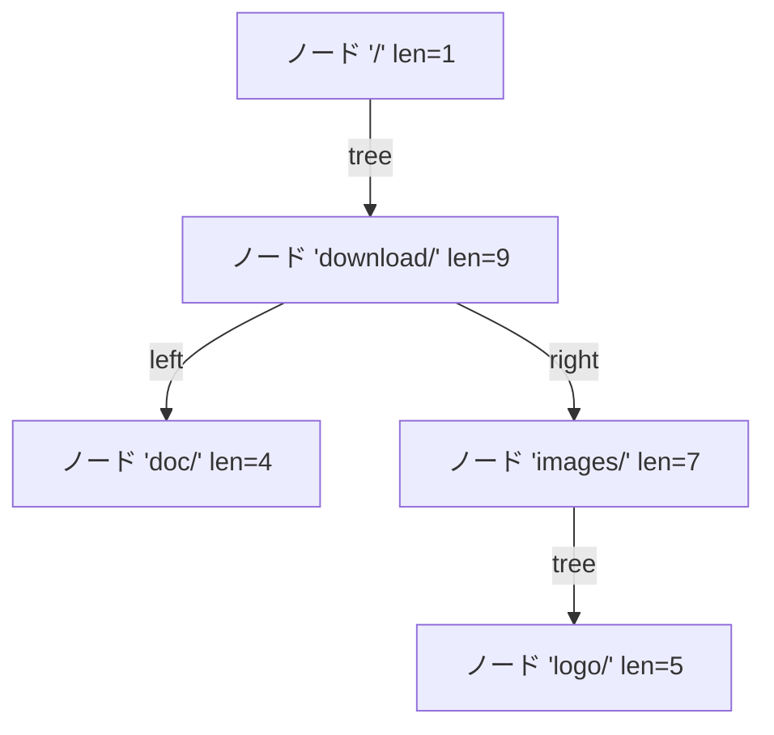

## この層の責務

[リクエストのパース](../request-parse/) が Host ヘッダを読み終えた瞬間と、[フェーズエンジン](../phase-engine/) の FIND_CONFIG フェーズ。この 2 箇所で、`r` が参照する設定が確定する。

- **`r->srv_conf`** — どの `server { }` ブロックか。Host ヘッダ (または SNI、または絶対 URI のホスト部) で決まる。
- **`r->loc_conf`** — どの `location { }` ブロックか。`r->uri` で決まる。

どちらも「設定の配列へのポインタを差し替える」という操作で、この 2 行が実行された後は、全モジュールが `ngx_http_get_module_loc_conf(r, ...)` を呼ぶだけで自分の設定を取れる。設定構造体そのものの作り方とマージは [設定マージのページ](../conf-merge/) が扱う。

探索の速さがそのまま接続あたりのコストになるので、両方とも**設定パースが終わった時点で検索用のデータ構造に畳み込んである**。実行時にやるのはハッシュ 1〜3 回と木の下降だけだ。

## 主要な型とその関係

### listen アドレスから設定へ

`ngx_listening_t` の `servers` フィールドが `ngx_http_port_t` を指す ([`src/http/ngx_http_core_module.h#L251-L271`](https://github.com/nginx/nginx/blob/release-1.31.4/src/http/ngx_http_core_module.h#L251-L271))。

```c title="src/http/ngx_http_core_module.h"
typedef struct {
    in_addr_t                  addr;
    ngx_http_addr_conf_t       conf;
} ngx_http_in_addr_t;

#if (NGX_HAVE_INET6)

typedef struct {
    struct in6_addr            addr6;
    ngx_http_addr_conf_t       conf;
} ngx_http_in6_addr_t;

#endif


typedef struct {
    /* ngx_http_in_addr_t or ngx_http_in6_addr_t */
    void                      *addrs;
    ngx_uint_t                 naddrs;
} ngx_http_port_t;
```

同じポートに複数のアドレスが束ねられていることがある。`listen 80;` と `listen 127.0.0.1:80;` を両方書くと、ソケットは 1 本 (`*:80`) だが、`addrs` の要素は 2 つになる。

その 1 要素が `ngx_http_addr_conf_t` ([`#L238-L248`](https://github.com/nginx/nginx/blob/release-1.31.4/src/http/ngx_http_core_module.h#L238-L248))。

```c title="src/http/ngx_http_core_module.h"
struct ngx_http_addr_conf_s {
    /* the default server configuration for this address:port */
    ngx_http_core_srv_conf_t  *default_server;

    ngx_http_virtual_names_t  *virtual_names;

    unsigned                   ssl:1;
    unsigned                   http2:1;
    unsigned                   quic:1;
    unsigned                   proxy_protocol:1;
};
```

**`default_server` は必ず存在し、`virtual_names` は NULL でありうる。** その `address:port` に `server_name` が 1 つも定義されていなければ (あるいは `server` ブロックが 1 個しかなければ)、名前で引く余地がないので `virtual_names` は作られない ([`src/http/ngx_http.c#L1928-L1946`](https://github.com/nginx/nginx/blob/release-1.31.4/src/http/ngx_http.c#L1928-L1946))。

```c title="src/http/ngx_http_core_module.h"
typedef struct {
    ngx_hash_combined_t        names;

    ngx_uint_t                 nregex;
    ngx_http_server_name_t    *regex;
} ngx_http_virtual_names_t;
```

[`#L230-L235`](https://github.com/nginx/nginx/blob/release-1.31.4/src/http/ngx_http_core_module.h#L230-L235)。`ngx_hash_combined_t` の中身が 3 本のハッシュだ ([`src/core/ngx_hash.h#L45-L49`](https://github.com/nginx/nginx/blob/release-1.31.4/src/core/ngx_hash.h#L45-L49))。

```c title="src/core/ngx_hash.h"
typedef struct {
    ngx_hash_t            hash;
    ngx_hash_wildcard_t  *wc_head;
    ngx_hash_wildcard_t  *wc_tail;
} ngx_hash_combined_t;
```

完全一致、`*.example.com` 形式、`www.example.*` 形式。これに `nregex` / `regex` を足して、`server_name` の解決が 4 段になる。

### location の探索用構造

`ngx_http_core_loc_conf_t` は、自分の下にある location への入口を 2 つ持つ ([`src/http/ngx_http_core_module.h#L333-L336`](https://github.com/nginx/nginx/blob/release-1.31.4/src/http/ngx_http_core_module.h#L333-L336))。

```c title="src/http/ngx_http_core_module.h"
    ngx_http_location_tree_node_t   *static_locations;
#if (NGX_PCRE)
    ngx_http_core_loc_conf_t       **regex_locations;
#endif
```

prefix location は木に、正規表現 location は NULL 終端の配列に入る。**「順序が意味を持つもの」だけが配列として残っている。**

木のノードはこれだ ([`#L473-L484`](https://github.com/nginx/nginx/blob/release-1.31.4/src/http/ngx_http_core_module.h#L473-L484))。

```c title="src/http/ngx_http_core_module.h"
struct ngx_http_location_tree_node_s {
    ngx_http_location_tree_node_t   *left;
    ngx_http_location_tree_node_t   *right;
    ngx_http_location_tree_node_t   *tree;

    ngx_http_core_loc_conf_t        *exact;
    ngx_http_core_loc_conf_t        *inclusive;

    u_short                          len;
    u_char                           auto_redirect;
    u_char                           name[1];
};
```

ポインタが 3 本あり、それぞれ意味が違う。

| フィールド | 意味                                                         |
| ---------- | ------------------------------------------------------------ |
| `left`     | このノードの名前より辞書順で小さい兄弟                       |
| `right`    | 辞書順で大きい兄弟                                           |
| `tree`     | **このノードの名前を接頭辞として持つ、より長い名前の部分木** |

`left` / `right` は普通の二分探索木で、`tree` はトライの子に相当する。`exact` が `location = /foo` 用、`inclusive` が `location /foo` 用で、同じ名前に両方書けるので 2 本ある。

`name[1]` は可変長配列のイディオムで、実際には `len` バイトぶんが確保される。しかも格納されるのは**名前の全体ではなく、親から先の差分**だ。

## 処理の流れ

### 1. 接続を受けた時点でデフォルトサーバが決まる

`ngx_http_init_connection()` が、まず `addr_conf` を確定させる ([`src/http/ngx_http_request.c#L233-L308`](https://github.com/nginx/nginx/blob/release-1.31.4/src/http/ngx_http_request.c#L233-L308))。

```c title="src/http/ngx_http_request.c"
    /* find the server configuration for the address:port */

    port = c->listening->servers;

    if (port->naddrs > 1) {

        /*
         * there are several addresses on this port and one of them
         * is an "*:port" wildcard so getsockname() in ngx_http_server_addr()
         * is required to determine a server address
         */

        if (ngx_connection_local_sockaddr(c, NULL, 0) != NGX_OK) {
            /* ... */
        }

        /* ... AF_INET6 の場合も同じ形 ... */

        sin = (struct sockaddr_in *) c->local_sockaddr;

        addr = port->addrs;

        /* the last address is "*" */

        for (i = 0; i < port->naddrs - 1; i++) {
            if (addr[i].addr == sin->sin_addr.s_addr) {
                break;
            }
        }

        hc->addr_conf = &addr[i].conf;

    } else {
        /* ... addrs[0] をそのまま使う ... */
    }

    /* the default server configuration for the address:port */
    hc->conf_ctx = hc->addr_conf->default_server->ctx;
```

`naddrs > 1` のときだけ `getsockname(2)` を呼ぶ。1 個しかなければどのアドレスに来たか調べる必要がないので、システムコールを 1 回節約している。

線形探索のループが `naddrs - 1` で止まっているのがポイントだ。コメントのとおり**最後の要素はワイルドカード `*` で、どれにも一致しなかったらそこに落ちる**。`i` がループを抜けた時点で `naddrs - 1` になっているので、ループの後に「見つからなかった」の分岐が要らない。

そして `hc->conf_ctx` にデフォルトサーバの設定が入る。**この時点で、まだ 1 バイトも読んでいないのに設定は決まっている。** `client_header_buffer_size` も `client_header_timeout` も、ここで決まったサーバの値が使われる。

### 2. Host が読めたら 4 段の解決を走らせる

`ngx_http_set_virtual_server()` ([`#L2415-L2494`](https://github.com/nginx/nginx/blob/release-1.31.4/src/http/ngx_http_request.c#L2415-L2494)) が入口で、実際の探索は `ngx_http_find_virtual_server()` にある ([`#L2504-L2515`](https://github.com/nginx/nginx/blob/release-1.31.4/src/http/ngx_http_request.c#L2504-L2515))。

```c title="src/http/ngx_http_request.c"
    if (virtual_names == NULL) {
        return NGX_DECLINED;
    }

    cscf = ngx_hash_find_combined(&virtual_names->names,
                                  ngx_hash_key(host->data, host->len),
                                  host->data, host->len);

    if (cscf) {
        *cscfp = cscf;
        return NGX_OK;
    }
```

`ngx_hash_find_combined()` が 3 段ぶんを引き受ける ([`src/core/ngx_hash.c#L216-L244`](https://github.com/nginx/nginx/blob/release-1.31.4/src/core/ngx_hash.c#L216-L244))。

```c title="src/core/ngx_hash.c"
    if (hash->hash.buckets) {
        value = ngx_hash_find(&hash->hash, key, name, len);

        if (value) {
            return value;
        }
    }

    if (len == 0) {
        return NULL;
    }

    if (hash->wc_head && hash->wc_head->hash.buckets) {
        value = ngx_hash_find_wc_head(hash->wc_head, name, len);

        if (value) {
            return value;
        }
    }

    /* ... wc_tail も同じ形 ... */

    return NULL;
```

**完全一致 → 先頭ワイルドカード → 末尾ワイルドカードの順に、当たるまで下る。** 優先順位が関数の中の `if` の並び順として表現されている。

これで見つからなければ、`ngx_http_find_virtual_server()` が正規表現を配列順に試す ([`#L2560-L2574`](https://github.com/nginx/nginx/blob/release-1.31.4/src/http/ngx_http_request.c#L2560-L2574))。

```c title="src/http/ngx_http_request.c"
        for (i = 0; i < virtual_names->nregex; i++) {

            n = ngx_http_regex_exec(r, sn[i].regex, host);

            if (n == NGX_DECLINED) {
                continue;
            }

            if (n == NGX_OK) {
                *cscfp = sn[i].server;
                return NGX_OK;
            }

            return NGX_ERROR;
        }
```

ここだけが O(n) で、正規表現の実行を伴う。`server_name ~^www\d+\.example\.com$;` を 50 個書くと、どれにも当たらない Host が来るたびに 50 回マッチングが走る。この 4 段目に落ちること自体がコストになっている。

`ngx_http_regex_exec()` を通しているので、キャプチャは `$1` などの変数として使える ([変数のページ](../variables/))。

### 3. `*.example.com` を `com.example.` に並べ替える

先頭ワイルドカードの引き方が面白い。`ngx_hash_add_key()` が設定パース時に名前を作り替えている ([`src/core/ngx_hash.c#L907-L959`](https://github.com/nginx/nginx/blob/release-1.31.4/src/core/ngx_hash.c#L907-L959))。

```c title="src/core/ngx_hash.c"
    if (skip) {

        /*
         * convert "*.example.com" to "com.example.\0"
         *      and ".example.com" to "com.example\0"
         */

        p = ngx_pnalloc(ha->temp_pool, last);
        if (p == NULL) {
            return NGX_ERROR;
        }

        len = 0;
        n = 0;

        for (i = last - 1; i; i--) {
            if (key->data[i] == '.') {
                ngx_memcpy(&p[n], &key->data[i + 1], len);
                n += len;
                p[n++] = '.';
                len = 0;
                continue;
            }

            len++;
        }

        /* ... 残りのラベルを詰めて p[n] = '\0' ... */

        hwc = &ha->dns_wc_head;

    } else {

        /* convert "www.example.*" to "www.example\0" */
        /* ... */
    }
```

末尾から前へ走査し、`.` に当たるたびに直前のラベルを出力バッファへ移す。`*.example.com` は `com.example.` になる。

**なぜ逆順にするか。** ドメイン名は「後ろほど大きい単位」という階層になっている。`*.example.com` は「末尾が `.example.com` である全部」を意味するので、末尾から比較したい。ところがハッシュは先頭から一定長を見るほうが素直だ。だから**あらかじめ並べ替えて、階層の順とバイト列の順を一致させる**。

こうしておくと、木の構築はラベル単位のトライになる ([`#L514-L562`](https://github.com/nginx/nginx/blob/release-1.31.4/src/core/ngx_hash.c#L514-L562))。`ngx_hash_wildcard_init()` が、最初の `.` までを 1 段目のキーにして、残りを次の階層へ渡す再帰になっている。`com` のハッシュを引くと、次の階層 (`example`, `foo`, ...) のハッシュテーブルへのポインタが返る。

引く側の `ngx_hash_find_wc_head()` は、逆に末尾のラベルから切り出す ([`#L62-L82`](https://github.com/nginx/nginx/blob/release-1.31.4/src/core/ngx_hash.c#L62-L82))。

```c title="src/core/ngx_hash.c"
    n = len;

    while (n) {
        if (name[n - 1] == '.') {
            break;
        }

        n--;
    }

    key = 0;

    for (i = n; i < len; i++) {
        key = ngx_hash(key, name[i]);
    }

    value = ngx_hash_find(&hwc->hash, key, &name[n], len - n);
```

`www.example.com` なら、末尾から `.` を探して `com` を切り出し、そのハッシュを引く。当たったら残りの `www.example` で自分を再帰呼び出しする。**入力を並べ替えずに、切り出す順序のほうを逆にしている。**

戻り値の下位 2 ビットに意味を持たせているのが、この関数の変わったところだ ([`#L90-L99`](https://github.com/nginx/nginx/blob/release-1.31.4/src/core/ngx_hash.c#L90-L99))。

```c title="src/core/ngx_hash.c"
        /*
         * the 2 low bits of value have the special meaning:
         *     00 - value is data pointer for both "example.com"
         *          and "*.example.com";
         *     01 - value is data pointer for "*.example.com" only;
         *     10 - value is pointer to wildcard hash allowing
         *          both "example.com" and "*.example.com";
         *     11 - value is pointer to wildcard hash allowing
         *          "*.example.com" only.
         */
```

ポインタが 4 バイト境界に載っていることを使い、「これはデータか、次の階層のハッシュか」と「`.example.com` 形式でホスト自身にも一致するか」を 2 ビットに詰めている。構造体にフラグを足すとノード 1 個あたり数バイト増えるので、ポインタの空きビットを使った。

### 4. サーバが決まると設定ポインタが差し替わる

`ngx_http_set_virtual_server()` の締めがこれだ ([`src/http/ngx_http_request.c#L2482-L2493`](https://github.com/nginx/nginx/blob/release-1.31.4/src/http/ngx_http_request.c#L2482-L2493))。

```c title="src/http/ngx_http_request.c"
    if (rc == NGX_DECLINED) {
        return NGX_OK;
    }

    r->srv_conf = cscf->ctx->srv_conf;
    r->loc_conf = cscf->ctx->loc_conf;

    clcf = ngx_http_get_module_loc_conf(r, ngx_http_core_module);

    ngx_set_connection_log(r->connection, clcf->error_log);

    return NGX_OK;
```

`NGX_DECLINED` (どれにも一致しなかった) のときは何もせず `NGX_OK` を返す。デフォルトサーバのままで進む。**「一致するサーバがない」はエラーではない。**

差し替わるのは 2 本のポインタだけだ。この 2 行の後、`ngx_http_get_module_srv_conf(r, ...)` を呼ぶ全モジュールが新しい `server` ブロックの設定を見る。[リクエストのパース](../request-parse/) で見たとおり、ヘッダのパースループはこの直後から新しい `cscf` を使う。

`server` ブロック直下に書かれたディレクティブは `loc_conf` にも入るので、`loc_conf` も一緒に差し替わる。この時点の `r->loc_conf` は「`server` ブロック直下の設定」で、後で FIND_CONFIG がさらに差し替える。

### 5. SNI コールバックからも同じ関数が呼ばれる

TLS のハンドシェイク中、ClientHello の SNI 拡張を見た時点で証明書を選ばなければならない。`ngx_http_ssl_servername()` が同じ探索関数を呼ぶ ([`#L953-L975`](https://github.com/nginx/nginx/blob/release-1.31.4/src/http/ngx_http_request.c#L953-L975))。

```c title="src/http/ngx_http_request.c"
    rc = ngx_http_find_virtual_server(c, hc->addr_conf->virtual_names, &host,
                                      NULL, &cscf);

    if (rc == NGX_ERROR) {
        goto error;
    }

    if (rc == NGX_DECLINED) {
        goto done;
    }

    hc->ssl_servername = ngx_palloc(c->pool, sizeof(ngx_str_t));
    /* ... */
    *hc->ssl_servername = host;

    hc->conf_ctx = cscf->ctx;
```

第 4 引数の `r` が `NULL` になっている。この時点では `ngx_http_request_t` がまだ存在しないからだ。`ngx_http_find_virtual_server()` はこれを見て、正規表現のマッチを `ngx_http_regex_exec()` ではなく素の `ngx_regex_exec()` で行い、キャプチャを保存する代わりに `hc->ssl_servername_regex` にパターンだけを覚えておく ([`#L2528-L2556`](https://github.com/nginx/nginx/blob/release-1.31.4/src/http/ngx_http_request.c#L2528-L2556))。

後から Host ヘッダが読めたとき、`ngx_http_set_virtual_server()` が冒頭でこれを使う ([`#L2430-L2446`](https://github.com/nginx/nginx/blob/release-1.31.4/src/http/ngx_http_request.c#L2430-L2446))。

```c title="src/http/ngx_http_request.c"
    if (hc->ssl_servername) {
        if (hc->ssl_servername->len == host->len
            && ngx_strncmp(hc->ssl_servername->data,
                           host->data, host->len) == 0)
        {
#if (NGX_PCRE)
            if (hc->ssl_servername_regex
                && ngx_http_regex_exec(r, hc->ssl_servername_regex,
                                          hc->ssl_servername) != NGX_OK)
            {
                /* ... */
            }
#endif
            return NGX_OK;
        }
    }
```

SNI と Host が同じ文字列なら、探索をやり直さない。**ただし正規表現サーバだった場合は、`$1` などの変数を埋めるためにマッチだけもう一度走らせる。** 探索結果は再利用できても、キャプチャは `r` に紐づくので再現が要る。

SNI と Host が食い違っていた場合は探索をやり直し、`ssl_verify_client` が有効なら 421 で拒否する。TLS 層との関係は [SSL 層のページ](../ssl-layer/) を参照。

### 6. location は設定パース後に木へ畳まれる

ここからが `location` 側の話になる。設定を読み終えた `ngx_http_block()` が、サーバごとに 2 つの関数を呼ぶ ([`src/http/ngx_http.c#L278-L291`](https://github.com/nginx/nginx/blob/release-1.31.4/src/http/ngx_http.c#L278-L291))。

```c title="src/http/ngx_http.c"
    /* create location trees */

    for (s = 0; s < cmcf->servers.nelts; s++) {

        clcf = cscfp[s]->ctx->loc_conf[ngx_http_core_module.ctx_index];

        if (ngx_http_init_locations(cf, cscfp[s], clcf) != NGX_OK) {
            return NGX_CONF_ERROR;
        }

        if (ngx_http_init_static_location_trees(cf, clcf) != NGX_OK) {
            return NGX_CONF_ERROR;
        }
    }
```

パース中は、location は書かれた順に `ngx_queue_t` へ繋がれているだけだ。`ngx_http_init_locations()` がまずこれをソートする ([`#L690`](https://github.com/nginx/nginx/blob/release-1.31.4/src/http/ngx_http.c#L690))。

比較関数 `ngx_http_cmp_locations()` が、種類ごとの並び順を決めている ([`#L940-L996`](https://github.com/nginx/nginx/blob/release-1.31.4/src/http/ngx_http.c#L940-L996))。

```c title="src/http/ngx_http.c"
    if (first->noname && !second->noname) {
        /* shift no named locations to the end */
        return 1;
    }
    /* ... */
    if (first->named && !second->named) {
        /* shift named locations to the end */
        return 1;
    }
    /* ... */
    if (first->regex && !second->regex) {
        /* shift the regex matches to the end */
        return 1;
    }

    if (first->regex || second->regex) {
        /* do not sort the regex matches */
        return 0;
    }
    /* ... */
    rc = ngx_filename_cmp(first->name.data, second->name.data,
                          ngx_min(first->name.len, second->name.len) + 1);

    if (rc == 0 && !first->exact_match && second->exact_match) {
        /* an exact match must be before the same inclusive one */
        return 1;
    }
```

**「prefix → 正規表現 → 名前付き (`@foo`) → 無名 (`if` ブロックなど)」の順に並べ、prefix だけを辞書順にソートする。** 正規表現同士は `return 0` で、設定ファイルに書かれた順序が保たれる。`ngx_queue_sort()` は安定マージソートなので、これが成立する。

ソート後、末尾の 3 グループはキューから切り離されて、`regex_locations` と `named_locations` の配列になる ([`#L740-L791`](https://github.com/nginx/nginx/blob/release-1.31.4/src/http/ngx_http.c#L740-L791))。残った prefix location だけが木の材料になる。

`ngx_http_init_static_location_trees()` が 3 段階で木を作る ([`#L830-L839`](https://github.com/nginx/nginx/blob/release-1.31.4/src/http/ngx_http.c#L830-L836))。

```c title="src/http/ngx_http.c"
    if (ngx_http_join_exact_locations(cf, locations) != NGX_OK) {
        return NGX_ERROR;
    }

    ngx_http_create_locations_list(locations, ngx_queue_head(locations));

    pclcf->static_locations = ngx_http_create_locations_tree(cf, locations, 0);
```

1. `join_exact_locations` — `location = /foo` と `location /foo` を 1 個のキュー要素にまとめる。ソート済みなので隣接している。同じ種類が 2 つあれば `duplicate location` エラーになる。
2. `create_locations_list` — 名前が接頭辞になっている関係を、入れ子のキューに変える。`/images/` の後ろに `/images/logo/` が続いていれば、後者を前者の `list` へ移す。
3. `create_locations_tree` — キューを再帰的に二分して木にする。

3 番目にコメントが付いている ([`#L1100-L1103`](https://github.com/nginx/nginx/blob/release-1.31.4/src/http/ngx_http.c#L1100-L1103))。

```c title="src/http/ngx_http.c"
/*
 * to keep cache locality for left leaf nodes, allocate nodes in following
 * order: node, left subtree, right subtree, inclusive subtree
 */
```

```c title="src/http/ngx_http.c"
    q = ngx_queue_middle(locations);

    lq = (ngx_http_location_queue_t *) q;
    len = lq->name->len - prefix;

    node = ngx_palloc(cf->pool,
                      offsetof(ngx_http_location_tree_node_t, name) + len);
    /* ... */
    node->len = (u_short) len;
    ngx_memcpy(node->name, &lq->name->data[prefix], len);
```

[`#L1114-L1135`](https://github.com/nginx/nginx/blob/release-1.31.4/src/http/ngx_http.c#L1114-L1135)。ソート済みキューの中央要素を根にして左右に分ける、という素朴な平衡化だ。`ngx_memcpy(node->name, &lq->name->data[prefix], len)` で、**親までの共通接頭辞を除いた差分だけを格納する**。`tree` を降りるときに `prefix + len` を渡すので、階層が深くなるほど 1 ノードが持つ文字数は減る。

`location /`、`location /doc/`、`location /download/`、`location /images/`、`location /images/logo/` を書いた場合、こうなる。



`location /` が全部の接頭辞なので、他は全部その `tree` にぶら下がる。`/doc/` と `/download/` は接頭辞関係にないので、`left` / `right` で並ぶ兄弟になる。

### 7. FIND_CONFIG フェーズが木を降りる

`ngx_http_core_find_static_location()` の本体 ([`src/http/ngx_http_core_module.c#L1528-L1591`](https://github.com/nginx/nginx/blob/release-1.31.4/src/http/ngx_http_core_module.c#L1528-L1591))。

```c title="src/http/ngx_http_core_module.c"
    for ( ;; ) {

        if (node == NULL) {
            return rv;
        }

        n = (len <= (size_t) node->len) ? len : node->len;

        rc = ngx_filename_cmp(uri, node->name, n);

        if (rc != 0) {
            node = (rc < 0) ? node->left : node->right;

            continue;
        }

        if (len > (size_t) node->len) {

            if (node->inclusive) {

                r->loc_conf = node->inclusive->loc_conf;
                rv = NGX_AGAIN;

                node = node->tree;
                uri += n;
                len -= n;

                continue;
            }

            node = node->right;   /* exact only */

            continue;
        }

        if (len == (size_t) node->len) {

            if (node->exact) {
                r->loc_conf = node->exact->loc_conf;
                return NGX_OK;

            } else {
                r->loc_conf = node->inclusive->loc_conf;
                return NGX_AGAIN;
            }
        }

        /* len < node->len */

        if (len + 1 == (size_t) node->len && node->auto_redirect) {
            /* ... */
            rv = NGX_DONE;
        }

        node = node->left;
    }
```

再帰ではなくループで、3 方向のポインタを状況で選ぶ。

- 比較が不一致 → `left` か `right` へ (兄弟を探す)
- URI のほうが長く、`inclusive` がある → `r->loc_conf` を暫定的に更新し、**URI を消費してから `tree` へ降りる**
- 長さが一致 → `exact` があれば `NGX_OK` で確定、なければ `inclusive` で `NGX_AGAIN`

**`r->loc_conf` を降りる途中で何度も上書きしている。** より長い prefix が見つかるたびに更新されるので、ループを抜けた時点で最長一致の結果が残る。「最長一致」を後から選び直す処理はどこにもなく、木を降りる順序がそのまま優先順位になっている。

`uri += n; len -= n;` で URI を消費するのが、ノードが差分だけを持つことと対応している。

`NGX_AGAIN` が返ってきたときの扱いが `ngx_http_core_find_location()` にある ([`#L1451-L1466`](https://github.com/nginx/nginx/blob/release-1.31.4/src/http/ngx_http_core_module.c#L1451-L1466))。

```c title="src/http/ngx_http_core_module.c"
    pclcf = ngx_http_get_module_loc_conf(r, ngx_http_core_module);

    rc = ngx_http_core_find_static_location(r, pclcf->static_locations);

    if (rc == NGX_AGAIN) {

#if (NGX_PCRE)
        clcf = ngx_http_get_module_loc_conf(r, ngx_http_core_module);
        noregex = clcf->noregex;
#endif
        /* look up nested locations */

        rc = ngx_http_core_find_location(r);
    }
```

木の探索で当たった location の中に、さらに `location` がネストしていることがある。その場合は自分自身を再帰呼び出しして、新しい `r->loc_conf` の `static_locations` を辿る。

### 8. 正規表現 location は配列を順に試す

同じ関数の後半 ([`#L1476-L1501`](https://github.com/nginx/nginx/blob/release-1.31.4/src/http/ngx_http_core_module.c#L1476-L1501))。

```c title="src/http/ngx_http_core_module.c"
    if (noregex == 0 && pclcf->regex_locations) {

        for (clcfp = pclcf->regex_locations; *clcfp; clcfp++) {

            n = ngx_http_regex_exec(r, (*clcfp)->regex, &r->uri);

            if (n == NGX_OK) {
                r->loc_conf = (*clcfp)->loc_conf;

                /* look up nested locations */

                rc = ngx_http_core_find_location(r);

                return (rc == NGX_ERROR) ? rc : NGX_OK;
            }

            if (n == NGX_DECLINED) {
                continue;
            }

            return NGX_ERROR;
        }
    }
```

最初に当たったものを採用して即座に抜ける。ソートしていないので、設定ファイルに書いた順がそのまま優先順位になる。

`=` と `^~` の扱いが、この構造の中でどう実現されているかを整理するとこうなる。

| 記法               | パース時のフラグ  | 効き方                                                          |
| ------------------ | ----------------- | --------------------------------------------------------------- |
| `location = /foo`  | `exact_match = 1` | 木のノードの `exact` に入り、長さ一致で `NGX_OK` を返して即確定 |
| `location ^~ /foo` | `noregex = 1`     | 木の探索後、`noregex` を見て正規表現ループを丸ごと飛ばす        |
| `location /foo`    | (なし)            | `inclusive` に入り、`NGX_AGAIN` を返して正規表現も試される      |
| `location ~ re`    | `regex` に格納    | `regex_locations` 配列に順番どおり入る                          |

フラグを立てているのは設定パーサだ ([`src/http/ngx_http_core_module.c#L3179-L3190`](https://github.com/nginx/nginx/blob/release-1.31.4/src/http/ngx_http_core_module.c#L3179-L3190))。

```c title="src/http/ngx_http_core_module.c"
        if (len == 1 && mod[0] == '=') {

            clcf->name = *name;
            clcf->exact_match = 1;

        } else if (len == 2 && mod[0] == '^' && mod[1] == '~') {

            clcf->name = *name;
            clcf->noregex = 1;

        } else if (len == 1 && mod[0] == '~') {
            /* ... */
        }
```

**ドキュメントに書かれている優先順位の規則は、この 3 箇所 (`exact` の早期 return、`noregex` の分岐、配列の順序) に分散して実装されている。** 「優先順位テーブル」のような中央のデータはどこにもない。

### 9. location が決まると設定を実際に適用する

`ngx_http_core_find_config_phase()` が探索結果を受け取る ([`#L981-L1003`](https://github.com/nginx/nginx/blob/release-1.31.4/src/http/ngx_http_core_module.c#L981-L1003))。

```c title="src/http/ngx_http_core_module.c"
    r->content_handler = NULL;
    r->uri_changed = 0;

    rc = ngx_http_core_find_location(r);

    /* ... NGX_ERROR なら 500 ... */

    clcf = ngx_http_get_module_loc_conf(r, ngx_http_core_module);

    if (!r->internal && clcf->internal) {
        ngx_http_finalize_request(r, NGX_HTTP_NOT_FOUND);
        return NGX_OK;
    }

    ngx_http_update_location_config(r);
```

`internal` の判定がここにある。`internal;` が書かれた location に、外から来たリクエスト (`r->internal == 0`) が当たったら 404 を返す。**探索そのものは通しておいて、当たった後で弾く。** 探索側に「内部専用は無視する」という条件を持ち込まずに済んでいる。

`ngx_http_update_location_config()` が、決まった設定を `r` と `c` に反映する ([`#L1354-L1357`](https://github.com/nginx/nginx/blob/release-1.31.4/src/http/ngx_http_core_module.c#L1354-L1357), [`#L1419-L1426`](https://github.com/nginx/nginx/blob/release-1.31.4/src/http/ngx_http_core_module.c#L1419-L1426))。

```c title="src/http/ngx_http_core_module.c"
    if (r->method & clcf->limit_except) {
        r->loc_conf = clcf->limit_except_loc_conf;
        clcf = ngx_http_get_module_loc_conf(r, ngx_http_core_module);
    }
```

```c title="src/http/ngx_http_core_module.c"
    if (!clcf->tcp_nopush) {
        /* disable TCP_NOPUSH/TCP_CORK use */
        r->connection->tcp_nopush = NGX_TCP_NOPUSH_DISABLED;
    }

    if (clcf->handler) {
        r->content_handler = clcf->handler;
    }
```

`limit_except` は、location が決まった後に**もう一度 `r->loc_conf` を差し替える**。`limit_except` ブロックは内部的に無名の location として作られていて、メソッドがビットマスクに一致したらそちらに切り替わる。

`r->content_handler = clcf->handler` が、`proxy_pass` や `fastcgi_pass` を実際に効かせている行だ。この 1 行が CONTENT フェーズの振る舞いを決める ([コンテンツハンドラのページ](../content-handler/))。

`sendfile`、`keepalive` の可否、`client_body_in_file_only` なども、この関数がまとめて `r` と `c` に書き込む。

### 10. rewrite で URI が変わったら引き直す

`ngx_http_core_post_rewrite_phase()` ([`#L1076-L1107`](https://github.com/nginx/nginx/blob/release-1.31.4/src/http/ngx_http_core_module.c#L1076-L1107))。

```c title="src/http/ngx_http_core_module.c"
    if (!r->uri_changed) {
        r->phase_handler++;
        return NGX_AGAIN;
    }

    r->uri_changes--;

    if (r->uri_changes == 0) {
        ngx_log_error(NGX_LOG_ERR, r->connection->log, 0,
                      "rewrite or internal redirection cycle "
                      "while processing \"%V\"", &r->uri);

        ngx_http_finalize_request(r, NGX_HTTP_INTERNAL_SERVER_ERROR);
        return NGX_OK;
    }

    r->phase_handler = ph->next;

    cscf = ngx_http_get_module_srv_conf(r, ngx_http_core_module);
    r->loc_conf = cscf->ctx->loc_conf;

    return NGX_AGAIN;
```

`r->loc_conf` を `server` ブロック直下のものに戻し、`phase_handler` を FIND_CONFIG フェーズの位置に巻き戻す。**location の探索を、状態を捨ててやり直す。** ネストした location に入った状態から始めると、新しい URI に対して間違った部分木を探すことになる。

`uri_changes` (初期値 `NGX_HTTP_MAX_URI_CHANGES + 1`) を毎回減らして、0 になったら 500 を返す。無限ループを回数で止めている。名前付き location への内部リダイレクト (`ngx_http_named_location()`) も同じカウンタを消費する ([`#L2646-L2656`](https://github.com/nginx/nginx/blob/release-1.31.4/src/http/ngx_http_core_module.c#L2646-L2656))。

フェーズの並びと `ph->next` の作り方は [フェーズエンジンのページ](../phase-engine/) を参照。

## 守られている不変条件

**`hc->addr_conf` は接続の間ずっと変わらない。** listen アドレスで決まるものなので、SNI でも Host でも変わらない。`virtual_names` の探索範囲も変わらない。

**`hc->conf_ctx` はデフォルトサーバか、SNI で選ばれたサーバのどちらか。** Host による選択は `r` 側 (`r->srv_conf`) にしか反映されない。だから同じ keepalive 接続で次のリクエストが別の Host を送ってきても、正しく引き直される。

**`r->srv_conf` はリクエストにつき高々 1 回しか変わらない。** [パースのページ](../request-parse/) の `r->headers_in.server.len` によるガードで保証される。

**`r->loc_conf` は何度でも変わる。** サーバ選択で 1 回、FIND_CONFIG で 1 回以上、`limit_except` で 1 回、rewrite のたびにもう 1 周。`r->loc_conf` をキャッシュして持ち回るモジュールは壊れる。

**木の探索は `r->uri` だけを見る。** クエリ文字列 (`r->args`) は一切参照しない。`location` でクエリによる分岐ができないのは、この設計の帰結だ。

**`static_locations` と `regex_locations` は起動後に変更されない。** 全ワーカーが `fork` 前に作られたものを共有する ([master/worker のページ](../master-worker/))。読み取り専用なのでロックが要らない。

## つまずきどころ

### デフォルトサーバは「最初に書いた server」

`ngx_http_addr_conf_t.default_server` は、その `address:port` に対して `default_server` 指定がなければ、設定ファイルで最初に現れた `server` ブロックになる。`server_name` が全く一致しない Host が来ると、ここに落ちる。

**「Host が一致しなければ 404」ではない。** 一致しないリクエストは無言でデフォルトサーバに処理される。意図しない `server` ブロックが応答している、という問題の原因になりやすい。明示的に弾くには `server_name _;` かつ `return 444;` のような catch-all を先頭に置く必要がある。

### `virtual_names` が NULL なら Host は無視される

`ngx_http_find_virtual_server()` の先頭で `virtual_names == NULL` なら即 `NGX_DECLINED` になる。`server` ブロックが 1 個しかない設定では `virtual_names` が作られないので、**`server_name` に何を書いても、どんな Host でも通る。**

### `server_name` の重複は警告だけ

`ngx_hash_add_key()` が `NGX_BUSY` を返したとき、`ngx_http_server_names()` は警告を出して続行する ([`src/http/ngx_http.c#L1593-L1597`](https://github.com/nginx/nginx/blob/release-1.31.4/src/http/ngx_http.c#L1593-L1597))。

```c title="src/http/ngx_http.c"
            if (rc == NGX_BUSY) {
                ngx_log_error(NGX_LOG_WARN, cf->log, 0,
                              "conflicting server name \"%V\" on %V, ignored",
                              &name[n].name, &addr->opt.addr_text);
            }
```

同じ名前を 2 つの `server` に書くと、先に登録されたほうが勝ち、後のほうは黙って捨てられる。起動は成功する。一方、location の重複は `duplicate location` で起動失敗になる。**名前の衝突に対する扱いが、server と location で非対称になっている。**

### 正規表現 location は木の外にいる

prefix location の探索は O(log n) だが、正規表現 location は O(n) で、しかも毎回 PCRE を実行する。`location ~ \.php$` を 30 個書けば、当たらない URI に対して 30 回のマッチングが走る。

`^~` を付けた prefix location が当たれば正規表現ループはスキップされるので、静的ファイルのパスに `^~` を付ける意味はここにある。

### 木のノードが持つのは名前の差分だけ

デバッガで `node->name` を読んでも、`location` に書いた名前は出てこない。`/images/logo/` のノードには `logo/` しか入っていない。`node->len` も差分の長さで、フルパスを復元するには根からの経路を辿る必要がある。

### `left` を辿る条件に `auto_redirect` が混ざる

`len < node->len` のとき、普通なら `left` に降りるだけだ。しかし `len + 1 == node->len && node->auto_redirect` なら `rv = NGX_DONE` を仕込んでから降りる ([`src/http/ngx_http_core_module.c#L1583-L1588`](https://github.com/nginx/nginx/blob/release-1.31.4/src/http/ngx_http_core_module.c#L1583-L1588))。

`/images` (末尾スラッシュなし) というリクエストに対し、`location /images/` があるときに 301 を返すための仕込みだ。`NGX_DONE` を受け取った `find_config_phase` が `Location` ヘッダを組み立てて 301 で終わらせる ([`#L1024-L1059`](https://github.com/nginx/nginx/blob/release-1.31.4/src/http/ngx_http_core_module.c#L1024-L1059))。

`rv` に入れてから `node = node->left` を続けているのがポイントで、**「より良い一致が後で見つかったら上書きされる」** という形になっている。リダイレクトは最後の手段として残される。

### `limit_except` の中では location が違う

`ngx_http_update_location_config()` の `limit_except` 判定でメソッドが一致すると、`r->loc_conf` が無名 location のものに差し替わる。`location` ブロックに書いたディレクティブのうち、`limit_except` ブロックの中に書かなかったものは、そこには効かない。デバッグログの `using configuration` に出る名前は差し替え前のものなので、ログだけ見ていても分からない。

## 関連

- Host ヘッダが読まれるところまでは [リクエストのパースのページ](../request-parse/)。
- FIND_CONFIG フェーズが並びのどこにあるかは [フェーズエンジンのページ](../phase-engine/)。
- `r->content_handler` が呼ばれる先は [コンテンツハンドラのページ](../content-handler/)。
- SNI コールバックと `SSL_CTX` の差し替えは [SSL 層のページ](../ssl-layer/)。
- `server` と `location` の設定がどう継承されるかは [設定マージのページ](../conf-merge/)。
- `ngx_hash_t` を含む設定パース全体の流れは [設定パースのページ](../conf-parse/)。
