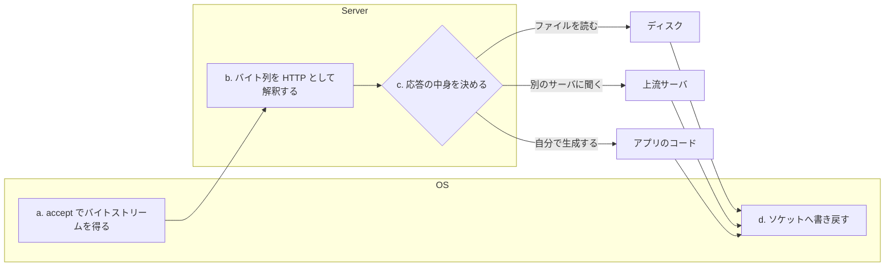

## なぜこれを先に知る必要があるか

Nginx のソースを開くと、`src/core`、`src/event`、`src/http`、`src/stream`、`src/os/unix` というディレクトリが並んでいる。この分け方が何に対応しているのかは、「Web サーバとは何をするプログラムか」の分解ができていないと読めない。

そして Nginx について一番よく誤解されるのが、**「Web サーバ」という言葉が指す仕事の範囲**だ。Apache httpd と Nginx を比べるとき、多くの人は同じものを比べていない。Apache は PHP を自プロセスの中で実行できるが、Nginx はできない。これは機能の欠落ではなく、担当する仕事の線引きが違うということだ。

ここでは nginx のコードをまだ出さず、Web サーバというプログラムの仕事を 4 つに数え直す。以降のページで出てくる用語 — listen ソケット、リクエストパーサ、コンテンツハンドラ、出力フィルタ、upstream — が、この 4 つのどこに置かれているかを先に決めておく。

## 4 つの仕事

Web サーバがやることは、突き詰めると次の 4 つしかない。

1. **TCP 接続を受け付ける** — ポートで待ち、届いた接続を 1 本のバイトストリームとして手に入れる
2. **バイト列を HTTP リクエストとして解釈する** — 受け取ったバイトを、メソッド・URI・ヘッダ・ボディという構造に変える
3. **応答の中身を決める** — ファイルを読む / 別のサーバに聞く / 自分で生成する
4. **応答をバイト列にして書き戻す** — ステータス行とヘッダを組み立て、ボディと一緒にソケットへ流す

この 4 つは、それぞれ性質がまったく違う。

### (a) TCP 接続を受け付ける

これは完全に OS の仕事で、サーバプログラムがやることは 4 つのシステムコールを順に呼ぶだけだ。

```c
int fd = socket(AF_INET, SOCK_STREAM, 0);
bind(fd, (struct sockaddr *) &addr, sizeof(addr));
listen(fd, backlog);

for (;;) {
    int c = accept(fd, NULL, NULL);
    /* c が 1 本の接続 */
}
```

難しさはこの 4 行にはない。難しいのは、**この `accept()` を 1 秒に何万回も回しながら、同時に 5 万本の `c` を生かしておく**ところだ。1 接続 1 プロセスで書くと、5 万本の接続に 5 万個のプロセスが要る。ここが C10K 問題で、[並行モデルのページ](../concurrency-models/) と [ノンブロッキング I/O のページ](../nonblocking-multiplexing/) の主題になる。

`listen()` の裏でカーネルが何を持っているかは [TCP の accept のページ](../tcp-accept/) で分解する。

この仕事の性質を 3 つ挙げておく。

- **接続は fd という有限資源を消費する。** プロセスあたりの fd 数には上限があり、プロキシなら 1 リクエストで下流と上流の 2 本を使う。「同時 5 万接続」は「fd を 10 万本持つ」と同義になる。
- **接続が張られただけでは、まだ何もリクエストが来ていない。** 接続を受け取ってから最初のバイトが届くまでの時間は、クライアントが決める。この時間に上限を置かないと、接続を張るだけでサーバを埋められる。
- **ここでの選択が、上の層の構造を決めてしまう。** 1 接続 1 プロセスなら (b)(c)(d) はブロックする同期コードで書ける。1 スレッドで数万接続を扱うなら、(b)(c)(d) は全部が中断・再開できる形でなければならない。

### (b) バイト列を HTTP リクエストとして解釈する

`accept()` が返すのは fd であって、リクエストではない。fd から読めるのはバイトの並びで、しかも **どこで区切って読めるかはこちらが選べない**。`GET /index.html HTTP/1.1\r\n` の 26 バイトが 1 回の `read()` で届くこともあれば、`GET /ind` で 1 回、残りが 300ms 後にもう 1 回、ということもある。

だから HTTP のパーサは「1 行読む」という関数では書けない。読めたところまで進んで、中断して、次に読めたところから再開できる形 — つまり状態機械 — でしか書けない。HTTP/1.1 のバイト列がどういう形で、なぜパースが面倒かは [HTTP/1.1 のワイヤ形式のページ](../http1-wire/) で扱う。

ここは純粋に CPU とメモリの仕事で、I/O は絡まない。だが **サーバが受け取る全バイトが必ずここを通る** ので、1 バイトあたりのコストがそのままスループットに効く。

パースが吐き出すのは、だいたいどの実装でも同じ形をしている。

- メソッド (`GET` / `POST` / …)
- リクエストターゲット — 生の文字列、そこから切り出したパス、クエリ文字列、パーセントデコード済みのパス
- プロトコルバージョン
- ヘッダの列 — 名前と値の対。名前は大文字小文字を区別しない
- ボディ — まだ届いていないことも、これから chunked で届くことも、そもそも無いこともある

注意すべきは **「パース結果」が最初から全部揃うわけではない** ことだ。ヘッダを読み終えた時点でメソッドと URI とヘッダは確定するが、ボディはまだ 1 バイトも来ていないのが普通だ。だから構造体は「途中まで埋まった状態」を表現できなければならず、(c) の判断はボディを待たずに始められなければならない。

もうひとつ、パースは **メモリの上限を自分で決める仕事**でもある。HTTP/1.1 の規格はヘッダの数にも長さにも上限を置いていない。上限を置かなければ、1 本の接続でサーバのメモリを食い尽くせる。詳しくは [HTTP/1.1 のワイヤ形式のページ](../http1-wire/)。

### (c) 応答の中身を決める

ここだけが、Web サーバごとに大きく違う。取りうる形は 3 つある。

- **ファイルを読む** — URI をファイルシステム上のパスに写して、そのファイルの中身を返す。静的コンテンツ。
- **別のサーバに聞く** — 自分では答えを持たず、上流 (upstream) に同じ趣旨の要求を投げて、返ってきたものを返す。プロキシ。
- **自分で生成する** — アプリケーションのコードを実行して、その出力を返す。

3 つ目を「自プロセスの中で」やるか「別プロセスに投げて」やるかが、この章でいちばん効いてくる分岐点になる。

3 つは、待ち時間の性質がまるで違う。

|                  | 待ち時間       | 待っている相手             | 途中でキャンセルできるか |
| ---------------- | -------------- | -------------------------- | ------------------------ |
| ファイルを読む   | 0 〜 数十 ms   | ページキャッシュかディスク | しにくい                 |
| 別のサーバに聞く | 1 ms 〜 数十秒 | ネットワークと相手のアプリ | しやすい                 |
| 自分で生成する   | 任意           | 自分の CPU                 | 自分次第                 |

「別のサーバに聞く」だけが、**待ちを fd の readable として表現できる**。だから多重化 API に乗る。ファイル I/O はそうならない (通常のファイル fd は epoll に登録できない) し、自分で生成する場合の待ちはそもそも I/O ですらない。

イベント駆動のサーバにとって、この差は決定的だ。「別のサーバに聞く」を主軸に据えれば、全部の待ちが 1 つのループに畳める。逆に「自分で生成する」を抱え込むと、いつ終わるか分からない処理がループの中に居座ることになる。

### (d) 応答をバイト列にして書き戻す

ステータス行とヘッダを組み立て、ボディをくっつけて、ソケットに `write()` する。ここも (a) と同じで、難しさは書式ではなく規模のほうにある。

- 相手が受け取るより速く書けば、カーネルの送信バッファが埋まって `write()` が「今は書けない」を返す。中断して、書けるようになったら再開する必要がある。
- gzip 圧縮、SSI の展開、chunked へのエンコード、range 応答の切り出し — 出力を加工したい要求が積み重なる。
- ファイルをそのまま返すなら、ユーザ空間にコピーせずにカーネル内で送る手段がある。[ファイル配信のページ](../os-file-serving/) で扱う。

書式のほうも、見た目より判断が多い。ヘッダを 1 つ組み立てるのに、次のことが決まっていないといけない。

- **本文の長さが分かるか。** 分かるなら `Content-Length`、分からないなら `Transfer-Encoding: chunked`。プロキシで上流が chunked なら、こちらも長さを知らないまま流し始めることになる。
- **接続を再利用するか。** 本文の終端が長さかチャンクで示せるなら keep-alive にできる。示せなければ、終端を示す唯一の手段が「接続を閉じること」になる。
- **そもそも本文を持つ応答か。** 204、304、HEAD への応答は本文を持たない。ここを間違えると、クライアントは次のレスポンスのバイトを本文と誤解して、接続の同期が崩れる。

3 番目が特に厄介で、**(d) の書式の誤りは、その応答だけでなく、同じ接続の後続すべてを壊す**。keep-alive で接続を使い回すことと、終端の表現を間違えないことは、直接結びついている。詳しくは [HTTP/1.1 のワイヤ形式のページ](../http1-wire/)。



### 4 つは「順番に 1 回ずつ」ではない

図は左から右に流れているが、実行がこの順に 1 往復するのは、最も単純な場合だけだ。実際には次のことが起きる。

- **(b) の途中で (c) が始まる。** ヘッダを読み終えた時点で行き先は決まる。ボディはまだ届いていない。上流への接続を張りながら、下流からボディを読み続ける。
- **(c) と (d) が交互に走る。** 10MB の応答を全部受け取ってから返すのではなく、64KB 受け取るたびに下流へ流す。
- **(d) が (c) を止める。** 下流が遅くて送信バッファが埋まったら、上流から読むのもやめないとメモリが際限なく膨らむ。バックプレッシャが逆向きに伝わる必要がある。
- **1 本の接続で (a) 以外が何度も回る。** keep-alive があるので、1 回の `accept()` に対して (b)(c)(d) が 10 回繰り返されることがある。

つまり 4 つの仕事は、パイプラインの 4 段ではなく、**同じ接続の上で同時に動いている 4 つの関心事**だ。この同時性が、Web サーバの実装をイベント駆動に寄せる圧力になる。

### プロトコルが変わると (b) と (d) だけが増える

HTTP/2 と HTTP/3 が入ってくると、(b) の「バイト列をリクエストとして解釈する」の中身が丸ごと変わる。行指向のテキストではなくバイナリのフレームになり、ヘッダは HPACK/QPACK で圧縮され、1 本の接続に複数のリクエストが同時に流れる。(d) も同様に、フレームへの分割とフロー制御が要る。

一方で **(c) は 1 文字も変わらない。** どのプロトコルで来ようが、「ファイルを読む / 上流に聞く / 生成する」の 3 択であることは同じだ。

この非対称性が効いてくる。プロトコルを増やすときに触るのが (b)(d) に閉じているなら、(c) に置いたモジュール群 — つまり機能の大半 — をそのまま使い回せる。[HTTP/2 と HTTP/3 のページ](../http2-http3/) で何が増えたかを見て、[HTTP/2 多重化のページ](../http2-multiplexing/) で Nginx がその増分をどこに閉じ込めたかを見る。

TLS も同じ位置に入る。(a) と (b) のあいだに 1 層挟まって、「fd から読む」が「復号してから読む」に変わる。読み書きの意味だけが変わって、上の層は知らないままでいられる — というのが理想で、実際にどれだけ漏れるかは [TLS 終端のページ](../tls-termination/)。

## 製品カテゴリを 4 つの仕事に写す

「静的ファイルサーバ」「リバースプロキシ」「ロードバランサ」「API ゲートウェイ」「アプリケーションサーバ」は、別々の種類のソフトウェアではない。**同じ 4 つの仕事のうち、(c) をどうやるかの違いでしかない。**

### 静的ファイルサーバ

(a)(b)(d) をやり、(c) では「ファイルを読む」だけをやる。

URI をパスに写す規則、ディレクトリインデックス、`If-Modified-Since` による 304 応答、`Range` による部分応答、MIME タイプの決定 — 仕事はここに集まる。応答の内容そのものはディスク上にあるので、サーバは中身を知らなくていい。

単純に見えるが、罠が 2 つある。1 つは **パスの正規化**で、`/../` や `%2e%2e%2f` や NUL バイトや、シンボリックリンクの扱いを間違えると、公開ディレクトリの外を読ませてしまう。もう 1 つは **`open()` と `stat()` がブロックする**ことだ。ページキャッシュに乗っていればほぼ即座に返るが、乗っていなければディスクを待つ。イベントループを 1 本しか持たないサーバにとって、これは致命的になりうる。[ブロックする I/O のページ](../blocking-io/) の主題がここにある。

### リバースプロキシ

(a)(b)(d) をやり、(c) では「別のサーバに聞く」をやる。

やることが増える。上流への TCP 接続を張り (つまり (a) の逆をやり)、上流向けにリクエストを組み立て直し ((d) の逆)、上流からの応答をパースし ((b) の逆)、それを下流へ流す。**プロキシは 4 つの仕事を、クライアント側と上流側の 2 セット持つ。**

2 セットあることで、単体のサーバには無い問題が出る。下流と上流の速度が違うので、どちらかが必ず待たされる。片方が切れたときにもう片方をどうするか決めなければならない。上流が HTTP/1.1 で下流が HTTP/2 なら、プロトコルの変換が要る。そして、リクエストを送った後で上流が死んだとき、別の上流に投げ直してよいかどうかは、メソッドとボディを読み終えたかどうかで変わる。詳しくは [リバースプロキシのページ](../reverse-proxy/)。

### ロードバランサ

リバースプロキシのうち、「どの上流に聞くか」を複数の候補から選ぶものをこう呼ぶ。(c) の中に、選択のアルゴリズム (ラウンドロビン、最小接続数、ハッシュ) と、ヘルスチェックと、失敗したときの再試行が入る。

L4 ロードバランサはこれより手前で分岐する。(b) をやらず、TCP のペイロードを解釈しないまま右から左へ流す。HTTP を見ないぶん速いが、URI やヘッダで振り分けることはできない。

L4 と L7 の差は、性能だけでなく **接続の対応関係** に出る。L4 は下流の 1 接続と上流の 1 接続が 1 対 1 で対応し、その寿命も一致する。L7 は対応しない。keep-alive で下流の 1 接続に 10 本のリクエストが来れば、それぞれ別の上流に行きうる。上流への接続はプールされていて、別の下流接続と共有される。

この非対称性が、L7 プロキシの状態管理を一段複雑にする。下流の接続が切れたときに上流の接続をどうするか、上流の接続が切れたときに下流をどうするか、をそれぞれ決めなければならない。[接続の再利用のページ](../connection-reuse/) がその管理の話になる。

### API ゲートウェイ

これもリバースプロキシで、(b) と (c) のあいだに検査と変換を挟むもの。認証トークンの検証、レート制限、リクエスト/レスポンスの書き換え、複数の上流への振り分け。

新しい仕事ではなく、**(b) でパースした結果を見て (c) の行き先を決める、その判断ロジックが厚くなったもの** と見るのが正確だ。

判断が厚くなると、それを何で書くかが問題になる。設定ファイルの表現力で足りるうちはいいが、足りなくなると「設定ファイルにスクリプトを埋める」か「プラグインを C で書く」かの二択になる。Nginx が Lua や JavaScript の実行系をモジュールとして持てるようにしてあるのも、Envoy が WebAssembly のフィルタを載せられるようにしてあるのも、ここへの答えだ。

### キャッシュを持つプロキシ

(c) の 3 択のうち、「別のサーバに聞く」と「ファイルを読む」を組み合わせたもの。1 度聞いた答えをディスクに置いておき、次は聞かずにそれを返す。

これが 4 つの仕事の中で厄介なのは、**(c) の中に「どちらの経路を通るか」の分岐と、経路をまたぐ状態が入る**からだ。

- 同じ URL に同時に 100 本のリクエストが来て、キャッシュが無かったとき、上流に 100 回聞くのか 1 回で済ませるのか。
- キャッシュを書いている最中に、別のリクエストがそれを読もうとしたらどうするか。
- 応答を下流へ流しながら、同時にディスクへも書く。片方が失敗したらもう片方をどうするか。

同時に来た複数のリクエストが 1 つの状態を共有するので、ワーカープロセスが複数ある構成では、その状態をプロセス間で共有する必要が出てくる。[共有メモリのページ](../slab-shared-memory/) と [ファイルキャッシュのページ](../file-cache/) がその話になる。

### アプリケーションサーバ

(c) の「自分で生成する」を担当するもの。Puma、Gunicorn、Unicorn、Tomcat、`node:http`。

多くのアプリケーションサーバは (a)(b)(d) も自前で持っている。持っていないと単体で動かないからだ。ただしその実装は、公開インターネットに直接晒す前提では作られていないことが多い。

前段に Web サーバを置く理由は、機能ではなく **(c) の性質から来る制約** にある。アプリケーションサーバは (c) を自プロセスで実行するので、1 リクエストが 1 つの実行単位 (スレッドかプロセスかコルーチン) を占有する。その数が同時実行数の上限になる。ワーカーが 16 本なら、同時に 16 本しか処理できない。

ここに **遅いクライアント** が来ると壊れる。1 バイトずつ 10 秒かけてヘッダを送ってくる接続が 16 本あれば、それだけでアプリが止まる。攻撃でなくても、モバイル回線や、巨大なアップロードで同じことが起きる。

前段に Web サーバを置くと、この構図が変わる。(a)(b)(d) を、実行単位を占有しないモデルで処理するサーバが引き受け、**アプリには「完全に読み終えたリクエスト」だけを渡す**。アプリのワーカー 16 本は、実際の処理時間ぶんしか占有されない。応答も同じで、Web サーバがバッファに受け取ってからゆっくり下流へ流せば、アプリのワーカーは即座に解放される。

同時に引き受けるものが他にもある。TLS 終端、静的ファイルの配信、レスポンスの圧縮、不正なバイト列の遮断、ヘッダ長の上限、接続数の制限。どれもアプリケーションごとに書き直したいものではない。

## 実装を同じ座標に置く

|              | (a) 接続 | (b) パース | (c) 内容                                           | (d) 書き戻し |
| ------------ | -------- | ---------- | -------------------------------------------------- | ------------ |
| Apache httpd | ◯        | ◯          | ファイル / プロキシ / **自プロセス内でアプリ実行** | ◯            |
| Nginx        | ◯        | ◯          | ファイル / プロキシ (アプリは別プロセス)           | ◯            |
| Envoy        | ◯        | ◯          | **プロキシのみ**                                   | ◯            |
| Caddy        | ◯        | ◯          | ファイル / プロキシ                                | ◯            |
| uWSGI        | △        | △          | **自プロセス内でアプリ実行**                       | △            |

**Apache httpd** は (c) に何でも詰め込める設計になっている。`mod_php`、`mod_perl`、`mod_python` は、アプリケーションの実行系を Apache のプロセス空間にロードする。PHP の関数が Apache のワーカープロセスの中で走る。速いが、アプリがクラッシュすればサーバのワーカーが道連れになるし、Apache のプロセスモデル (スレッドか、プロセスか) がアプリ側の制約になる。

**Envoy** は逆に振り切っていて、(c) はプロキシしかない。ファイルすら返さない。そのぶん (b) と (d) に集中していて、HTTP/1.1・HTTP/2・HTTP/3・gRPC の相互変換や、細かいルーティングと観測を持つ。

**Caddy** は (a) の周辺に強みがある。ACME による証明書の自動取得を組み込みで持ち、TLS 終端をゼロ設定にした。[TLS 終端のページ](../tls-termination/) の話が製品の中心に来ている例。

**uWSGI** はアプリケーションサーバで、△ を付けたのは (a)(b)(d) を持ってはいるが、前段に Web サーバを置くのが標準構成だからだ。uWSGI 自身が待ち受けるのは HTTP ではなく、後述する `uwsgi` プロトコルであることが多い。

### (c) の選択が (a) の選択を縛る

この表で一番読み取ってほしいのは、**(c) の欄と (a) の実現方法が連動している** ことだ。

Apache が MPM (Multi-Processing Module) を差し替え可能にして、`prefork`・`worker`・`event` の 3 つを持っているのは、(c) に何が入るか分からないからだ。`mod_php` を使うなら、PHP の拡張がスレッドセーフとは限らないので `prefork` — つまり 1 接続 1 プロセス — を選ばざるをえない。同時接続数の上限が、アプリの実装事情で決まってしまう。

Nginx と Envoy は (c) にアプリを入れないと決めたので、(a) を 1 通りに固定できた。ワーカープロセスの数は CPU コア数に合わせればよく、接続数とは無関係になる。**選択肢を捨てたことで、残った 1 つを深く最適化できる。**

Caddy と Go 製のサーバは第 3 の道で、(a) をランタイムに任せている。1 接続 1 goroutine で書けて、スケジューリングは Go ランタイムがやる。書き味は 1 接続 1 スレッドのまま、コストはイベント駆動に近い。[並行モデルのページ](../concurrency-models/) で 3 者を並べる。

## アプリを別プロセスに追い出す境界

(c) の「自分で生成する」を別プロセスでやるなら、Web サーバとアプリのあいだにプロトコルが要る。この境界の設計が 3 世代ある。

### CGI (RFC 3875)

一番古く、一番単純。**Web サーバがリクエストごとにプロセスを fork/exec し、リクエストの中身を環境変数と標準入力で渡す。**

```
REQUEST_METHOD=POST
SCRIPT_NAME=/cgi-bin/search
PATH_INFO=/2024
QUERY_STRING=q=nginx
CONTENT_TYPE=application/x-www-form-urlencoded
CONTENT_LENGTH=17
SERVER_PROTOCOL=HTTP/1.1
HTTP_HOST=example.com
HTTP_USER_AGENT=curl/8.4.0
```

HTTP ヘッダは `HTTP_` を前置し、`-` を `_` に変えて大文字化した環境変数になる (RFC 3875 §4.1.18)。ボディは標準入力から読む。アプリは標準出力にヘッダと空行とボディを書き、プロセスを終了する。

CGI の決定的な欠点は、**リクエスト 1 本ごとに `fork()` + `exec()` が要る** ことだ。Python や Ruby のインタプリタ起動を毎回やることになる。同時に、この単純さが移植性を生んだ。標準入出力と環境変数しか使わないので、どんな言語でも書ける。

### FastCGI

CGI を「プロセスを使い回す」形に直したもの。アプリは常駐し、Web サーバとは Unix ドメインソケットか TCP で繋がる。1 本の接続の上に、レコードという単位でメッセージを多重化する。

レコードのヘッダは 8 バイト固定。

```c
typedef struct {
    unsigned char version;
    unsigned char type;
    unsigned char requestIdB1;
    unsigned char requestIdB0;
    unsigned char contentLengthB1;
    unsigned char contentLengthB0;
    unsigned char paddingLength;
    unsigned char reserved;
} FCGI_Header;
```

`requestId` があるので、**1 本の接続で複数のリクエストを同時に運べる**。`type` が `FCGI_PARAMS` なら CGI の環境変数に相当するキーバリュー、`FCGI_STDIN` ならリクエストボディ、`FCGI_STDOUT` なら応答。CGI の 3 本のストリーム (環境・標準入力・標準出力) を、そのままレコードの種別として写している。

1 リクエストのやりとりは、レコードの並びとしてこうなる。

```
Web サーバ → アプリ    FCGI_BEGIN_REQUEST   id=1  役割とフラグ
Web サーバ → アプリ    FCGI_PARAMS          id=1  REQUEST_METHOD=POST ...
Web サーバ → アプリ    FCGI_PARAMS          id=1  (長さ 0 = パラメータ終わり)
Web サーバ → アプリ    FCGI_STDIN           id=1  リクエストボディ
Web サーバ → アプリ    FCGI_STDIN           id=1  (長さ 0 = ボディ終わり)
アプリ → Web サーバ    FCGI_STDOUT          id=1  ヘッダ + 空行 + ボディ
アプリ → Web サーバ    FCGI_STDOUT          id=1  (長さ 0 = 応答終わり)
アプリ → Web サーバ    FCGI_END_REQUEST     id=1  終了コード
```

**「長さ 0 のレコードがストリームの終端」** という規約が全体を貫いていて、これは CGI で「標準入力が EOF になる」「プロセスが終了する」だったものを、接続を切らずに表現し直したものだ。ストリームの終わりをどう伝えるかは、この手のプロトコルが必ず解かなければならない問題で、HTTP/1.1 の chunked の末尾 0 チャンクも、HTTP/2 の END_STREAM フラグも、同じ問題への別の答えになっている。

SCGI と `uwsgi` プロトコルは、これをさらに単純化したもの。多重化を捨てるかわりに、パースがずっと簡単になる。`uwsgi` プロトコルはヘッダが 4 バイトしかない。

### WSGI (PEP 3333)

これは前の 2 つと層が違う。**プロトコルではなく、言語内の関数呼び出し規約**だ。

```python
def application(environ, start_response):
    start_response('200 OK', [('Content-Type', 'text/plain')])
    return [b'hello']
```

`environ` は CGI の環境変数と同じキーを持つ辞書で、`start_response` はステータス行とヘッダを渡すコールバック、戻り値はボディのバイト列を吐くイテラブル。**CGI のインターフェースを、プロセス境界なしで表現し直したもの** と読める。

だから WSGI 自体はネットワークを知らない。Gunicorn や uWSGI が (a)(b)(d) をやり、(c) のところでこの関数を呼ぶ。Ruby の Rack、Java の Servlet API、PHP-FPM も同じ位置にある。

### 3 つに共通していること

CGI・FastCGI・WSGI のどれも、**「HTTP リクエストをパースした結果」を渡し、「HTTP レスポンスを組み立てる材料」を受け取る**。渡すものの中身はほぼ同じで、変わっているのは運搬の手段 (プロセス起動 / ソケット / 関数呼び出し) だけだ。

境界がここに引かれたのは偶然ではない。(b) と (d) — HTTP のパースと直列化 — は、アプリケーションの数だけ書き直したくない部分だからだ。遅いクライアントへの耐性、ヘッダ長の上限、chunked のデコード、TLS。これらを 1 箇所に集めて、アプリには構造化されたリクエストだけを渡す。

|              | 運搬の手段                   | プロセス起動   | 多重化             | 定義元               |
| ------------ | ---------------------------- | -------------- | ------------------ | -------------------- |
| CGI          | 環境変数 + 標準入出力        | リクエストごと | なし               | RFC 3875             |
| FastCGI      | ソケット上のレコード         | 常駐           | あり (`requestId`) | FastCGI 1.0 仕様     |
| SCGI / uwsgi | ソケット上の単純な枠         | 常駐           | なし               | 各仕様               |
| WSGI / Rack  | 同一プロセス内の関数呼び出し | 不要           | 呼び出し側次第     | PEP 3333 / Rack SPEC |

### 境界を引いたことの値段

タダではない。境界の向こうにデータを渡すには、必ず直列化と往復が要る。

- **リクエストヘッダを 2 回組み立てることになる。** クライアントから受け取った形をいったん構造に落とし、それを FastCGI のパラメータとして書き直す。バイトのコピーが増える。
- **ソケット越しなので、両側にバッファが要る。** ローカルの Unix ドメインソケットでも、送信側と受信側それぞれにカーネルバッファがある。
- **失敗の形が増える。** アプリが落ちているのか、応答が遅いだけなのか、ソケットが溢れているのかを、Web サーバ側で区別して扱う必要が出る。502 と 504 が別のステータスコードになっているのはこのためだ。
- **情報が落ちる。** クライアントの IP アドレス、TLS の情報、元のリクエストの生の形。これらを渡したければ、明示的にヘッダやパラメータに詰め直さなければならない。`X-Forwarded-For` が存在するのはこの落ちた情報を補うためで、詰め直しを忘れるとアプリからは全リクエストがプロキシから来たように見える。

この値段を払ってでも境界を引く価値があるのは、**(c) の失敗が (a)(b)(d) を巻き込まなくなる**からだ。アプリが無限ループしても、メモリを食い尽くしても、セグメンテーション違反で落ちても、Web サーバのワーカーは生きていて、他の接続を処理し続け、502 を返せる。

## Nginx がどこに立っているか

Nginx は **(a)(b)(d) に特化し、(c) では自分でアプリを動かさない。**

`ngx_http_static_module` はファイルを返す。`ngx_http_proxy_module`・`ngx_http_fastcgi_module`・`ngx_http_uwsgi_module`・`ngx_http_scgi_module`・`ngx_http_grpc_module` は別のサーバに聞く。この 5 つが (c) のほぼ全部だ。

Apache の `mod_php` に相当するものはない。PHP を動かすなら PHP-FPM という別プロセスに FastCGI で聞きに行く。Python を動かすなら Gunicorn に HTTP か uwsgi プロトコルで聞きに行く。

この線引きが Nginx の構造をほぼ決めている。

- **1 プロセスで数万接続を扱える。** アプリのコードが同居しないので、ワーカープロセスの中で「いつ終わるか分からない処理」が起きない。イベントループを回し続けられる。
- **アプリの言語もクラッシュも関係ない。** ワーカーの安定性がアプリの品質から切り離される。
- **代わりに、プロセス間の往復が必ず 1 回入る。** `mod_php` より速いことはない。速くなるのは、同時接続数が増えたときと、遅いクライアントが混ざったときだ。
- **(c) が全部「どこかから読んでくる」に揃う。** ファイルから読むのも上流から読むのも、Nginx にとっては「fd から読んで、下流へ流す」という同じ形になる。この均質さが、[バッファとチェーンのページ](../buf-chain/) のデータ表現や、[出力フィルタチェーンのページ](../output-filter-chain/) の構造を可能にしている。

Nginx が「HTTP サーバ」と「リバースプロキシ」と「ロードバランサ」と「メールプロキシ」を同時に名乗れるのは、これらが (c) の分岐を差し替えただけの同じプログラムだからだ。`stream` モジュールに至っては (b) を丸ごと外して、L4 のバイト転送だけにしてある。

### 例外はある

「(c) で自分では何も実行しない」は完全ではない。Nginx の配布物には、応答の中身を自分で作るモジュールがいくつか入っている。`ngx_http_autoindex_module` はディレクトリ一覧の HTML を組み立てる。`ngx_http_ssi_filter_module` はレスポンス中の SSI ディレクティブを展開する。`ngx_http_image_filter_module` は画像を libgd でリサイズする。サードパーティの `ngx_http_lua_module` に至っては、ワーカープロセスの中で LuaJIT を回す。

ただしこれらは、いずれも **「短時間で確実に終わる」ことが分かっている処理** に限られている。ディレクトリ一覧の生成に 10 秒かかることはない。画像フィルタは例外的に重いが、そのぶん明示的にサイズの上限を持つ。

つまり Nginx の線引きは「コードを実行しない」ではなく、**「実行時間の上限が自分で保証できないコードを、イベントループの中に置かない」** だ。この不変条件が、[イベントループの 1 周のページ](../loop-latency/) で扱う「1 周を長くしない」という規律に直結している。

## この数え方が効く場面

4 つに分けて数えることの実利は 2 つある。

**性能の話をするとき、どの仕事の話なのかがはっきりする。** 「Nginx は速い」という主張は、そのままでは検証できない。(a) が速い (同時接続数が伸びる) のか、(b) が速い (リクエストあたりの CPU が小さい) のか、(d) が速い (`sendfile` で余計なコピーをしない) のか。Apache との比較でよく出る差は主に (a) にある。1 接続あたりのメモリが 2 桁違うので、同時接続が増えたときの劣化の仕方が違う。(b) と (d) の 1 リクエストあたりのコストは、両者でそこまで離れていない。

**障害の切り分けが、層の名前で言えるようになる。** 接続が張れない ((a) の問題、accept キューか fd の枯渇)、504 が返る ((c) の問題、上流が返さない)、応答が途中で切れる ((d) の問題、バッファかタイムアウト)、400 が返る ((b) の問題、リクエストが規格に合っていない)。Nginx のエラーログのメッセージも、だいたいこの 4 つのどこで起きたかで分かれている。

そして設計を読むときには、**「この機構はどの仕事のためにあるか」を問う**のが効く。メモリプールは (b)(c)(d) が同じリクエストの寿命を共有するためにある。イベントループとタイマは (a) と (d) が待ちを持つためにある。フェーズエンジンは (c) の判断を差し替え可能にするためにある。

## Nginx ではどうなるか

- 5 つの層と 106 個のモジュールとして、この 4 つの仕事がどう配置されているかは [アーキテクチャのページ](../architecture/)。
- (a) の `accept()` が `ngx_connection_t` になり HTTP の入口へ渡るまでは [接続の受け入れのページ](../accept-to-connection/)。
- (b) のパーサが 1 バイトずつ刻んで `ngx_http_request_t` を埋めるところは [リクエストパースのページ](../request-parse/)。
- (c) の分岐点、つまりコンテンツハンドラの選び方は [コンテンツハンドラのページ](../content-handler/)。
- (c) の「別のサーバに聞く」を担う層は [upstream のページ](../upstream/)。
- (d) の加工と書き出しは [出力フィルタチェーンのページ](../output-filter-chain/)。
