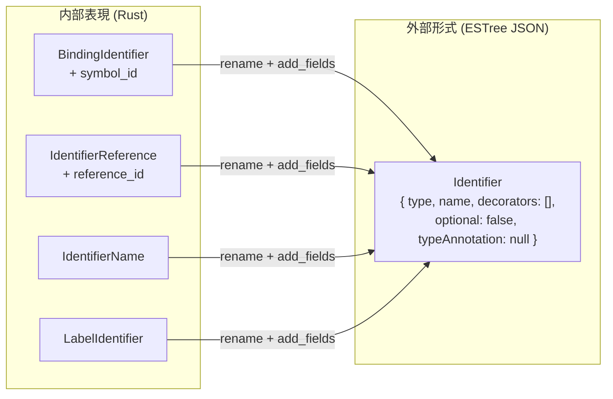

## 何を学んだか

**ESTree** は JS の AST の形式仕様で、`{ type: "BinaryExpression", left: ..., operator: "+", right: ... }` のような JSON オブジェクトの構造を定めている。

これが事実上の標準になった理由は、ESLint のプラグイン API がこの形を前提にしているからだ。ルールは `BinaryExpression(node) { ... }` と書く。**AST の形が変わると、何万本ものルールが壊れる。**

oxc の AST は、内部表現としては ESTree から意図的に外している。

- **`Identifier` を 4 つの型に分けた** — `IdentifierName` / `IdentifierReference` / `BindingIdentifier` / `LabelIdentifier`
- **enum で型階層を作った** — `Expression`、`Statement`、`Declaration` が Rust の enum
- **TS / JSX のノードを同じ木に混ぜた**

そのうえで、**外に出すときは ESTree の形に変換する** ([ESTree シリアライズ](./estree-serialization/))。**内部表現と外部形式を分けた**という設計になる。

## なぜそうなっているか

### ESTree の `Identifier` は曖昧すぎる

```text title="ARCHITECTURE.md"
The Oxc AST differs significantly from the [estree](https://github.com/estree/estree) AST specification
by removing ambiguous nodes and introducing distinct types. While many existing JavaScript tools rely
on estree as their AST specification, a notable drawback is its abundance of ambiguous nodes that often
leads to confusion during development.

For example, instead of using a generic estree `Identifier`, the Oxc AST provides specific types such as:

- `BindingIdentifier` - for variable declarations and bindings
- `IdentifierReference` - for variable references
- `IdentifierName` - for property names and labels

This clear distinction greatly enhances the development experience by aligning more closely with
the ECMAScript specification and providing better type safety.
```

ESTree では、次の 4 つが全部 `Identifier` になる。

```js
const foo = 1; // 宣言される名前
bar(foo); // 参照
obj.baz; // プロパティ名
loop: while (1) {} // ラベル
```

**それぞれ性質が全く違う。**

|                       | 何を指すか                       | semantic が何を付けるか |
| --------------------- | -------------------------------- | ----------------------- |
| `BindingIdentifier`   | 宣言される名前                   | `symbol_id`             |
| `IdentifierReference` | 変数の参照                       | `reference_id`          |
| `IdentifierName`      | プロパティ名・キーワード的な名前 | 何も付かない            |
| `LabelIdentifier`     | ラベル                           | 何も付かない            |

型定義を見ると、フィールドが違う。

```rust title="crates/oxc_ast/src/ast/js.rs"
pub struct IdentifierReference<'a> {
    pub node_id: Cell<NodeId>,
    pub span: Span,
    /// The name of the identifier being referenced.
    pub name: Ident<'a>,
    /// Reference ID
    ///
    /// Identifies what identifier this refers to, and how it is used. This is
    /// set in the bind step of semantic analysis, and will always be [`None`]
    /// immediately after parsing.
    pub reference_id: Cell<Option<ReferenceId>>,
}
```

```rust title="crates/oxc_ast/src/ast/js.rs"
pub struct BindingIdentifier<'a> {
    pub node_id: Cell<NodeId>,
    pub span: Span,
    /// The identifier name being bound.
    pub name: Ident<'a>,
    /// Unique identifier for this binding.
    ///
    /// This gets initialized during [`semantic analysis`] in the bind step. If
    /// you choose to skip semantic analysis, this will always be [`None`].
    pub symbol_id: Cell<Option<SymbolId>>,
}
```

```rust title="crates/oxc_ast/src/ast/js.rs"
pub struct LabelIdentifier<'a> {
    pub node_id: Cell<NodeId>,
    pub span: Span,
    pub name: Ident<'a>,
}
```

**`reference_id` と `symbol_id` は排他的**で、`LabelIdentifier` にはどちらもない。ESTree のように 1 つの型にすると、「この `Identifier` に `symbol_id` が入っているか `reference_id` が入っているか」を実行時に判断することになる。

型を分ければ、**[Binder](./binder/) が `BindingIdentifier` にしか触らない**ことが型で保証される。

`Cell<Option<...>>` になっているのは、[`Visit` (不変参照) の中から書き込む](./binder/)ためだ。doc に「パース直後は常に `None`」と明記されている — **AST 単体では意味情報を持たない**という契約になる。

### enum で型階層を作る

ESTree では「式」は「`type` フィールドが式のどれかである物体」でしかない。動的型付けの JSON なら自然だが、Rust では表現できない。

oxc は enum を使う。

```rust title="crates/oxc_ast/src/ast/js.rs"
pub enum Expression<'a> {
    BooleanLiteral(Box<'a, BooleanLiteral>) = 0,
    NullLiteral(Box<'a, NullLiteral>) = 1,
    // ...
    // `MemberExpression` variants added here by `#[ast]` macro
    INHERIT(MemberExpression<'a>),
}
```

**「式の位置には `Expression` しか置けない」が型で保証される。** ESTree ベースのツールでは、`node.left` に文が入っている可能性を排除できない。

代わりに「`MemberExpression` は `Expression` の一種」という部分型関係が表現できなくなる。それを [enum 継承](./ast-memory-layout/)で解いている。

### TS と JSX を同じ木に混ぜる

ESTree には TypeScript のノードがない。TS-ESLint は `@typescript-eslint/typescript-estree` という独自の拡張を持っている。

oxc は最初から同じ `Expression` に混ぜた。

```rust title="crates/oxc_ast/src/ast/js.rs"
    /// See [`JSXElement`] for AST node details.
    JSXElement(Box<'a, JSXElement<'a>>) = 33,
    /// See [`JSXFragment`] for AST node details.
    JSXFragment(Box<'a, JSXFragment<'a>>) = 34,

    /// See [`TSAsExpression`] for AST node details.
    TSAsExpression(Box<'a, TSAsExpression<'a>>) = 35,
```

**JS のファイルをパースしても、これらの variant は型に存在する。** 使われないだけだ。

利点は「1 つのパーサ、1 つの AST、1 つの linter」が全方言をカバーできること ([TS と JSX を 1 つのパーサで](./ts-and-jsx/))。代償は、JS しか扱わない利用者も `match` に TS の腕を書く (または `_ => {}` で潰す) ことになる。

### それでも外向きは ESTree

内部でどれだけ分けても、**JS 側に AST を渡すときは ESTree の形に戻す。**

```rust title="crates/oxc_ast/src/ast/js.rs"
#[estree(
    rename = "Identifier",
    add_fields(decorators = TsEmptyArray, optional = TsFalse, typeAnnotation = TsNull),
    field_order(decorators, name, optional, typeAnnotation, span),
)]
pub struct IdentifierReference<'a> {
```

**`rename = "Identifier"`。** 4 つに分けた型が、出力では全部 `Identifier` に戻る。

`add_fields` はさらに徹底していて、**存在しないフィールドを捏造する。**

- `decorators: []` — `IdentifierReference` にデコレータはないが、TS-ESLint が期待するので空配列を出す
- `optional: false` — 同上
- `typeAnnotation: null` — 同上

`BindingIdentifier` だけは `typeAnnotation` が本物を出せる (`TsTypeAnnotationOrNull`)。

`field_order` でフィールドの並びまで指定している。**JSON のキー順を TS-ESLint に合わせる**ためで、スナップショットテストの差分を減らす。



**「内部表現は型安全に、外部形式は互換性重視に」**という分離になっている。変換のコストは [ast_tools が生成する](./ast-tools/)ので、手で書く必要がない。

### 特殊ケースは手書きで吸収する

属性で表現できない差分もある。

```rust title="crates/oxc_ast/src/serialize/mod.rs"
/// Serializer for `Program`.
///
/// In TS AST, set start span to start of first directive or statement.
/// This is required because unlike Acorn, TS-ESLint excludes whitespace and comments
/// from the `Program` start span.
/// See <https://github.com/oxc-project/oxc/pull/10134> for more info.
///
/// Special case where first statement is an `ExportDeclaration` or `ExportDefaultDeclaration`
/// exporting a class with decorators, where one of the decorators is before `export`.
```

**Acorn と TS-ESLint で `Program` の span の始まりが違う。** こういう互換性の細部は、属性ではなく手書きのコンバータで吸収する。

**互換性のための例外は 3 段構えになっている。**

1. 型定義の `#[estree(...)]` 属性 — 名前の変更、フィールドの捏造、順序
2. 手書きのコンバータ (`crates/oxc_ast/src/serialize/`) — 属性で書けないもの
3. 諦める — TS-ESLint と完全一致しない箇所は残る

### コメントは AST に入っていない

もう 1 つ ESTree と違う点として、コメントの扱いがある。

```rust title="crates/oxc_ast/src/ast/js.rs"
    /// Sorted comments
    #[content_eq(skip)]
    #[estree(skip)]
    pub comments: Vec<'a, Comment>,
```

**`Program` が持つ 1 本のリスト**になっていて、個々のノードには紐づいていない。

ESLint も同じ形 (`sourceCode.getAllComments()`) だが、Prettier は各ノードに `leadingComments` / `trailingComments` を付ける。oxc は前者を選び、[フォーマッタ側が位置から紐づける](./formatter-and-lsp/)。

「ソート済み」という不変条件があるので、二分探索でノードに対応するコメントを引ける。

## ソースコードのどこか

- [`crates/oxc_ast/src/ast/js.rs`](https://github.com/oxc-project/oxc/blob/apps_v1.81.0/crates/oxc_ast/src/ast/js.rs) — JS の AST 定義
- [`crates/oxc_ast/src/ast/ts.rs`](https://github.com/oxc-project/oxc/blob/apps_v1.81.0/crates/oxc_ast/src/ast/) — TypeScript のノード
- [`crates/oxc_ast/src/ast/jsx.rs`](https://github.com/oxc-project/oxc/blob/apps_v1.81.0/crates/oxc_ast/src/ast/) — JSX のノード
- [`crates/oxc_ast/src/ast/mod.rs`](https://github.com/oxc-project/oxc/blob/apps_v1.81.0/crates/oxc_ast/src/ast/mod.rs) — enum 継承の doc
- [`crates/oxc_ast/src/serialize/`](https://github.com/oxc-project/oxc/blob/apps_v1.81.0/crates/oxc_ast/src/serialize/) — ESTree への変換で手書きが要るもの
- [`npm/oxc-types/types.d.ts`](https://github.com/oxc-project/oxc/blob/apps_v1.81.0/npm/oxc-types/) — 生成された TypeScript の型定義

AST 型の doc は、ECMAScript 仕様へのリンク付きになっている。

```rust title="crates/oxc_ast/src/ast/js.rs"
/// `x` in `const x = 0;`
///
/// Represents a binding identifier, which is an identifier that is used to declare a variable,
/// function, class, or object.
///
/// See: [13.1 Identifiers](https://tc39.es/ecma262/#sec-identifiers)
///
/// Also see other examples in docs for [`BindingPattern`].
```

**1 行目が具体例、次が説明、最後が仕様へのリンク。** この形が全 AST 型に揃っている。**「`BindingIdentifier` とは何か」を調べるときに、具体例が最初に目に入る**のが効く。

## どう活かすか

**内部表現と外部形式を分ける。** 内部は型安全に、外部は互換性重視に。変換のコストは生成器で吸収できる。**両方を 1 つの型で満たそうとすると、どちらかが妥協になる。**

**「1 つの型が複数の役割を持つ」ときは、型を分けられないか考える。** ESTree の `Identifier` は 4 つの役割を持つので、どのフィールドが有効かが実行時にしか分からない。分ければコンパイル時に決まる。代償は変換層が必要になることで、そこは生成に回せる。

**互換性のための変換は 3 段構えで設計する。** 宣言的な属性 → 手書きの例外 → 諦める。全部を属性で書こうとすると属性が DSL になり、全部を手書きにすると量が増える。**「どこまでが属性で書けるか」の線を先に引く。**

**フィールドを捏造してでも互換を取ることがある。** `decorators: []` は情報を持たないが、相手が期待するので出す。**「相手が読めること」が「表現が正確なこと」より優先される場面**は実際にある。

**型の doc は「具体例 → 説明 → 仕様リンク」の順で書く。** oxc の AST 型は全部この形で、`/// `x`in`const x = 0;`` が 1 行目にある。抽象的な説明を先に読ませるより速い。

**コメントを AST に紐づけるかは、利用者で決まる。** 別リストにすると AST が軽くなるが、フォーマッタが位置から紐づける手間を負う。**利用者の大半が要らないなら、別リストが正しい。**
