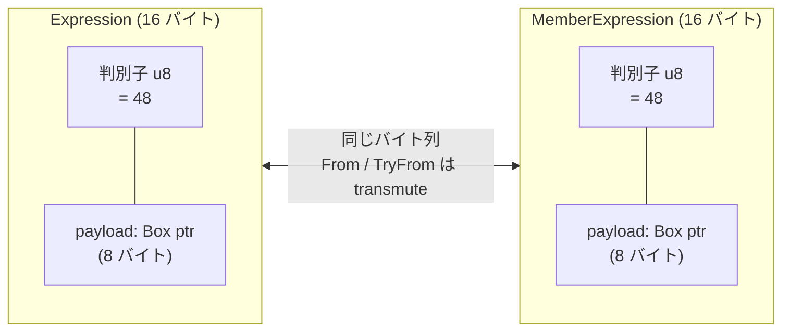

## 何を学んだか

AST を速くするには、木の形ではなく**ノード 1 個のバイト数**を見ることになる。ノードは何十万個も作られ、走査では次々にキャッシュに載る。1 ノードが 16 バイトか 24 バイトかで、同じ走査のキャッシュミス数が変わる。

oxc の AST 型は、この観点で 4 つの細工が入っている。

1. **`#[ast]` マクロがフィールドを並べ替える。** ソース上の宣言順は読みやすさ優先で、メモリ上の順はパディング最小で決まる
2. **enum は `#[repr(C, u8)]`。** `Expression` が `MemberExpression` の variant を判別子の値ごと取り込むので、両者の間の変換が `transmute` で済む
3. **`Span` は 8 バイトのまま align を 8 に上げる。** そのためにサイズ 0 のフィールドを 1 本足している
4. **AST ノード struct は `#[non_exhaustive]`。** 構造体リテラルでは作れず、`AstBuilder` を通すことになる

そして `size_of` と `offset_of` の期待値が **16 万行の `const` アサーション**として生成され、コンパイル時に検証される。

## なぜそうなっているか

### `Span` に「サイズ 0 のフィールド」がある

```rust title="crates/oxc_span/src/span.rs"
pub struct Span {
    /// The zero-based start offset of the span
    pub start: u32,
    /// The zero-based end offset of the span.
    pub end: u32,
    /// Align `Span` on 8 on 64-bit platforms
    _align: PointerAlign,
}
```

```rust title="crates/oxc_span/src/span.rs"
struct PointerAlign([usize; 0]);
```

`[usize; 0]` は**サイズ 0・アライメント 8** (64bit の場合) の型だ。これを構造体に足すと、サイズは `u32` 2 本の 8 バイトのまま、アライメントだけが 4 から 8 に上がる。

なぜアライメントを上げたいのか。`Span` はほぼ全ての AST ノードの先頭フィールドで、その後ろにはポインタ (align 8) が並ぶ。`Span` の align が 4 のままだと、構造体全体の配置とフィールドのオフセット計算が「4 の倍数」を基準にしてしまい、後続のポインタの前にパディングが入る組み合わせが出る。先に 8 に上げておけば、`Span` の直後は必ず 8 の倍数になる。

`u32` を選んでいる理由は doc に明記されている。

```rust title="crates/oxc_span/src/span.rs"
/// Spans use `u32` for offsets, meaning only files up to 4GB are supported.
/// This is sufficient for "all" reasonable programs. This tradeof cuts the size
/// of `Span` in half, offering a sizeable performance improvement and memory
/// footprint reduction.
```

「4GB を超えるソースファイルは扱わない」という 1 行の割り切りで `Span` が半分になる。同じ前提が[アリーナの `Vec`](./bump-allocator/) の `len: u32` にも効いている。

### フィールドの宣言順とメモリ順が違う

`#[ast]` マクロは `STRUCTS` というテーブルを見て、フィールドを並べ替える。

```rust title="crates/oxc_ast_macros/src/ast.rs"
/// Details of how `#[ast]` macro should modify a struct.
pub struct StructDetails {
    /// Memory order of the struct's fields.
    ///
    /// `field_order[n]` is the position in memory of the field which is written `n`th in source.
    /// `#[ast]` macro re-orders the fields into this order, so the struct is packed with
    /// minimal padding.
    ///
    /// `None` if the fields are already in optimal order, and don't need re-ordering.
    pub field_order: Option<&'static [u8]>,

    /// Whether the struct is an AST node.
    /// i.e. it has a `node_id: Cell<NodeId>` field (and therefore an `AstKind`).
    ///
    /// `#[ast]` macro adds `#[non_exhaustive]` to AST node structs. That prevents them being
    /// constructed with a struct literal outside of `oxc_ast` - consumers must use `AstBuilder`
    /// instead.
    pub is_node: bool,

    /// `true` if struct has at most 1 field with non-zero size, so can be `#[repr(transparent)]`.
    pub is_transparent: bool,
}
```

`#[repr(Rust)]` のままなら並べ替えはコンパイラがやってくれる。しかし oxc は `#[repr(C)]` を付ける必要がある — **JS 側や `raw_deser` がフィールドのオフセットを知っている前提で読むから**だ ([raw transfer](./estree-serialization/))。`#[repr(C)]` は宣言順を保証する代わりにパディング最適化を放棄する。

そこで「`#[repr(C)]` を付けたうえで、宣言順のほうを最適に並べ替える」という手を取っている。並べ替えの計算は毎回のコンパイルではなく **ast_tools 側で 1 度だけ**行われ、結果が `STRUCTS` テーブルに焼かれている。proc マクロの中で毎回レイアウト計算をするとビルドが遅くなるからだ。

```rust title="crates/oxc_ast_macros/src/ast.rs"
    // Get struct data. Calculated by `oxc_ast_tools`, rather than re-calculating here on
    // every compilation.
```

`is_node` のほうも効いている。`node_id` フィールドを持つ struct は AST ノードとみなされ、`#[non_exhaustive]` が付く。すると `oxc_ast` の外から `IdentifierName { span, name, node_id }` のような構造体リテラルが書けなくなり、`AstBuilder` を通すしかなくなる。**`node_id` を初期化し忘れたノードが外部から作られない**ことが型で保証される。

### enum 継承 — `Expression` は `MemberExpression` を「含む」

JS の文法では `MemberExpression` は `Expression` の一種だ。素直に書くなら入れ子の enum になる。

```rust
pub enum Expression<'a> {
    // ...
    MemberExpression(MemberExpression<'a>),
}
```

こう書くと `expr` が member expression かどうかを見るのに 2 段のマッチが要るし、`Expression` のサイズが `MemberExpression` のサイズ + 判別子になる。

oxc は `INHERIT` というマーカー variant を置き、`#[ast]` マクロがそれを展開する。

```rust title="crates/oxc_ast/src/ast/js.rs"
pub enum Expression<'a> {
    /// See [`BooleanLiteral`] for AST node details.
    BooleanLiteral(Box<'a, BooleanLiteral>) = 0,
    // ...
    V8IntrinsicExpression(Box<'a, V8IntrinsicExpression<'a>>) = 40,

    // `MemberExpression` variants added here by `#[ast]` macro
    INHERIT(MemberExpression<'a>),
}
```

展開後はこうなる。

```rust title="crates/oxc_ast/src/ast/mod.rs (doc コメント)"
#[repr(C, u8)]
pub enum Expression<'a> {
    BooleanLiteral(Box<'a, BooleanLiteral>) = 0,
    NullLiteral(Box<'a, NullLiteral>) = 1,
    // ...

    // Inherited from `MemberExpression`
    ComputedMemberExpression(Box<'a, ComputedMemberExpression<'a>>) = 48,
    StaticMemberExpression(Box<'a, StaticMemberExpression<'a>>) = 49,
    PrivateFieldExpression(Box<'a, PrivateFieldExpression<'a>>) = 50,
}
```

**判別子の値が両方の enum で一致している**のが要点だ。`MemberExpression` 側でも `ComputedMemberExpression = 48` になっている。`#[repr(C, u8)]` はレイアウトを「u8 の判別子 + payload の共用体」に固定するので、判別子が一致していれば `Expression` と `MemberExpression` は同じバイト列として読める。`From` / `TryFrom` が実質 `transmute` で書ける。



サイズはこう固定されている。

```rust title="crates/oxc_ast/src/generated/assert_layouts.rs"
    assert!(size_of::<Expression>() == 16);
    assert!(align_of::<Expression>() == 8);
```

判別子 1 バイト + パディング 7 + `Box` のポインタ 8 = 16 バイト。**JS の式ノードすべてが 16 バイトで表現される。** `Vec<Expression>` は 16 バイト刻みの配列になり、走査がキャッシュに乗りやすい。

`#[repr(u8)]` と `#[repr(C, u8)]` の使い分けはこうなっている。

```rust title="crates/oxc_ast_macros/src/ast.rs"
    // Fieldless enums are `#[repr(u8)]`. Enums with any non-unit variant are `#[repr(C, u8)]`.
    let repr = if enum_details.is_fieldless { quote!(#[repr(u8)]) } else { quote!(#[repr(C, u8)]) };
```

### レイアウトが 16 万行の const assert で固定されている

```rust title="crates/oxc_ast/src/generated/assert_layouts.rs"
#[cfg(target_pointer_width = "64")]
const _: () = {
    // Padding: 4 bytes
    assert!(size_of::<Program>() == 144);
    assert!(align_of::<Program>() == 8);
    assert!(offset_of!(Program, span) == 0);
    assert!(offset_of!(Program, node_id) == 8);
    assert!(offset_of!(Program, scope_id) == 12);
    assert!(offset_of!(Program, source_text) == 16);
    assert!(offset_of!(Program, comments) == 32);
    assert!(offset_of!(Program, hashbang) == 56);
    assert!(offset_of!(Program, directives) == 88);
    assert!(offset_of!(Program, body) == 112);
    assert!(offset_of!(Program, source_type) == 136);
```

`crates/oxc_ast/src/generated/assert_layouts.rs` は 16 万バイトあり、64bit / 32bit 別に全 AST 型のサイズ・アライメント・全フィールドのオフセットを `const` で検証する。**`const` なのでコンパイルが通らないという形で失敗する** — テストを走らせる必要がない。

`// Padding: 4 bytes` というコメントまで生成されている。フィールドを 1 本足したときに、それがパディングに吸収されるのか構造体が 8 バイト伸びるのかが、diff を見た瞬間に分かる。

このアサーションが要るのは、**レイアウトが oxc の外部インタフェースだから**だ。`raw_deser` の JS コードはこのオフセットをハードコードしている。Rust 側で誰かがフィールドを足して、ast_tools を回さずにコミットすれば、JS 側の読み取りが静かに壊れる。const assert はその瞬間にビルドを止める。

## ソースコードのどこか

- [`crates/oxc_span/src/span.rs`](https://github.com/oxc-project/oxc/blob/apps_v1.81.0/crates/oxc_span/src/span.rs) — `Span` と `PointerAlign`
- [`crates/oxc_ast_macros/src/ast.rs`](https://github.com/oxc-project/oxc/blob/apps_v1.81.0/crates/oxc_ast_macros/src/ast.rs) — `#[ast]` マクロ。repr 付与・フィールド並べ替え・`INHERIT` 展開
- [`crates/oxc_ast/src/ast/mod.rs`](https://github.com/oxc-project/oxc/blob/apps_v1.81.0/crates/oxc_ast/src/ast/mod.rs) — enum 継承の doc。展開前後の対比が書いてある
- [`crates/oxc_ast/src/generated/assert_layouts.rs`](https://github.com/oxc-project/oxc/blob/apps_v1.81.0/crates/oxc_ast/src/generated/assert_layouts.rs) — レイアウトの const 検証
- [`crates/oxc_ast/src/generated/inherit_variants.rs`](https://github.com/oxc-project/oxc/blob/apps_v1.81.0/crates/oxc_ast/src/generated/inherit_variants.rs) — `From` / `TryFrom` / `is_*` / `as_*` (243KB)

`#[ast]` マクロが `INHERIT` を展開する部分では、span の扱いが丁寧になっている。

```rust title="crates/oxc_ast_macros/src/ast.rs"
            // Insert the inherited enum's variants, spanned to the `INHERIT` marker variant
            // they replace (so "go to definition" on the inserted variants jumps to the marker).
```

生成された variant に元のマーカー variant の span を付けているので、IDE の「定義へ移動」が壊れない。さらに `const _: Option<MemberExpression<'static>> = None;` を吐いて、`INHERIT(MemberExpression<'a>)` と書いた `MemberExpression` の識別子からも定義に飛べるようにしている。**コード生成が IDE 体験を壊さないところまで面倒を見ている。**

## どう活かすか

**「レイアウトが外部インタフェースになった」瞬間に、検証を型かコンパイル時アサーションに移す。** FFI、共有メモリ、mmap したファイル形式。どれもフィールドを 1 本足しただけで相手側が壊れる。`const { assert!(offset_of!(...) == N) }` は Rust なら数行で書けて、CI を待たずにビルドが止まる。

**「読みやすい宣言順」と「詰まったメモリ順」を両立させたいなら、生成に逃がす。** 手で並べ替えると読みにくいし、`#[repr(C)]` を外すとオフセットが保証されない。oxc は「宣言は読みやすく書き、マクロが並べ替える」を選んだ。並べ替えの計算をマクロの中でやらずテーブルに焼いているのは、ビルド時間のためだ。

**enum のサイズは判別子ではなく最大 variant で決まる。** 入れ子の enum は素朴だが、内側の enum のサイズがそのまま外側に伝播する。`Box` に包んでポインタにするか、oxc のように「継承」で平坦化するか。平坦化は判別子の値を手で管理する負担と引き換えだが、oxc はその管理をコード生成に任せている。

一方で、**この設計は生成器なしには維持できない。** `Expression` の variant を 1 つ足すには、判別子の値を決め、`MemberExpression` 側と衝突しないようにし、`AstKind`・`Visit`・`Ancestor`・TS 型定義・JS デシリアライザを更新する必要がある。それが手作業なら破綻する。だから次のページが[ast_tools](./ast-tools/)になる。
