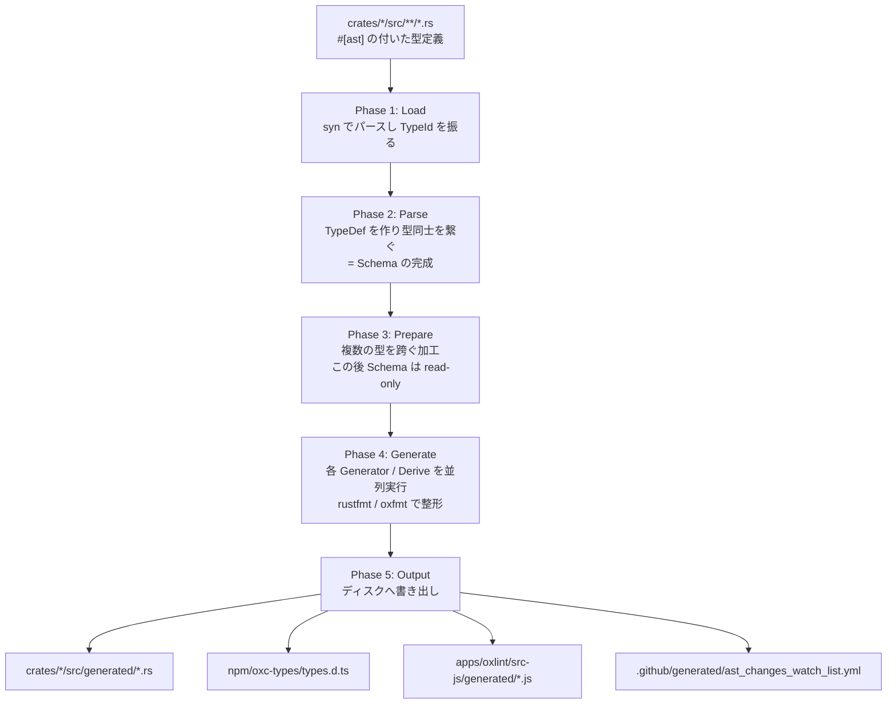

## 何を学んだか

AST 型を 1 つ足すと、連動して直す場所がいくつある か。`AstKind` の variant、`Visit` / `VisitMut` のメソッド、`walk_*` 関数、`Traverse` の `enter_*` / `exit_*`、`Ancestor` の判別子、`AstBuilder` のコンストラクタ、`CloneIn` / `ContentEq` / `GetSpan` の実装、ESTree シリアライザ、TypeScript の型定義、JS 側のデシリアライザ。**手で全部やるのは無理**という規模になる。

oxc の答えは、**AST の型定義 (`#[ast]` の付いた Rust の struct / enum) を唯一の真実とし、そこから全部生成する**というものだ。`tasks/ast_tools` がその生成器で、次の性質を持つ。

- **入力は Rust のソースコードそのもの。** IDL でもスキーマファイルでもなく、`crates/oxc_ast/src/ast/*.rs` を `syn` でパースする
- **出力は Rust に留まらない。** `npm/oxc-types/types.d.ts`、`apps/oxlint/src-js/generated/*.js`、`.github/generated/ast_changes_watch_list.yml`
- **proc マクロではない。** `just ast` で明示的に走らせ、生成物は git にコミットされる
- **CI が `git diff --exit-code` で検証する。** 生成し忘れたらビルドではなく CI が落ちる

## なぜそうなっているか

### なぜ proc マクロにしなかったのか

`main.rs` の doc に理由が 2 つ書いてある。

```rust title="tasks/ast_tools/src/main.rs"
//! Code generation is *not* run automatically during compilation. This has 2 advantages:
//! 1. Code generation does not slow down compile times, unlike e.g. proc macros.
//! 2. Generated code can be viewed and navigated easily in an IDE, in the usual way.
```

2 番目が効く。`AstKind` は 10 万行の enum で、`walk.rs` は 22 万行ある。proc マクロで生成すると、IDE の「定義へ移動」が展開結果に届かない。ファイルとして存在していれば、普通に開いて読める。

代償は「生成し忘れ」が起きうることで、それを CI で塞いでいる。

### 5 つのフェーズ



**Phase 2 の終わりで `Schema` が完成し、それ以降は `syn` の型を使わない。** これが設計の中心にある。

```rust title="tasks/ast_tools/src/main.rs"
//! The end result of this phase is the [`Schema`], which is the single source of truth about the AST.
//!
//! After this point, the types produced by `syn` are not used - all info about the AST is in
//! the [`Schema`], and everything from this point onwards works off the `Schema` only.
```

`syn` は入口の 1 か所だけで使い、その後は自前のデータモデルで押し通す。各 generator が `syn::Type` を触りに行かないので、生成器を足すときに `syn` の API を覚える必要がない。

Phase 3 が独立しているのも理由がある。Phase 2 のパース中、generator は 1 つの型定義しか見られない。「全型を見渡さないとできない加工」(例: レイアウト計算) のために、Phase 3 だけ `&mut Schema` を渡す。**その後 Schema は read-only になり、Phase 4 の generator は並列に走れる。**

```rust title="tasks/ast_tools/src/main.rs"
    // Run generators
    let mut outputs = if options.serial {
        // ...
    } else {
        // Run in parallel
        runners.par_iter().map(|runner| runner.run(&schema, &codegen)).reduce(...)
    };
```

### Generator と Derive の分業

```rust title="tasks/ast_tools/src/main.rs"
/// Derives (for use with `#[generate_derive]`)
const DERIVES: &[&(dyn Derive + Sync)] = &[
    &derives::DeriveCloneIn,
    &derives::DeriveDummy,
    &derives::DeriveTakeIn,
    &derives::DeriveReplaceWith,
    &derives::DeriveGetAddress,
    &derives::DeriveUnstableAddress,
    &derives::DeriveGetSpan,
    &derives::DeriveGetSpanMut,
    &derives::DeriveContentEq,
    &derives::DeriveESTree,
];

/// Code generators
const GENERATORS: &[&(dyn Generator + Sync)] = &[
    &generators::AssertLayoutsGenerator,
    &generators::AstKindGenerator,
    &generators::AstBuilderGenerator,
    &generators::GetIdGenerator,
    &generators::InheritVariantsGenerator,
    &generators::VisitGenerator,
    &generators::VisitJsGenerator,
    &generators::ScopesCollectorGenerator,
    &generators::Utf8ToUtf16ConverterGenerator,
    #[cfg(feature = "generate-js")]
    &generators::ESTreeVisitGenerator,
    #[cfg(feature = "generate-js")]
    &generators::OxlintEnvsGenerator,
    #[cfg(feature = "generate-js")]
    &generators::RawTransferGenerator,
    #[cfg(feature = "generate-js")]
    &generators::RawTransferLazyGenerator,
    #[cfg(feature = "generate-js")]
    &generators::TypescriptGenerator,
    &generators::FormatterFormatGenerator,
    &generators::FormatterAstNodesGenerator,
    &generators::TraverseGenerator,
    &generators::MinifierTraverseGenerator,
];
```

境界はこうなっている。

- **`Derive`** — 1 つの型につき 1 つの `impl` を返す。`#[generate_derive(GetSpan)]` と書いた型にだけ走る。普通の derive マクロと同じ粒度
- **`Generator`** — AST 全体を 1 度に見て、1 個以上のファイルを出す。`AstKind` のような「全型を並べた 1 つの enum」はこちら

注目すべきは `TraverseGenerator` と `MinifierTraverseGenerator` が**両方ある**ことだ。`Traverse` トレイトは `oxc_traverse` と `oxc_minifier/src/generated/` に、同じ生成器から 2 組吐かれている。「生成物は `oxc_ast/src/generated/` にある」という前提で読むと外す。

同様に `#[cfg(feature = "generate-js")]` の 5 つは JS 側の出力を担当する。`justfile` の `ast` レシピが 2 段構えになっているのは、この feature の有無で生成順序に依存があるためだ。

```make title="justfile"
ast:
  cargo run -p oxc_ast_tools || { cargo run -p oxc_ast_tools --no-default-features && cargo run -p oxc_ast_tools; }
```

### 「特別扱いはコードではなく型定義に書く」

generator を書くときの規約が明記されている。

```rust title="tasks/ast_tools/src/main.rs"
//! [`Generator`]s and [`Derive`]s should keep "special case" logic written with the generator's
//! code to a minimum (and ideally not do it at all).
//!
//! Any info that the generator needs about how to treat each type should be recorded on the type
//! definition itself, with custom attributes e.g. `#[visit]`, `#[clone_in(default)]` - instead of
//! hard-coding those cases within the generator code itself.
```

たとえば `Expression::FunctionExpression` には `#[visit(args(flags = ScopeFlags::Function))]` が付いている。generator の中に「`FunctionExpression` のときは `ScopeFlags::Function` を渡す」と書くのではなく、**型定義の側に書いて generator は属性を読むだけにする**。

こうすると、AST を触る人が generator のコードを読まずに済む。属性は型定義の隣にあるので、variant を足すときに一緒に目に入る。

### 出力が CI の設定ファイルにまで及ぶ

いちばん面白いのがこれになる。

```rust title="tasks/ast_tools/src/output/yaml.rs"
    /// Generate CI watch list YAML file.
    ///
    /// This is used in `ast_changes` CI job to skip running `oxc_ast_tools`
    /// unless relevant files have changed.
    ///
    /// The watch list includes:
    /// * Glob patterns for watched crates (`{crate}/src/**/*.rs`)
    /// * Generated output file paths (excluding those already covered by crate globs)
    /// * `ast_tools` crate itself
    /// * CI workflow file
    /// * Config files (`Cargo.toml`, `Cargo.lock`, `package.json`, `oxfmtrc.jsonc`)
```

`.github/generated/ast_changes_watch_list.yml` は 66 行のパスリストで、CI の `dorny/paths-filter` にそのまま渡される。

```yaml title=".github/workflows/ci.yml"
- uses: dorny/paths-filter@... # v4.0.3
  id: filter
  with:
    filters: ".github/generated/ast_changes_watch_list.yml"
# ...
- name: Check AST Changes
  if: steps.filter.outputs.src == 'true'
  run: |
    cargo run -p oxc_ast_tools
    git diff --exit-code ||
    (echo 'AST changes caused the "generated" code to get outdated. Have you forgotten to run the `just ast` command and/or commit generated codes?' && exit 1)
```

**「AST の生成に関係するファイルが変わったときだけ生成器を回す」**という CI の最適化があり、その「関係するファイル」のリストを生成器自身が出力している。生成器が出力先を 1 つ増やせば、監視リストにもそのパスが自動で入る。手でメンテするリストなら、間違いなく漏れる種類のものだ。

`crate_paths` は `cargo metadata` から取った「AST 型を含むクレート」に、`ast_tools` 自身の `oxc_*` 依存を足して作られる。**生成器の入力になりうるものが全部リストに入る**ように組んである。

### 生成物は git にコミットする

`git diff --exit-code` が成立するのは、生成物をコミットしているからだ。この選択にはトレードオフがある。

- **利点**: IDE で読める / ビルドが速い / PR の diff で生成結果の変化が見える / 生成器を持っていない人もビルドできる
- **欠点**: PR の diff が巨大になる (`rules_enum.rs` は 1.5MB) / コンフリクトしやすい / 「生成し忘れ」が起きうる

oxc は 3 番目の欠点を CI で塞ぎ、1 番目・2 番目は受け入れている。**diff が巨大になることを、レビューの負担ではなく「生成結果の変化が見える」という利点として扱っている**のが判断のポイントになる。実際、`assert_layouts.rs` の diff は「フィールドを 1 本足したらサイズが 8 バイト増えた」を直接見せてくれる。

## ソースコードのどこか

- [`tasks/ast_tools/src/main.rs`](https://github.com/oxc-project/oxc/blob/apps_v1.81.0/tasks/ast_tools/src/main.rs) — 5 フェーズの解説、`DERIVES` / `GENERATORS`、生成器の追加手順
- [`tasks/ast_tools/src/schema/`](https://github.com/oxc-project/oxc/blob/apps_v1.81.0/tasks/ast_tools/src/schema/) — `Schema` / `TypeDef` / `StructDef` / `EnumDef`
- [`tasks/ast_tools/src/generators/`](https://github.com/oxc-project/oxc/blob/apps_v1.81.0/tasks/ast_tools/src/generators/) — 各 generator
- [`tasks/ast_tools/src/output/yaml.rs`](https://github.com/oxc-project/oxc/blob/apps_v1.81.0/tasks/ast_tools/src/output/yaml.rs) — CI 監視リストの生成
- [`.github/generated/ast_changes_watch_list.yml`](https://github.com/oxc-project/oxc/blob/apps_v1.81.0/.github/generated/ast_changes_watch_list.yml) — 生成された CI フィルタ

主要な出力先を並べるとこうなる。

| 出力先                                          | 中身                                                             |
| ----------------------------------------------- | ---------------------------------------------------------------- |
| `crates/oxc_ast/src/generated/`                 | `AstKind`・`AstBuilder` (890KB)・各種 derive・`inherit_variants` |
| `crates/oxc_ast_visit/src/generated/`           | `Visit` / `VisitMut` / `walk` / `walk_mut`                       |
| `crates/oxc_traverse/src/generated/`            | `Traverse`・`Ancestor` (607KB)・`walk`                           |
| `crates/oxc_minifier/src/generated/`            | minifier 専用の `Traverse` (別生成器・同じ定義から)              |
| `crates/oxc_ast_macros/src/generated/`          | `#[ast]` マクロが読む `ENUMS` / `STRUCTS` テーブル               |
| `crates/oxc_formatter/src/ast_nodes/generated/` | formatter 用の親リンク付きノード                                 |
| `napi/parser/src/generated/`                    | raw transfer の定数とレイアウト検証                              |
| `apps/oxlint/src-js/generated/`                 | JS 側のデシリアライザと walker                                   |
| `npm/oxc-types/types.d.ts`                      | TypeScript の AST 型定義                                         |
| `.github/generated/`                            | CI の paths-filter                                               |

`crates/oxc_ast_macros/src/generated/` が出力先に入っているのが循環しているようで面白い。**`#[ast]` マクロが読むテーブルを ast_tools が生成し、その ast_tools は `#[ast]` の付いたソースを読む。** `justfile` の `ast` レシピが失敗時に `--no-default-features` を挟んで 2 回走らせるのは、この鶏卵をほどくためだ。

## どう活かすか

**「1 つの定義から N か所を導出する」構造は、N が 5 を超えたあたりで生成に倒す価値が出る。** ただし、生成器を書くコストは小さくない。ast_tools は `main.rs` の doc だけで 170 行ある。判断の分かれ目は「導出先が言語やプロセスを跨ぐか」で、Rust の中だけなら derive マクロで足りることが多い。TypeScript の型定義や CI の設定まで導出したい時点で、外部生成器が要る。

**生成物をコミットするなら、`git diff --exit-code` を CI に入れる。** これだけで「生成し忘れ」というクラスの事故が消える。逆に、この 1 行がないなら生成物をコミットする意味はほぼない。

**入力形式に既存のソースコードを使えないか考える。** 別途 IDL を持つと、IDL と実装の同期という新しい問題が生まれる。oxc は Rust の型定義そのものを入力にしたので、その問題がない。代わりに `syn` でパースする手間を払っているが、**それはパース側 1 か所に閉じている** (Phase 2 で `Schema` に移し替える)。

**特別扱いは生成器ではなく入力側に書く。** 「この型のときだけこうする」を生成器のコードに入れると、生成器が育つほど誰も触れなくなる。属性として型定義の隣に置けば、型を触る人と同じ場所にある。
