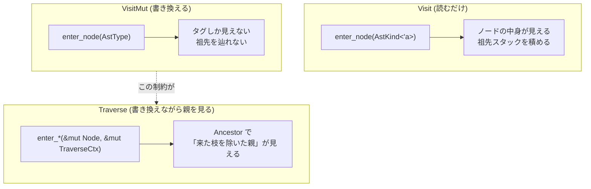

## 何を学んだか

AST を走査する仕組みは[ast_tools](./ast-tools/)が生成する。読み取り用が `Visit`、書き換え用が `VisitMut` で、どちらも「全ノード型に `visit_*` メソッドがあり、既定実装が対応する `walk_*` を呼ぶ」という素直な形になっている。

ところが、この 2 つには**型レベルの非対称**がある。

```rust title="crates/oxc_ast_visit/src/generated/visit.rs"
pub trait Visit<'a>: Sized {
    #[inline]
    fn enter_node(&mut self, kind: AstKind<'a>) {}
    #[inline]
    fn leave_node(&mut self, kind: AstKind<'a>) {}
```

```rust title="crates/oxc_ast_visit/src/generated/visit_mut.rs"
pub trait VisitMut<'a>: Sized {
    #[inline]
    fn enter_node(&mut self, kind: AstType) {}
    #[inline]
    fn leave_node(&mut self, kind: AstType) {}
```

`Visit` は `AstKind<'a>` — **ノードへの参照を持つ enum** を受け取る。`VisitMut` は `AstType` — **タグだけの fieldless enum** しか受け取らない。

つまり `VisitMut` の実装は「今 `BinaryExpression` に入った」ことしか知らされない。そのノードの中身は `visit_binary_expression(&mut self, it: &mut BinaryExpression)` の引数から取れるが、**祖先のスタックを `AstKind` で積んで親を見る、ということができない。** これが `oxc_traverse` という 3 つ目の走査機構が存在する理由になる。

## なぜそうなっているか

### `AstKind` は「ノードへの参照 + タグ」

```rust title="crates/oxc_ast/src/generated/ast_kind.rs"
/// Untyped AST Node Kind
#[derive(Debug, Clone, Copy)]
#[repr(C, u8)]
pub enum AstKind<'a> {
    Program(&'a Program<'a>) = AstType::Program as u8,
    IdentifierName(&'a IdentifierName<'a>) = AstType::IdentifierName as u8,
    IdentifierReference(&'a IdentifierReference<'a>) = AstType::IdentifierReference as u8,
    // ...
}
```

判別子の値が `AstType` の値と一致するように振られている ([AST のメモリレイアウト](./ast-memory-layout/)と同じ手口)。`AstKind` は 16 バイト (タグ + 参照) で、`Copy` なので走査中に気軽にコピーできる。

`AstType` のほうは fieldless で `#[repr(u8)]`、上限が定数になっている。

```rust title="crates/oxc_ast/src/generated/ast_kind.rs"
/// The largest integer value that can be mapped to an `AstType`/`AstKind` enum variant.
pub const AST_TYPE_MAX: u8 = 191;
```

この `AST_TYPE_MAX` が後で効いてくる。[リンタのディスパッチ](./rule-dispatch/)は「どのルールがどの `AstType` を触るか」を 192 ビットのビットセットで持つので、`u8` に収まっていることが前提になる。

### `AstKind` は全 AST 型にあるわけではない

これは名前から想像がつかないので注意がいる。

```rust title="tasks/ast_tools/src/generators/ast_kind.rs"
//! Variants of `AstKind` and `AstType` are created for all structs which have a `NodeId` field.
```

```rust title="tasks/ast_tools/src/generators/ast_kind.rs"
    /// Set `has_kind` for structs and enums.
    ///
    /// All structs with a `NodeId` have an `AstKind`.
    /// Enums do not have an `AstKind`.
    fn prepare(&self, schema: &mut Schema, _codegen: &Codegen) {
        // Set `has_kind = true` for structs with a `NodeId`
        // ...
    }
```

2 つの除外がある。

- **enum には `AstKind` がない。** `Expression` や `Statement` は `AstKind::Expression(..)` にならない。走査が `Expression` に来ると、中身の具体的な variant (`BinaryExpression` など) の `AstKind` が積まれる
- **`node_id` フィールドを持たない struct にもない。** `Span` や `Modifiers` のような補助的な型が該当する

だから「AST の型 = `AstKind` の variant」ではない。191 という上限は、**`NodeId` を持つ struct の数**を表している。ルールを書くときに `AstKind::Expression` を探して見つからないのは、この規則によるものだ。

### 生成される `walk_*` の形

生成された走査関数は、対称的な 5 行になっている。

```rust title="crates/oxc_ast_visit/src/generated/visit.rs"
    pub fn walk_binary_expression<'a, V: Visit<'a>>(visitor: &mut V, it: &BinaryExpression<'a>) {
        let kind = AstKind::BinaryExpression(visitor.alloc(it));
        visitor.enter_node(kind);
        visitor.visit_span(&it.span);
        visitor.visit_expression(&it.left);
        visitor.visit_expression(&it.right);
        visitor.leave_node(kind);
    }
```

`VisitMut` 側は同じ形で、`kind` の作り方だけが違う。

```rust title="crates/oxc_ast_visit/src/generated/visit_mut.rs"
    pub fn walk_binary_expression<'a, V: VisitMut<'a>>(
        visitor: &mut V,
        it: &mut BinaryExpression<'a>,
    ) {
        let kind = AstType::BinaryExpression;
        visitor.enter_node(kind);
        visitor.visit_span(&mut it.span);
        visitor.visit_expression(&mut it.left);
        visitor.visit_expression(&mut it.right);
        visitor.leave_node(kind);
    }
```

`visitor.alloc(it)` の中身がこれになる。

```rust title="crates/oxc_ast_visit/src/generated/visit.rs"
    #[inline]
    fn alloc<T>(&self, t: &T) -> &'a T {
        // SAFETY:
        // This should be safe as long as `src` is an reference from the allocator.
        // But honestly, I'm not really sure if this is safe.
        unsafe { std::mem::transmute(t) }
    }
```

`&'_ T` を `&'a T` に伸ばす `transmute` で、正直なコメントが付いている。**ノードがアリーナ上にあり、アリーナが `'a` の間生きているなら正しい**が、それを型で保証する手段がないので `unsafe` になっている。

### なぜ `VisitMut` は `AstType` しか渡せないのか

`walk_binary_expression` の `VisitMut` 版では、`it` は `&mut BinaryExpression` だ。ここで `AstKind::BinaryExpression(&*it)` を作って `enter_node` に渡すとどうなるか。

`enter_node(&mut self, kind: AstKind<'a>)` に渡した後、`visitor.visit_expression(&mut it.left)` を呼ぶ。**`kind` の中の `&BinaryExpression` はまだ生きていて、`it.left` を含む木全体を指している。** そこに `&mut it.left` を渡すのは共有参照と可変参照の同時存在で、借用検査を通らない。`transmute` で無理に通すなら、それは本物の未定義動作になる。

**この制約は Rust の設計そのものから来ていて、回避の余地がない。** だから oxc は「`VisitMut` では親を見せない」と割り切った。祖先を見ながら書き換えたいなら、参照ではなく**生ポインタ**を持ち、しかも「今降りてきた枝だけは見せない」という細工が要る。それが [`oxc_traverse`](./traverse-vs-visitmut/) になる。



### 3 つの走査機構の使い分け

|            | 引数                     | 祖先                            | 主な利用者                                                         |
| ---------- | ------------------------ | ------------------------------- | ------------------------------------------------------------------ |
| `Visit`    | `&T`                     | 自分で `AstKind` を積めば辿れる | [SemanticBuilder](./semantic-builder/)、linter の一部              |
| `VisitMut` | `&mut T`                 | 辿れない                        | 単純な書き換え、[Utf8ToUtf16](./estree-serialization/)             |
| `Traverse` | `&mut T` + `TraverseCtx` | `Ancestor` で辿れる             | [Transformer](./transformer/)、[Minifier](./minifier-and-mangler/) |

`Traverse` があるなら `VisitMut` は要らないのでは、と思えるが、`Traverse` は `Ancestor` のスタック管理と生ポインタの操作を伴うぶん重い。祖先が要らない書き換えなら `VisitMut` のほうが単純で速い。

なお **`oxc_formatter` はこのどれも使わない**。親リンク付きの `AstNode<'a, T>` を ast_tools に生成させて、そちらで辿る ([Formatter と language_server](./formatter-and-lsp/))。走査機構が 4 つある、という言い方もできる。

## ソースコードのどこか

- [`crates/oxc_ast/src/generated/ast_kind.rs`](https://github.com/oxc-project/oxc/blob/apps_v1.81.0/crates/oxc_ast/src/generated/ast_kind.rs) — `AstType` / `AstKind` (102KB)
- [`tasks/ast_tools/src/generators/ast_kind.rs`](https://github.com/oxc-project/oxc/blob/apps_v1.81.0/tasks/ast_tools/src/generators/ast_kind.rs) — `has_kind` の判定規則
- [`crates/oxc_ast_visit/src/generated/visit.rs`](https://github.com/oxc-project/oxc/blob/apps_v1.81.0/crates/oxc_ast_visit/src/generated/visit.rs) — `Visit` と `walk`
- [`crates/oxc_ast_visit/src/generated/visit_mut.rs`](https://github.com/oxc-project/oxc/blob/apps_v1.81.0/crates/oxc_ast_visit/src/generated/visit_mut.rs) — `VisitMut` と `walk_mut`

`AstKind` には generator が付けるメソッドが並んでいる。

```rust title="tasks/ast_tools/src/generators/ast_kind.rs"
//! * `AstType` type definition.
//! * `AstKind` type definition.
//! * `AstKind::ty` method.
//! * `AstKind::node_id` & `AstKind::set_node_id` methods.
//! * `AstKind::as_*` methods.
//! * `GetSpan` impl for `AstKind`.
//! * `GetAddress` impl for `AstKind`.
```

`ty()` で `AstKind` → `AstType` に落とせる。リンタのディスパッチはこれを使って「この `AstKind` に興味があるルール」を引く。`as_*` は `AstKind::as_binary_expression() -> Option<&BinaryExpression>` の形で、ルールが書く `match` の代わりになる。

## どう活かすか

**API の非対称は、まず制約の反映かどうかを疑う。** `Visit` と `VisitMut` の `enter_node` が違う型を取るのは、一見すると設計の粗さに見える。実際には Rust の借用規則から来ていて、揃えようとすると `unsafe` か未定義動作にしか行き着かない。**揃っていない API に出会ったら、揃えられなかった理由を先に探す**ほうがいい。ここでは「揃えないまま 3 つ目の機構を足す」が正解だった。

**「タグだけの enum」と「参照つきの enum」を判別子を揃えて両方持つのは使える型だ。** 重い情報が要らない場面では `AstType` (1 バイト) を渡し、要る場面では `AstKind` (16 バイト) を渡す。判別子が一致していれば `kind.ty()` はタグの読み出しだけで済む。ビットセットやテーブルの添字には `AstType` を使い、実データが要るときだけ `AstKind` を持つ、という分業ができる。

**生成される走査は「拡張点をどこに置くか」を先に決める。** oxc の `walk_*` は `enter_node` → 子を訪問 → `leave_node` で固定されていて、実装側は `visit_*` を上書きすることで途中に割り込む。この形だと「子を訪問しない」も「子の前に何かする」も表現できる。逆に enter/leave のコールバックだけだと、部分木のスキップが書けない。
