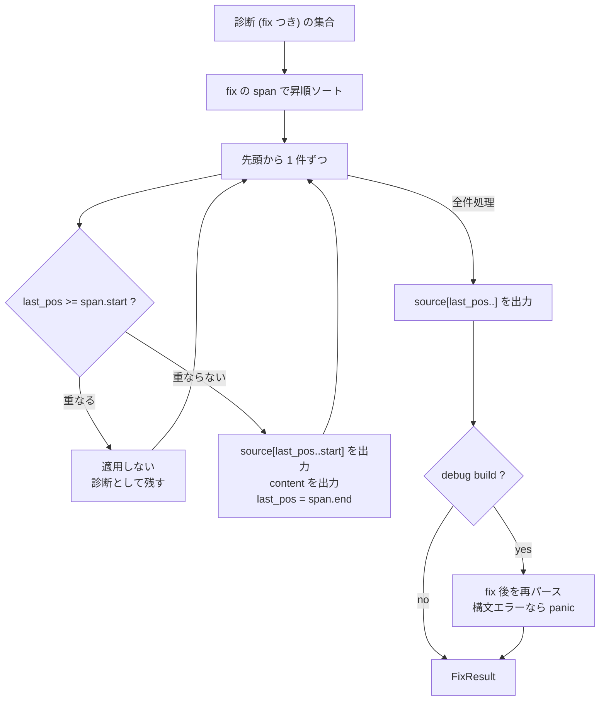

## 何を学んだか

`oxlint --fix` の実装で、まず知っておくべきことが 2 つある。

**1. マルチパスがない。** ESLint は fix を適用してから再度 lint し、変化がなくなるまで最大 10 回繰り返す。oxc にはそのループが存在しない。`Fixer::fix()` を呼ぶのはファイルごとに 1 回だけになる。

**2. 重なった fix は捨てる。** 適用済みの範囲と重なる fix は適用せず、その診断を残す。境界が接するだけ (`[0,5]` と `[5,10]`) も重なりとみなす。

そのぶん、fix の**安全性**は型と assertion で担保している。

- `FixKind` というビットフラグが「安全な fix」「提案」「危険」を区別し、`--fix` / `--fix-suggestions` / `--fix-dangerously` で適用範囲を選ぶ
- debug build では **fix 後のコードを再パースし、構文エラーが出たら panic する**

## なぜそうなっているか

### `Fix` は「この範囲をこの文字列で置き換える」だけ

```rust title="crates/oxc_linter/src/fixer/fix.rs"
/// A completed, normalized fix ready to be applied to the source code.
///
/// Used internally by this module. Lint rules should use `RuleFix`.
#[derive(Debug, Clone, PartialEq, Eq)]
#[non_exhaustive]
pub struct Fix {
    pub content: Cow<'static, str>,
    /// A brief suggestion message describing the fix. Will be shown in
    /// editors via code actions.
    pub message: Option<Cow<'static, str>>,
    pub kind: FixKind,
    pub span: Span,
}
```

範囲と置換文字列。挿入は空の span、削除は空文字列で表す。

```rust title="crates/oxc_linter/src/fixer/fix.rs"
impl Fix {
    pub const fn delete(span: Span) -> Self {
        Self { content: Cow::Borrowed(""), message: None, span, kind: FixKind::None }
    }
```

**AST の差分ではなくテキストの置換**である点が重要になる。AST を書き換えて再出力する方式 ([Transformer + Codegen](./transformer/)) だと、フォーマットもコメントも全部作り直される。lint の fix は「元のコードを最小限だけ触る」ことが期待されるので、テキスト置換が正しい。

### `FixKind` が適用範囲を決める

```rust title="crates/oxc_linter/src/fixer/mod.rs"
    /// Flags describing an automatic code fix.
    ///
    /// [`FixKind`] is designed to be interoperable with [`bool`]. `true` turns
    /// into [`FixKind::Fix`] (applies only safe fixes) and `false` turns into
    /// [`FixKind::None`] (do not apply any fixes or suggestions).
    pub struct FixKind: u8 {
        /// An automatic code fix. Most of these are applied with `--fix`
        const Fix = 1 << 0;
        /// A recommendation about how to fix a rule violation. These are usually
        /// safe to apply, in that they shouldn't cause parse or runtime errors,
        /// but may change the meaning of the code.
        const Suggestion = 1 << 1;
        /// Marks a fix or suggestion as dangerous. Dangerous fixes/suggestions
        /// may break the code. Covers cases that are
        /// - Aggressive (e.g. some code removal)
        /// - Are under development. Think of this as similar to the `nursery`
        ///   rule category.
        const Dangerous = 1 << 2;

        /// Mark a fix or suggestion as an "ignore this section / line" fix. These are
        /// used to automatically add `// oxc-disable` comments to the source code.
        /// Only used by `--lsp`.
        const IgnoreFix = 1 << 3;
```

3 つの独立した軸ではなく、**2 軸のフラグの組み合わせ**になっている。

- `Fix` vs `Suggestion` — 「意味を変えないか」
- `Dangerous` — 「壊すかもしれないか」

組み合わせが名前付き定数になっている。

```rust title="crates/oxc_linter/src/fixer/mod.rs"
        const SafeFix = Self::Fix.bits();
        const SafeFixOrSuggestion = Self::Fix.bits() | Self::Suggestion.bits();
        const DangerousFix = Self::Dangerous.bits() | Self::Fix.bits();
        const DangerousSuggestion = Self::Dangerous.bits() | Self::Suggestion.bits();
        const DangerousFixOrSuggestion = Self::Dangerous.bits() | Self::Fix.bits() | Self::Suggestion.bits();
```

`declare_oxc_lint!` の 4 引数目にこの名前を書く。[`no-unused-vars` は `dangerous_suggestion`](./reading-no-unused-vars/) — 未使用変数の削除は副作用を消してしまう可能性があるので、危険な提案として扱われる。

`IgnoreFix` だけ性質が違う。「`// oxc-disable` コメントを入れる」という fix で、LSP のコードアクションからしか使われない。**コードを直すのではなく[黙らせる](./disable-and-suppress/)**ための fix になる。

### 1 つのルールが複数の fix を出すとき

ルールが返すのは `RuleFix` で、中身は `CompositeFix`。複数の `Fix` を束ねられる。

適用の前に 1 本にマージする。

```rust title="crates/oxc_linter/src/fixer/fix.rs"
    /// Returns a [`Fix::empty`] (which will not fix anything) if any of:
    /// * `fixes` is empty.
    /// * Overlapped ranges.
    /// * Negative ranges (`span.start` > `span.end`).
    /// * Ranges are out of bounds of `source_text`.
    ///
    /// <https://github.com/eslint/eslint/blob/v9.9.1/lib/linter/report-translator.js#L147-L179>
    ///
    /// # Panics
    /// In debug mode, panics if merging fails.
    pub fn merge_fixes(fixes: Vec<Fix>, source_text: &str) -> Fix {
        Self::merge_fixes_fallible(fixes, source_text).unwrap_or_else(|err| {
            debug_assert!(false, "{err}");
            Fix::empty()
        })
    }
```

**ESLint の対応箇所への URL 付き**で、挙動を揃えていることが明記されている。

マージの本体は span 順にソートして繋ぐだけになる。

```rust title="crates/oxc_linter/src/fixer/fix.rs"
        fixes.sort_unstable_by_key(|a| a.span);

        // safe, as fixes.len() > 1
        let start = fixes[0].span.start;
        let end = fixes[fixes.len() - 1].span.end;
        let mut last_pos = start;
        let mut output = String::new();
        // ...

        for fix in fixes {
            let Fix { content, span, message, kind: fix_kind } = fix;
            if let Some(message) = message {
                merged_fix_message.get_or_insert(message);
            }

            // use the most severe fix kind (dangerous > suggestion > fix > none)
            merged_fix_kind = merged_fix_kind.union(fix_kind);

            // negative range or overlapping ranges is invalid
            if span.start > span.end {
                return Err(MergeFixesError::NegativeRange(span));
            }
            if last_pos > span.start {
                return Err(MergeFixesError::Overlap(last_pos, span.start));
            }

            let Some(before) = source_text.get((last_pos) as usize..span.start as usize) else {
                return Err(MergeFixesError::InvalidRange(last_pos, span.start));
            };

            output.reserve(before.len() + content.len());
            output.push_str(before);
            output.push_str(&content);
            last_pos = span.end;
        }
```

**マージ後の `FixKind` は `union` なので、最も危険なものに引きずられる。** 安全な fix と危険な fix を混ぜたら、全体が危険になる。これは正しい方向で、逆 (最も安全なものに合わせる) だと危険な変更が `--fix` で適用されてしまう。

失敗時の扱いが 2 段になっている点も細かい。`merge_fixes_fallible` は `Result` を返し、`merge_fixes` は debug build なら panic、release build なら空の fix (何もしない) にする。**開発中は落として気づかせ、本番では黙って安全側に倒す。**

### 適用は 1 パス、重なりはスキップ

```rust title="crates/oxc_linter/src/fixer/mod.rs"
    pub fn fix(mut self) -> FixResult<'a> {
        let source_text = self.source_text;
        if self.messages.iter().all(|m| m.fixes.is_empty()) {
            return FixResult {
                fixed: false,
                fixed_code: Cow::Borrowed(source_text),
                messages: self.messages,
            };
        }

        self.messages.sort_unstable_by_key(|m| m.fixes.span());
        let mut fixed = false;
        let mut output = String::with_capacity(source_text.len());
        let mut last_pos: u32 = 0;

        // only keep messages that were not fixed
        let mut filtered_messages = Vec::with_capacity(self.messages.len());
```

fix が 1 つもなければ `Cow::Borrowed` を返して確保すらしない。

重なりの判定はこの 1 行になる。

```rust title="crates/oxc_linter/src/fixer/mod.rs"
            // Skip fixes that overlap with a previously applied fix. Boundary-adjacent fixes
            // (e.g. [0, 5] and [5, 10]) are considered overlapping to match ESLint's behavior.
            // Never consider the first fix overlapping, because there's no previous fix to overlap with.
            // This extra check is required because `last_pos` is 0 initially, so a fix starting at offset 0
            // would incorrectly be considered as overlapping.
            let overlaps = fixed && last_pos >= start;
            if overlaps {
                filtered_messages.push(m);
                continue;
            }
```

`>=` なので**境界が接するだけでも重なり扱い**になる。理由は「ESLint の挙動に合わせるため」。`[0,5]` を置換した直後に `[5,10]` を置換するのは、テキストとしては可能でも、AST 的には隣接ノードの同時変更になり危ないことがある。

`fixed &&` が付いているのは、`last_pos` の初期値が 0 だから。オフセット 0 から始まる最初の fix が「重なっている」と誤判定されるのを防ぐ。**この 1 単語がないと、ファイル先頭の fix が永久に適用されない。**

適用されなかった fix の診断は `filtered_messages` に残る。**ユーザーには「直せなかった分」が表示される。**



### マルチパスがないことの帰結

`Fixer::new(...).fix()` の呼び出しは 3 か所しかない。

| 呼び出し元                                 | 用途                                     |
| ------------------------------------------ | ---------------------------------------- |
| `crates/oxc_linter/src/service/runtime.rs` | 通常の `--fix`                           |
| `crates/oxc_linter/src/tsgolint.rs`        | [tsgolint](./outside-rust/) から来た fix |
| `apps/oxlint/src/js_plugins/fix.rs`        | JS プラグインから来た fix                |

どれもファイルごとに 1 回で、ループがない。

```rust title="crates/oxc_linter/src/service/runtime.rs"
                        if me.linter.options().fix.is_some() {
                            let fix_result = Fixer::new(
                                dep.source_text,
                                messages,
                                SourceType::from_path(path).ok().map(|st| {
                                    if st.is_javascript() { st.with_jsx(true) } else { st }
                                }),
                            )
                            .fix();
                            if fix_result.fixed {
                                // write to file, replacing only the changed part
                                // ...
                            }
                            messages = fix_result.messages;
                        }
```

**帰結は、重なった fix と、fix が新しい違反を生むケースが 1 回では直りきらないこと。** ユーザーが `oxlint --fix` をもう一度実行すれば直る。ESLint のマルチパスは「1 回で収束させる」ための仕掛けで、その代わり最大 10 回 lint し直す。

oxc の判断は「lint が速いのだから、収束が必要ならユーザーがもう一度走らせればいい」に見える。**速さが設計判断を変えている**例になる。

### debug build で再パースする

````rust title="crates/oxc_linter/src/fixer/mod.rs"
        #[cfg(debug_assertions)]
        if fixed && let Some(source_type) = self.source_type {
            use oxc_allocator::Allocator;
            use oxc_parser::{ParseOptions, Parser};

            let allocator = Allocator::default();
            let parse_result = Parser::new(&allocator, &output, source_type)
                .with_options(ParseOptions {
                    parse_regular_expression: true,
                    allow_return_outside_function: true,
                    ..ParseOptions::default()
                })
                .parse();
            debug_assert!(
                parse_result.diagnostics.is_empty() && !parse_result.panicked,
                "Linter fixer produced invalid syntax.\n\nInput code: \n```\n{source_text}\n```\n\nFixed code: \n```\n{output}\n```\n\nParse errors: {:?}",
                parse_result.diagnostics
            );
        }
````

**fix 後のコードをパースし直して、構文エラーが出たら panic する。** メッセージには入力・出力・パースエラーが全部入るので、そのまま再現できる。

これが効くのは、fix のバグが「構文を壊す」形で出ることが多いからだ。`import { a, b }` から `a` を消して `import { , b }` にしてしまう類。866 本のルールのうち fix を持つものは相当数あり、それぞれが削除・挿入・置換を独自に実装している。**全部にテストを書いても抜ける**ので、fix を適用した全経路に共通の検査を置く。

`source_type` が `Option` なのは、この検査のためだけに持っているから。

```rust title="crates/oxc_linter/src/fixer/mod.rs"
            #[cfg(debug_assertions)]
            source_type,
```

**release build ではフィールド自体が存在しない。**

[`Stats` の検証](./semantic-builder/)、[dispatch 表の二重実行](./rule-dispatch/)、そしてこの再パース。**「安いチェックを debug build に置く」が oxc 全体の作法になっている。**

## ソースコードのどこか

- [`crates/oxc_linter/src/fixer/mod.rs`](https://github.com/oxc-project/oxc/blob/apps_v1.81.0/crates/oxc_linter/src/fixer/mod.rs) — `FixKind` / `Fixer::fix` (32KB)
- [`crates/oxc_linter/src/fixer/fix.rs`](https://github.com/oxc-project/oxc/blob/apps_v1.81.0/crates/oxc_linter/src/fixer/fix.rs) — `Fix` / `RuleFix` / `CompositeFix` (29KB)
- [`crates/oxc_linter/src/fixer/disable_fix.rs`](https://github.com/oxc-project/oxc/blob/apps_v1.81.0/crates/oxc_linter/src/fixer/disable_fix.rs) — `IgnoreFix` の生成 (31KB)
- [`crates/oxc_linter/src/service/runtime.rs`](https://github.com/oxc-project/oxc/blob/apps_v1.81.0/crates/oxc_linter/src/service/runtime.rs) — 適用箇所

`PossibleFixes` には 3 つの状態がある。

```rust title="crates/oxc_linter/src/fixer/mod.rs"
            let fix = match &m.fixes {
                PossibleFixes::None => None,
                PossibleFixes::Single(fix) => Some(fix),
                // For multiple fixes, we take the first one as a representative fix.
                // Applying all possible fixes at once is not possible in this context.
                PossibleFixes::Multiple(multiple) => multiple.get(self.fix_index as usize),
            };
```

`Multiple` は「複数の直し方の候補」で、LSP のコードアクションが選択肢として出す。CLI では最初の 1 つを取る。**「候補が複数ある」と「1 つの fix が複数の編集からなる」(`CompositeFix`) は別の概念**で、型が分かれている。

## どう活かすか

**自動修正はテキスト置換で表現する。** AST を書き換えて再出力すると、フォーマットとコメントが全部作り直される。「元のコードを最小限だけ触る」が要件なら、`(span, 置換文字列)` の集合が正しい表現になる。挿入は空 span、削除は空文字列で統一できる。

**修正の「危険度」を型で持ち、CLI フラグに対応させる。** `--fix` / `--fix-suggestions` / `--fix-dangerously` の 3 段階が `FixKind` のビットで表現されている。マージ時に `union` で最も危険なものに寄せるのが安全な方向。

**重なりの扱いを最初に決める。** 「後勝ち」「先勝ち」「両方諦める」。oxc は先勝ちで、しかも境界接触も重なり扱いにしている (ESLint 互換のため)。**互換性が要件なら、参照実装の URL を doc に貼る。**

**マルチパスは「あったほうがいい」だけで必須ではない。** 1 回で収束しないぶん、ユーザーがもう一度走らせることになる。lint が十分速ければそれで足りる。**収束ループのコストと、収束しないことの不便さを比べる**判断になる。

**生成物の妥当性を debug build で全経路検査する。** fix ごとにテストを書いても抜ける。「適用後を再パースする」のような**出力側の不変条件**を 1 か所に置けば、全ルールをカバーできる。同じ形は、コード生成、シリアライズ、マイグレーションでも使える。

**assertion のメッセージに入力と出力を全部入れる。** `"Linter fixer produced invalid syntax"` だけでは再現できない。入力コード・出力コード・パースエラーが揃っていれば、そのままテストケースにできる。
