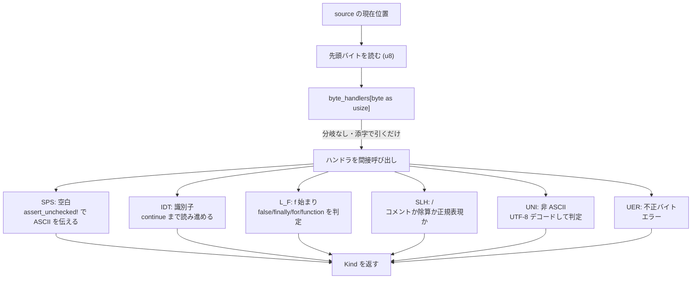

## 何を学んだか

レキサの中心にあるのは、**先頭バイトから処理関数を引く 256 要素のジャンプテーブル**になる。

```rust title="crates/oxc_parser/src/lexer/byte_handlers.rs"
pub type ByteHandler<C> = unsafe fn(&mut Lexer<'_, C>) -> Kind;
pub type ByteHandlers<C> = [ByteHandler<C>; 256];
```

```rust title="crates/oxc_parser/src/lexer/byte_handlers.rs"
    #[inline(always)]
    pub(super) unsafe fn handle_byte(&mut self, byte: u8) -> Kind {
        let byte_handlers = self.config.byte_handlers();
        // SAFETY: Caller guarantees to uphold safety invariants
        unsafe { byte_handlers[byte as usize](self) }
    }
```

テーブル本体は 16×16 の表として書かれている。

```rust title="crates/oxc_parser/src/lexer/byte_handlers.rs"
        [
        //  0    1    2    3    4    5    6    7    8    9    A    B    C    D    E    F    //
            ERR, ERR, ERR, ERR, ERR, ERR, ERR, ERR, ERR, SPS, LIN, ISP, ISP, LIN, ERR, ERR, // 0
            ERR, ERR, ERR, ERR, ERR, ERR, ERR, ERR, ERR, ERR, ERR, ERR, ERR, ERR, ERR, ERR, // 1
            SPS, EXL, QOD, HAS, IDT, PRC, AMP, QOS, PNO, PNC, ATR, PLS, COM, MIN, PRD, SLH, // 2
            ZER, DIG, DIG, DIG, DIG, DIG, DIG, DIG, DIG, DIG, COL, SEM, LSS, EQL, GTR, QST, // 3
            AT_, IDT, IDT, IDT, IDT, IDT, IDT, IDT, IDT, IDT, IDT, IDT, IDT, IDT, IDT, IDT, // 4
            IDT, IDT, IDT, IDT, IDT, IDT, IDT, IDT, IDT, IDT, IDT, BTO, ESC, BTC, CRT, IDT, // 5
            TPL, L_A, L_B, L_C, L_D, L_E, L_F, L_G, IDT, L_I, IDT, L_K, L_L, L_M, L_N, L_O, // 6
            L_P, IDT, L_R, L_S, L_T, L_U, L_V, L_W, IDT, L_Y, IDT, BEO, PIP, BEC, TLD, ERR, // 7
            UER, UER, UER, UER, UER, UER, UER, UER, UER, UER, UER, UER, UER, UER, UER, UER, // 8
            UER, UER, UER, UER, UER, UER, UER, UER, UER, UER, UER, UER, UER, UER, UER, UER, // 9
            UER, UER, UER, UER, UER, UER, UER, UER, UER, UER, UER, UER, UER, UER, UER, UER, // A
            UER, UER, UER, UER, UER, UER, UER, UER, UER, UER, UER, UER, UER, UER, UER, UER, // B
            UER, UER, UNI, UNI, UNI, UNI, UNI, UNI, UNI, UNI, UNI, UNI, UNI, UNI, UNI, UNI, // C
            UNI, UNI, UNI, UNI, UNI, UNI, UNI, UNI, UNI, UNI, UNI, UNI, UNI, UNI, UNI, UNI, // D
            UNI, UNI, UNI, UNI, UNI, UNI, UNI, UNI, UNI, UNI, UNI, UNI, UNI, UNI, UNI, UNI, // E
            UNI, UNI, UNI, UNI, UNI, UER, UER, UER, UER, UER, UER, UER, UER, UER, UER, UER, // F
        ]
```

3 文字のニーモニックで書かれているので、ASCII の表としてそのまま読める。`SPS` = space、`IDT` = identifier、`DIG` = digit、`SLH` = slash、`UNI` = Unicode 継続バイト、`UER` = 不正な UTF-8 先頭バイト。

**`L_A` から `L_Y` まであるのは、キーワードの先頭文字ごとに専用ハンドラがあるから。** `f` で始まるなら `false`/`finally`/`for`/`function` のどれかかもしれないので、`L_F` はその判定を持つ。

出典も明記されている。

```rust title="crates/oxc_parser/src/lexer/byte_handlers.rs"
/// Macro to create a lookup table mapping any incoming byte to a handler function defined below.
/// <https://github.com/ratel-rust/ratel-core/blob/e55a1310ba69a3f5ce2a9a6eef643feced02ac08/ratel/src/lexer/mod.rs>
```

## なぜそうなっているか

### `match` ではなくジャンプテーブルなのはなぜか

Rust の `match byte { b' ' => ..., b'a'..=b'z' => ..., ... }` でも、コンパイラは条件によってジャンプテーブルを生成する。しかし保証はない。範囲が疎だったり、腕の中身のサイズが偏っていたりすると、比較の連鎖に落ちる。

関数ポインタの配列にすれば、**「配列を引いて間接呼び出し」に必ずなる。** 分岐予測の対象は 1 か所 (間接ジャンプ) だけになり、しかも各ハンドラは独立した関数なので、レキサ全体が 1 つの巨大な関数にならずに済む。

`#[inline(always)]` が `handle_byte` に付いているのは、テーブル引きと呼び出しを `read_next_token` に埋め込むためだ。

### テーブルが 3 つある

```rust title="crates/oxc_parser/src/lexer/byte_handlers.rs"
pub mod byte_handler_tables {
    use super::*;

    pub static NO_TOKENS: ByteHandlers<NoTokensLexerConfig> = byte_handlers!();
    pub static WITH_TOKENS: ByteHandlers<TokensLexerConfig> = byte_handlers!();
    pub static RUNTIME_TOKENS: ByteHandlers<RuntimeLexerConfig> = byte_handlers!();
}
```

`Lexer<'_, C>` の `C: Config` は、**「トークン列を配列に貯めるかどうか」**を型で表している。

- `NoTokensLexerConfig` — 貯めない (パーサが使う通常の経路)
- `TokensLexerConfig` — 貯める
- `RuntimeLexerConfig` — 実行時に決める

型パラメータなので、`NO_TOKENS` のハンドラでは「貯める」側のコードが**コンパイル時に消える**。同じマクロから 3 つのテーブルを生成し、モノモルフィズで別々のコードにしている。

トークン列を貯める必要があるのは、[ESTree の tokens 出力](./estree-serialization/)や一部のツールだけだ。通常の lint 経路では要らないので、その分岐すら残さない。

### ASCII ハンドラのマクロが `assert_unchecked!` を仕込む

ここがこのファイルで一番効いている部分になる。

```rust title="crates/oxc_parser/src/lexer/byte_handlers.rs"
/// Macro for defining byte handler for an ASCII character.
///
/// Asserts that lexer is not at end of file, and that next char is ASCII.
/// Where the handler is for an ASCII character, these assertions are self-evidently true.
///
/// These assertions produce no runtime code, but hint to the compiler that it can assume that
/// next char is ASCII, and it uses that information to optimize the rest of the handler.
/// e.g. `lexer.consume_char()` becomes just a single assembly instruction.
/// Without the assertions, the compiler is unable to deduce the next char is ASCII, due to
/// the indirection of the byte handlers jump table.
///
/// These assertions are unchecked (i.e. won't panic) and will cause UB if they're incorrect.
///
/// # SAFETY
/// Only use this macro to define byte handlers for ASCII characters.
```

問題はこうなる。**ジャンプテーブルを経由すると、コンパイラは「この関数に来たということは、そのバイトは `b' '` だった」と推論できない。** 関数ポインタ経由の呼び出しなので、呼び出し元の情報が届かない。

すると `lexer.consume_char()` は「次の char は 1〜4 バイトかもしれない」という一般の UTF-8 デコードになる。実際には ASCII なので 1 バイト固定なのに。

`assert_unchecked!` を入れると、コンパイラは「ここでは次のバイトは 128 未満」という前提でコードを生成する。**`consume_char()` がアセンブリ 1 命令になる。**

展開結果まで doc に書いてある。

````rust title="crates/oxc_parser/src/lexer/byte_handlers.rs"
/// ```rust,ignore
/// #[expect(non_snake_case)]
/// fn SPS<C: Config>(lexer: &mut Lexer<'_, C>) -> Kind {
///     // SAFETY: This macro is only used for ASCII characters
///     unsafe {
///         assert_unchecked!(!lexer.source.is_eof());
///         assert_unchecked!(lexer.source.peek_byte_unchecked() < 128);
///     }
///     {
///         lexer.consume_char();
///         Kind::WhiteSpace
///     }
/// }
/// ```
````

**「間違っていたら UB」と明記されている。** 安全性の担保は「このマクロを ASCII 用のハンドラにしか使わない」という規律だけだ。`UNI` (Unicode 継続バイト) と `UER` (不正バイト) は別のマクロで定義される。



### 空白の消費を分岐なしでやる

呼び出し元の `read_next_token` にも、同じ性質の最適化が入っている。

```rust title="crates/oxc_parser/src/lexer/mod.rs"
            // Single spaces between tokens are common, so consume a space before processing the next token.
            // Do this without a branch. This produces more instructions, but avoids an unpredictable branch.
            // Can only do this if there are at least 2 bytes left in source.
            // If there aren't 2 bytes left, delegate to `read_next_token_at_end` (cold branch).
            let mut pos = self.source.position();
            // SAFETY: `source.end()` is always equal to or after `source.position()`
            let remaining_bytes = unsafe { end_pos.offset_from(pos) };
            if remaining_bytes >= 2 {
                // Read next byte.
                let byte = unsafe { pos.read() };

                // If next byte is a space, advance by 1 byte.
                // Do this with maths, instead of a branch.
                let is_space = byte == b' ';
                pos = unsafe { pos.add(usize::from(is_space)) };
                self.source.set_position(pos);

                // Read next byte again, in case we skipped a space.
                let byte = unsafe { pos.read() };
                // ...
                let kind = unsafe { self.handle_byte(byte) };
```

**「空白があるかどうか」は予測しにくい分岐**なので、`if` を書かずに `usize::from(is_space)` をポインタに足す。空白でなければ 0 バイト進む。

命令数は増えるが、分岐予測ミスのペナルティ (数十サイクル) より安い。コメントに「命令は増えるが予測不能な分岐を避ける」と明記されている。

**この最適化は「トークン間に空白が 1 個」という JS の実際の分布に賭けている。** 2 個以上ならループの次の反復で処理される。

`remaining_bytes >= 2` のチェックがあるのは、空白を 1 バイト飛ばした後にもう 1 バイト読むから。足りなければ cold な `read_next_token_at_end` に落ちる。

## ソースコードのどこか

- [`crates/oxc_parser/src/lexer/byte_handlers.rs`](https://github.com/oxc-project/oxc/blob/apps_v1.81.0/crates/oxc_parser/src/lexer/byte_handlers.rs) — テーブルと全ハンドラ (19KB)
- [`crates/oxc_parser/src/lexer/mod.rs`](https://github.com/oxc-project/oxc/blob/apps_v1.81.0/crates/oxc_parser/src/lexer/mod.rs) — `read_next_token`
- [`crates/oxc_parser/src/lexer/source.rs`](https://github.com/oxc-project/oxc/blob/apps_v1.81.0/crates/oxc_parser/src/lexer/source.rs) — ポインタ操作の安全な抽象 (37KB)
- [`crates/oxc_parser/src/lexer/kind.rs`](https://github.com/oxc-project/oxc/blob/apps_v1.81.0/crates/oxc_parser/src/lexer/kind.rs) — `Kind` (21KB)

ハンドラの実体は同じファイルの下半分に並んでいる。各ハンドラは「そのバイトから始まるトークンを最後まで読んで `Kind` を返す」だけで、**トークンの `start` は呼び出し元が既に記録している。**

なお、この章で「レキサ」と言うときは常に `crates/oxc_parser/src/lexer/` を指す。`crates/oxc_lexer` という別の crate があるが、[まだパーサから使われていない](./the-other-lexer/)。

## どう活かすか

**「先頭 1 バイトで分岐する」処理は、関数ポインタのテーブルにできる。** レキサ、バイトコードインタプリタ、プロトコルのディスパッチ。`match` でもコンパイラがテーブルにしてくれることはあるが、保証はない。**保証が要るほどホットなら、明示的にテーブルを書く。**

代償は 2 つある。テーブルが 256 要素あるのでコードを追いにくいことと、間接呼び出しなので**インライン展開されないこと**。後者が問題になるなら、ホットなケースだけ `match` で先に処理する手もある。

**間接呼び出しは、コンパイラへの情報を切る。** ジャンプテーブル経由だと「この関数に来た = そのバイトは空白」という情報が失われる。`assert_unchecked!` (C なら `__builtin_assume`) で明示的に伝え直すと、失った最適化が戻る。**ただし嘘をつくと UB になる**ので、マクロで定型化して「このマクロは ASCII 専用」と規律で縛るのが現実的な運用になる。

**予測不能な分岐は算術で潰せることがある。** `ptr += (byte == b' ') as usize` は分岐なしで空白を飛ばす。命令数は増えるが、分岐予測ミスより安い。**「予測しにくい」と判断できる分岐にだけ効く**ので、常にやると逆に遅くなる。

**設定は実行時フラグではなく型パラメータにできる。** `Lexer<'_, NoTokensLexerConfig>` と `Lexer<'_, TokensLexerConfig>` は別の型で、前者には「トークンを貯める」コードが 1 命令も残らない。バイナリサイズと引き換えに、ホットループから分岐が消える。
