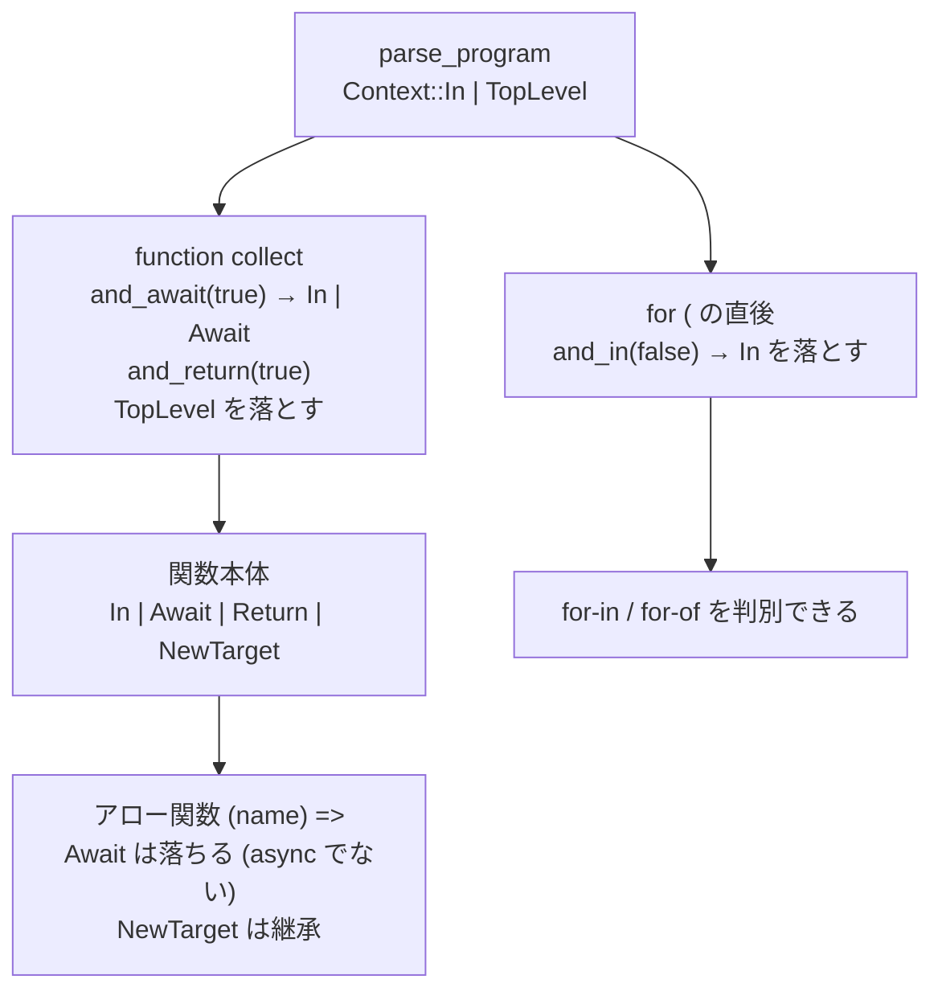

## 何を学んだか

ECMAScript の仕様には、こういう記法が出てくる。

```
RelationalExpression[In, Yield, Await]
```

**同じ非終端記号が、パラメータの組み合わせごとに別の生成規則を持つ。** `[In]` が付いているときだけ `in` 演算子が使え、`[Yield]` が付いているときだけ `yield` が式になる。

oxc はこれを bitflags でそのまま表現している。

```rust title="crates/oxc_parser/src/context.rs"
bitflags! {
    /// 5.1.5 Grammar Notation
    /// A production may be parameterized by a subscripted annotation of the form “[parameters]”,
    /// which may appear as a suffix to the nonterminal symbol defined by the production.
    /// “parameters” may be either a single name or a comma separated list of names.
    /// A parameterized production is shorthand for a set of productions defining all combinations of the parameter names,
    /// preceded by an underscore, appended to the parameterized nonterminal symbol.
    #[derive(Debug, Clone, Copy, PartialEq, Eq, PartialOrd, Ord, Hash)]
    pub struct Context: u16 {
```

**doc コメントが仕様 5.1.5 節の引用そのまま。** [checker と同じ作法](./early-errors/)になる。

フラグは 9 個ある。

```rust title="crates/oxc_parser/src/context.rs"
        /// [In] Flag, i.e. the [In] part in RelationalExpression[In, Yield, Await]
        const In = 1 << 0;
        /// [Yield] Flag
        const Yield = 1 << 1;
        /// [Await] Flag
        const Await = 1 << 2;
        /// [Return] Flag
        const Return = 1<< 3;
        /// If node was parsed as part of a decorator
        const Decorator = 1 << 4;
        /// Typescript should parse extends clause as conditional type instead of type constrains.
        const DisallowConditionalTypes = 1 << 5;
        /// A declaration file, or inside something with the `declare` modifier.
        const Ambient = 1 << 6;
        /// Parsing at the top level of the program (not inside any function).
        const TopLevel = 1 << 7;
        /// `new.target` is allowed
        const NewTarget = 1 << 8;
```

**最初の 4 つが仕様の `[In]` `[Yield]` `[Await]` `[Return]`、残り 5 つは oxc が足したもの**になる。

## なぜそうなっているか

### `[In]` — `for` の中でだけ `in` が別物

```rust title="crates/oxc_parser/src/context.rs"
        /// [In] Flag, i.e. the [In] part in RelationalExpression[In, Yield, Await]
        /// Section 13.10 Relational Operators Note 2:
        /// The [In] grammar parameter is needed to avoid confusing the in operator
        /// in a relational expression with the in operator in a for statement.
        const In = 1 << 0;
```

問題はこれになる。

```js
for (a in b) { }        // for-in 文
for (let x = a in b;;) { }  // in は関係演算子
```

`for (` の直後で式を読むとき、`in` を関係演算子として読んでしまうと `for-in` 文が判定できない。だから**その位置でだけ `[In]` を外して読む。**

既定値が `In` になっているのがこの構造を表している。

```rust title="crates/oxc_parser/src/context.rs"
impl Default for Context {
    fn default() -> Self {
        Self::In
    }
}
```

**「普通は `in` が使える。`for` のヘッダでだけ使えない」**という非対称が、既定値に現れている。

### `[Yield]` と `[Await]` — 同じ単語が識別子にも演算子にもなる

```js
function f() {
  const yield = 1;
} // OK: yield は識別子
function* g() {
  const yield = 1;
} // NG: yield は演算子
async function h() {
  await x;
} // await 式
function i() {
  const await = 1;
} // OK: await は識別子
```

`yield` と `await` は**予約語ではない**。generator 関数の中でだけ `yield` が演算子になり、async 関数の中でだけ `await` が演算子になる。

```rust title="crates/oxc_parser/src/context.rs"
        /// [Await] Flag
        /// Section 15.8 Async Function Definitions Note 1:
        /// await is parsed as an AwaitExpression when the [Await] parameter is present
        const Await = 1 << 2;
```

関数に入るときにフラグを付け替える。

```rust title="crates/oxc_parser/src/context.rs"
    #[inline]
    pub(crate) fn union_await_if(self, include: bool) -> Self {
        self.union_if(Self::Await, include)
    }
```

```rust title="crates/oxc_parser/src/context.rs"
    #[inline]
    pub(crate) fn and_await(self, include: bool) -> Self {
        self.and(Self::Await, include)
    }

    #[inline]
    fn and(self, flag: Self, set: bool) -> Self {
        if set { self | flag } else { self - flag }
    }
```

**`union_*_if` は「立てるか、そのまま」、`and_*` は「立てるか、落とす」。** 使い分けがある。

- **関数に入るとき** — `and_await(is_async)`。async でなければ**明示的に落とす** (外側が async でも中の普通の関数では `await` は識別子)
- **アロー関数に入るとき** — 外側を継承する場面があるので `union_*_if`

この 2 種類のセッターがあること自体が、「JS のスコープ規則で継承するものと、しないものがある」という事実を表している。

### アロー関数の透過性

`NewTarget` の doc がその例になる。

```rust title="crates/oxc_parser/src/context.rs"
        /// `new.target` is allowed, i.e. inside a function, a class static block,
        /// or a class field initializer. Arrow functions inherit this from their
        /// surrounding context, and class bodies are transparent to it.
        const NewTarget = 1 << 8;
```

**アロー関数は周囲から継承し、クラス本体は透過する。** アロー関数が `this` を継承するのと同じ性質で、`new.target` にも当てはまる。

`Context` をフラグの集合にしておくと、こういう「あるものは継承、あるものはリセット」を**フラグ単位で個別に決められる。** 単一の enum (「今は関数の中」「今はクラスの中」) だと表現できない。

### TypeScript 用のフラグ

```rust title="crates/oxc_parser/src/context.rs"
        /// Typescript should parse extends clause as conditional type instead of type constrains.
        /// Used in infer clause
        ///
        /// type X<U, T> = T extends infer U extends number ? U : T;
        /// The "infer U extends number" is type constrains.
        ///
        /// type X<U, T> = T extends (infer U extends number ? U : T) ? U : T;
        /// The "(infer U extends number ? U : T)" is conditional type.
        const DisallowConditionalTypes = 1 << 5;
```

**同じ `extends` が、型制約と条件型のどちらにもなりうる。** `infer U extends number` の後に `?` が来たとき、それが条件型の `?` なのか、`infer U` の制約に続く別の何かなのか。

doc に対比する 2 つの例が並んでいるので、フラグの意味が具体的に分かる。**「このフラグが立っているとどう変わるか」を例で示す**のは、ビットフラグの doc として理想的な形になる。

```rust title="crates/oxc_parser/src/context.rs"
        /// A declaration file, or inside something with the `declare` modifier.
        /// Declarations that don't define an implementation is "ambient":
        ///   * ambient variable declaration => `declare var $: any`
        ///   * ambient class declaration => `declare class C { foo(); } , etc..`
        const Ambient = 1 << 6;
```

`Ambient` は `.d.ts` や `declare` の中を表す。**この文脈では実装がないので、[early error の多くが免除される](./early-errors/)。** `check_identifier` が `ctx.in_ambient_context()` で素通しするのと繋がっている。

### `TopLevel` は unambiguous モードのため

```rust title="crates/oxc_parser/src/context.rs"
        /// Parsing at the top level of the program (not inside any function).
        /// Used to detect top-level await in unambiguous mode.
        const TopLevel = 1 << 7;
```

`sourceType: unambiguous` は「モジュールかスクリプトか、パースしてみるまで分からない」というモードになる。

`await x;` がトップレベルにあるとき、

- **モジュールなら** — top-level await として有効
- **スクリプトなら** — `await` は識別子なので `await(x)` (関数呼び出し)

**パースし終わるまでどちらか決まらない。** oxc は「まず識別子として読み、ESM 構文が見つかったら読み直す」という戦略を取り、そのために[チェックポイントを保存しておく](./recursive-descent/)。

```rust title="crates/oxc_parser/src/state.rs"
    /// Statements that may need reparsing when `sourceType` is `unambiguous`.
    ///
    /// In unambiguous mode, we initially parse top-level `await ...` as
    /// `await(...)` (identifier/function call). But if ESM syntax is detected
    /// later, we need to reparse these as await expressions.
    ///
    /// Each entry contains: (statement_index, checkpoint_before_statement)
    pub potential_await_reparse: Vec<(usize, ParserCheckpoint<'a>)>,
```

`TopLevel` フラグは「この `await` は読み直しの候補か」を判定するのに要る。関数の中の `await` なら、その関数が async かどうかで確定するので読み直しは不要になる。

エラー側にも同じ延期がある。

```rust title="crates/oxc_parser/src/error_handler.rs"
    /// Defer an error that is only valid if the file is a Script (not a Module).
    ///
    /// For `ModuleKind::Unambiguous`, we don't know the module type until parsing is complete.
    /// Errors like "await outside async function" are only valid if the file ends up being
    /// a Script. If ESM syntax is found, the file becomes a Module and these errors are discarded.
    #[cold]
    pub(crate) fn error_on_script(&mut self, error: ParserDiagnostic<'a>) {
        if self.source_type.is_unambiguous() {
            self.deferred_script_errors.push(error);
        } else {
            self.errors.push(error);
        }
    }
```

**「スクリプトだったときだけ有効なエラー」を別のリストに溜め、最後に判定して採否を決める。**

### `Context` と `ParserState` の役割分担

```rust title="crates/oxc_parser/src/state.rs"
pub struct ParserState<'a> {
    pub not_parenthesized_arrow: FxHashSet<u32>,
    pub cover_initialized_name: FxHashMap<u32, AssignmentExpression<'a>>,
    pub trailing_commas: FxHashMap<u32, Span>,
    pub potential_await_reparse: Vec<(usize, ParserCheckpoint<'a>)>,
    pub encountered_await_identifier: bool,
}
```

|          | `Context`                     | `ParserState`             |
| -------- | ----------------------------- | ------------------------- |
| 内容     | 文法の文脈                    | 一時的な記録              |
| 大きさ   | `u16` (Copy)                  | ハッシュマップ 3 本 + Vec |
| 寿命     | 入れ子のスコープ              | パース全体                |
| 出し入れ | `context_add` などで保存/復元 | 明示的に挿入/削除         |

**`Context` は「今どこにいるか」、`ParserState` は「さっき何を見たか」。** 前者は復元されるべきもの、後者は蓄積されるものになる。

`Context` が `Copy` な `u16` なので、[`context_add` の保存と復元](./recursive-descent/)が値のコピー 2 回で済む。



## ソースコードのどこか

- [`crates/oxc_parser/src/context.rs`](https://github.com/oxc-project/oxc/blob/apps_v1.81.0/crates/oxc_parser/src/context.rs) — `Context` (9 フラグ) と `StatementContext`
- [`crates/oxc_parser/src/state.rs`](https://github.com/oxc-project/oxc/blob/apps_v1.81.0/crates/oxc_parser/src/state.rs) — `ParserState` (45 行)
- [`crates/oxc_parser/src/cursor.rs`](https://github.com/oxc-project/oxc/blob/apps_v1.81.0/crates/oxc_parser/src/cursor.rs) — `context_add` / `context_remove` / `context`

もう 1 つ別の文脈型がある。

```rust title="crates/oxc_parser/src/context.rs"
#[derive(Debug, Clone, Copy, Eq, PartialEq)]
pub enum StatementContext {
    StatementList,
    If,
    Label,
    Do,
    While,
    With,
    For,
}

impl StatementContext {
    pub(crate) fn is_single_statement(self) -> bool {
        self != Self::StatementList
    }
}
```

こちらは**フラグではなく enum** になっている。「文がどこに現れたか」は排他的な選択肢だからだ。`if (x) function f() {}` のような「単文の位置に関数宣言」を検出するのに使う ([early error](./early-errors/) の `check_function_declaration`)。

**排他的なら enum、独立して立つならフラグ。** 同じファイルに両方あるのが分かりやすい対比になっている。

通し例の `example.ts` では、`collect` が `async function` なので本体は `Await` 付きで読まれ、`await readFile(...)` が `AwaitExpression` になる。もし `async` を外せば、同じ `await readFile(path, "utf8")` が `await(readFile(path, "utf8"))` — 識別子 `await` の呼び出しとして読まれる。

## どう活かすか

**仕様の記法をデータ構造に 1 対 1 で写せるなら、そうする。** ECMAScript の `[In]` `[Yield]` `[Await]` がそのまま `Context::In` などになっている。仕様と実装の対応が自明になり、仕様を読みながらコードを追える。**独自の抽象を挟むと、その対応表がどこにも書かれない。**

**「継承するもの」と「リセットするもの」をフラグ単位で決められるようにする。** 単一の状態 enum だと、「アロー関数は `this` を継承するが `arguments` は…」のような細かい規則が書けない。ビットフラグなら `and_await(false)` と `union_new_target_if(true)` を並べられる。

**フラグの doc には「立っているとどう変わるか」の例を書く。** `DisallowConditionalTypes` の doc は、同じ `extends` が 2 通りに読まれる例を並べている。フラグ名だけでは絶対に伝わらない情報になる。

**既定値に非対称が現れる。** `Context::default()` が `In` なのは、「`in` が使えるのが普通で、`for` のヘッダが例外」だから。**既定値が何かを見れば、どちらが例外なのかが分かる。**

**「後から判明する情報」は、チェックポイントごと保存して読み直す。** `sourceType: unambiguous` の top-level await がその例で、パース完了まで確定しない。エラーも同様に延期リストに溜めて、最後に採否を決める。**先に確定させようとして推測すると、必ず外れるケースが出る。**

**排他的な選択肢は enum、独立に立つものはフラグ。** `Context` (フラグ) と `StatementContext` (enum) が同じファイルにあるのが良い対比になる。迷ったら「2 つ同時に成り立つか」で決める。
