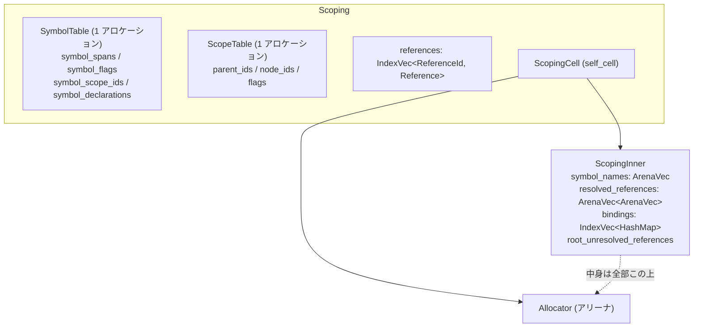

## 何を学んだか

スコープとシンボルの情報は、「スコープ 1 個 = 構造体 1 個」では持たれていない。**フィールドごとに別々の配列 (SoA: struct of arrays)** になっている。

```rust title="crates/oxc_semantic/src/scoping.rs"
multi_index_vec! {
    /// Scope tree stored as struct-of-arrays in a single allocation.
    ///
    /// Contains parent IDs, node IDs, and flags for all scopes. Using a single
    /// allocation with one `len`/`cap` instead of 3 separate `IndexVec`s saves
    /// memory (no redundant len/cap) and CPU (one bounds check, one capacity
    /// check on push).
    struct ScopeTable<ScopeId> {
        parent_ids => parent_ids_mut: Option<ScopeId>,
        node_ids => node_ids_mut: NodeId,
        flags => flags_mut: ScopeFlags,
    }
}
```

しかも **N 本の `Vec` ですらない。** `multi_index_vec!` マクロが「1 つのアロケーションに全フィールドの配列を並べ、`len` と `cap` は 1 組だけ持つ」コンテナを生成する。手本は doc に明記されている。

```rust title="crates/oxc_semantic/src/multi_index_vec.rs"
/// This is modeled on Zig's `MultiArrayList`.
```

これに 3 つの工夫が重なる。

- **ID は `NonMaxU32`。** `u32::MAX` を無効値に予約するので `Option<ScopeId>` が 4 バイト
- **2 次元の構造 (`Vec<Vec<T>>` や `HashMap<Vec<T>>`) だけは[アリーナ](./bump-allocator/)に逃がす。** `self_cell!` で `Allocator` ごと自己参照構造体にする
- **滅多に使わないフィールドは間接参照にする。** 再宣言情報は `Option<RedeclarationId>` (4 バイト) で持ち、実体は別のテーブル

## なぜそうなっているか

### なぜ SoA なのか

`ScopeTable` を AoS (array of structs) で持つとこうなる。

```rust
struct Scope {
    parent_id: Option<ScopeId>,  // 4 バイト
    node_id: NodeId,             // 4 バイト
    flags: ScopeFlags,           // 2 バイト + パディング 2
}
// Vec<Scope> — 1 要素 12 バイト
```

SoA だと `parent_ids: [Option<ScopeId>]`、`node_ids: [NodeId]`、`flags: [ScopeFlags]` の 3 本になる。

効くのは**アクセスの偏り**だ。[参照解決](./reference-resolution/)は「スコープチェーンを上る」ので `parent_ids` だけを次々読む。AoS だと 12 バイト刻みで 4 バイトずつ読むことになり、キャッシュラインの 3 分の 1 しか使わない。SoA なら `parent_ids` が連続しているので、1 ラインに 16 個入る。

`ScopeFlags` を見るのは巻き上げ先を探すときだけ、`node_ids` はもっと稀。**使う頻度が違うフィールドを混ぜないのが SoA の効き所**になる。

### なぜ N 本の `Vec` ではなく 1 アロケーションなのか

理由がマクロの doc の冒頭にある。

```rust title="crates/oxc_semantic/src/multi_index_vec.rs"
/// A macro that generates a struct-of-arrays (SoA) container backed by a single allocation.
///
/// Instead of N separate `IndexVec`s each with their own `ptr + len + capacity`,
/// this generates a struct with:
/// - A single allocation containing all field arrays contiguously
/// - A single `len` and `cap` (stored as `u32`)
/// - Per-field typed accessors with a single bounds check
/// - A single capacity check on `push`
```

3 本の `IndexVec` だと `ptr`/`len`/`cap` が 3 組ある。**この 3 つの `len` は常に同じ値**なので、2 組は冗長だ。それだけなら数十バイトの話だが、効くのは別のところにある。

- **境界チェックが 1 回で済む。** `scope_table.parent_id(id)` と `scope_table.flags(id)` を続けて呼ぶとき、`id < len` の判定が 1 種類しかない。コンパイラが 2 回目を消せる
- **`push` の容量チェックが 1 回。** 3 本の `Vec` だと 3 回チェックして 3 回別々に伸びる
- **`reserve` が 1 回のアロケーション。** [SemanticBuilder が事前に容量を確保する](./semantic-builder/)ときに、3 回ではなく 1 回で済む

生成されるコンテナの本体はこうなる。

```rust title="crates/oxc_semantic/src/multi_index_vec.rs"
        $vis struct $name {
            /// Pointer to the base of the single allocation.
            /// Layout: `[Field1 × cap][Field2 × cap]...` with alignment padding between fields.
            base: ::core::ptr::NonNull<u8>,
            /// Cached pointers to the start of each field's array within the allocation.
            $( $fname: ::core::ptr::NonNull<$fty>, )*
            /// Number of elements currently stored.
            len: u32,
            /// Total capacity of each field array.
            cap: u32,
        }
```

各フィールドの先頭ポインタを**キャッシュして持っている**のがポイントだ。`base + offset` を毎回計算すると、フィールドのオフセットが `cap` に依存する (レイアウトが `[Field1 × cap][Field2 × cap]` なので) 分だけ乗算が入る。先頭ポインタを持てば添字アクセスだけになる。

その代わり `grow_to` でキャッシュを張り直す必要がある。

```rust title="crates/oxc_semantic/src/multi_index_vec.rs"
                    self.base = ::core::ptr::NonNull::new_unchecked(new_base);
                    self.set_pointers(new_base, new_cap);
                    self.cap = u32::try_from(new_cap).expect("capacity exceeds u32");
```

`grow_to` はフィールドごとに `copy_nonoverlapping` する。`Vec` を 3 本持つのと同じ回数のコピーだが、アロケーションは 1 回で済む。**[SemanticBuilder が事前に reserve するので、実際にはこの経路は通らない](./semantic-builder/)** — `sys reallocs: 0` がそれを示している。

`len` / `cap` が `u32` なのも[アリーナの `Vec`](./bump-allocator/) と同じ判断で、上限は ID 型から来ている。

```rust title="crates/oxc_semantic/src/multi_index_vec.rs"
            /// Maximum number of elements this table can hold while still being
            /// representable by the index type.
            fn max_len() -> usize {
                <$idx as ::oxc_index::Idx>::MAX.saturating_add(1)
            }
```

`ScopeId` が表せる数を超えて要素を持っても指せないので、そこが自然な上限になる。

### `NonMaxU32` が効く場所

```rust title="crates/oxc_syntax/src/scope.rs"
define_nonmax_u32_index_type! {
    #[ast]
    #[builder(default)]
    #[clone_in(semantic_id)]
    #[content_eq(skip)]
    #[estree(skip)]
    pub struct ScopeId;
}
```

`u32::MAX` を「ありえない値」として予約すると、Rust のニッチ最適化が働いて `Option<ScopeId>` が 4 バイトになる。素の `u32` なら 8 バイト (タグ + パディング + 値) だ。

効くのは 2 か所ある。

- **`ScopeTable::parent_ids` は `Option<ScopeId>` の配列。** ルートスコープだけ `None` になる。4 バイト vs 8 バイトの差が全スコープ分
- **AST ノードが `Cell<Option<ScopeId>>` / `Cell<Option<SymbolId>>` を持つ。** `Program` の `scope_id`、`BindingIdentifier` の `symbol_id`。[AST のサイズ](./ast-memory-layout/)に直接効く

### 2 次元の構造だけアリーナに逃がす

`Scoping` の中には、SoA にできないものもある。「スコープごとの binding マップ」は `Vec<HashMap<..>>` だし、「シンボルごとの参照リスト」は `Vec<Vec<ReferenceId>>` になる。

これらは `ScopingCell` にまとめて、アリーナに置かれている。理由が doc に書いてある。

```rust title="crates/oxc_semantic/src/scoping.rs"
/// [`ScopingCell`] contains parts of [`Scoping`] which are 2-dimensional structures
/// e.g. `Vec<Vec<T>>`, `HashMap<Vec<T>>`, `Vec<HashMap<T>>`.
///
/// These structures are very expensive to construct and drop, due to the large number of
/// allocations / deallocations involved. Therefore, we store them in an arena allocator to:
/// 1. Avoid costly heap allocations.
/// 2. Be able to drop all the data cheaply in one go.
```

**内側の `Vec` が 1 個ずつヒープを触るので、スコープが 1 万個あれば 1 万回の確保と解放が起きる。** アリーナに置けば確保はポインタ加算、解放は塊ごと 1 回になる。

問題は、アリーナ上の `Vec` はアリーナへの参照を持つので**自己参照構造体**になることだ。`self_cell!` クレートでそれを表現している。

```rust title="crates/oxc_semantic/src/scoping.rs"
            cell: ScopingCell::new(Allocator::default(), |allocator| ScopingInner {
                symbol_names: ArenaVec::new_in(&allocator),
                resolved_references: ArenaVec::new_in(&allocator),
                symbol_redeclarations: FxHashMap::default(),
                bindings: IndexVec::new(),
                root_unresolved_references: UnresolvedReferences::new_in(allocator),
            }),
```

ここで Send/Sync の問題が出る。`Allocator` は `Sync` でなく、`oxc_allocator::Vec` は `Send` でない ([なぜそうなのかは Box と Vec の違い](./bump-allocator/))。しかし `Scoping` 全体は他のスレッドに送れないと困る。

doc がその解き方を説明している。

```rust title="crates/oxc_semantic/src/scoping.rs"
/// ### `Sync`
///
/// For it to be safe for `&ScopingCell` to be sent across threads, we must make it impossible to
/// obtain multiple `&Allocator` references from them on different threads, because those references
/// could be used to allocate into the same arena simultaneously.
///
/// We prevent this by wrapping the struct created by `self_cell!` in a further wrapper.
/// That outer wrapper prevents access to `with_dependent` and `borrow_owner` methods of
/// `ScopingCellInner`, which allow obtaining `&Allocator` from a `&ScopingCell`.
///
/// The only method which *does* allow access to `&Allocator` is `with_dependent_mut`.
/// It takes `&mut self`, which guarantees exclusive access to `ScopingCell`.
```

**`&Allocator` を取れるメソッドを `&mut self` を要求するものだけに絞る。** そうすれば「2 つのスレッドが同時にアリーナへ割り当てる」が起こりえないので、`Sync` を主張できる。ラッパをもう 1 枚被せて、危ないメソッドを外から見えなくしている。

`Send` のほうは、`Allocator` と `Vec` が**同じ構造体の中にあって一緒に移動する**から問題ない、という論理になっている。

### 滅多に使わないものは間接参照に

```rust title="crates/oxc_semantic/src/scoping.rs"
/// ## Symbol Table
///
/// `SoA` (Struct of Arrays) for memory efficiency.
///
/// Most symbols won't have redeclarations, so instead of storing `Vec<Span>` directly in
/// `redeclare_variables` (32 bytes per symbol), store `Option<RedeclarationId>` (4 bytes).
/// That ID indexes into `redeclarations` where the actual `Vec<Span>` is stored.
```

再宣言 (`var x; var x;`) は稀なので、全シンボルに `Vec<Span>` (32 バイト) を持たせるのは無駄になる。`Option<RedeclarationId>` (4 バイト) にして、実体は別テーブルに置く。**「稀なケースのために全員が太る」を避ける定番の手**で、8 分の 1 になっている。



## ソースコードのどこか

- [`crates/oxc_semantic/src/multi_index_vec.rs`](https://github.com/oxc-project/oxc/blob/apps_v1.81.0/crates/oxc_semantic/src/multi_index_vec.rs) — `multi_index_vec!` マクロ (16KB)
- [`crates/oxc_semantic/src/scoping.rs`](https://github.com/oxc-project/oxc/blob/apps_v1.81.0/crates/oxc_semantic/src/scoping.rs) — `Scoping` / `ScopeTable` / `SymbolTable` / `ScopingCell` (46KB)
- [`crates/oxc_syntax/src/scope.rs`](https://github.com/oxc-project/oxc/blob/apps_v1.81.0/crates/oxc_syntax/src/scope.rs) — `ScopeId` / `ScopeFlags`

マクロの使い方は宣言的に読める。

````rust title="crates/oxc_semantic/src/multi_index_vec.rs"
/// ```ignore
/// multi_index_vec! {
///     pub struct ScopeTable<ScopeId> {
///         pub parent_ids => parent_ids_mut: Option<ScopeId>,
///         pub node_ids => node_ids_mut: NodeId,
///         pub flags => flags_mut: ScopeFlags,
///     }
/// }
/// ```
///
/// The `=> name_mut` part specifies the mutable accessor name (needed because
/// declarative macros cannot concatenate identifiers).
````

`=> name_mut` という奇妙な構文の理由まで書いてある。**宣言マクロは識別子を連結できない**ので、`parent_ids_mut` を自動生成できず手で書かせている。proc マクロにすれば消せるが、そのためだけに crate を 1 つ増やす価値はない、という判断になる。

## どう活かすか

**アクセス頻度が大きく違うフィールドが同居していたら SoA を検討する。** 「毎回読むフィールド」と「滅多に読まないフィールド」が同じ構造体にあると、前者を走査するときに後者がキャッシュを埋める。ただし SoA は「1 要素をまとめて読む」が遅くなるので、**アクセスパターンを測ってから**判断する。

**N 本の並行した配列は 1 本にまとめられる。** `len` と `cap` が常に同じなら冗長で、境界チェックも N 回走る。Rust なら `multi_index_vec!` のようなマクロで書けるし、Zig には `MultiArrayList` が標準で入っている。**oxc がそれを doc で明示している**ように、既存の設計を参照するのは実装の意図を伝える一番安い方法になる。

**無効値を予約できるなら `NonZero` / `NonMax` を使う。** `Option<T>` がタグなしで表現できる。ID 型では「0 は使わない」か「MAX は使わない」のどちらかがほぼ常に成り立つ。

**「稀なフィールド」は ID にして別テーブルに逃がす。** 全要素が 32 バイト持つより、4 バイトの ID と別テーブルのほうが小さい。損益分岐は「そのフィールドを持つ要素の割合」で決まる。

**自己参照構造体を持ち込むなら、Send/Sync の議論を doc に書く。** `ScopingCell` の doc は 40 行あって、`Sync` と `Send` を別々に論証している。この種のコードは**論証がないと後から誰も触れなくなる**。`unsafe impl` に一言添えるだけでは足りない。
