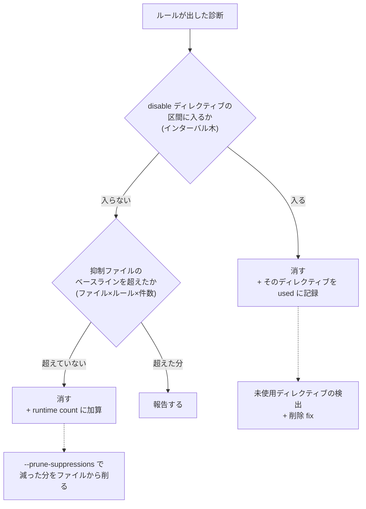

## 何を学んだか

リンタの警告を黙らせたい状況は 2 種類ある。

**1. ピンポイントで無視したい。** 「この 1 行は意図的にこう書いている」。ESLint 由来の `// eslint-disable-next-line no-unused-vars` がこれにあたる。

**2. 既存コードベースを一旦黙らせたい。** 新しいルールを有効にしたら 3000 件出た。全部直すまで CI を落とすわけにはいかないが、新しく増える分は止めたい。

oxlint はこれを**別々の仕組み**で解いている。

|            | ディレクティブ                     | 抑制ファイル                   |
| ---------- | ---------------------------------- | ------------------------------ |
| 書く場所   | ソースコード中のコメント           | `oxlint-suppressions.json`     |
| 粒度       | ルール名 × ソース範囲              | ファイル × ルール名 × **件数** |
| 実装       | `disable_directives.rs` (2,127 行) | `suppression/` (3 ファイル)    |
| データ構造 | インターバル木 (`rust_lapper`)     | ハッシュマップ 2 段            |
| 生成       | 人間が書く                         | `--suppress-all` で自動生成    |

**「1 行を無視する」と「1 プロジェクトを段階導入する」は違う問題で、道具も違う。** 混ぜて 1 つの仕組みにしなかったのが判断のポイントになる。

## なぜそうなっているか

### ディレクティブはインターバル木で持つ

`eslint-disable` の効果は「ソースのある範囲で、あるルールを無効にする」ことだ。範囲は 3 種類ある。

```rust title="crates/oxc_linter/src/disable_directives.rs"
enum DirectiveKind {
    Disable,
    DisableNextLine,
    DisableLine,
    Enable,
}
```

- `eslint-disable` — そこから `eslint-enable` またはファイル末尾まで
- `eslint-disable-next-line` — 次の 1 行
- `eslint-disable-line` — その行

診断が出るたびに「この span はどれかの無効範囲に入っているか」を問う。**区間の集合に対する重なり判定**なので、インターバル木が正しいデータ構造になる。

```rust title="crates/oxc_linter/src/disable_directives.rs"
#[derive(Debug, Clone)]
pub struct DisableDirectives {
    /// All the disabled rules with their corresponding covering spans
    intervals: Lapper<u32, DisabledRule>,
    /// All comments that disable one or more specific rules
    disable_rule_comments: Box<[DisableRuleComment]>,
    /// Spans of unused enable directives
    unused_enable_comments: Box<[(DirectivePrefix, Option<String>, Span)]>,
    /// Spans of used enable directives, to filter out unused
    used_disable_comments: RefCell<Vec<DisabledRule>>,
}
```

`rust_lapper` の `Lapper` は区間の重なり検索を対数時間でやる。**ディレクティブが 100 個あるファイルで診断が 1000 件出ても、線形探索にならない。**

判定は `contains` になる。

```rust title="crates/oxc_linter/src/disable_directives.rs"
    pub fn contains(&self, rule_name: &str, span: Span) -> bool {
        // For `eslint-disable-next-line` and `eslint-disable-line` directives, we only check
        // if the diagnostic's starting position falls within the disabled interval.
        // This prevents suppressing diagnostics for larger constructs (like functions) that
        // contain disabled lines.
        //
        // For regular `eslint-disable` directives (which disable rules for the rest of the file),
        // we check if any part of the diagnostic span overlaps with the disabled interval.
        // This ensures that diagnostics starting before the disable comment (like no-empty-file)
        // are still suppressed.
```

**ディレクティブの種類で判定規則が違う。** `disable-next-line` は「診断の開始位置」だけを見る。そうしないと、その行を含む関数全体に付いた診断まで消えてしまう。`eslint-disable` (ファイル残り全部) は「一部でも重なれば」で見る。そうしないと、`no-empty-file` のようにファイル全体を span とする診断が消せない。

**この非対称は仕様ではなく実用から来ている**ので、コメントがないと後から必ず「揃えよう」と直される。

### プラグイン接頭辞の扱いに罠がある

```rust title="crates/oxc_linter/src/disable_directives.rs"
                // `rule_name` does not contain the plugin prefix.
                // - `vitest/foobar` will be just `foobar`.
                // - `@typescript-eslint/no-var-requires` will be just `no-var-requires`
                //
                // This enables matching rules across different plugins that share the same
                // rule name, such as jest<->vitest rules and eslint<->typescript rules.
                //
                // We strip the plugin prefix from the directive name and compare equality
                // rather than doing a substring match. Otherwise unrelated rules like
                // `canonical/no-re-export` would accidentally match oxlint's `export`
                // rule because `"no-re-export".contains("export")` is true.
                DisabledRule::Single { rule_name: name, .. } => {
                    if rule_name.contains('/') {
                        name == rule_name
                    } else {
                        name.rsplit_once('/').map_or(name.as_str(), |(_, rule)| rule) == rule_name
```

`// eslint-disable-next-line jest/no-focused-tests` が vitest 版のルールにも効いてほしい。だから接頭辞を落として比較する。

しかし**部分文字列一致 (`contains`) でやると `"no-re-export".contains("export")` が真になって、無関係なルールが黙る。** 接頭辞を落としてから等値比較する、という 1 段の処理が要る。バグ報告から来たであろう挙動が、理由つきで残っている。

### 使われていないディレクティブを検出する

`used_disable_comments: RefCell<Vec<DisabledRule>>` が付いているのは、**「無視すると書いたのに、何も無視しなかった」ディレクティブを報告するため**だ。

```rust title="crates/oxc_linter/src/disable_directives.rs"
    #[must_use]
    pub fn unused_disable_message(self) -> String {
        format!("Unused {} directive (no problems were reported).", self.disable_directive_name())
    }

    #[must_use]
    pub fn unused_disable_rule_message(self, rule_name: &str) -> String {
        format!(
            "Unused {} directive (no problems were reported from {rule_name}).",
            self.disable_directive_name()
        )
    }
```

`RefCell` なのは、`contains` が `&self` で呼ばれるから。診断の判定中に「このディレクティブは使われた」と記録する必要がある。

そして**削除の fix まで用意されている**。

```rust title="crates/oxc_linter/src/disable_directives.rs"
    /// whitespace and the trailing newline) when the comment is the only content
    /// on that line; otherwise equals `span`.
    pub fix_span: Span,
```

`span` と `fix_span` が分かれている。診断を表示するときは**コメントだけ**を指し、削除するときは**行ごと**消す (そのコメントが行の唯一の内容なら)。行末に付いているコメントなら、コメント部分だけを消す。

**「表示用の範囲」と「編集用の範囲」を別に持つ**のは、fix を持つ診断では汎用的に効く。

`DirectivePrefix` が `eslint-` と `oxlint-` の 2 つあり、`with_respect_eslint_disable_directives(false)` で ESLint 側を無視できる。ESLint と oxlint を併用しているプロジェクトで、「ESLint 用の disable コメントは oxlint には効かせたくない」に対応するためのスイッチになる。

### 抑制ファイルは「件数のベースライン」

もう 1 つの仕組みは、ファイル × ルール × 件数の記録になる。

```rust title="crates/oxc_linter/src/suppression/tracking.rs"
#[derive(Debug, Default, Clone, Deserialize, Serialize)]
#[serde(default)]
pub struct DiagnosticCounts {
    pub count: usize,
}

type FileSuppressionsMap = FxHashMap<String, DiagnosticCounts>;
type AllSuppressionsMap = Arc<FxHashMap<Filename, FileSuppressionsMap>>;
```

**span ではなく件数**を持つのが要点だ。「`src/foo.ts` の `no-unused-vars` は 3 件まで許す」。

span で持つと、コードを 1 行足しただけで全部ずれる。件数なら、そのファイルの中で並べ替えても増減しない限り一致する。**「既存の借金を凍結する」という目的に対して、件数はちょうどいい粒度**になる。

判定は `DiffManager` がやる。

```rust title="crates/oxc_linter/src/suppression/diff.rs"
    /// Process messages for a file: filter suppressed diagnostics and accumulate runtime counts.
    /// Returns the filtered messages (only new/increased violations shown to the user).
    pub fn collect_file(
        &self,
        file_path: &Path,
        cwd: &Path,
        messages: Vec<Message>,
    ) -> Vec<Message> {
```

**ベースラインを超えた分だけをユーザーに見せる。** 3 件のところに 4 件出たら 1 件だけ報告する。



### 保存時にソートする

```rust title="crates/oxc_linter/src/suppression/tracking.rs"
fn serialize_arc_map<S>(map: &AllSuppressionsMap, serializer: S) -> Result<S::Ok, S::Error>
where
    S: serde::Serializer,
{
    use std::collections::BTreeMap;
    let sorted: BTreeMap<&Filename, BTreeMap<&String, &DiagnosticCounts>> = map
        .iter()
        .map(|(filename, rules)| (filename, rules.iter().collect::<BTreeMap<_, _>>()))
        .collect();
    sorted.serialize(serializer)
}
```

内部は `FxHashMap` (速い) だが、**シリアライズするときだけ `BTreeMap` に移してソートする。** `oxlint-suppressions.json` は git にコミットされるファイルなので、実行のたびに順序が変わると diff が読めなくなる。

パス区切りも正規化されている。

```rust title="crates/oxc_linter/src/suppression/tracking.rs"
impl Filename {
    pub fn new(path: &Path) -> Self {
        Self(path.as_os_str().to_string_lossy().cow_replace('\\', "/").to_string())
    }
}
```

Windows で生成したファイルが macOS で読めるように、`\` を `/` にする。**チーム間で共有されるファイルなので、プラットフォーム差を潰しておく必要がある。**

### 状態が enum で表現されている

```rust title="crates/oxc_linter/src/suppression/mod.rs"
#[derive(Clone, Debug, PartialEq, Eq)]
pub enum OxlintSuppressionFileAction {
    None,
    Updated,
    Exists,
    Created,
    HasUnprunedSuppressions,
    Malformed(OxcDiagnostic),
    UnableToPerformFsOperation(OxcDiagnostic),
}
```

抑制ファイルに対して「何が起きたか」が 7 状態ある。`--suppress-all` で作られた (`Created`)、更新された (`Updated`)、既にあった (`Exists`)、壊れていた (`Malformed`)、書けなかった (`UnableToPerformFsOperation`)、減らせる抑制が残っている (`HasUnprunedSuppressions`)。

`bool` 数個ではなく enum にすることで、**「Created かつ Malformed」のような矛盾した状態が表現できない。**

### 並列実行との噛み合わせ

抑制の集計は複数スレッドから来る。

```rust title="crates/oxc_linter/src/suppression/mod.rs"
/// Thread-safe accumulator for runtime suppression counts from both oxlint and tsgo passes.
#[derive(Debug, Default)]
pub struct RuntimeSuppressionMap {
    inner: std::sync::Mutex<FxHashMap<Filename, FileSuppressionsMap>>,
}

impl RuntimeSuppressionMap {
    /// Merge runtime counts for a file. Counts are additive across passes.
    pub fn merge_file(&self, filename: Filename, counts: FxHashMap<String, DiagnosticCounts>) {
        let mut map = self.inner.lock().unwrap();
        // ...
    }
```

**「both oxlint and tsgo passes」** — Rust 側の lint と [tsgolint](./outside-rust/) の両方から件数が来て、加算される。同じファイルに 2 つの経路から診断が出るので、ベースラインの管理は合算になる。

`mark_seen` があるのも細かい。

```rust title="crates/oxc_linter/src/suppression/mod.rs"
    /// Mark a file as seen (even if it has no violations).
    pub fn mark_seen(&self, filename: Filename) {
```

違反 0 件のファイルも記録しないと、`--prune-suppressions` が「このファイルはもう違反がない」と判断できない。**「見たが 0 件」と「見ていない」を区別する**必要がある。

## ソースコードのどこか

- [`crates/oxc_linter/src/disable_directives.rs`](https://github.com/oxc-project/oxc/blob/apps_v1.81.0/crates/oxc_linter/src/disable_directives.rs) — ディレクティブの解析と判定 (2,127 行)
- [`crates/oxc_linter/src/fixer/disable_fix.rs`](https://github.com/oxc-project/oxc/blob/apps_v1.81.0/crates/oxc_linter/src/fixer/disable_fix.rs) — disable コメントを**追加する** fix (31KB)
- [`crates/oxc_linter/src/suppression/mod.rs`](https://github.com/oxc-project/oxc/blob/apps_v1.81.0/crates/oxc_linter/src/suppression/mod.rs) — `SuppressionManager`
- [`crates/oxc_linter/src/suppression/tracking.rs`](https://github.com/oxc-project/oxc/blob/apps_v1.81.0/crates/oxc_linter/src/suppression/tracking.rs) — ファイルの読み書き
- [`crates/oxc_linter/src/suppression/diff.rs`](https://github.com/oxc-project/oxc/blob/apps_v1.81.0/crates/oxc_linter/src/suppression/diff.rs) — `DiffManager`

ディレクティブには 3 方向の fix がある。

- **追加** — `disable_fix.rs` が `// oxc-disable-next-line rule` を挿入する ([`FixKind::IgnoreFix`](./auto-fix/))。LSP のコードアクションから使う
- **削除** — 未使用ディレクティブを消す
- **どちらもしない** — 通常の lint

「無視の仕組み」自体が、追加と削除の両方の自動化を持っている。

なお、複数エンジン (Rust の linter と tsgolint) の間でディレクティブを共有する仕組みが `lint_runner.rs` の `DirectivesStore` になる。名前から並列化の道具に見えるが、**役割はエンジン間の共有**で、[並列実行](./parallel-lint/)とは別の話になる。

## どう活かすか

**「一時的に黙らせたい」の中に別々の問題が混ざっていないか疑う。** 「この 1 箇所は例外」と「既存分は凍結して新規だけ見る」は、粒度も寿命も違う。1 つの仕組みに詰め込むと、どちらも使いにくくなる。oxlint は前者をコメント、後者を JSON ファイルにした。

**範囲の重なり判定にはインターバル木を使う。** 「区間の集合に対して、この点/区間は含まれるか」は線形探索になりがちな形で、区間の数 × 問い合わせの数で効いてくる。Rust なら `rust_lapper`、他の言語にも同等のものがある。

**ベースラインは span ではなく件数で持つ。** span で持つとコードの変更ですぐ壊れる。件数なら並べ替えや無関係な変更に強い。代わりに「どの箇所が抑制されているか」は分からなくなるが、**段階導入という目的にはそれで足りる。**

**「表示用の範囲」と「編集用の範囲」を分けて持つ。** 診断は最小限の範囲を指し、fix は前後の空白や改行まで含めて消す。`span` と `fix_span` の 2 本を持つだけで、両方が正しくなる。

**git にコミットされる生成ファイルは、必ずソートして出力する。** 内部で `HashMap` を使っていても、シリアライズのときだけ `BTreeMap` に移せばいい。パス区切りの正規化も同じ理由で要る。

**「無視の無視」まで作る。** 使われていない disable コメントは、リファクタの残骸として溜まる。検出と削除 fix があれば掃除できる。無視の仕組みを作るときは、**その掃除方法まで含めて 1 セット**にする。

**状態は `bool` の組み合わせではなく enum にする。** `created` / `updated` / `malformed` を別々の `bool` にすると、ありえない組み合わせが表現できてしまう。7 状態の enum なら、`match` の網羅性検査も効く。
