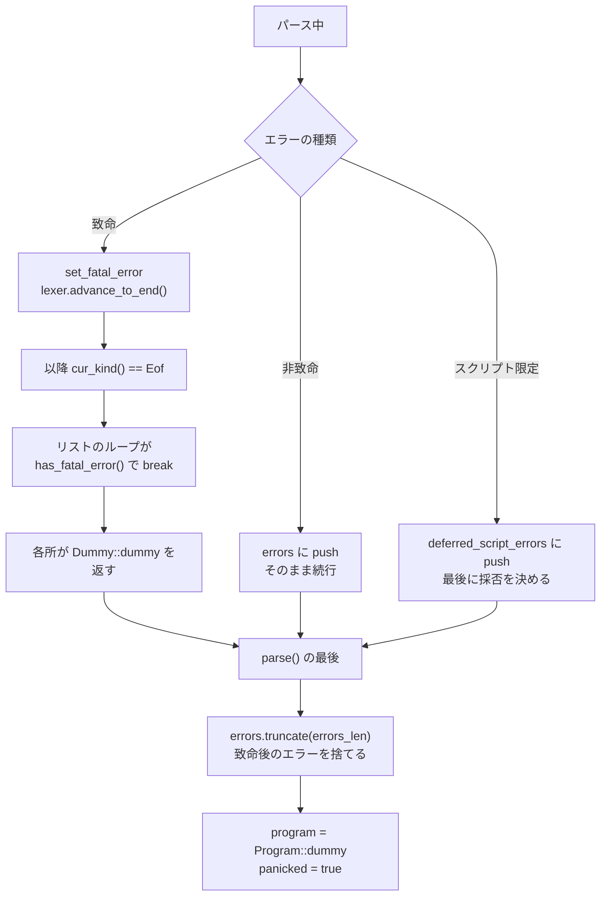

## 何を学んだか

構文エラーがあるファイルでも、エディタや linter は何かを表示したい。だからパーサは「エラーを見つけたら止まる」ではなく、**できるところまで木を作る**必要がある。

oxc の方式は、エラーを 2 段に分けることになる。

|        | 非致命 (recoverable)            | 致命 (fatal)                 |
| ------ | ------------------------------- | ---------------------------- |
| 例     | `as` を JS で使った、型引数が空 | 予期しないトークン、ASI 失敗 |
| 扱い   | `errors` に push して続行       | `fatal_error` フラグを立てる |
| レキサ | そのまま                        | **EOF まで飛ぶ**             |
| AST    | 作られる                        | それ以降は作られない         |
| 結果   | `panicked = false`、AST あり    | `panicked = true`、AST は空  |

そして**パース関数のシグネチャは `Result` にならない。** `parse_expression()` は `Expression<'a>` を返す。エラーのときは `Dummy::dummy(allocator)` が「型だけ成立するノード」を返し、呼び出し側はそれを普通に使う。

この契約が `ParserReturn` の doc に明記されている。

```rust title="crates/oxc_parser/src/lib.rs"
/// Return value of [`Parser::parse`] consisting of AST, errors and comments
///
/// ## AST Validity
///
/// [`program`] will always contain a structurally valid AST, even if there are syntax errors.
/// However, the AST may be semantically invalid. To ensure a valid AST,
/// 1. Check that [`diagnostics`] is empty
/// 2. Run semantic analysis with [syntax error checking
///    enabled](https://docs.rs/oxc_semantic/latest/oxc_semantic/struct.SemanticBuilder.html#method.with_check_syntax_error)
///
/// ## Errors
/// Oxc's [`Parser`] is able to recover from some syntax errors and continue parsing. When this
/// happens,
/// 1. [`diagnostics`] will be non-empty
/// 2. [`program`] will contain a full AST
/// 3. [`panicked`] will be false
///
/// When the parser cannot recover, it will abort and terminate parsing early. [`program`] will
/// be empty and [`panicked`] will be `true`.
```

## なぜそうなっているか

### なぜ `Result` を返さないのか

再帰下降のパーサで `Result` を返すと、ほぼ全ての呼び出しに `?` が付く。

```rust
let left = self.parse_expression()?;
self.expect(Kind::Plus)?;
let right = self.parse_expression()?;
```

これは書けるが、**エラー回復と相性が悪い。** `?` は即座に上に返すので、「エラーが出たけど続きを読む」ができない。回復するには各所で `match` して `Err` を握り潰すことになり、`Result` を使う意味が薄れる。

oxc は状態フラグにした。

```rust title="crates/oxc_parser/src/error_handler.rs"
/// Fatal parsing error.
#[derive(Debug, Clone)]
pub struct FatalError<'a> {
    /// The fatal error
    pub error: ParserDiagnostic<'a>,
    /// Length of `errors` at time fatal error is recorded
    pub errors_len: usize,
}
```

```rust title="crates/oxc_parser/src/error_handler.rs"
    /// Advance lexer's cursor to end of file.
    #[cold]
    pub(crate) fn set_fatal_error(&mut self, error: ParserDiagnostic<'a>) {
        if self.fatal_error.is_none() {
            self.lexer.advance_to_end();
            self.fatal_error = Some(FatalError { error, errors_len: self.errors.len() });
        }
    }
```

**`lexer.advance_to_end()` が肝になる。** レキサをソース末尾に飛ばすと、以降の `cur_kind()` は全部 `Kind::Eof` になる。

すると、各所のループが自然に止まる。

```rust title="crates/oxc_parser/src/error_handler.rs"
    pub(crate) fn has_fatal_error(&self) -> bool {
        matches!(self.cur_kind(), Kind::Eof | Kind::Undetermined) || self.fatal_error.is_some()
    }
```

`if self.fatal_error.is_none()` で囲まれているので、**最初の致命的エラーだけが記録される。** 2 つ目以降は無視される。

### `Dummy` — 型だけ成立するノード

エラーのときも `Expression<'a>` を返さないといけない。そのための仕組みが `Dummy` になる。

```rust title="crates/oxc_allocator/src/take_in.rs"
/// A trait to create a dummy AST node.
pub trait Dummy<'a>: Sized {
    /// Create a dummy node.
    fn dummy(allocator: &'a Allocator) -> Self;
}
```

実装は [ast_tools が生成する](./ast-tools/) (`derive_dummy.rs` が 99KB)。基本的な型には手書きの実装がある。

```rust title="crates/oxc_allocator/src/take_in.rs"
impl<'a, T> Dummy<'a> for Option<T> {
    /// Create a dummy [`Option`].
    #[inline(always)]
    fn dummy(_allocator: &'a Allocator) -> Self {
        None
    }
}

impl<'a, T: Dummy<'a>> Dummy<'a> for Box<'a, T> {
    /// Create a dummy [`Box`].
    #[inline]
    fn dummy(allocator: &'a Allocator) -> Self {
        Box::new_in(Dummy::dummy(allocator), &allocator)
    }
}

impl<'a, T> Dummy<'a> for Vec<'a, T> {
    /// Create a dummy [`Vec`].
    #[inline]
    fn dummy(allocator: &'a Allocator) -> Self {
        Vec::new_in(&allocator)
    }
}
```

`Option` は `None`、`Vec` は空。**「中身は無意味だが、型としては正しい」ノードが作れる。**

エラー時の関数はこうなる。

```rust title="crates/oxc_parser/src/error_handler.rs"
    /// Return error info at current token
    #[must_use]
    #[cold]
    pub(crate) fn unexpected<T: Dummy<'a>>(&mut self) -> T {
        self.set_unexpected();
        Dummy::dummy(self.allocator())
    }
```

```rust title="crates/oxc_parser/src/error_handler.rs"
    #[cold]
    pub(crate) fn fatal_error<T: Dummy<'a>>(&mut self, error: ParserDiagnostic<'a>) -> T {
        self.set_fatal_error(error);
        Dummy::dummy(self.allocator())
    }
```

**ジェネリックなので、どの型が期待されていても返せる。** 呼び出し側は `return self.unexpected();` と書くだけになる。

代替案と比べると位置づけが見える。

- **`panic!` する** — 回復できない
- **トークンをスキップして再同期する** — 「どこまでスキップするか」の判断が難しく、実装が複雑になる
- **`Option`/`Result` を返す** — 全経路に `?` が要る
- **Dummy ノードを返す + フラグ** — 型は成立し、ループはフラグで止まる

### 最終的な後始末

```rust title="crates/oxc_parser/src/lib.rs"
    pub fn parse(mut self) -> ParserReturn<'a> {
        let mut program = self.parse_program();
        let mut panicked = false;

        if let Some(fatal_error) = self.fatal_error.take() {
            panicked = true;
            self.errors.truncate(fatal_error.errors_len);
            if !self.lexer.errors.is_empty() && self.cur_kind().is_eof() {
                // Noop
            } else {
                self.error(fatal_error.error);
            }

            program = Program::dummy(self.allocator());
            program.source_type = self.source_type;
            program.source_text = self.source_text;
        }
```

3 つのことをしている。

**1. `errors.truncate(fatal_error.errors_len)`** — 致命的エラーが起きた**後**に積まれた非致命エラーを捨てる。壊れた状態でパースを続けた結果出たエラーは、ノイズにしかならない。`FatalError` が `errors_len` を持っているのはこのためだ。

**2. レキサのエラーを優先する。** レキサが既にエラーを出していて EOF なら、パーサの「予期しないトークン」は足さない。**より具体的なエラーを残す。**

**3. `Program` を dummy で置き換える。** 壊れた AST を返すより空のほうがいい。`source_type` と `source_text` だけは引き継ぐ。

その後、[未消費の `cover_initialized_name`](./expression-precedence/) を報告する。

```rust title="crates/oxc_parser/src/lib.rs"
    fn check_unfinished_errors(&mut self) {
        use oxc_span::GetSpan;
        // PropertyDefinition : cover_initialized_name
        // It is a Syntax Error if any source text is matched by this production.
        for expr in self.state.cover_initialized_name.values() {
            self.errors.push(diagnostics::cover_initialized_name(expr.span()));
        }
    }
```

### エラーの延期が 2 種類ある

`unambiguous` モードでは、[エラーの採否がパース完了まで決まらない](./context-flags/)。

```rust title="crates/oxc_parser/src/error_handler.rs"
    /// Defer an error that is only valid if the file is a Script (not a Module).
    ///
    /// For `ModuleKind::Unambiguous`, we don't know the module type until parsing is complete.
    /// Errors like "await outside async function" are only valid if the file ends up being
    /// a Script. If ESM syntax is found, the file becomes a Module and these errors are discarded.
    #[cold]
    pub(crate) fn error_on_script(&mut self, error: ParserDiagnostic<'a>) {
        if self.source_type.is_unambiguous() {
            self.deferred_script_errors.push(error);
        } else {
            self.errors.push(error);
        }
    }
```

**エラーのリストが 3 本ある。**

| リスト                   | 内容                                 |
| ------------------------ | ------------------------------------ |
| `errors`                 | 確定した非致命エラー                 |
| `deferred_script_errors` | スクリプトだったときだけ有効なエラー |
| `fatal_error`            | 致命的エラー (0 or 1 件)             |

さらにレキサも独自の `errors` を持つ。



### Git のコンフリクトマーカーを検出する

エラー回復とは別に、診断の質を上げる仕掛けが入っている。

```rust title="crates/oxc_parser/src/error_handler.rs"
// ==================== Merge Conflict Marker Detection ====================
//
// Git merge conflict markers detection and error recovery.
//
// This provides enhanced diagnostics when the parser encounters Git merge conflict markers
// (e.g., `<<<<<<<`, `=======`, `>>>>>>>`). Instead of showing a generic "Unexpected token"
// error, we detect these patterns and provide helpful guidance on how to resolve the conflict.
//
// Inspired by rust-lang/rust#106242
```

**rustc から着想を得たと明記されている。**

誤検出の防止が丁寧になっている。

```rust title="crates/oxc_parser/src/error_handler.rs"
    /// # False Positive Prevention
    ///
    /// Git conflict markers always appear at the start of a line. To prevent false positives
    /// from operator sequences in valid code (e.g., `a << << b`), we verify that the first
    /// token is on a new line using the `is_on_new_line()` flag from the lexer.
    ///
    /// The special case `span.start == 0` handles the beginning of the file, where
    /// `is_on_new_line()` may be false but a conflict marker is still valid.
    fn is_merge_conflict_marker(&self) -> Option<Span> {
        let token = self.cur_token();
        let span = token.span();

        if !token.is_on_new_line() && span.start != 0 {
            return None;
        }
```

[`is_on_new_line` フラグ](./on-demand-tokens/)がここでも使われる。`a << << b` は不正なコードだが、コンフリクトマーカーではない。**行頭かどうかで区別する。**

検出したら、対応する `=======` と `>>>>>>>` を探しに行く。

```rust title="crates/oxc_parser/src/error_handler.rs"
    fn find_merge_conflict_markers(&mut self) -> (Option<Span>, Option<Span>) {
        let checkpoint = self.checkpoint();
        let mut middle_span = None;

        loop {
            self.bump_any();

            if self.cur_kind() == Kind::Eof {
                self.rewind(checkpoint);
                return (middle_span, None);
            }
            // ...
```

**[チェックポイント](./recursive-descent/)を取ってから走査し、必ず巻き戻す。** 診断を作るためだけの前方走査で、パーサの状態は変えない。

入れ子のコンフリクトについてまで書いてある。

```rust title="crates/oxc_parser/src/error_handler.rs"
    /// # Nested Conflicts
    ///
    /// If nested conflict markers are encountered (e.g., a conflict within a conflict),
    /// this function returns the first complete set of markers found. The parser will
    /// stop with a fatal error at the first conflict, so nested conflicts won't be
    /// fully analyzed until the outer conflict is resolved.
    ///
    /// The diagnostic message includes a note about nested conflicts to guide users
    /// to resolve the outermost conflict first.
```

**限界を明示して、その限界をユーザーへの note に載せている。**

### レキサのエラーを引き取る

```rust title="crates/oxc_parser/src/error_handler.rs"
    #[cold]
    pub(crate) fn set_unexpected(&mut self) {
        // The lexer should have reported a more meaningful diagnostic
        // when it is a undetermined kind.
        if matches!(self.cur_kind(), Kind::Eof | Kind::Undetermined)
            && let Some(error) = self.lexer.errors.pop()
        {
            self.set_fatal_error(error);
            return;
        }
```

`Kind::Undetermined` は「レキサが何か問題を見つけた」を表すトークンになる。そのときはレキサが積んだ具体的なエラー (「文字列が閉じていない」など) を取り出して使う。

**「予期しないトークン」という汎用メッセージより、レキサの具体的なエラーのほうが役に立つ。**

## ソースコードのどこか

- [`crates/oxc_parser/src/error_handler.rs`](https://github.com/oxc-project/oxc/blob/apps_v1.81.0/crates/oxc_parser/src/error_handler.rs) — `FatalError` / `set_fatal_error` / コンフリクトマーカー検出
- [`crates/oxc_parser/src/lib.rs`](https://github.com/oxc-project/oxc/blob/apps_v1.81.0/crates/oxc_parser/src/lib.rs) — `parse()` の後始末、`ParserReturn` の doc
- [`crates/oxc_allocator/src/take_in.rs`](https://github.com/oxc-project/oxc/blob/apps_v1.81.0/crates/oxc_allocator/src/take_in.rs) — `Dummy` トレイト
- [`crates/oxc_ast/src/generated/derive_dummy.rs`](https://github.com/oxc-project/oxc/blob/apps_v1.81.0/crates/oxc_ast/src/generated/derive_dummy.rs) — 生成された `Dummy` 実装 (99KB)
- [`crates/oxc_parser/src/cursor.rs`](https://github.com/oxc-project/oxc/blob/apps_v1.81.0/crates/oxc_parser/src/cursor.rs) — ループの終了条件

`Dummy` は `TakeIn` の基礎にもなっている。

```rust title="crates/oxc_allocator/src/take_in.rs"
    #[must_use]
    fn take_in_box(&mut self, allocator_accessor: &impl GetAllocator<'a>) -> Box<'a, Self> {
        let allocator = allocator_accessor.allocator();
        let dummy = Dummy::dummy(allocator);
        Box::new_in(mem::replace(self, dummy), &allocator)
    }
```

**「ノードを取り出して、代わりに dummy を置く」**という操作が [Transformer](./transformer/) で使われる。エラー回復のために作った仕組みが、AST の書き換えでも使い回されている。

## どう活かすか

**エラー回復が要るパーサでは、`Result` より状態フラグのほうが素直なことがある。** `?` は「即座に上に返す」なので、「エラーを記録して続ける」と噛み合わない。**フラグ + ループの終了条件**にすると、回復する場所としない場所を個別に決められる。代償は「エラーを見落とす」危険で、oxc は各ループヘルパの中にチェックを埋め込むことで漏れを防いでいる。

**「型だけ成立する値」を返す仕組みを用意する。** `Dummy` トレイトがあると、エラー経路で `Option` や `Result` を経由せずに済む。**ジェネリックにしておけば、`return self.unexpected();` の 1 行でどの型にも対応できる。**

**致命的エラーの後に出たエラーは捨てる。** 壊れた状態でパースを続けると、無関係なエラーが大量に出る。`FatalError` が「発生時点のエラー数」を持っておけば、`truncate` 1 回で消せる。

**「解析を止める」を「入力を使い切る」で表現する。** `lexer.advance_to_end()` でレキサを EOF に飛ばすと、各所のループが**自然に**止まる。個別に「fatal ならスキップ」を書く必要がない。**制御フローの変更を、状態の変更で表現する**手になる。

**より具体的なエラーを優先する。** レキサが「文字列が閉じていない」と言っているなら、パーサの「予期しないトークン」は不要。**エラーの階層を意識して、下位層のエラーを引き取る。**

**よくある間違いには専用の診断を用意する。** Git のコンフリクトマーカーが残ったファイルは実際によくパースされる。「予期しないトークン `<`」より「マージコンフリクトが未解決です」のほうが 100 倍役に立つ。**誤検出の防止条件と限界を doc に書く**のが条件になる。
