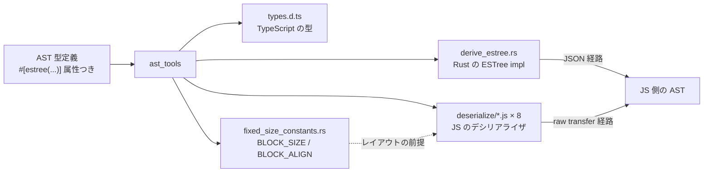

## 何を学んだか

oxc の AST を JS から使う経路は 2 つある。

1. **ESTree JSON** — `Program::to_estree_json()` が JSON 文字列を作り、JS 側が `JSON.parse` する
2. **raw transfer** — Rust が AST を書いたメモリを `Uint8Array` として JS に見せ、JS 側が構造体レイアウトを知っていてポインタを辿る

1 のほうも普通ではない。**serde を通さず、`trait ESTree` + `Serializer` + `CodeBuffer` で直接 JSON のバイトを書く。** シリアライザの実装は ast_tools が生成し、例外的な形のノードだけ `crates/oxc_ast/serialize/` に手書きがある。

2 はさらに極端で、[4GiB 境界に揃った 2GiB のアリーナ](./allocator-reuse/)と、[const assert で固定されたレイアウト](./ast-memory-layout/)と、ast_tools が吐く JS のデシリアライザが噛み合って初めて成立する。JS 側の生成物は 8 通り (TS/JS × range あり/なし × parent あり/なし) で、合計 140 万バイトを超える。

## なぜそうなっているか

### なぜ serde ではないのか

ESTree は JS エコシステムの事実上の標準 AST 形式で、oxc の内部表現とは細かく形が違う ([AST と ESTree](./ast-and-estree/))。フィールド名を変える、TS 専用フィールドを条件付きで出す、存在しないフィールドを `null` や `[]` として捏造する、といった変換が要る。

serde の `#[serde(rename)]` や `skip_serializing_if` でもある程度は書けるが、oxc が必要としたのはもう少し細かい制御だった。`Span` の属性を見ると雰囲気が分かる。

```rust title="crates/oxc_span/src/span.rs"
#[estree(
    no_type,
    flatten,
    no_ts_def,
    add_ts_def = "interface Span { start: number; end: number; range?: [number, number]; }"
)]
pub struct Span {
```

```rust title="crates/oxc_ast/src/ast/js.rs"
#[estree(
    rename = "Identifier",
    add_fields(decorators = TsEmptyArray, optional = TsFalse, typeAnnotation = TsNull),
    field_order(decorators, name, optional, typeAnnotation, span),
)]
pub struct IdentifierName<'a> {
```

`add_fields` は**存在しないフィールドを出力に足す** (TS-ESLint 互換のため `decorators: []` などを捏造する)。`field_order` は**出力の順序を指定する**。serde にはどちらもない。

そして決定的なのは、この属性群が JSON だけでなく **TypeScript の型定義生成と JS デシリアライザ生成にも使われる**ことだ。serde の属性は serde しか読まない。oxc は自前の属性にして、ast_tools が読めるようにした。

### `Serializer` は `CodeBuffer` に直接書く

```rust title="crates/oxc_estree/src/serialize/mod.rs"
/// Trait for types which can be serialized to ESTree.
pub trait ESTree {
    fn serialize<S: Serializer>(&self, serializer: S);
}
```

戻り値が `()` で、`Result` ですらない。JSON 文字列を組み立てるのに失敗する要素がないからだ (I/O をしないので)。

シリアライザ本体は `CodeBuffer` を持つ。

```rust title="crates/oxc_estree/src/serialize/mod.rs"
pub struct ESTreeSerializer<C: Config, F: Formatter> {
    buffer: CodeBuffer,
    formatter: F,
    trace_path: NonEmptyStack<TracePathPart>,
    fixes_buffer: CodeBuffer,
    config: C,
}
```

`Config` と `Formatter` が型パラメータなので、compact / pretty の分岐が**実行時の `if` ではなくモノモルフィズ**になる。

```rust title="crates/oxc_estree/src/serialize/mod.rs"
pub type CompactSerializer = ESTreeSerializer<ConfigNoFixes, CompactFormatter>;
pub type PrettySerializer = ESTreeSerializer<ConfigNoFixes, PrettyFormatter>;
pub type CompactFixesSerializer = ESTreeSerializer<ConfigFixes, CompactFormatter>;
pub type PrettyFixesSerializer = ESTreeSerializer<ConfigFixes, PrettyFormatter>;
```

### 4 本のメソッドに分けた理由がバイナリサイズ

`Program` のシリアライズ入口が 4 本ある。フラグ 1 個で分岐する API にしなかった理由が書いてある。

```rust title="crates/oxc_ast/src/serialize/mod.rs"
/// Main serialization methods for `Program`.
///
/// Note: 4 separate methods for the different serialization options, rather than 1 method
/// with behavior controlled by flags
/// (e.g. `fn to_estree_json(&self, with_ts: bool, pretty: bool, fixes: bool)`)
/// to avoid bloating binary size.
///
/// Most consumers (and Oxc crates) will use only 1 of these methods, so we don't want to needlessly
/// compile all 4 serializers when only 1 is used.
```

**モノモルフィズの代償を、API の形で払っている。** 1 本のメソッドがフラグで分岐すると、4 種類のシリアライザが全部インスタンス化されてバイナリに載る。4 本に分ければ、使っていないものはリンカが落とす。

`fixes` というのは JSON で表現できない値 (BigInt と RegExp) の位置を別バッファに記録する仕組みで、JS 側がその「パス」を辿って値を後から埋める。

```rust title="crates/oxc_estree/src/serialize/mod.rs"
    /// Record path to current node in `fixes_buffer`.
    ///
    /// Used by serializers for the `value` field of `BigIntLiteral` and `RegExpLiteral`.
    /// These nodes cannot be serialized to JSON, because JSON doesn't support `BigInt`s or `RegExp`s.
    /// "Fix paths" can be used on JS side to locate these nodes and set their `value` fields correctly.
    fn record_fix_path(&mut self);
```

### バッファ容量の初期値がベンチマークから来ている

```rust title="crates/oxc_ast/src/serialize/mod.rs"
/// Initial capacity for serializer's buffer is an estimate based on our benchmark fixtures
/// of ratio of source text size to JSON size.
///
/// | File                       | Compact TS | Compact JS | Pretty TS | Pretty JS |
/// |----------------------------|------------|------------|-----------|-----------|
/// | antd.js                    |         10 |          9 |        76 |        72 |
/// | checker.ts                 |          7 |          6 |        27 |        24 |
/// | pdf.mjs                    |         13 |         12 |        71 |        67 |
/// | RadixUIAdoptionSection.jsx |         10 |          9 |        45 |        44 |
/// |----------------------------|------------|------------|-----------|-----------|
/// | Maximum                    |         13 |         12 |        76 |        72 |
///
/// It's better to over-estimate than under-estimate, as having to grow the buffer is expensive,
/// so have gone on the generous side.
const JSON_CAPACITY_RATIO_COMPACT: usize = 16;
const JSON_CAPACITY_RATIO_PRETTY: usize = 80;
```

ソース 1 バイトあたり JSON が何バイトになるかを実測し、最大値 (13 と 76) より少し多めの 16 と 80 を採用している。**「バッファを伸ばすほうが、多めに取るより高い」**という非対称を根拠にしている。この判断はどこでも使える。

### それでも足りないので raw transfer

JSON 経路には、原理的に消せないコストが 2 つ残る。**Rust 側で文字列を組み立てるコスト**と、**JS 側で `JSON.parse` するコスト**だ。ソース 2.92MB の `checker.ts` なら、JSON は 20MB 前後になる。

raw transfer はこれを両方消す。**Rust は AST をアリーナに書いたまま、そのメモリを `Uint8Array` として JS に見せる。** JS 側は構造体のオフセットを知っているので、必要なノードだけ読む。

成立させるのに 3 つの前提が要る。

1. **ポインタが 32bit のオフセットとして読めること** → [4GiB 境界に揃った 2GiB のアリーナ](./allocator-reuse/)
2. **JS 側がフィールドのオフセットを知っていること** → [const assert で固定されたレイアウト](./ast-memory-layout/)と ast_tools の生成
3. **オフセットが Rust 側の変更に追随すること** → `just ast` と CI の `git diff --exit-code`

JS 側のデシリアライザは、型定義に書かれた `raw_deser` 属性から生成される。

```rust title="crates/oxc_ast/src/serialize/mod.rs"
#[ast_meta]
#[estree(raw_deser = "
    const start = IS_TS ? 0 : DESER[i32](POS_OFFSET.span.start),
        end = DESER[i32](POS_OFFSET.span.end);

    const program = parent = {
        type: 'Program',
        body: null,
        sourceType: DESER[ModuleKind](POS_OFFSET.source_type.module_kind),
        ...
```

`DESER[i32]` や `POS_OFFSET.span.start` は generator が展開するテンプレートで、`IS_TS` / `LINTER` のような条件は `/* IF !LINTER */` ... `/* END_IF */` で切り替わる。**JS のコードが Rust の文字列リテラルの中に埋め込まれ、それが AST 型定義の隣にある。**

生成される JS の量が凄まじい。

| 生成物                                                   | サイズ        |
| -------------------------------------------------------- | ------------- |
| `napi/parser/src-js/generated/deserialize/*.js` (8 通り) | 各 160〜200KB |
| `napi/parser/src-js/generated/lazy/constructors.js`      | 345KB         |
| `apps/oxlint/src-js/generated/deserialize.js`            | 198KB         |
| `apps/oxlint/src-js/generated/walk.js`                   | 84KB          |

8 通りというのは `ts` / `js` × `range` あり/なし × `parent` あり/なし の組み合わせだ。**実行時のフラグ分岐を全部生成時に展開している。** Rust 側で 4 本のメソッドに分けたのと同じ判断を、JS 側では 8 本のファイルに分けてやっている。



### 手書きが残っている場所

`derive_estree.rs` は生成物だが、そこから手書きのコンバータに委譲している箇所がある。

```rust title="crates/oxc_ast/src/generated/derive_estree.rs"
impl ESTree for Program<'_> {
    fn serialize<S: Serializer>(&self, serializer: S) {
        crate::serialize::ProgramConverter(self).serialize(serializer)
    }
}
```

`ProgramConverter` は `crates/oxc_ast/src/serialize/mod.rs` にある手書きの型で、doc に理由が書いてある。

```rust title="crates/oxc_ast/src/serialize/mod.rs"
/// In TS AST, set start span to start of first directive or statement.
/// This is required because unlike Acorn, TS-ESLint excludes whitespace and comments
/// from the `Program` start span.
```

さらに「`@dec export class C {}` ではデコレータの span のほうが前にある」という例外まで扱っている。**互換性のための例外は、生成器に埋め込まず手書きに逃がす。** [ast_tools の規約](./ast-tools/)は「特別扱いは型定義の属性に書く」だが、属性で表現できないほど個別の話はコンバータとして手で書く、という 3 段目がある。

## ソースコードのどこか

- [`crates/oxc_estree/src/serialize/mod.rs`](https://github.com/oxc-project/oxc/blob/apps_v1.81.0/crates/oxc_estree/src/serialize/mod.rs) — `ESTree` / `Serializer` / 4 種のシリアライザ
- [`crates/oxc_ast/src/serialize/`](https://github.com/oxc-project/oxc/blob/apps_v1.81.0/crates/oxc_ast/src/serialize/) — 手書きのコンバータと `to_estree_json` 系
- [`crates/oxc_ast/src/generated/derive_estree.rs`](https://github.com/oxc-project/oxc/blob/apps_v1.81.0/crates/oxc_ast/src/generated/derive_estree.rs) — 生成された `ESTree` 実装 (134KB)
- [`napi/parser/src/raw_transfer.rs`](https://github.com/oxc-project/oxc/blob/apps_v1.81.0/napi/parser/src/raw_transfer.rs) — raw transfer の Rust 側
- [`napi/parser/src-js/generated/deserialize/`](https://github.com/oxc-project/oxc/blob/apps_v1.81.0/napi/parser/src-js/generated/) — 生成された JS デシリアライザ

`CodeBuffer` は codegen と共用の型で、不変条件が 1 つだけある。

```rust title="crates/oxc_data_structures/src/code_buffer.rs"
pub struct CodeBuffer {
    /// INVARIANT: `buf` is a valid UTF-8 string.
```

JSON を書くのも JS のソースを書くのも同じ型を使う。[Codegen](./codegen/) が使っているのと同じものだ。

## どう活かすか

**serde で書けない変換が 3 つ以上出てきたら、自前のトレイトを検討する。** ただし判断の軸は「書けるか」ではなく「その属性を他の生成器も読みたいか」になる。oxc が自前にしたのは、同じ `#[estree(...)]` 属性から JSON シリアライザ・TS 型定義・JS デシリアライザの 3 つを導出したかったからだ。1 つの出力しか要らないなら serde で足りる。

**「実行時フラグ」と「生成時の分岐」を意識して選ぶ。** oxc は compact/pretty を型パラメータで、TS/JS × range × parent を生成ファイルで分けている。バイナリサイズと生成物のサイズを払って、実行時の分岐を消している。逆に、分岐が滅多に通らないなら実行時のほうが安い。**「4 本に分けた理由はバイナリサイズ」と doc に書いてある**ので、判断の根拠が後から追える。

**バッファの初期容量は実測比率から決める。** 「伸ばすコスト > 多めに取るコスト」なら多めに取る。oxc は実測表を doc コメントに残していて、後から前提を検証できる。

**言語境界を跨ぐシリアライズは、コストが本当に問題になってから raw transfer に進む。** raw transfer は速いが、成立させるのにアリーナのアライメント制御・レイアウトの const 検証・8 通りの JS 生成・CI での差分検証が全部要る。oxc も最初は JSON だった。**この規模の仕掛けは、JSON がボトルネックだと測れてから初めて割に合う。**
