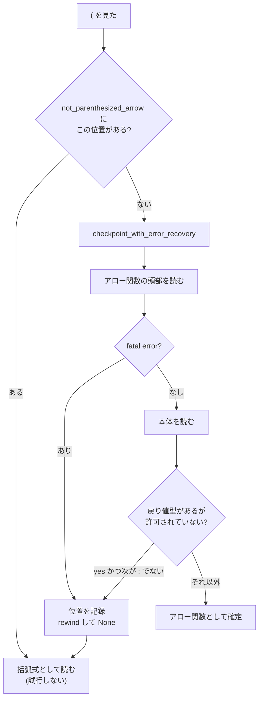

## 何を学んだか

式のパースには 2 つの難所がある。

**1. 演算子の優先順位。** `a + b * c` を `a + (b * c)` にする。これは Pratt parsing (優先順位登り) で解ける。

**2. カバーグラマー。** 同じ文字列が、後ろを見るまで何なのか決まらない。

```js
(a, b)              // 括弧で囲んだカンマ式
(a, b) => a + b     // アロー関数の引数リスト

({ foo = bar })     // 構文エラー (CoverInitializedName)
({ foo = bar } = o) // 分割代入。これは合法
```

oxc の対処は 2 とおりある。**巻き戻して読み直す**か、**先に読んでおいて後で採否を決める**か。

## なぜそうなっているか

### `Precedence` は 23 段の enum

```rust title="crates/oxc_syntax/src/precedence.rs"
/// Operator Precedence
///
/// The following values are meaningful relative position, not their individual values.
/// The relative positions are derived from the ECMA Spec by following the grammar bottom up, starting from the "Comma Operator".
///
/// Note: This differs from the operator precedence table
/// <https://developer.mozilla.org/en-US/docs/Web/JavaScript/Reference/Operators/Operator_Precedence#table>
/// but the relative positions are the same, as both are derived from the ECMA specification.
///
/// The values are the same as
/// [esbuild](https://github.com/evanw/esbuild/blob/.../internal/js_ast/js_ast.go#L28)
#[derive(Debug, Clone, Copy, Eq, PartialEq, Ord, PartialOrd)]
#[repr(u8)]
pub enum Precedence {
    Lowest = 0,
    Comma = 1,
    Spread = 2,
    Yield = 3,
    Assign = 4,
    Conditional = 5,
    NullishCoalescing = 6,
    LogicalOr = 7,
    LogicalAnd = 8,
    BitwiseOr = 9,
    BitwiseXor = 10,
    BitwiseAnd = 11,
    Equals = 12,
    Compare = 13,
    Shift = 14,
    Add = 15,
    Multiply = 16,
    Exponentiation = 17,
    Prefix = 18,
    Postfix = 19,
    New = 20,
    Call = 21,
    Member = 22,
}
```

doc に 3 つのことが書いてある。

- **値そのものではなく相対位置が意味を持つ**
- **MDN の表とは値が違うが、相対位置は同じ** (どちらも仕様から導出しているため)
- **値は esbuild と同じ** — リンク付き

**同じ問題を解いた別実装と数値を揃えておく**のは、比較検証を可能にする。esbuild の挙動と食い違ったときに、優先順位表が原因かどうかをすぐ切り分けられる。

`Ord` を derive しているので、優先順位の比較が `<` や `>=` で書ける。

### Pratt parsing の核心は 5 行

```rust title="crates/oxc_parser/src/js/expression.rs"
    fn parse_binary_expression_rest(
        &mut self,
        lhs_start: u32,
        lhs: Expression<'a>,
        lhs_parenthesized: bool,
        min_precedence: Precedence,
    ) -> Expression<'a> {
        // Pratt Parsing Algorithm
        // <https://matklad.github.io/2020/04/13/simple-but-powerful-pratt-parsing.html>
```

**参考文献のリンクが 1 行目にある。** アルゴリズムの解説を書く代わりに、定番の解説記事を指している。

```rust title="crates/oxc_parser/src/js/expression.rs"
            let Some(left_precedence) = kind_to_precedence(kind) else { break };

            let stop = if left_precedence.is_right_associative() {
                left_precedence < min_precedence
            } else {
                left_precedence <= min_precedence
            };

            if stop {
                break;
            }
```

**これが優先順位と結合方向の全てになる。**

- 演算子の優先順位が `min_precedence` 以下なら止まる (左結合)
- 右結合なら「未満」で止まる (等しいときは続ける = 右に寄る)

```rust title="crates/oxc_syntax/src/precedence.rs"
impl Precedence {
    pub fn is_right_associative(self) -> bool {
        matches!(self, Self::Exponentiation | Self::Conditional | Self::Assign)
    }
```

JS で右結合なのは `**`、`? :`、`=` の 3 つだけ。`2 ** 3 ** 2` が `2 ** (3 ** 2)` になり、`a = b = c` が `a = (b = c)` になる。

再帰呼び出しはこうなる。

```rust title="crates/oxc_parser/src/js/expression.rs"
            self.bump_any(); // bump operator
            let rhs_parenthesized = self.at(Kind::LParen);
            let rhs = self.parse_binary_expression_or_higher(left_precedence);
```

**右辺を「今の演算子の優先順位」を下限として読む。** `a + b * c` なら、`+` を読んだ後 `Add` を下限にして右辺を読むので、`Multiply > Add` の `*` は取り込まれる。

### `[In]` フラグがループの中に効く

```rust title="crates/oxc_parser/src/js/expression.rs"
            // Omit the In keyword for the grammar in 13.10 Relational Operators
            // RelationalExpression[In, Yield, Await] :
            // [+In] RelationalExpression[+In, ?Yield, ?Await] in ShiftExpression[?Yield, ?Await]
            if kind == Kind::In && !self.ctx.has_in() {
                break;
            }
```

[`Context::In`](./context-flags/) が落ちていれば、`in` 演算子を取り込まずにループを抜ける。`for (a in b)` の `a` を読むときにこれが効く。

仕様の生成規則がそのままコメントになっている。

### `>` の再字句化がループの先頭にある

```rust title="crates/oxc_parser/src/js/expression.rs"
        loop {
            // re-lex for `>=` `>>` `>>>`
            // This is needed for jsx `<div>=</div>` case
            let kind = self.re_lex_right_angle();
```

[`re_lex_right_angle`](./on-demand-tokens/) は、`>` として読まれたトークンを `>>` `>>>` `>=` として読み直す。JSX の `<div>=</div>` で `>` の後に `=` が来るケースがあり、レキサの段階では `>=` として読まれてしまう。

**二項演算子のループの先頭に置くことで、演算子の位置に来たときだけ読み直す。**

### `as` / `satisfies` の特殊な打ち切り

TypeScript の `as` は二項演算子のように書けるが、消去可能でなければならないという制約がある。

```rust title="crates/oxc_parser/src/js/expression.rs"
                // When we have `a ## b as T` or `a ## b satisfies T`, where `##` is some binary
                // operator, stop parsing on any following operator with higher precedence than `##`
                // because continuing would make it impossible to erase the `as` or `satisfies`
                // without changing the meaning of the expression.
                // See <https://github.com/microsoft/TypeScript/issues/63527>.
                if let Some(last_precedence) = last_operand_precedence
                    && let Some(next_precedence) = kind_to_precedence(self.re_lex_right_angle())
                    && next_precedence > last_precedence
                {
                    break;
                }
```

`a + b as T * c` を素直にパースすると `a + ((b as T) * c)` になる。ここから `as T` を消すと `a + (b * c)` で、括弧の構造が変わってしまう。**型注釈を消したら意味が変わる、という状況を作らないために打ち切る。**

TypeScript の issue へのリンク付き。**互換実装では「相手の issue 番号」が仕様書の役割を果たす。**

`last_operand_precedence` というフィールドがこのためだけに存在する。

```rust title="crates/oxc_parser/src/js/expression.rs"
        // Precedence of the operator that produced the running left-hand operand, used to detect
        // `as`/`satisfies` assertions that cannot be erased. `None` until a binary/logical operator
        // has been consumed in this loop, matching TypeScript where the initial operand (from unary
        // parsing) is never a binary expression.
        let mut last_operand_precedence: Option<Precedence> = None;
```

### カバーグラマー その 1 — 試して巻き戻す

`(a, b)` を読むとき、`=>` が来るまでアロー関数かどうか分からない。

```rust title="crates/oxc_parser/src/js/arrow.rs"
    fn parse_possible_parenthesized_arrow_function_expression(
        &mut self,
        allow_return_type_in_arrow_function: bool,
    ) -> Option<Expression<'a>> {
        let pos = self.cur_token().start();
        if self.state.not_parenthesized_arrow.contains(&pos) {
            return None;
        }

        let checkpoint = self.checkpoint_with_error_recovery();

        let head = self.parse_parenthesized_arrow_function_head();
        if self.has_fatal_error() {
            self.state.not_parenthesized_arrow.insert(pos);
            self.rewind(checkpoint);
            return None;
        }
```

**アロー関数として読んでみて、失敗したら巻き戻す。** [チェックポイントと `rewind`](./recursive-descent/) がここで使われる。

要点は `not_parenthesized_arrow` になる。

```rust title="crates/oxc_parser/src/state.rs"
    pub not_parenthesized_arrow: FxHashSet<u32>,
```

**失敗した位置 (トークンの開始オフセット) を記録しておき、二度と試さない。** これがないと指数的に遅くなる。`((((a))))` のような入れ子で、外側から順に「アロー関数か?」を試すたびに内側を全部読み直すことになる。



戻り値型のケースには、TypeScript から写した長いコメントが付いている。

```rust title="crates/oxc_parser/src/js/arrow.rs"
        // Given:
        //     x ? y => ({ y }) : z => ({ z })
        // We try to parse the body of the first arrow function by looking at:
        //     ({ y }) : z => ({ z })
        // This is a valid arrow function with "z" as the return type.
        //
        // But, if we're in the true side of a conditional expression, this colon
        // terminates the expression, so we cannot allow a return type if we aren't
        // certain whether or not the preceding text was parsed as a parameter list.
```

`? :` の中のアロー関数で、`:` が「戻り値型の始まり」なのか「条件式の else 側」なのか。**具体例を 2 つ並べて、それぞれどう読むべきかを書いてある。**

### カバーグラマー その 2 — 先に読んで後で採否を決める

`({ foo = bar })` は構文エラーだが、`({ foo = bar } = o)` は合法な分割代入になる。`=` が後ろに来るかどうかで決まる。

oxc は**「とりあえず代入式として読んで、脇に保存しておく」**。

```rust title="crates/oxc_parser/src/js/object.rs"
        if is_shorthand_property_assignment {
            if let PropertyKey::StaticIdentifier(identifier_name) = key {
                // CoverInitializedName ({ foo = bar })
                if self.eat(Kind::Eq) {
                    let right = self.parse_assignment_expression_or_higher();
                    let left = AssignmentTarget::new_assignment_target_identifier(
                        identifier_name.span,
                        identifier_name.name,
                        self,
                    );
                    let expr = AssignmentExpression::new(
                        self.end_span(start),
                        AssignmentOperator::Assign,
                        left,
                        right,
                        self,
                    );
                    self.state.cover_initialized_name.insert(start, expr);
                }
```

[`ParserState`](./context-flags/) の `cover_initialized_name` に、**プロパティの開始位置をキーにして保存する。**

後で分割代入だと判明したら、取り出して使う。

```rust title="crates/oxc_parser/src/js/grammar.rs"
            let init = p.state.cover_initialized_name.remove(&property.span.start).map(|e| e.right);
```

`remove` で取り出すので、**消費されたものはマップから消える。**

パースが全部終わったとき、マップに残っているものが「使われなかった = 構文エラー」になる。

```rust title="crates/oxc_parser/src/lib.rs"
        // PropertyDefinition : cover_initialized_name
        for expr in self.state.cover_initialized_name.values() {
            self.errors.push(diagnostics::cover_initialized_name(expr.span()));
        }
```

**「消費されずに残ったものがエラー」というパターンで、判定を最後の 1 か所にまとめている。** オブジェクトリテラルを読む時点では判断できないので、判断を先送りしてすべて記録し、最後に残余を見る。

同じ形が[未使用の disable ディレクティブ](./disable-and-suppress/)にもあった。**「使われたものを消していき、残りを報告する」**は繰り返し出てくる形になる。

## ソースコードのどこか

- [`crates/oxc_syntax/src/precedence.rs`](https://github.com/oxc-project/oxc/blob/apps_v1.81.0/crates/oxc_syntax/src/precedence.rs) — `Precedence` (23 段)
- [`crates/oxc_parser/src/js/expression.rs`](https://github.com/oxc-project/oxc/blob/apps_v1.81.0/crates/oxc_parser/src/js/expression.rs) — Pratt parsing の本体
- [`crates/oxc_parser/src/js/arrow.rs`](https://github.com/oxc-project/oxc/blob/apps_v1.81.0/crates/oxc_parser/src/js/arrow.rs) — アロー関数の判定
- [`crates/oxc_parser/src/js/object.rs`](https://github.com/oxc-project/oxc/blob/apps_v1.81.0/crates/oxc_parser/src/js/object.rs) — `CoverInitializedName` の保存
- [`crates/oxc_parser/src/js/grammar.rs`](https://github.com/oxc-project/oxc/blob/apps_v1.81.0/crates/oxc_parser/src/js/grammar.rs) — 式から代入対象への変換

`grammar.rs` にあるのは「式として読んだものを、分割代入のパターンとして読み直す」変換になる。`[a, b] = c` の左辺は `ArrayExpression` として読まれた後、`ArrayAssignmentTarget` に変換される。**トークンレベルではなく AST レベルの「読み直し」**で、これもカバーグラマーへの対処の 1 つになる。

## どう活かすか

**優先順位登り (Pratt parsing) は、優先順位を数値にして比較 1 回で書ける。** 結合方向は `<` と `<=` の切り替えだけ。演算子が 20 個あっても、この 5 行は変わらない。**演算子ごとの関数を書き分ける実装より、はるかに短くなる。**

**別実装と数値を揃えておくと、比較検証ができる。** oxc の `Precedence` は esbuild と同じ値で、リンクが張ってある。挙動の食い違いを調べるときに「優先順位表は同じ」を前提にできる。

**「試して巻き戻す」には、失敗の記録をセットにする。** `not_parenthesized_arrow` がないと、入れ子の括弧で指数的に遅くなる。**バックトラック型のパーサでは、メモ化がほぼ必須**になる。記録するのは「成功した結果」ではなく「失敗した位置」だけでよいことが多い。

**判断できない時点では判断せず、記録して先送りする。** `cover_initialized_name` は「オブジェクトリテラルの時点では合法か分からない」を、保存して後で採否を決める形にした。**「使われたものを消し、残ったものを報告する」**という後始末がセットになる。

**曖昧な構文の判定には、具体例をコメントで並べる。** `x ? y => ({ y }) : z => ({ z })` のような例は、文章 10 行より情報量が多い。oxc のアロー関数判定には TypeScript から写した例が複数残っている。

**互換実装では、相手の issue へのリンクが仕様書になる。** `as` / `satisfies` の打ち切り条件は TypeScript の issue #63527 に基づいている。リンクがなければ、この 5 行が何を防いでいるのか永久に分からない。
