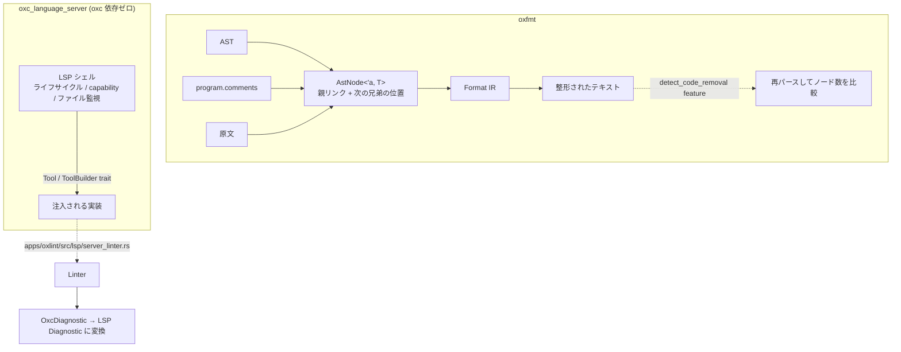

## 何を学んだか

同じ AST を使う 2 つの利用者で、要求が大きく違う例が最後に 2 つある。

**oxfmt (Formatter)** — 一般的なフォーマッタは CST (concrete syntax tree、空白とコメントを含む木) を持つ。oxc は持たない。**通常の AST と `program.comments` と原文の 3 つ**で整形する。走査も [`Traverse`](./traverse-vs-visitmut/) を使わず、**親リンクを持つ独自の `AstNode<'a, T>`** で辿る。

**oxc_language_server (LSP)** — こちらは逆に、**oxc の crate に一切依存していない。**

```toml title="crates/oxc_language_server/Cargo.toml"
[dependencies]
cow-utils = { workspace = true }
futures = { workspace = true }
papaya = { workspace = true }
tracing = { workspace = true }
rustc-hash = { workspace = true }
serde = { workspace = true, features = ["derive"] }
serde_json = { workspace = true }
tokio = { workspace = true, features = ["rt-multi-thread", "io-std", "macros"] }
tower-lsp-server = { workspace = true, features = ["proposed"] }
```

**`oxc_*` の依存が 1 つもない。** linter は `Tool` / `ToolBuilder` というトレイト越しに外から注入される。

## なぜそうなっているか

### なぜ CST を持たないのか

CST を持つと、パーサ・AST・全ての利用者がその重さを負う。空白とコメントをノードとして持つと、ノード数が数倍になる。**リンタは空白に興味がない。**

oxc は「フォーマッタだけが必要とするもの」を、フォーマッタ側で組み立てることにした。

- **コメント** — `Program::comments` に位置順で入っている ([Program の定義](./ast-memory-layout/))
- **空白と元の改行** — 原文から `Span` で引く
- **元のフォーマット** — 同上

`source_text.rs` というモジュールがあるのは、この「原文を参照する」処理のためになる。

代償は、フォーマッタの実装が難しくなることだ。「この 2 つのノードの間に空行があったか」を知るには、両者の `Span` の間の原文を見る必要がある。CST なら空白ノードを見るだけで済む。

### 親リンク付きの `AstNode<'a, T>`

```rust title="crates/oxc_formatter/src/ast_nodes/node.rs"
pub struct AstNode<'a, T> {
    pub(super) inner: &'a T,
    pub(super) parent: AstNodes<'a>,
    pub(super) allocator: &'a Allocator,
    /// The start position of the following sibling node, or 0 if none.
    pub(super) following_span_start: u32,
}
```

4 つのフィールドを持つ。

- `inner` — 元の AST ノードへの参照
- `parent` — **親へのリンク**
- `allocator` — 新しい `AstNode` をアリーナに作るため
- `following_span_start` — **次の兄弟の開始位置**

`Deref` が実装されているので、`AstNode<'a, BinaryExpression>` は `BinaryExpression` として使える。

```rust title="crates/oxc_formatter/src/ast_nodes/node.rs"
impl<'a, T> Deref for AstNode<'a, T> {
    type Target = T;

    fn deref(&self) -> &'a Self::Target {
        self.inner
    }
}
```

**`following_span_start` があるのが、フォーマッタ固有の要求そのものになる。** 「このノードと次のノードの間に何があるか (空行、コメント)」を知るために、次の兄弟の開始位置が要る。CST がないので、こうやって明示的に持つ。

この `AstNode` と `AstNodes` (親リンクの enum) は [ast_tools が生成する](./ast-tools/)。`FormatterAstNodesGenerator` と `FormatterFormatGenerator` がそれにあたる。

**読むだけなので `Traverse` は要らない。** [`Traverse` が生ポインタと `Ancestor` を使う](./traverse-vs-visitmut/)のは書き換えるからで、読むだけなら親への `&` を持てばいい。

### 防衛線 — 整形前後でノード数を数える

```rust title="crates/oxc_formatter/src/detect_code_removal/mod.rs"
pub fn detect_code_removal(
    before_text: &str,
    after_text: &str,
    source_type: SourceType,
) -> Option<String> {
    let before_stats = collect(before_text, source_type);
    let after_stats = collect(after_text, source_type);

    diff(&before_stats, &after_stats)
}
```

**整形前と整形後の両方をパースして、ノードを数えて比べる。**

```rust title="crates/oxc_formatter/src/detect_code_removal/mod.rs"
/// Collect statistics from source code.
fn collect(code: &str, source_type: SourceType) -> StatsCollector {
    // Parse the way the formatter does (so the before/after comparison matches the formatter's view).
    let allocator = Allocator::default();
    let ParserReturn { program, diagnostics, .. } = parse_for_format(&allocator, code, source_type);

    let mut collector = StatsCollector::default();

    // If there are parse errors, skip further analysis.
    // This will be reported in `diff()` later.
    if !diagnostics.is_empty() {
        collector.has_parse_error = true;
        return collector;
    }

    // Using semantic analysis here only to get parent node
    let semantic_ret = SemanticBuilder::new().with_build_nodes(true).build(&program);
    collector.collect(&program, &semantic_ret.semantic)
}
```

「フォーマッタと同じやり方でパースする」というコメントが付いている。**比較の前提を揃えないと、フォーマッタが見ていない差分で騒ぐ。**

比較はノード種別ごとのカウントになる。

```rust title="crates/oxc_formatter/src/detect_code_removal/mod.rs"
/// Check if there's a difference (= code removal) between before and after formatting.
fn diff(before: &StatsCollector, after: &StatsCollector) -> Option<String> {
    // Simply counts differences in node counts.
    // `debug_name()` which contains node type and its details is used as the key.
```

**「フォーマッタがコードを消してしまった」を検出する。** 整形は意味を変えてはいけないので、ノードが減っていたらバグになる。

これは `detect_code_removal` feature で、通常のビルドには入らない。[fix 後の再パース](./auto-fix/)、[transform 後の semantic 再構築](./transformer/)、[dispatch 表の二重実行](./rule-dispatch/)と同じ形が、ここにも出てくる。

**oxc の各段には「出力を検証する仕組み」が必ず 1 つある**、という言い方ができる。

| 段                | 検証                      | 有効になる条件                |
| ----------------- | ------------------------- | ----------------------------- |
| Semantic          | `Stats` の答え合わせ      | debug build                   |
| Linter (dispatch) | 最適化あり/なしの二重実行 | debug build                   |
| Linter (fix)      | 整形後を再パース          | debug build                   |
| Transformer       | semantic を再構築して比較 | `transform_checker`           |
| Formatter         | 整形前後のノード数比較    | `detect_code_removal` feature |
| Lexer (SIMD 版)   | 既存レキサとの差分        | `lexer` feature               |

### language_server が oxc に依存しない

```rust title="crates/oxc_language_server/src/tool.rs"
pub trait ToolBuilder: Send + Sync {
    /// Modify the server capabilities to include capabilities provided by this tool.
    fn server_capabilities(
        &self,
        _capabilities: &mut ServerCapabilities,
        _backend_capabilities: &mut Capabilities,
    ) {
    }

    /// Build a boxed instance of the tool for the given root URI and options.
    fn build(&self, root_uri: &Uri, options: serde_json::Value) -> ToolBuildResult;

    /// Shutdown hook for the tool. Implementors may perform any necessary cleanup here.
    fn shutdown(&self, _root_uri: &Uri) {
        // Default implementation does nothing.
    }
}
```

**`Tool` が扱うのは `serde_json::Value` と LSP の型だけ。** oxc の AST も診断も出てこない。

```rust title="crates/oxc_language_server/src/tool.rs"
pub type DiagnosticResult = Result<Vec<(Uri, Vec<Diagnostic>)>, String>;
```

`Diagnostic` は `tower_lsp_server::ls_types::Diagnostic` — LSP プロトコルの型で、[`OxcDiagnostic`](./diagnostics/) ではない。**変換は `apps/oxlint/src/lsp/server_linter.rs` 側でやる。**

この分け方の効果は、

- **LSP の面倒な部分 (ライフサイクル、capability 交渉、ファイル監視、ワークスペース管理) が 1 か所にまとまる**
- **linter 以外のツールも同じシェルに載せられる。** oxfmt を LSP として動かすのも同じ形になる
- **LSP の実装が oxc のバージョンに縛られない**

`Tool` トレイトのメソッドを見ると、LSP サーバが扱う面倒事が並んでいる。

```rust title="crates/oxc_language_server/src/tool.rs"
    /// The Server has new configuration changes.
    /// Returns a [ToolRestartChanges] indicating what changes were made for the Tool.
    fn handle_configuration_change(&self, ...) -> ToolRestartChanges;

    /// Get the file watcher patterns for this tool based on the provided options.
    fn get_watcher_patterns(&self, options: serde_json::Value) -> Vec<Pattern>;

    /// Handle a watched file change event for the given URI.
    /// ...
    /// The given URI may not match the watch patterns or may be irrelevant for the workspace.
    /// A file change can affect multiple workspaces, so the Tool should check if it is relevant.
    fn handle_watched_file_change(&self, ...) -> ToolRestartChanges;
```

**「設定が変わったら再起動が要るか」「どのファイルを監視するか」「変更されたファイルは自分に関係あるか」。** どれも LSP の運用で必ず出てくる問題で、それを `Tool` 側の判断に委ねている。

doc に「この URI は監視パターンに合わないかもしれないし、このワークスペースに無関係かもしれない」と警告がある。**トレイトの実装者が陥りやすい前提の誤りを、doc で潰している。**

### 型消去でバイナリを小さくする

```rust title="crates/oxc_language_server/src/lib.rs"
/// Run the language server.
///
/// The future is type-erased to reduce binary size by preventing CLI and NAPI execution paths from
/// each generating a copy of the LSP server state machine.
pub fn run_server(
    server_name: String,
    server_version: String,
    worker_manager: WorkerManager,
) -> BoxFuture<'static, ()> {
    Box::pin(run_server_impl(server_name, server_version, worker_manager))
}
```

**`async fn` の戻り値は無名の型なので、呼び出し経路ごとに別の状態機械が生成される。** CLI から呼ぶ経路と NAPI から呼ぶ経路で 2 つできる。

`BoxFuture` に包むと 1 つになる。仮想呼び出しが 1 回増えるが、LSP サーバの起動は 1 回しか起きないので無視できる。

[Codegen の 4 メソッド分割](./estree-serialization/)、[`Rule` の非ジェネリックヘルパ](./rule-trait/)と同じ、バイナリサイズを意識した判断になる。

### 並行データ構造も同じものを使う

```rust title="crates/oxc_language_server/src/lib.rs"
pub type ConcurrentHashMap<K, V> = papaya::HashMap<K, V, FxBuildHasher>;
```

[並列 lint](./parallel-lint/) が使っているのと同じ `papaya` になる。crate は分かれているが、選んでいる道具は共通している。



## ソースコードのどこか

- [`crates/oxc_formatter/src/lib.rs`](https://github.com/oxc-project/oxc/blob/apps_v1.81.0/crates/oxc_formatter/src/lib.rs) — 入口と feature
- [`crates/oxc_formatter/src/ast_nodes/node.rs`](https://github.com/oxc-project/oxc/blob/apps_v1.81.0/crates/oxc_formatter/src/ast_nodes/) — `AstNode<'a, T>`
- [`crates/oxc_formatter/src/detect_code_removal/mod.rs`](https://github.com/oxc-project/oxc/blob/apps_v1.81.0/crates/oxc_formatter/src/) — 整形前後の比較
- [`crates/oxc_language_server/src/tool.rs`](https://github.com/oxc-project/oxc/blob/apps_v1.81.0/crates/oxc_language_server/src/tool.rs) — `Tool` / `ToolBuilder`
- [`crates/oxc_language_server/Cargo.toml`](https://github.com/oxc-project/oxc/blob/apps_v1.81.0/crates/oxc_language_server/Cargo.toml) — oxc 依存がないこと
- [`apps/oxlint/src/lsp/server_linter.rs`](https://github.com/oxc-project/oxc/blob/apps_v1.81.0/apps/oxlint/src/) — linter を `Tool` として注入する側

フォーマッタには「JS 以外に埋め込まれた JS」を整形する入口もある。

```rust title="crates/oxc_formatter/src/lib.rs"
/// Usage context a JS/TS fragment is placed in js-in-xxx.
/// Drives context-dependent formatting decisions (e.g. forced parentheses, quote style).
///
/// Currently `format_fragment()` callers pass wrapped source.
/// (Prettier's multiparser wraps the fragment before `textToDoc()`);
/// Each variant documents the expected wrap as an input contract.
/// The JS formatter knows nothing about Prettier/Vue vocabulary.
#[derive(Clone, Copy, Debug)]
#[non_exhaustive]
pub enum FragmentContext {
    /// Function params in a binding-LHS position (e.g. Vue `v-for` left).
    /// Parentheses are forced when there are multiple params or a rest element.
    ///
    /// Input wrap: `function _(PARAMS) {}`
    FunctionParamsAsBindingLhs,
```

Vue の `v-for="(item, index) in list"` の左辺のような、**JS の断片だが単体では文法的に完全でないもの**を整形する。呼び出し側が `function _(PARAMS) {}` の形に包んでから渡す、という契約になっている。

**「JS フォーマッタは Prettier / Vue の語彙を知らない」**と明記されている。抽象の境界を守るという意思表明で、`FragmentContext` の variant 名も `Vue` ではなく `FunctionParamsAsBindingLhs` という汎用の名前になっている。

## どう活かすか

**「一部の利用者だけが必要とするもの」を全体の型に入れない。** CST を持つとリンタもトランスフォーマもその重さを負う。フォーマッタ側で「AST + コメント + 原文」から組み立てるほうが、全体としては安い。**判断の軸は「必要とする利用者の割合」**になる。

**読むだけなら親リンクでよい。** [`Traverse` が生ポインタと `Ancestor` を使う](./traverse-vs-visitmut/)のは書き換えるからで、読むだけなら `parent: &'a Parent` を持てば済む。**「書き換えない」という制約は、実装をずっと単純にする。**

**利用者固有の情報はその利用者の型に持つ。** `following_span_start` はフォーマッタ以外には要らない。AST 本体に足すのではなく、フォーマッタが作る `AstNode` に持たせる。

**出力を検証する仕組みを各段に 1 つ置く。** 「fix 後を再パース」「transform 後に semantic を再構築」「整形前後のノード数を比較」。どれも feature か debug build に閉じていて、通常のビルドには入らない。**「出力側の不変条件」を 1 か所で検査すると、上流の全ケースをカバーできる。**

**プロトコル層とドメイン層を crate で分ける。** `oxc_language_server` が oxc に依存しないので、LSP の面倒事が 1 か所にまとまり、他のツールも載せられる。**依存の向きを「プロトコル ← ドメイン」にする**のがポイントで、逆にするとプロトコル層がドメインのバージョンに縛られる。

**トレイトの doc に「実装者が誤りやすい前提」を書く。** 「この URI は監視パターンに合わないかもしれない」。書いていなければ、実装者は「渡ってくる URI は自分に関係あるもの」と仮定する。

**抽象の境界を名前で守る。** `FragmentContext::FunctionParamsAsBindingLhs` は Vue の `v-for` のためにあるが、名前に Vue が出てこない。**「JS フォーマッタは Vue を知らない」**と doc に書いてあるので、次に別のフレームワークが来ても同じ variant が使える。
