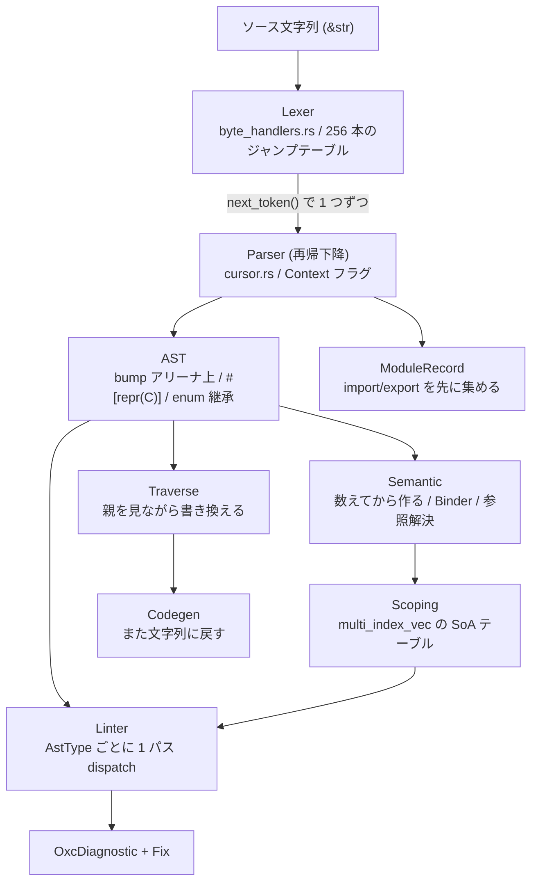

`oxlint file.ts` と打ってから診断が出るまでに、oxc は 1 本の縦の道を通る。ファイルのバイト列を先頭バイトで分岐する 256 本のハンドラに投げてトークンを 1 つ取り出し、再帰下降のパーサがそれを消費して AST を組み立て、AST は最初から最後までひとつの bump アリーナの上に載り、semantic がスコープとシンボルを別のテーブルに作り、870 本のルールが AST 型ごとにバケツ分けされた 1 パスで走り、診断が出る。

この章はその道を上から下に辿る。



## なぜ 1 本の縦線で読むのか

JS のツールチェインは、歴史的に「1 段 1 プロジェクト」で分かれてきた。Babel がパースして変換し、ESLint がまたパースして検査し、Prettier がまたパースして整形し、tsc がまたパースして型を見る。同じファイルが 4 回パースされ、4 種類の AST が作られる。

oxc はここを逆に振った。**1 つの AST 定義を、パーサ・リンタ・トランスフォーマ・フォーマッタ・ミニファイアが共有する。** そうすると設計の重心が「各ツールの機能」ではなく「AST とその周辺のデータ構造」に移る。AST が bump アリーナの上にあること、`Span` が 8 バイトであること、`Expression` が 16 バイトであることが、リンタの速さにもトランスフォーマの安全性にも同時に効いてくる。

だから読む順番も、ツール単位ではなく段単位にした。段ごとに何を持ち、次の段に何を渡すのかを追えば、oxc のほとんどの設計判断がその 1 本の線の上に並ぶ。

## この OSS について

oxc (The JavaScript Oxidation Compiler) は、JS/TS ツールチェインを Rust で書き直しているプロジェクト。世に出ているのは主に 2 つのアプリケーションで、**oxlint** (リンタ) と **oxfmt** (フォーマッタ) がそれにあたる。その下に `oxc_parser` / `oxc_semantic` / `oxc_linter` / `oxc_transformer` / `oxc_codegen` / `oxc_minifier` といった crate 群がある。

バージョンが二系統あるので注意がいる。crate 側は `0.148.0`、アプリ側 (oxlint / oxfmt) は `1.81.0`。この章が固定しているタグ `apps_v1.81.0` はアプリ側の採番だ。

読んでいて特に面白いのは次のあたりになる。

- **コード生成がクレート境界も言語境界も越えていること。** `tasks/ast_tools` は AST の定義 (`#[ast]` が付いた Rust の型) を `syn` で読んで唯一の真実とし、そこから `AstKind`・`Visit`・`Traverse`・`AstBuilder`・ESTree シリアライザ・TypeScript の `types.d.ts`・JS 側のデシリアライザ、さらには CI の paths-filter YAML まで吐く。生成物は git にコミットされ、CI が `git diff --exit-code` で検証する
- **リンタのディスパッチ表が、ルールのソースコードを静的解析して作られていること。** `tasks/linter_codegen` が各ルールの `run` メソッドを `syn` で読み、`match` 式や `if let` から「このルールがどの `AstType` を触るか」を推論して 1.5MB の enum を生成する。推論が外れたときの保険まで用意されている
- **メモリの挙動が CI のスナップショットテストになっていること。** `tasks/track_memory_allocations` が「システムアロケーション何回・アリーナ割り当て何回・ピーク何バイト」を YAML に固定している。2.92MB の `checker.ts` をパースするシステムアロケーションは 19 回しかない
- **速さの理由が 1 か所に集まっていること。** bump アリーナ、`u32` のオフセット、`#[repr(C, u8)]` によるゼロコストの enum 継承。この 3 つを押さえると、他の段の設計判断はほぼその帰結として読める
- **「本番経路に載っていないコード」が同居していること。** SIMD で 64 バイトずつ一括に字句解析する `oxc_lexer` は、まだパーサから呼ばれていない。既存レキサを oracle にした差分検証だけが走っている。新しい実装をどう安全に育てるかの実例として読める

## 通し例

この章は全ページで同じスニペットを使う。段ごとに、これがどう変わっていくかを見ていく。

```ts title="example.ts"
import { readFile } from "node:fs/promises";

export type Entry = { name: string; size: number };

export async function collect(path: string): Promise<Entry[]> {
  const raw = await readFile(path, "utf8");
  const unused = 1;
  return raw.split("\n").map((name) => ({ name, size: name.length }));
}
```

10 行のなかに、この章で扱いたいものがひととおり入っている。`import` は module_record が拾い、`type Entry` は TS 専用のノードになり、`async function` は Context フラグの `Await` を立て、アロー関数は新しいスコープを作り、`unused` は `no-unused-vars` が拾う。詳しくは[通し例のページ](./running-example/)にまとめた。

## 読む順番

前提 — JS ツールと構文解析の語彙:

- [JS ツールチェインの地図](./js-toolchain-map/)
- [字句解析と構文解析とは](./lexing-and-parsing/)
- [AST と ESTree](./ast-and-estree/)
- [通し例: 10 行の TS が辿る道](./running-example/)

文字列を読む — Lexer:

- [256 本の byte handler — 先頭バイトで飛ぶ](./byte-handlers/)
- [オンデマンドにトークンを 1 つずつ](./on-demand-tokens/)
- [文字列・数値・Unicode をどう読むか](./escapes-and-unicode/)
- [もう一つのレキサ — SIMD 一括レキサと差分検証](./the-other-lexer/)

木を作る — Parser:

- [再帰下降の骨格と cursor](./recursive-descent/)
- [Context フラグ — 文法が文脈で変わる](./context-flags/)
- [式のパースと優先順位](./expression-precedence/)
- [TS と JSX を 1 つのパーサで](./ts-and-jsx/)
- [エラー回復 — fatal と非 fatal を分ける](./error-recovery/)
- [module_record — import/export を先に集める](./module-record/)

木の設計 — Allocator・AST・コード生成:

- [Bump アリーナと Box / Vec](./bump-allocator/)
- [アロケータを使い回す](./allocator-reuse/)
- [AST のメモリレイアウトと Span](./ast-memory-layout/)
- [ast_tools — AST 定義が唯一の真実](./ast-tools/)
- [生成される走査 — AstKind と Visit / VisitMut](./astkind-and-visit/)
- [ESTree シリアライズと raw transfer](./estree-serialization/)

意味をつける — Semantic:

- [スコープとシンボル解決とは](./scope-and-symbol/)
- [SemanticBuilder — 数えてから作る](./semantic-builder/)
- [Binder — AST ノード自身が自分を登録する](./binder/)
- [データ指向のスコープ表現](./data-oriented-scoping/)
- [参照解決 — 集めてから 1 周する](./reference-resolution/)
- [Semantic が担う early error 検査](./early-errors/)

木を歩く — traverse:

- [Traverse — 書き換えながら親を見る](./traverse-vs-visitmut/)
- [TraverseCtx — 祖先・スコープ・UID](./traverse-ctx/)

木を検査する — Linter:

- [Rule トレイト — 必須メソッドがゼロ](./rule-trait/)
- [ルールの登録とディスパッチ表の生成](./rule-dispatch/)
- [ルールを読む — no-unused-vars](./reading-no-unused-vars/)
- [診断の設計](./diagnostics/)
- [auto fix — 重なったら諦める](./auto-fix/)
- [無視の 2 段構え — ディレクティブと抑制ファイル](./disable-and-suppress/)
- [並列実行 — rayon とモジュールグラフ](./parallel-lint/)
- [Rust の外に出したもの — JS プラグインと tsgolint](./outside-rust/)

同じ AST を誰がどう使うか:

- [Transformer — AST を書き換える](./transformer/)
- [Codegen — AST を文字列に戻す](./codegen/)
- [Minifier と Mangler — 小さくする](./minifier-and-mangler/)
- [Formatter と language_server — 別の要求](./formatter-and-lsp/)

## 対象外

読む線を 1 本に保つため、次は扱わない。

- **`oxc_type_checker`** — 「まだ何も型検査しない足場」と自称している段階
- **`oxc_react_compiler`** — React Compiler の Rust 移植。それ自体で 1 章になる規模
- **`oxc_regular_expression`** — 正規表現のパーサ
- **`oxc_formatter_css` / `_yaml` / `_json` / `_graphql`** — oxfmt は JS 専用ではないが、この章は JS/TS の線だけを辿る
- **`oxc_isolated_declarations`**
- **napi の JS バインディング自体** — ただし raw transfer は AST 設計の帰結として[群 4](./estree-serialization/)で触れる
- **TypeScript の型の意味論** — 「パーサと AST がどう扱うか」までにとどめる
