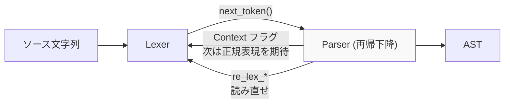

## 何を学んだか

ソースコードを木にする工程は、伝統的に 2 段に分かれる。

**1. 字句解析 (lexical analysis / lexing)** — バイト列をトークン (意味のある最小単位) に切る。

```
const raw = await readFile(path, "utf8");
```

```
[const] [raw] [=] [await] [readFile] [(] [path] [,] ["utf8"] [)] [;]
```

**2. 構文解析 (parsing)** — トークン列を木に組む。

```
VariableDeclaration (kind: const)
└── VariableDeclarator
    ├── id: BindingIdentifier "raw"
    └── init: AwaitExpression
        └── argument: CallExpression
            ├── callee: IdentifierReference "readFile"
            └── arguments: [IdentifierReference "path", StringLiteral "utf8"]
```

必要な語彙は 4 つになる。

- **トークン (token)** — 字句解析の出力単位。種類 (`Kind`) と位置 (`Span`) を持つ
- **再帰下降 (recursive descent)** — 文法規則 1 つにつき関数 1 つを書き、互いに呼び合うパースの書き方
- **優先順位 (precedence)** — `a + b * c` を `a + (b * c)` にするための順位
- **エラー回復 (error recovery)** — 構文エラーがあっても、できるところまで木を作る

そして **JS ではこの 2 段の分業が素直に成立しない。** 字句解析の結果が構文解析の文脈に依存する。

## なぜそうなっているか

### 分業が成立するとき

C や Rust なら、字句解析は構文解析から独立している。`+` は常に加算演算子だし、`if` は常にキーワードになる。だから「まず全部トークンにして、それからパース」ができる。

この分業の利点は、

- 各段が単純になる
- トークン列を再利用できる (シンタックスハイライト、フォーマッタ)
- テストが分離できる

### JS で成立しない 3 つの例

**1. `/` が除算か正規表現か**

```js
a / b / c; // 除算 2 回
a = /b/ / c; // 正規表現 / 除算
```

字句解析だけでは決まらない。**「直前のトークンが値だったか演算子だったか」を知る必要がある。** 値の後なら除算、演算子の後なら正規表現。

しかも「直前が値か」の判定自体が難しい。`}` の直後は、ブロックの終わりなら正規表現、オブジェクトリテラルの終わりなら除算になる。

**2. `in` が演算子か `for-in` の一部か**

```js
for (a in b) {
} // for-in 文
for (let x = (a in b); ;) {} // in は関係演算子
```

`for (` の直後で式を読むとき、`in` を演算子として取り込むと `for-in` 文が判定できなくなる。

**3. `await` / `yield` が識別子か演算子か**

```js
function f() {
  const await = 1;
} // OK: await は識別子
async function g() {
  await x;
} // await 式
function* h() {
  yield x;
} // yield 式
function i() {
  const yield = 1;
} // OK: yield は識別子
```

**`await` と `yield` は予約語ではない。** 文脈によって演算子になる。

さらに `sourceType: unambiguous` (モジュールかスクリプトか未定) では、トップレベルの `await` が**パース完了まで確定しない。**

### oxc がどう解いているか

3 つの手を組み合わせている。

**文脈フラグを持つ ([Context フラグ](./context-flags/))。** ECMAScript の仕様が `RelationalExpression[In, Yield, Await]` という記法で「パラメータ付きの生成規則」を書いているので、それをビットフラグにそのまま写す。

```rust title="crates/oxc_parser/src/context.rs"
    pub struct Context: u16 {
        /// [In] Flag, i.e. the [In] part in RelationalExpression[In, Yield, Await]
        const In = 1 << 0;
        /// [Yield] Flag
        const Yield = 1 << 1;
        /// [Await] Flag
        const Await = 1 << 2;
```

**レキサをオンデマンドにする ([オンデマンドにトークンを 1 つずつ](./on-demand-tokens/))。** トークン列を先に全部作らず、パーサが必要としたときに 1 個ずつ作る。だからパーサの文脈をレキサに伝えられる。

**読み直す ([再字句化](./on-demand-tokens/))。** `>>` として読んだトークンを、後から `>` 2 個として読み直す。

```rust title="crates/oxc_parser/src/cursor.rs"
    pub(crate) fn re_lex_ts_r_angle(&mut self) -> bool {
        // ...
        if kind == Kind::ShiftRight {
            self.token = self.lexer.re_lex_as_typescript_r_angle(2);
            true
```



**矢印が双方向になっている**のが JS のパーサの特徴になる。

### 再帰下降とは

文法規則をそのまま関数にする書き方になる。

```
Statement       := VariableDeclaration | IfStatement | ...
IfStatement     := "if" "(" Expression ")" Statement ("else" Statement)?
Expression      := AssignmentExpression
```

これがそのまま、

```rust
fn parse_statement(&mut self) -> Statement { ... }
fn parse_if_statement(&mut self) -> IfStatement {
    self.expect(Kind::If);
    self.expect(Kind::LParen);
    let test = self.parse_expression();
    self.expect(Kind::RParen);
    let consequent = self.parse_statement();
    // ...
}
```

**文法規則と関数が 1 対 1 なので、仕様を読みながら実装を追える。** これが再帰下降を選ぶ最大の理由になる (生成器で作る LALR パーサだと、生成された表を人間が追えない)。

代償は 2 つある。

- **左再帰が書けない。** `Expression := Expression "+" Expression` をそのまま書くと無限再帰になる。だから二項演算子は[優先順位登り](./expression-precedence/)で別扱いにする
- **先読みが要る場面がある。** `(a, b)` が括弧式かアロー関数か。[チェックポイントと巻き戻し](./recursive-descent/)で対応する

### 優先順位

`a + b * c` を `(a + b) * c` にしてはいけない。演算子に順位を付けて、高い順位が深くなるようにする。

素朴な再帰下降なら、順位ごとに関数を書く。

```
AdditiveExpression       := MultiplicativeExpression (("+" | "-") MultiplicativeExpression)*
MultiplicativeExpression := UnaryExpression (("*" | "/") UnaryExpression)*
```

JS の演算子は 20 種類以上あるので、この方式だと関数が 20 個並ぶ。しかも 1 つの式を読むたびに 20 段の呼び出しが積まれる。

**Pratt parsing (優先順位登り)** はこれを 1 つのループにする。順位を数値で持ち、「今の下限より低い順位の演算子が来たら止まる」で書く ([式のパースと優先順位](./expression-precedence/))。

### エラー回復

エディタや linter は、構文エラーがあるファイルでも何かを表示したい。だから「エラーで止まる」ではなく「できるところまで作る」が要る。

方式はいくつかある。

- **panic mode** — エラーが出たら、同期トークン (`;` や `}`) まで読み飛ばして再開する
- **エラー生成規則** — 文法に「不正な入力」の規則を足す
- **フラグ + ダミーノード** — oxc の方式 ([エラー回復](./error-recovery/))

oxc は「致命的でないエラーは記録して続行、致命的なら残りを捨てる」の 2 段にしている。

### 自動セミコロン挿入 (ASI)

JS 固有の面倒がもう 1 つある。

```js
const a = 1;
const b = 2;
```

セミコロンがなくても動く。仕様は「改行があり、そこで文を終えないと構文エラーになる場合、セミコロンを補う」と定めている。

**改行はトークンではない**ので、レキサは「このトークンの前に改行があった」というフラグを立てておく必要がある ([`Token` の `is_on_new_line`](./on-demand-tokens/))。

ASI には有名な落とし穴がある。

```js
return;
1;
```

これは `return; 1;` と解釈される。`return` の直後の改行は必ず ASI を起こすからだ。パーサはこの「改行を許さない位置」を規則として持つ必要がある。

## ソースコードのどこか

この群は前提の説明なので、oxc のコードとの対応だけを示す。

| 概念         | oxc の実装                                                 | この章のページ                                           |
| ------------ | ---------------------------------------------------------- | -------------------------------------------------------- |
| トークン     | `crates/oxc_parser/src/lexer/token.rs` の `Token` (`u128`) | [オンデマンドにトークンを 1 つずつ](./on-demand-tokens/) |
| トークン種別 | `lexer/kind.rs` の `Kind`                                  | [256 本の byte handler](./byte-handlers/)                |
| 字句解析     | `crates/oxc_parser/src/lexer/`                             | [群 2](./byte-handlers/)                                 |
| 再帰下降     | `crates/oxc_parser/src/js/` など + `cursor.rs`             | [再帰下降の骨格と cursor](./recursive-descent/)          |
| 文脈依存     | `context.rs` の `Context`                                  | [Context フラグ](./context-flags/)                       |
| 再字句化     | `cursor.rs` の `re_lex_*`                                  | [オンデマンドにトークンを 1 つずつ](./on-demand-tokens/) |
| 優先順位     | `crates/oxc_syntax/src/precedence.rs` の `Precedence`      | [式のパースと優先順位](./expression-precedence/)         |
| エラー回復   | `error_handler.rs` の `FatalError`                         | [エラー回復](./error-recovery/)                          |
| ASI          | `cursor.rs` の `asi()` / `can_insert_semicolon()`          | [再帰下降の骨格と cursor](./recursive-descent/)          |

`/` の曖昧さは、oxc では 2 か所で扱われている。パーサ駆動のレキサでは `regex.rs` が「パーサが正規表現を期待していると言ってきたら読む」形で、[一括処理の `oxc_lexer`](./the-other-lexer/) では `pipeline/regex_div.rs` が 74KB かけて自力で判定する。**パーサからの文脈が使えるかどうかで、必要なコード量がこれだけ変わる。**

## どう活かすか

**「2 段に分ける」が成立するかは、言語の性質で決まる。** 字句解析と構文解析を分けられるのは、トークンの切り方が文脈に依存しないときだけ。依存するなら、分けたうえで「文脈を伝える経路」を作るか、読み直しを許すかになる。**設定ファイル、テンプレート言語、DSL でも同じ判断が要る。**

**文法規則と実装の対応を保つ。** 再帰下降を選ぶ理由の大半がこれになる。生成器のほうが正確だが、生成された表は人間が追えない。**「仕様を読みながらコードを追える」は、準拠実装では性能より重い要件**であることがある。

**「予約語ではないが文脈によって意味が変わる語」は、後方互換のために生まれる。** `await` も `yield` も、既存のコードを壊さずに新機能を入れるための妥協になる。**自分が言語や DSL を設計するときは、この妥協のコストを知っておく価値がある。** oxc の `Context` が 9 ビットあるのは、その積み重ねだ。

**エラー回復の方針は、利用者が誰かで決まる。** バッチのコンパイラなら「最初のエラーで止まる」でいい。エディタ支援なら「できるところまで作る」が必須になる。**方針を先に決めないと、エラー処理が場当たりになる。**
