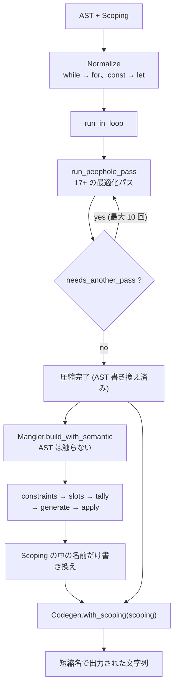

## 何を学んだか

「コードを小さくする」には 2 つの独立した仕事がある。

**1. 構造を縮める (Compress)。** `1 + 1` を `2` に、使われていない関数を消す、`if (a) b(); else c();` を `a ? b() : c()` に。**AST を書き換える。**

**2. 名前を短くする (Mangle)。** `const userName` を `const e` に。

oxc はこれを別の crate にしていて、**片方が AST を書き換え、もう片方は書き換えない。**

```rust title="crates/oxc_mangler/src/lib.rs"
    /// Mangles the program. The resulting SymbolTable contains the mangled symbols - `program` is not modified.
    /// Pass the symbol table to oxc_codegen to generate the mangled code.
    #[must_use]
    pub fn build(self, program: &Program<'_>) -> ManglerReturn {
```

**Mangler は `&Program` を取り、AST を変更しない。** 短縮名は `Scoping` の中のシンボル名として記録され、[Codegen が `with_scoping()` で受け取って初めて出力に現れる](./codegen/)。

Compressor のほうは収束するまで回る。

```rust title="crates/oxc_minifier/src/lib.rs"
pub struct MinifierReturn {
    pub scoping: Option<Scoping>,
    // ...
    /// Total number of iterations ran. Useful for debugging performance issues.
    pub iterations: u8,
```

## なぜそうなっているか

### Mangler が AST を触らない理由

もし Mangler が AST の識別子を直接書き換えると、

- **全識別子ノードを走査して書き換える**必要がある。参照は数十万個ある
- **`Scoping` も同時に更新する**必要がある ([transformer と同じ問題](./transformer/))
- **元の名前が失われる。** source map やデバッグ出力で困る

`Scoping` の中の名前だけを変えれば、

- **シンボルの数だけ書き換えればいい。** 参照は書き換え不要 (同じシンボルを指しているので)
- **AST は無傷。** 何度でもやり直せる
- **[Codegen が識別子を出力するときに `Scoping` を引く](./codegen/)** だけで短縮名が出る

**「変更を最後の段まで遅延する」**という形になっている。同じ AST から「元の名前で出力」と「短縮名で出力」の両方が作れる。

### 名前の割り当てはレジスタ割り当てと同じ問題

Mangler の doc に、5 段のパイプラインが図で書かれている。

````rust title="crates/oxc_mangler/src/lib.rs"
    /// Mangle the program: rewrite local bindings to the shortest legal names.
    ///
    /// Runs as a five-stage pipeline; each stage is one method and feeds the next:
    ///
    /// ```text
    ///  collect constraints → assign slots → tally frequencies → generate names → apply names
    ///    names we must NOT     group bindings   rank slots by how    make that many    give each slot a
    ///    reuse or shadow       that can share   often referenced     short, legal      name and rewrite
    ///    (keywords, globals,   one name into    (hottest first)      names             every reference
    ///    exports, eval, …)     numbered "slots"
    /// ```
````

中心にあるのが「スロット」という概念になる。

```rust title="crates/oxc_mangler/src/lib.rs"
    /// # The slot idea (stages 2–5 hinge on this)
    ///
    /// A *slot* is just an integer. Two bindings get the **same** slot exactly when they can
    /// share one name — their live ranges never overlap. So the problem splits cleanly:
    ///   1. *Which bindings may share a name?* → assign slots (graph-colour the scope tree by
    ///      liveness: a slot is reusable in any scope where it isn't live).
    ///   2. *Which name does each slot get?*  → tally + generate + apply (frequency-ranked
    ///      base54 names, clustered by length).
```

**これはレジスタ割り当てそのものになる。** コンパイラのバックエンドが「同時に生きていない変数は同じレジスタを使える」とやるのと同じで、グラフ彩色で解く。

違いは 2 点。

- **レジスタは数が有限、名前は無限。** だから「割り当てられない」が起きない
- **名前には長さがある。** 1 文字の名前は 54 個しかないので、**よく使われるスロットに短い名前を割り当てたい**

2 番目のために「頻度を数える」段がある。

```rust title="crates/oxc_mangler/src/lib.rs"
    /// - **apply names**: shortest-*length* names to the hottest slots; within one length, in
    ///   source order.
```

**「長さ」でクラスタリングして、同じ長さの中では出現順。** 参照が多いスロットほど短い名前をもらう。

動く例が doc にある。

````rust title="crates/oxc_mangler/src/lib.rs"
    /// ```js
    /// function C(n) {
    ///   for (var i = 0; i < n; i++) log(i);
    ///   for (var j = 0; j < n; j++) log(j);
    /// }
    /// ```
    /// - **assign slots**: `C`,`log` untouched (root binding / global); `n`→slot 1; `i`→slot 2;
    ///   `j`→slot 3 (each its own slot — same-scope bindings never share today).
    /// - **tally**: count references per slot, hottest first.
    /// - **generate names**: `e, t, n, r, …` (base54), skipping any that collide with a keyword,
    ///   a global like `log`, an export, a kept name, or an eval-visible name.
    /// - **apply names**: shortest-*length* names to the hottest slots; within one length, in
    ///   source order. Here the live slots are 1 char, assigned in declaration order:
    /// ```js
    /// function C(e) {
    ///   for (var t = 0; t < e; t++) log(t);
    ///   for (var n = 0; n < e; n++) log(n);
    /// }
    /// ```
````

**`i` と `j` は同じスコープにあるので、今の実装では別スロットになる。** 「same-scope bindings never share today」と、現在の限界が明記されている。理論上は共有できる (`i` の生存が終わってから `j` が始まる) が、実装していない。

名前が `a, b, c` ではなく `e, t, n, r` から始まるのも面白い。base54 の順序が**英語のアルファベット頻度順**になっていて、gzip の圧縮率が上がる。

### `reserved` オプションに長い理由がある

```rust title="crates/oxc_mangler/src/lib.rs"
    /// Names that bindings must not be renamed to, and that bindings already
    /// carrying them keep. Equivalent to terser / swc `mangle.reserved`.
    ///
    /// The main use case is `["exports", "module"]` when minifying prebuilt
    /// CommonJS / UMD files that Node consumers `import` directly: Node's
    /// cjs-module-lexer detects a CommonJS module's named exports by lexically
    /// scanning for `exports.<name> =` / `module.exports` token patterns with no
    /// scope analysis, so renaming an `exports` / `module` wrapper parameter
    /// erases every named export it can see.
    ///
    /// Default: empty.
    pub reserved: FxHashSet<CompactStr>,
```

**Node の `cjs-module-lexer` は字句的に `exports.<name> =` を探すだけで、スコープ解析をしない。** だから `exports` という仮引数を `e` に短縮すると、Node から見て named export が全部消える。

**「正しい変換なのに壊れる」という状況**の説明として、これ以上ないほど具体的になっている。オプションの doc に「なぜこれが必要か」を書く価値がここにある。

### Compressor は収束まで回る

```rust title="crates/oxc_minifier/src/compressor.rs"
    fn run_in_loop(
        max_iterations: Option<u8>,
        program: &mut Program<'a>,
        ctx: &mut ReusableTraverseCtx<'a>,
    ) -> u8 {
        let mut iteration = 0u8;
        // ...
        loop {
            let outcome = compression_pass::run_peephole_pass(program, ctx);
            if !outcome.needs_another_pass {
                break;
            }
            if let Some(max) = max_iterations {
                if iteration >= max {
                    break;
                }
            } else if iteration > 10 {
                debug_assert!(false, "Ran loop more than 10 times.");
                break;
            }
            iteration += 1;
        }
```

**1 回のパスで「まだ変わる」と分かったら、もう 1 回回す。** `1 + 1 + 1` は 1 回目で `2 + 1`、2 回目で `3` になる。

回数の上限が 2 段構えになっている。

- `max_iterations` が指定されていればそれに従う
- 指定がなければ **10 回で打ち切り、しかも debug build では panic する**

`debug_assert!(false, "Ran loop more than 10 times.")` は「10 回で収束しないのは実装のバグ」という主張になる。**リリースビルドでは黙って打ち切り、開発中は落として気づかせる。** [fix の再パース](./auto-fix/)や[dispatch 表の検証](./rule-dispatch/)と同じ作法だ。

[Fixer にマルチパスがない](./auto-fix/)のと対照的で、こちらは収束させる。理由は用途の違いになる — minify は「最小にする」のが目的なので、1 回で止めると成果が減る。

`ReusableTraverseCtx` を使うのも、多パス走査のためだ ([TraverseCtx](./traverse-ctx/))。

### `Scoping` の前提条件が長文で書かれている

```rust title="crates/oxc_minifier/src/compressor.rs"
    /// Returns total number of iterations ran.
    ///
    /// # Precondition
    ///
    /// `scoping` must be consistent with `program` in the resolved-reference
    /// domain: every resolved `IdentifierReference` in `program` must be present
    /// in its symbol's resolved-references list, and no list may contain a
    /// `ReferenceId` whose node is absent from `program`. The compressor refreshes
    /// scoping *incrementally* — it only prunes references for nodes it drops, and
    /// no longer rebuilds liveness from scratch each pass — so a caller that
    /// mutated `program` after building `scoping` must reflect those edits in
    /// `scoping`. Stale *extra* references cause missed optimizations (output stays
    /// correct); an *added* reference that was never recorded can cause incorrect
    /// output.
```

**「余分な参照が残っている」と「記録されていない参照がある」で結果が違う。** 前者は最適化の機会を逃すだけ (出力は正しい)、後者は**間違った出力を生む**。

不整合の方向によって危険度が違う、という情報は、この doc がなければ絶対に分からない。[`Stats` の過大評価が安全側](./semantic-builder/)なのと同じ非対称になる。

しかも「リポジトリ内の呼び出し側はどう満たしているか」まで書いてある。

```rust title="crates/oxc_minifier/src/compressor.rs"
    /// In-repo callers satisfy this by rebuilding a fresh `Scoping`
    /// immediately before calling this — e.g. `crates/oxc/src/compiler.rs`
    /// rebuilds scoping before compress/DCE whenever `ReplaceGlobalDefines`
```

### Minifier 専用の Traverse

```rust title="crates/oxc_minifier/src/lib.rs"
pub(crate) use crate::generated::traverse::Traverse;
#[doc(hidden)]
pub(crate) use crate::traverse_context::MinifierTraverseCtx as TraverseCtx;
pub(crate) use crate::traverse_context::ReusableMinifierTraverseCtx as ReusableTraverseCtx;
```

**`oxc_traverse` ではなく、`oxc_minifier/src/generated/traverse.rs` を使う。** [ast_tools の `MinifierTraverseGenerator`](./ast-tools/) が生成した 2 組目になる。

理由は `TraverseCtx` に minifier 固有の状態 (シンボルの生存情報、定数値の伝播) を持たせたいからで、汎用の `oxc_traverse` を拡張するより、同じ生成器から別の組を吐くほうが安い、という判断になる。

**「生成物は `oxc_ast/src/generated/` にある」という前提で読むと外す**箇所が、ここになる。

### `dead_code_elimination` は別の入口

```rust title="crates/oxc_minifier/src/compressor.rs"
    /// Tree-shaking only: removes dead and unused code, but does not otherwise
    /// shrink the output like [`Self::build`]. Rolldown runs this on its own.
    pub fn dead_code_elimination(self, program: &mut Program<'a>, options: CompressOptions) -> u8 {
```

**バンドラ (Rolldown) は「死んだコードを消す」だけを使いたい。** 縮めるのはバンドル後にまとめてやるので、ファイルごとに縮める必要がない。

`CompressionMode` という enum で経路を分けている。**「同じパイプラインの一部だけを走らせる」を型で表現する**形になる。



## ソースコードのどこか

- [`crates/oxc_minifier/src/lib.rs`](https://github.com/oxc-project/oxc/blob/apps_v1.81.0/crates/oxc_minifier/src/lib.rs) — `Minifier` / `MinifierOptions` / `MinifierReturn`
- [`crates/oxc_minifier/src/compressor.rs`](https://github.com/oxc-project/oxc/blob/apps_v1.81.0/crates/oxc_minifier/src/compressor.rs) — 収束ループと前提条件
- [`crates/oxc_minifier/src/peephole/`](https://github.com/oxc-project/oxc/blob/apps_v1.81.0/crates/oxc_minifier/src/) — 個々の最適化パス
- [`crates/oxc_mangler/src/lib.rs`](https://github.com/oxc-project/oxc/blob/apps_v1.81.0/crates/oxc_mangler/src/lib.rs) — 5 段パイプラインの doc
- [`crates/oxc_mangler/src/base54.rs`](https://github.com/oxc-project/oxc/blob/apps_v1.81.0/crates/oxc_mangler/src/) — 名前の生成

Mangler にも `with_stats` がある。

```rust title="crates/oxc_mangler/src/lib.rs"
    /// Provide statistics from a prior semantic analysis of the same program
    /// (see [`Semantic::stats`]) to pre-allocate the semantic data [`Mangler::build`]
    /// constructs, avoiding the full-AST counting pass `SemanticBuilder` otherwise
    /// performs.
```

[SemanticBuilder の `Stats`](./semantic-builder/) が crate をまたいで再利用されている。**「計算結果を呼び出し側に返して再利用させる」**が実際に効いている例になる。

`TempAllocator` という小さな型も置かれている。

```rust title="crates/oxc_mangler/src/lib.rs"
/// Enum to handle both owned and borrowed allocators. This is not `Cow` because that type
/// requires `ToOwned`/`Clone`, which is not implemented for `Allocator`. Although this does
/// incur some pointer indirection on each reference to the allocator, it allows the API to be
/// more ergonomic by either accepting an existing allocator, or allowing an internal one to
/// be created and used temporarily automatically.
enum TempAllocator<'t> {
    Owned(Allocator),
    Borrowed(&'t Allocator),
}
```

**「`Cow` を使わなかった理由」と「代償 (ポインタ間接参照)」が両方書いてある。** 標準の型を使わなかったときは、この 2 つが要る。

## どう活かすか

**「構造を変える処理」と「表示を変える処理」を分ける。** Mangler が AST を触らないおかげで、同じ AST から元の名前でも短縮名でも出力できる。**変更を最後の段まで遅延すると、途中の段が単純になる。** 同じ発想は、フォーマッタ (AST は変えず出力だけ変える)、i18n (データは変えず表示だけ変える) にも当てはまる。

**問題を既知の問題に還元する。** 「どの変数が同じ名前を共有できるか」はレジスタ割り当てで、グラフ彩色で解ける。**doc に「これはグラフ彩色です」と書いてある**ので、読む人が既存の知識を持ち込める。

**収束ループには上限と debug assertion を置く。** 「10 回で収束しないのは実装のバグ」なら、`debug_assert!(false, ...)` で主張する。リリースでは黙って打ち切れば、無限ループにはならない。

**前提条件の「破り方」で危険度が違うなら、それを書く。** 「余分な参照は最適化の機会を逃すだけ、足りない参照は間違った出力を生む」。この非対称が分かっていれば、呼び出し側は安全側に倒せる。

**オプションの doc には「なぜ必要か」を書く。** `reserved: ["exports", "module"]` は、Node の `cjs-module-lexer` が字句解析だけで export を探すから要る。この説明がなければ、オプションの存在意義が誰にも分からない。

**現在の限界を doc に書く。** 「same-scope bindings never share today」— 今は同一スコープの変数がスロットを共有しない。**「できていないこと」が書いてあると、改善の余地が見える。**

**標準の型を使わなかったら、理由と代償を書く。** `TempAllocator` が `Cow` でない理由 (`Allocator` が `Clone` でない) と、代わりに払うもの (ポインタ間接参照) が両方書いてある。
