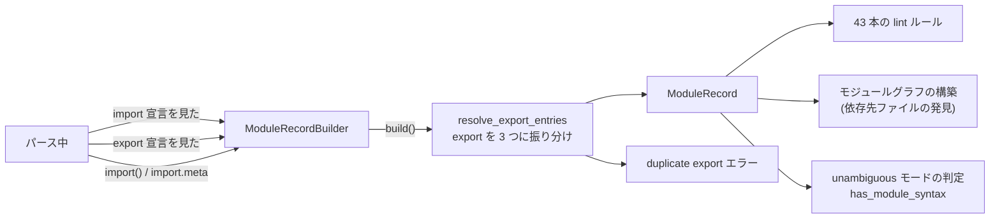

## 何を学んだか

パーサは AST を作るだけではない。**`import` と `export` の情報を、パースしながら別のデータ構造に集める。**

```rust title="crates/oxc_parser/src/lib.rs"
pub struct ParserReturn<'a> {
    /// The parsed AST.
    pub program: Program<'a>,

    /// See <https://tc39.es/ecma262/#sec-abstract-module-records>
    pub module_record: ModuleRecord<'a>,
    // ...
}
```

集める内容は ECMAScript 仕様の **Source Text Module Record** に揃えてある。

```rust title="crates/oxc_syntax/src/module_record.rs"
/// ESM Module Record
///
/// All data inside this data structure are for ESM, no commonjs data is allowed.
///
/// See
/// * <https://tc39.es/ecma262/#table-additional-fields-of-source-text-module-records>
/// * <https://tc39.es/ecma262/#cyclic-module-record>
#[derive(Debug)]
pub struct ModuleRecord<'a> {
    /// This module has ESM syntax: `import` and `export`.
    pub has_module_syntax: bool,

    /// `[[RequestedModules]]`
    pub requested_modules: ArenaHashMap<'a, Str<'a>, ArenaVec<'a, RequestedModule>>,

    /// `[[ImportEntries]]`
    pub import_entries: ArenaVec<'a, ImportEntry<'a>>,

    /// `[[LocalExportEntries]]`
    pub local_export_entries: ArenaVec<'a, ExportEntry<'a>>,

    /// `[[IndirectExportEntries]]`
    pub indirect_export_entries: ArenaVec<'a, ExportEntry<'a>>,

    /// `[[StarExportEntries]]`
    pub star_export_entries: ArenaVec<'a, ExportEntry<'a>>,

    /// Local exported bindings
    pub exported_bindings: ArenaHashMap<'a, Str<'a>, Span>,

    /// Dynamic import expressions `import(specifier)`.
    pub dynamic_imports: ArenaVec<'a, DynamicImport>,

    /// Span position of `import.meta`.
    pub import_metas: ArenaVec<'a, Span>,
}
```

**`[[RequestedModules]]` のような仕様上の内部スロット名が、doc コメントにそのまま書かれている。** フィールド名も対応している。

利用者は多い。**43 本の lint ルールが `ctx.module_record()` を呼ぶ。**

## なぜそうなっているか

### なぜパース中に集めるのか

「後から AST を走査して集める」でも同じ情報は得られる。しかし、

- **利用者が 43 本ある。** それぞれが走査すると 43 回木を歩く
- **走査は 1 回でも安くない。** `import` 宣言はトップレベルにしかないが、`import()` (動的インポート) と `import.meta` は式の中のどこにでも出る
- **パーサは既にそこにいる。** `import` 宣言をパースした直後なら、情報は手元にある

**「通りがかりに集める」ほうが、後から探しに行くより安い。** [SemanticBuilder が数えるパスを足した](./semantic-builder/)のとは逆向きの判断に見えるが、どちらも「全体のパス数を減らす」という同じ目的になる。

もう 1 つ、**パーサ自身が使う**という理由もある。`sourceType: unambiguous` では「ESM 構文があるか」でモジュールかスクリプトかが決まる ([Context フラグ](./context-flags/))。

```rust title="crates/oxc_parser/src/module_record.rs"
    /// Returns true if the file contains module syntax (import/export declarations or import.meta).
    pub fn has_module_syntax(&self) -> bool {
        self.module_record.has_module_syntax
    }
```

`has_module_syntax` が、[延期していたエラーの採否](./error-recovery/)と [top-level await の読み直し](./context-flags/)を決める。**module_record がなければ、unambiguous モードが実装できない。**

### export の解決は最後にまとめて

```rust title="crates/oxc_parser/src/module_record.rs"
    pub fn build(mut self) -> (ModuleRecord<'a>, Vec<OxcDiagnostic>) {
        // The `ParseModule` algorithm requires `importedBoundNames` (import entries) to be
        // resolved before resolving export entries.
        self.resolve_export_entries();
        let errors = self.errors();
        (self.module_record, errors)
    }
```

**仕様の `ParseModule` アルゴリズムが「import を先に解決してから export」と定めている。** 理由は `export { x } from "m"` のような再エクスポートで、`x` がローカルの束縛なのか import されたものなのかで分類先が変わるからだ。

- `local_export_entries` — このモジュール内の宣言
- `indirect_export_entries` — 再エクスポート (import されたものの再公開を含む)
- `star_export_entries` — `export *`

**パース中は暫定的に `export_entries` に積み、最後に 3 つに振り分ける。** [`cover_initialized_name`](./expression-precedence/) と同じ「判断を後回しにする」形になっている。

```rust title="crates/oxc_parser/src/module_record.rs"
pub struct ModuleRecordBuilder<'a> {
    allocator: &'a Allocator,
    source_type: SourceType,
    module_record: ModuleRecord<'a>,
    export_entries: ArenaVec<'a, ExportEntry<'a>>,
    exported_bindings_duplicated: ArenaVec<'a, NameSpan<'a>>,
}
```

`export_entries` と `exported_bindings_duplicated` が builder にだけあり、**完成品の `ModuleRecord` には残らない。** 中間状態と最終形が型で分かれている。

### エラーもここで出る

```rust title="crates/oxc_parser/src/module_record.rs"
    pub fn errors(&self) -> Vec<OxcDiagnostic> {
        let mut errors = vec![];

        let module_record = &self.module_record;

        // Skip checking for exports in TypeScript
        if !self.source_type.is_typescript() {
            // It is a Syntax Error if the ExportedNames of ModuleItemList contains any duplicate entries.
            for name_span in &self.exported_bindings_duplicated {
                let old_span = module_record.exported_bindings[&name_span.name];
                errors.push(diagnostics::duplicate_export(
                    &name_span.name,
                    name_span.span,
                    old_span,
                ));
            }

            // Multiple default exports
            // `export default foo`
            // `export { default }`
            let default_exports = module_record
                .local_export_entries
                .iter()
                .filter_map(|export_entry| export_entry.export_name.default_export_span())
                .chain(
                    module_record
                        .indirect_export_entries
                        .iter()
                        .filter_map(|export_entry| export_entry.export_name.default_export_span()),
                );
            if default_exports.clone().count() > 1 {
                errors.push(diagnostics::duplicate_default_export(default_exports.collect()));
            }
        }

        errors
    }
```

「同じ名前を 2 回 export した」「default export が 2 つある」。**これも [early error](./early-errors/) の一種**だが、semantic ではなくパーサ側で検出される。module_record がその情報を既に持っているからだ。

`if !self.source_type.is_typescript()` で TypeScript を除外しているのは、TS では宣言のマージがあるため。`export interface Foo {}` と `export function Foo() {}` は共存できる。

`default_exports.clone()` で 2 回イテレートしているのが目を引く。`count()` がイテレータを消費するので、数えるためのクローンと集めるための本体で 2 回要る。**イテレータの `clone()` は要素をコピーしない**ので、この使い方は安い。

### 誰が使っているか

**lint ルールが 43 本。** 内訳を見ると使われ方が分かる。

| ルール群                  | 使い方                                              |
| ------------------------- | --------------------------------------------------- |
| `import/no-cycle`         | `requested_modules` からモジュールグラフを辿る      |
| `import/named`            | 別ファイルの `exported_bindings` を引く             |
| `import/no-duplicates`    | `requested_modules` のキーごとに複数の宣言がないか  |
| `import/max-dependencies` | `requested_modules` の数                            |
| `eslint/no-unused-vars`   | `exported_bindings` で「export されているか」を見る |
| `oxc/no-barrel-file`      | 再エクスポートだけのファイルを検出                  |

[`no-unused-vars`](./reading-no-unused-vars/) の使い方が典型になる。

```rust title="crates/oxc_linter/src/rules/eslint/no_unused_vars/mod.rs"
        let precomputed_exported_names = Symbol::collect_exported_local_names(ctx.module_record());
```

**export されている変数は「使われていない」と報告してはいけない。** その判定に module_record が要る。

`requested_modules` の型が `ArenaHashMap<Str, ArenaVec<RequestedModule>>` になっているのは、**同じモジュールを複数回 import できる**からだ。

```js
import { a } from "m";
import { b } from "m";
```

`import/no-duplicates` がこれを見る。値が `Vec` なので、「重複しているか」も「どこで重複しているか」も分かる。

### モジュールグラフの起点になる

[並列 lint](./parallel-lint/) のモジュールグラフ構築も、ここから始まる。

```rust title="crates/oxc_linter/src/service/runtime.rs"
                for record_result in &processed_module.section_module_records {
                    let Ok(record) = record_result.as_ref() else {
                        continue;
                    };
                    for request in &record.resolved_module_requests {
                        let dep_path = &request.resolved_requested_path;
                        if encountered_paths.insert(Arc::clone(dep_path)) {
                            scope.spawn({
                                // ... 依存先のファイルを処理するタスクを spawn
```

**「このファイルが import しているファイル」を module_record から取り出し、それを次に処理するファイルとして積む。** グラフの構築が module_record の走査 1 回で済む。



### 通し例で見る

```ts title="example.ts"
import { readFile } from "node:fs/promises";

export type Entry = { name: string; size: number };

export async function collect(path: string): Promise<Entry[]> {
```

module_record はこうなる。

| フィールド                | 内容                                                           |
| ------------------------- | -------------------------------------------------------------- |
| `has_module_syntax`       | `true`                                                         |
| `requested_modules`       | `{ "node:fs/promises": [RequestedModule { span, ... }] }`      |
| `import_entries`          | `readFile` (import name = `readFile`, local name = `readFile`) |
| `local_export_entries`    | `Entry`、`collect`                                             |
| `indirect_export_entries` | 空                                                             |
| `star_export_entries`     | 空                                                             |
| `exported_bindings`       | `{ "Entry": span, "collect": span }`                           |
| `dynamic_imports`         | 空                                                             |
| `import_metas`            | 空                                                             |

`no-unused-vars` が `collect` を報告しないのは、`exported_bindings` に `collect` があるからだ。

## ソースコードのどこか

- [`crates/oxc_syntax/src/module_record.rs`](https://github.com/oxc-project/oxc/blob/apps_v1.81.0/crates/oxc_syntax/src/module_record.rs) — `ModuleRecord` の型定義 (18KB)
- [`crates/oxc_parser/src/module_record.rs`](https://github.com/oxc-project/oxc/blob/apps_v1.81.0/crates/oxc_parser/src/module_record.rs) — `ModuleRecordBuilder` (32KB)
- [`crates/oxc_linter/src/module_record.rs`](https://github.com/oxc-project/oxc/blob/apps_v1.81.0/crates/oxc_linter/src/) — linter 側のラッパ (解決済みパスを足す)
- [`crates/oxc_linter/src/rules/import/`](https://github.com/oxc-project/oxc/blob/apps_v1.81.0/crates/oxc_linter/src/rules/import/) — 主な利用者

linter 側には別の `ModuleRecord` があり、パーサの `ModuleRecord` に「解決済みのファイルパス」を足したものになっている。**パーサはモジュール解決 (どのファイルを指すか) をしない** — 指定子の文字列だけを持ち、それをファイルパスに解決するのは linter の仕事になる。

crate の分け方がこの境界を表している。`oxc_syntax` に型があり、`oxc_parser` が作り、`oxc_linter` が解決情報を足す。**パーサは 1 ファイルしか知らない**という制約が保たれている。

**なお transformer は module_record を使わない。** import/export の変換 (ESM → CommonJS など) は AST を直接見る。「パース中に集めた情報」が全ての下流で使われるわけではない。

## どう活かすか

**「通りがかりに集められる情報」は、後から探すより安い。** 利用者が複数いて、それぞれが全体を走査することになるなら、生成側で 1 回集めておく。判断の目安は「利用者の数」と「後から探すコスト」で、oxc の場合は 43 本のルールと「式の中のどこにでも現れる `import()`」がその根拠になる。

**ただし、集める側にコストが乗ることを忘れない。** `import` を使わないファイルでも `ModuleRecordBuilder` は存在する。空の `ArenaHashMap` と `ArenaVec` の初期化コストがかかる (アリーナ上なので安いが、ゼロではない)。**「ほぼ全てのファイルが使う」という前提が要る。**

**仕様に対応する構造があるなら、名前まで揃える。** `[[RequestedModules]]` `[[ImportEntries]]` `[[LocalExportEntries]]`。仕様を読みながらコードを追えるし、仕様の変更を追跡できる。**独自の名前を付けると、対応表がどこにも書かれない。**

**中間状態と最終形を型で分ける。** `ModuleRecordBuilder` の `export_entries` は「まだ振り分けていない export」で、`build()` で 3 つに分けられて消える。**中間状態が完成品に残っていると、利用者が「どっちを見ればいいのか」で迷う。**

**判断に順序があるなら、doc に理由を書く。** 「import を先に解決してから export」は仕様の要求で、コメントにそう書いてある。書いていないと、「並列化できるのでは」と誰かが思って壊す。

**レイヤの責務を crate の境界にする。** パーサの `ModuleRecord` は指定子の文字列しか持たず、ファイルパスへの解決は linter がやる。**パーサが 1 ファイルしか知らない**という不変条件が、crate の分割によって保たれている。
