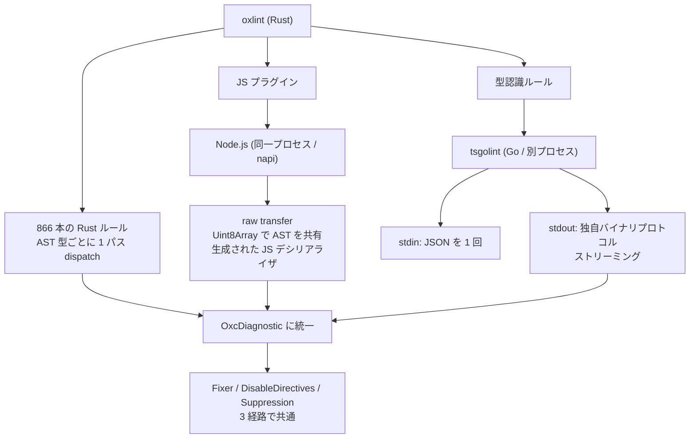

## 何を学んだか

oxlint は Rust で書かれているが、2 つの機能が Rust の外にある。

**1. JS プラグイン。** ESLint 用に書かれた JS のルールを動かす。`oxlint-plugin-eslint` という npm パッケージが公開されていて、ESLint 本体の組み込みルールをそのまま使える。

```json title="oxlintrc.json"
{
  "jsPlugins": [{ "name": "eslint-js", "specifier": "oxlint-plugin-eslint" }],
  "rules": {
    "eslint-js/no-restricted-syntax": ["error", { ... }]
  }
}
```

**2. 型情報を要するルール。** `@typescript-eslint` の型認識ルール (`no-floating-promises` など) は TypeScript の型検査が要る。oxc の型検査器はまだ足場なので、**Go 製の `tsgolint` という外部実行ファイルをプロセス起動する。**

どちらも「Rust で書き直す」という選択をしなかった結果で、その代わりに**言語境界を越えるための仕掛け**が必要になっている。

## なぜそうなっているか

### JS プラグイン — AST を JSON にせずに渡す

JS のルールを動かすには、JS 側に AST が要る。素直にやるなら [ESTree JSON にシリアライズ](./estree-serialization/)して `JSON.parse` するが、それでは Rust で書いた意味が薄れる。

そこで raw transfer を使う。

1. Rust が [4GiB 境界に揃った 2GiB のアリーナ](./allocator-reuse/)に AST を書く
2. そのメモリを `Uint8Array` として JS に渡す
3. **ast_tools が生成した JS のデシリアライザが、ポインタを辿って必要なノードだけを読む**

生成される JS の量が示唆的になる。

| 生成物                                        | サイズ |
| --------------------------------------------- | ------ |
| `apps/oxlint/src-js/generated/deserialize.js` | 198KB  |
| `apps/oxlint/src-js/generated/walk.js`        | 84KB   |
| `apps/oxlint/src-js/generated/types.d.ts`     | 43KB   |
| `apps/oxlint/src-js/generated/visitor.d.ts`   | 24KB   |
| `apps/oxlint/src-js/generated/envs.ts`        | 68KB   |

デシリアライザと walker だけで 28 万バイト以上。**全部 [ast_tools](./ast-tools/) の生成物**で、Rust の AST 定義に付いた `raw_deser` 属性から作られる。

`deserialize.js` は**遅延デシリアライズ**になっている。ノードのプロパティに getter を仕込み、アクセスされたときに初めてバッファから読む。ルールが `BinaryExpression` しか見ないなら、他のノードは 1 バイトも読まれない。

### JS 側との API はコールバックの束

Rust 側は JS を直接呼ばない。napi 経由で登録されたコールバックを持つだけになる。

```rust title="crates/oxc_linter/src/external_linter.rs"
pub type ExternalLinterLoadPluginCb = Arc<
    Box<
        dyn Fn(
                // File URL to load plugin from
                String,
                // Plugin name (either alias or package name).
                // If is package name, it is pre-normalized.
                Option<String>,
                // `true` if plugin name is an alias (takes priority over name that plugin defines itself)
                bool,
                // Workspace URI (e.g. `file:///path/to/workspace`).
                // `None` in CLI mode (single workspace), `Some` in LSP mode.
                Option<String>,
            ) -> Result<LoadPluginResult, String>
            + Send
            + Sync,
    >,
>;
```

```rust title="crates/oxc_linter/src/external_linter.rs"
pub type ExternalLinterLintFileCb = Arc<
    Box<
        dyn Fn(
                // File path of file to lint
                String,
                // Rule IDs
                Vec<u32>,
                // Options IDs
                Vec<u32>,
                // Settings JSON
                String,
                // Globals JSON
                String,
                // Workspace URI
                Option<String>,
                // Allocator
                &Allocator,
            ) -> Result<Vec<LintFileResult>, String>
            + Sync
            + Send,
    >,
>;
```

**引数に名前がないので、コメントで 1 つずつ説明している。** `dyn Fn` の型エイリアスは可読性が最悪になりがちで、この書き方は現実的な対処になる。

ルールもオプションも `u32` の ID で渡される。**文字列を毎回渡さない。** JS 側は ID → ルールのテーブルを持っていて、Rust 側は ID だけ知っている。ID の対応は `external_plugin_store.rs` が管理する。

最後の引数が `&Allocator` なのが raw transfer の入口になる。**JS 側に渡すのは「このアロケータの中に AST がある」という情報だけ**で、JS はそのバッファをオフセットで読む。

`Send + Sync` が付いているのは、[並列 lint](./parallel-lint/) の複数スレッドから呼ばれるからだ。JS 側 (Node.js) はシングルスレッドなので、napi の側で調停される。

### tsgolint — プロセスを起動する

型情報を要するルールのほうは、もっと割り切っている。

```rust title="crates/oxc_linter/src/tsgolint.rs"
/// State required to initialize the `tsgolint` linter.
#[derive(Debug, Clone)]
pub struct TsGoLintState {
    /// The path to the `tsgolint` executable (at least our best guess at it).
    executable_path: PathBuf,
    /// Current working directory, used for rendering paths in diagnostics.
    cwd: PathBuf,
    /// The configuration store for `tsgolint` (used to resolve configurations outside of `oxc_linter`)
    config_store: ConfigStore,
    /// If `oxlint` will output the diagnostics or not.
    /// When `silent` is true, we do not need to access the file system for nice diagnostics messages.
    silent: bool,
    /// If `true`, request that fixes be returned from `tsgolint`.
    fix: bool,
    /// If `true`, request that suggestions be returned from `tsgolint`.
    fix_suggestions: bool,
    /// If `true`, include TypeScript compiler syntactic and semantic diagnostics.
    type_check: bool,
    /// If `true`, request that per-rule debug timings be returned from `tsgolint`.
    timings: bool,
    /// If `true`, the linter will create "ignore this section / line" fixes for all diagnostics
    with_ignore_fixes: bool,
}
```

`"(at least our best guess at it)"` という注記が正直で、実行ファイルの場所は探索して見つける。見つからなければ `PathBuf::from("tsgolint")` にフォールバックして `PATH` に任せる。

```rust title="crates/oxc_linter/src/tsgolint.rs"
        let executable_path =
            try_find_tsgolint_executable(cwd).unwrap_or(PathBuf::from("tsgolint"));
```

やり取りは stdin/stdout になる。

```rust title="crates/oxc_linter/src/tsgolint.rs"
    fn spawn_tsgolint(&self, json_input: &Payload) -> Result<std::process::Child, String> {
        // ...
            .stdin(std::process::Stdio::piped())
            .stdout(std::process::Stdio::piped())
```

```rust title="crates/oxc_linter/src/tsgolint.rs"
        let mut stdin = child.stdin.take().expect("Failed to open tsgolint stdin");
        // ...
        if let Err(e) = stdin.write_all(json.as_bytes())
        // ...
        drop(stdin);
```

**入力は JSON を 1 回書いて stdin を閉じる。** 対象ファイルのリストとルール設定を送る。設定は [`Rule::to_configuration`](./rule-trait/) が JSON に戻したものだ — **設定のパースとバリデーションは oxlint 側でやり、tsgolint には正規化済みのものだけ渡す。**

出力側は独自のバイナリプロトコルになっている。

```rust title="crates/oxc_linter/src/tsgolint.rs"
impl TryFrom<u8> for MessageType {
    type Error = InvalidMessageType;

    fn try_from(value: u8) -> Result<Self, InvalidMessageType> {
        match value {
            0 => Ok(Self::Error),
            1 => Ok(Self::Diagnostic),
            2 => Ok(Self::Timing),
            _ => Err(InvalidMessageType(value)),
        }
    }
}
```

メッセージ種別 1 バイト + 長さ + 本体、という形。**入力は JSON 1 回、出力はストリーミング**という非対称になっている。

理由は使い勝手にある。数千ファイルの型検査は時間がかかるので、全部終わってから結果を返すと体感が悪い。

```rust title="crates/oxc_linter/src/tsgolint.rs"
            // Process stdout stream in a separate thread to send diagnostics as they arrive
            let stdout_handler = std::thread::spawn(move || -> Result<TsGoLintOutput, String> {
```

**診断が来たそばから[診断チャネル](./diagnostics/)に流す。**

ストリームのパーサは、バッファに溜めて 1 メッセージずつ切り出す形になっている。

```rust title="crates/oxc_linter/src/tsgolint.rs"
/// Iterator that streams messages from tsgolint stdout.
struct TsGoLintMessageStream {
    stdout: std::process::ChildStdout,
    buffer: Vec<u8>,
}

impl Iterator for TsGoLintMessageStream {
    type Item = Result<TsGoLintMessage, String>;

    fn next(&mut self) -> Option<Self::Item> {
        let mut read_buf = [0u8; 8192];

        loop {
            // Try to parse a complete message from the existing buffer
            let mut cursor = std::io::Cursor::new(self.buffer.as_slice());

            if cursor.position() < self.buffer.len() as u64 {
                match parse_single_message(&mut cursor) {
                    Ok(message) => {
                        // Successfully parsed a message, remove it from buffer
                        self.buffer.drain(..cursor.position() as usize);
                        return Some(Ok(message));
                    }
                    Err(TsGoLintMessageParseError::IncompleteData) => {}
                    Err(e) => {
                        return Some(Err(e.to_string()));
                    }
                }
            }

            // Read more data from stdout
            match self.stdout.read(&mut read_buf) {
                Ok(0) => {
                    return None;
                }
                Ok(n) => {
                    self.buffer.extend_from_slice(&read_buf[..n]);
                }
                // ...
            }
        }
    }
}
```

**`IncompleteData` だけは「エラーではなく、もっと読む」に落ちる。** ストリーミングパーサの典型的な形で、`Iterator` として表現されているので利用側は `for msg in stream` と書ける。

### 2 つの経路の比較



|                | JS プラグイン             | tsgolint                       |
| -------------- | ------------------------- | ------------------------------ |
| 実行場所       | 同一プロセス (napi)       | 別プロセス                     |
| データの渡し方 | 共有メモリ (raw transfer) | stdin の JSON                  |
| 結果の受け取り | コールバックの戻り値      | stdout のバイナリストリーム    |
| 設定のパース   | oxlint 側                 | oxlint 側 (`to_configuration`) |
| 起動コスト     | Node.js のロード          | 実行ファイルの spawn           |

**どちらも設定のパースは oxlint 側でやる。** 外部に渡すのは検証済みのデータだけで、エラーメッセージの品質を oxlint 側で保てる。

そして**診断は [`OxcDiagnostic`](./diagnostics/) に統一される。** [fix の適用](./auto-fix/)も[disable ディレクティブ](./disable-and-suppress/)も[抑制ファイル](./disable-and-suppress/)も、3 経路の診断に等しく効く。実際、`Fixer::new(...).fix()` の呼び出し 3 か所は、通常の lint と JS プラグインと tsgolint に対応している。

## ソースコードのどこか

- [`crates/oxc_linter/src/external_linter.rs`](https://github.com/oxc-project/oxc/blob/apps_v1.81.0/crates/oxc_linter/src/external_linter.rs) — JS 側コールバックの型定義
- [`crates/oxc_linter/src/external_plugin_store.rs`](https://github.com/oxc-project/oxc/blob/apps_v1.81.0/crates/oxc_linter/src/external_plugin_store.rs) — ルール ID の管理
- [`crates/oxc_linter/src/tsgolint.rs`](https://github.com/oxc-project/oxc/blob/apps_v1.81.0/crates/oxc_linter/src/tsgolint.rs) — tsgolint 連携 (66KB)
- [`apps/oxlint/src-js/plugins/`](https://github.com/oxc-project/oxc/blob/apps_v1.81.0/apps/oxlint/src-js/) — JS 側のプラグイン実行基盤
- [`apps/oxlint/src-js/generated/`](https://github.com/oxc-project/oxc/blob/apps_v1.81.0/apps/oxlint/src-js/) — 生成されたデシリアライザと walker
- [`npm/oxlint-plugin-eslint/`](https://github.com/oxc-project/oxc/blob/apps_v1.81.0/npm/oxlint-plugin-eslint/) — ESLint 組み込みルールのパッケージ

`oxlint-plugin-eslint` は生成されるパッケージで、生成スクリプトが `apps/oxlint/scripts/generate-plugin-eslint.ts` にある。

```markdown title="npm/oxlint-plugin-eslint/README.md"
This package exports all of ESLint's built-in rules as a JS plugin that Oxlint users can use.

Allows using ESLint rules that Oxlint doesn't implement natively yet.
```

```markdown title="npm/oxlint-plugin-eslint/README.md"
All rules are prefixed with `eslint-js/`, to distinguish from Oxlint's Rust implementation of ESLint rules.
```

接頭辞で Rust 実装と区別する。**同じ `no-unused-vars` が `eslint/no-unused-vars` (Rust) と `eslint-js/no-unused-vars` (JS) の 2 つ存在しうる。** 移行期の設計としては素直で、Rust 実装が揃うにつれて JS 側を外していける。

ルールの側にも `(tsgolint)` マーカーがある。

```rust title="crates/oxc_macros/src/declare_oxc_lint.rs"
        // Optional marker `(tsgolint)` directly after the rule struct name
```

[`declare_oxc_lint!`](./rule-trait/) にこのマーカーを付けると、そのルールは Rust 側では走らず tsgolint に委譲される。**ルールの一覧・設定スキーマ・ドキュメントは Rust 側にあり、実行だけが外にある**という形になる。

## どう活かすか

**「全部書き直す」を後回しにする道は設計できる。** ESLint の全ルールを Rust で書き直すのも、TypeScript の型検査器を Rust で書くのも、何年もかかる。oxc は「速くしたい部分だけ Rust にして、残りは外部に委譲する」を選んだ。**移行期を設計に織り込む**という判断で、コストは境界のコードになる。

**外部に渡す前に、自分の側でパースとバリデーションをする。** 設定のエラーメッセージは、外部プロセスに任せると品質がばらつく。oxlint は設定を全部自分でパースし、正規化済みの JSON を tsgolint に渡す。`Rule::to_configuration` はそのためだけにある。

**結果は自分の型に統一する。** Rust ルール・JS プラグイン・tsgolint の 3 経路から来る診断が全部 `OxcDiagnostic` になるので、fix も disable も suppression も 1 セットで済む。**境界の変換は入口と出口の 2 か所に閉じ込める。**

**入力と出力でプロトコルを揃える必要はない。** oxlint → tsgolint は JSON 1 回、tsgolint → oxlint は独自バイナリのストリーム。それぞれの要件 (入力は一括で構わない、出力はストリーミングしたい) が違うので、揃えないほうが正しい。

**ストリーミングパーサは `Iterator` にする。** 「バッファに溜めて 1 メッセージ切り出す」を `Iterator::next` に閉じ込めると、利用側は `for msg in stream` と書ける。`IncompleteData` をエラーではなく「もっと読む」に落とすのが要点になる。

**`dyn Fn` の型エイリアスは、引数にコメントを付ける。** 名前のない引数が 7 個並ぶ型は、コメントがないと読めない。型エイリアスを定義した場所で 1 度説明しておけば、呼び出し側は追える。
