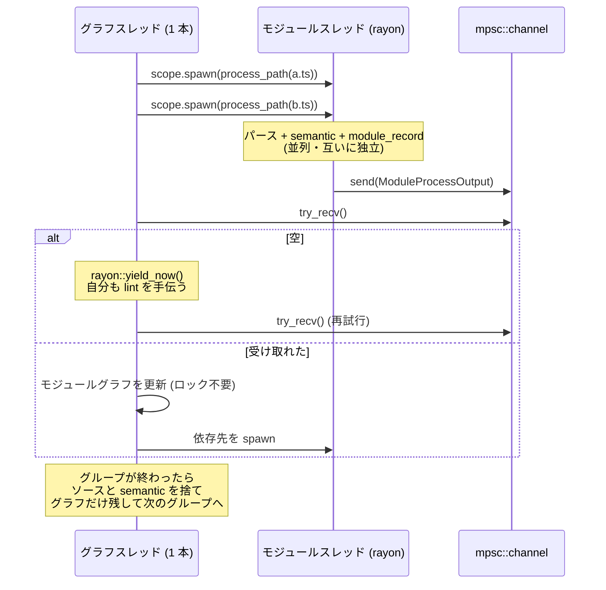

## 何を学んだか

`oxlint src/` で数千ファイルを lint するとき、並列化の難しさは 2 段ある。

**簡単なほう**: ファイル単位の lint は完全に独立している。パースして semantic を作ってルールを走らせるだけなので、rayon に投げれば終わる。

**難しいほう**: `import/no-cycle` のような**複数ファイルを跨ぐルール**。import を解決してモジュールグラフを作る必要があり、これは共有状態になる。

oxlint の解き方はこうなる。

- **モジュールグラフを更新するスレッドを 1 本に固定する。** グラフにロックが要らない
- ファイルの処理 (パース + semantic + lint) は rayon の**モジュールスレッド**が並列にやる
- 両者は `mpsc::channel` で繋ぐ
- **グラフスレッドは暇なとき、`try_recv()` が空なら `rayon::yield_now()` して自分も仕事を取りに行く**
- ファイルを**グループ単位**で処理し、グループが終わったらソースと semantic を捨ててグラフだけ残す

## なぜそうなっているか

### スレッド数を最初に固定する

```rust title="crates/oxc_linter/src/service/runtime.rs"
        // If global thread pool wasn't already initialized, do it now.
        // This "locks" config for the thread pool, which ensures `rayon::current_num_threads()`
        // cannot change from now on.
        //
        // Initializing the thread pool without specifying `num_threads` produces a threadpool size
        // based on `std::thread::available_parallelism`. However, Rayon's docs state that:
        // > In the future, the default behavior may change to dynamically add or remove threads as needed.
        //
        // However, I (@overlookmotel) assume that would be considered a breaking change,
        // so we don't have to worry about it until Rayon v2.
        // When Rayon v2 is released and we upgrade to it, we'll need to revisit this and make sure
        // we still guarantee that thread count is locked.
        let _ = rayon::ThreadPoolBuilder::new().build_global();

        let thread_count = rayon::current_num_threads();
```

**スレッド数が固定であることに依存している設計**なので、まずそれを確定させる。理由は次の[アロケータプール](./allocator-reuse/)で、`thread_count` 個のアロケータを作れば足りるという前提が崩れると困る。

「rayon が将来スレッド数を動的に変えるようになるかもしれない」というドキュメントの記述に対して、**「破壊的変更だと思うので rayon v2 まで気にしなくていい」**と書き手の名前つきで判断が残っている。将来 rayon v2 に上げるときに読むべき場所が明示されている。

### アロケータプールの選択が 3 通り

```rust title="crates/oxc_linter/src/service/runtime.rs"
        // * If both JS plugins and import plugin enabled, use copy-to-fixed-allocator approach.
        //   This approach is to use standard allocators for parsing/linting (lower memory usage),
        //   and copy ASTs to a fixed-size allocator only when passing to JS plugins.
        //
        // * If JS plugins, but no import plugin, use fixed-size allocators for everything.
        //   Without import plugin, there's no danger of memory exhaustion, as no more than <thread count>
        //   ASTs are live at any given time.
        //
        // * If no JS plugins, use standard allocators for parsing/linting.
        let (allocator_pool, js_allocator_pool) = if linter.has_external_linter() {
            if options.cross_module {
                (
                    AllocatorPool::new(thread_count),
                    Some(AllocatorPool::new_fixed_size(thread_count)),
                )
            } else {
                (AllocatorPool::new_fixed_size(thread_count), None)
            }
        } else {
            (AllocatorPool::new(thread_count), None)
        };
```

[固定サイズアロケータのページ](./allocator-reuse/)で見た 3 シナリオが、そのままここで分岐している。`cross_module` (import 系ルール) が有効だと多数の AST を同時に保持するので、高価な固定サイズアロケータは JS プラグインに渡す直前だけ使う。

### 2 種類のスレッド

```rust title="crates/oxc_linter/src/service/runtime.rs"
        // There are two sets of threads: threads for the graph and threads for the modules.
        // - The graph thread is the one thread that calls `resolve_modules`. It's the only thread that
        //   updates the module graph, so no need for locks.
        // - Module threads accept paths and produces `ModuleProcessOutput` (the logic is in
        //   `self.process_path`). They are isolated to each other and paralleled in the rayon thread pool.

        // This channel is for posting `ModuleProcessOutput` from module threads to the graph thread.
        let (tx_process_output, rx_process_output) = mpsc::channel::<ModuleProcessOutput>();
```

**「グラフを更新するのが 1 本だけなのでロックが要らない」** が設計の中心になる。

共有ロックを避ける方法は 2 つある。「ロックフリーのデータ構造を使う」か「触るスレッドを 1 本にする」か。後者のほうが単純で、しかもグラフの更新は本質的に逐次的 (依存関係を辿って足していく) なので、並列化しても得がない。



### 暇なグラフスレッドは仕事を手伝う

```rust title="crates/oxc_linter/src/service/runtime.rs"
            while pending_module_count > 0 {
                let Ok(ModuleProcessOutput { path, mut processed_module }) =
                    // Most heavy-lifting is done in the module threads. The graph thread would be
                    // mostly idle if it only updates the graph and blocks on awaiting
                    // `rx_process_output`. To avoid this waste, the graph module peeks the
                    // `rx_process_output` without blocking, and ...
                    rx_process_output.try_recv()
                else {
                    // yield if `rx_process_output` is empty, giving rayon chances to dispatch
                    // module processing or linting to this thread.
                    rayon::yield_now();
                    continue;
                };
```

**グラフの更新はグラフスレッドの仕事のごく一部で、大半の時間は待ちになる。** `recv()` でブロックすると、そのコアが遊ぶ。

`try_recv()` + `rayon::yield_now()` にすると、空のときに rayon のワークスティーリングに参加して、パースや lint のタスクを 1 つこなしてから戻ってくる。**専用スレッドを持ちつつ、遊ばせない。**

これはビジーループなので、CPU を無駄に回すリスクがある。ただし `yield_now()` が実際に仕事を取るなら無駄ではないし、取る仕事がないなら pending も残っていない (ループを抜ける) 。

### グループ処理でメモリを抑える

```rust title="crates/oxc_linter/src/service/runtime.rs"
        // The general idea is processing `sorted_paths` and their dependencies in groups. We start
        // from a group of modules in `sorted_paths` that is small enough to hold in memory but big
        // enough to make use of the rayon thread pool. We build the module graph from one group,
        // run lint on them, drop sources and semantics but keep the module graph, and then move on
        // to the next group.
        // This size is empirical based on AFFiNE@97cc814a.
        let group_size = rayon::current_num_threads() * 4;
```

全ファイルの AST を同時に保持するとメモリが足りない。かといって 1 ファイルずつだと rayon が遊ぶ。

**「スレッド数 × 4」という数字は、AFFiNE という実際のプロジェクトで測って決めた**と書いてある。コミットハッシュまで付いているので、後から再測定できる。

グループが終わったら AST と semantic を捨て、**モジュールグラフだけ残す**。グラフは `import/no-cycle` の判定に要るが、AST は要らない。

### 処理順のヒューリスティック

```rust title="crates/oxc_linter/src/service/runtime.rs"
        // Sort by path length descending - longer paths tend to be deeper in the directory tree.
        // This achieves the "deeper paths first" heuristic described above in O(1) per comparison.
        sorted_paths.par_sort_unstable_by(|a, b| b.len().cmp(&a.len()));
```

**「深いパスから処理する」**というヒューリスティックを、パス文字列の長さで近似している。深いファイルは葉に近く、依存先が少ない。先に処理しておけば、後から浅いファイルを処理するときにその依存が既にグラフに載っている確率が高い。

「ディレクトリの深さを数える」より「文字列長を比べる」ほうが O(1) で済む、という理由まで書いてある。**近似であることと、近似にした理由の両方が残っている。**

ソート自体も `par_sort_unstable_by` で並列になっている。

### 共有状態はロックフリーのハッシュマップ

```rust title="crates/oxc_linter/src/service/runtime.rs"
    papaya::HashMap<Arc<OsStr>, SmallVec<[Arc<ModuleRecord>; 1]>, BuildHasherDefault<FxHasher>>;
```

```rust title="crates/oxc_linter/src/service/runtime.rs"
            modules_by_path: papaya::HashMap::builder()
                .hasher(BuildHasherDefault::default())
                .resize_mode(papaya::ResizeMode::Blocking)
                .build(),
```

`papaya` はロックフリーの並行ハッシュマップ。**グラフ本体はスレッド 1 本だが、「パス → ModuleRecord」の引きはモジュールスレッドからも起きる**ので、こちらは並行アクセスに耐える必要がある。

値が `SmallVec<[Arc<ModuleRecord>; 1]>` なのは、1 ファイルに複数のスクリプトブロックがありうるから (Vue/Astro の SFC)。ほとんどは 1 個なので `SmallVec` でヒープを避ける。

一方で、[アロケータプール](./allocator-reuse/)と `disable_directives_map` は `Mutex` のままだ。

```rust title="crates/oxc_linter/src/service/runtime.rs"
            disable_directives_map: Arc::new(Mutex::new(FxHashMap::default())),
```

**アクセス頻度で使い分けている。** `modules_by_path` は依存解決のたびに引くのでロックフリー、`disable_directives_map` はファイルごとに 1 回書くだけなので `Mutex` で足りる。

### 診断の集約

診断は [`DiagnosticService` の mpsc](./diagnostics/) に流れる。ワーカーは `tx_error` を持っていて、そこに送るだけ。

```rust title="crates/oxc_linter/src/service/runtime.rs"
                                        tx_error.send(diagnostics).unwrap();
```

出力側は 1 本のスレッドで、順序を整えて表示する。**「多数のプロデューサ、1 つのコンシューマ」がこの設計の 2 か所目**になる (グラフスレッドと診断スレッド)。どちらも「共有したいものを 1 本のスレッドに閉じ込め、チャネルで渡す」という同じ形をしている。

## ソースコードのどこか

- [`crates/oxc_linter/src/service/runtime.rs`](https://github.com/oxc-project/oxc/blob/apps_v1.81.0/crates/oxc_linter/src/service/runtime.rs) — 並列実行の本体
- [`crates/oxc_linter/src/service/mod.rs`](https://github.com/oxc-project/oxc/blob/apps_v1.81.0/crates/oxc_linter/src/service/) — `LintService`
- [`crates/oxc_linter/src/lint_runner.rs`](https://github.com/oxc-project/oxc/blob/apps_v1.81.0/crates/oxc_linter/src/lint_runner.rs) — `LintRunner` と `DirectivesStore`
- [`crates/oxc_allocator/src/pool/`](https://github.com/oxc-project/oxc/blob/apps_v1.81.0/crates/oxc_allocator/src/pool/) — アロケータプール

`rayon::scope` が 4 か所で使われている。1 つがモジュール処理、残りは lint 実行や JS プラグイン呼び出しの並列化になる。`scope` を使うと**スコープを抜けるときに全タスクの完了が保証される**ので、`'static` でない参照 (`me: &Self`) をタスクに渡せる。

```rust title="crates/oxc_linter/src/service/runtime.rs"
        // Set self to immutable reference so it can be shared among spawned tasks.
        let me: &Self = self;
```

`lint_runner.rs` の `DirectivesStore` は名前から並列化の道具に見えるが、役割は違う。**Rust の linter と [tsgolint](./outside-rust/) の 2 エンジン間で [disable ディレクティブ](./disable-and-suppress/)を共有する**ためのもので、並列性とは別の話になる。

## どう活かすか

**共有状態は「ロックする」より「触るスレッドを 1 本にする」ほうが単純なことがある。** 特にその更新が本質的に逐次的なら、並列化しても得がない。1 本に閉じ込めて mpsc で渡せば、ロックの設計もデッドロックの心配も消える。

**専用スレッドが暇なら、ワークスティーリングに参加させる。** `recv()` でブロックするとコアが 1 つ遊ぶ。`try_recv()` + `yield_now()` で「待ちながら手伝う」ができる。ただしこれはワークスティーリング型のランタイム (rayon、tokio) がある前提で、素の `std::thread` では使えない。

**メモリと並列度のバランスはグループサイズで取る。** 全部同時だとメモリが足りず、1 件ずつだと並列度が出ない。「スレッド数 × N」は素直な出発点で、**N は実測で決める。** oxc は実プロジェクト名とコミットハッシュを残している。

**処理順のヒューリスティックは、安い近似でよい。** 「依存の葉から処理する」を厳密にやるには依存グラフが要るが、それはまだ作っていない。「パスが長い = 深い = 葉に近い」で十分効く。**近似であることをコメントに書けば、後から精度を上げる余地も残る。**

**共有データ構造は、アクセス頻度で `Mutex` とロックフリーを使い分ける。** 全部ロックフリーにする必要はない。ホットな 1 つだけ `papaya` にして、残りは `Mutex` のまま、という判断が実際に取られている。

**「将来のバージョンで壊れるかもしれない」依存には、名前つきで判断を残す。** rayon のスレッド数固定に依存している箇所に「rayon v2 で見直す」と書いてある。依存ライブラリの**現在の挙動**に依存するときは、それが仕様なのか実装詳細なのかを書いておく。
