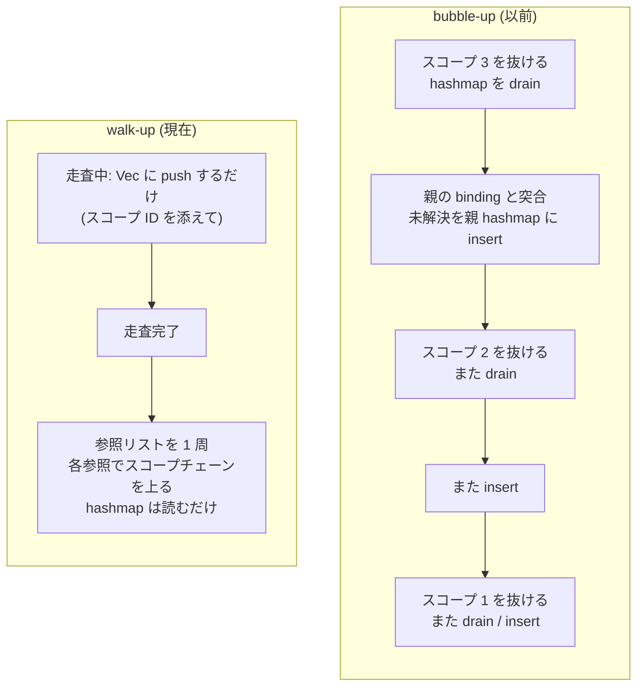

## 何を学んだか

参照 (`raw` や `readFile` のような識別子の使用) を宣言に繋ぐ方法は 2 つある。

**bubble-up**: スコープごとに「まだ解決していない参照」のハッシュマップを持ち、スコープを抜けるときに親のマップへマージする。マージのときに親の binding と突き合わせて、解決できるものは解決する。

**walk-up**: 走査中は解決を試みず、全部フラットなリストに積む。走査が終わってから、各参照について「自分のスコープから親へ」と辿る。

oxc は前者から後者に移った。理由が `unresolved_stack.rs` の doc に 3 行で書いてある。

```rust title="crates/oxc_semantic/src/unresolved_stack.rs"
/// Flat list of unresolved references collected during AST traversal.
///
/// Instead of maintaining per-scope hashmaps and merging them on scope exit (bubble-up),
/// references are collected flat and resolved in a single pass after traversal (walk-up).
/// This eliminates all hashmap drain+insert operations during scope exit.
```

**ファイル名が `unresolved_stack.rs` なのにスタックではない**点に注意がいる。中身はフラットな `Vec` で、名前は bubble-up 時代の名残になっている。

## なぜそうなっているか

### bubble-up が高くつく理由

bubble-up では、スコープを抜けるたびにこれが起きる。

1. 子スコープのハッシュマップを drain する
2. 各エントリについて、親スコープの binding を引く
3. 解決できなければ親のハッシュマップに insert する

**未解決の参照は、解決されるまでスコープの深さの分だけ drain と insert を繰り返す。** ネストが深いコードでは、1 つの参照が何度もハッシュマップを行き来する。

walk-up ではこうなる。

1. 走査中: `Vec::push` するだけ
2. 走査後: 各参照について、スコープチェーンを上りながら `get_binding` を引く

ハッシュマップへの書き込みが 1 回もない。読み出し (`get_binding`) だけになる。

```rust title="crates/oxc_semantic/src/builder.rs"
    /// Resolve all collected references by walking up the scope chain from each
    /// reference's scope. This replaces the old bubble-up approach where unresolved
    /// references were merged into parent scope hashmaps on every scope exit.
    ///
    /// Walk-up is faster because it only does hashmap lookups (no drain+insert),
    /// and reference creation is a simple Vec push instead of a hashmap insert.
    fn resolve_all_references(&mut self) {
```



### 積むもの

```rust title="crates/oxc_semantic/src/unresolved_stack.rs"
#[derive(Clone, Copy)]
pub struct UnresolvedReference<'a> {
    pub name: Ident<'a>,
    pub reference_id: ReferenceId,
    /// Scope where the next lookup should begin.
    pub lookup_scope_id: ScopeId,
}
```

3 フィールドで `Copy`。**「次にどのスコープから探し始めるか」を持っている**のがポイントで、これが後述の回避策で書き換えられる。

積むのは `declare_reference` の 3 行だけになる。

```rust title="crates/oxc_semantic/src/builder.rs"
    pub(crate) fn declare_reference(
        &mut self,
        name: Ident<'a>,
        reference: Reference,
    ) -> ReferenceId {
        let lookup_scope_id = reference.scope_id();
        let reference_id = self.scoping.create_reference(reference);
        self.unresolved_references.push(UnresolvedReference {
            name,
            reference_id,
            lookup_scope_id,
        });
        reference_id
    }
```

### 解決は「AST の再走査」ではない

ここを取り違えると設計を見誤る。**`resolve_all_references` は AST を歩かない。** 参照のリストを 1 周するだけだ。

```rust title="crates/oxc_semantic/src/builder.rs"
    fn resolve_all_references(&mut self) {
        let root_scope_id = self.scoping.root_scope_id();
        let refs = self.unresolved_references.take();
        for unresolved in refs {
            if !self.walk_up_resolve_reference(unresolved, root_scope_id) {
                self.scoping
                    .add_root_unresolved_reference(unresolved.name, unresolved.reference_id);
            }
        }
    }
```

`take()` は `mem::take` で、O(1) のポインタ交換になっている。

```rust title="crates/oxc_semantic/src/unresolved_stack.rs"
    /// Take all collected references, leaving the list empty. O(1) pointer swap.
    #[inline]
    pub(crate) fn take(&mut self) -> Vec<UnresolvedReference<'a>> {
        std::mem::take(&mut self.references)
    }
```

上る処理も短い。

```rust title="crates/oxc_semantic/src/builder.rs"
    /// Walk up the scope chain through `last_scope_id`.
    #[inline(always)]
    fn walk_up_resolve_reference(
        &mut self,
        unresolved: UnresolvedReference<'a>,
        last_scope_id: ScopeId,
    ) -> bool {
        let mut current_scope_id = Some(unresolved.lookup_scope_id);
        while let Some(scope_id) = current_scope_id {
            if let Some(symbol_id) = self.scoping.get_binding(scope_id, unresolved.name)
                && self.try_resolve_reference(unresolved.reference_id, symbol_id)
            {
                return true;
            }
            if scope_id == last_scope_id {
                return false;
            }
            current_scope_id = self.scoping.scope_parent_id(scope_id);
        }
        false
    }
```

`scope_parent_id` を辿るだけなので、[SoA の `parent_ids` 配列](./data-oriented-scoping/)を線形に読む形になる。`#[inline(always)]` の理由も書いてある — 「Hot path — called for every reference resolution」。

最後まで見つからなかった参照は `root_unresolved_references` に入る。これがグローバル変数 (`console`、`window`) や未定義変数の一覧になり、`no-undef` 系のルールが使う。

### 仮引数と本体が同じスコープを共有する問題

walk-up には、走査順に依存した落とし穴が 1 つある。

```ts
function f(a = b) {
  var b = 1;
}
```

ECMAScript の仕様では、仮引数のデフォルト値の中の `b` は**関数本体の `var b` を見てはいけない**。しかし oxc は仮引数と本体を同じスコープに置いているので、走査後に上ると `b` が同じスコープに見つかってしまう。

TypeScript ではもっと露骨になる。

```rust title="crates/oxc_semantic/src/builder.rs"
        // `function foo<SomeType>(v: SomeType): SomeType { return v; }`
        //                            ^^^^^^^^   ^^^^^^^^
        // `function foo<T extends SomeType>(this: SomeType) {}`
        //                         ^^^^^^^^        ^^^^^^^^
        // Parameter initializers must be resolved after all parameters have been declared.
        // Param types, return type, type parameter constraints and the `this` type must be
        // resolved after type parameters have been declared.
        // In all cases, need to avoid binding to variables/types declared inside the function body.
        self.resolve_references_for_current_scope(unresolved_start);
```

対策は「本体に入る前に、シグネチャ部分の参照だけ先に解決してしまう」。呼ばれるのは 3 か所だけになる。

- `visit_function` — 関数宣言・関数式のシグネチャを見た後、本体に入る前
- `visit_arrow_function_expression` — 同上
- `FormalParameter` の走査 (catch 引数を含む)

回避策であることは doc に明記されている。

```rust title="crates/oxc_semantic/src/builder.rs"
    /// This is a workaround until function bodies have separate scopes:
    /// <https://github.com/oxc-project/backlog/issues/176>.
    ///
    /// Resolved references are removed. Unresolved references stay in the flat
    /// list for later resolution by `resolve_all_references` (which handles
    /// forward references to declarations not yet visited).
```

**「本体に別スコープを作れば要らなくなる」と分かっていて、issue へのリンクまで張ったうえで回避策を入れている。** スコープを 1 段増やすとスコープ数が増えてメモリと走査が重くなるので、そのトレードオフを取っていない、という判断になる。

実装は `retain_from` で「指定位置以降だけを対象に、解決できたものを取り除く」形になっている。

```rust title="crates/oxc_semantic/src/builder.rs"
        let mut unresolved_references = mem::take(&mut self.unresolved_references);
        unresolved_references.retain_from(unresolved_start, |unresolved| {
            // Parameter decorators are visited in an outer class scope. Leave those references
            // for final resolution because the current function is not on their scope chain.
            let lookup_scope_id = unresolved.lookup_scope_id;
            if lookup_scope_id != current_scope_id
                && !self.scoping.scope_is_descendant_of(lookup_scope_id, current_scope_id)
            {
                return true;
            }
            if self.walk_up_resolve_reference(*unresolved, current_scope_id) {
                return false;
            }
            // Skip this function body during final resolution. An enclosing parameter resolution
            // may still resolve the reference before advancing the boundary again.
            unresolved.lookup_scope_id = parent_scope_id;
            true
        });
```

解決できなかったものは `lookup_scope_id` を**親スコープに進めて**残す。こうすると最終解決のときに、この関数スコープをスキップして親から探し始める。`UnresolvedReference` が `lookup_scope_id` を持っている理由がこれになる。

`mem::take` してから閉じ込めているのは借用のためで、コメントに理由がある。

```rust title="crates/oxc_semantic/src/builder.rs"
        // Take the list out of `self` while resolving, so the closure can call `&mut self`
        // methods. Resolution never pushes new unresolved references, so nothing is lost.
```

### デコレータはさらに別の話

TypeScript のパラメータデコレータは、コンストラクタのスコープではなく**クラスのスコープ**で解決される。

````rust title="crates/oxc_semantic/src/builder.rs"
        // TypeScript resolves parameter decorators in the enclosing class scope,
        // not the constructor scope. Both `foo` references below therefore
        // resolve to the outer binding — the first decorator must not see its
        // own parameter, and the second must not see the first parameter:
        //
        // ```ts
        // constructor(
        //   @Inject(foo.KEY) private readonly foo: number,
        //   @Inject(foo.KEY) private readonly foo2: number,
        // ) {}
        // ```
        //
        // Mirrors the `Decorator` case in TypeScript's `resolveName`:
        // <https://github.com/microsoft/TypeScript/blob/.../src/compiler/utilities.ts#L11772-L11800>
````

対策は「デコレータを走査する間だけ `current_scope_id` をクラススコープに差し替える」。`declare_reference` が `current_scope_id` を参照に焼き込むので、それだけで解決の起点が変わる。**`lookup_scope_id` を参照ごとに持たせた設計が、こういう例外を安く扱えるようにしている。**

TypeScript 本体のどの関数に対応するかまでリンクされている。互換実装ではこの種のリンクが仕様書の代わりになる。

## ソースコードのどこか

- [`crates/oxc_semantic/src/unresolved_stack.rs`](https://github.com/oxc-project/oxc/blob/apps_v1.81.0/crates/oxc_semantic/src/unresolved_stack.rs) — `UnresolvedReferences` (66 行)
- [`crates/oxc_semantic/src/builder.rs`](https://github.com/oxc-project/oxc/blob/apps_v1.81.0/crates/oxc_semantic/src/builder.rs) — `declare_reference` / `resolve_all_references` / `walk_up_resolve_reference` / `resolve_references_for_current_scope`

型と値で解決規則が変わる部分は `try_resolve_reference` にある。

```rust title="crates/oxc_semantic/src/builder.rs"
        let can_resolve = if flags.is_namespace()
            && !flags.is_value_as_type()
            && !symbol_flags.can_be_referenced_as_namespace()
        {
            false
        } else {
            (flags.is_value() && symbol_flags.can_be_referenced_by_value())
                || (flags.is_type() && symbol_flags.can_be_referenced_by_type())
                || (flags.is_value_as_type() && symbol_flags.can_be_referenced_by_value_as_type())
        };
```

解決に成功した後、参照のフラグを絞り込む処理も入っている。`export { B }` は型と値の両方を指しうるので、解決先が値なら `Type` ビットを落とす。**「参照の種類」が解決の結果として確定する**という順序になっている。

## どう活かすか

**「その場でマージする」と「集めてから 1 周する」は、書き込みコストで選ぶ。** bubble-up は各段でハッシュマップの drain+insert が要る。walk-up は push と lookup だけ。**書き込みが読み出しより高いデータ構造 (ハッシュマップ) では、後者が勝ちやすい。** 逆に、途中で早く枝刈りしたい場合や、メモリを抑えたい場合は前者になる。

**「次にどこから探すか」を要素側に持たせると、例外を安く扱える。** `lookup_scope_id` が参照ごとにあるおかげで、「この関数本体はスキップ」「デコレータはクラススコープから」が 1 フィールドの書き換えで表現できる。グローバルな走査状態でこれをやると条件分岐が増える。

**回避策には「本来どうあるべきか」と issue を書く。** `resolve_references_for_current_scope` の doc は「関数本体が別スコープになれば要らない」と明記して backlog issue を張っている。回避策そのものより、**なぜ本筋を選ばなかったか**が後から効く情報になる。

**名前が実装より古くなることがある。** `unresolved_stack.rs` の中身はスタックではない。リファクタで実装を変えてもファイル名は残りやすい。読むときは名前を信用せず定義を見る、書くときは名前も一緒に直す。
