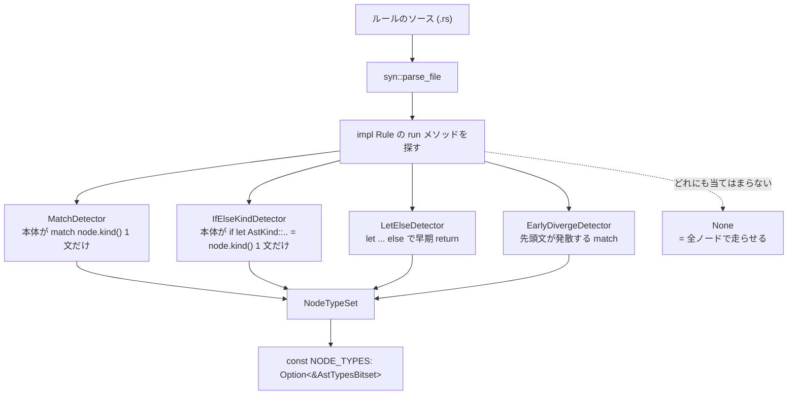

## 何を学んだか

素朴なリンタの実装はこうなる。

```
for node in ast {
    for rule in rules {
        rule.run(node);
    }
}
```

866 本のルールと数十万ノードで、これは 1 億回近い呼び出しになる。ほとんどのルールは `match node.kind()` の先頭で弾いて即 return するので、**実質的な仕事より dispatch のほうが高くつく。**

oxc の解決はこうなる。

1. **`tasks/linter_codegen` (`cargo lintgen`) が、各ルールの `run` メソッドのソースを `syn` でパースする**
2. `match node.kind() { AstKind::X(..) => ..., AstKind::Y(..) => ... }` のような形から、**そのルールが触る `AstType` を推論する**
3. 推論結果を 192 ビットのビットセット `NODE_TYPES` として `impl RuleRunner` に焼く
4. 実行時は AST 型ごとにルールをバケツ分けし、**1 パスで「そのノードの型に登録されたルールだけ」を呼ぶ**

推論が外れたら診断が消える。その保険として、**debug build では最適化ありとなしの両方を走らせ、診断が一致しなければ panic する。**

## なぜそうなっているか

### 手書きなのは `mod` 宣言だけ

`crates/oxc_linter/src/rules.rs` は、モジュール宣言だけのファイルになっている。

```rust title="crates/oxc_linter/src/rules.rs"
//! All registered lint rules.
//!
//! New rules need to be added to these `mod` statements.
//! Then run `cargo lintgen` to regenerate the RuleEnum and RuleRunnerImpls.

/// <https://github.com/import-js/eslint-plugin-import>
pub(crate) mod import {
    pub mod consistent_type_specifier_style;
    pub mod default;
    pub mod export;
    // ...
}
```

**ルールを足すときに人間が書くのは、この 1 行と、ルール本体のファイルだけ。** そこから `cargo lintgen` が 2 つのファイルを生成する。

| 生成物                           | サイズ            | 中身                                                          |
| -------------------------------- | ----------------- | ------------------------------------------------------------- |
| `generated/rules_enum.rs`        | 1.6MB / 23,241 行 | 866 variant の `RuleEnum` と、その全メソッドの `match`        |
| `generated/rule_runner_impls.rs` | 257KB             | 各ルールの `impl RuleRunner`。`NODE_TYPES` と `RUN_FUNCTIONS` |

`RuleEnum` は `Box<dyn Rule>` ではなく enum になっている。**動的ディスパッチをやめて、`match` の静的ディスパッチにするため**だ。その代償が 23,241 行で、生成でしか維持できない。

### ソースコードから触る型を推論する

生成器の中心はここになる。

```rust title="tasks/linter_codegen/src/main.rs"
        if let Some(src_path) = find_rule_source_file(&root, rule)
            && let Ok(src_contents) = fs::read_to_string(&src_path)
            && let Ok(file) = syn::parse_file(&src_contents)
        {
            if let Some(node_types) = detect_top_level_node_types(&file, rule, &rule_runner_data) {
                detected_types.extend(node_types);
            }

            rule_run_info.extend(detect_rule_run_implementations(&file, rule));
        }
```

**ルールの `.rs` ファイルを読んで `syn` でパースし、`run` メソッドの本体を見る。** 検出器は 4 種類ある。



`MatchDetector` はいちばん単純な形を狙う。

```rust title="tasks/linter_codegen/src/match_detector.rs"
/// Detects top-level `match node.kind() { ... }` patterns in the `run` method.
pub struct MatchDetector<'a> {
    node_types: NodeTypeSet,
    rule_runner_data: &'a RuleRunnerData,
}

impl<'a> MatchDetector<'a> {
    pub fn from_run_func(
        run_func: &syn::ImplItemFn,
        rule_runner_data: &'a RuleRunnerData,
    ) -> Option<NodeTypeSet> {
        // Only consider when the body's only statement is `match node.kind() { ... }`
        let stmts = executable_stmts(&run_func.block);
        if stmts.len() != 1 {
            return None;
        }
        let first_stmt = stmts[0];
        // Must be an expression statement
        let Stmt::Expr(expr, _) = first_stmt else { return None };
        // Must be a match expression
        let Expr::Match(match_expr) = expr else { return None };
        // The match expression's must be matching on a `node.kind()` call
        if !is_node_kind_call(&match_expr.expr) {
            return None;
        }
        // ...
    }
```

条件が厳しい。**「本体が 1 文だけ」「その文が `match`」「`match` の対象が `node.kind()`」** の全部を満たさないと諦める。

諦め方が重要で、`CollectionResult::Incomplete` という概念がある。

```rust title="tasks/linter_codegen/src/match_detector.rs"
        let result = detector.extract_variants_from_match_expr(match_expr);
        if detector.node_types.is_empty() || result == CollectionResult::Incomplete {
            return None;
        }
```

**`match` の腕の 1 つでも読めない形 (ガード付き、複雑なパターン、`_` に処理がある) があれば、そのルール全体の推論を捨てる。** 部分的な結果を使うと、読めなかった腕に対応するノードでルールが呼ばれなくなり、診断が消える。

推論できなかったルールは `NODE_TYPES = None` になり、**全ノードで走る**。安全側に倒れている。

```rust title="tasks/linter_codegen/src/main.rs"
        let node_types_init = if detected_types.is_empty() {
            "None".to_string()
        } else {
            format!("Some(&{})", detected_types.to_ast_type_bitset_string())
        };
```

同時に「どのメソッドが実装されているか」も検出している。

```rust title="tasks/linter_codegen/src/main.rs"
        let rule_run_info_init = if rule_run_info.len() == 1 {
            match rule_run_info.iter().next().map(String::as_str) {
                Some("run") => "RuleRunFunctionsImplemented::Run".to_string(),
                Some("run_once") => "RuleRunFunctionsImplemented::RunOnce".to_string(),
                Some("run_on_jest_node") => {
                    "RuleRunFunctionsImplemented::RunOnJestNode".to_string()
                }
                _ => "RuleRunFunctionsImplemented::Unknown".to_string(),
            }
        } else {
            "RuleRunFunctionsImplemented::Unknown".to_string()
        };
```

[`Rule` トレイトの全メソッドがデフォルト実装](./rule-trait/)なので、「実装したかどうか」は実行時には分からない。ソースを見れば分かる。

### ビットセットは 192 ビット

```rust title="crates/oxc_semantic/src/ast_types_bitset.rs"
/// Number of `usize`s required for bit set which can represent all [`AstType`]s.
// Need to add plus one here because 0 is a possible value, but requires at least one bit to represent it.
const NUM_USIZES: usize = (AST_TYPE_MAX as usize + 1).div_ceil(USIZE_BITS);

/// Bit set with a bit for each [`AstType`].
#[derive(Debug, Clone)]
pub struct AstTypesBitset([usize; NUM_USIZES]);
```

[`AST_TYPE_MAX = 191`](./astkind-and-visit/) なので、64bit 環境では `usize` 3 本 (192 ビット) になる。全メソッドが `const fn` なので、**ビットセットの構築がコンパイル時に終わる。**

### 実行時のバケツ分け

```rust title="crates/oxc_linter/src/lib.rs"
/// Per-thread scratch buffers for dispatching rules to AST nodes by node type.
///
/// Reused across files, so the single traversal in [`execute_rules`] — which visits each node once
/// and dispatches it only to the rules registered for its type — incurs no per-file allocation.
/// (Per-file allocation is what previously made bucketing worthwhile only for very large files.)
struct RuleBuckets {
    /// `by_type[ast_type]` = indices, into the per-file `rules` slice, of rules that run on that AST
    /// node type. A boxed fixed-size array so indexing by an `AstType` elides bounds checks.
    by_type: Box<[Vec<usize>; AST_TYPE_MAX as usize + 1]>,
    /// Indices of rules that run on every node (rules without `types_info`).
    any_type: Vec<usize>,
}

thread_local! {
    static RULE_BUCKETS: std::cell::RefCell<RuleBuckets> = std::cell::RefCell::new(RuleBuckets {
        by_type: boxed_array![Vec::new(); AST_TYPE_MAX as usize + 1],
        any_type: Vec::new(),
    });
}
```

**`thread_local!` でバッファを使い回す。** コメントに履歴が残っていて、「以前はファイルごとに確保していたので、大きいファイルでしか元が取れなかった」。バッファを使い回すようにしたので、小さいファイルでも勝つようになった。

固定長配列 (`Box<[Vec<usize>; 192]>`) なのは境界チェックを消すためで、`AstType` が `u8` で 191 以下だと分かっているので `by_type[ty as usize]` に検査が要らない。

本体はこうなる。

```rust title="crates/oxc_linter/src/lib.rs"
        RULE_BUCKETS.with_borrow_mut(|buckets| {
            buckets.clear();

            for (rule_index, (rule, ctx)) in rules.iter().enumerate() {
                let run_info = rule.run_info();
                if let Some(ast_types) = rule.types_info()
                    && run_info.is_run_implemented()
                {
                    for ty in ast_types {
                        buckets.by_type[ty as usize].push(rule_index);
                    }
                } else if run_info.is_run_implemented() {
                    buckets.any_type.push(rule_index);
                }

                if run_info.is_run_once_implemented() {
                    let timing_stat = get_timing_stat::<TIMINGS>(&mut timing_stats, rule_index);
                    rule.run_once::<TIMINGS>(ctx, timing_stat);
                }
            }

            for node in semantic.nodes() {
                for &rule_index in &buckets.by_type[node.kind().ty() as usize] {
                    let (rule, ctx) = &rules[rule_index];
                    // ...
                    rule.run::<TIMINGS>(node, ctx, timing_stat);
                }
                for &rule_index in &buckets.any_type {
                    // ...
                }
            }
            // ...
        });
```

`run_once` はバケツ分けのループの中で 1 回だけ呼ばれる。`node.kind().ty()` は [`AstKind` から `AstType` を取り出す](./astkind-and-visit/)ので、判別子の読み出し 1 回で済む。

### 推論が外れたときの保険

`execute_rules` には `with_runtime_optimization: bool` という引数があり、`false` のときは素朴なループを走る。

```rust title="crates/oxc_linter/src/lib.rs"
    } else {
        // Unoptimized reference path: every rule runs on every node, with no type filtering. Used
        // only in debug builds, to assert the optimized path produces identical diagnostics.
        for (rule_index, (rule, ctx)) in rules.iter().enumerate() {
            let timing_stat = get_timing_stat::<TIMINGS>(&mut timing_stats, rule_index);
            rule.run_once::<TIMINGS>(ctx, timing_stat);

            for node in semantic.nodes() {
                // ...
            }
        }
    }
```

debug build では両方を走らせ、診断を突き合わせる。

```rust title="crates/oxc_linter/src/lib.rs"
                    assert_eq!(
                        optimized_diagnostics.len(),
                        unoptimized_diagnostics.len(),
                        "Running with and without optimizations produced different diagnostic counts: {} vs {}.\nThis can be caused by a mismatch between the rule definition and generated RuleRunner impl. Try `cargo run -p oxc_linter_codegen` to regenerate.",
                        optimized_diagnostics.len(),
                        unoptimized_diagnostics.len()
                    );
```

エラーメッセージが**そのまま対処法になっている**。「ルール定義と生成された `RuleRunner` 実装がずれている。`cargo run -p oxc_linter_codegen` を試せ」。

診断の順序は 2 つの経路で違う (最適化ありは AST 順、なしはルール順) ので、比較の前にソートする。ソートキーはラベルの位置と長さ、メッセージ、help、note、severity、code、URL、span、fix と続く。**「診断が同じである」の定義がこの比較関数そのもの**になっている。

[SemanticBuilder の `Stats` 検証](./semantic-builder/)と同じ形だが、こちらは**正しさ**を守っている。`Stats` がずれても結果は正しかったが、`NODE_TYPES` がずれると診断が消える。

## ソースコードのどこか

- [`crates/oxc_linter/src/rules.rs`](https://github.com/oxc-project/oxc/blob/apps_v1.81.0/crates/oxc_linter/src/rules.rs) — 手書きの `mod` 宣言
- [`tasks/linter_codegen/src/main.rs`](https://github.com/oxc-project/oxc/blob/apps_v1.81.0/tasks/linter_codegen/src/main.rs) — 生成器の入口
- [`tasks/linter_codegen/src/match_detector.rs`](https://github.com/oxc-project/oxc/blob/apps_v1.81.0/tasks/linter_codegen/src/match_detector.rs) 他 3 つの検出器
- [`crates/oxc_semantic/src/ast_types_bitset.rs`](https://github.com/oxc-project/oxc/blob/apps_v1.81.0/crates/oxc_semantic/src/ast_types_bitset.rs) — `AstTypesBitset`
- [`crates/oxc_linter/src/lib.rs`](https://github.com/oxc-project/oxc/blob/apps_v1.81.0/crates/oxc_linter/src/lib.rs) — `execute_rules` と debug 検証
- [`crates/oxc_linter/src/generated/rules_enum.rs`](https://github.com/oxc-project/oxc/blob/apps_v1.81.0/crates/oxc_linter/src/generated/rules_enum.rs) — 1.6MB の生成物

検出器が 4 つに分かれているのは、ルールの書き方が実際に 4 パターンあるからだ。

| 検出器                 | 対象の形                                                     |
| ---------------------- | ------------------------------------------------------------ |
| `MatchDetector`        | 本体が `match node.kind() { ... }` 1 文                      |
| `IfElseKindDetector`   | 本体が `if let AstKind::X(..) = node.kind() { }` の連鎖 1 文 |
| `LetElseDetector`      | `let AstKind::X(x) = node.kind() else { return };`           |
| `EarlyDivergeDetector` | 先頭の文が発散する `match` (2 文以上のケース)                |

**「ルールをこう書け」と規約で縛るのではなく、実際に書かれている 4 パターンを検出器にした**という順序になっている。新しい書き方が増えれば検出器を足すか、そのルールは `None` (全ノードで走る) になるだけで壊れない。

## どう活かすか

**「全部を全部に対して試す」ループが profile に出たら、事前に索引を作れないか考える。** oxc は AST 型ごとのバケツを作った。同じ形は、イベントハンドラの購読、ルールエンジン、オブザーバのディスパッチで使える。索引のキーは「対象側から安く取れるもの」(ここでは `AstType` の 1 バイト) にする。

**索引の内容をソースコードから静的解析で作るのは、実際に選択肢になる。** 「開発者に宣言させる」(`fn node_types() -> &[AstType]`) と、宣言と実装がずれる。oxc は実装のほうを真実にした。ただし**推論できない形は諦めて安全側に倒す**のが必須条件で、部分的な推論結果を使うと壊れる。

**危険な最適化には「素朴な実装」を残し、debug build で突き合わせる。** oxc は最適化パスと非最適化パスの両方を残していて、後者は debug ビルドの照合以外に使い道がない。それでもコードとして残す価値がある。**照合できない最適化は、入れる前に考え直すべき**という判断基準にもなる。

**assertion のメッセージに対処法を書く。** 「診断の数が違う」だけだと調査から始まる。「生成物がずれている可能性がある、`cargo run -p oxc_linter_codegen` を試せ」まで書けば、遭遇した人が数分で解決する。

**スクラッチバッファは `thread_local!` で使い回す。** ファイルごとに確保していたときは「大きいファイルでしか元が取れない」最適化だったものが、使い回しにしたことで全サイズで勝つようになった。**最適化が効かない理由が確保コストなら、確保をなくすほうが先**になる。
