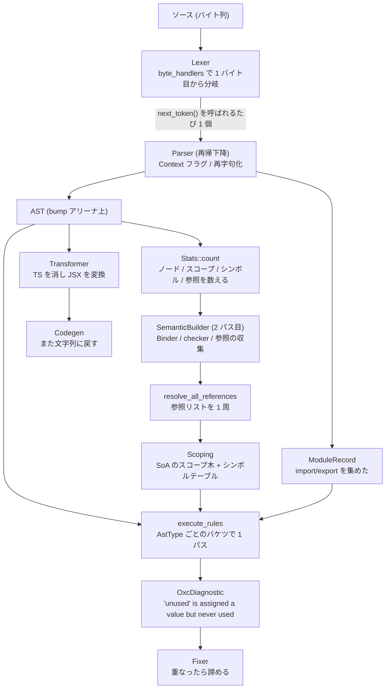

## 何を学んだか

この章は全ページで同じスニペットを使う。

```ts title="example.ts"
import { readFile } from "node:fs/promises";

export type Entry = { name: string; size: number };

export async function collect(path: string): Promise<Entry[]> {
  const raw = await readFile(path, "utf8");
  const unused = 1;
  return raw.split("\n").map((name) => ({ name, size: name.length }));
}
```

10 行のなかに、この章で扱いたいものがひととおり入っている。

| 要素                  | どの段で効くか                                                                                   |
| --------------------- | ------------------------------------------------------------------------------------------------ |
| `import { readFile }` | [module_record](./module-record/) が集める。[`import/no-cycle`](./parallel-lint/) がグラフを作る |
| `"node:fs/promises"`  | [文字列リテラル](./escapes-and-unicode/)。エスケープがないので確保ゼロ                           |
| `export type Entry`   | [TS 専用ノード](./ts-and-jsx/)。[型の名前空間](./scope-and-symbol/)に入る                        |
| `async function`      | [`Context::Await`](./context-flags/) を立てる                                                    |
| `Promise<Entry[]>`    | [型引数の判定](./ts-and-jsx/)。`<` の曖昧さ                                                      |
| `await readFile(...)` | `Await` フラグがないと `await(...)` に読まれる                                                   |
| `const unused = 1;`   | [`no-unused-vars`](./reading-no-unused-vars/) が報告する                                         |
| `(name) => ...`       | 新しいスコープ。[Binder](./binder/) が仮引数を登録                                               |
| `name.length`         | [`IdentifierName`](./ast-and-estree/) (プロパティ名) であって参照ではない                        |

## 全体の流れ



## 段ごとに見る

### 1. 字句解析

`const raw = await readFile(path, "utf8");` の 1 行が、次のトークンになる ([byte handlers](./byte-handlers/))。

```
[const] [raw] [=] [await] [readFile] [(] [path] [,] ["utf8"] [)] [;]
```

パーサが `next_token()` を呼ぶたびに 1 個ずつ作られる。**トークン列としてどこにも溜まらない** ([オンデマンドにトークンを 1 つずつ](./on-demand-tokens/))。

`"utf8"` は[エスケープを含まない](./escapes-and-unicode/)ので、`Token` の span がソースの範囲を指すだけになる。アリーナへの確保はゼロ。

`await` は `Kind::Await` というトークン種別になるが、**それが演算子か識別子かはこの時点では決まらない。**

### 2. 構文解析

```
Program
├── ImportDeclaration
│   └── ImportSpecifier { imported: "readFile", local: BindingIdentifier "readFile" }
├── ExportNamedDeclaration
│   └── TSTypeAliasDeclaration
│       ├── id: BindingIdentifier "Entry"
│       └── type_annotation: TSTypeLiteral { members: [name: string, size: number] }
└── ExportNamedDeclaration
    └── Function "collect"
        ├── params: [FormalParameter { pattern: BindingIdentifier "path",
        │                              type_annotation: TSTypeReference "string" }]
        ├── return_type: TSTypeReference "Promise" <TSArrayType <TSTypeReference "Entry">>
        └── body
            ├── VariableDeclaration (const)
            │   └── VariableDeclarator
            │       ├── id: BindingIdentifier "raw"
            │       └── init: AwaitExpression → CallExpression "readFile"
            ├── VariableDeclaration (const)
            │   └── VariableDeclarator { id: BindingIdentifier "unused", init: NumericLiteral 1 }
            └── ReturnStatement
                └── CallExpression
                    ├── callee: StaticMemberExpression
                    │   ├── object: CallExpression (raw.split("\n"))
                    │   └── property: IdentifierName "map"
                    └── arguments: [ArrowFunctionExpression]
```

`async function` に入るとき、[`Context::Await` が立つ](./context-flags/)。だから `await readFile(...)` が `AwaitExpression` になる。**`async` を外せば、同じ文字列が `await(readFile(...))` — 識別子 `await` の呼び出しとして読まれる。**

`Promise<Entry[]>` の `<` は、[型引数として読み直される](./ts-and-jsx/)。`>` が 1 個なので再字句化は起きないが、`Promise<Array<Entry>>` なら `>>` が `>` 2 個に読み直される。

`name.length` の `length` は `IdentifierName` で、`name` は `IdentifierReference` になる ([AST と ESTree](./ast-and-estree/))。**プロパティ名は変数ではないので、参照解決の対象にならない。**

同時に [module_record](./module-record/) が組み立てられる。

| フィールド             | 内容                                 |
| ---------------------- | ------------------------------------ |
| `requested_modules`    | `{ "node:fs/promises": [...] }`      |
| `import_entries`       | `readFile`                           |
| `local_export_entries` | `Entry`、`collect`                   |
| `exported_bindings`    | `{ "Entry": span, "collect": span }` |

### 3. Semantic

まず [`Stats::count`](./semantic-builder/) が数える。

```
nodes: 約 60
scopes: 3
symbols: 7
references: 6
```

その数だけ確保してから、2 パス目で本番の走査をする。**この後、テーブルは一度も伸びない。**

できあがるスコープ木はこうなる ([スコープとシンボル](./scope-and-symbol/))。

```
スコープ 0 (Top | StrictMode)
├── bindings: readFile → Import
│             Entry → TypeAlias
│             collect → Function
└── スコープ 1 (Function)  ← collect
    ├── bindings: path → FunctionScopedVariable
    │             raw → BlockScopedVariable | ConstVariable
    │             unused → BlockScopedVariable | ConstVariable
    └── スコープ 2 (Arrow)  ← (name) => ...
        └── bindings: name → FunctionScopedVariable
```

登録は [Binder](./binder/) がやる。`const` なので `VariableDeclarator::bind` は「lexical」の枝を通り、4 行で終わる — **`var` 巻き上げの 96 行は 1 行も実行されない。**

参照は走査中にフラットな `Vec` に積まれ、走査後に 1 周して解決される ([参照解決](./reference-resolution/))。

| 参照             | 解決先              | 探し始めるスコープ |
| ---------------- | ------------------- | ------------------ |
| `readFile`       | `readFile` (Import) | 1 → 0              |
| `Entry` (型参照) | `Entry` (TypeAlias) | 0                  |
| `path`           | `path`              | 1                  |
| `raw`            | `raw`               | 1                  |
| `name` × 2       | `name`              | 2                  |

**`unused` への参照は 0 件。** これが次の段の材料になる。

`collect` は関数のシグネチャを読み終えた時点で [`resolve_references_for_current_scope`](./reference-resolution/) が呼ばれ、`Promise` と `Entry` (型注釈の中) が本体に入る前に解決される。

### 4. Lint

866 本のルールが [`AstType` ごとにバケツ分け](./rule-dispatch/)され、AST を 1 パスするだけで全部が走る。

`no-unused-vars` は `run` を実装していないので、バケツには入らない。`run_once` で[シンボルテーブルを全走査](./reading-no-unused-vars/)する。

| シンボル   | 参照数 | export | 判定                   |
| ---------- | ------ | ------ | ---------------------- |
| `readFile` | 1      | ✗      | OK                     |
| `Entry`    | 1      | ✓      | OK                     |
| `collect`  | 0      | **✓**  | OK (export されている) |
| `path`     | 1      | ✗      | OK                     |
| `raw`      | 1      | ✗      | OK                     |
| `unused`   | **0**  | ✗      | **報告**               |
| `name`     | 2      | ✗      | OK                     |

`collect` は参照が 0 件なのに報告されない。`is_exported` の判定に [module_record の `exported_bindings`](./module-record/) が使われる。

出る診断はこうなる ([診断の設計](./diagnostics/))。

```
  × Variable 'unused' is declared but never used.
   ╭─[example.ts:7:9]
 6 │   const raw = await readFile(path, "utf8");
 7 │   const unused = 1;
   ·         ───┬──
   ·            ╰── 'unused' is declared here
 8 │   return raw.split("\n").map((name) => ({ name, size: name.length }));
   ╰────
  help: Consider removing this declaration.
```

`--fix` を付けると、[`Fix { content: "", span }`](./auto-fix/) が作られて `const unused = 1;` の行が消える。`no-unused-vars` の fix は `dangerous_suggestion` なので、`--fix` だけでは適用されず `--fix-dangerously` が要る。

### 5. Transform と Codegen

TypeScript を消すと ([Transformer](./transformer/))、

```js
import { readFile } from "node:fs/promises";

export async function collect(path) {
  const raw = await readFile(path, "utf8");
  const unused = 1;
  return raw.split("\n").map((name) => ({ name, size: name.length }));
}
```

`type Entry` の宣言も、`: string` も `: Promise<Entry[]>` も消える。**`Entry` シンボルが消えるので、`Scoping` からも削除する必要がある** ([TraverseCtx](./traverse-ctx/) の `delete_typescript_bindings`)。

[Codegen](./codegen/) が文字列に戻す。[Mangler](./minifier-and-mangler/) を通せば、

```js
import { readFile as e } from "node:fs/promises";
export async function collect(t) {
  const n = await e(t, "utf8"),
    r = 1;
  return n.split("\n").map((o) => ({ name: o, size: o.length }));
}
```

`collect` は export されているので短縮されない。**`name` プロパティは短縮されず、`name` 変数だけが `o` になる** — プロパティ名は[別のシンボル空間](./ast-and-estree/)にあるからだ。

## メモリの実測値

同じ形の処理を 2.92MB の TypeScript (`checker.ts`) でやると、こうなる ([bump アリーナ](./bump-allocator/))。

```yaml title="tasks/track_memory_allocations/allocs_parser.yaml"
checker.ts:
  file size: 2922154 # 2.92 MB
  sys allocs: 19
  arena allocs: 262590
  arena size: 12923744 # 12.92 MB
```

```yaml title="tasks/track_memory_allocations/allocs_semantic.yaml"
checker.ts:
  sys allocs: 46
  sys reallocs: 0
  arena allocs: 0
```

**パースのシステムアロケーションが 19 回、semantic が 46 回で再確保が 0 回。** この数字が CI で固定されている。

## どう活かすか

**設計を追うときは、1 つの入力を最後まで通す。** 「この段で何を持ち、次に何を渡すか」が具体例で分かると、抽象的な設計図より速い。**逆に、設計を説明するときも通し例を 1 つ決める**と、読み手が現在地を見失わない。

**例には「後で効くもの」を仕込んでおく。** この 10 行の `unused` は最初から `no-unused-vars` のために置いてあり、`export` は「参照 0 件でも報告しない」を示すために置いてある。**説明したい分岐が全部通る最小の例**を作るのが、良い通し例の条件になる。

**「同じ文字列が文脈で違うものになる」例を含める。** `await` が `async` の有無で変わるのは、[Context フラグ](./context-flags/)の説明に不可欠だった。1 つの例で複数の段の話ができる。
