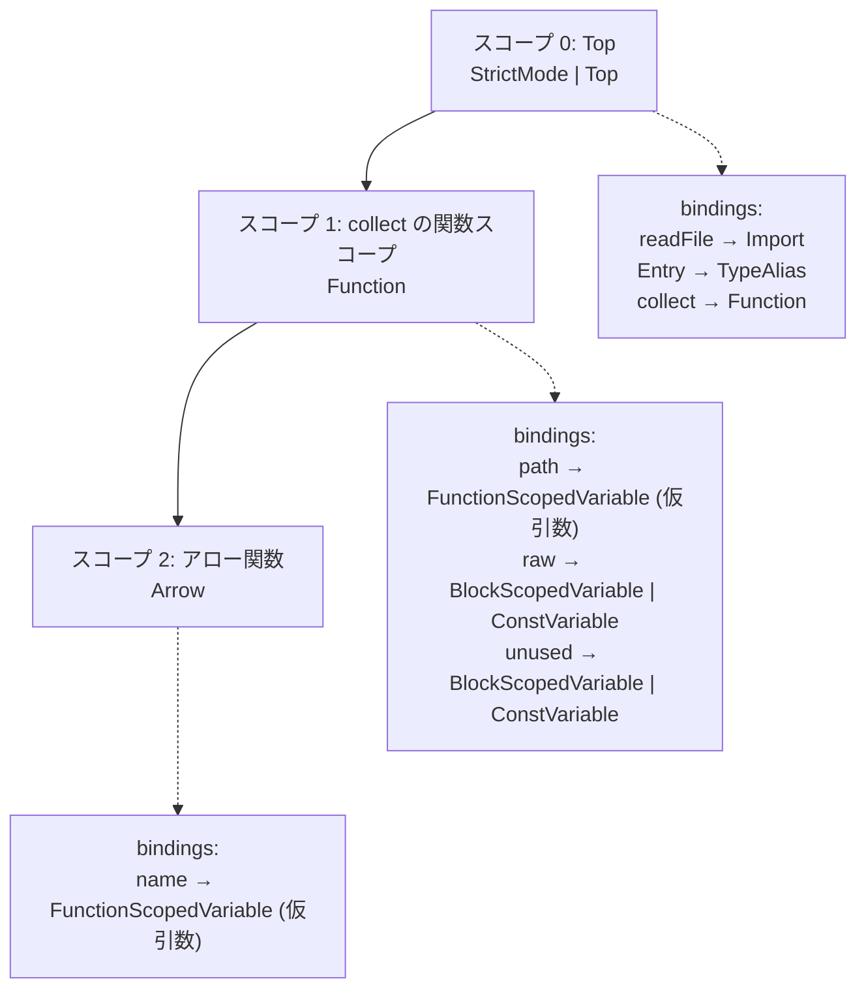

## 何を学んだか

パーサの出力は木でしかない。`raw.split("\n")` の `raw` と `const raw = ...` の `raw` が同じ変数だという情報は、木のどこにも書かれていない。それを付ける工程が semantic 解析で、必要な概念は 3 つになる。

- **スコープ (scope)** — 名前が有効な範囲。入れ子になって木を作る
- **シンボル (symbol)** — 宣言 1 つに対応する実体。「この名前で宣言されたもの」
- **参照 (reference)** — 名前の使用箇所。解決するとシンボルを指す

やることは「宣言を集めてスコープに登録し、参照をスコープチェーンで辿って宣言に繋ぐ」だけだ。ただし JS でこれをやると、次のような面倒が全部乗ってくる。

- `var` は**ブロックではなく関数**のスコープに属する (巻き上げ)
- `let` / `const` は宣言前に触ると TDZ でエラー
- `catch (e)` の `e` は catch 節だけのスコープ
- 名前付き関数式 `(function n() {})` の `n` は**関数の内側からだけ**見える
- クラス式 `class C {}` の `C` も同様に内側束縛を持つ
- TypeScript には**型の名前空間と値の名前空間が別にある**。`type Entry` と `const Entry` は共存できる
- しかも `class C` は両方の空間に入る

oxc の semantic はこの面倒さを、**`SymbolFlags` という 1 つのビットフラグと、その `includes` / `excludes` の組**に押し込んでいる。

## なぜそうなっているか

### スコープ木は「入れ子」ではなく「親 ID の配列」

概念上スコープは木だが、oxc は子のリストを持たない。各スコープが親の ID を持つだけだ ([データ指向のスコープ表現](./data-oriented-scoping/))。

```rust title="crates/oxc_semantic/src/scoping.rs"
    struct ScopeTable<ScopeId> {
        parent_ids => parent_ids_mut: Option<ScopeId>,
        node_ids => node_ids_mut: NodeId,
        flags => flags_mut: ScopeFlags,
    }
```

これで足りるのは、**semantic がやる操作がほぼ全部「上に辿る」だから**だ。参照の解決は「自分のスコープから親へ順に探す」。`var` の巻き上げ先を探すのも「関数スコープに当たるまで上へ」。子から親への辺しか使わない。

`ScopeFlags` はそのスコープの性質を表す。

```rust title="crates/oxc_syntax/src/scope.rs"
    pub struct ScopeFlags: u16 {
        const StrictMode       = 1 << 0;
        const Top              = 1 << 1;
        const Function         = 1 << 2;
        const Arrow            = 1 << 3;
        const ClassStaticBlock = 1 << 4;
        const TsModuleBlock    = 1 << 5; // `namespace`
        const Constructor      = 1 << 6;
        const GetAccessor      = 1 << 7;
        // ...
    }
```

`var` の巻き上げは「`flags.is_var()` が真になるスコープまで上る」と表現される。関数・アロー・クラス静的ブロック・トップレベルがそれに当たる。

### `SymbolFlags` の includes と excludes

シンボルの種類はビットフラグで表される。

```rust title="crates/oxc_syntax/src/symbol.rs"
    pub struct SymbolFlags: u32 {
        const None                    = 0;
        /// Variable (var) or parameter
        const FunctionScopedVariable  = 1 << 0;
        /// A block-scoped variable (let or const)
        const BlockScopedVariable     = 1 << 1;
        /// A const variable (const)
        const ConstVariable           = 1 << 2;
        const Class                   = 1 << 3;
        /// `try {} catch(catch_variable) {}`
        const CatchVariable           = 1 << 4;
        // ...
        const TypeAlias               = 1 << 8;
        const Interface               = 1 << 9;
        const RegularEnum             = 1 << 10;
        // ...
    }
```

ここまでは普通だが、面白いのは**「何と共存できないか」も同じフラグ空間で表す**ことだ。

```rust title="crates/oxc_syntax/src/symbol.rs"
        const Value = Self::Variable.bits() | Self::Class.bits() | Self::Function.bits()
                    | Self::Enum.bits() | Self::EnumMember.bits() | Self::ValueModule.bits();
        const Type = Self::Class.bits() | Self::Interface.bits() | Self::Enum.bits()
                   | Self::EnumMember.bits() | Self::TypeParameter.bits() | Self::TypeAlias.bits();

        /// Variables can be redeclared, but can not redeclare a block-scoped declaration with the
        /// same name, or any other value that is not a variable, e.g. ValueModule or Class
        const FunctionScopedVariableExcludes =
            Self::Value.bits() - Self::FunctionScopedVariable.bits() - Self::Function.bits();

        /// Block-scoped declarations are not allowed to be re-declared
        /// they can not merge with anything in the value space
        const BlockScopedVariableExcludes = Self::Value.bits();
```

読み方はこうなる。

- `var x` を宣言するとき、`includes = FunctionScopedVariable`、`excludes = FunctionScopedVariableExcludes`
- 同じスコープに既に `x` があったら、その既存シンボルの flags と `excludes` の積を取る。**0 でなければ再宣言エラー**

`FunctionScopedVariableExcludes` は「値空間の全部から、`FunctionScopedVariable` と `Function` を引いたもの」だ。つまり `var x; var x;` は OK (`FunctionScopedVariable` が除外されていない)、`var x; function x() {}` も OK (`Function` が除外されていない)、`var x; let x;` は NG (`BlockScopedVariable` が `Value` に含まれ、除外されていない) になる。

**「JS/TS の再宣言規則」という長い仕様の塊が、ビットマスクの定義 10 数行になっている。**

`Value` と `Type` が別々に定義されているのが TypeScript の 2 空間そのものだ。`Class` は両方に入っているので、`class C` は値としても型としても参照できる。`TypeAlias` は `Type` にしかないので、`type Entry` を値として使うと解決されない。

### 型と値で参照の解決規則が変わる

参照の側にも flags があり、解決時に突き合わせる。

```rust title="crates/oxc_semantic/src/builder.rs"
        let can_resolve = if flags.is_namespace()
            && !flags.is_value_as_type()
            && !symbol_flags.can_be_referenced_as_namespace()
        {
            false
        } else {
            (flags.is_value() && symbol_flags.can_be_referenced_by_value())
                || (flags.is_type() && symbol_flags.can_be_referenced_by_type())
                || (flags.is_value_as_type() && symbol_flags.can_be_referenced_by_value_as_type())
        };
```

3 つ目の `value_as_type` は `typeof x` のような文脈のためにある。`const x = 0; type T = typeof x;` では、`x` は値のシンボルなのに型の位置に現れる。

### 通し例で見る

```ts title="example.ts"
import { readFile } from "node:fs/promises";

export type Entry = { name: string; size: number };

export async function collect(path: string): Promise<Entry[]> {
  const raw = await readFile(path, "utf8");
  const unused = 1;
  return raw.split("\n").map((name) => ({ name, size: name.length }));
}
```

スコープとシンボルはこうなる。



参照は 6 つある。`readFile` (スコープ 1 → スコープ 0 で解決)、`Entry` (型参照、スコープ 0 で解決)、`path` (スコープ 1 で解決)、`raw` (スコープ 1 で解決)、`name` が 2 つ (スコープ 2 で解決)。

`unused` は宣言だけあって参照が 0 件になる。これが `no-unused-vars` の材料になる ([ルールを読む](./reading-no-unused-vars/))。

注意点が 1 つある。**`collect` の仮引数 `path` と関数本体は同じスコープを共有している。** 本来 ECMAScript の仕様では仮引数と本体は別スコープになりうるが、oxc は 1 つにまとめている。これが[参照解決](./reference-resolution/)で回避策を必要とする原因になる。

## ソースコードのどこか

- [`crates/oxc_syntax/src/symbol.rs`](https://github.com/oxc-project/oxc/blob/apps_v1.81.0/crates/oxc_syntax/src/symbol.rs) — `SymbolFlags` と `*Excludes`
- [`crates/oxc_syntax/src/scope.rs`](https://github.com/oxc-project/oxc/blob/apps_v1.81.0/crates/oxc_syntax/src/scope.rs) — `ScopeId` と `ScopeFlags`
- [`crates/oxc_syntax/src/reference.rs`](https://github.com/oxc-project/oxc/blob/apps_v1.81.0/crates/oxc_syntax/src/reference.rs) — `Reference` と `ReferenceFlags`
- [`crates/oxc_semantic/src/lib.rs`](https://github.com/oxc-project/oxc/blob/apps_v1.81.0/crates/oxc_semantic/src/lib.rs) — `Semantic` の公開 API

ID の型は全部 `NonMaxU32` になっている。

```rust title="crates/oxc_syntax/src/symbol.rs"
define_nonmax_u32_index_type! {
    #[ast]
    #[builder(default)]
    #[clone_in(semantic_id)]
    #[content_eq(skip)]
    #[estree(skip)]
    pub struct SymbolId;
}
```

`u32::MAX` を無効値として予約することで、**`Option<SymbolId>` が 4 バイトに収まる。** AST ノードは `symbol_id: Cell<Option<SymbolId>>` を持つので、これが 8 バイトだとノードが太る ([AST のメモリレイアウト](./ast-memory-layout/))。

`SymbolFlags` には TypeScript 本体を参照したコメントが付いている。

```rust title="crates/oxc_syntax/src/symbol.rs"
        // This flag is not part of TypeScript's `SymbolFlags`, it comes from TypeScript's `NodeFlags`.
        // We introduced it into here because `NodeFlags` is incomplete and we only can access to
        // `NodeFlags` in the Semantic, but we also need to access it in the Transformer.
        // https://github.com/microsoft/TypeScript/blob/.../src/compiler/types.ts#L819-L820
        const Ambient                 = 1 << 16;
```

**TypeScript のどのフラグに対応し、どこで意図的に外したか**が明記されている。互換性が要求される実装では、この種のコメントが仕様書の代わりになる。

## どう活かすか

**「共存できるか」の規則は、種類フラグと同じ空間に置くと短く書ける。** `SymbolFlags` の `includes` / `excludes` は、再宣言規則という長い仕様をビットマスクの積 1 回にしている。同じ形は権限モデル (この role とこの role は同時に持てない) や状態遷移でも使える。条件を `if` の連鎖で書くとテストが組み合わせ爆発するが、マスクなら定義そのものが表になる。

**「上に辿る」しかしないなら、子のリストは持たない。** 親 ID の配列だけで木を表現すると、メモリも走査も安くなる。逆に「あるスコープの子を全部列挙したい」が要るなら成り立たない。**必要な操作の向きを先に決める**のが順序になる。

**互換実装では「元実装のどこに対応するか」をコメントに残す。** oxc の `SymbolFlags` は TypeScript の `SymbolFlags` をほぼ写しているが、意図的に足したビットには理由と参照リンクが付いている。これがないと、次に TypeScript 側が変わったときに差分を追えない。
