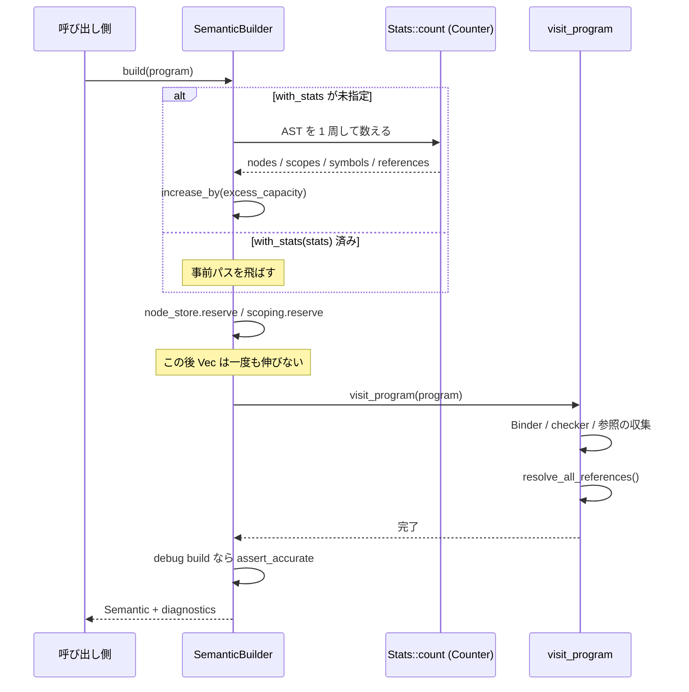

## 何を学んだか

`SemanticBuilder::build(program)` は、既定では **AST を 2 回走査する**。

1. **1 回目**: `Stats::count(program)` がノード数・スコープ数・シンボル数・参照数を数える
2. **`reserve`**: その数だけ `AstNodes` / `ScopeTable` / `SymbolTable` / 参照リストの容量を確保する
3. **2 回目**: `visit_program(program)` が本番の走査をする

**走査を 1 回増やしたほうが速い。** コメントには「ベンチで最大 30% 速くなる」と書いてある。

理由は単純で、`Vec` の再確保コストが走査 1 回分より高いからだ。2.92MB の `checker.ts` なら、AST ノードは数十万個、シンボルテーブルも数 MB になる。容量が足りなくなるたびに全体をコピーして倍のメモリに移す — それが `log2(n)` 回起きる。

数えた結果は `Stats` として取り出せるので、**同じ AST に 2 回目の semantic をかけるときは事前パスを飛ばせる。** [Transformer](./transformer/) が AST を書き換えた後に semantic を再構築する場面で効く。

## なぜそうなっているか

### 30% という数字の出どころ

`build` の中のコメントが全部説明している。

```rust title="crates/oxc_semantic/src/builder.rs"
        // Use counts of nodes, scopes, symbols, and references to pre-allocate sufficient capacity
        // in `AstNodes`, `ScopeTree` and `SymbolTable`.
        //
        // This means that as we traverse the AST and fill up these structures with data,
        // they never need to grow and reallocate - which is an expensive operation as it
        // involves copying all the memory from the old allocation to the new one.
        // For large source files, these structures are very large, so growth is very costly
        // as it involves copying massive chunks of memory.
        // Avoiding this growth produces up to 30% perf boost on our benchmarks.
        //
        // If user did not provide existing `Stats`, calculate them by visiting AST.
        let (stats, check_stats) = if let Some(stats) = self.stats {
            (stats, None)
        } else {
            let stats = Stats::count(program);
            let stats_with_excess = stats.increase_by(self.excess_capacity);
            (stats_with_excess, Some(stats))
        };
        self.node_store.reserve(stats.nodes as usize);
        self.scoping.reserve(
            stats.symbols as usize,
            stats.references as usize,
            stats.scopes as usize,
        );
        self.unresolved_references.reserve_exact(stats.references as usize);
```

数える走査が安いのがポイントになる。`Counter` は `Visit` を実装しているが、やることはカウンタのインクリメントだけだ。

```rust title="crates/oxc_semantic/src/stats.rs"
/// Visitor to count nodes, scopes, symbols and references in AST
impl<'a> Visit<'a> for Counter {
    #[inline]
    fn enter_node(&mut self, _: AstKind<'a>) {
        self.stats.nodes += 1;
    }

    #[inline]
    fn enter_scope(&mut self, _: ScopeFlags, _: &Cell<Option<ScopeId>>) {
        self.stats.scopes += 1;
    }

    #[inline]
    fn visit_binding_identifier(&mut self, _: &BindingIdentifier<'a>) {
        self.stats.nodes += 1;
        self.stats.symbols += 1;
    }

    #[inline]
    fn visit_identifier_reference(&mut self, _: &IdentifierReference<'a>) {
        self.stats.nodes += 1;
        self.stats.references += 1;
    }
    // ...
}
```

**AST はアリーナ上に連続して置かれているので、この走査はほぼ純粋なメモリの線形読み出しになる。** 分岐もアロケーションもない。キャッシュに乗る。一方、避けられるのは数十 MB のコピーだ。非対称が大きいので、走査を 1 回足すほうが勝つ。

### シンボル数だけは過大評価になる

数え方に 1 つ非対称がある。

```rust title="crates/oxc_semantic/src/stats.rs"
    /// Nodes, scopes and references counts will be exactly accurate.
    /// Symbols count may be an over-estimate if there are multiple declarations for a single symbol.
    /// e.g. `var x; var x;` will produce a count of 2 symbols, but this is actually only 1 symbol.
```

`Counter` は `BindingIdentifier` を数えるだけなので、`var x; var x;` は 2 と数える。実際のシンボルは 1 つだ。

これが許されるのは、方向が安全側だからだ。

```rust title="crates/oxc_semantic/src/stats.rs"
        // `Counter` may overestimate number of symbols, because multiple `BindingIdentifier`s
        // can result in only a single symbol.
        // e.g. `var x; var x;` = 2 x `BindingIdentifier` but 1 x symbol.
        // This is not a big problem - allocating a `Vec` with excess capacity is cheap.
        // It's allocating with *not enough* capacity which is costly, as then the `Vec`
        // will grow and reallocate.
        assert_ge!(self.symbols, actual.symbols, "symbols count mismatch");
```

だから検証も `assert_eq!` ではなく `assert_ge!` (自前マクロ) になっている。**「多め」は許すが「少なめ」は許さない。**

### debug build でだけ答え合わせをする

`Stats` が正しいかどうかは、debug build でのみ検証される。

```rust title="crates/oxc_semantic/src/builder.rs"
        // Check that estimated counts accurately (unless in release mode)
        #[cfg(debug_assertions)]
        if let Some(stats) = check_stats {
            let actual_stats = Stats::new(
                self.node_store.node_count(),
                self.scoping.scopes_len() as u32,
                self.scoping.symbols_len() as u32,
                self.scoping.references.len() as u32,
            );
            stats.assert_accurate(actual_stats);
        }
```

`Counter` と本番の走査は**別々のコード**なので、片方だけ更新すると数がずれる。AST に型が 1 つ増えて `Counter` の側を直し忘れれば、`reserve` が足りなくなり、静かに遅くなるだけで結果は正しい。**バグとして表面化しない種類の劣化**なので、debug assertion で捕まえる。

同じパターンが[リンタのディスパッチ表](./rule-dispatch/)にもある。静的解析で作った表が正しいかを、debug build で二重実行して確かめる。**「速いが正しさが保証されない最適化」には、debug build の答え合わせを付ける**という共通の作法になっている。

### `Stats` を渡すと 1 パスになる

```rust title="crates/oxc_semantic/src/builder.rs"
    /// Provide statistics about AST to optimize memory usage of semantic analysis.
    ///
    /// Accurate statistics can greatly improve performance, especially for large ASTs.
    /// If no stats are provided, [`SemanticBuilder::build`] will compile stats by performing
    /// a complete AST traversal.
    /// If semantic analysis has already been performed on this AST, get the existing stats with
    /// [`Semantic::stats`], and pass them in with this method, to avoid the stats collection AST pass.
    #[must_use]
    pub fn with_stats(mut self, stats: Stats) -> Self {
        self.stats = Some(stats);
        self
    }
```

`Semantic::stats()` は既に走った結果を返すので、**正確でしかも取得コストがゼロ**になる。同じ AST に semantic を 2 回かけるなら、2 回目は事前パスなしで走る。

さらに、AST を増やす予定があるなら余裕を指定できる。

```rust title="crates/oxc_semantic/src/builder.rs"
    /// Request `SemanticBuilder` to allocate excess capacity for scopes, symbols, and references.
    ///
    /// `excess_capacity` is provided as a fraction.
    /// e.g. to over-allocate by 20%, pass `0.2` as `excess_capacity`.
    ///
    /// This is useful when you intend to modify `Semantic`, adding more `nodes`, `scopes`, `symbols`,
    /// or `references`.
    pub fn with_excess_capacity(mut self, excess_capacity: f64) -> Self {
```

Transformer は AST にノードを足すので、これを使う。



### ビルダーが持っているスイッチ

`SemanticBuilder` はいくつかの機能を on/off できる。

| メソッド                        | 効果                                                                                  |
| ------------------------------- | ------------------------------------------------------------------------------------- |
| `with_check_syntax_error(bool)` | [early error 検査](./early-errors/)を行うか。`new()` は false、`new_linter()` は true |
| `with_class_table(bool)`        | クラスの private メンバのテーブルを作るか                                             |
| `with_cfg(bool)`                | 制御フローグラフを作るか (`cfg` feature)                                              |
| `with_stats(Stats)`             | 事前パスを飛ばす                                                                      |
| `with_excess_capacity(f64)`     | 余分に確保する                                                                        |

このうち `check_syntax_error` には副作用がある。

```rust title="crates/oxc_semantic/src/builder.rs"
        self.class_table_builder.enabled |= self.check_syntax_error;
```

**構文エラー検査を有効にすると class table も強制的に構築される。** `check_duplicate_class_elements` が class table を必要とするからだ。この `|=` の 1 行を見落とすと、「linter だと class table があるのに transformer だとない」の理由が分からなくなる。

## ソースコードのどこか

- [`crates/oxc_semantic/src/builder.rs`](https://github.com/oxc-project/oxc/blob/apps_v1.81.0/crates/oxc_semantic/src/builder.rs) — `SemanticBuilder` (117KB)。`build` は 300 行目付近
- [`crates/oxc_semantic/src/stats.rs`](https://github.com/oxc-project/oxc/blob/apps_v1.81.0/crates/oxc_semantic/src/stats.rs) — `Stats` と `Counter`
- [`crates/oxc_semantic/src/lib.rs`](https://github.com/oxc-project/oxc/blob/apps_v1.81.0/crates/oxc_semantic/src/lib.rs) — `Semantic` の公開 API

`build` の中身は、reserve → `visit_program` → 検証 → `Semantic` の組み立て、という 4 段だけになっている。実際の仕事は `visit_program` から呼ばれる `enter_node` / `leave_node` に散っていて、そこから [Binder](./binder/) と [checker](./early-errors/) が呼ばれる。

メモリの実測値も CI で固定されている。

```yaml title="tasks/track_memory_allocations/allocs_semantic.yaml"
checker.ts:
  file size: 2922154 # 2.92 MB
  sys allocs: 46
  sys reallocs: 0
  sys deallocs: 46
  sys alloc bytes: 3866958 # 3.87 MB
  arena allocs: 0
```

**`sys reallocs: 0`** が「数えてから作る」の成果そのものだ。46 回のシステム確保だけで、一度も伸びていない。`arena allocs: 0` は、シンボルテーブルなどが[アリーナ](./bump-allocator/)ではなくシステムヒープに置かれていることを示している (2 次元構造だけはアリーナに逃がしている — [データ指向のスコープ表現](./data-oriented-scoping/))。

## どう活かすか

**「1 パス増やしてでも正確な容量を先に取る」は、データ量が大きいほど効く。** 判断の目安は「数える走査のコスト」対「再確保のコスト」で、後者は要素数に比例したメモリコピーが `log2(n)` 回。数える側が分岐もアロケーションもない線形走査なら、n が大きいほど差が開く。逆に小さいデータでは 2 パスのオーバーヘッドが勝つので、常に正しい選択ではない。

**推定は「多め」に倒し、検証は不等号にする。** 少なめの推定は再確保を呼ぶが、多めの推定はメモリを少し無駄にするだけ。`assert_ge!` を使うことで、この非対称が assertion の形にも現れている。

**「静かに遅くなるだけ」の劣化には debug assertion を置く。** `Stats` がずれても結果は正しいので、テストは通る。ベンチマークを見ていないと気づけない。**正しさではなく性能を守る assertion** という使い方は、パフォーマンスが要件になっているコードでは十分ありうる。

**計算結果を呼び出し側に返して再利用させる。** `Semantic::stats()` があるおかげで、2 回目の semantic は事前パスなしで走る。「内部で使った中間結果を公開する」だけでこれができる。同じ発想は、キャッシュのヒントやサイズ推定を API に載せる場面で使える。
