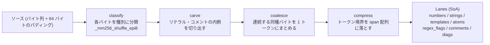

## 何を学んだか

**oxc にはレキサが 2 つある。** これを取り違えると読みを外す。

|                | `crates/oxc_parser/src/lexer/`            | `crates/oxc_lexer`                     |
| -------------- | ----------------------------------------- | -------------------------------------- |
| 使われているか | **パーサを駆動している**                  | **どこからも呼ばれていない**           |
| publish        | パーサの一部                              | `publish = false`                      |
| 方式           | オンデマンドに 1 トークンずつ             | ソース全体を一括処理                   |
| SIMD           | 明示的な intrinsics なし (自動ベクトル化) | **AVX2/BMI2 の intrinsics を直書き**   |
| トークン型     | `Kind`                                    | `TokenKind` (別の型)                   |
| 出力           | `Token` (`u128`)                          | SoA の「レーン」群                     |
| 検証           | test262 など                              | **既存レキサを oracle にした差分検証** |

`oxc_parser` の `Cargo.toml` に `oxc_lexer` への依存はない。**依存しているのは `tasks/coverage` だけ**で、しかもオプショナル feature になっている。

```toml title="tasks/coverage/Cargo.toml"
[features]
# Differential lexer conformance. `oxc_lexer`'s SIMD core only exists on x86_64
# with static AVX2/BMI2 (it compiles to an empty stub otherwise), so the harness
# is opt-in and its cfg sites mirror the lexer's crate gate:
#   RUSTFLAGS="-C target-feature=+avx2,+bmi2" cargo coverage --features lexer -- lexer
lexer = ["dep:oxc_lexer", "oxc_lexer/oxc_diagnostics"]
```

このページは「速いレキサの作り方」より、**「新しい実装を、既存実装を壊さずにどう育てるか」**として読むほうが得るものが多い。

## なぜそうなっているか

### 一括処理にすると何が変わるか

[既存レキサ](./on-demand-tokens/)は「パーサが要求したら次のトークンを 1 個作る」形だった。`oxc_lexer` は逆に、**ソース全体を最初から最後まで舐めてトークン列を作る。**

理由は SIMD との相性にある。AVX2 は 32 バイトを一度に処理するので、「1 トークンだけ作って止まる」形にすると、レジスタに載せた 32 バイトのほとんどを捨てることになる。**一括処理なら、載せた 32 バイトを全部使い切れる。**

処理は 5 段のパイプラインになっている。

```rust title="crates/oxc_lexer/src/pipeline/mod.rs"
mod bitmap;
mod carve;
mod classify;
mod coalesce;
mod compress;
mod find;
mod keywords;
mod regex_div;
mod replay;
```



`classify` の中身を見ると、テーブル引きが SIMD のシャッフル命令になっている。

```rust title="crates/oxc_lexer/src/pipeline/classify.rs"
    let h = _mm256_xor_si256(_mm256_shuffle_epi8(pa, v), _mm256_shuffle_epi8(pb, hn));
    let o0 = _mm256_shuffle_epi8(pt0, h);
    let o1 = _mm256_shuffle_epi8(pt1, h);
    let ord = _mm256_blendv_epi8(o0, o1, _mm256_slli_epi16::<3>(h));
    let ctl = _mm256_cmpgt_epi8(_mm256_set1_epi8(0x20), v);
    _mm256_blendv_epi8(ord, v96, ctl)
```

`_mm256_shuffle_epi8` は「16 要素のテーブルを 32 バイト分まとめて引く」命令になる。[既存レキサの 256 要素ジャンプテーブル](./byte-handlers/)が 1 バイトずつだったのに対し、こちらは 32 バイト分の分類を数命令で終える。

代わりに、テーブルが 16 要素に収まるよう**分類の設計そのものを変えている**。2 つのシャッフルを XOR で組み合わせて 256 通りを表現する仕掛けになっていて、`PH_A` / `PH_B` / `PH_T0` / `PH_T1` という 4 つの 16 バイトテーブルがそのために用意されている。

### 出力が SoA の「レーン」

```rust title="crates/oxc_lexer/src/lanes.rs"
#[derive(Default)]
pub struct Lanes {
    pub numbers: Vec<f64>,
    pub strings: Vec<StringSpan>,
    pub templates: Vec<StringSpan>,
    pub atoms: Vec<StringSpan>,
    pub regex_flags: Vec<u8>,
    pub cooked: Vec<u8>,
    pub comment_meta: Vec<u8>,
    pub comments: Vec<oxc_ast::ast::Comment>,
    /// Lexer diagnostics, pushed only on cold error paths; empty for valid input.
    pub diags: Vec<Diagnostic>,
    // ...
}
```

**`lanes` は SIMD のレーンではなく「出力チャネル」の意味**になる。数値は `numbers` に、文字列は `strings` に、というふうに種類別の配列に分かれる。

トークン列本体 (`tok_kinds` と `tok_spans`) とは別に、**「そのトークンの中身」だけを種類別に集めた配列**が並ぶ形だ。[semantic の SoA](./data-oriented-scoping/) と同じ発想で、後段が「数値だけ全部欲しい」と言ったときに連続で読める。

エラーの扱いも書いてある。

```rust title="crates/oxc_lexer/src/lanes.rs"
    /// Lexer diagnostics, pushed only on cold error paths; empty for valid input.
    pub diags: Vec<Diagnostic>,
```

`unicode_leads` のコメントが、この設計の考え方をよく表している。

```rust title="crates/oxc_lexer/src/lanes.rs"
    /// Positions of non-whitespace non-ASCII lead bytes, recorded by
    /// `misc_pre` before carve clears literal interiors. Resolved at drain:
    /// leads inside literal tokens are legal content and drop cheaply; only
    /// code-level survivors pay the identifier-char check. Empty for
    /// pure-ASCII input.
    pub unicode_leads: Vec<u32>,
```

**非 ASCII バイトの位置を「とりあえず全部記録しておいて、後でまとめて判定する」。** SIMD の主経路では分岐を作らず、例外的なものを後段に回す。純 ASCII のソースならこの配列は空になる。

### パディングが API 契約になっている

```rust title="crates/oxc_lexer/src/lib.rs"
pub const PAD: usize = 64;
```

```rust title="crates/oxc_lexer/src/lib.rs"
/// # Panics
/// Panics if `src` does not extend at least [`PAD`] zeroed bytes past `len`,
/// or if the arena's token buffers are smaller than `len + PAD`.
pub fn lex_utf8_arena(src: &[u8], len: u32, options: LexOptions, arena: &mut Arena) -> LexResult {
```

**呼び出し側に「ソースの後ろに 64 バイトのゼロを付けろ」と要求する。** SIMD は 32 バイト単位で読むので、ソース末尾を跨いで読んでも安全なようにパディングが要る。境界チェックを毎回やる代わりに、契約にして消している。

assertion のメッセージが丁寧で、理由まで書いてある。

```rust title="crates/oxc_lexer/src/lib.rs"
    assert!(
        arena.tok_kinds_capacity as usize >= n + PAD
            && arena.tok_spans_capacity as usize >= n + PAD,
        "lexer: arena token capacity too small for source len {n} (tok_kinds={}, tok_spans={}); need >= n + {PAD} \
         — build_spans writes a full 4-lane group past the last token and the pipeline appends EOF sentinels",
        arena.tok_kinds_capacity,
        arena.tok_spans_capacity
    );
```

「`build_spans` が最後のトークンの先に 4 レーン分書き、パイプラインが EOF センチネルを足すから」。**契約違反のメッセージが、なぜその契約が要るかを説明している。**

### lint ポリシーを局所的に緩める

SIMD のコードは、通常の Rust の書き方の作法と衝突する。

```rust title="crates/oxc_lexer/src/pipeline/mod.rs"
// Kernel lint policy (this module tree, `lanes`, `opmap`, `tables`): the
// `unsafe fn` boundary is the reviewed surface, and the pedantic/nursery
// style lints fight the SIMD idiom. API modules keep the full workspace bar.
#![allow(unsafe_op_in_unsafe_fn, clippy::missing_safety_doc, clippy::undocumented_unsafe_blocks)]
#![allow(clippy::pedantic, clippy::nursery)]
```

**「このモジュール群では lint を緩める。ただし `unsafe fn` の境界がレビュー対象で、API モジュールは通常の基準を維持する」**と明示している。

`undocumented_unsafe_blocks` を許可するというのは大きな緩和で、oxc の他の場所では SAFETY コメントが厳格に要求されている ([アリーナ](./bump-allocator/)、[multi_index_vec](./data-oriented-scoping/))。**「カーネル」と呼べる小さな領域を切り出して、そこだけ別の規律にする**という判断で、範囲と理由が書かれているから成立する。

### 差分検証 — 既存レキサを oracle にする

新しいレキサが正しいことをどう確かめるか。答えは「既存のレキサと比べる」になる。

```rust title="tasks/coverage/src/lexer_diff.rs"
fn lexer_stream(
    code: &str,
    source_type: SourceType,
) -> (Vec<(u32, u32)>, Vec<oxc_lexer::Diagnostic>) {
    let n = code.len();
    // `lex_utf8` requires >= n + 64 bytes of trailing padding.
    let mut buf = Vec::with_capacity(n + 64);
    buf.extend_from_slice(code.as_bytes());
    buf.resize(n + 64, 0);
    // ...
    let (result, arena) = oxc_lexer::lex_utf8(&buf, n as u32, options);
    let kinds = result.tok_kinds(&arena);
    let token_spans = result.tok_spans(&arena);

    let mut spans = Vec::with_capacity(kinds.len());
    for (i, &kind) in kinds.iter().enumerate() {
        if kind == oxc_lexer::TokenKind::Eof || kind.is_trivia() {
            continue;
        }
        spans.push((token_spans[i].start, token_spans[i].end));
    }
    // ...
}
```

```rust title="tasks/coverage/src/lexer_diff.rs"
fn oracle_stream(
    code: &str,
    source_type: SourceType,
) -> Option<(Vec<(u32, u32)>, Vec<OxcDiagnostic>)> {
    let allocator = Allocator::default();
    let ret = Parser::new(&allocator, code, source_type).with_config(TokensParserConfig).parse();
    if ret.panicked {
        return None;
    }
    let spans = ret.tokens.iter().map(|t| (t.start(), t.end())).collect();
    let errors = ret.diagnostics.errors().cloned().collect();
    Some((spans, errors))
}
```

**oracle 側は `TokensParserConfig` を使う** — [トークン列を貯める設定](./on-demand-tokens/)だ。パーサを通してトークン列を取り出し、新レキサの出力と比べる。

比較の粒度が現実的になっている。

- **trivia (空白・コメント) は除外する。** 2 つのレキサで trivia の切り方が違いうるが、それは本質的な差ではない
- **`TokenKind` ではなく span を比べる。** `Kind` と `TokenKind` は別の型なので、そもそも直接比較できない。**「どこからどこまでが 1 トークンか」だけを比べる**
- **診断はメッセージとラベル位置で比べる。** `diag_key` がその正規化を担う
- **oracle が panic したケースはスキップする。** 既存レキサ自体が扱えない入力で新実装を責めない

比較対象は test262 / Babel / TypeScript のテストスイート全体になる。**「網羅的なテストケースを持つ既存実装がある」という状況を、新実装の検証に使い切っている。**

### なぜこの状態でリポジトリに置いてあるのか

`publish = false` で、どこからも呼ばれず、x86_64 + AVX2 + BMI2 でしかコンパイルされない (それ以外では空のスタブになる)。

それでもリポジトリにある理由は、**この状態が「開発中」の正しい形だから**だと読める。

- **main ブランチに入っているので、腐らない。** 長命な feature ブランチだと、AST が変わるたびにコンフリクトする
- **差分検証が CI で回せる。** ブランチにあると、既存レキサの変更と同時に検証できない
- **本番経路に載っていないので、壊れてもユーザーに影響しない**

`RUSTFLAGS` で明示的に有効化しないとコンパイルすらされないので、通常のビルドには 1 バイトも入らない。

## ソースコードのどこか

- [`crates/oxc_lexer/README.md`](https://github.com/oxc-project/oxc/blob/apps_v1.81.0/crates/oxc_lexer/README.md) — 現状の到達点
- [`crates/oxc_lexer/src/pipeline/`](https://github.com/oxc-project/oxc/blob/apps_v1.81.0/crates/oxc_lexer/src/pipeline/) — 5 段のパイプライン
- [`crates/oxc_lexer/src/lanes.rs`](https://github.com/oxc-project/oxc/blob/apps_v1.81.0/crates/oxc_lexer/src/lanes.rs) — SoA の出力 (51KB)
- [`crates/oxc_lexer/src/pipeline/classify.rs`](https://github.com/oxc-project/oxc/blob/apps_v1.81.0/crates/oxc_lexer/src/pipeline/classify.rs) — AVX2 の分類
- [`tasks/coverage/src/lexer_diff.rs`](https://github.com/oxc-project/oxc/blob/apps_v1.81.0/tasks/coverage/src/lexer_diff.rs) — 差分検証

README が現状を正直に書いている。

```markdown title="crates/oxc_lexer/README.md"
A spec compliant standalone lexer for JS/JSX/TS.

## Overview

- Test262 compliant.
- TS/JSX Working
- UTF-8 validation costs 0.15CPB (Cycles per byte), optional parameter.
- SIMD in x86_64 AVX2, Scalar for every other platform currently (in progress).
- Regex vs Division cases should be handled even in pathological cases.
```

「(in progress)」と書いてある。**到達しているところと、していないところが両方書いてある。**

なお `regex_div.rs` が 74KB あるのが目を引く。`/` が除算か正規表現かの判定は、[JS の文法が文脈依存である](./lexing-and-parsing/)ことの典型例で、一括処理のレキサでは特に難しくなる。パーサからの文脈が使えないので、レキサ側で完結させる必要がある。

## どう活かすか

**同じ責務の実装を 2 つ並べるのは、条件が揃えば正しい選択になる。** 条件は「既存実装が oracle になる」ことと「新実装が本番経路に載っていない」ことの 2 つ。長命なブランチで育てるより、main に置いて CI で差分を取るほうが腐らない。

**差分検証の粒度は、本質的な差だけを見るように設計する。** oxc は trivia を除外し、`TokenKind` ではなく span を比べ、oracle が panic したケースを飛ばしている。**全部を厳密に比べようとすると、本質的でない差でノイズだらけになって誰も見なくなる。**

**「カーネル」を切り出して、そこだけ規律を変える。** SIMD のコードに通常の lint を適用すると書けない。範囲 (どのモジュール)、理由 (SIMD のイディオムと衝突する)、代わりの防衛線 (`unsafe fn` の境界がレビュー対象)、境界の外側 (API モジュールは通常の基準) を明示すれば、緩和は正当化できる。

**性能のための契約は、呼び出し側に押し付けてよい。** 「ソースの後ろに 64 バイトのゼロを付けろ」は面倒だが、その代わりに境界チェックが全部消える。**契約違反の assertion メッセージに、なぜその契約が要るかを書く**のが条件になる。

**未完成であることを README に書く。** 「(in progress)」「Scalar for every other platform currently」。読む人が「これは今どこまでできているのか」を知れる。**できていることだけを書いた README は、後から読む人を確実に誤らせる。**
