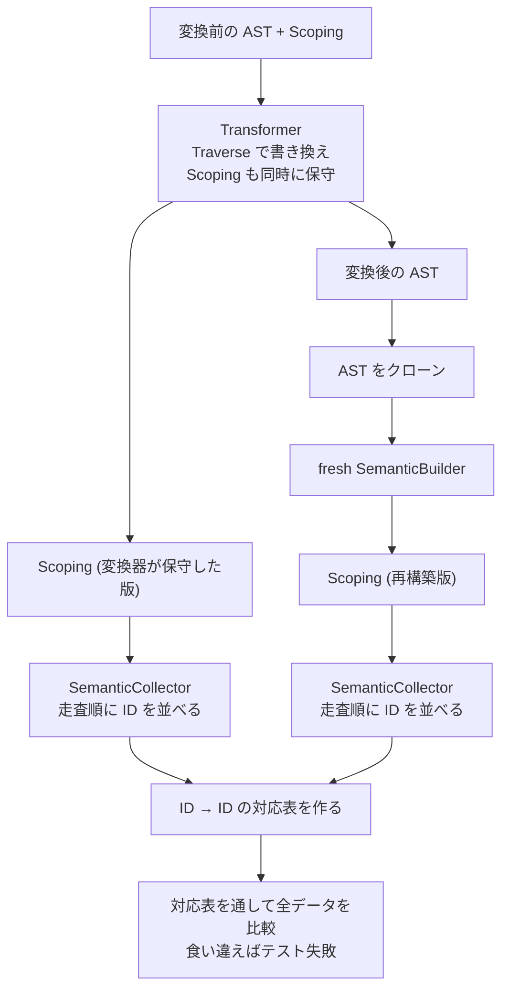

## 何を学んだか

Transformer がやることは 3 系統ある。

- **TypeScript の消去** — 型注釈、`interface`、`type`、`enum` の展開
- **JSX の変換** — `<div />` を `_jsx("div")` に
- **構文のダウンレベル** — アロー関数を `function` に、クラスフィールドを代入に、`??=` を `if` に

実装は [`Traverse`](./traverse-vs-visitmut/) の 1 実装で、**AST を 1 回歩く間に全部の変換を順番に呼ぶ。**

```rust title="crates/oxc_transformer/src/lib.rs"
        let mut reusable_ctx = ReusableTraverseCtx::new(self.state, scoping, allocator);
        traverse_mut_with_ctx(&mut transformer, program, &mut reusable_ctx);
        let (mut state, scoping) = reusable_ctx.into_state_and_scoping();
```

**入力に `Scoping` を取り、出力にも `Scoping` を返す。** これが Transformer の性格を決めている。AST を書き換えると、スコープもシンボルも参照も変わる。**変換器はその整合性を自分で保守する責任を負う。**

```rust title="crates/oxc_transformer/src/lib.rs"
/// Result of running [`Transformer::build_with_scoping`].
#[non_exhaustive]
pub struct TransformerReturn {
    /// Diagnostics produced during transformation.
    pub diagnostics: Diagnostics,
    /// Updated semantic scoping after all transforms have run.
    pub scoping: Scoping,
```

そしてその保守が正しいかを確かめる仕組みが `tasks/transform_checker` になる。

## なぜそうなっているか

### 1 パスで全部やる

```rust title="crates/oxc_transformer/src/lib.rs"
struct TransformerImpl<'a> {
    // NOTE: all callbacks must run in order.
    // Keep `TransformOptions` field order and docs in sync with this order.
    x0_typescript: Option<TypeScript<'a>>,
    decorator: Decorator<'a>,
    plugins: Plugins<'a>,
    x1_jsx: Jsx<'a>,
    x2_es2026: ES2026<'a>,
    x2_es2022: ES2022<'a>,
    x2_es2021: ES2021,
    x2_es2020: ES2020<'a>,
    x2_es2019: ES2019,
    x2_es2018: ES2018<'a>,
    x2_es2017: ES2017<'a>,
    x2_es2016: ES2016<'a>,
    #[expect(unused)]
    x3_es2015: ES2015<'a>,
    x4_regexp: RegExp,
    common: Common<'a>,
}
```

**フィールド名の接頭辞 `x0_` `x1_` `x2_` が実行順序を表している。** そして「全てのコールバックは順番に実行されなければならない」というコメントが付いている。

順序が重要なのは、変換に依存関係があるからだ。TypeScript の消去を先にやらないと、JSX 変換が型注釈に混乱する。ES2022 のクラスフィールドを ES2015 のクラス変換より先にやらないと、変換対象が消えている。

`Traverse` の各メソッドは、順番に委譲するだけになる。

```rust title="crates/oxc_transformer/src/lib.rs"
impl<'a> Traverse<'a, TransformState<'a>> for TransformerImpl<'a> {
    fn enter_program(&mut self, program: &mut Program<'a>, ctx: &mut TraverseCtx<'a>) {
        if let Some(typescript) = self.x0_typescript.as_mut() {
            typescript.enter_program(program, ctx);
        }
        self.plugins.enter_program(program, ctx);
        self.x1_jsx.enter_program(program, ctx);
        self.x2_es2026.enter_program(program, ctx);
    }

    fn exit_program(&mut self, program: &mut Program<'a>, ctx: &mut TraverseCtx<'a>) {
        self.decorator.exit_program(program, ctx);
        self.x1_jsx.exit_program(program, ctx);
        if let Some(typescript) = self.x0_typescript.as_mut() {
            typescript.exit_program(program, ctx);
        }
        self.x2_es2022.exit_program(program, ctx);
        self.x2_es2020.exit_program(program, ctx);
        self.x2_es2018.exit_program(program, ctx);
        self.common.exit_program(program, ctx);
    }
```

**`enter` と `exit` で呼ぶ順序も、呼ぶ相手も違う。** `exit_program` では `decorator` が最初で、`typescript` が 3 番目になる。Babel のプラグイン順序を再現するために、こうなっている。

**この委譲コードは手書き**で、ast_tools の生成物ではない。変換ごとに「どのノードで何をするか」が違うので、生成できない。

```rust title="crates/oxc_transformer/src/lib.rs"
    // ALPHASORT
    fn enter_arrow_function_expression(
```

`// ALPHASORT` というマーカーが入っている。**この位置から下はアルファベット順**という規約で、1000 行を超える委譲コードの中で目的のメソッドを探せるようにしている。

`x3_es2015` に `#[expect(unused)]` が付いているのが目を引く。**ES2015 の変換は現時点でどの `Traverse` メソッドにも委譲されていない** — 構造体としては存在するが、まだ配線されていない。開発途上であることが型で見える。

### スコープを保守する難しさ

`if (x) enum Foo {}` を変換すると `if (x) {}` になる。このとき、

- `enum Foo` のスコープが消える
- `{}` のブロックスコープが**新しく作られる**
- そのブロックの中のシンボルは、新しいスコープに属する

[`TraverseCtx` のスコープ操作](./traverse-ctx/) (`insert_scope_below_statement`、`remove_scope_for_expression`) がこのためにある。

**保守を間違えても、AST 自体は正しく見える。** 出力コードは動く。壊れるのは、その後で `Scoping` を使う側 ([Mangler](./minifier-and-mangler/) や lint) になる。テストで気づきにくい種類のバグだ。

### transform_checker — 再構築して突き合わせる

```rust title="tasks/transform_checker/src/lib.rs"
//! Utility to check correctness of `ScopeTree` and `SymbolTable` after transformer has run.
//!
//! ## What it's for
//!
//! The transformer should keep `ScopeTree` and `SymbolTable` in sync with the AST as it makes changes.
//! This utility checks the correctness of the semantic data after transformer has processed AST,
//! to make sure it's working correctly.
//!
//! ## How
//!
//! We do this by:
//! 1. Taking `ScopeTree` and `SymbolTable` after transformer has run.
//! 2. Cloning the post-transform AST.
//! 3. Running a fresh semantic analysis on that AST.
//! 4. Comparing the 2 copies of `ScopeTree` and `SymbolTable` from after the transformer
//!    vs from the fresh semantic analysis.
```

**変換後の AST から semantic を作り直し、変換器が保守した `Scoping` と比べる。**

[dispatch 表の二重実行](./rule-dispatch/)や[fix 後の再パース](./auto-fix/)と同じ形だが、比較が単純ではない。

````rust title="tasks/transform_checker/src/lib.rs"
//! ## Complication
//!
//! The complication is in the word "match".
//!
//! For example if this is the original input:
//! ```ts
//! if (x) enum Foo {}
//! function f() {}
//! ```
//!
//! The output of transformer is:
//! ```js
//! if (x) {}
//! function f() {}
//! ```
````

````rust title="tasks/transform_checker/src/lib.rs"
//! After transform:
//! ```js
//! // Scope ID 0
//! if (x) { /* Scope ID 3 */ } // <-- newly created scope
//! function f() { /* Scope ID 2 */ }
//! ```
//!
//! vs fresh semantic analysis of post-transform AST:
//! ```js
//! // Scope ID 0
//! if (x) { /* Scope ID 1 */ } // <-- numbered 1 as it's 2nd scope in visitation order
//! function f() { /* Scope ID 2 */ }
//! ```
````

**ID そのものは一致しない。** 変換器が新しく作ったスコープは末尾に追加されるので ID 3、再構築版は走査順で ID 1 になる。

だから比較の基準を「同型かどうか」にする。

```rust title="tasks/transform_checker/src/lib.rs"
//! However, despite the scope IDs being different, these 2 sets of semantic data *are* equivalent.
//! The scope IDs are different, but they represent the same scopes.
//! i.e. IDs don't need to be equal, but they do need to used in a consistent pattern between the 2
//! semantic data sets. If scope ID 3 is used in the post-transform semantic data everywhere that
//! scope ID 1 is used in the rebuilt semantic data, then the 2 are equivalent, and the tests pass.
//!
//! Same principle for `SymbolId`s and `ReferenceId`s.
```

**「ID の値」ではなく「ID の使われ方のパターン」が一致するかを見る。**

対応付けの方法も書いてある。

```rust title="tasks/transform_checker/src/lib.rs"
//! ## Mechanism for matching
//!
//! `SemanticCollector` visits the AST, and builds lists of `ScopeId`s, `SymbolId`s and `ReferenceId`s
//! in visitation order. We run `SemanticCollector` once on the AST coming out of the transformer,
//! and a 2nd time on the AST after the fresh semantic analysis.
```

**走査順で ID を並べれば、2 つのリストの同じ位置が同じスコープを指す。** そこから ID → ID の対応表を作り、それを使って全データを比較する。



**「グラフの同型性を、走査順という正準順序で判定する」**という一般的な手法になる。

### なぜ Semantic が必須なのか

Transformer は `build_with_scoping(scoping, program)` という API で、`Scoping` を要求する。

理由は 2 つある。

**1. 変換の判断に要る。** 「この識別子はどのシンボルを指すか」が分からないと、安全な変換ができない。`Symbol` が同じかどうかで、シャドーイングを避けた変換になる。

**2. 出力に要る。** 新しい変数を作るには [UID 生成](./traverse-ctx/)が要り、それには「既存の名前一覧」が要る。

対照的に、[Codegen は Semantic なしでも動く](./codegen/)。**「読むだけ」の段は Semantic を必須にしない**という線引きになっている。

### プリセットの構造が Babel に対応している

```rust title="crates/oxc_transformer/src/lib.rs"
//! References:
//! * <https://www.typescriptlang.org/tsconfig#target>
//! * <https://babel.dev/docs/presets>
//! * <https://github.com/microsoft/TypeScript/blob/v5.6.3/src/compiler/transformer.ts>
```

```rust title="crates/oxc_transformer/src/lib.rs"
// Presets: <https://babel.dev/docs/presets>
mod es2015;
mod es2016;
mod es2017;
mod es2018;
mod es2019;
mod es2020;
mod es2021;
mod es2022;
mod es2026;
mod jsx;
mod proposals;
mod regexp;
mod typescript;
```

**モジュール名が Babel のプリセット名に対応している。** `es2015` には `ArrowFunctionsOptions`、`es2022` には `ClassPropertiesOptions`。Babel の設定をそのまま持ってこられる。

`options::babel::BabelOptions` という型もあり、Babel の設定ファイルを読める。**互換性を「オプションの型」のレベルで実現している。**

### JSX プラグマのコメント走査

```rust title="crates/oxc_transformer/src/lib.rs"
        if program.source_type.is_jsx()
            && let Some(first_statement) = program.body.first()
        {
            // Only scan comments before the first statement for pragmas,
            // since pragmas are file-level directives (aligned with TypeScript and SWC).
            let leading_comments_end =
                program.comments.partition_point(|c| c.span.start < first_statement.span().start);
            jsx::update_options_with_comments(
                &program.comments[..leading_comments_end],
                &mut self.typescript,
                &mut self.jsx,
                &self.state,
            );
        }
```

`/** @jsx h */` のようなプラグマコメントで、JSX の変換先を指定できる。

**最初の文より前のコメントだけを見る。** `partition_point` は二分探索なので、コメントが 1000 個あっても対数時間で境界が見つかる (`program.comments` は位置順にソートされている)。

「TypeScript と SWC に合わせた」と書いてあるのが、この種の細部で重要になる。**ファイルの途中に `@jsx` を書いても効かない**という挙動は、実装によって違いうる。

## ソースコードのどこか

- [`crates/oxc_transformer/src/lib.rs`](https://github.com/oxc-project/oxc/blob/apps_v1.81.0/crates/oxc_transformer/src/lib.rs) — `Transformer` と `TransformerImpl`
- [`crates/oxc_transformer/src/typescript/`](https://github.com/oxc-project/oxc/blob/apps_v1.81.0/crates/oxc_transformer/src/) — TS 消去
- [`crates/oxc_transformer/src/jsx/`](https://github.com/oxc-project/oxc/blob/apps_v1.81.0/crates/oxc_transformer/src/) — JSX 変換
- [`crates/oxc_transformer/src/common/`](https://github.com/oxc-project/oxc/blob/apps_v1.81.0/crates/oxc_transformer/src/) — ヘルパの読み込みなど共通機能
- [`tasks/transform_checker/`](https://github.com/oxc-project/oxc/blob/apps_v1.81.0/tasks/transform_checker/) — semantic の再構築と突き合わせ

`common/helper_loader.rs` は、Babel の `@babel/runtime` ヘルパを import する仕組みになる。`TransformerReturn` の `helpers_used` がその記録だが、`#[deprecated = "Internal usage only"]` が付いている。**公開したが内部用途だと後から判明したフィールド**で、`#[non_exhaustive]` と組み合わせて段階的に消していく形になっている。

## どう活かすか

**「1 パスで全部やる」か「段ごとに複数パス」かは、依存関係の複雑さで決まる。** oxc は 1 パスにして、変換器の**フィールド順**で実行順序を表現した。パスを分けると木を何度も歩くが、順序が明示的になる。1 パスは速いが、`enter` と `exit` で呼ぶ順序が違うといった細部が委譲コードに埋もれる。

**実行順序が意味を持つなら、名前で表す。** `x0_typescript` `x1_jsx` `x2_es2022` という接頭辞は、フィールドを並べ替えられないようにする効果もある。**規約をコメントで書くより、名前に埋め込むほうが守られる。**

**「派生データを保守する」変換には、再構築して突き合わせる検査を用意する。** キャッシュ、インデックス、逆引きテーブル。元データを書き換えながら派生データを更新する処理は、間違えても即座には壊れない。**「作り直したものと比べる」が最も確実な検査**になる。

**同型性の比較は、正準順序を決めてから。** ID が違っても構造が同じなら等価、という比較は「走査順で並べて対応表を作る」で実現できる。グラフやツリーの比較で一般に使える手になる。

**互換性は「オプションの型」から作る。** Babel のプリセット名をモジュール名にし、Babel の設定を読む型を用意すれば、利用者は移行しやすい。**内部構造を相手に合わせる**のは、API を合わせるより効く。

**未配線のコードには `#[expect(unused)]` を付けておく。** `x3_es2015` が使われていないことが、警告の抑制属性として明示されている。消すのではなく残して、未完成であることを型で示す。
