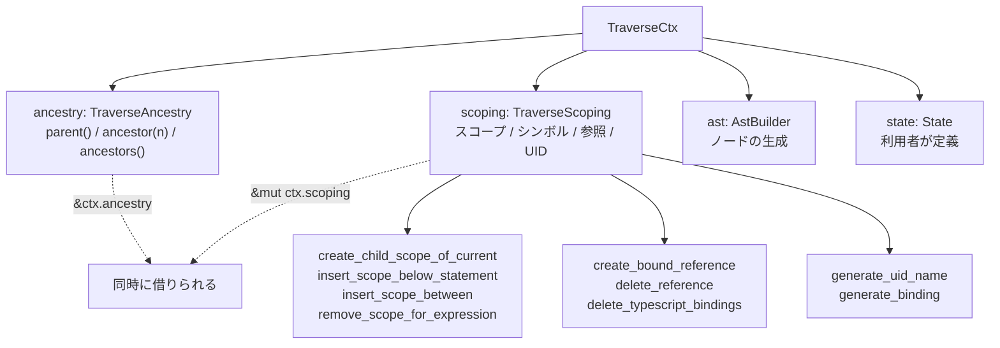

## 何を学んだか

[`Traverse`](./traverse-vs-visitmut/) の `enter_*` / `exit_*` は、ノードへの `&mut` と `&mut TraverseCtx` を受け取る。この `TraverseCtx` が、AST を書き換えるための道具を全部持っている。

```rust title="crates/oxc_traverse/src/context/mod.rs"
/// Traverse context.
///
/// Passed to all AST visitor functions.
///
/// Provides ability to:
/// * Query parent/ancestor of current node via [`parent`], [`ancestor`], [`ancestors`].
/// * Get scopes tree and symbols table via [`scoping`] and [`scoping_mut`],
///   [`ancestor_scopes`].
/// * Create AST nodes via AST builder [`ast`].
/// * Allocate into arena via [`alloc`].
```

やることが 4 つある。**祖先を見る**、**スコープとシンボルを読み書きする**、**AST ノードを作る**、**アリーナに確保する**。

同じ API が 2 通りで提供されているのが特徴になる。

```rust title="crates/oxc_traverse/src/context/mod.rs"
/// | Direct                   | Namespaced                       |
/// |--------------------------|----------------------------------|
/// | `ctx.parent()`           | `ctx.ancestry.parent()`          |
/// | `ctx.current_scope_id()` | `ctx.scoping.current_scope_id()` |
/// | `ctx.alloc(thing)`       | `ctx.ast.alloc(thing)`           |
```

## なぜそうなっているか

### 名前空間が必要な理由が doc にある

````rust title="crates/oxc_traverse/src/context/mod.rs"
/// Purpose of the "namespaces" is to support if you want to mutate scope tree or symbol table
/// while holding an `&Ancestor`, or AST nodes obtained from an `&Ancestor`.
///
/// For example, this will not compile because it attempts to borrow `ctx`
/// immutably and mutably at same time:
///
/// ```nocompile
/// fn enter_unary_expression(&mut self, unary_expr: &mut UnaryExpression<'a>, ctx: &mut TraverseCtx<'a>) {
///     // `right` is ultimately borrowed from `ctx`
///     let right = match ctx.parent() {
///         Ancestor::BinaryExpressionLeft(bin_expr) => bin_expr.right(),
///         _ => return,
///     };
///
///     // Won't compile! `ctx.scopes_mut()` attempts to mut borrow `ctx`
///     // while it's already borrowed by `right`.
///     let scope_tree_mut = ctx.scopes_mut();
///
///     // Use `right` later on
///     dbg!(right);
/// }
/// ```
````

**`ctx.parent()` は `&ctx` を借りるので、その戻り値が生きている間 `ctx.scopes_mut()` (`&mut ctx`) が呼べない。**

Rust の借用は構造体単位ではなくフィールド単位で分割できるが、**メソッド越しだと分割されない。** `ctx.parent()` のシグネチャは `&self` を取るので、コンパイラは「`ctx` 全体を借りた」と見る。

解決はフィールドを直接触ることになる。

````rust title="crates/oxc_traverse/src/context/mod.rs"
/// You can fix this by using the "namespaced" methods instead.
/// This works because you can borrow `ctx.ancestry` and `ctx.scoping` simultaneously:
///
/// ```
/// fn enter_unary_expression(&mut self, unary_expr: &mut UnaryExpression<'a>, ctx: &mut TraverseCtx<'a, ()>) {
///     let right = match ctx.ancestry.parent() {
///         Ancestor::BinaryExpressionLeft(bin_expr) => bin_expr.right(),
///         _ => return,
///     };
///
///     let scoping_mut = ctx.scoping.scoping_mut();
///
///     dbg!(right);
/// }
/// ```
````

`ctx.ancestry.parent()` は `&ctx.ancestry` を借り、`ctx.scoping.scoping_mut()` は `&mut ctx.scoping` を借りる。**フィールドが違うので同時に借りられる。**

これは Rust の借用検査の性質そのもので、回避策としては素直な部類になる。**ただし利用者がその事情を知らないと、なぜ 2 通りあるのか分からない。** だから doc に「コンパイルしない例」と「する例」を並べている。

### スコープを操作する API

```rust title="crates/oxc_traverse/src/context/scoping.rs"
    pub fn create_child_scope(&mut self, parent_id: ScopeId, flags: ScopeFlags) -> ScopeId
    pub fn create_child_scope_of_current(&mut self, flags: ScopeFlags) -> ScopeId
    pub fn insert_scope_below_statement(&mut self, stmt: &Statement, flags: ScopeFlags) -> ScopeId
    pub fn insert_scope_below_expression(&mut self, ...) -> ScopeId
    pub fn insert_scope_below_statements(&mut self, ...) -> ScopeId
    pub fn insert_scope_between(&mut self, ...) -> ScopeId
    pub fn remove_scope_for_expression(&mut self, scope_id: ScopeId, expr: &Expression)
```

**「作る」だけでなく「間に挿入する」と「消す」がある**のが、AST を書き換える側の要求を表している。

例えばアロー関数を通常の関数に変換すると、スコープが 1 つ増える。ブロックを取り除くとスコープが減る。**そのたびに、既にあるスコープ木の親子関係を張り替える必要がある。**

`insert_scope_below_statement` は「この文の下に新しいスコープを挟み、その文の中のスコープを全部新スコープの子にする」という操作になる。子スコープを付け替えるために、[ast_tools が生成した `scopes_collector`](./ast-tools/) (86KB) が部分木のスコープを集める。

これが [Transformer](./transformer/) の難所そのものになる。**AST を書き換えるだけでなく、スコープ情報を整合させ続ける**必要がある。

### 参照の作成と削除

```rust title="crates/oxc_traverse/src/context/scoping.rs"
    pub fn create_bound_reference(&mut self, ...) -> ReferenceId
    pub fn create_unbound_reference(&mut self, ...) -> ReferenceId
    pub fn create_reference(&mut self, ...) -> ReferenceId
    pub fn create_reference_in_current_scope(&mut self, ...) -> ReferenceId
    pub fn delete_reference(&mut self, reference_id: ReferenceId, name: Ident<'_>)
    pub fn delete_reference_for_identifier(&mut self, ident: &IdentifierReference)
```

変換で識別子を消したら、その参照も[シンボルの参照リスト](./reference-resolution/)から消さないといけない。消し忘れると、`no-unused-vars` のようなルールが「使われている」と誤判定する。

`delete_typescript_bindings` があるのは、TS の型注釈を消す変換のためだ。型だけの束縛 (`interface`、`type`) をまとめて削除する。

### UID の生成 — Babel との差分が 5 点

変換では新しい変数名が要る。`_foo`、`_foo2` のような、既存の名前と衝突しないもの。

```rust title="crates/oxc_traverse/src/context/uid.rs"
/// Unique identifier generator.
///
/// When initialized with [`UidGenerator::new`], creates a catalog of all symbols and unresolved references
/// in the AST which begin with `_`.
///
/// [`UidGenerator::create`] uses that catalog to generate a unique identifier which does not clash with
/// any existing name.
///
/// Such UIDs are based on the base name provided. They start with `_` and end with digits if required to
/// maintain uniqueness. e.g. given base name of `foo`, UIDs will be `_foo`, `_foo2`, `_foo3` etc.
///
/// Roughly based on Babel's `scope.generateUid` logic, but with some differences (see below).
/// <https://github.com/babel/babel/blob/.../packages/babel-traverse/src/scope/index.ts#L501-L523>
```

アルゴリズムが表で説明されている。

```rust title="crates/oxc_traverse/src/context/uid.rs"
/// | Existing symbols | Generated UIDs                  |
/// |------------------|---------------------------------|
/// | (none)           | `_foo`, `_foo2`, `_foo3`        |
/// | `_foo`           | `_foo2`, `_foo3`, `_foo4`       |
/// | `_foo3`          | `_foo4`, `_foo5`, `_foo6`       |
/// | `__foo`          | `__foo2`, `__foo3`, `__foo4`    |
/// | `___foo5`        | `___foo6`, `___foo7`, `___foo8` |
/// | `_foo8`, `__foo` | `__foo2`, `__foo3`, `__foo4`    |
///
/// This algorithm requires at most 1 hashmap lookup and 1 hashmap insert per UID generated.
```

**「ベース名ごとに、最大の先頭アンダースコア数と最大の数字接尾辞を覚えておく」**という仕掛けで、1 UID あたりハッシュマップ操作 2 回に抑えている。

最後の行が面白い。`_foo8` と `__foo` が両方あると、生成されるのは `__foo2` から。**アンダースコアが多いほうに合わせる**ので、`_foo9` ではなく `__foo2` になる。

Babel との差分が 5 点、番号付きで列挙されている。

```rust title="crates/oxc_traverse/src/context/uid.rs"
/// # Differences from Babel
///
/// This implementation aims to replicate Babel's behavior, but differs from Babel
/// in the following ways:
///
/// 1. Does not check that name provided as "base" for the UID is a valid JS identifier name.
///    ...
/// 2. Does not convert to camel case.
///    This seems unimportant.
///
/// 3. Does not check var name against list of globals or "contextVariables"
///    (which Babel does in `hasBinding`).
///    No globals or "contextVariables" start with `_` anyway, so no need for this check.
///
/// 4. Does not check this name is unique if used as a named statement label,
///    only that it's unique as an identifier.
///
/// 5. Uses a slightly different algorithm for generating names (see above).
///    The resulting UIDs are similar enough to Babel's algorithm to fail only 1 of Babel's tests.
```

**それぞれに「なぜ省いても大丈夫か」の理由が書いてある。** 3 番は「グローバルもコンテキスト変数も `_` で始まらないから」。5 番は「Babel のテストが 1 件だけ落ちる」と定量的に書いてある。

**互換実装で「完全一致していない」と正直に書くのは価値がある。** 「Babel 互換」とだけ書かれていると、どこまで信じていいか分からない。

改善案まで残っている。

```rust title="crates/oxc_traverse/src/context/uid.rs"
/// # Potential improvements
///
/// TODO(improve-on-babel):
///
/// UID generation is fairly expensive, because of the amount of string hashing required.
///
/// [`UidGenerator::new`] iterates through every binding and unresolved reference in the entire AST,
/// and builds a hashmap of symbols which could clash with UIDs.
```

`TODO(improve-on-babel)` というタグが付いている。**「Babel 互換をやめれば改善できる」という種類の TODO** を、専用のタグで区別している。grep すれば「互換のために払っているコスト」の一覧が出る。

### `ReusableTraverseCtx`

```rust title="crates/oxc_traverse/src/lib.rs"
/// Traverse AST with a [`Traverse`] impl, reusing an existing [`ReusableTraverseCtx`].
///
/// [`ReusableTraverseCtx`] is specific to a single AST. It will likely cause malfunction if
/// `traverse_mut_with_ctx` is called with a [`Program`] and [`ReusableTraverseCtx`] which do not match.
pub fn traverse_mut_with_ctx<'a, State, Tr: Traverse<'a, State>>(
    traverser: &mut Tr,
    program: &mut Program<'a>,
    ctx: &mut ReusableTraverseCtx<'a, State>,
) {
```

**同じ AST を何度も走査するときのために、`TraverseCtx` を再利用できる。** [Minifier](./minifier-and-mangler/) は収束するまで多パス走査するので、毎回 `TraverseCtx` を作り直すのは無駄になる。

`ReusableTraverseCtx` は `TraverseCtx` を包んでいて、**外から中身を触れない。** [`TraverseAncestry` を消費者が壊せない](./traverse-vs-visitmut/)という保証がここでも要る。

doc に「別の AST と組み合わせると誤動作する」と警告があるが、型では防いでいない。**防ぐには branded lifetime が要る**という、`TraverseAncestry` の soundness hole と同じ話になる。

### `BoundIdentifier` — 名前と SymbolId をセットで持つ

```
crates/oxc_traverse/src/context/bound_identifier.rs        (13KB)
crates/oxc_traverse/src/context/maybe_bound_identifier.rs  (12KB)
```

変換で新しい変数を作ると、「名前」と「`SymbolId`」の 2 つを持ち回ることになる。参照を作るたびに両方が要る。

`BoundIdentifier` はその 2 つを 1 つにまとめた型で、`create_read_reference(ctx)` のようなメソッドを持つ。**「名前だけ持って `SymbolId` を忘れる」というバグが構造的に起きない。**

`MaybeBoundIdentifier` は `SymbolId` が `Option` の版で、未解決の参照 (グローバル変数など) を表す。

### `ast_operations`

```
crates/oxc_traverse/src/ast_operations/gather_node_parts.rs   (32KB)
crates/oxc_traverse/src/ast_operations/identifier.rs          (2KB)
```

`gather_node_parts.rs` は「AST ノードから変数名の候補を作る」。`foo.bar.baz` から `_fooBarBaz` のような名前を導く処理で、これも Babel の挙動に合わせてある。

32KB あるのは、**ノードの種類ごとに「名前として何を拾うか」が違う**からだ。呼び出し式なら callee、メンバ式なら property、リテラルなら値。

## ソースコードのどこか

- [`crates/oxc_traverse/src/context/mod.rs`](https://github.com/oxc-project/oxc/blob/apps_v1.81.0/crates/oxc_traverse/src/context/mod.rs) — `TraverseCtx` と名前空間の説明 (26KB)
- [`crates/oxc_traverse/src/context/scoping.rs`](https://github.com/oxc-project/oxc/blob/apps_v1.81.0/crates/oxc_traverse/src/context/scoping.rs) — スコープと参照の操作
- [`crates/oxc_traverse/src/context/uid.rs`](https://github.com/oxc-project/oxc/blob/apps_v1.81.0/crates/oxc_traverse/src/context/uid.rs) — UID 生成と Babel との差分
- [`crates/oxc_traverse/src/context/bound_identifier.rs`](https://github.com/oxc-project/oxc/blob/apps_v1.81.0/crates/oxc_traverse/src/context/) — `BoundIdentifier`
- [`crates/oxc_traverse/src/generated/scopes_collector.rs`](https://github.com/oxc-project/oxc/blob/apps_v1.81.0/crates/oxc_traverse/src/generated/scopes_collector.rs) — 部分木のスコープ収集 (87KB)



## どう活かすか

**メソッド越しの借用は構造体全体を borrow する。** フィールドを直接公開すれば分割借用ができる。oxc は両方の API を用意し、**なぜ 2 つあるかを「コンパイルしない例」で説明している。** 型システムの制約から来る API の重複は、理由を書かないと必ず「片方いらないのでは」と言われる。

**「作る」だけでなく「間に挿入する」「消す」を用意する。** 木を構築するだけの API と、木を変形する API では必要な操作が違う。スコープ木のように「AST とは別に保守される構造」があるなら、**AST の変形に対応する操作を全部揃える**必要がある。

**互換実装の差分は番号付きで列挙し、それぞれに理由を書く。** oxc の UID 生成は Babel との差分を 5 点挙げ、「camel case にしないのは重要でないから」「グローバルは `_` で始まらないから」と根拠を書いている。**「Babel のテストが 1 件だけ落ちる」という定量的な記述**があると、互換性の程度が測れる。

**「互換のために払っているコスト」に専用のタグを付ける。** `TODO(improve-on-babel)` を grep すれば、「互換をやめれば改善できる箇所」が一覧になる。通常の `TODO` と混ぜると埋もれる。

**セットで扱うべき値は 1 つの型にまとめる。** 名前と `SymbolId` を別々に持ち回ると、片方を忘れる。`BoundIdentifier` にまとめて「参照を作る」メソッドを生やせば、忘れようがない。

**アルゴリズムの説明は表にする。** UID 生成の「既存シンボル → 生成される UID」の表は、文章 20 行より正確で短い。境界ケース (`_foo8` と `__foo` が両方ある) も表なら 1 行で示せる。
