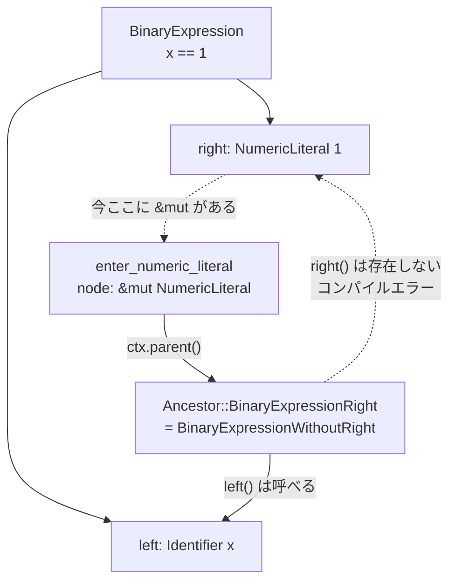

## 何を学んだか

[`VisitMut::enter_node` が `AstType` しか受け取れない](./astkind-and-visit/)理由は、Rust の借用規則だった。`&mut` で木を降りている最中に、同じ木への `&` 参照を持てない。

`oxc_traverse` はこの制約を、**「見せる範囲を狭める」**ことで回避する。

```rust title="crates/oxc_traverse/src/lib.rs"
//! The solution this crate uses is:
//! 1. Don't create references while traversing down the AST in `walk_*` functions.
//!    Use raw pointers instead. `&mut` references are only created in the `enter_*` / `exit_*` methods.
//! 2. Don't allow `enter_*` / `exit_*` to access its entire parent or ancestor, only *other branches*
//!    of the tree which lead from the parent/ancestor. The parts of the tree above current node
//!    which can be accessed via `ctx.parent()` etc **do not overlap** the part of the tree which
//!    is available via `&mut` ref inside `enter_*` / `exit_*`. This makes it impossible to obtain
//!    2 references to same AST node at same time.
//! 3. Again, don't create transient references while getting the fields of ancestors. Use raw pointers
//!    to go to the field directly, before creating a `&` ref.
```

**「木の他の枝は読めるが、自分が乗っている枝は読めない」。**

これを型で表現するために、`Ancestor` は「親の型」だけでなく**「その親のどのフィールドから降りてきたか」**を判別子に持つ。`BinaryExpression` の子に対する `Ancestor` は 2 種類ある。

```rust title="crates/oxc_traverse/src/generated/ancestor.rs"
    BinaryExpressionLeft = 28,
    BinaryExpressionRight = 29,
```

`BinaryExpressionRight` の中身は `BinaryExpressionWithoutRight` という型で、**`right()` メソッドが存在しない。** アクセスしようとするとコンパイルエラーになる。

その結果、`generated/ancestor.rs` は **607KB** になる。

## なぜそうなっているか

### 問題の説明が doc に書いてある

```rust title="crates/oxc_traverse/src/lib.rs"
//! Rust's aliasing rules are (roughly):
//! 1. For any object, you can have as many immutable `&` references simultaneously as you like.
//! 2. For any object, you cannot obtain a mutable `&mut` reference if any other references
//!    (immutable or mutable) to that same object exist.
//! 3. A `&`/`&mut` ref covers the object itself and the entire tree below it.
//!    i.e. you can't hold a `&mut` to child and any reference to parent at same time (except by
//!    "re-borrowing").
//!
//! This poses a problem for reading back up the tree in a mutating visitor.
//! In a visitor you hold a `&mut` reference to a node, so therefore cannot obtain a `&` ref to
//! its parent, because the parent owns the node. If you had a `&` ref to the parent, that also acts
//! as a `&` ref to the current node = holding `&` and `&mut` refs to same node simultaneously.
//! Disaster!
```

**3 番目のルールが核心になる。** 親への `&` は、その下にある現在ノードへの `&` でもある。だから `&mut` の現在ノードと同時に持てない。

### 「乗っている枝を切るな」

`traverse_mut` の doc に、この設計の比喩がある。

```rust title="crates/oxc_traverse/src/lib.rs"
/// Or, to state the rule more generally: You can read from any branch of the AST *except*
/// the one you are on.
///
/// A silly analogy: You are a tree surgeon working on pruning an old oak tree. You are sitting
/// on a branch high up in the tree. From that position, you can cut off other branches of the tree
/// no problem, but it would be unwise to saw off the branch that you are sitting on.
```

そして動く例が続く。

```rust title="crates/oxc_traverse/src/lib.rs"
/// impl<'a> Traverse<'a, ()> for MyTransform {
///     fn enter_numeric_literal(&mut self, node: &mut NumericLiteral<'a>, ctx: &mut TraverseCtx<'a, ()>) {
///         // Read parent
///         if let Ancestor::BinaryExpressionRight(bin_expr_ref) = ctx.parent() {
///             // This is legal
///             if let Expression::Identifier(id) = bin_expr_ref.left() {
///                 println!("left side is ID: {}", &id.name);
///             }
///
///             // This would be a compile failure, because the right side is where we came from
///             // dbg!(bin_expr_ref.right());
///         }
///
///         // Read grandparent
///         if let Ancestor::ExpressionStatementExpression(stmt_ref) = ctx.ancestor(1) {
///             // This is legal
///             println!("expression stmt's span: {:?}", stmt_ref.span());
///
///             // This would be a compile failure, because the expression is where we came from
///             // dbg!(stmt_ref.expression());
///         }
///     }
/// }
```

**コンパイルエラーになる行がコメントアウトで残っている。** doc test として動く例の中に、「これは書けない」を示す行がある。



### `Ancestor` の判別子が retag に使われる

```rust title="crates/oxc_traverse/src/generated/ancestor.rs"
/// Ancestor type used in AST traversal.
///
/// Encodes both the type of the parent, and child's location in the parent.
/// i.e. variants for `BinaryExpressionLeft` and `BinaryExpressionRight`, not just `BinaryExpression`.
///
/// `'a` is lifetime of AST nodes.
/// `'t` is lifetime of the `Ancestor` (which inherits lifetime from `&'t TraverseCtx'`).
/// i.e. `Ancestor`s can only exist within the body of `enter_*` and `exit_*` methods
/// and cannot "escape" from them.
//
// SAFETY
// * This type must be `#[repr(u16)]`.
// * Variant discriminants must correspond to those in `AncestorType`.
//
// These invariants make it possible to set the discriminant of an `Ancestor` without altering
// the "payload" pointer with:
// `*(ancestor as *mut _ as *mut AncestorType) = AncestorType::Program`.
// `TraverseCtx::retag_stack` uses this technique.
#[repr(C, u16)]
#[derive(Clone, Copy, Debug)]
pub enum Ancestor<'a, 't> {
```

**`AncestorType` (タグだけ) と `Ancestor` (ポインタ付き) が判別子を共有している。** [`AstType` と `AstKind`](./astkind-and-visit/) と同じ手口だ。

これが効くのは走査中になる。`BinaryExpression` の `left` を訪問し終えて `right` に移るとき、スタックの先頭を `BinaryExpressionLeft` から `BinaryExpressionRight` に変えたい。**ペイロード (親へのポインタ) は同じ**なので、判別子だけを上書きすればいい。

```rust title="crates/oxc_traverse/src/generated/ancestor.rs"
// `*(ancestor as *mut _ as *mut AncestorType) = AncestorType::Program`.
```

`#[repr(C, u16)]` なので判別子が先頭 2 バイトにあり、そこに `u16` を書くだけで済む。push/pop より安い。

```rust title="crates/oxc_traverse/src/lib.rs"
//! `walk_*` uses `TraverseCtx::retag_stack` to make it as cheap as possible to update the ancestry
//! stack, but this is purely a performance optimization, not essential to the safety of the scheme.
```

**「これは性能の最適化であって、安全性の仕組みには不可欠ではない」**と明記されている。安全性に効く部分と、速度に効く部分が区別されている。

### `'t` ライフタイムが「持ち出し」を禁じる

```rust title="crates/oxc_traverse/src/context/ancestry.rs"
/// `Ancestor<'a, 't>` is an owned type.
/// * `'a` is lifetime of AST nodes.
/// * `'t` is lifetime of the `Ancestor` (derived from `&'t TraverseAncestry`).
///
/// `'t` is constrained in `parent`, `ancestor` and `ancestors` methods to only live as long as
/// the `&'t TraverseAncestry` passed to the method.
/// i.e. `Ancestor`s can only live as long as `enter_*` or `exit_*` method in which they're obtained,
/// and cannot "escape" those methods.
/// This is required for soundness. If an `Ancestor` could be retained longer, the references that
/// can be got from it could alias a `&mut` reference to the same AST node.
```

**ライフタイムが 2 本ある**のが要点になる。`'a` は AST の寿命、`'t` は `Ancestor` 自体の寿命。

`parent()` は `&'t self` を取り、`Ancestor<'a, 't>` を返す。**`'t` が `&self` の借用に縛られるので、`enter_*` の外に持ち出せない。** 持ち出せたら、走査が進んだ後もその `Ancestor` から参照を作れてしまう。

スタック自体は `Ancestor<'a, 'static>` で持っていて、取り出すときに縮める。

```rust title="crates/oxc_traverse/src/context/ancestry.rs"
pub struct TraverseAncestry<'a> {
    stack: NonEmptyStack<Ancestor<'a, 'static>>,
}
```

```rust title="crates/oxc_traverse/src/context/ancestry.rs"
    #[inline]
    pub fn parent<'t>(&'t self) -> Ancestor<'a, 't> {
        let ancestor = *self.stack.last();
        // Shrink `Ancestor`'s `'t` lifetime to lifetime of `&'t self`.
        // SAFETY: The `Ancestor` is guaranteed valid for `'t`. It is not possible to obtain
        // a `&mut` ref to any AST node which this `Ancestor` gives access to during `'t`.
        unsafe { transmute::<Ancestor<'a, '_>, Ancestor<'a, 't>>(ancestor) }
    }
```

**`'static` で保存して、取り出すときに縮める。** ライフタイムの縮小は本来安全な操作 (共変) だが、`Ancestor` の中に生ポインタがあるので `transmute` が要る。

### 消費者が壊せないことを 3 段で保証する

```rust title="crates/oxc_traverse/src/context/ancestry.rs"
/// # SAFETY
/// This type MUST NOT be mutable by consumer.
///
/// The safety scheme is entirely reliant on `stack` being in sync with the traversal,
/// to prevent consumer from accessing fields of nodes which traversal has passed through,
/// so as to not violate Rust's aliasing rules.
/// If consumer could alter `stack` in any way, they could break the safety invariants and cause UB.
///
/// We prevent this in 3 ways:
/// 1. `TraverseAncestry`'s `stack` field is private.
/// 2. Public methods of `TraverseAncestry` provide no means for mutating `stack`.
/// 3. Visitors receive a `&mut TraverseCtx`, but cannot overwrite its `ancestry` field because they:
///    a. cannot create a new `TraverseAncestry`
///       - `TraverseAncestry::new` and `TraverseCtx::new` are private.
///         b. cannot obtain an owned `TraverseAncestry` from a `&TraverseAncestry`
///       - `TraverseAncestry` is not `Clone`.
```

**「なぜ消費者が壊せないか」が 3 つの理由に分解されている。** private フィールド、変更手段のない public メソッド、`TraverseAncestry` を作れないし clone もできない。

### 穴が正直に書いてある

```rust title="crates/oxc_traverse/src/context/ancestry.rs"
/// ## Soundness hole
///
/// Strictly speaking, there is still room to abuse the API and cause UB as follows:
///
/// * Initiate a 2nd traversal of a different AST inside a `Traverse` visitor method.
/// * `mem::swap` the 2 x `&mut TraverseCtx`s from the 2 different traversals.
///
/// The 2 ASTs would have to be different, but borrowed for same lifetime, so I (@overlookmotel) don't
/// think it's possible by this method to produce aliasing violations, or to over-extend AST node
/// lifetimes to cause a use-after-free.
/// But it *could* produce buffer underrun in `pop_stack`, when it tries to pop from a stack which
/// is already empty.
///
/// In practice, this would be a completely bizarre thing to do, and would basically require you to
/// write malicious code specifically designed to cause UB. So it's not a particularly real risk.
///
/// To close this hole and make the API 100% sound, we'd need branded lifetimes so that all
/// `TraverseCtx`s have unique lifetimes, and so cannot be swapped for any other without
/// the borrow-checker complaining.
```

**残っている穴、その影響の見積もり、閉じるために必要なもの (branded lifetimes) が全部書いてある。** 「100% 安全です」と書くより信用できる。

### 生成物を手で編集するなと書いてある

```rust title="crates/oxc_traverse/src/lib.rs"
//! # SAFETY
//! This crate contains a great deal of unsafe code. The entirety of `walk.rs` is unsafe functions
//! using raw pointers.
//!
//! To avoid a drain on compile time asking Rust to parse 1000s of `# SAFETY` comments, the codegen-ed
//! files do not contain comments explaining the safety of every unsafe operation.
//! But everything works according to the principles outlined above.
//!
//! Almost all the code is currently codegen-ed. I (@overlookmotel) would recommend continuing to
//! exclusively use a codegen, and not manually editing these files for "special cases". The safety
//! scheme could very easily be derailed entirely by a single mistake, so in my opinion, it's unwise
//! to edit by hand.
```

2 つのことが書かれている。

- **SAFETY コメントを個々に書かない理由** — コンパイル時間。代わりに「原則」を crate の doc にまとめた
- **手で編集するなという推奨** — 1 つの間違いで安全性の仕組み全体が崩れる

[SIMD レキサが lint を緩めている](./the-other-lexer/)のと似た判断で、**「規律の適用範囲を変えるなら、代わりの防衛線を明示する」**という形になっている。

### 走査の前後で assertion

```rust title="crates/oxc_traverse/src/lib.rs"
    // Check that `TraverseAncestry`'s stack is in correct state
    debug_assert_eq!(ctx.ancestors_depth(), 1);
    debug_assert!(matches!(ctx.parent(), Ancestor::None));

    // SAFETY: ...
    unsafe { walk_ast(traverser, program, ctx) };

    // Check that `TraverseAncestry`'s stack is in correct state
    debug_assert_eq!(ctx.ancestors_depth(), 1);
    debug_assert!(matches!(ctx.parent(), Ancestor::None));
```

**走査の前後でスタックの状態を確認する。** `walk_*` の push と pop が対応していないと、ここで落ちる。

そして `walk_ast` を呼ぶ `unsafe` ブロックの SAFETY コメントは、その前提を 4 段で並べている。

```rust title="crates/oxc_traverse/src/lib.rs"
    // SAFETY:
    // `program` is a valid pointer to a `Program<'a>` - it was created from a `&mut Program<'a>`.
    //
    // `TraverseCtx`s are always created with only `Ancestor::None` on `TraverseAncestry` stack.
    // `TraverseCtx` provides no external interfaces for caller to mutate `TraverseAncestry`,
    // so that cannot be changed by the caller.
    //
    // `walk_*` methods never alter the initial entry on `TraverseAncestry`'s stack.
    // `walk_*` methods always follow a `push` to `TraverseAncestry`'s stack with a corresponding `pop`.
    // ...
```

### `compile_fail_tests.rs`

安全性の主張をテストで確認している。

```
crates/oxc_traverse/src/compile_fail_tests.rs   (3961 bytes)
```

**「コンパイルが通らないこと」をテストする。** `bin_expr_ref.right()` が書けないという主張は、それが実際にコンパイルエラーになることでしか確かめられない。Rust の doc test には `compile_fail` 属性があり、これを使う。

## ソースコードのどこか

- [`crates/oxc_traverse/src/lib.rs`](https://github.com/oxc-project/oxc/blob/apps_v1.81.0/crates/oxc_traverse/src/lib.rs) — 設計原理の doc と `traverse_mut`
- [`crates/oxc_traverse/src/context/ancestry.rs`](https://github.com/oxc-project/oxc/blob/apps_v1.81.0/crates/oxc_traverse/src/context/ancestry.rs) — `TraverseAncestry` と soundness の議論
- [`crates/oxc_traverse/src/generated/ancestor.rs`](https://github.com/oxc-project/oxc/blob/apps_v1.81.0/crates/oxc_traverse/src/generated/ancestor.rs) — `Ancestor` (607KB)
- [`crates/oxc_traverse/src/generated/walk.rs`](https://github.com/oxc-project/oxc/blob/apps_v1.81.0/crates/oxc_traverse/src/generated/walk.rs) — 生ポインタで降りる `walk_*` (227KB)
- [`crates/oxc_traverse/src/compile_fail_tests.rs`](https://github.com/oxc-project/oxc/blob/apps_v1.81.0/crates/oxc_traverse/src/compile_fail_tests.rs) — コンパイル失敗テスト

`Traverse` トレイトの形は `Visit` に似ているが、引数が 2 つになる。

```rust title="crates/oxc_traverse/src/generated/traverse.rs"
#[expect(unused_variables)]
pub trait Traverse<'a, State> {
    #[inline]
    fn enter_program(&mut self, node: &mut Program<'a>, ctx: &mut TraverseCtx<'a, State>) {}
    #[inline]
    fn exit_program(&mut self, node: &mut Program<'a>, ctx: &mut TraverseCtx<'a, State>) {}
```

`State` という型パラメータがあり、走査中の任意の状態を持ち回せる。[Transformer](./transformer/) がこれを使う。

**`Traverse` は 2 組生成されている** — `oxc_traverse` と `oxc_minifier/src/generated/`。[ast_tools](./ast-tools/) の `TraverseGenerator` と `MinifierTraverseGenerator` がそれぞれ担当する。

## どう活かすか

**借用規則との衝突は、「見せる範囲を狭める」で解けることがある。** 「親全体は見せられないが、来た枝以外なら見せられる」。これは Rust に限らず、可変性と参照の共存が問題になる場面で一般に使える考え方になる。**型を分けて、危険なアクセスをそもそも存在させない。**

代償は大きい。`Ancestor` が 607KB になり、全部生成でしか維持できない。**「型で表現する」は、型の数が組み合わせ爆発する方向に効く**ことを覚悟する必要がある。

**判別子を共有する 2 つの型を用意すると、タグの書き換えだけで済む場面が出る。** `AncestorType` と `Ancestor` は判別子が一致するので、`retag_stack` が 2 バイトの書き込みになる。ただしこれは**性能の最適化であって安全性には不可欠でない**、と doc に書いてある。この区別が大事で、後から読む人が「これは消していい最適化か」を判断できる。

**ライフタイムを 2 本にして「持ち出し禁止」を表現する。** `Ancestor<'a, 't>` の `'t` が `&self` の借用に縛られると、コールバックの外に持ち出せない。**「この値はこのスコープでしか有効でない」を型で言える**のは Rust の強みで、ガード型と同じ発想になる。

**残っている穴を正直に書く。** `oxc_traverse` の doc は soundness hole を認めたうえで、影響の見積もりと閉じる方法を書いている。「安全です」と書いて後から穴が見つかるより、最初から書いてあるほうが信頼できる。

**「コンパイルが通らないこと」もテストする。** 型で禁止したつもりのものが実は書けてしまう、というのはよくある。`compile_fail` テストがないと、安全性の主張が検証されていないことになる。

**生成コードで安全性を担保するなら、「手で編集するな」と書く。** 1 か所の間違いで仕組み全体が崩れる種類のコードでは、生成器を通すこと自体が防衛線になる。
