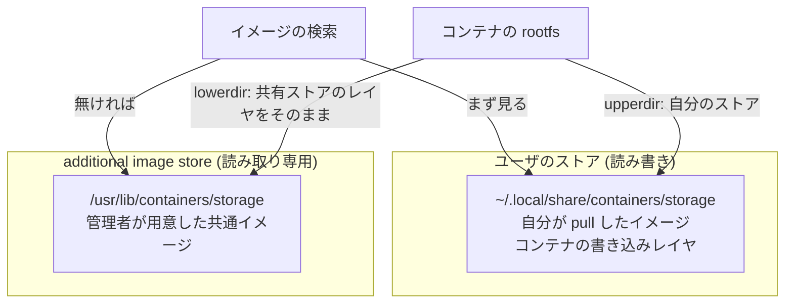

## 何を学んだか

### rootless はストアがユーザごとに分かれる

Podman では graphroot がユーザごとに分かれる (`~/.local/share/containers/storage`)。分離としては正しいが、副作用がある。**同じイメージを 10 人が使えば、ディスク上に 10 個のコピーができる**。

Docker では 1 台に 1 つの `/var/lib/docker` なので、この問題は起きない代わりに分離もない。containers/storage はこのトレードオフを、**「読み書き可能なストア 1 つ + 読み取り専用ストア N 個」** という構造で解いた。



要は **レイヤをコピーせずに lowerdir として参照する** ということだ。共有ストアの上にユーザごとの書き込み層を重ねる形になる。

### 3 種類の「別の場所」がある

storage.conf には似た設定が 3 つあり、紛らわしいので整理しておく。

| 設定                    | 何をするか                                          | 書き込み     |
| ----------------------- | --------------------------------------------------- | ------------ |
| `graphroot`             | 主ストア。レイヤもイメージもコンテナもここ          | 読み書き     |
| `imagestore`            | イメージのレイヤだけを graphroot と別の場所に置く   | 読み書き     |
| `additionalimagestores` | 他人が用意したストアを読み取り専用で重ねる (複数可) | 読み取り専用 |

`imagestore` は「イメージは大きい SSD に、コンテナの書き込み層は速いディスクに」のような分割用。`additionalimagestores` が共有のための仕組みだ。

用途として想定されているのは主に 2 つ。

1. **read-only な OS** — Fedora CoreOS のような immutable OS で、`/usr` にイメージを焼き込んでおく。ユーザは pull せずにコンテナを起動できる
2. **多人数のマシン** — 管理者が共通イメージを 1 か所に置き、各ユーザはそれを参照する

### 読み取り専用であることが安全性を作る

additional store は書き込めない。だから、

- **共有ストアを壊す事故が起きない。** ユーザが `podman rmi` しても、消えるのは自分のストアのイメージだけ
- **ロックの競合が減る。** 読むだけなので、書き込みロックの取り合いにならない
- **read-only なファイルシステム上に置ける。** そもそもロックファイルすら作れない場所でも動く必要がある

3 つ目は実装に現れていて、ロックファイルが作れない (`EROFS`) 場合は黙って読み取り専用として扱う分岐がある。

## ソースコードのどこか

### レイヤの実体を探す関数が、3 か所を順に見る

[`vendor/go.podman.io/storage/drivers/overlay/overlay.go#L1249`](https://github.com/podman-container-tools/podman/blob/v6.1.0/vendor/go.podman.io/storage/drivers/overlay/overlay.go#L1249) の `dir2` が、この仕組みの中核だ。

```go title="go.podman.io/storage/drivers/overlay/overlay.go"
func (d *Driver) dir2(id string, useImageStore bool) (string, string, bool) {
	homedir := d.home
	if useImageStore {
		homedir = d.homeDirForImageStore()
	}
	newpath := path.Join(homedir, id)
	if err := fileutils.Exists(newpath); err != nil {
		for _, p := range d.getAllImageStores() {
			l := path.Join(p, d.name, id)
			err = fileutils.Exists(l)
			if err == nil {
				return l, homedir, true
			}
		}
	}
	return newpath, homedir, false
}
```

15 行しかない。「自分の home に無ければ、すべての image store を順に見る」。3 番目の戻り値 `bool` が **「additional store で見つかった (= 書き込めない)」** を表す。

このフラグは呼び出し側で効いてくる。前ページで見た `Metadata()` を思い出すと、

```go title="go.podman.io/storage/drivers/overlay/overlay.go"
	dir, _, inAdditionalStore := d.dir2(id, false)
	...
	metadata := map[string]string{
		"WorkDir":   path.Join(dir, "work"),
		"MergedDir": d.getMergedDir(id, dir, inAdditionalStore),
		"UpperDir":  path.Join(dir, "diff"),
	}
```

`merged` ディレクトリの場所だけが `inAdditionalStore` で変わる。**マウントポイントは書き込める場所に作らなければならない** ので、レイヤの実体が読み取り専用ストアにある場合は、merged だけを自分の runroot 側に用意する。

### イメージストアの一覧を組み立てるところ

[`vendor/go.podman.io/storage/store.go#L1050-L1053`](https://github.com/podman-container-tools/podman/blob/v6.1.0/vendor/go.podman.io/storage/store.go#L1050)。

```go title="go.podman.io/storage/store.go"
	additionalImageStores := s.graphDriver.AdditionalImageStores()
	if s.imageStoreDir != "" {
		additionalImageStores = append([]string{s.graphRoot}, additionalImageStores...)
	}

	for _, store := range additionalImageStores {
		gipath := filepath.Join(store, driverPrefix+"images")
		var ris roImageStore
		// both the graphdriver and the imagestore must be used read-write.
		if store == s.imageStoreDir || store == s.graphRoot {
			imageStore, err := newImageStore(gipath)
			...
			s.rwImageStores = append(s.rwImageStores, imageStore)
			ris = imageStore
		} else {
			ris, err = newROImageStore(gipath)
```

`imagestore` を別途設定している場合、**graphroot 自体も「追加のストア」の 1 つとして扱われる**。イメージのレイヤは `imagestore` にあるが、過去に graphroot に pull したイメージも読めなければならないからだ。設定の組み合わせを、リストの先頭に足すという素直な形で吸収している。

そして read-only ストアの生成では、ロックファイルが作れない場合の扱いがある。

```go title="go.podman.io/storage/store.go"
			ris, err = newROImageStore(gipath)
			if err != nil {
				if errors.Is(err, syscall.EROFS) {
					logrus.Debugf("Ignoring creation of lockfiles on read-only file systems %q, %v", gipath, err)
```

`EROFS` (read-only file system) なら、ロックファイルの作成を諦めて先に進む。**書き込めない場所は変更されないので、そもそもロックが要らない** という理屈だ。

### レイヤストアも同じ形で重なる

[`vendor/go.podman.io/storage/store.go#L1214`](https://github.com/podman-container-tools/podman/blob/v6.1.0/vendor/go.podman.io/storage/store.go#L1214)。

```go title="go.podman.io/storage/store.go"
	for _, store := range s.graphDriver.AdditionalImageStores() {
		glpath := filepath.Join(store, driverPrefix+"layers")

		rls, err := newROLayerStore(rlpath, glpath, s.graphDriver)
		if err != nil {
			return nil, err
		}
		s.roLayerStoresUseGetters = append(s.roLayerStoresUseGetters, rls)
	}
```

イメージのメタデータだけでなく、**レイヤのメタデータも additional store から読む**。`newROLayerStore(rlpath, glpath, ...)` の引数が 2 つのパスなのが面白くて、`rlpath` は自分の runroot (一時状態、書き込む)、`glpath` は共有ストア (永続メタデータ、読むだけ)。

「読み取り専用のデータ」と「それを使うための一時状態」を別のディレクトリに分けているので、共有ストアが完全に read-only でも動く。

### 設定ファイルのコメントが用途を語る

[`vendor/go.podman.io/storage/storage.conf#L47-L49`](https://github.com/podman-container-tools/podman/blob/v6.1.0/vendor/go.podman.io/storage/storage.conf#L47)。

```toml title="go.podman.io/storage/storage.conf"
# AdditionalImageStores is used to pass paths to additional Read/Only image stores
# Must be comma separated list.
# additionalimagestores = []
```

`imagestore` の方はこう書かれている。

```toml title="go.podman.io/storage/storage.conf"
# Optional alternate location of image store if a location separate from the
# container store is required. If set, it must be different than graphroot.
# imagestore = ""
```

「graphroot と別でなければならない」という制約が明記されている。同じ場所を指すとメタデータが二重管理になって壊れるからだ。

## なぜそうなっているか

### 分離を選んだ結果、共有を別途作る必要があった

Docker のように 1 台 1 ストアなら、共有は自動的に成立する。Podman は rootless のためにユーザごとのストアを選んだので、共有を明示的な機能として足す必要があった。

これは設計上のトレードオフとして正しい向きだ。**既定は安全側 (完全分離)、共有は管理者が明示的に設定する**。逆 (既定は共有、分離は設定) にすると、設定を忘れた環境で他人のイメージが見えることになる。

### 読み取り専用にしたから、複雑さが抑えられた

もし additional store が書き込み可能だったら、複数ユーザが同時に pull したときのロック、レイヤの参照カウント、削除の調整が必要になる。読み取り専用に限定したことで、これらが全部消えた。

`dir2` が 15 行で済んでいるのは、「見つかったら、それは変更されない」という前提が置けるからだ。**制約を強くすることで実装を単純にする** 典型例といえる。

### イメージを OS に焼き込むという発想

`/usr/lib/containers/storage` に置くという使い方は、immutable OS を前提にした設計だ。OS イメージを更新すると、その中のコンテナイメージも一緒に更新される。ユーザ側の pull もレジストリへのアクセスも不要になる。

エッジデバイスやオフライン環境、あるいは「起動直後から特定のコンテナが動いていてほしい」システムで効く。Docker ではイメージを `docker load` して `/var/lib/docker` に置く必要があり、read-only な `/usr` に置く方法はない。

## どう活かすか

- **分離を既定にして、共有は明示的な設定にする。** 逆にすると事故が起きる。Podman のストア設計はこの順序を守っている。
- **読み取り専用に限定すると、実装が劇的に単純になる。** ロック、参照カウント、競合の調整がまるごと不要になる。「書き込みも許したい」と思ったとき、本当に必要かを一度疑う価値がある。
- **重ねる構造は「見つかった場所」を返り値に含める。** `dir2` が `(パス, ホーム, 追加ストアかどうか)` を返すように、どこで見つかったかは呼び出し側の判断材料になる。パスだけ返すと、書き込めるかどうかを再度調べる羽目になる。
- **read-only な環境で動くことを設計に入れる。** ロックファイルが作れない、一時ファイルが置けない、という前提で書くと、immutable OS やコンテナ内での実行が視野に入る。`EROFS` を握りつぶす分岐は、その意思表示になっている。
