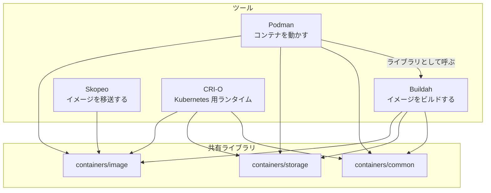

## 何を学んだか

### エンジンの機能は 4 つのライブラリに分かれている

Podman のリポジトリには、イメージをレジストリから引くコードも、overlayfs をマウントするコードも、Dockerfile を解釈するコードも入っていない。すべて別リポジトリのライブラリにある。

| ライブラリ           | 担当                                                                                                                 | Podman 内での窓口                |
| -------------------- | -------------------------------------------------------------------------------------------------------------------- | -------------------------------- |
| `containers/storage` | レイヤ・イメージ・コンテナのストア。overlay ドライバ、rootfs のマウント                                              | `Runtime.store`                  |
| `containers/image`   | レジストリとの通信、イメージのコピー、署名検証、transport 抽象                                                       | `Runtime.libimageRuntime` 経由   |
| `containers/common`  | `containers.conf` の解析、`libimage` (image の高レベル API)、`libnetwork` (netavark 呼び出し)、seccomp の既定、hooks | 設定・ネットワーク・イメージ全般 |
| `buildah`            | Dockerfile の解釈とイメージのビルド                                                                                  | `Runtime.Build()`                |

Podman v6 では、これらのモジュールパスが `github.com/containers/...` から **`go.podman.io/...`** に変わった。実体は `containers/container-libs` という 1 つのリポジトリに集約されている。

そしてこれらのライブラリを使っているのは Podman だけではない。



`podman pull` と `buildah pull` と `skopeo copy` が同じ挙動をし、`/etc/containers/registries.conf` が 4 つのツールすべてに効くのは、**同じライブラリを共有しているから** だ。Docker では pull の実装は dockerd の中にあり、他のツールから使う手段がない。

### 加えて、外部バイナリを exec する

ライブラリで済まないもの — 特権が要るもの、C や Rust で書かれているもの、常駐が必要なもの — は別バイナリになっている。

| バイナリ        | 言語   | 役割                                                                            | いつ起動されるか          |
| --------------- | ------ | ------------------------------------------------------------------------------- | ------------------------- |
| `conmon`        | C      | コンテナの親、stdio の中継、終了コードの記録                                    | コンテナごとに 1 つ、常駐 |
| `crun` / `runc` | C / Go | namespace と cgroup を作ってプロセスを起動                                      | 操作のたびに一瞬          |
| `netavark`      | Rust   | bridge の作成、iptables/nftables の設定                                         | ネットワーク接続時に一瞬  |
| `aardvark-dns`  | Rust   | コンテナ名を解決する DNS サーバ                                                 | netavark が起動し、常駐   |
| `pasta`         | C      | rootless のユーザ空間ネットワークスタック                                       | コンテナごとに常駐        |
| `catatonit`     | C      | `--init` で PID 1 に入れる最小の init                                           | コンテナ内の PID 1        |
| `rootlessport`  | Go     | rootless のポート転送 (rootlesskit ベース、`cmd/rootlessport` で作る別バイナリ) | ポート公開時に常駐        |

「ライブラリか外部バイナリか」の線引きは実務的だ。**Go のプロセスに載せられないもの** (シングルスレッドでの namespace 操作、C の pthread mutex、Rust の実装) と、**寿命が Podman プロセスと違うもの** (conmon、pasta、aardvark-dns) が外に出ている。

### Docker との対比

Docker では、これらのほとんどが `dockerd` 1 プロセスの中にある。イメージも、ネットワーク (libnetwork) も、ビルド (BuildKit は分離しつつある) も。外部プロセスになっているのは containerd と shim と runc だけだ。

差が出るのは次の点だ。

- **他のツールから使えるか。** containers/* は 4 つのツールに使われている。moby のコードを別ツールから使うのは事実上できない。
- **設定ファイルが共有されるか。** `registries.conf` `storage.conf` `containers.conf` `policy.json` は containers/* を使う全ツールに効く。Docker の `daemon.json` は dockerd だけのもの。
- **部分的に置き換えられるか。** ネットワークバックエンドを CNI から netavark に切り替える、といった変更が、エンジン本体を触らずにできる。

## ソースコードのどこか

### go.mod にライブラリが 4 行で並ぶ

[`go.mod#L67-L70`](https://github.com/podman-container-tools/podman/blob/v6.1.0/go.mod#L67).

```go title="go.mod"
	go.podman.io/buildah v1.45.0
	go.podman.io/common v0.69.1
	go.podman.io/image/v5 v5.41.1
	go.podman.io/storage v1.64.0
```

この 4 行が、Podman の機能の大半を持ち込んでいる。`vendor/` にすべて入っているので、Podman のリポジトリを clone すればライブラリのソースも一緒に読める。

### `podman build` は buildah をライブラリとして呼ぶだけ

`podman build` の実装は驚くほど短い。[`libpod/runtime_img.go#L117`](https://github.com/podman-container-tools/podman/blob/v6.1.0/libpod/runtime_img.go#L117)。

```go title="libpod/runtime_img.go"
func (r *Runtime) Build(ctx context.Context, options buildahDefine.BuildOptions, dockerfiles ...string) (string, reference.Canonical, error) {
	if options.Runtime == "" {
		options.Runtime = r.GetOCIRuntimePath()
	}
	options.NoPivotRoot = r.config.Engine.NoPivotRoot

	// share the network interface between podman and buildah
	options.NetworkInterface = r.network
	id, ref, err := imagebuildah.BuildDockerfiles(ctx, r.store, options, dockerfiles...)
	// Write event for build completion
	r.newImageBuildCompleteEvent(id)
	return id, ref, err
}
```

13 行だ。やっているのは 3 つ。

1. buildah に **Podman が使っている OCI ランタイムのパス** を渡す
2. buildah に **Podman が持っているネットワークインターフェース** を渡す (コメントに「podman と buildah でネットワークインターフェースを共有する」とある)
3. `imagebuildah.BuildDockerfiles` に **Podman が開いているストア** (`r.store`) を渡す

ストアを渡しているのが要だ。buildah が別プロセスなら、ビルド結果を Podman のストアに入れるために import が要る。同一プロセスでストアを共有しているので、**ビルドが終わった瞬間にそのイメージは `podman images` に出る**。Docker で `docker build` した結果がすぐ使えるのと同じ体験を、デーモンなしで実現している。

`podman build` は `podman` バイナリの中で完結していて、`buildah` コマンドをインストールする必要はない。

### 外部バイナリの探索は 1 つの関数に集約されている

外部バイナリのパス解決は [`vendor/go.podman.io/common/pkg/config/config.go#L1127`](https://github.com/podman-container-tools/podman/blob/v6.1.0/vendor/go.podman.io/common/pkg/config/config.go#L1127) の `FindHelperBinary` にまとまっている。

```go title="go.podman.io/common/pkg/config/config.go"
// FindHelperBinary will search the given binary name in the configured directories.
// If searchPATH is set to true it will also search in $PATH.
func (c *Config) FindHelperBinary(name string, searchPATH bool) (string, error) {
	dirList := c.Engine.HelperBinariesDir.Get()
	...
	configHint := "To resolve this error, set the helper_binaries_dir key in the `[engine]` section of containers.conf to the directory containing your helper binaries."
	if len(dirList) == 0 {
		return "", fmt.Errorf("could not find %q because there are no helper binary directories configured.  %s", name, configHint)
	}
	return "", fmt.Errorf("could not find %q in one of %v.  %s", name, dirList, configHint)
}
```

`$PATH` を素朴に引くのではなく、`containers.conf` の `helper_binaries_dir` を優先する。**「ユーザの PATH に何が入っているかに依存したくない」** という判断で、`podman` が setuid 的な文脈や systemd の unit から起動されたときに挙動が変わらないようにしている。

エラーメッセージに **解決方法をそのまま書いている** のも良い。「見つからない」だけでなく「どこを探したか」「どの設定を書けばよいか」が出る。外部バイナリに依存する設計では、この種のメッセージの品質がそのまま運用のしやすさになる。

### ストアと image transport を繋ぐ 1 行

前ページでも触れた [`libpod/runtime.go#L1011`](https://github.com/podman-container-tools/podman/blob/v6.1.0/libpod/runtime.go#L1011) の 1 行が、2 つのライブラリの結合点だ。

```go title="libpod/runtime.go"
	r.store = store
	is.Transport.SetStore(store)
```

`containers/image` は「イメージの読み書き先」を transport として抽象化しているが、`containers-storage:` transport だけは **どのストアを使うか** を外から教えてもらう必要がある。この 1 行で `containers/image` と `containers/storage` が繋がる。

ライブラリ同士がお互いを直接知らず、**使う側 (Podman) が結線する** 形になっているので、Buildah や CRI-O は自分のストアを同じように差し込める。

## なぜそうなっているか

### 4 つのツールが同じ挙動をする必要があった

Red Hat の周辺では、コンテナに関する仕事が 4 つのツールに分かれている。イメージをビルドする Buildah、レジストリ間で移送する Skopeo、開発者が使う Podman、Kubernetes ノードで動く CRI-O。これらが **レジストリの解決も署名の検証もレイヤの置き場所も違う** となると、運用が破綻する。

だから共通部分をライブラリに切り出した。`registries.conf` の書き方を 1 回覚えれば 4 つに効く、というのは設計の目的そのものだ。Docker のように 1 つのデーモンが全部やるなら共有の必要はないが、**用途ごとに別のツールを立てる方針** を取ったので、共有ライブラリが必然になった。

### 「同一プロセスで呼べる」ことが体験を決めている

buildah を外部コマンドとして呼ぶ設計もありえた。そうしなかったのは、**ストアを共有できないと体験が壊れる** からだ。ビルド結果を import する、ロックを別々に取る、進捗を別プロセスから中継する — どれも面倒で、失敗する余地が増える。

一方で conmon や pasta は、同一プロセスにできない。conmon は Podman より長生きしなければならず、pasta は独立した netns の中で動き続ける必要がある。**寿命が違うものはプロセスを分け、寿命が同じものはライブラリにする** という線引きになっている。

### ライブラリ化のコストは、バージョンの同期

代償もある。Podman v6.1.0 は `storage v1.64.0` と `image v5.41.1` に固定されていて、これらのライブラリの変更は 4 つのツールすべてに影響する。ストアのフォーマットが変わればツール間で互換性の問題が出るし、リリースは互いに待ち合わせが必要になる。モジュール名を `go.podman.io/*` に統一し、実体を 1 つのリポジトリ (`container-libs`) に集約したのは、この同期コストを下げるための整理だ。

## どう活かすか

- **複数のツールで同じ挙動が要るなら、共有すべきはコードであって設定ではない。** 「同じ設定ファイルを読む」だけでは、解釈が実装ごとにずれる。containers/* が共有しているのは解釈のコード自体だ。
- **プロセスを分ける基準は「寿命」で考える。** 機能で分けると迷うが、「呼び出し元より長生きするか」で切ると自然に決まる。conmon と pasta が外にいて buildah が中にいるのは、この基準で説明できる。
- **外部バイナリに依存するなら、探索順とエラーメッセージを設計に含める。** `$PATH` 頼みにせず設定で明示できるようにし、見つからないときは「どこを探したか」「何を設定すればよいか」を返す。運用時の問い合わせがそのまま減る。
- **ライブラリ間の結線は、使う側が持つ。** `is.Transport.SetStore(store)` のように、ライブラリ同士を直接依存させず利用側で繋ぐと、別の組み合わせで再利用できる。
