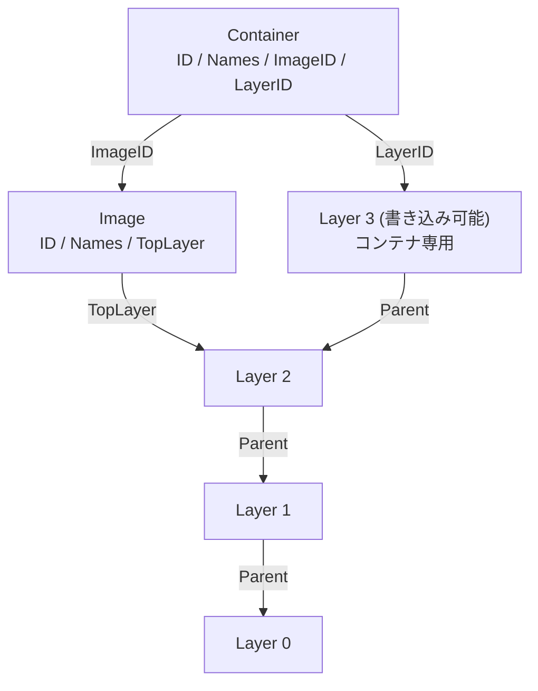

## 何を学んだか

### 3 種類のレコードと、1 つの graph driver

`containers/storage` が管理するものは 3 つしかない。



- **Layer** — `ID` と `Parent` を持つ。親を辿ると根まで行ける単方向リスト。実体は graph driver が持つディレクトリ。
- **Image** — `ID` と `Names` (タグ) と **`TopLayer` 1 つ**。イメージ自身はレイヤの並びを持たない。一番上を指して、あとは `Parent` を辿る。
- **Container** — `ImageID` と、**書き込み可能な `LayerID` 1 つ**。イメージのトップレイヤを親とする新しいレイヤが、コンテナの `/` になる。

メタデータは `$GRAPHROOT/overlay-layers/layers.json`、`overlay-images/images.json`、`overlay-containers/containers.json` という JSON ファイルに入る。DB ではなくファイル + ファイルロックだ。

そして「レイヤを実際に重ねて 1 つのディレクトリに見せる」部分だけが **graph driver** に分離されている。既定は `overlay` (overlayfs)。他に `vfs` (コピーするだけ、遅いが動く)、`btrfs`、`zfs` がある。

### ストアの場所は 2 つある

- **graphroot** (`--root`) — 永続。レイヤの実体とメタデータ。root なら `/var/lib/containers/storage`、rootless なら `~/.local/share/containers/storage`
- **runroot** (`--runroot`) — 一時。マウントポイントやロックなど、再起動で消えてよいもの。root なら `/run/containers/storage`、rootless なら `$XDG_RUNTIME_DIR/containers`

この 2 つを分けているのは、**「再起動で消えるべきもの」を tmpfs に置くため** だ。マウント情報が再起動後に残っていると、存在しないマウントを参照して壊れる。前提群で見た「alive ファイルの有無で再起動を検出する」仕掛けも、この runroot の性質を使っている。

### Docker との構造の違い

Docker の graphdriver も似た構造だが、上に載っている層が違う。

|                  | Docker                                                               | containers/storage                                |
| ---------------- | -------------------------------------------------------------------- | ------------------------------------------------- |
| レイヤの実体     | graphdriver (overlay2 等)                                            | graph driver (overlay 等)                         |
| メタデータ       | dockerd 内のデータベース + `/var/lib/docker/image/<driver>/` の JSON | `layers.json` / `images.json` / `containers.json` |
| 誰が触れるか     | dockerd のみ                                                         | ライブラリを import した任意のプロセス            |
| 排他             | デーモン内のロック                                                   | ファイルロック (`.../layers.lock` など)           |
| ユーザごとの分離 | なし (1 台 1 ストア)                                                 | graphroot がユーザごとに別                        |

**「複数プロセスが同時に触る」ことを前提にしている** のが最大の違いだ。`podman` を 2 つ同時に起動しても、`podman` と `buildah` を同時に走らせても壊れないように、すべての読み書きがファイルロックで守られている。

## ソースコードのどこか

### Image は TopLayer 1 つしか持たない

[`vendor/go.podman.io/storage/images.go#L33-L61`](https://github.com/podman-container-tools/podman/blob/v6.1.0/vendor/go.podman.io/storage/images.go#L33)。

```go title="go.podman.io/storage/images.go"
type Image struct {
	// ID is either one which was specified at create-time, or a random
	// value which was generated by the library.
	ID string `json:"id"`
	...
	// Names is an optional set of user-defined convenience values.  The
	// image can be referred to by its ID or any of its names.  Names are
	// unique among images, and are often the text representation of tagged
	// or canonical references.
	Names []string `json:"names,omitempty"`
	...
	// TopLayer is the ID of the topmost layer of the image itself, if the
	// image contains one or more layers.  Multiple images can refer to the
	// same top layer.
	TopLayer string `json:"layer,omitempty"`
```

**「複数のイメージが同じトップレイヤを指しうる」** とコメントにある。同じ内容に別のタグを付けた場合がこれだ。レイヤの共有はこの構造から自然に出てくる。

コンテナ側は [`vendor/go.podman.io/storage/containers.go#L38-L54`](https://github.com/podman-container-tools/podman/blob/v6.1.0/vendor/go.podman.io/storage/containers.go#L38)。

```go title="go.podman.io/storage/containers.go"
	// ImageID is the ID of the image which was used to create the container.
	ImageID string `json:"image"`

	// LayerID is the ID of the read-write layer for the container itself.
	// It is assumed that the image's top layer is the parent of the container's
	// read-write layer.
	LayerID string `json:"layer"`
```

「イメージのトップレイヤがコンテナの書き込み可能レイヤの親である **と仮定される**」。この 1 行が、コンテナの rootfs がどう作られるかのすべてだ。

### mount(2) の引数がページサイズに収まらない問題

overlay ドライバの冒頭コメント [`vendor/go.podman.io/storage/drivers/overlay/overlay.go#L59-L79`](https://github.com/podman-container-tools/podman/blob/v6.1.0/vendor/go.podman.io/storage/drivers/overlay/overlay.go#L59) が、実装の泥臭さをそのまま語っている。

```go title="go.podman.io/storage/drivers/overlay/overlay.go"
// Each container/image has at least a "diff" directory and "link" file.
// If there is also a "lower" file when there are diff layers
// below as well as "merged" and "work" directories. The "diff" directory
// has the upper layer of the overlay and is used to capture any
// changes to the layer. The "lower" file contains all the lower layer
// mounts separated by ":" and ordered from uppermost to lowermost
// layers. The overlay itself is mounted in the "merged" directory,
// and the "work" dir is needed for overlay to work.

// The "link" file for each layer contains a unique string for the layer.
// Under the "l" directory at the root there will be a symbolic link
// with that unique string pointing the "diff" directory for the layer.
// The symbolic links are used to reference lower layers in the "lower"
// file and on mount. The links are used to shorten the total length
// of a layer reference without requiring changes to the layer identifier
// or root directory. Mounts are always done relative to root and
// referencing the symbolic links in order to ensure the number of
// lower directories can fit in a single page for making the mount
// syscall. A hard upper limit of 500 lower layers is enforced to ensure
// that mounts do not fail due to length.
```

overlayfs のマウントは、`lowerdir=A:B:C:...` という文字列をカーネルに渡す。**この文字列はページサイズ (4KB) に収まらなければならない**。レイヤ ID は 64 文字の hex なので、レイヤが 50 も重なると軽く溢れる。

そこで graphroot 直下に `l/` というディレクトリを作り、各レイヤの `diff` へ **26 文字の短いシンボリックリンク** を張る。マウント時は graphroot を作業ディレクトリにして `lowerdir=l/AAAA...:l/BBBB...` と相対パスで指定する。

長さの計算は定数のコメントに書いてある。

```go title="go.podman.io/storage/drivers/overlay/overlay.go"
const (
	maxDepth = 500
	// idLength represents the number of random characters
	// which can be used to create the unique link identifier
	// for every layer. If this value is too long then the
	// page size limit for the mount command may be exceeded.
	// The idLength should be selected such that following equation
	// is true (512 is a buffer for label metadata, 128 is the
	// number of lowers we want to be able to use without having
	// to use bind mounts to get all the way to the kernel limit).
	// ((idLength + len(linkDir) + 1) * 128) <= (pageSize - 512)
	idLength = 26
)
```

`(26 + 1 + 1) × 128 = 3584 ≤ 4096 - 512`。**128 レイヤまでは追加の小細工なしでマウントできる** ように 26 を選んだ、という導出がそのまま書かれている。それを超える場合は bind mount を使って更に短縮し、ハードリミットは 500 レイヤ。

「Dockerfile の `RUN` を分けすぎるとレイヤが増える」という一般論の背後に、こういう物理的な上限がある。

### レイヤごとのディレクトリ構成

`Metadata()` が返す値が、そのまま overlayfs のマウント引数になる。[`vendor/go.podman.io/storage/drivers/overlay/overlay.go#L887-L891`](https://github.com/podman-container-tools/podman/blob/v6.1.0/vendor/go.podman.io/storage/drivers/overlay/overlay.go#L887)。

```go title="go.podman.io/storage/drivers/overlay/overlay.go"
	metadata := map[string]string{
		"WorkDir":   path.Join(dir, "work"),
		"MergedDir": d.getMergedDir(id, dir, inAdditionalStore),
		"UpperDir":  path.Join(dir, "diff"),
	}
```

ディスク上ではこうなる。

```
$GRAPHROOT/overlay/
├── l/
│   ├── 6QZBJ4YXBOWJBM2ZBQNPLBTIB4 -> ../4f2c.../diff
│   └── ...
├── 4f2c...(レイヤ ID)/
│   ├── diff/          ← このレイヤの差分 (upperdir)
│   ├── link           ← l/ 以下のリンク名を書いたファイル
│   ├── lower          ← 下位レイヤの l/ パスを ":" で連結
│   ├── merged/        ← マウント先 (mount 時のみ中身が見える)
│   └── work/          ← overlayfs が要求する作業ディレクトリ
└── ...
```

`podman` が動いていないときに `merged/` を覗くと空だ。**マウントされていない限り、レイヤは重なっていない**。

### Store インターフェースは巨大だが、入口は 1 つ

[`vendor/go.podman.io/storage/store.go#L193`](https://github.com/podman-container-tools/podman/blob/v6.1.0/vendor/go.podman.io/storage/store.go#L193) の `Store` インターフェースは 100 個近いメソッドを持つ。その中に `PutLayer` のこんなコメントがある。

```go title="go.podman.io/storage/store.go"
	// Note that we do some of this work in a child process.  The calling
	// process's main() function needs to import our pkg/reexec package and
	// should begin with something like this in order to allow us to
	// properly start that child process:
	//   if reexec.Init() {
	//       return
	//   }
	PutLayer(id, parent string, names []string, mountLabel string, writeable bool, options *LayerOptions, diff io.Reader) (*Layer, int64, error)
```

**「レイヤの展開は子プロセスでやる。だから呼び出し側の `main()` は `reexec.Init()` から始めろ」**。前提群で見た `cmd/podman/main.go` の 1 行目が、実はこのライブラリからの要求でもある。

なぜ子プロセスかというと、tar の展開で任意のファイル名・シンボリックリンクを扱うため、mount namespace を分けたり chroot したりして安全に処理したいからだ。ライブラリが呼び出し元の `main` に制約を課すのは珍しいが、それを **インターフェースのコメントに書いて明示している**。

## なぜそうなっているか

### メタデータを DB にしなかったのは、共有と可搬性のため

`layers.json` は数万レイヤになれば読み込みが重くなる。それでも JSON ファイルなのは、

- **複数のツール (Podman / Buildah / Skopeo / CRI-O) が同じストアを触る**。DB プロセスを立てるわけにいかない
- **ストアごとディレクトリをコピーして持ち運べる**。additional image store の仕組みが成立する前提でもある
- **read-only でマウントされたストアを読める**。DB は書き込みロックを要求しがち

つまり「1 プロセスが占有する DB」を選べない事情がある。代わりに、ファイルロックと、変更検知のためのタイムスタンプ比較でやりくりしている。

### graph driver を分離したのは、環境が選べないから

overlayfs は多くの環境で使えるが、使えない環境もある。古いカーネル、特定のファイルシステム上、ネストしたコンテナの中、rootless で kernel が古い場合。そこで **「動くけれど遅い」`vfs` ドライバ** (レイヤをコピーする) を常に用意して、フォールバック先にしている。

Docker も同じ構造 (graphdriver) を持っているが、containers/storage では **rootless で何を選ぶか** という追加の問題がある。これは次のページで扱う。

## どう活かすか

- **「一番上を指して親を辿る」構造は、共有を無料にする。** Image が TopLayer 1 つしか持たないので、共通の下位レイヤは自動的に共有される。参照カウントも不要で、削除時に「誰かの親になっていないか」だけ見ればよい。木構造のキャッシュを設計するときに使える形だ。
- **OS の制約 (ページサイズ、引数長) は設計を歪める。** `l/` の 26 文字リンクは美しくないが、`mount(2)` の制約から逃げられない。似た制約 (`ARG_MAX`、パス長、環境変数のサイズ) にぶつかったとき、「短い別名を別ディレクトリに用意する」は使える手だ。
- **ライブラリが呼び出し側に制約を課すなら、インターフェースのコメントに書く。** `PutLayer` の「`main()` に `reexec.Init()` を書け」は、README ではなく型定義のすぐ横にある。守られなければ動かない前提は、コードから最短距離の場所に置く。
- **永続と一時を物理的に分ける。** graphroot と runroot の分離は、「再起動で消えてほしいもの」を明示的に tmpfs に置く設計だ。状態を持つツールを書くとき、この 2 つを最初から分けておくと再起動時の整合性処理が単純になる。
