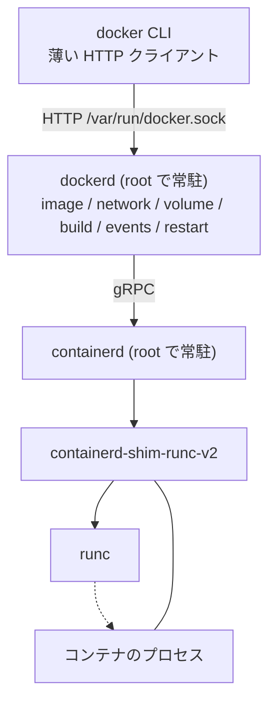

## 何を学んだか

### `docker` コマンドは HTTP クライアントでしかない

`docker run nginx` を叩いたとき、`docker` バイナリがやっているのは概ねこれだけだ。

1. 引数を解析して JSON にする
2. `/var/run/docker.sock` に `POST /v1.44/containers/create` を投げる
3. 返ってきたコンテナ ID で `POST /v1.44/containers/{id}/start` を投げる
4. attach するなら `POST /v1.44/containers/{id}/attach` で HTTP コネクションを hijack して stdio を流す

イメージを引くのも、レイヤを展開するのも、namespace を決めるのも、`docker` プロセスは一切やらない。全部 `dockerd` の中で起きる。だから `docker` バイナリだけを別マシンに置いて `DOCKER_HOST` を向ければ、そのままリモート操作になる。

API のバージョンが **URL パスに埋まっている** のも特徴だ (`/v1.44/...`)。クライアントは起動時にサーバとネゴシエートして、自分が話せる最新のバージョンを使う。長期の後方互換をパスの世代管理で担保する設計になっている。

### dockerd が抱えているもの

dockerd 1 プロセスの中に、コンテナ運用に必要なほぼすべての機能が入っている。

| 機能           | dockerd 内での担当                                   |
| -------------- | ---------------------------------------------------- |
| イメージ       | image store、レイヤの展開、レジストリとの通信        |
| ネットワーク   | libnetwork。bridge / overlay ドライバ、iptables 操作 |
| ボリューム     | volume driver とプラグイン                           |
| ビルド         | BuildKit (組み込み、または別プロセス)                |
| ログ           | logging driver (json-file / journald / fluentd …)    |
| イベント       | `docker events` に流す pub/sub                       |
| クラスタ       | Swarm mode                                           |
| プラグイン     | volume / network / authz プラグインの管理            |
| 再起動ポリシー | `--restart` の監視と再起動                           |

そして **実行だけ** を containerd に渡す。dockerd は containerd に gRPC で「この bundle でタスクを作れ」と頼み、containerd が shim を起動し、shim が runc を呼ぶ ([containerd 章](../../containerd/) がこの下半分を扱っている)。



### この構造から出てくる性質

構造を決めると、性質は自動的についてくる。

- **dockerd は root で動く。** namespace の作成、iptables の書き換え、`/var/lib/docker` の所有 — どれも特権が要る。したがって dockerd に何かを頼めるということは、実質 root を取れるということだ。`docker` グループへの所属が「root 相当の権限」と言われるのはこのため。`-v /:/host` でホストの `/` をマウントしたコンテナを立てれば、それで終わりになる。
- **すべてのコンテナが 1 つのデーモンの子孫になる。** dockerd を止めるとコンテナも止まる (live-restore を有効にすれば実行中コンテナは生き延びるが、機能に制限がある)。dockerd のアップグレードは全コンテナに影響する。
- **状態はデーモンのメモリとディスクにある。** 「今どのコンテナが動いているか」は dockerd が知っている。だから `docker ps` は速いし、`docker events` はリアルタイムに流せるし、`--restart=always` はデーモンが見張るだけで実装できる。
- **systemd から見るとコンテナが見えない。** すべてのコンテナは `docker.service` の配下にぶら下がる (実際には containerd 配下)。systemd の unit として個々のコンテナを扱いたい場合、この構造は噛み合わない。
- **マルチユーザで共有しづらい。** 1 台に 1 つの dockerd があり、その中のイメージとコンテナは全ユーザで共有される。ユーザ A のコンテナをユーザ B が `docker rm` できる。

Docker にも rootless mode がある。RootlessKit を使って dockerd 自体を user namespace の中で動かすもので、特権の問題は緩和される。ただし **「デーモンが常駐する」構造そのものは変わらない**。

## ソースコードのどこか

Docker 本体のソースはこの章の対象外だが、**Docker Engine API の輪郭は Podman 側のコードから正確に読める**。Podman は Docker 互換 API を実装しているので、そのルート定義がそのまま Docker の API 表面になっているからだ。

### 互換 API のルート表が、Docker の API 表面そのもの

[`pkg/api/server/register_containers.go`](https://github.com/podman-container-tools/podman/blob/v6.1.0/pkg/api/server/register_containers.go) には、`compat` (Docker 互換) と `libpod` (Podman 固有) の 2 系統のルートが登録されている。compat 側だけを抜くとこうなる。

```go title="pkg/api/server/register_containers.go"
	r.HandleFunc("/containers/create", s.APIHandler(compat.CreateContainer)).Methods(http.MethodPost)
	r.HandleFunc("/containers/json", s.APIHandler(compat.ListContainers)).Methods(http.MethodGet)
	r.HandleFunc("/containers/prune", s.APIHandler(compat.PruneContainers)).Methods(http.MethodPost)
	r.HandleFunc("/containers/{name}", s.APIHandler(compat.RemoveContainer)).Methods(http.MethodDelete)
	r.HandleFunc("/containers/{name}/json", s.APIHandler(compat.GetContainer)).Methods(http.MethodGet)
	r.HandleFunc("/containers/{name}/kill", s.APIHandler(compat.KillContainer)).Methods(http.MethodPost)
	r.HandleFunc("/containers/{name}/logs", s.APIHandler(compat.LogsFromContainer)).Methods(http.MethodGet)
	r.HandleFunc("/containers/{name}/start", s.APIHandler(compat.StartContainer)).Methods(http.MethodPost)
	r.HandleFunc("/containers/{name}/stop", s.APIHandler(compat.StopContainer)).Methods(http.MethodPost)
	r.HandleFunc("/containers/{name}/attach", s.APIHandler(compat.AttachContainer)).Methods(http.MethodPost)
	r.HandleFunc("/containers/{name}/wait", s.APIHandler(compat.WaitContainer)).Methods(http.MethodPost)
```

`create` と `start` が別のエンドポイントであること、`attach` が POST であること (HTTP コネクションを hijack して双方向ストリームにする)、`wait` がブロッキングであること。Docker CLI の挙動がここから逆算できる。

`pkg/api/server/` に並ぶファイル名 — `register_swarm.go`、`register_plugins.go`、`register_distribution.go` — は、そのまま「Docker が持っている API のカテゴリ」の一覧でもある。

Podman が話す互換 API のバージョンは [`version/version.go#L42-L45`](https://github.com/podman-container-tools/podman/blob/v6.1.0/version/version.go#L42-L45) に書いてある。

```go title="version/version.go"
	Compat: {
		CurrentAPI: semver.MustParse("1.44.0"),
		MinimalAPI: semver.MustParse("1.24.0"),
	},
```

1.24 から 1.44 までを受け付ける。**Docker CLI 側の世代幅をそのまま引き受けている** ということでもある。

サポートしない領域の扱いも面白い。[`pkg/api/server/register_swarm.go#L14-L28`](https://github.com/podman-container-tools/podman/blob/v6.1.0/pkg/api/server/register_swarm.go#L14) は、Swarm 系のパスにまとめて専用ハンドラを付ける。

```go title="pkg/api/server/register_swarm.go"
	r.PathPrefix("/v{version:[0-9.]+}/swarm/").HandlerFunc(noSwarm)
	...
// noSwarm returns http.StatusServiceUnavailable rather than something like http.StatusInternalServerError,
// this allows the client to decide if they still can talk to us
```

500 ではなく **503 Service Unavailable** を返す。「クライアントが、まだ我々と話を続けられるか自分で判断できるようにするため」。互換 API を作る側から見て、「知らないパス」と「知っているがやらないパス」を区別してステータスコードを選ぶ、という良い例だ。

### DOCKER_HOST を差し替えるだけで乗り換えられる

Podman が配布している [`docker/podman-docker.sh`](https://github.com/podman-container-tools/podman/blob/v6.1.0/docker/podman-docker.sh) は、`docker` コマンドを置き換えるためのシェルスクリプトだ。

```sh title="docker/podman-docker.sh"
if [ -z "${DOCKER_HOST-}" ]; then
    if [ "$(id -u)" -eq 0 ]; then
	export DOCKER_HOST=unix:///run/podman/podman.sock
    else
	if [ -n "${XDG_RUNTIME_DIR-}" ]; then
	    export DOCKER_HOST=unix://$XDG_RUNTIME_DIR/podman/podman.sock
	fi
    fi
fi
```

root なら `/run/podman/podman.sock`、一般ユーザなら `$XDG_RUNTIME_DIR/podman/podman.sock`。**socket のパスがユーザごとに分かれている** 点が Docker と決定的に違う。Docker は 1 台に 1 つの `/var/run/docker.sock` を全ユーザで共有するが、Podman はユーザごとに別のエンジンが立つ。

[`pkg/api/server/doc.go#L14-L15`](https://github.com/podman-container-tools/podman/blob/v6.1.0/pkg/api/server/doc.go#L14) にはこう書いてある。

```go title="pkg/api/server/doc.go"
// NOTE: if you install the package podman-docker, it will create a symbolic
// link for /run/docker.sock to /run/podman/podman.sock
```

Docker との互換を、**プロトコルの互換 + socket パスの symlink** という 2 点だけで成立させている。これができるのは、Docker CLI がデーモンについて「HTTP を話す unix socket」以上のことを何も仮定していないからだ。

## なぜそうなっているか

### デーモンは、当時の要求に対する自然な答えだった

2013 年に Docker が出たとき、解こうとしていた問題は「アプリを再現性のある形でパッケージして配る」ことだった。そのために必要な機能 — レイヤ管理、レジストリ、ネットワーク、ライフサイクル — を 1 つのデーモンに集めるのは、当時としてはまっとうな設計だ。常駐していれば、状態はメモリに持てばよく、排他はプロセス内のロックで済み、イベントは購読者に直接流せる。**分散した状態管理の問題が丸ごと消える。**

問題が出てきたのは、使われ方が広がってからだ。CI で使いたい (root デーモンが要る)、マルチユーザのサーバで使いたい (分離できない)、systemd で管理したい (プロセスツリーが噛み合わない)、Kubernetes から使いたい (dockerd は余分な層になった — CRI 経由で containerd を直接叩けばよい)。

Kubernetes が dockershim を捨てて containerd を直接使うようになったのは、この「dockerd は Kubernetes にとって余分な層」という判断による。Docker のアーキテクチャが悪かったのではなく、**用途が当初の想定から離れていった**。

### Podman の設計判断は、ほぼすべてこの構造への応答

この章の残りを読むと、Podman の設計判断のほとんどが Docker の構造への直接の応答だと分かる。

| Docker の性質                   | Podman の応答                                            |
| ------------------------------- | -------------------------------------------------------- |
| デーモンが root で常駐          | デーモンを持たず、一般ユーザで user namespace の中で動く |
| 状態はデーモンのメモリ          | 状態を SQLite とファイルに置き、毎回読み直す             |
| プロセス内ロック                | `/dev/shm` の robust mutex でプロセス間ロック            |
| デーモンが `--restart` を見張る | systemd の unit に変換する (Quadlet)                     |
| デーモンが定期実行の主体        | systemd の transient timer に呼び戻させる                |
| 1 台 1 デーモンで全ユーザ共有   | ユーザごとに独立したストアと socket                      |
| Pod という概念がない            | infra コンテナと namespace 共有で Pod を実装             |

**「デーモンを消す」という 1 つの判断が、これだけの数の再設計を要求した** ということでもある。次のページで Podman 側の構造を見る。

## どう活かすか

- **「デーモンにするか」は状態と権限の置き場所の決定でもある。** 常駐させれば状態管理は楽になるが、そのプロセスの権限がそのままユーザに与える権限になる。Docker の `docker` グループ問題は、この帰結が後から効いてきた例として覚えておく価値がある。
- **互換性は「プロトコル + 接続先」で買える。** Podman が Docker CLI をそのまま使えるようにできたのは、Docker CLI がデーモンの実装を何も仮定していなかったからだ。自分の作るサーバでも、クライアントに実装の詳細を漏らさなければ、後から中身を丸ごと入れ替えられる。
- **API バージョンを URL に埋める設計は、長期互換に効く。** Docker Engine API がこれをやったおかげで、古いクライアントと新しいデーモンの組み合わせが動く。代わりにサーバ側に世代分のコードが残り続けるので、捨てるタイミングを別途決める必要がある。
