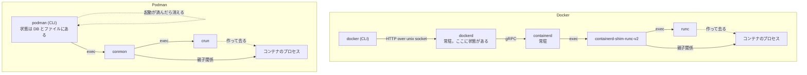

`docker run` と `podman run` は同じ引数を受け取り、同じイメージから同じようなコンテナを作る。だが `ps` で見えるプロセスの形はまったく違う。

Docker では、コンテナを作る主体は `docker` コマンドではなく `dockerd` だ。CLI は unix socket 越しに REST を投げるだけの薄いクライアントで、イメージも状態もネットワークもすべてデーモン側にある。Podman では `podman` コマンド自身が主体になる。イメージを引くのも、rootfs を組むのも、OCI spec を書くのも、`podman` プロセスがその場でやる。そして起動が済むと消える。

この違いは「デーモンが好きか嫌いか」の話ではない。**デーモンが引き受けていた仕事 — 状態の保持、排他制御、プロセスの監視、定期実行、イベントの配信 — を、常駐プロセス無しでどこに置き直すか** という設計上の問いだ。Podman の答えは、そのほとんどを OS 側の仕組み (SQLite、共有メモリの mutex、conmon という小さな別プロセス、systemd の transient timer) に分解して預けることだった。

この章には 2 つの目的がある。

1 つは、**コンテナエンジンが何をするものかを、前提から理解できるようにすること**。最初の群「コンテナランタイムの前提」7 ページがそれにあたる。コンテナの正体、OCI の 3 つの仕様、「ランタイム」という語が指す 3 つの層、そして Docker と Podman それぞれのアーキテクチャの解剖。ここを読めば残りが読める。

もう 1 つは、**Podman 本体の実装を読むこと**。イメージとストレージ、`podman run` の全経路、プロセスの外に置かれた状態、非特権で動くための仕組み、systemd との統合。Docker との違いは各ページで必要なだけ触れる。

## この OSS について

- Red Hat が主導し、`containers` organization で開発。Apache 2.0。約 19 万行の Go (`libpod` `pkg` `cmd`) と、rootless の namespace 操作と共有メモリロックのための約 2,300 行の C。
- **エンジンとしての機能をほぼ自前で持つ。** イメージの取得は `containers/image`、レイヤの管理は `containers/storage`、ビルドは `buildah`、設定とネットワーク定義は `containers/common` (v6 から `go.podman.io/*` にモジュール名が移った)。これらは Podman の中で **ライブラリとして** 呼ばれる。Docker が dockerd の中に抱えているものを、別リポジトリのライブラリに切り出して、Podman・Buildah・Skopeo・CRI-O が共有している。
- **コンテナの親は `podman` ではなく conmon。** コンテナごとに conmon という小さな C のプロセスが立ち、OCI ランタイムを起動して親であり続ける。`podman run` は conmon の起動を見届ければ終了できる。
- **状態はプロセスの外にある。** v6.0 で BoltDB のサポートは削除され、DB は SQLite だけになった。排他は `/dev/shm` に固定数確保した robust な pthread mutex で取る。どのオブジェクトが何番のロックを使うかは DB に記録される。
- **rootless が既定の使い方。** 一般ユーザーで起動すれば user namespace の中で動き、setuid バイナリも常駐サービスも要らない。ネットワークは既定で pasta、cgroup は systemd から transient scope として委譲してもらう。
- **systemd と深く統合する。** ヘルスチェックは transient timer に自分を呼び戻させ、コンテナの systemd 化は Quadlet という generator が daemon-reload のたびに `.service` へ変換する。Docker の `--restart` に相当する機能を、Podman は systemd 側に寄せている。
- コミットメッセージが設計の理由をよく語っている。「停止を無順序で並列化したら infra が先に死んだので順序付き並列に戻した」「pause プロセスの罠を nsfs のファイルハンドルで置き換える」のような、方針を変えた経緯がそのまま残っている。

## 読む順番

コンテナランタイムの層構造に馴染みがない場合は、**「コンテナランタイムの前提」7 ページを 1 から順に読んでほしい**。以降の群はここの語彙を使う。OCI と Docker のアーキテクチャを知っている場合は、5・6・7 ページ目だけ読んで次へ進んでよい。

そのあとは「イメージとストレージ」→「コンテナを作って動かす」の順に読むと、`podman run` が一通り追える。「状態をプロセスの外に置く」はデーモンレスの帰結を扱うので、その後がよい。

「rootless」は最も深く書いた。user namespace の具体 (uid_map の書き方、newuidmap、pause プロセス) から、ネットワークと cgroup の委譲まで、非特権で動くための仕組みを順に追う。namespace と cgroup の基礎は「コンテナランタイムの前提」で扱う。

「ネットワーク」以降の 4 群は概ね独立しているので、興味のあるものから読める。ただし「systemd 統合」7 ページは、Podman が常駐をやめた代わりに何を systemd に渡したかを扱うので、最初の「Podman が systemd に委ねているものの全体像」から読むのがよい。

この章は Linux を前提に書く。macOS / Windows は「リモートとマルチプラットフォーム」でクライアントとして扱う。

コンテナランタイムの前提:

- [コンテナは仮想マシンではない — namespace・cgroup・rootfs の合成](./what-is-a-container/)
- [OCI の 3 つの仕様が決めていること](./oci-specs/)
- [「ランタイム」が指す 3 つの層](./runtime-layers/)
- [Docker のアーキテクチャを分解する](./docker-architecture/)
- [Podman のアーキテクチャを分解する](./podman-architecture/)
- [デーモンがあると何ができて、無いと何が難しいか](./daemon-or-not/)
- [Podman が立つライブラリ群](./containers-libraries/)

イメージとストレージ:

- [イメージを「どこから取るか」を transport で抽象化する](./image-transports/)
- [containers/storage の layer / image / container 3 層](./containers-storage/)
- [rootless で overlayfs をどう使うか](./rootless-overlayfs/)
- [イメージを複数の環境で共有する — additional image store](./additional-image-stores/)
- [Docker の image store・graphdriver と何が違うか](./vs-docker-image-store/)

コンテナを作って動かす:

- [`podman run` の全経路](./podman-run-walkthrough/)
- [「入力の解析」「意図の表現」「実行」を分け、意図をシリアライズ可能にする](./specgen-two-stage/)
- [OCI spec に何が書かれるか — Podman が決めるデフォルト](./oci-spec-defaults/)
- [crun と runc — low-level runtime をどう呼ぶか](./oci-runtime-invocation/)
- [コンテナの監視を小さな別プロセスに委ね、CLI 自身はいつ終了してもよい設計にする](./conmon-supervision/)
- [標準入出力・attach・ログ](./container-io/)
- [exec とヘルスチェックのプロセスはどこにぶら下がるか](./exec-and-healthcheck-processes/)

状態をプロセスの外に置く:

- [デーモンの代わりに、複数プロセスが同時に触る状態を SQLite に「インデックス列 + JSON」で置く](./sqlite-state/)
- [プロセス間ロックは共有メモリに固定数確保し、番号を DB に保存して再起動後も同じロックを引き当てる](./shm-lock-manager/)
- [シグナルは無視せず「配送を遅らせる」。RWMutex の読み手を危険区間、書き手をハンドラにする](./shutdown-inhibit/)
- [依存を 1 箇所に集約して DAG を組み、起動は外向き、停止は内向きの鏡像走査にする](./container-graph/)

rootless:

- [非特権でコンテナを作るのに何が要るか](./rootless-basics/)
- [Go ランタイムが動く前に、C の constructor で user namespace に入る](./constructor-reexec/)
- [uid のマッピングは setuid ヘルパーに書かせ、コンテナ側は「中間 ID」に対する二段目として作る](./userns-idmap/)
- [namespace を生かし続けるために最小のプロセスを 1 つ置き、勝者の決定はファイルの原子的な rename に任せる](./pause-process/)
- [root がなければ、ネットワークスタックそのものをユーザー空間の別プロセスに置く](./rootless-network-pasta/)
- [既存ツールを無改造で動かすために「自分が所有する偽のホスト」を 1 層足す](./rootless-network-bridge/)
- [cgroup を自分で作らず、systemd に D-Bus で「委譲済みの scope」をもらう](./rootless-cgroup-scope/)

ネットワーク:

- [netavark と aardvark-dns — ネットワークを外部バイナリに切り出す](./netavark-and-aardvark/)
- [ネットワークモードと namespace の共有](./network-modes/)
- [ポート公開はどう実現されるか](./port-forwarding/)

Pod と Kubernetes 互換:

- [Pod とは何か — infra コンテナと共有 namespace](./pods-and-infra-container/)
- [kube play — Kubernetes YAML を直接動かす](./kube-play/)
- [Compose 互換をどう提供しているか](./compose-compatibility/)

systemd 統合:

- [Podman が systemd に委ねているものの全体像](./systemd-integration-map/)
- [cgroup を誰が作るか — systemd マネージャと cgroupfs マネージャ](./cgroup-manager/)
- [unit ファイルを生成して配るのではなく、systemd generator として daemon-reload のたびに変換する](./quadlet-generator/)
- [常駐タイマーを持たず、systemd の transient timer に「自分自身を呼び戻させる」](./systemd-healthcheck/)
- [sdnotify と MAINPID — コンテナを systemd の管理下に置く](./sdnotify-mainpid/)
- [コンテナの中で systemd を動かす](./systemd-in-container/)
- [auto-update — イメージの更新を検知してロールバックまでやる](./auto-update/)

リモートとマルチプラットフォーム:

- [CLI はインターフェースだけに依存させ、in-process 実装と REST 越し実装をビルドタグで物理的に切り替える](./abi-tunnel-engine/)
- [REST API と Docker 互換 API を 1 つのサーバから出す](./rest-api-compat/)
- [podman machine — macOS / Windows では VM のクライアントになる](./podman-machine/)
- [運用から見た Docker との違い](./vs-docker-operations/)

## この章で扱わないこと

- **buildah / skopeo の実装本体** — `podman build` が buildah をライブラリとして呼ぶ境界までは扱うが、Dockerfile のパースやビルドキャッシュの実装そのものは対象外。
- **netavark / aardvark-dns / pasta / conmon のソース** — いずれも Rust または C の別リポジトリ。Podman がどう呼び、何を期待しているかまでを扱う。
- **CRIU によるチェックポイント / リストア** — `podman container checkpoint` の裏側は独立した大きなテーマなので扱わない。
- **FreeBSD 対応** — `libpod` には `*_freebsd.go` があるが、Linux の経路のみを扱う。
- **Windows コンテナ** — `podman machine` は Windows ホストから Linux コンテナを動かす経路として扱い、Windows ネイティブコンテナは対象外。
