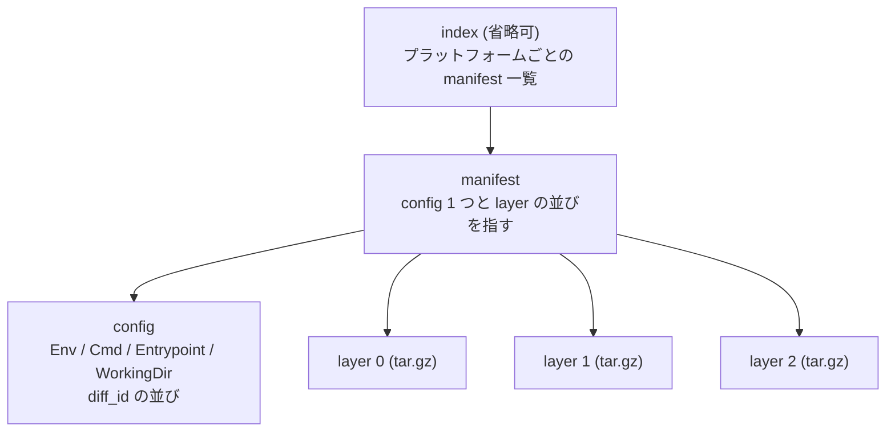

## 何を学んだか

### 3 つの仕様が、3 つの異なる問いに答えている

Open Container Initiative (OCI) が定めている仕様は 3 つある。それぞれ答えている問いが違う。

| 仕様                  | 答えている問い                             | 成果物の形                       |
| --------------------- | ------------------------------------------ | -------------------------------- |
| **Image Spec**        | イメージとは何のデータか                   | JSON 2 種類 + tar アーカイブ群   |
| **Distribution Spec** | それをどうやってネットワークで受け渡すか   | HTTP の URL パスとメディアタイプ |
| **Runtime Spec**      | 何が揃っていれば「コンテナを起動できる」か | ディレクトリ 1 つ                |

この 3 つが揃うと、「あるレジストリから引いたイメージを、どのランタイムでも同じように起動できる」が成立する。Docker で build したイメージを Podman で動かせるのも、Podman で build したイメージを Kubernetes ノードの containerd が動かせるのも、この 3 仕様のおかげだ。

そして重要なのは、**3 つとも「実装が話す API」ではなく「ディスクとネットワークの上の具体的な形」で書かれている** ことだ。関数呼び出しやライブラリのインターフェースを規定していないから、Go でも Rust でも C でも実装できるし、層と層の間を別プロセスにできる。

### Image Spec — イメージは manifest / config / layer

1 つのイメージは、次の 3 種類の blob からなる有向グラフだ。



すべてのノードは **content-addressable** で、`sha256:abcd...` という digest が名前そのものになる。中身が同じなら digest も同じなので、レイヤの共有・キャッシュ・改竄検出がすべて digest の比較だけで済む。

`config` に入っているのは、Dockerfile の `ENV` `CMD` `ENTRYPOINT` `WORKDIR` `USER` `EXPOSE` に相当する情報だ。つまり **イメージは rootfs だけでなく「どう起動されるべきか」も持っている**。エンジンはこれを読んで、コマンドラインで上書きされていない項目を埋める。

### Distribution Spec — レジストリはただの HTTP

レジストリとのやりとりは、驚くほど少ない種類の URL でできている。

- `GET /v2/` — 認証が要るかを確かめる (401 とともに認証方式が返る)
- `GET /v2/<name>/manifests/<reference>` — タグまたは digest で manifest を取る
- `GET /v2/<name>/blobs/<digest>` — config や layer の実体を取る
- `POST /v2/<name>/blobs/uploads/` — push のためのアップロードセッションを開く
- `GET /v2/<name>/tags/list` — タグ一覧

`docker pull` も `podman pull` も、この 4〜5 本のリクエストを組み合わせているだけだ。認証は独立した token サーバへのリダイレクトで行われるので、レジストリ本体は blob を配るだけの静的なサーバに近い。

### Runtime Spec — bundle というディレクトリ 1 つ

Runtime Spec が定めるのは、**bundle** と呼ばれるディレクトリの形だ。

```
/var/lib/containers/storage/overlay-containers/<id>/userdata/
├── config.json     ← 仕様が定める JSON
└── (rootfs へのパスは config.json の root.path に書く)
```

`config.json` に入るのは、process (実行するコマンド、環境変数、capability)、root (rootfs のパスと read-only か)、mounts (マウントの並び)、linux (namespace の一覧、cgroup パス、resources、seccomp、maskedPaths) など。前ページで見た「namespace・cgroup・rootfs・権限削減」の設定が、そのまま JSON のフィールドになっている。

そして仕様は、この bundle を受け取るランタイムの **コマンドラインの規約** も定めている。`create` `start` `kill` `delete` `state` という動詞と、それぞれの引数の意味だ。だから crun と runc は互いに差し替え可能になる。

**「エンジンとランタイムの境界は、ディレクトリ 1 つとサブコマンド 5 つ」** — これが OCI の一番効いている設計判断だ。境界がプロセス間の JSON とファイルシステムなので、gVisor (`runsc`) や Kata Containers のように中身がまったく違う実装も同じ位置に挿さる。

## ソースコードのどこか

### 3 仕様の実装が go.mod に並ぶ

[`go.mod#L51-L70`](https://github.com/podman-container-tools/podman/blob/v6.1.0/go.mod#L51-L70) を見ると、3 つの仕様それぞれに対応する依存がある。

```go title="go.mod"
	github.com/opencontainers/image-spec v1.1.1
	github.com/opencontainers/runtime-spec v1.3.0
	github.com/opencontainers/runtime-tools v0.9.1-0.20260316125833-8a4db579f5c8
	...
	go.podman.io/buildah v1.45.0
	go.podman.io/common v0.69.1
	go.podman.io/image/v5 v5.41.1
	go.podman.io/storage v1.64.0
```

`image-spec` と `runtime-spec` は **Go の型定義しか入っていない**。仕様の JSON をそのまま構造体にしたものだ。実際の処理は `go.podman.io/image` (Distribution Spec のクライアントと Image Spec の読み書き)、`go.podman.io/storage` (レイヤの展開とマウント)、`runtime-tools` (Runtime Spec の生成ヘルパー) が持つ。

### Distribution Spec のパスがそのまま定数になっている

[`vendor/go.podman.io/image/v5/docker/docker_client.go#L48-L51`](https://github.com/podman-container-tools/podman/blob/v6.1.0/vendor/go.podman.io/image/v5/docker/docker_client.go#L48-L51)。

```go title="go.podman.io/image/v5/docker/docker_client.go"
	tagsPath                = "/v2/%s/tags/list"
	manifestPath            = "/v2/%s/manifests/%s"
	blobsPath               = "/v2/%s/blobs/%s"
	blobUploadPath          = "/v2/%s/blobs/uploads/"
```

レジストリとの通信の全体が、実質この 4 本のパスに収まっている。`docker.io` も `quay.io` も `ghcr.io` も、同じ 4 本で話せる。

### Runtime Spec の bundle を書き出すのは 30 行の関数

Podman が OCI spec をディスクに置くのは [`libpod/container_internal.go#L2418`](https://github.com/podman-container-tools/podman/blob/v6.1.0/libpod/container_internal.go#L2418) の `saveSpec` だ。

```go title="libpod/container_internal.go"
// saveSpec saves the OCI spec to disk, replacing any existing specs for the container
func (c *Container) saveSpec(spec *spec.Spec) error {
	// If the OCI spec already exists, we need to replace it
	// Cannot guarantee some things, e.g. network namespaces, have the same
	// paths
	jsonPath := filepath.Join(c.bundlePath(), "config.json")
	...
	fileJSON, err := json.Marshal(spec)
	if err != nil {
		return fmt.Errorf("exporting runtime spec for container %s to JSON: %w", c.ID(), err)
	}
	if err := os.WriteFile(jsonPath, fileJSON, 0o644); err != nil {
```

「既存の spec があれば消してから書き直す」というコメントが実務的だ。ネットワーク namespace のパスなど、**コンテナを再起動するたびに変わる値が spec に埋まっている** ので、再利用ではなく毎回書き直す。

bundle の場所自体は [`libpod/container_internal.go#L117`](https://github.com/podman-container-tools/podman/blob/v6.1.0/libpod/container_internal.go#L117) で決まる。

```go title="libpod/container_internal.go"
func (c *Container) bundlePath() string {
	if c.runtime.storageConfig.TransientStore {
		return c.state.RunDir
	}
	return c.config.StaticDir
}
```

通常は永続ディレクトリ、`transient_store` が有効なら tmpfs 上の実行時ディレクトリ。**bundle は「捨ててよいもの」として扱われている** ことが分かる。

## なぜそうなっているか

### API ではなく「形」で決めたから、層が別プロセスにできた

3 仕様のいずれも、「この関数を実装せよ」とは言っていない。Image Spec は JSON のスキーマ、Distribution Spec は HTTP のパス、Runtime Spec はディレクトリとサブコマンドを決めている。この選択が効いた結果として、

- エンジン (Podman / dockerd / containerd) とランタイム (crun / runc / runsc) が別プロセスでよくなった
- ランタイムを Rust や C で書いてよくなった (crun は C、youki は Rust)
- 「イメージをビルドする道具」(Buildah、BuildKit、Kaniko) と「イメージを動かす道具」が完全に分離できた

もし OCI が「Go のインターフェース」として決まっていたら、この自由度はなかった。

### イメージが「起動方法」を持つのは、後方互換の産物でもある

Image Spec の config が `Cmd` や `Entrypoint` を持つのは、Docker のイメージフォーマットをほぼそのまま標準化したからだ。純粋に考えれば「ファイルシステムの中身」と「起動パラメータ」は別物だが、`docker run nginx` が引数なしで動く体験はこの設計に支えられている。

その代わり、エンジンには **「イメージが持つデフォルトと、ユーザが指定した値をどうマージするか」** という厄介な仕事が生まれる。Podman ではこれが `SpecGenerator` の第 2 段に集約されている ([「入力の解析」「意図の表現」「実行」を分ける](../specgen-two-stage/))。

## どう活かすか

- **「どの仕様の話をしているか」を意識すると、切り分けが速くなる。** pull できないのは Distribution Spec の層 (認証・ネットワーク・ミラー設定)、起動できないのは Runtime Spec の層 (config.json の中身)、`docker save` した tar が読めないのは Image Spec の層。エラーメッセージがどの層から出ているかで、見るべき設定ファイルが変わる。
- **境界を「形」で定義すると実装の自由度が上がる。** 自分の設計でも、モジュール間の契約を「共有ライブラリの型」ではなく「ディスク上のファイル形式」や「HTTP のパス」で切ると、後から片側を別言語・別プロセスに移せる。ただし形式のバージョニングは自分でやる必要がある。
- **content-addressable にすると、キャッシュと検証が同じ仕組みになる。** digest がそのまま名前なので、「持っているか」の判定と「壊れていないか」の判定が同じ比較で済む。大きなバイナリを配る仕組みを作るときに真似できる。
