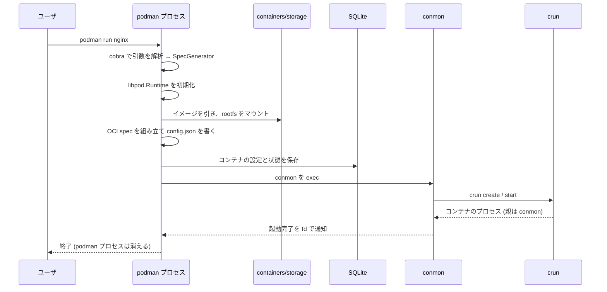

## 何を学んだか

### 1 回の実行で組み立てて、終わったら捨てる

`podman run nginx` を叩くと、1 つの `podman` プロセスの中で次の順に事が進む。



ポイントは最後の 2 行だ。**`podman` は conmon の起動を見届けたら終了する**。デタッチモードなら即座に、フォアグラウンドなら attach したまま残るが、いずれにせよ「コンテナを管理する常駐プロセス」にはならない。

その結果、`ps` のプロセスツリーはこうなる。

```
systemd
└─ conmon -c 4f2c... -u 4f2c... -r /usr/bin/crun -b /var/lib/.../userdata ...
   └─ nginx: master process nginx -g daemon off;
      └─ nginx: worker process
```

`podman` はどこにもいない。crun もいない。**残るのは conmon とコンテナのプロセスだけ** だ。

### `libpod.Runtime` がエンジンの部品表になっている

`podman` プロセスの中でエンジンの実体を持っているのが `libpod.Runtime` だ。この構造体のフィールドが、そのまま「コンテナエンジンが必要とする部品」の一覧になっている。

- **設定** — `containers.conf` などから読んだもの
- **ストレージ** — レイヤと rootfs を管理する `containers/storage` の `Store`
- **イメージ** — レジストリと会話し、イメージを扱う `libimage.Runtime`
- **状態** — SQLite に置かれた `State`
- **ロック** — `/dev/shm` 上のプロセス間ロック `lock.Manager`
- **ネットワーク** — netavark を呼ぶ `ContainerNetwork`
- **OCI ランタイム** — conmon 経由で crun を呼ぶ `OCIRuntime`
- **イベント** — journald かファイルに書く `Eventer`
- **シークレット** — `SecretsManager`

Docker で言えば dockerd の中身に相当するものが、**常駐プロセスではなく 1 つの Go 構造体として、コマンド実行のたびに組み立てられる**。

### デーモンは「あってもいい」が「要らない」

Podman にも `podman system service` という常駐モードがある。REST API (Docker 互換 + Podman 固有) を unix socket に出すもので、Docker CLI や Docker Compose から使うときに立てる。

ただしこれは **API を出すためだけのプロセス** で、コンテナの管理には要らない。`podman system service` を落としても、動いているコンテナには何の影響もない。コンテナの親は conmon であって、このサービスではないからだ。しかも systemd の socket activation で「接続が来たら起動、しばらく無通信なら終了」にできる。

「デーモンがあるかないか」ではなく、**「コンテナの生存がデーモンに依存しているかどうか」** が Docker との本質的な差だ、という点はここで押さえておきたい。

## ソースコードのどこか

### main は 20 行ちょっとで、最初にやるのが re-exec の判定

[`cmd/podman/main.go#L49`](https://github.com/podman-container-tools/podman/blob/v6.1.0/cmd/podman/main.go#L49)。

```go title="cmd/podman/main.go"
func main() {
	if reexec.Init() {
		// We were invoked with a different argv[0] indicating that we
		// had a specific job to do as a subprocess, and it's done.
		return
	}
```

`podman` バイナリは、**自分自身を別の役割で起動し直す** ことがある。`reexec.Init()` は「今の argv[0] が特殊な名前なら、その役割を果たして終了する」という分岐だ。rootless の namespace 操作、pause プロセス、コンテナ終了後の後始末 — いずれも「新しい `podman` プロセス」として実行される。

デーモンがないので、**「あとでやる仕事」は自分自身を再度起動することで表現するしかない**。この方針が、`main` の 1 行目に現れている。

### Runtime 構造体がそのまま部品表

[`libpod/runtime.go#L66`](https://github.com/podman-container-tools/podman/blob/v6.1.0/libpod/runtime.go#L66)。

```go title="libpod/runtime.go"
type Runtime struct {
	config        *config.Config
	storageConfig storage.StoreOptions
	storageSet    storageSet

	state                     State
	store                     storage.Store
	storageService            *storageService
	imageContext              types.SystemContext
	defaultOCIRuntime         OCIRuntime
	ociRuntimes               map[string]OCIRuntime
	runtimeFlags              []string
	network                   nettypes.ContainerNetwork
	conmonPath                string
	libimageRuntime           *libimage.Runtime
	libimageEventsShutdown    chan bool
	libartifactEventsShutdown chan bool
	lockManager               lock.Manager
	...
	// mechanism to read and write even logs
	eventer events.Eventer

	// secretsManager manages secrets
	secretsManager *secrets.SecretsManager
}
```

`store` (containers/storage)、`libimageRuntime` (containers/image のラッパー)、`network` (netavark)、`defaultOCIRuntime` (conmon + crun)、`state` (SQLite)、`lockManager` (共有メモリ)、`eventer` (journald)。**外部ライブラリと外部プロセスへの窓口が、フィールドとして横に並んでいる**。

`ociRuntimes map[string]OCIRuntime` があるのは、コンテナごとに違うランタイムを使えるからだ (`--runtime=runsc` など)。

### ストアとイメージの初期化は 25 行

[`libpod/runtime.go#L1004`](https://github.com/podman-container-tools/podman/blob/v6.1.0/libpod/runtime.go#L1004) の `configureStore`。

```go title="libpod/runtime.go"
func (r *Runtime) configureStore() error {
	store, err := storage.GetStore(r.storageConfig)
	if err != nil {
		return err
	}

	r.store = store
	is.Transport.SetStore(store)

	// Set up a storage service for creating container root filesystems from
	// images
	r.storageService = getStorageService(r.store)

	runtimeOptions := &libimage.RuntimeOptions{
		SystemContext: &r.imageContext,
	}
	libimageRuntime, err := libimage.RuntimeFromStore(store, runtimeOptions)
	if err != nil {
		return err
	}
	r.libimageRuntime = libimageRuntime
```

注目したいのは `is.Transport.SetStore(store)` の 1 行だ。`is` は `containers/image` の **storage transport**、つまり `containers-storage:` という URL スキームの実装で、そこに「このストアを使え」と教えている。これで `containers/image` の世界と `containers/storage` の世界が繋がり、`podman pull docker://nginx` が「docker transport から読んで containers-storage transport に書く」というコピー操作として表現できるようになる ([イメージをどこから取るかを transport で抽象化する](../image-transports/))。

### conmon の起動が「委譲」の実体

[`libpod/oci_conmon_common.go#L1300`](https://github.com/podman-container-tools/podman/blob/v6.1.0/libpod/oci_conmon_common.go#L1300) の `sharedConmonArgs` が、conmon に渡す引数を組み立てる。

```go title="libpod/oci_conmon_common.go"
	// set the conmon API version to be able to use the correct sync struct keys
	args := []string{
		"--api-version", "1",
		"-c", ctr.ID(),
		"-u", cuuid,
		"-r", r.path,
		"-b", bundlePath,
		"-p", pidPath,
		"-n", ctr.Name(),
		"--exit-dir", exitDir,
		"--persist-dir", persistDir,
		"--full-attach",
	}
```

`-r` が OCI ランタイムのパス、`-b` が bundle のパス、`--exit-dir` が終了コードを書く場所。**「このランタイムでこの bundle を起動し、終わったら終了コードをここに書け」** という指示になっている。Podman から conmon への引き継ぎが、コマンドライン引数だけで完結していることが分かる。

そして [`libpod/oci_conmon_common.go#L1138`](https://github.com/podman-container-tools/podman/blob/v6.1.0/libpod/oci_conmon_common.go#L1138) で普通に exec する。

```go title="libpod/oci_conmon_common.go"
	cmd := exec.Command(r.conmonPath, args...)
```

gRPC も ttrpc もない。`exec.Command` 1 本だ。containerd が shim と ttrpc で会話し続けるのに対して、Podman は **起動時に引数を渡したらそれきり** で、以降のやりとりはファイルシステム (exit file、pid file、attach socket) を介して行う。詳しくは [コンテナの監視を小さな別プロセスに委ねる](../conmon-supervision/) で扱う。

## なぜそうなっているか

### 常駐しないと決めると、通信路がファイルシステムになる

デーモンがあれば、shim との通信は生きたソケットで持てる。デーモンがないと、**次に起動する `podman` プロセスが読めるところ** にしか情報を置けない。だから Podman では、

- コンテナの状態 → SQLite
- コンテナの終了コード → exit file
- conmon の pid → pid file
- attach 用の stdio → unix socket (ファイルとして存在する)
- 排他 → `/dev/shm` 上の mutex

と、**すべての情報がファイルシステム上の名前で引ける** ようになっている。これは制約から出た設計だが、副作用として「別のプロセスがいつでも参加できる」という性質が生まれた。`podman ps` を別のターミナルで叩けるのも、`podman healthcheck run` を systemd の timer から起動できるのも、この形のおかげだ。

### 部品を構造体に集めると、初期化順の問題が表に出る

`Runtime` の初期化は 200 行以上ある。ストアが要るがその前に user namespace に入っている必要があり、DB が要るがその前にロックマネージャが要り、そのロック番号は DB に入っている、という循環しかけの依存があるからだ。デーモンなら起動時に 1 回やればいい仕事を、**Podman はコマンドを叩くたびにやり直している**。

その代償として、`podman` のコマンド 1 回あたりの起動コストは Docker CLI より高い。`docker ps` は動いているデーモンに聞くだけだが、`podman ps` はストアを開き DB を開き状態を照合する。デーモンレスは「速いから」選ばれたのではなく、**特権と依存関係を減らすために起動コストを払っている** という理解が正しい。

## どう活かすか

- **「どのプロセスが生き残るか」を先に描くと、設計の制約が見える。** Podman の設計は「起動後に残るのは conmon だけ」という一点からほとんど導ける。自分でツールを設計するときも、実行後のプロセスツリーを先に描いてみると、状態の置き場所が決まる。
- **依存する外部の窓口を 1 つの構造体に集めると、範囲が見える。** `libpod.Runtime` のフィールドを見れば、Podman が外の世界と接する点が全部わかる。テストで差し替えたい箇所も、依存を切りたい箇所も、ここに現れる。
- **常駐プロセスをやめるなら、通信路をファイルシステムに移す覚悟が要る。** 「名前で引ける場所に置く」という制約を受け入れると、代わりに「誰でもいつでも参加できる」が手に入る。逆に、その名前の設計 (どこに何を置くか) が仕様そのものになるので、後から変えにくくなる。
