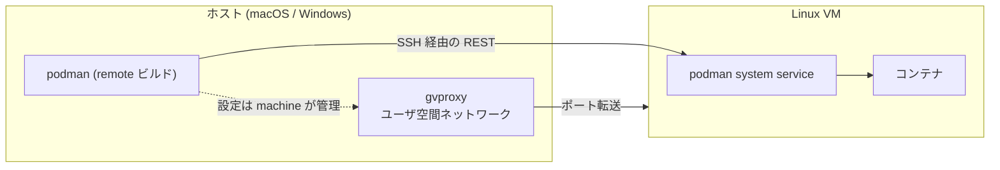

## 何を学んだか

### macOS / Windows に Linux コンテナは存在しない

コンテナは Linux カーネルの機能なので、macOS や Windows では動かない。動かすには Linux VM が要る。

Docker Desktop も Podman も、やっていることは同じだ。**Linux VM を 1 つ立て、その中でコンテナエンジンを動かし、ホストの CLI からそこに話しかける**。

Podman の場合、ホスト側の `podman` は `podman-remote` としてビルドされたもので、libpod を持たない ([abi と tunnel の切り替え](../abi-tunnel-engine/))。VM の中の `podman system service` に REST でつなぐ。



### VM のハイパーバイザは 5 種類

`VMType` として定義されているのは 5 つ。

| 種類      | プラットフォーム     | 実体                              |
| --------- | -------------------- | --------------------------------- |
| `applehv` | macOS                | Apple の Virtualization.framework |
| `libkrun` | macOS                | libkrun (GPU パススルーなど)      |
| `hyperv`  | Windows              | Hyper-V                           |
| `wsl`     | Windows              | WSL2                              |
| `qemu`    | Linux (テスト用など) | QEMU                              |

これらは `VMProvider` という 21 メソッドのインターフェースの実装として抽象化されている。

### VM の中身は OCI アーティファクトで配られる

VM のディスクイメージは、**コンテナレジストリから OCI アーティファクトとして pull される**。`pkg/machine/ocipull` が `containers/image` を使って取得する。

つまり `podman machine init` は、レジストリから VM イメージを引いてくる。イメージの配布に既存の仕組みをそのまま使っている。

初期設定 (ユーザ、SSH 鍵、systemd unit、マウント設定) は **Ignition** で流し込む。Fedora CoreOS の仕組みで、初回起動時に JSON の設定を適用する。

### ネットワークは gvproxy

VM のネットワークは、`gvisor-tap-vsock` の `gvproxy` というユーザ空間のネットワークスタックが受け持つ。ホスト側で動き、VM とは vsock や unix socket で繋がる。

役割は 3 つ。

- **VM の外向き通信** — NAT 相当
- **ポート転送** — `-p 8080:80` のホスト側 8080 を受ける
- **SSH の中継** — `podman` が VM に繋ぐための SSH ポート

rootless の pasta と発想が同じで、**特権なしにネットワークを提供するためにユーザ空間にスタックを置く**。macOS で管理者権限を要求しないのはこのためだ。

## ソースコードのどこか

### VMProvider は 21 メソッド

[`pkg/machine/vmconfigs/config.go#L61`](https://github.com/podman-container-tools/podman/blob/v6.1.0/pkg/machine/vmconfigs/config.go#L61)。

```go title="pkg/machine/vmconfigs/config.go"
type VMProvider interface { //nolint:interfacebloat
	CreateVM(opts define.CreateVMOpts, mc *MachineConfig, builder *ignition.IgnitionBuilder) error
	PrepareIgnition(mc *MachineConfig, ignBuilder *ignition.IgnitionBuilder) (*ignition.ReadyUnitOpts, error)
	Exists(name string) (bool, error)
	MountType() VolumeMountType
	MountVolumesToVM(mc *MachineConfig, quiet bool) error
	Remove(mc *MachineConfig) ([]string, func() error, error)
	RemoveAndCleanMachines(dirs *define.MachineDirs) error
	SetProviderAttrs(mc *MachineConfig, opts define.SetOptions) error
	StartNetworking(mc *MachineConfig, cmd *gvproxy.GvproxyCommand) error
	PostStartNetworking(mc *MachineConfig, noInfo bool) error
	StartVM(mc *MachineConfig) (func() error, func() error, error)
	State(mc *MachineConfig, bypass bool) (define.Status, error)
	StopVM(mc *MachineConfig, hardStop bool) error
	StopHostNetworking(mc *MachineConfig, vmType define.VMType) error
	VMType() define.VMType
	UserModeNetworkEnabled(mc *MachineConfig) bool
	UseProviderNetworkSetup() bool
	RequireExclusiveActive() bool
	UpdateSSHPort(mc *MachineConfig, port int) error
	GetRosetta(mc *MachineConfig) (bool, error)
}
```

`//nolint:interfacebloat` が付いている。**巨大であることを認めた上で許可している**。前に見た `OCIRuntime` にも同じ注釈があった。

メソッドを分類すると、抽象化の難しさが見える。

- **ライフサイクル** — `CreateVM` / `StartVM` / `StopVM` / `Remove` / `State`
- **ネットワーク** — `StartNetworking` / `PostStartNetworking` / `StopHostNetworking` / `UserModeNetworkEnabled` / `UseProviderNetworkSetup`
- **能力の問い合わせ** — `MountType` / `RequireExclusiveActive` / `GetRosetta`

**能力の問い合わせが多い**のが特徴だ。`UseProviderNetworkSetup()` は「このプロバイダは自分でネットワークを設定するか」を返し、共通コードがそれを見て分岐する。WSL は Windows 側が既にネットワークを持っているので gvproxy が要らない、といった差を吸収している。

`GetRosetta()` は Apple Silicon 上で x86_64 バイナリを動かすための Rosetta 2 の有無で、**完全にプラットフォーム固有のメソッドがインターフェースに漏れている**。抽象化しきれないものを、正直にメソッドとして出している。

`StartVM` の戻り値が `(func() error, func() error, error)` と関数を 2 つ返すのも目を引く。起動後の待ち合わせと後始末を、呼び出し側のタイミングで実行できるようにしている。

### VMType は文字列とアーティファクト型を持つ

[`pkg/machine/define/vmtype.go`](https://github.com/podman-container-tools/podman/blob/v6.1.0/pkg/machine/define/vmtype.go)。

```go title="pkg/machine/define/vmtype.go"
type VMType int64

const (
	QemuVirt VMType = iota
	WSLVirt
	AppleHvVirt
	HyperVVirt
	LibKrun
	UnknownVirt
)
```

```go title="pkg/machine/define/vmtype.go"
// DiskType returns a string representation that matches the OCI artifact
// type on the container image registry
func (v VMType) DiskType() string {
	switch v {
	case WSLVirt:
		return wsl
		// Both AppleHV and Libkrun use same raw disk flavor
	case AppleHvVirt, LibKrun:
		return appleHV
	case HyperVVirt:
		return hyperV
	}
	return qemu
}
```

`String()` と `DiskType()` が別々にある。**VM の種類とディスクイメージの種類は 1 対 1 ではない**。applehv と libkrun は同じ raw ディスクを使うので、`DiskType()` では同じ値になる。

「レジストリ上の OCI アーティファクト型に対応する文字列」というコメントが、VM イメージがどう配られるかを示している。

### gvproxy はコマンドラインを組み立てて exec する

[`vendor/github.com/containers/gvisor-tap-vsock/pkg/types/gvproxy_command.go#L180`](https://github.com/podman-container-tools/podman/blob/v6.1.0/vendor/github.com/containers/gvisor-tap-vsock/pkg/types/gvproxy_command.go#L180)。

```go title="gvisor-tap-vsock/pkg/types/gvproxy_command.go"
func (c *GvproxyCommand) ToCmdline() []string {
	args := []string{}

	// listen (endpoints)
	args = append(args, c.endpointsToCmdline()...)

	args = append(args, c.servicesEndpointsToCmdline()...)

	// debug
	if c.Debug {
		args = append(args, "-debug")
	}

	// mtu
	args = append(args, "-mtu", strconv.Itoa(c.MTU))

	// ssh-port
	args = append(args, "-ssh-port", strconv.Itoa(c.SSHPort))

	// sockets
	args = append(args, c.socketsToCmdline()...)

	// forward info
	args = append(args, c.forwardInfoToCmdline()...)

	// pid-file
	if c.PidFile != "" {
		args = append(args, "-pid-file", c.PidFile)
	}
```

**構造体を組み立ててからコマンドラインに変換する**という形になっている。文字列を直接組み立てるのではなく、型付きのフィールドを埋めてから `ToCmdline()` を呼ぶ。

これは netavark や conmon の呼び出し (直接 `args = append(...)` する) より一段整理されている。gvproxy の引数が多く、プラットフォームごとに違う組み合わせになるので、中間の型を挟む価値があった。

`VMProvider.StartNetworking(mc, cmd *gvproxy.GvproxyCommand)` の引数がこの型なのも同じ理由だ。**共通コードが基本的な引数を埋め、プロバイダが自分の分を足す**、という分担ができる。

### gvproxy の後始末は pid ファイル経由

[`pkg/machine/gvproxy.go#L36`](https://github.com/podman-container-tools/podman/blob/v6.1.0/pkg/machine/gvproxy.go#L36)。

```go title="pkg/machine/gvproxy.go"
// CleanupGVProxy reads the --pid-file for gvproxy attempts to stop it
```

```go title="pkg/machine/gvproxy.go"
		// The file will also be removed by gvproxy when it exits so
```

`podman machine stop` を叩いたプロセスは、gvproxy を起動したプロセスとは別だ。だから **pid ファイルを介してしか止められない**。デーモンレスの Podman が conmon や rootlessport を扱うのと同じ構造が、machine でも繰り返されている。

gvproxy 自身が終了時に pid ファイルを消すので、ファイルの有無が生存の目安になる。

### VM イメージの pull は containers/image をそのまま使う

[`pkg/machine/ocipull/pull.go#L45-L50`](https://github.com/podman-container-tools/podman/blob/v6.1.0/pkg/machine/ocipull/pull.go#L45)。

```go title="pkg/machine/ocipull/pull.go"
// noSignaturePolicy is a default policy if policy.json is not found on
// the host machine.
```

```go title="pkg/machine/ocipull/pull.go"
// pull `imageInput` from a container registry to `sourcePath`.
func pull(ctx context.Context, imageInput types.ImageReference, localDestPath *define.VMFile, options *pullOptions) error {
```

`types.ImageReference` を受け取る。**VM イメージの取得が、通常のイメージ取得とまったく同じ型を使っている**。

`noSignaturePolicy` のコメントも実務的で、macOS や Windows には `/etc/containers/policy.json` が無いことがある。その場合の既定ポリシーを内蔵している。**Linux 前提のライブラリを非 Linux で使うときの穴埋め** が、こういう形で必要になる。

## なぜそうなっているか

### VM を「もう 1 つの remote 先」として扱えた

`podman machine` の実装が VM の管理に集中できているのは、**リモート実行の仕組みが既にあった** からだ。VM の中の Podman と話す部分は、SSH 経由のリモート接続として既存の `tunnel` 実装がそのまま使える。

`podman system connection` で管理されるリモート接続の 1 つが machine になっている、という構造だ。SSH 先が別マシンでも VM でも、クライアントから見れば同じになる。

**抽象が先にあったから、新しい実行環境が安く足せた**。これは `kube play` が `SpecGenerator` の恩恵を受けたのと同じ構図といえる。

### Docker Desktop との違いは、分割のされ方

Docker Desktop も同じ問題を解いているが、1 つの製品としてまとまっている。Podman は、

- VM の管理 → `podman machine`
- VM イメージ → OCI レジストリ上のアーティファクト
- 初期設定 → Ignition (Fedora CoreOS の仕組み)
- ネットワーク → gvproxy (独立したプロジェクト)
- VM の中身 → 通常の Podman

と、**既存のコンポーネントの組み合わせ** になっている。それぞれが独立して更新でき、他の用途にも使える (gvproxy は Podman 以外からも使える)。

代償は、構成要素が多く、どこで壊れたか分かりにくいことだ。`podman machine` のトラブルシュートでは、gvproxy のログ、VM の中の journal、SSH の接続、Ignition の適用結果と、見る場所が分散する。

### 巨大なインターフェースを許容した

`VMProvider` の 21 メソッドは、明らかに大きい。分割することもできた (ライフサイクル、ネットワーク、能力問い合わせ)。

そうしなかったのは、**実装が 5 つしかなく、すべてが同じセットを必要とする** からだ。インターフェースを分けると、5 つの実装が 3 つのインターフェースを実装することになり、組み立ての複雑さが増えるだけになる。

`//nolint:interfacebloat` は「リンタの指摘は理解しているが、この場合は妥当だと判断した」という意思表示だ。**リンタを黙らせる注釈に、判断の記録としての価値がある**。

## どう活かすか

- **リモート実行の抽象があると、新しい実行環境が安く足せる。** ローカル/リモートの分離を最初にやっておくと、VM でも、クラウドでも、コンテナの中でも、同じクライアントが使える。
- **能力の問い合わせメソッドで実装差を吸収する。** `UseProviderNetworkSetup()` のように、共通コードが「この実装はどうするか」を尋ねる形にすると、条件分岐が共通コード側に集まって読みやすくなる。
- **引数が多い外部コマンドは、中間の型を挟む。** 文字列を直接組み立てるのは引数が少ないうちだけ。型付きの構造体 + `ToCmdline()` にすると、部分的に埋めて渡すことができる。
- **リンタを黙らせる注釈は、判断の記録として書く。** `//nolint:interfacebloat` があることで、「気づかずに大きくなった」のではなく「意図的に大きい」ことが伝わる。
- **抽象化しきれないものは、正直にメソッドとして出す。** `GetRosetta()` のようなプラットフォーム固有の概念を無理に一般化すると、名前から意味が読めなくなる。
