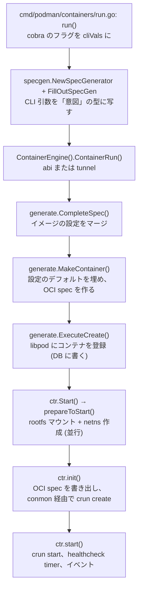

## 何を学んだか

### 8 段の道のり

`podman run -d --name web -p 8080:80 nginx` が通る経路を、関数名で並べるとこうなる。



段の切れ目には意味がある。

- **A → B** — 「CLI の都合」と「コンテナを作る意図」の分離。ここまでが `podman` に固有で、B の出力 (`SpecGenerator`) は JSON にできる
- **C** — ローカル実行 (`abi`) かリモート実行 (`tunnel`) かの分岐。リモートならここで `SpecGenerator` が HTTP のボディになる
- **D → E** — イメージが持つデフォルトと設定ファイルのデフォルトをマージし、検証する段。ここで初めて `libpod` が要る
- **F** — コンテナが DB に載る。この時点でまだプロセスは無い (`Created` ですらなく `Configured`)
- **G → I** — 実体を作る段。マウント、ネットワーク、OCI ランタイム

`podman create` は F まで、`podman start` は G から、`podman run` は全部。**同じ関数列を途中で切って別コマンドにしている**。

### 「作る」と「動かす」の間にディスクへの書き込みがある

F で DB に書かれるのは、`SpecGenerator` 由来の **設定** と、生成された **OCI spec** だ。ただしこの時点の OCI spec は完成品ではない。

H の `init()` で、もう一度 spec を生成し直してディスクに書く。

なぜ二度手間かというと、**ネットワーク namespace のパスのように、起動のたびに変わる値がある** からだ。DB に保存するのは「設定としての spec」、ディスクの `config.json` に書くのは「今回の起動のための spec」。役割が違う。

### rootfs とネットワークは並行に作る

G の `prepare()` は、goroutine を 2 本立てて「rootfs のマウント」と「netns の作成」を同時に走らせる。どちらも数十〜数百ミリ秒かかる I/O 待ちなので、直列にすると起動が目に見えて遅くなる。

両方の完了を待ってから、エラーを 1 つに畳んで返す。**片方が失敗してももう片方の後始末が要る** ので、単純な `errgroup` ではなく `sync.WaitGroup` と個別のエラー変数を使っている。

## ソースコードのどこか

### CLI 側は「意図」を作って渡すだけ

[`cmd/podman/containers/run.go#L204-L235`](https://github.com/podman-container-tools/podman/blob/v6.1.0/cmd/podman/containers/run.go#L204)。

```go title="cmd/podman/containers/run.go"
	s := specgen.NewSpecGenerator(imageName, cliVals.RootFS)
	if err := specgenutil.FillOutSpecGen(s, &cliVals, args); err != nil {
		return err
	}
	...
	report, err := registry.ContainerEngine().ContainerRun(registry.Context(), runOpts)
```

CLI が触るのは `SpecGenerator` と `ContainerEngine` インターフェースだけだ。`libpod` は import すらしていない。この分離が、`podman-remote` を同じ `main` から作れる理由になっている ([abi と tunnel の切り替え](../abi-tunnel-engine/))。

### abi 側は 3 つの関数を順に呼ぶ

[`pkg/domain/infra/abi/containers.go#L1191`](https://github.com/podman-container-tools/podman/blob/v6.1.0/pkg/domain/infra/abi/containers.go#L1191) 以降。

```go title="pkg/domain/infra/abi/containers.go"
	warn, err := generate.CompleteSpec(ctx, ic.Libpod, opts.Spec)
	if err != nil {
		return nil, err
	}
	// Print warnings
	for _, w := range warn {
		fmt.Fprintf(os.Stderr, "%s\n", w)
	}
	...
	rtSpec, spec, optsN, err := generate.MakeContainer(ctx, ic.Libpod, opts.Spec, false, nil)
	if err != nil {
		return nil, err
	}
	ctr, err := generate.ExecuteCreate(ctx, ic.Libpod, rtSpec, spec, false, optsN...)
```

`CompleteSpec` → `MakeContainer` → `ExecuteCreate` の 3 段。この 3 つは REST API のハンドラからも `kube play` からも同じ順で呼ばれる ([2 段構成の specgen](../specgen-two-stage/))。

`CompleteSpec` が **警告のリストを返す** のが面白い。エラーではないが伝えたいこと (「そのオプションはこの環境では効かない」など) を、戻り値として上に運んでいる。ログに直接書かないので、REST API 越しでもクライアントに届けられる。

### Detach かどうかで分岐する

```go title="pkg/domain/infra/abi/containers.go"
	if opts.Detach {
		// if the container was created as part of a pod, also start its dependencies, if any.
		if err := ctr.Start(ctx, true); err != nil {
			...
		}
		return &report, nil
	}

	// if the container was created as part of a pod, also start its dependencies, if any.
	if err := terminal.StartAttachCtr(ctx, ctr, opts.OutputStream, opts.ErrorStream, opts.InputStream, opts.DetachKeys, opts.SigProxy, true); err != nil {
```

`-d` なら `Start` して即 return、そうでなければ `StartAttachCtr` で attach したまま待つ。**`podman run` がフォアグラウンドのとき、`podman` プロセスは conmon の attach ソケットに繋がったまま残る**。デーモンレスでも `docker run` と同じ体験になるのはこのためだ。

デッドロックの検出が入っているのも目を引く。

```go title="pkg/domain/infra/abi/containers.go"
		if errors.Is(err, define.ErrWillDeadlock) {
			logrus.Debugf("Deadlock error on %q: %v", ctr.ID(), err)
			report.ExitCode = define.ExitCode(err)
			return &report, fmt.Errorf("attempting to start container %s would cause a deadlock; please run 'podman system renumber' to resolve", ctr.ID())
		}
```

「このコンテナを起動するとデッドロックする。`podman system renumber` で直せ」。プロセス間ロックを番号で管理している副作用で、番号の割り当てが壊れるとロック順序が守れなくなる ([共有メモリのロック](../shm-lock-manager/))。**起こりうる異常と、その復旧手順がエラーメッセージに書いてある**。

### prepare は 2 本の goroutine

[`libpod/container_internal_linux.go#L60`](https://github.com/podman-container-tools/podman/blob/v6.1.0/libpod/container_internal_linux.go#L60)。

```go title="libpod/container_internal_linux.go"
func (c *Container) prepare() error {
	var (
		wg                              sync.WaitGroup
		netNS                           string
		networkStatus                   map[string]types.StatusBlock
		createNetNSErr, mountStorageErr error
		mountPoint                      string
		tmpStateLock                    sync.Mutex
	)

	shutdown.Inhibit()
	defer shutdown.Uninhibit()

	wg.Add(2)

	go func() {
		defer wg.Done()
		...
		// Set up network namespace if not already set up
		noNetNS := c.state.NetNS == ""
		if c.config.CreateNetNS && noNetNS && !c.config.PostConfigureNetNS {
			c.reservedPorts, createNetNSErr = c.bindPorts()
			...
			netNS, networkStatus, createNetNSErr = c.runtime.createNetNS(c)
```

冒頭の `shutdown.Inhibit()` が重要だ。ここから先は **「DB に記録されていない実体」が生まれる区間** で、途中で SIGTERM に殺されると netns やマウントが漏れる。だからシグナルの配送を区間の外まで遅らせる ([シグナルの配送を遅らせる](../shutdown-inhibit/))。

ポートのバインドがネットワーク作成より先にあるのも意図的で、`bindPorts` はホスト側のポートを先に掴んでおくことで「起動してから使用中と分かる」のを防いでいる。

もう 1 本は素直だ。

```go title="libpod/container_internal_linux.go"
	// Mount storage if not mounted
	go func() {
		defer wg.Done()
		mountPoint, mountStorageErr = c.mountStorage()
		...
		c.state.Mounted = true
		c.state.Mountpoint = mountPoint

		logrus.Debugf("Created root filesystem for container %s at %s", c.ID(), c.state.Mountpoint)
	}()

	wg.Wait()
```

`mountStorage()` の中で `containers/storage` が overlayfs をマウントし、`merged` ディレクトリのパスが返ってくる。それが OCI spec の `root.path` になる。

### init が spec を書いて crun create を呼ぶ

[`libpod/container_internal.go#L1025`](https://github.com/podman-container-tools/podman/blob/v6.1.0/libpod/container_internal.go#L1025)。

```go title="libpod/container_internal.go"
func (c *Container) init(ctx context.Context, retainRetries bool) error {
	// Unconditionally remove conmon temporary files.
	// We've been running into far too many issues where they block startup.
	if err := c.removeConmonFiles(); err != nil {
		return err
	}

	// Generate the OCI newSpec
	newSpec, cleanupFunc, err := c.generateSpec(ctx)
	...
	// Save the OCI newSpec to disk
	if err := c.saveSpec(newSpec); err != nil {
		return err
	}
```

1 行目のコメントが率直だ。「**conmon の一時ファイルは無条件に消す。起動をブロックする問題が多すぎた**」。前回の残骸が残っていると起動に失敗するので、条件を考えずに毎回消す方針にした。デーモンレスで「前回の状態」がファイルとして残る設計の、現実的な帰結といえる。

そして spec を書き終えたら、また Inhibit してから conmon を起動する。

```go title="libpod/container_internal.go"
	// To ensure that we don't lose track of Conmon if hit by a SIGTERM
	// in the middle of setting up the container, inhibit shutdown signals
	// until after we save Conmon's PID to the state.
	// TODO: This can likely be removed once conmon-rs support merges.
	shutdown.Inhibit()
	defer shutdown.Uninhibit()
	...
	// With the spec complete, do an OCI create
	if _, err = c.ociRuntime.CreateContainer(c, nil); err != nil {
		return err
	}
```

「conmon の PID を state に保存し終えるまでシグナルを抑止する。さもないと conmon を見失う」。**プロセスを起動してから、その PID を記録するまでの隙間** が危険区間になっている。

### start は 40 行で、副作用が 3 つ

[`libpod/container_internal.go#L1290`](https://github.com/podman-container-tools/podman/blob/v6.1.0/libpod/container_internal.go#L1290)。

```go title="libpod/container_internal.go"
func (c *Container) start() error {
	if c.config.Spec.Process != nil {
		logrus.Debugf("Starting container %s with command %v", c.ID(), c.config.Spec.Process.Args)
	}

	if err := c.ociRuntime.StartContainer(c); err != nil {
		return err
	}
	logrus.Debugf("Started container %s", c.ID())

	c.state.State = define.ContainerStateRunning

	// Unless being ignored, set the MAINPID to conmon.
	if c.config.SdNotifyMode != define.SdNotifyModeIgnore {
		payload := fmt.Sprintf("MAINPID=%d", c.state.ConmonPID)
		...
	}

	if c.HasHealthCheck() {
		if err := c.updateHealthStatus(define.HealthCheckStarting); err != nil {
			return fmt.Errorf("update healthcheck status: %w", err)
		}
		if err := c.startTimer(c.config.StartupHealthCheckConfig != nil); err != nil {
			return fmt.Errorf("start healthcheck: %w", err)
		}
	}

	c.newContainerEvent(events.Start)

	return c.save()
}
```

`crun start` を呼んだあとにやることが 3 つ。

1. **systemd に MAINPID を通知する** — conmon の PID を「このサービスの主プロセス」として教える ([sdnotify と MAINPID](../sdnotify-mainpid/))
2. **ヘルスチェックの transient timer を作る** — systemd に定期実行を頼む ([transient timer](../systemd-healthcheck/))
3. **イベントを書き、状態を保存する**

デーモンなら「起動した」で終わるところに、**外部の常駐サービス (systemd) への依頼が 2 つ** 挟まる。前提群で見た「デーモンの仕事を systemd に渡す」が、この 40 行に凝縮されている。

## なぜそうなっているか

### 段を切ったのは、入口が 4 つあるから

`podman run` の経路は、CLI 以外に REST API、Docker 互換 API、`kube play` からも入ってくる。入口ごとに全部書くと 4 倍のコードになる。

そこで「入力を `SpecGenerator` にする」までを入口ごとに書き、**そこから先は 1 本に合流させた**。`CompleteSpec` → `MakeContainer` → `ExecuteCreate` の 3 段が合流点になる。

`podman create` / `podman start` という「途中で切る」コマンドが自然に作れるのも、段が明示的に分かれているからだ。

### 並行化したのは、遅い I/O が 2 つ独立していたから

rootfs のマウントと netns の作成は互いに依存しない。前者はストレージの I/O とマウント syscall、後者は外部バイナリ (netavark / pasta) の実行を伴う。デーモンなら起動時に温めておけるが、Podman は毎回やる。

**デーモンレスの起動コストを、並行化で埋め合わせている** 箇所といえる。ただし並行化した分、エラー処理は複雑になった。2 つのエラー変数を用意して、両方待ってから畳んでいるのはそのためだ。

### 危険区間が 2 か所ある

`prepare()` の全体と、`init()` の conmon 起動部分。どちらも **「外部リソースを作ったが、まだ DB に記録していない」** 状態を通る。デーモンならメモリ上の状態とリソースが同時に更新されるが、プロセスが死にうる Podman では、この隙間が漏れになる。

だから `shutdown.Inhibit()` で囲む。ただしこれは SIGTERM を遅らせるだけで、SIGKILL や電源断には無力だ。そのために別途、起動時の照合 (`refresh`) と、conmon の生死確認がある。**多層で守っている**。

## どう活かすか

- **入口が複数ある処理は、合流点を明示的な関数列にする。** `CompleteSpec` / `MakeContainer` / `ExecuteCreate` のように名前が付いていると、新しい入口を足すときに「この 3 つを順に呼べばよい」と分かる。
- **警告はログではなく戻り値で運ぶ。** `CompleteSpec` が `[]string` の警告を返すのは、呼び出し側 (CLI か REST か) が出し方を決められるようにするため。ライブラリ層が直接 stderr に書くと、API 越しに届かない。
- **「実体を作ってから記録するまで」を危険区間として囲む。** 順序を変えられない (記録してから作ると、作成失敗時にゴミが残る) なら、その区間をシグナルから守る仕組みを用意する。
- **エラーメッセージに復旧手順を書く。** 「デッドロックします、`podman system renumber` で直せ」のように、起こりうる異常と対処をセットで書くと、issue が 1 つ減る。
