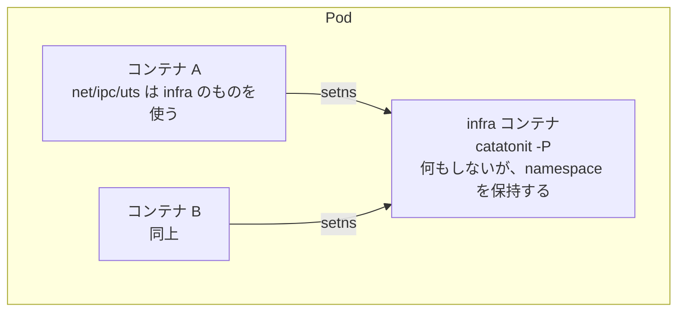

## 何を学んだか

### Pod は「namespace の持ち主」を 1 つ置くこと

Docker に Pod はない。Podman にあるのは、Kubernetes との対応を取るためだ。

実装は前提群で見たとおりで、**namespace の共有先を「Pod の infra コンテナ」に向ける**だけになる。



infra コンテナは **何もしない**。プロセスとして存在し続けることだけが仕事で、それによって namespace が生き続ける。A も B も再起動できるが、Pod のネットワークは維持される。

これは rootless の pause プロセスと同じ発想だ ([pause プロセス](../pause-process/))。**namespace を生かしておくには、参照するプロセスが 1 つ要る**。

### 既定で共有するのは 3 つ

`--share` の既定値は `ipc,net,uts` だ。

- **net** — Pod 内のコンテナが `localhost` で通信できる。これが Pod の主目的
- **ipc** — System V IPC と `/dev/shm` を共有
- **uts** — hostname を共有

**pid は既定で共有しない**。Kubernetes も既定では共有しない (`shareProcessNamespace: true` で有効になる)。共有すると、あるコンテナから他のコンテナのプロセスが見えてしまい、PID 1 の扱いも複雑になる。

mount namespace は共有しない。共有すると各コンテナのイメージが同じ rootfs を持つことになり、Pod の意味がなくなる。

### v6 の infra コンテナは pause イメージを使わない

Kubernetes では、Pod ごとに `registry.k8s.io/pause` という極小のイメージを引いてコンテナを立てる。Podman も長らく同じ方式で、`containers.conf` の `infra_image` に pause イメージを指定していた。

v6 の既定は **空文字列** だ。イメージを引かない。代わりに、

1. 一時ディレクトリを 1 つ作り、それを **rootfs にする** (中身は空)
2. ホストの `catatonit` バイナリを、そのコンテナの `/catatonit` に **bind mount** する
3. entrypoint を `/catatonit -P` にする

`catatonit` は「シグナルを受けて子を刈り取るだけ」の極小の init だ。`-P` は「PID 1 モード」で、何もせずシグナルを待つ。

これで **イメージの pull が不要になった**。ネットワークが無い環境でも Pod が作れるし、レジストリへの依存も消える。「pause イメージが引けなくて Pod が作れない」という Kubernetes ではおなじみの問題が、構造的に起きない。

## ソースコードのどこか

### infra イメージの既定は空文字列

[`vendor/go.podman.io/common/pkg/config/default.go#L88-L89`](https://github.com/podman-container-tools/podman/blob/v6.1.0/vendor/go.podman.io/common/pkg/config/default.go#L88)。

```go title="go.podman.io/common/pkg/config/default.go"
	// DefaultInfraImage is the default image to run as infrastructure containers in pods.
	DefaultInfraImage = ""
```

そして pull する側。[`pkg/specgen/generate/pause_image.go#L13`](https://github.com/podman-container-tools/podman/blob/v6.1.0/pkg/specgen/generate/pause_image.go#L13)。

```go title="pkg/specgen/generate/pause_image.go"
// PullInfraImage pulls down the specified image or the one set in
// containers.conf. If none is set, it returns an empty string. In this
// case, the rootfs-based pause image is used by libpod.
func PullInfraImage(rt *libpod.Runtime, imageName string) (string, error) {
	...
	if imageName != "" {
		_, err := rt.LibimageRuntime().Pull(context.Background(), imageName, config.PullPolicyMissing, nil)
		if err != nil {
			return "", err
		}
		return imageName, nil
	}

	return "", nil
}
```

「何も設定されていなければ空文字列を返す。**その場合 libpod が rootfs ベースの pause イメージを使う**」。設定されていれば従来どおり pull するので、後方互換も保たれている。

### rootfs ベースの infra は 14 行

[`libpod/container_internal_common.go#L185`](https://github.com/podman-container-tools/podman/blob/v6.1.0/libpod/container_internal_common.go#L185)。

```go title="libpod/container_internal_common.go"
func (c *Container) createInitRootfs() error {
	tmpDir, err := c.runtime.TmpDir()
	if err != nil {
		return fmt.Errorf("getting runtime temporary directory: %w", err)
	}
	tmpDir = filepath.Join(tmpDir, "infra-container")
	err = os.MkdirAll(tmpDir, 0o755)
	if err != nil {
		return fmt.Errorf("creating infra container temporary directory: %w", err)
	}

	c.config.Rootfs = tmpDir
	c.config.RootfsOverlay = true
	return nil
}
```

**空のディレクトリを作って `Rootfs` に指定するだけ**。`RootfsOverlay = true` にしているので、そのディレクトリ自体は書き換えられず、overlay の下位レイヤとして使われる。

コンテナの中には何もない。`/` に何も無い状態でプロセスが動く。動かすバイナリは bind mount で持ち込む。

```go title="libpod/container_internal_common.go"
// Internal only function which returns the mount-point for the /catatonit.
// This mount-point should be added to the Container spec.
func (c *Container) prepareCatatonitMount() (spec.Mount, error) {
	newMount := spec.Mount{
		Type:        define.TypeBind,
		Source:      "",
		Destination: "",
		Options:     append(bindOptions, "ro", "nosuid", "nodev"),
	}

	// Also look into the path as some distributions install catatonit in
	// /usr/bin.
	catatonitPath, err := c.runtime.config.FindInitBinary()
	if err != nil {
		return newMount, fmt.Errorf("finding catatonit binary: %w", err)
	}
	catatonitPath, err = filepath.EvalSymlinks(catatonitPath)
	if err != nil {
		return newMount, fmt.Errorf("follow symlink to catatonit binary: %w", err)
	}

	newMount.Source = catatonitPath
	newMount.Destination = "/" + filepath.Base(catatonitPath)

	if len(c.config.Entrypoint) == 0 {
		c.config.Entrypoint = []string{"/" + filepath.Base(catatonitPath), "-P"}
		c.config.Spec.Process.Args = c.config.Entrypoint
	}

	return newMount, nil
}
```

`ro,nosuid,nodev` で読み取り専用の bind mount。`EvalSymlinks` でシンボリックリンクを解決してから mount するのは、**コンテナの mount namespace の中ではリンク先が存在しない** からだ。ホスト側で実体のパスまで辿ってから渡す必要がある。

destination をファイル名から組み立てている (`/catatonit`) ので、ディストリビューションがバイナリ名を変えても追随する。

### Pod の作成は infra コンテナの作成

[`pkg/specgen/generate/pod_create.go#L78-L106`](https://github.com/podman-container-tools/podman/blob/v6.1.0/pkg/specgen/generate/pod_create.go#L78)。

```go title="pkg/specgen/generate/pod_create.go"
			p.PodSpecGen.InfraContainerSpec.Name = pod.ID()[:12] + "-infra"
		}
		_, err = CompleteSpec(context.Background(), rt, p.PodSpecGen.InfraContainerSpec)
		if err != nil {
			return nil, err
		}
		p.PodSpecGen.InfraContainerSpec.User = "" // infraSpec user will get incorrectly assigned via the container creation process, overwrite here
		// infra's resource limits are used as a parsing tool,
		// we do not want infra to get these resources in its cgroup
		// make sure of that here.
		p.PodSpecGen.InfraContainerSpec.ResourceLimits = nil
		p.PodSpecGen.InfraContainerSpec.WeightDevice = nil

		rtSpec, spec, opts, err := MakeContainer(context.Background(), rt, p.PodSpecGen.InfraContainerSpec, false, nil)
		...
		infraCtr, err := ExecuteCreate(context.Background(), rt, rtSpec, spec, true, opts...)
		...
		pod, err = rt.AddInfra(context.Background(), pod, infraCtr)
```

**`CompleteSpec` → `MakeContainer` → `ExecuteCreate` の 3 段が、ここでも使われている**。infra コンテナも普通のコンテナと同じ経路で作られる。違いは `ExecuteCreate` の 5 番目の引数が `true` (infra である) という点だけだ。

リソース制限の扱いのコメントが面白い。「**infra のリソース制限はパース用のツールとして使われているだけで、infra 自身の cgroup にこの制限を掛けたくない**」。

`podman pod create --memory=1g` の `--memory` は Pod 全体への制限だが、CLI のパーサは `SpecGenerator` にしか値を入れられない。そこで infra の SpecGenerator に一度入れ、Pod の cgroup 設定に使ったあとで **infra 自身からは消す**。パーサの再利用のために値を借りて、使い終わったら返している。

名前も `<pod-id の先頭 12 文字>-infra` と機械的に決まる。`podman ps -a` で見えるあの `-infra` コンテナはこれだ。

### infra 無しの Pod もある

```go title="pkg/specgen/generate/pod_create.go"
	} else {
		// SavePod is used to save the pod state and trigger a create event even if infra is not created
		err := rt.SavePod(pod)
		if err != nil {
			return nil, err
		}
	}
```

`--infra=false` にすると、**namespace を共有しない、ただのコンテナのグループ** になる。`podman pod stop` でまとめて止められる、という管理上の単位としてだけ機能する。

Pod の本質が「namespace の共有」と「管理単位」の 2 つに分かれていて、前者は infra コンテナに依存し、後者は依存しない。

### 共有する namespace の既定

[`pkg/specgen/namespaces.go#L67-L69`](https://github.com/podman-container-tools/podman/blob/v6.1.0/pkg/specgen/namespaces.go#L67)。

```go title="pkg/specgen/namespaces.go"
	// DefaultKernelNamespaces is a comma-separated list of default kernel
	// namespaces.
	DefaultKernelNamespaces = "ipc,net,uts"
```

文字列で定義されていて、CLI のフラグの既定値としてそのまま使われる。`--share=ipc,net,uts,pid` のように指定を増やせる。

`PodSpecGenerator` のコメントも読んでおきたい。

```go title="pkg/specgen/podspecgen.go"
	// SharedNamespaces instructs the pod to share a set of namespaces.
	// Shared namespaces will be joined (by default) by every container
	// which joins the pod.
	// If not set and NoInfra is false, the pod will set a default set of
	// namespaces to share.
	// Conflicts with NoInfra=true.
	SharedNamespaces []string `json:"shared_namespaces,omitempty"`
```

「**既定で** Pod に参加するすべてのコンテナが join する」。既定なので、個々のコンテナが `--network=host` のように上書きすることもできる。Kubernetes の Pod より緩い。

そして user namespace だけは例外で、[前ページ](../network-modes/) で見たとおり Pod 内で揃えることが強制される。

## なぜそうなっているか

### pause イメージをやめたのは、依存を減らすため

pause イメージは数百 KB しかないが、**レジストリへの依存** を作る。エアギャップ環境、レジストリ障害、認証切れ、レート制限 — Kubernetes で `pause` が引けずに Pod が起動しない事故は珍しくない。

Podman は「そもそもイメージが要らない」形にした。必要なのは「シグナルを待つプロセス 1 つ」だけで、それはホストに既にある `catatonit` で足りる。**問題を解くのではなく、問題が起きない形に変えた**。

これができたのは、Podman が単一ホストで動くツールだからだ。Kubernetes は「ノードに何がインストールされているか」を仮定できないので、イメージとして配る方が確実になる。**前提の違いが設計の違いを生んでいる**。

### infra コンテナも普通のコンテナにした

infra 専用の軽量な起動経路を作ることもできた。そうしなかったのは、**普通のコンテナと同じ機能 (ネットワーク、cgroup、user namespace、ヘルスチェック) が infra にも要る** からだ。

Pod のネットワーク設定は infra コンテナのネットワーク設定であり、Pod の cgroup は infra を含む cgroup になる。別経路にすると、これらすべてを二重に実装することになる。

代償が、リソース制限の借用のような小さな歪みだ。`CompleteSpec` の後で `ResourceLimits = nil` にする、という後付けの調整が必要になっている。

### 「共有」を既定にして上書きを許した

Kubernetes の Pod では、コンテナがネットワークを共有しないことはできない。Podman では `--network=host` を個別に指定できる。

これは Podman が「Kubernetes の忠実な再現」ではなく「開発者が使う道具」を目指しているからだ。**厳密さより柔軟さを取る** 判断で、その代わり `kube play` で Kubernetes YAML を動かすときは Kubernetes の意味論に合わせる、という役割分担になっている。

## どう活かすか

- **依存は減らせないか、まず考える。** pause イメージを「引けなかったときどうするか」で考えると再試行やキャッシュの設計になる。「そもそも引かない方法はないか」で考えると、依存が消える。
- **特殊なオブジェクトも通常の経路で作る。** infra コンテナを専用経路にしなかったことで、機能の二重実装が避けられている。歪みが出たら後付けで調整する方が、経路を分けるより安い。
- **namespace を生かすには参照するプロセスが要る。** Pod の infra も rootless の pause プロセスも同じ原理。「リソースの寿命をプロセスの寿命に紐付ける」パターンとして覚えておく。
- **既定の共有設定は文字列の定数 1 つで表す。** `"ipc,net,uts"` がフラグの既定値であり、コードの既定値でもある。2 か所に書かないので、ずれない。
