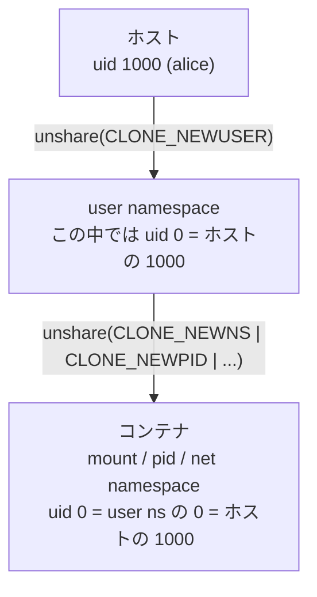

## 何を学んだか

### 「root ではないが、コンテナの中では root」を作る

コンテナは namespace・cgroup・rootfs の合成だった。このうち **user namespace** だけが、非特権ユーザでも作れる。そして user namespace の中では、作った本人が uid 0 (root) として振る舞える。

user namespace の中で root になれば、その中で **他の namespace も作れる**。mount namespace、pid namespace、net namespace。つまり「まず user namespace に入る、その中でコンテナを作る」という二段構えで、非特権のコンテナが成立する。



### 必要なものは 3 つ

1. **`/etc/subuid` と `/etc/subgid` の割り当て**

   ```
   alice:100000:65536
   ```

   「alice は uid 100000 から 65536 個を、コンテナ内の uid にマップしてよい」という宣言。これがないと、コンテナの中で使える uid は **自分の 1 つだけ** になる。

2. **`newuidmap` / `newgidmap`**

   非特権プロセスが `/proc/<pid>/uid_map` に書けるのは、自分の uid 1 行だけだ。範囲をマップするには setuid root のヘルパーに書かせるしかない。この 2 つのバイナリが `shadow-utils` に含まれ、`/etc/subuid` を読んで検証してから書く ([二段のマッピング](../userns-idmap/))。

3. **特権が要るすべての操作の代替**

   これが本体だ。root でできることが軒並みできないので、1 つずつ別の道を用意する必要がある。

| root でやること           | 非特権での代替                                                                                 |
| ------------------------- | ---------------------------------------------------------------------------------------------- |
| `overlayfs` をマウント    | ネイティブ overlay (5.11+) か fuse-overlayfs ([rootless で overlayfs](../rootless-overlayfs/)) |
| veth を作りブリッジに繋ぐ | pasta でユーザ空間にネットワークスタックを置く ([pasta](../rootless-network-pasta/))           |
| netavark を動かす         | 自分が所有する netns を作り、その中で動かす ([偽のホスト](../rootless-network-bridge/))        |
| cgroup を作る             | systemd に D-Bus で委譲済み scope をもらう ([cgroup の委譲](../rootless-cgroup-scope/))        |
| 1024 未満のポートを bind  | できない (sysctl を変えるか、上位ポートを使う)                                                 |
| `mknod` でデバイスを作る  | できない                                                                                       |
| CRIU でチェックポイント   | できない                                                                                       |

### できないことは、ドキュメントに列挙されている

Podman のリポジトリには [`rootless.md`](https://github.com/podman-container-tools/podman/blob/v6.1.0/rootless.md) という「rootless Podman の既知の欠点」を並べたファイルがある。冒頭にこう書いてある。

> The following list categorizes the known issues and irregularities with running Podman as a non-root user. Many of these are kernel-level restrictions in place for security reasons, and are not reasonably solvable by Podman.

「多くはセキュリティ上の理由によるカーネルレベルの制限であり、**Podman 側で合理的に解決できるものではない**」。

主要なものを挙げると、

- **1024 未満のポートに bind できない** — `net.ipv4.ip_unprivileged_port_start` を下げれば緩和できる
- **`/etc/subuid` が設定されていないと大半のコマンドが失敗する** — FreeIPA のような一部の ID プロバイダは統合しているが、多くはしていない
- **使える uid が 65536 個** — それより大きい uid を使うイメージは動かない。ビルドも失敗する
- **NFS や GPFS のホームディレクトリでは動かない** — サーバ側が user namespace を理解しないため
- **cgroup v1 では資源制限が効かない**
- **`podman mount` で作ったディレクトリは rootless user namespace の中でしか見えない** — 外から見るには `podman unshare` が要る
- **`mknod` ができない** — `--privileged` でも同じ

### Docker rootless mode との違い

Docker にも rootless mode がある。アプローチが違う。

|                              | Podman                               | Docker rootless mode                   |
| ---------------------------- | ------------------------------------ | -------------------------------------- |
| 何が user namespace に入るか | `podman` コマンド自身 (実行のたびに) | **dockerd 全体** (常駐したまま)        |
| 誰が namespace を作るか      | Podman 自身 (C の constructor で)    | RootlessKit という別ツール             |
| ネットワーク                 | pasta (既定) / slirp4netns           | slirp4netns / VPNKit / **pasta**       |
| セットアップ                 | 通常は不要 (subuid があれば動く)     | `dockerd-rootless-setuptool.sh` を実行 |
| 既定か                       | **既定**                             | オプトイン                             |
| ユーザごとの分離             | ストアも socket もユーザごと         | ユーザごとに dockerd を立てる          |

Docker rootless mode は「デーモンごと user namespace の中に置く」ので、デーモンが起動するときに 1 回 namespace を作れば済む。**Podman は毎回作る (正確には、既にあれば join する)** ため、namespace を生かし続ける仕組み ([pause プロセス](../pause-process/)) が別途必要になった。

一方 Podman は、rootless を既定にしたことで **rootless で動かないコードパスが存在しにくい** という利点がある。Docker rootless mode はオプトインなので、機能によっては未対応が残る。

## ソースコードのどこか

### rootless かどうかの判定に、ネストの考慮が入る

[`pkg/rootless/rootless.go#L72-L78`](https://github.com/podman-container-tools/podman/blob/v6.1.0/pkg/rootless/rootless.go#L72)。

```go title="pkg/rootless/rootless.go"
func IsRootless() bool {
	// unshare.IsRootless() is used to check if a user namespace is required.
	// Here we need to make sure that nested podman instances act
	// as if they have root privileges and pick paths on the host
	// that would normally be used for root.
	return unshare.IsRootless() && unshare.GetRootlessUID() > 0
}
```

2 つの条件の `&&` になっている。`unshare.IsRootless()` は「user namespace が必要か」を見るが、それだけでは足りない。

**コンテナの中で Podman を動かす (nested podman)** 場合、既に user namespace の中にいて、その中では uid 0 だ。このとき「rootless である」と判定してしまうと、`~/.local/share/containers` のような rootless 用のパスを使ってしまう。だが nested な環境では **root として振る舞うべき** で、`/var/lib/containers` を使ってほしい。

そこで「親の user namespace での uid が 0 より大きい」ことを追加条件にしている。コメントが目的を明示している。「ネストした podman インスタンスが root 権限を持つかのように振る舞い、通常 root が使うホスト上のパスを選ぶようにする必要がある」。

**`IsRootless()` という自明に見える関数に、この判断が埋まっている**。CI やビルドコンテナの中で Podman を動かす用途が現実にあるので、必要になった条件だ。

### ID マッピングは setuid ヘルパーに委譲する

[`pkg/rootless/rootless_linux.go#L90-L97`](https://github.com/podman-container-tools/podman/blob/v6.1.0/pkg/rootless/rootless_linux.go#L90)。

```go title="pkg/rootless/rootless_linux.go"
func tryMappingTool(uid bool, pid int, hostID int, mappings []idtools.IDMap) error {
	tool := "newuidmap"
	mode := os.ModeSetuid
	cap := capability.CAP_SETUID
	idtype := "setuid"
	if !uid {
		tool = "newgidmap"
		mode = os.ModeSetgid
```

「試す」という名前が付いている。**失敗しうる前提** で書かれていて、失敗したら「自分の uid 1 行だけ」のマッピングに縮退する。`/etc/subuid` が設定されていない環境でも、機能は落ちるが動く。

setuid バイナリと capability の両方をチェックしているのは、ディストリビューションによって `newuidmap` に setuid ビットではなく file capability (`CAP_SETUID`) を付けている場合があるからだ。

### C のコードが 35KB ある

`pkg/rootless/rootless_linux.c` は 35KB ある。Go のコードが 14KB なので、**rootless 関連は C の方が多い**。

理由は「Go ランタイムが起動する前に namespace 操作を終える必要がある」ことにある。`setns(2)` で user namespace に入るのはシングルスレッドのプロセスでしか許されず、Go の `main` に着く頃には既に複数スレッドが立っている。だから cgo の constructor 属性を使って、Go より先に実行する ([Go が動く前に namespace に入る](../constructor-reexec/))。

**言語の制約が、実装言語の選択を決めている** 例といえる。

## なぜそうなっているか

### rootless を既定にしたのは、脅威モデルを変えるため

コンテナはカーネルを共有する。カーネルの脆弱性を突かれれば、コンテナからホストへ抜けられる。これは構造上避けられない。

rootless が変えるのは、**抜けた後に何ができるか** だ。root で動くコンテナから抜ければ root が取れる。非特権ユーザの user namespace から抜けても、取れるのはそのユーザの権限だけだ。**被害の上限が下がる**。

もちろん user namespace 自体にも脆弱性はあり、実際に何度か見つかっている。それでも「多層防御の 1 層」として機能する。Docker がこれをオプトインに留めたのは互換性のため、Podman が既定にできたのは後発だったためだ。

### 「解決できないもの」を列挙する誠実さ

`rootless.md` の存在は珍しい。普通、プロダクトのリポジトリには「できること」が書かれる。Podman は **「できないこと」を独立したファイルにして、理由付きで並べている**。

これには実用的な効果がある。「Docker では動いたのに」という報告に対して、そのファイルを指せば済む。カーネルの制限なのか Podman のバグなのかが最初から切り分けられている。

そして 1024 番未満のポートのように、**回避策がある項目には回避策が書いてある**。`ip_unprivileged_port_start` を変える、プロキシを置く、redir を使う。制限を書くだけでなく、次の一手まで示している。

### 制約が実装の複雑さに直結する

このページで並べた「代替」の一覧が、そのまま rootless 群の残り 6 ページになる。overlayfs、pasta、rootless-netns、cgroup の委譲、pause プロセス、ID マッピング。**root なら 1 行で済むことに、それぞれ 1 ページ分の仕組みが要る**。

これがデーモンレスに次ぐ、Podman の 2 つ目の大きな制約だ。そして 2 つは相互作用する。「常駐しない」と「特権がない」が組み合わさると、たとえば「user namespace を生かし続けるプロセスが要るが、それは Podman であってはならない」という pause プロセスの要求が出てくる。

## どう活かすか

- **権限を落とすときは、落とした後にできないことを列挙する。** `rootless.md` のように独立したドキュメントにすると、サポートのコストが下がる。「制限 + 回避策」の形で書くのが要点。
- **自明に見える判定関数ほど、条件が積もる。** `IsRootless()` の 2 条件目 (nested podman) のように、実運用で必要になった条件はコメントで理由を残す。消してよいか判断できなくなる。
- **失敗しうる前提の関数には `try` を付ける。** `tryMappingTool` は失敗したら縮退する。名前で挙動が分かるので、呼び出し側がエラー処理を書き間違えにくい。
- **既定にすると、対応漏れが起きにくい。** オプトインの機能は「その設定では動かないコードパス」が残り続ける。既定にすれば全員が踏むので、漏れがすぐ見つかる。ただし互換性のコストは払うことになる。
