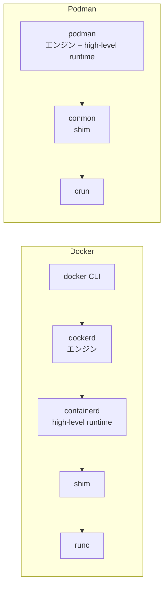

## 何を学んだか

### 言葉が 3 つの層に同時に使われている

「コンテナランタイム」という語は、文脈によって違う層を指す。

| 層                     | 何をするか                                              | 代表実装                             | 呼ばれ方                            |
| ---------------------- | ------------------------------------------------------- | ------------------------------------ | ----------------------------------- |
| **エンジン**           | 人間や CI が叩く。build / pull / run / network / volume | Docker Engine, Podman, nerdctl       | container engine, CLI               |
| **high-level runtime** | イメージ管理・rootfs 構築・コンテナのライフサイクル     | containerd, CRI-O                    | container runtime (Kubernetes 文脈) |
| **shim**               | コンテナプロセスの親であり続け、stdio と終了を見張る    | containerd-shim-runc-v2, **conmon**  | shim, monitor                       |
| **low-level runtime**  | 実際に namespace と cgroup を作ってプロセスを起動する   | runc, **crun**, runsc (gVisor), kata | OCI runtime, container runtime      |

Kubernetes の文書で「コンテナランタイム」といえば containerd や CRI-O のこと、OCI の文書で「ランタイム」といえば runc や crun のこと、一般の記事で「Docker というランタイム」といえばエンジンのこと。同じ語なので、どの層の話かを見失いやすい。

境界にある仕様は 2 つだ。エンジンと high-level runtime の間には **CRI** (Kubernetes の場合) か各ツール独自の API、high-level runtime と low-level runtime の間には **OCI Runtime Spec** がある。下の境界は仕様が薄く安定しているので実装の入れ替えが効き、上の境界は各エンジンが好きに決めている。

### Podman は上 2 層を 1 つのバイナリに畳んでいる

Docker と Podman の一番大きな構造上の違いは、**high-level runtime を独立した常駐プロセスとして持つかどうか** だ。



Podman では、イメージの管理も rootfs の構築もライフサイクル管理も、`podman` プロセス自身が `libpod` パッケージを **同一プロセス内の関数呼び出し** としてやる。プロセス境界が減った分、gRPC もソケットも要らない。代わりに「常駐していないプロセスが状態をどう保つか」という問題が丸ごと発生する — それが Podman の設計の中心テーマになる。

下 2 層は Docker と変わらない。conmon が shim の位置に立ち、その下で crun が OCI Runtime Spec に従ってコンテナを作る。**Podman が独自なのは上半分だけ** で、下半分は Docker とほぼ同じ形だ。

### shim がなぜ要るのか

エンジンが直接 `runc` を fork すればよさそうに見えるが、そうすると 2 つ困る。

1. **コンテナの親がエンジンになる。** エンジンを再起動 (あるいは終了) するとコンテナが孤児になり、終了コードを誰も回収できない。
2. **stdio の持ち主がエンジンになる。** `docker attach` や `podman logs -f` のために、エンジンが全コンテナの出力を読み続けなければならない。

そこで、コンテナ 1 つにつき小さなプロセスを 1 つ置く。それが shim (Podman では conmon) だ。shim は OCI ランタイムを起動してコンテナの親になり、pty を持ち、終了コードを拾ってファイルに書く。**エンジンはいつ死んでもいい** し、Podman の場合は起動が終わったら実際に死ぬ。

同じ問題意識の containerd 側の解説は [containerd 章「なぜ shim という余分なプロセスが挟まっているのか」](../../containerd/why-shim/) にある。Podman における具体は [コンテナの監視を小さな別プロセスに委ねる](../conmon-supervision/) で扱う。

### low-level runtime は「一瞬だけ走るコマンド」

`crun` も `runc` も常駐しない。`crun create <id>` でコンテナを作り、`crun start <id>` で走らせ、`crun delete <id>` で片付ける。作り終わったら終了する。だから `ps` でコンテナのプロセスツリーを見ても、runc も crun もどこにもいない。

この「コマンドとして呼ぶ」という規約は OCI Runtime Spec が定めていて、だから Podman の中で crun / runc / runsc / kata の切り替えが、**実行するバイナリのパスを変えるだけ** で済む。

## ソースコードのどこか

### Podman から見た low-level runtime は 1 つのインターフェース

[`libpod/oci.go#L21`](https://github.com/podman-container-tools/podman/blob/v6.1.0/libpod/oci.go#L21) の `OCIRuntime` が、Podman と下の層の境界だ。

```go title="libpod/oci.go"
// OCIRuntime is an implementation of an OCI runtime.
// The OCI runtime implementation is expected to be a fairly thin wrapper around
// the actual runtime, and is not expected to include things like state
// management logic - e.g., we do not expect it to determine on its own that
// calling 'UnpauseContainer()' on a container that is not paused is an error.
// The code calling the OCIRuntime will manage this.
type OCIRuntime interface { //nolint:interfacebloat
	// Name returns the name of the runtime.
	Name() string
	// Path returns the path to the runtime executable.
	Path() string

	// CreateContainer creates the container in the OCI runtime.
	CreateContainer(ctr *Container, restoreOptions *ContainerCheckpointOptions) (int64, error)
	// StartContainer starts the given container.
	StartContainer(ctr *Container) error
```

コメントが役割分担を明言している。「**薄いラッパーであることが期待されていて、状態管理のロジックは含まない**。停止していないコンテナに `UnpauseContainer()` を呼ぶのがエラーだと判断するのは、OCIRuntime を呼ぶ側の仕事だ」。

つまり **判断は libpod、実行は OCIRuntime** という切り分けになっている。この境界の引き方のおかげで、実装は本当にコマンドを組み立てて exec するだけになる。

### 実装は「conmon を exec する」1 つだけ

そのインターフェースの実装は [`libpod/oci_conmon_common.go#L54`](https://github.com/podman-container-tools/podman/blob/v6.1.0/libpod/oci_conmon_common.go#L54) の `ConmonOCIRuntime` だ。

```go title="libpod/oci_conmon_common.go"
type ConmonOCIRuntime struct {
	name              string
	path              string
	conmonPath        string
	conmonEnv         []string
	tmpDir            string
	exitsDir          string
	...
	supportsJSON      bool
	supportsKVM       bool
	supportsNoCgroups bool
	enableKeyring     bool
	persistDir        string
}

// Make a new Conmon-based OCI runtime with the given options.
// Conmon will wrap the given OCI runtime, which can be `runc`, `crun`, or
// any runtime with a runc-compatible CLI.
```

「conmon が、`runc` でも `crun` でも **runc 互換 CLI を持つ任意のランタイム** をラップする」。構造体のフィールドが `name` と `path` と機能フラグだけなのは、この層が本当に「どのバイナリをどう呼ぶか」しか持たないことの現れだ。

`supportsJSON` `supportsKVM` `supportsNoCgroups` という 3 つのフラグが、ランタイムごとの差を吸収する唯一の仕掛けになっている。差分がこれだけで済むのは、OCI Runtime Spec が CLI の規約まで定めているおかげだ。

### 起動以外は、ランタイムを直接叩く

コンテナの起動経路だけは conmon 経由だが、それ以外は Podman が直接 OCI ランタイムをコマンドとして呼ぶ。[`libpod/oci_conmon_common.go#L204`](https://github.com/podman-container-tools/podman/blob/v6.1.0/libpod/oci_conmon_common.go#L204) の `StartContainer` がその典型だ。

```go title="libpod/oci_conmon_common.go"
	if err := utils.ExecCmdWithStdStreams(os.Stdin, os.Stdout, os.Stderr, env, r.path, append(r.runtimeFlags, "start", ctr.ID())...); err != nil {
```

`r.path` は `/usr/bin/crun` のようなパス、引数は `start <container-id>`。仕様が定めるサブコマンドをそのまま実行している。`kill` も `delete` も同じ形だ。

```go title="libpod/oci_conmon_common.go"
	return utils.ExecCmdWithStdStreams(os.Stdin, os.Stdout, os.Stderr, env, r.path, append(r.runtimeFlags, "delete", "--force", ctr.ID())...)
```

## なぜそうなっているか

### 下の境界だけが標準化された

なぜ high-level runtime とエンジンの境界には標準がないのか。理由は、**そこがまさに製品の差別化点だから** だ。イメージのキャッシュ戦略、ビルドの体験、ネットワークの抽象、Compose との統合 — ここが各エンジンの個性になる。一方で「namespace を作ってプロセスを起動する」ところは差別化の余地がほとんどなく、むしろ互換性の価値が高い。だから下だけが仕様化された。

その結果、下の層は驚くほど入れ替えが効く。`crun` は C で書かれていて runc より軽く、gVisor の `runsc` はシステムコールをユーザ空間で解釈し、Kata Containers は実際には VM を起動する。それでも上の層のコードは変わらない。

### Podman が層を畳めたのは、CRI を捨てたから

containerd が独立した常駐プロセスなのは、kubelet が CRI 越しに話す相手として設計されているからだ。Kubernetes は「ノード上で常に生きていて、Pod の状態を問い合わせられる相手」を必要とする。

Podman は最初からその役割を狙っていない (Kubernetes 連携は `kube play` という別の形で提供する)。話し相手が人間か systemd だけなら、常駐する必要はない。**要求されるインターフェースの形が、プロセス構造を決めている**。

## どう活かすか

- **層の名前を確認してから議論する。** 「ランタイムを crun に変える」と「ランタイムを containerd に変える」はまったく別の話だ。Kubernetes の設定なのか OCI の設定なのかで、触るファイルも変わる。
- **「判断する層」と「実行する層」を分けると、実行側が薄くなる。** `OCIRuntime` のコメントにある「状態管理は呼ぶ側の責務」という宣言は、インターフェースを設計するときにそのまま真似できる。実装が増えたときに重複するのは判断ロジックであって、実行そのものではない。
- **常駐プロセスが要るかは「誰が話しかけてくるか」で決まる。** 人間と systemd だけが相手なら、コマンドとして起動して終了する形にできる。常時ポーリングしてくる相手 (kubelet のような) がいる場合にだけ、デーモンが正当化される。
