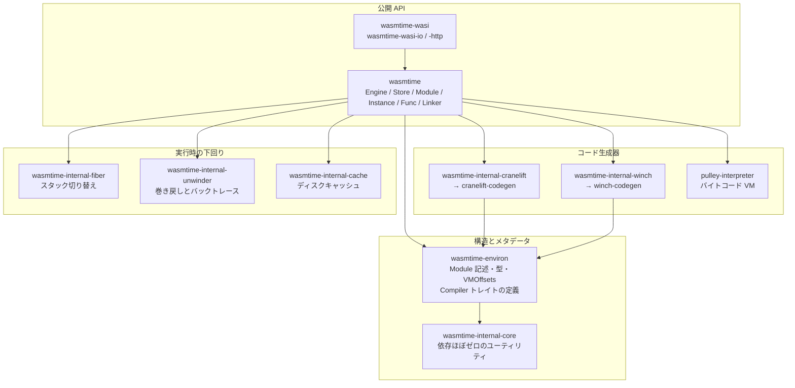

Wasmtime のリポジトリには 40 以上の crate がある。だが埋め込む側が `Cargo.toml` に書くのは `wasmtime` 1 個だけで、残りはすべてその内部実装だ。**`wasmtime` が依存する crate は公開 API に一切現れない**という方針が明文化されていて、しかもそれが crate 名そのものに焼き付けられている。このページでは、その境界がどこに引かれているか、そしてコンパイラとランタイムがどう分離されているかを見る。

## 公開されているのは `wasmtime` だけ

アーキテクチャ文書の冒頭が、この crate の位置づけをはっきり書いている。

```text title="docs/contributing-architecture.md"
Wasmtime is designed such that the `wasmtime` crate is nearly a 100% safe API
(safe in the Rust sense) modulo some small and well-documented functions as to
why they're `unsafe`.

At this time the `wasmtime` crate is the first crate that is intended to be
consumed by users. ... To use some Cargo terminology, all the `wasmtime-*`
crates that `wasmtime` depends on are "private" dependencies.
```

[docs/contributing-architecture.md](https://github.com/bytecodealliance/wasmtime/blob/d8a0da6d661605713798c1c9c76be5c28e3159ff/docs/contributing-architecture.md#L10-L25)

「private dependency」という宣言は、ワークスペースの `Cargo.toml` で機械的に実装されている。内部 crate は **crates.io 上では `wasmtime-internal-*` という名前で公開され**、ワークスペース内では `package = '...'` によるリネームで従来の短い名前として参照されている。

```toml title="Cargo.toml"
# Internal Wasmtime-specific crates.
#
# Note that all crates here are actually named `wasmtime-internal-*` as their
# package name which is what will show up on crates.io. This is done to signal
# that these are internal unsupported crates for external use. These exist as
# part of the project organization of other public crates in Wasmtime and are
# otherwise not supported in terms of CVEs for example.
wasmtime-core = { path = "crates/core", version = "=49.0.0-dev", package = 'wasmtime-internal-core' }
wasmtime-cache = { path = "crates/cache", version = "=49.0.0-dev", package = 'wasmtime-internal-cache' }
wasmtime-cranelift = { path = "crates/cranelift", version = "=49.0.0-dev", package = 'wasmtime-internal-cranelift' }
wasmtime-winch = { path = "crates/winch", version = "=49.0.0-dev", package = 'wasmtime-internal-winch'  }
wasmtime-fiber = { path = "crates/fiber", version = "=49.0.0-dev", package = 'wasmtime-internal-fiber' }
wasmtime-unwinder = { path = "crates/unwinder", version = "=49.0.0-dev", package = 'wasmtime-internal-unwinder' }
```

[Cargo.toml](https://github.com/bytecodealliance/wasmtime/blob/d8a0da6d661605713798c1c9c76be5c28e3159ff/Cargo.toml#L296-L319)

「CVE の対象外」とまで書いてあるのが重要だ。ここで宣言されているのは単なる API 安定性の話ではなく、**セキュリティサポートの境界がどこにあるか**でもある。`wasmtime` の内側に閉じたバグは、`wasmtime` の脆弱性として扱われる。`wasmtime-internal-cranelift` を直接使っている第三者のコードで起きたことは、そうではない。

一方で `wasmtime-environ` はこのリネームを受けていない。ワークスペースの分類でも「public crates related to Wasmtime」の側に置かれ、「ecosystem tooling には有用だが広く依存されることは意図していない」と注記されている。コンパイル結果のメタデータを読むツールを書くための、半公開の窓口になっている。

そして文書は、内部の安全性境界についてかなり率直だ。

```text title="docs/contributing-architecture.md"
Additionally at this time the safe/unsafe boundary between Wasmtime's internal
crates is not the most well-defined. There are methods that should be marked
`unsafe` which aren't, and `unsafe` methods do not have exhaustive documentation
as to why they are `unsafe`.
```

[docs/contributing-architecture.md](https://github.com/bytecodealliance/wasmtime/blob/d8a0da6d661605713798c1c9c76be5c28e3159ff/docs/contributing-architecture.md#L27-L33)

**「外側は 100% safe を目指す、内側はまだそこまで整っていない」**という二段構えが、意識的に選ばれている。`unsafe` を 1 か所も残さないことではなく、`unsafe` を境界の内側に閉じ込めることが目標になっている。

## crate の地図



それぞれが引き受けている仕事はこうなっている。

**`wasmtime`** は埋め込み API そのものと、`crates/wasmtime/src/runtime/vm/` にある低レベルランタイムの両方を持つ。文書に「このモジュールは以前は独立した crate だったが `wasmtime` に畳み込まれた」とある通り、`VMContext` や `InstanceHandle` はここにいる ([VMContext — JIT コードが固定オフセットで触る構造体](../vmcontext/))。API とランタイムが同じ crate にいるのは、`Store` の内部表現が両者にまたがるからだ。

**`wasmtime-environ`** は「コンパイルはしないが、コンパイルに必要なものを全部定義する」層だ。wasm バイナリを読んで `Module` の構造を組み立て、型を集め、`VMContext` のフィールドオフセット (`vmoffsets.rs`) を計算する。ここが決めたレイアウトを、コード生成器とランタイムの両方が参照する。

**`wasmtime-internal-cranelift` / `wasmtime-internal-winch`** は、それぞれ Cranelift と Winch を `wasmtime-environ` の定義するインターフェースに適合させる接着層だ。コンパイラ本体は `cranelift/` と `winch/` という別のディレクトリにいて、Wasmtime のことを知らない。

**`pulley-interpreter`** は Cranelift のバックエンドが存在しないターゲット向けのバイトコード VM だが、Wasmtime から見ると「もう 1 個の ISA」として扱われる ([Pulley は「インタプリタ」ではなくターゲット ISA である](../pulley-as-isa/))。

**`wasmtime-internal-fiber`** は async サポートのためのスタック切り替え、**`wasmtime-internal-unwinder`** はトラップ時の巻き戻しとバックトレース、**`wasmtime-internal-cache`** はコンパイル結果のディスクキャッシュを持つ。いずれもオプショナル依存で、`Cargo.toml` の feature で丸ごと落とせる。

**`wasmtime-internal-core`** は Cargo.toml に「この crate の依存は _極めて_ 小さく保つこと。安易に増やすな」というコメントが付いた `#![no_std]` の土台で、`alloc` / `array` / `error` / `math` / `mpk` / `slab` / `truncate` といったモジュールしか持たない。

**`wasmtime-wasi`** 系はこの図の一番外にいる。`wasmtime` に依存する側であって、依存される側ではない。WASI は「`Linker` にホスト関数を登録するだけの利用者」という位置づけで実装されている ([wasi:cli の world と、WasiCtx の切り方](../wasi-worlds/))。

## コンパイラとの境界は 1 本のトレイト

Wasmtime とコード生成器の境界は `wasmtime_environ::Compiler` トレイトに引かれている。`impl wasmtime_environ::Compiler for Compiler` は Cranelift 側と Winch 側の 2 か所にあり、Wasmtime 本体は `&dyn Compiler` としてしか触らない。

```rust title="crates/environ/src/compile/mod.rs"
/// The result of compiling a single function body.
pub struct CompiledFunctionBody {
    /// The code. This is whatever type the `Compiler` implementation wants it
    /// to be, we just shepherd it around.
    pub code: Box<dyn Any + Send + Sync>,
    /// Whether the compiled function needs a GC heap to run; ...
    pub needs_gc_heap: bool,
}

pub trait Compiler: Send + Sync {
    fn inlining_compiler(&self) -> Option<&dyn InliningCompiler>;
    fn compile_function(/* ... */) -> Result<CompiledFunctionBody, CompileError>;
    fn compile_trampoline(/* ... */) -> Result<CompiledFunctionBody, CompileError>;
    fn append_code(/* ... */) -> Result<Vec<(Option<SymbolId>, FunctionLoc)>>;
    fn triple(&self) -> &target_lexicon::Triple;
    fn flags(&self) -> Vec<(&'static str, FlagValue<'static>)>;
    // ...
}
```

[crates/environ/src/compile/mod.rs](https://github.com/bytecodealliance/wasmtime/blob/d8a0da6d661605713798c1c9c76be5c28e3159ff/crates/environ/src/compile/mod.rs#L171-L249)

注目すべきは `code: Box<dyn Any + Send + Sync>` だ。**コンパイル結果の中身の型が、境界の上で消されている。** コメントが理由を書いている ——「これは `Compiler` 実装が望むどんな型でもよく、我々はただそれを持ち回すだけだ」。

これがなぜ重要かというと、Cranelift はインライン化のために「機械語より前の中間表現」を返したいのに対し、Winch は単一パスなので最初から機械語を返すからだ。`inlining_compiler()` が `Some` を返すコンパイラの場合、`compile_function` の戻り値はまだ機械語ではなく、`InliningCompiler::finish_compiling` を通してから `append_code` に渡すというプロトコルになる。`Box<dyn Any>` は、この 2 通りのライフサイクルを 1 本のトレイトに同居させるための道具だ ([モジュールを跨いでインライン化し、呼び出しグラフを層に切る](../inlining-strata/))。

`triple()` と `flags()` / `isa_flags()` がトレイトにあるのも、境界の設計として効いている。Wasmtime 側は「どのターゲットに、どのフラグでコンパイルされたか」を文字列のリストとして受け取り、それをコンパイル成果物に埋めて、後で読み込むときに照合する ([Tunables を全フィールド分割代入して、互換性の判断漏れを防ぐ](../tunables-compat/))。コンパイラ固有の設定値の意味を知らなくても、互換性の判定はできる。

## Cranelift 依存を剥がす作業は進行中

アーキテクチャ文書の末尾に、こう書かれている。

```text title="docs/contributing-architecture.md"
Note that at this time Cranelift is a required dependency of wasmtime. Most of
the types exported from `wasmtime-environ` use cranelift types in their API. One
day it's a goal, though, to remove the required cranelift dependency and have
`wasmtime-environ` be a relatively standalone crate.
```

[docs/contributing-architecture.md](https://github.com/bytecodealliance/wasmtime/blob/d8a0da6d661605713798c1c9c76be5c28e3159ff/docs/contributing-architecture.md#L500-L503)

ただしこの記述は現在の実態より古い。このコミットの `crates/environ/Cargo.toml` が依存しているのは `cranelift-entity` / `cranelift-bitset` / `cranelift-bforest` の 3 つだけで、コンパイラ本体である `cranelift-codegen` は入っていない。残っているのはインデックス型 (`EntityRef` とその配列)、ビットセット、B-tree といった **Cranelift のデータ構造ライブラリだけ**で、コード生成器は切り離されている。`wasmtime` 側でも `wasmtime-cranelift` は `optional = true` になっていて、Pulley だけでビルドする構成が実際に成り立つ。

同じ文書の末尾にある crate 一覧には `wasmtime-debug` / `wasmtime-profiling` / `wasmtime-obj` が挙がっているが、これらのディレクトリはもう存在しない。それぞれの機能は `wasmtime` 本体の `runtime/debug.rs`、`profiling_agent/`、`wasmtime-environ` の `obj.rs` に吸収されている。**アーキテクチャ文書は方針を読むには良いが、crate の一覧としては `ls crates/` のほうが正確**だ。

## この章の残りとの対応

この地図は、そのまま以降の群の割り当てになる。

- `wasmtime` の公開 API そのもの — この群の残り 5 ページ ([Engine・Store・Module・Instance の役割分担](../engine-store-module-instance/) 以降)
- `wasmtime-environ` の翻訳と、`Compiler` トレイトを呼ぶ側 — [Wasm バイナリから実行可能コードまでの 5 段階](../compile-pipeline/) 以降
- `cranelift/` の中身 — [スタックマシンから SSA へ](../wasm-to-clif/) 以降
- `crates/wasmtime/src/runtime/vm/` — [VMContext](../vmcontext/) 以降
- `winch/` と `pulley/` — [Winch — 単一パスで、見れば分かるコードを吐く](../winch/) 以降
- `wasmtime-internal-fiber` — [async に fiber が要る理由](../why-fiber/)
- `wasmtime-internal-unwinder` — [longjmp を使わず、ucontext を書き換えて戻る](../unwind-via-ucontext/)
- `wasmtime-internal-cache` — [コンパイルキャッシュのキーに何を入れるか](../compile-cache/)
- `wasmtime-wasi` 系 — [wasi:cli の world と、WasiCtx の切り方](../wasi-worlds/) 以降

## どう活かすか

crate 名で境界を表明するのは、そのまま真似できる。Rust には「private dependency」を型システムで強制する仕組みがまだないので、Wasmtime は **公開レジストリ上の名前を `-internal-` にする**という社会的な手段を選んだ。ドキュメントに「使わないでください」と書くより強い。実際、各内部 crate の `lib.rs` 先頭にも同じ警告が繰り返されている。

もう 1 つは `Box<dyn Any + Send + Sync>` の使い方だ。プラグイン境界を設計するとき、「渡すデータの型を境界の両側で合意する」のが普通だが、Wasmtime は **中間データの型を合意しない**という選択をした。Wasmtime 側はそれを生成した実装に返すだけで、中身を覗かない。実装ごとに違うライフサイクルを許したいとき、これはトレイトを増やすより安く済む。
