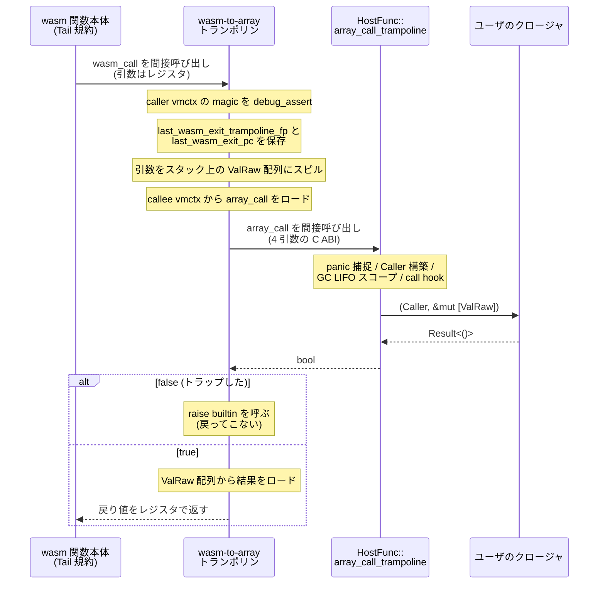

`Func::call` で wasm を呼ぶとき、Wasmtime は呼ぶ相手のシグネチャをコンパイル時に知らない。`(i32, i32) -> i32` かもしれないし `(f64, v128, funcref) -> ()` かもしれない。**Rust の関数ポインタ型は 1 つに決めなければならないのに、呼び先の型は実行時にしか分からない。** この矛盾を解くのが array-call ABI だ。

```rust title="crates/wasmtime/src/runtime/vm/vmcontext.rs"
/// A function pointer that exposes the array calling convention.
///
/// Regardless of the underlying Wasm function type, all functions using the
/// array calling convention have the same Rust signature.
///
/// Arguments:
///
/// * Callee `vmctx` for the function itself.
///
/// * Caller's `vmctx` (so that host functions can access the linear memory of
///   their Wasm callers).
///
/// * A pointer to a buffer of `ValRaw`s where both arguments are passed into
///   this function, and where results are returned from this function.
///
/// * The capacity of the `ValRaw` buffer. Must always be at least
///   `max(len(wasm_params), len(wasm_results))`.
///
/// Return value:
///
/// * `true` if this call succeeded.
/// * `false` if this call failed and a trap was recorded in TLS.
pub type VMArrayCallNative = unsafe extern "C" fn(
    NonNull<VMOpaqueContext>,
    NonNull<VMContext>,
    NonNull<ValRaw>,
    usize,
) -> bool;
```

[crates/wasmtime/src/runtime/vm/vmcontext.rs#L24-L51](https://github.com/bytecodealliance/wasmtime/blob/d8a0da6d661605713798c1c9c76be5c28e3159ff/crates/wasmtime/src/runtime/vm/vmcontext.rs#L24-L51)

引数を全部 `ValRaw` の配列に詰め、結果も同じ配列に書き戻す。だから関数型は 4 引数 `bool` 返しの 1 種類に固定される。同じ定義が Cranelift 側にもあり、そちらは CLIF の `ir::Signature` を組み立てる ([crates/cranelift/src/lib.rs#L159-L183](https://github.com/bytecodealliance/wasmtime/blob/d8a0da6d661605713798c1c9c76be5c28e3159ff/crates/cranelift/src/lib.rs#L159-L183))。**同じ ABI を Rust と CLIF の 2 か所で宣言している**ので、ここは手で揃えるしかない箇所になっている。

`ValRaw` は常に 16 バイトで、`i32` / `i64` / `f32` / `f64` / `v128` / `funcref` / `externref` / `anyref` / `exnref` の共用体だ。そして全フィールドが**ホストのエンディアンに関わらず常にリトルエンディアン**で格納される ([crates/wasmtime/src/runtime/vm/vmcontext.rs#L993-L1105](https://github.com/bytecodealliance/wasmtime/blob/d8a0da6d661605713798c1c9c76be5c28e3159ff/crates/wasmtime/src/runtime/vm/vmcontext.rs#L993-L1105))。wasm 自身がリトルエンディアンを規定しているので、s390x のようなビッグエンディアンのホストでも表現を揃えておくほうが、コード生成側の場合分けが減る。サイズが 16 かつアラインメントが `u64` と同じであることは C API 側と合わせるために `const _` でアサートされている。

## wasm 側は常に Tail

これに対して wasm のコード本体が使う規約は違う。

```rust title="crates/cranelift/src/lib.rs"
/// Get the internal Wasm calling convention for the target/tunables combo
fn wasm_call_conv(isa: &dyn TargetIsa, tunables: &Tunables) -> CallConv {
    // The default calling convention is `CallConv::Tail` to enable the use of
    // tail calls in modules when needed. Note that this is used even if the
    // tail call proposal is disabled in wasm. This is not interacted with on
    // the host so it's purely an internal detail of wasm itself.
    //
    // The Winch calling convention is used instead when generating trampolines
    // which call Winch-generated functions. ...
    if tunables.winch_callable {
        // ...
        CallConv::Winch
    } else {
        CallConv::Tail
    }
}
```

[crates/cranelift/src/lib.rs#L185-L210](https://github.com/bytecodealliance/wasmtime/blob/d8a0da6d661605713798c1c9c76be5c28e3159ff/crates/cranelift/src/lib.rs#L185-L210)

**tail-call proposal が無効なモジュールでも常に `Tail` を使う。** 理由が明記されていて、「ホストからは触れないので純粋に wasm 内部の実装詳細」だから。System V に合わせる必要がないなら、末尾呼び出しが書ける規約に統一しておけば、あとから proposal を有効にしても規約の切り替えが要らない。ABI をホストに晒さない、という決定が「ホスト都合の制約を全部外す」ことに繋がっている。

つまり **wasm 関数は 2 つの入口を持つ**。array-call 規約の入口 (`VMFuncRef::array_call`) と、Tail 規約の入口 (`VMFuncRef::wasm_call`) だ ([VMFuncRef と、wasm_call が Option である理由](../vmfuncref/))。

## 3 方向の経路

| 方向          | 呼び元が叩くもの        | 経由するトランポリン | 実際に走るもの                                 |
| ------------- | ----------------------- | -------------------- | ---------------------------------------------- |
| ホスト → wasm | `VMFuncRef::array_call` | array-to-wasm        | wasm 関数本体 (Tail 規約)                      |
| wasm → ホスト | `VMFuncRef::wasm_call`  | wasm-to-array        | `HostFunc::array_call_trampoline` → クロージャ |
| wasm → wasm   | `VMFuncRef::wasm_call`  | なし                 | wasm 関数本体 (Tail 規約)                      |

**wasm → wasm だけがトランポリンを通らない。** `call_indirect` / `call_ref` のコード生成は、`VMFuncRef` から `wasm_call` と `vmctx` を 2 回ロードして間接呼び出しするだけだ。

```rust title="crates/cranelift/src/func_environ.rs"
let func_addr = self
    .env
    .alias_regions
    .vm_func_ref()
    .wasm_call()
    .trap_code(callee_load_trap_code)
    .load(&mut self.builder.cursor(), callee);
let callee_vmctx = self
    .env
    .alias_regions
    .vm_func_ref()
    .vmctx()
    .load(&mut self.builder.cursor(), callee);
```

[crates/cranelift/src/func_environ.rs#L2342-L2377](https://github.com/bytecodealliance/wasmtime/blob/d8a0da6d661605713798c1c9c76be5c28e3159ff/crates/cranelift/src/func_environ.rs#L2342-L2377)

呼び先が別モジュールの wasm 関数でも、ホスト関数でも、生成されるコードは同じだ。ホスト関数の場合は `wasm_call` に wasm-to-array トランポリンが入っているので、そこで規約が切り替わる。**呼び元は呼び先の正体を知らないままでよい。** `wasm_call` のロードに `TRAP_NULL_REFERENCE` が付いているのは、null な funcref を `call_ref` したときにここでトラップするためで、このロードを動かせないという制約に繋がっている ([レイアウトの単一定義源をマクロで作る](../layout-macro/))。

## wasm → ホストのフルパス



トランポリンの実体は Cranelift が CLIF を組み立ててコンパイルしている。

```rust title="crates/cranelift/src/compiler.rs"
// We are exiting Wasm, so save our PC and FP.
//
// Assert that the caller vmctx really is a core Wasm vmctx, since
// that's what we are assuming with our offsets below.
self.debug_assert_vmctx_kind(&mut builder, &mut alias_regions, caller_vmctx,
                             wasmtime_environ::VMCONTEXT_MAGIC);
let vm_store_context = alias_regions.vmctx().store_context()
    .load(&mut builder.cursor(), caller_vmctx);
save_last_wasm_exit_fp_and_pc(&mut builder, pointer_type, &mut alias_regions,
                              vm_store_context);

// Spill all wasm arguments to the stack in `ValRaw` slots.
let (args_base, args_len) = self.allocate_stack_array_and_spill_args(
    &mut alias_regions, wasm_func_ty, &mut builder, &args[2..]);
// ...
// Load the actual callee out of the
// `VMArrayCallHostFuncContext::host_func`.
let callee = alias_regions.vm_func_ref().array_call()
    .relative_to(func_ref_offset.into())
    .load(&mut builder.cursor(), callee_vmctx);

// Do an indirect call to the callee.
let call = self.call_indirect_host(&mut builder, HostCall::ArrayCall, callee_signature,
                                   callee, &[callee_vmctx, caller_vmctx, args_base, args_len]);
// ...
// Invoke `raise` if the callee (host) returned an error.
let succeeded = builder.func.dfg.inst_results(call)[0];
self.raise_if_host_trapped(&mut builder, &mut alias_regions, caller_vmctx, succeeded);
```

[crates/cranelift/src/compiler.rs#L201-L316](https://github.com/bytecodealliance/wasmtime/blob/d8a0da6d661605713798c1c9c76be5c28e3159ff/crates/cranelift/src/compiler.rs#L201-L316)

wasm を出る瞬間に `last_wasm_exit_trampoline_fp` と `last_wasm_exit_pc` を `VMStoreContext` に書くのが要点だ。ここに記録された値が、後でスタックを歩くときの「wasm のフレームの並びはここで終わり」という目印になる ([CallThreadState — スタック上に置くアクティベーションの連結リスト](../call-thread-state/))。ホスト側に入ってしまえばフレームレイアウトは Wasmtime の知るところではないので、境界を跨ぐ瞬間に記録しておくしかない。

Rust 側の受け口が `HostFunc::array_call_trampoline` で、doc コメントが引き受ける雑務を列挙している。

```rust title="crates/wasmtime/src/runtime/func.rs"
/// Entrypoint of WebAssembly back into the host.
///
/// This is the standard wasmtime "array call signature" which then
/// delegates internally to the host. ...
///
/// Details handled by this wrapper are:
///
/// * Host panics are handled (`enter_host_from_wasm`)
/// * `F` is loaded from `callee_vmctx`
/// * `Caller` is constructed to pass to `F`
/// * A GC LIFO scope is maintained around the execution of `F`.
/// * Call hooks for entering/leaving the host are maintained.
unsafe extern "C" fn array_call_trampoline<T, F>(
    callee_vmctx: NonNull<VMOpaqueContext>,
    caller_vmctx: NonNull<VMContext>,
    args: NonNull<ValRaw>,
    args_len: usize,
) -> bool
```

[crates/wasmtime/src/runtime/func.rs#L2346-L2421](https://github.com/bytecodealliance/wasmtime/blob/d8a0da6d661605713798c1c9c76be5c28e3159ff/crates/wasmtime/src/runtime/func.rs#L2346-L2421)

`callee_vmctx` を `VMArrayCallHostFuncContext` にキャストして `host_state` から `F` を取り出し、`caller_vmctx` から `Caller` を組み立てる。`Func::wrap` のジェネリクスがここで実体化されるので、**ユーザのクロージャ 1 つにつきこの関数が 1 つ単相化される**。

## bool 1 個でトラップを伝える

array-call の返り値 `bool` は「トラップしたかどうか」を表す。`false` のとき、トラップの中身は既に TLS の `CallThreadState` に記録済みで、呼び出し側のトランポリンが `raise` builtin を呼ぶ。

```rust title="crates/cranelift/src/compiler.rs"
pub fn raise_if_host_trapped<O>(/* ... */) {
    let trapped_block = builder.create_block();
    let continuation_block = builder.create_block();
    builder.set_cold_block(trapped_block);
    builder.ins().brif(succeeded, continuation_block, &[], trapped_block, &[]);
    // ...
    builder.switch_to_block(trapped_block);
    let sig = sigs.host_signature(BuiltinFunctionIndex::raise());
    self.call_builtin(builder, alias_regions, vmctx, &[vmctx],
                      BuiltinFunctionIndex::raise(), sig);
    builder.ins().trap(TRAP_INTERNAL_ASSERT);

    builder.switch_to_block(continuation_block);
}
```

[crates/cranelift/src/compiler.rs#L1330-L1363](https://github.com/bytecodealliance/wasmtime/blob/d8a0da6d661605713798c1c9c76be5c28e3159ff/crates/cranelift/src/compiler.rs#L1330-L1363)

トラップ経路は `set_cold_block` で cold 指定され、`raise` の呼び出し直後に `trap(TRAP_INTERNAL_ASSERT)` が置かれる。`raise` は戻ってこないので、ここに到達したらランタイムのバグだ。

**エラーの中身をレジスタで返さない**、というのがこの設計の肝になっている。エラー型のサイズや表現に ABI が依存しなくなるので、Rust 側の `anyhow::Error` の表現が変わってもコード生成に影響しない ([libcall はトランポリンと sentinel 返り値で呼ぶ](../libcall-trampoline/) が同じ形を取る)。

## ホスト → wasm

逆方向の入口は `invoke_wasm_and_catch_traps` で、`CallThreadState` を積み、`call_hook(CallingWasm)` を呼び、`catch_traps` の中でクロージャを実行する ([crates/wasmtime/src/runtime/func.rs#L1457-L1483](https://github.com/bytecodealliance/wasmtime/blob/d8a0da6d661605713798c1c9c76be5c28e3159ff/crates/wasmtime/src/runtime/func.rs#L1457-L1483))。そのクロージャが `VMFuncRef::array_call` を叩き、array-to-wasm トランポリンに入る。

トランポリンの側は 3 つのことをする。`ValRaw` の配列から引数をロードし、`save_last_wasm_entry_context` で入口の fp / sp / **例外ハンドラのアドレス**を `VMStoreContext` に保存し、そして本体を `try_call` で呼ぶ。

```rust title="crates/cranelift/src/compiler.rs"
// Create the invocation of wasm, which is notably done with a
// `try_call` with an exception handler that's used to handle traps.
let normal_return = builder.create_block();
let exceptional_return = builder.create_block();
// ...
builder.ins().try_call(callee, &args, exception_table);
// ...
// On the normal return path store all the results in the array we were
// provided and return "true" for "returned successfully".
builder.switch_to_block(normal_return);
self.store_values_to_array(/* ... */);
let true_return = builder.ins().iconst(ir::types::I8, 1);
builder.ins().return_(&[true_return]);

// On the exceptional return path just return "false" for "did not
// succeed". Note that register restoration is part of the `try_call`
// and handler implementation.
builder.switch_to_block(exceptional_return);
// ...
let false_return = builder.ins().iconst(ir::types::I8, 0);
builder.ins().return_(&[false_return]);
```

[crates/cranelift/src/compiler.rs#L1450-L1620](https://github.com/bytecodealliance/wasmtime/blob/d8a0da6d661605713798c1c9c76be5c28e3159ff/crates/cranelift/src/compiler.rs#L1450-L1620)

`save_last_wasm_entry_context` が `get_exception_handler_address` でこの `try_call` の例外ハンドラのアドレスを取り、`last_wasm_entry_trap_handler` に書く ([crates/cranelift/src/compiler.rs#L1861-L1893](https://github.com/bytecodealliance/wasmtime/blob/d8a0da6d661605713798c1c9c76be5c28e3159ff/crates/cranelift/src/compiler.rs#L1861-L1893))。wasm の中でトラップが起きたとき、シグナルハンドラはここに記録された pc へ制御を飛ばす。**longjmp の代わりにこのアドレスへの復帰を使う**、というのがトラップ機構の中心にある ([longjmp を使わず、ucontext を書き換えて戻る](../unwind-via-ucontext/))。

array-call の `bool` は、ここで `try_call` の正常経路なら `true`、例外経路なら `false` として作られる。wasm→ホストのときと同じ値の意味で、方向が逆になっただけだ。

## Pulley のときの迂回

Pulley (バイトコード VM) で走らせているとき、`array_call` の中身はネイティブコードではなくバイトコードなので、インタプリタを起動する必要がある。ただし 1 つ例外がある。

```rust title="crates/wasmtime/src/runtime/vm/vmcontext.rs"
unsafe fn array_call_interpreted(
    me: NonNull<VMFuncRef>,
    vm: InterpreterRef<'_>,
    caller: NonNull<VMContext>,
    args_and_results: NonNull<[ValRaw]>,
) -> bool {
    // If `caller` is actually a `VMArrayCallHostFuncContext` then skip the
    // interpreter, even though it's available, as `array_call` will be
    // native code.
    unsafe {
        if me.as_ref().vmctx.as_non_null().as_ref().magic
            == wasmtime_environ::VM_ARRAY_CALL_HOST_FUNC_MAGIC
        {
            return Self::array_call_native(me, caller, args_and_results);
        }
        vm.call(/* ... */)
    }
}
```

[crates/wasmtime/src/runtime/vm/vmcontext.rs#L594-L616](https://github.com/bytecodealliance/wasmtime/blob/d8a0da6d661605713798c1c9c76be5c28e3159ff/crates/wasmtime/src/runtime/vm/vmcontext.rs#L594-L616)

**vmctx の magic を見て、ホスト関数ならインタプリタを迂回してネイティブ呼び出しに切り替える。** ホスト関数の `array_call` は Rust の関数なのでバイトコードではない。ここが magic の値を「バグ検出のため」ではなく「振る舞いの分岐のため」に読んでいる、唯一に近い場所になる ([Pulley — JIT できない場所のためのバイトコード VM](../pulley/))。

## トランポリンは重複排除されていない

`docs/contributing-architecture.md` に前提が書かれている。

```text title="docs/contributing-architecture.md"
Another point of note is that trampolines are not deduplicated at this time.
Each compiled module contains its own set of trampolines, and if two compiled
modules have the same types then they'll have different copies of the same
trampoline.
```

[docs/contributing-architecture.md#L225-L228](https://github.com/bytecodealliance/wasmtime/blob/d8a0da6d661605713798c1c9c76be5c28e3159ff/docs/contributing-architecture.md#L225-L228)

トランポリンはモジュールに埋め込まれる。同じ型を使う 2 つのモジュールをロードすると、同じ内容のトランポリンが 2 つできる。`.cwasm` を自己完結にする ([.cwasm は ELF そのものである](../cwasm/)) という設計と引き換えのコストで、モジュール数が増えるほどコードサイズに効く。

## どう活かすか

「型が実行時にしか決まらない呼び出し」を扱うときの定石が 2 つ見える。1 つは **引数をバッファに詰めて関数型を 1 つに畳む**こと。もう 1 つは、**速い経路 (wasm→wasm) では畳まない**ことだ。Wasmtime は畳んだ ABI を「ホストと話すとき専用」に限定し、wasm 内部の呼び出しはレジスタ渡しのまま残した。畳む処理をトランポリンという別の関数に押し出したので、本体のコード生成は境界のことを一切知らずに済んでいる。

境界を跨ぐ瞬間にしか記録できない情報 (exit pc / entry sp / 例外ハンドラのアドレス) を、その瞬間に書くコードをトランポリンに集約している点も見どころだ。境界の処理を 1 か所に閉じ込めると、その 1 か所に「境界でやるべきこと」を全部足せる。
