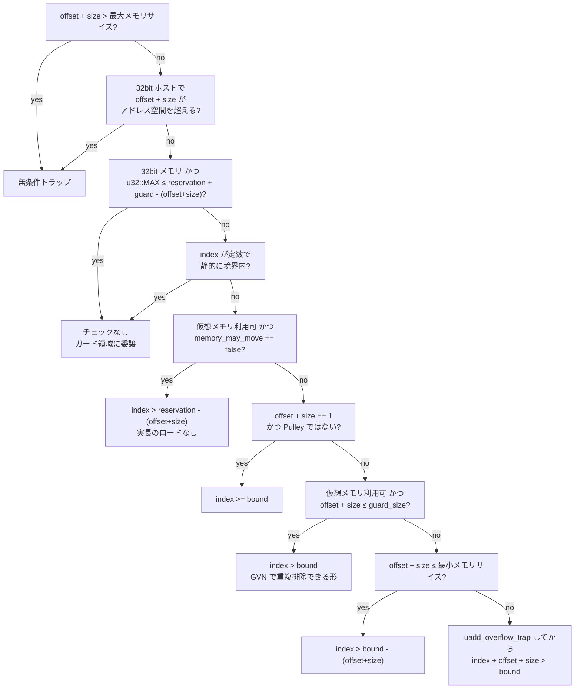

Wasm の `i32.load offset=8` は、`index + 8 + 4 <= 線形メモリのサイズ` でなければトラップしなければならない。素直に実装すれば、ロード 1 回ごとに加算・比較・分岐が付く。Wasmtime の既定設定では、**この命令が 1 つも出ない**。出るのは `heap_base + index + 8` という加算だけで、境界の判定は仮想メモリのページテーブルに丸ごと委譲される。

このページは、その委譲が成立する条件を追う。条件が崩れたときに何が起きるかも含めて、判断は `crates/cranelift/src/bounds_checks.rs` の 1 つの関数にまとまっている。

## まずファイル先頭の警告を読む

このファイルは、モジュールの doc コメントがいきなりこう始まる。

```rust title="crates/cranelift/src/bounds_checks.rs"
//! !!!!!!!!!!!!!!!!!!!!!!!!!!!!!!!!!!!!!!!!!!!!!!!!!!!!!!!!!!!!!!!!!!!!!!!!!!!!
//! !!!                                                                      !!!
//! !!!    THIS CODE IS VERY SUBTLE, HAS MANY SPECIAL CASES, AND IS ALSO     !!!
//! !!!   ABSOLUTELY CRITICAL FOR MAINTAINING THE SAFETY OF THE WASM HEAP    !!!
//! !!!                             SANDBOX.                                 !!!
//! !!!                                                                      !!!
//! !!!    A good rule of thumb is to get two reviews on any substantive     !!!
//! !!!                         changes in here.                             !!!
//! !!!                                                                      !!!
//! !!!!!!!!!!!!!!!!!!!!!!!!!!!!!!!!!!!!!!!!!!!!!!!!!!!!!!!!!!!!!!!!!!!!!!!!!!!!
```

[crates/cranelift/src/bounds_checks.rs](https://github.com/bytecodealliance/wasmtime/blob/d8a0da6d661605713798c1c9c76be5c28e3159ff/crates/cranelift/src/bounds_checks.rs#L11-L20)

「実質的な変更にはレビュー 2 人」というルールを、コードの中に書き込んでいる。ここが 696 行しかないファイルであることを考えると、この密度は異常だ。理由は明白で、この関数が 1 箇所でも間違えれば、そこが**サンドボックス脱出そのもの**になる。

## 判断は 1 本の if/else チェーン

実際の判断は `bounds_check_field_access` にある。この関数は、**早期 return する if の並び**として書かれている。上から順に条件を試し、当たったところで最も安いコードを出して帰る。

なぜこの書き方なのかも、コードの中に理由がある。

```rust title="crates/cranelift/src/bounds_checks.rs"
// Finally, the following if/else chains do have a little
// bit of duplicated code across them, but I think writing it this way is
// worth it for readability and seeing very clearly each of our cases for
// different bounds checks and optimizations of those bounds checks. It is
// intentionally written in a straightforward case-matching style that will
// hopefully make it easy to port to ISLE one day.
```

重複を許してでも各ケースを明示する、そしていつか [ISLE](../isle/) に移植しやすい素直な case-match のままにしておく、と宣言している。コンパイラの他の部分が ISLE の書き換え規則に寄っていることを考えると、これは「まだ移していないが、移す先は決まっている」という表明でもある。

分岐の全体像はこうなっている。



以下、要点になる 4 つを見ていく。

## 無条件トラップ — 静的に確定する範囲外

チェーンの先頭 2 つは、`index` の値によらず必ず範囲外になる場合だ。

```rust title="crates/cranelift/src/bounds_checks.rs"
if offset_and_size > heap.memory.maximum_byte_size().unwrap_or(u64::MAX) {
    // Special case: trap immediately if `offset + access_size >
    // max_memory_size`, since we will end up being out-of-bounds regardless
    // of the given `index`.
    env.before_unconditionally_trapping_memory_access(builder);
    env.trap(builder, trap);
    return Unreachable;
}
```

`index` は非負なので、静的オフセットとアクセスサイズの和だけで最大サイズを超えているなら、その先を見る必要がない。返り値が `Reachability::Unreachable` になっているのが効いていて、これを受けた [Wasm → CLIF 翻訳器](../wasm-to-clif/) は、この命令より後ろの同じ基本ブロックのコード生成を丸ごと打ち切る。境界チェックの判断が、翻訳器の到達可能性解析にまで影響を返している。

## 本命 — チェックを完全に消す条件

3 つ目が、既定設定で最も多く当たる分岐だ。ここでコメントが数式を段階的に書き下している。

```rust title="crates/cranelift/src/bounds_checks.rs"
//         index + offset + access_size > bound
//     ==> index > bound - (offset + access_size)
//
// ... 中略: ガード領域を右辺に足せる ...
//
//     index > bound + guard_size - (offset + access_size)
//
// ... 中略: 補集合を取る ...
//
//     index <= bound + guard_size - (offset + access_size)
//
// If we know the right-hand side is greater than or equal to
// `u32::MAX`, then
//
//     index <= u32::MAX <= bound + guard_size - (offset + access_size)
if can_elide_bounds_check
    && u64::from(u32::MAX) <= memory_reservation + memory_guard_size - offset_and_size
{
    assert!(heap.index_type() == ir::types::I32);
    return Reachable(compute_addr(
        &mut builder.cursor(), heap, env.pointer_type(), index, offset,
    ));
}
```

論理はこうだ。トラップすべき条件を変形して定数を右辺に集める。ガード領域は「マップされていないので触ればフォルトする」領域なので、`bound` から `bound + guard_size` までへのアクセスは実行時に OS が捕まえてくれる。つまり右辺に `guard_size` を足してよい。最後に不等式をひっくり返すと「トラップしない条件」になり、その右辺が `u32::MAX` 以上であることが示せれば、**32bit の `index` はどうやってもこの条件を満たす**。`index` は `u32::MAX` を超えられないからだ。

このとき生成されるのは `compute_addr` だけ、つまり `heap_base + index + offset` の加算のみになる。

条件の `can_elide_bounds_check` 側は `Memory` 型のメソッドで、3 つの条件の積として定義されている。

```rust title="crates/environ/src/types.rs"
pub fn can_elide_bounds_check(
    &self,
    memory_tunables: &MemoryTunables<'_>,
    host_page_size_log2: u8,
) -> bool {
    self.can_use_virtual_memory(memory_tunables.tunables(), host_page_size_log2)
        && self.idx_type == IndexType::I32
        && memory_tunables.reservation() + memory_tunables.guard_size() >= (1 << 32)
}
```

[crates/environ/src/types.rs](https://github.com/bytecodealliance/wasmtime/blob/d8a0da6d661605713798c1c9c76be5c28e3159ff/crates/environ/src/types.rs#L2376-L2407)

仮想メモリが使えること、32bit メモリであること、予約 + ガードが 4GiB 以上あること。そして `can_use_virtual_memory` はさらに `tunables.signals_based_traps && self.page_size_log2 >= host_page_size_log2` に分解される。**Wasm のページサイズがホストのページサイズより細かいと、ページ単位でしか保護できない仮想メモリでは足りない**。`custom-page-sizes` proposal でページサイズ 1 の線形メモリを作ると、この道は塞がる。

## なぜ 4GiB では足りず、ガードが要るのか

`can_elide_bounds_check` は 4GiB を要求するが、それは「予約 + ガード」の合計に対してだ。予約だけで 4GiB あってもガードが 0 なら、上の不等式は `offset_and_size > 0` の瞬間に成立しなくなる。理由は `Config::memory_reservation` の doc に書かれている。

```text title="crates/wasmtime/src/config.rs"
/// * When [`Config::memory_guard_size`] is too small a bounds check may be
///   required. For 32-bit wasm addresses are actually 33-bit effective
///   addresses because loads/stores have a 32-bit static offset to add to
///   the dynamic 32-bit address. If the static offset is larger than the
///   size of the guard region then an explicit bounds check is required.
```

[crates/wasmtime/src/config.rs](https://github.com/bytecodealliance/wasmtime/blob/d8a0da6d661605713798c1c9c76be5c28e3159ff/crates/wasmtime/src/config.rs#L1846-L1865)

**32bit の動的アドレスに 32bit の静的オフセットを足すので、実効アドレスは 33bit ある**。4GiB の予約だけでは、上半分がはみ出す。だから予約の後ろにガードを付ける。既定のガードは 32MiB なので、静的オフセットが 32MiB 未満のアクセスはチェックが消え、それを超えるオフセットを書いたアクセスだけがチェックを持つ、という粒度になる。

## ガードは重複排除にも効く

ガード領域の役目はチェックの消去だけではない。チェックが消せない構成でも、**チェックの回数を減らす**のに使える。7 つ目の分岐がそれで、`offset_and_size <= memory_guard_size` のときは `index + offset + size > bound` ではなく `index > bound` という部分的な条件だけを検査する。この部分条件を通り抜けた最大のはみ出し量は `offset + access_size` で、それがガードに収まるなら安全だ。

そして重要なのはその副作用のほうだ。

```rust title="crates/cranelift/src/bounds_checks.rs"
// Additionally, this has the advantage that a series of Wasm loads
// that use the same dynamic index operand but different static
// offset immediates -- which is a common code pattern when accessing
// multiple fields in the same struct that is in linear memory --
// will all emit the same `index > bound` check, which we can GVN.
```

`x+8` と `x+16` と `x+24` が全部 `x > bound` という同じ式になるので、[ægraph](../egraph/) の GVN が 1 個に畳む。同じことが `Config::memory_guard_size` の doc にも書かれていて、64bit メモリでも 4KiB のガードがあれば構造体の複数フィールドアクセスが 1 回の検査で済む、と説明されている。**境界チェックが消せない 64bit メモリでこそ、ガードのサイズが効いてくる**。

## ネイティブ向けの最適化が、インタプリタでは逆効果になる

6 つ目の分岐に、この群でいちばん示唆的な条件が付いている。

```rust title="crates/cranelift/src/bounds_checks.rs"
// Special case for when `offset + access_size == 1`:
//
//         index + 1 > bound
//     ==> index >= bound
//
// Note that this special case is skipped for Pulley targets to assist with
// pattern-matching bounds checks into single instructions. Otherwise more
// patterns/instructions would have to be added to match this. In the end
// the goal is to emit one instruction anyway, so this optimization is
// largely only applicable for native platforms.
if offset_and_size == 1 && !env.is_pulley() {
```

`index + 1 > bound` を `index >= bound` に書き換えるのは、ネイティブでは加算 1 個が消えて純粋に得だ。ところが [Pulley](../pulley-as-isa/) は境界チェックのパターン全体を 1 つのバイトコード命令にマッチさせたい。ここで比較の向きが `>` と `>=` の 2 種類に分かれると、マッチさせるべきパターンと命令が増える。どうせ最終的に 1 命令なら、形を揃えたほうがよい。

**同じ IR に対する「良い形」が、ターゲットがレジスタマシンかバイトコードインタプリタかで逆になる**という例になっている。Pulley を Cranelift のターゲット ISA として実装したことの副作用が、ISA バックエンドではなく Wasm → CLIF 翻訳の層にまで漏れてきている箇所だ。

## 実長のロードを省く分岐

5 つ目は、チェック自体は出すが**線形メモリの現在長をメモリから読むのをやめる**分岐だ。`memory_may_move` が `false` なら、メモリは初回の割り当てを超えて伸びられない。したがって長さの上限は `memory_reservation` で静的に確定する。

```rust title="crates/cranelift/src/bounds_checks.rs"
if can_use_virtual_memory
    && heap.memory.minimum_byte_size().unwrap_or(u64::MAX) <= memory_reservation
    && !heap.memory.memory_may_move(&memory_tunables)
    && memory_reservation >= offset_and_size
{
    let adjusted_bound = memory_reservation.checked_sub(offset_and_size).unwrap();
```

「動的な長さをその最大値だと思い込む」という近似で、[VMContext](../vmcontext/) からの長さロードが 1 つ消える。コメントは続けて「明示的なチェックを出すのだから、いっそ正確にやろう。仮想メモリには一切頼らず、ガードページも数に入れない」と書いている。ガードを足せばもう少し緩い条件にできるが、どうせ比較 1 回を出すなら正確なほうを選ぶ、という判断だ。

なお `memory_may_move` が `false` であることの本来の狙いは別にあって、`Config::memory_may_move` の doc は「ベースポインタが決して変わらないという静的知識でコンパイルできるので、ループ不変コード移動でベースポインタをループの外に追い出せる」ことを挙げている。

## どう活かすか

このチェーンから読み取れる設計の型は、**「安全性のためのチェックを消すのではなく、別の層に移す」**というものだ。境界チェックは消えていない。MMU に移っている。移せる条件を数式で明示し、移せないときは段階的に安いチェックへ落としていく。

移す先の層 (ページテーブル) の粒度が要求を満たすか、という問いが `page_size_log2 >= host_page_size_log2` の形で条件に入っているのも見どころで、**委譲先の粒度を条件として明示する**のは真似できる。ガードサイズが「消去」と「重複排除」という 2 つの別々の効果を持つのも、1 つのパラメータが複数の最適化の前提を兼ねる例として覚えておきたい。

チェックが消えなかったときに何が起きるかは、次の [Spectre 緩和は、トラップではなくアドレスの潰し込み](../spectre/) に続く。残ったチェックは `trapnz` になるとは限らず、投機実行対策のためにまったく別の形をとる。
