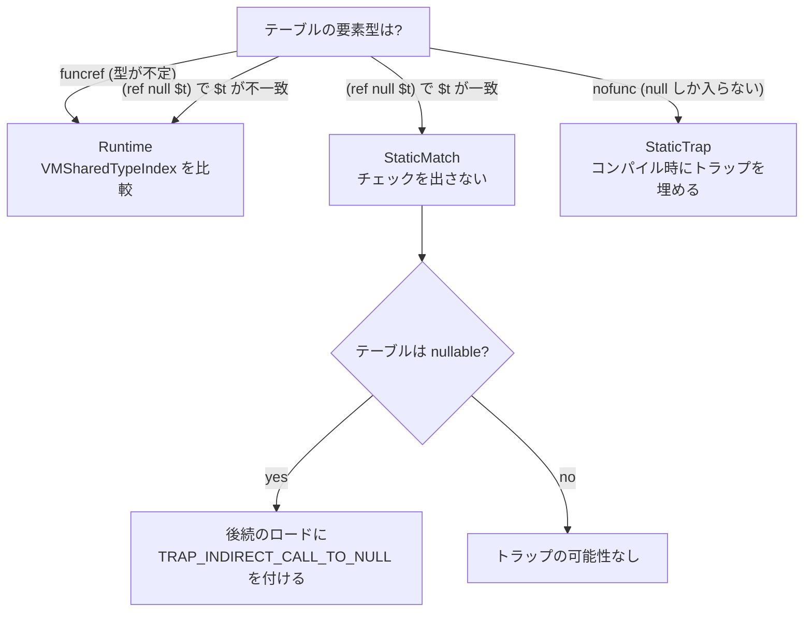

`call_indirect` は、テーブルの `i` 番目にある関数を呼ぶ命令だ。`i` は実行時に決まるので、そこに入っている関数が期待どおりの署名を持っているかは静的には分からない。Wasm の仕様は「署名が一致しなければトラップする」ことを要求する。

Wasmtime はこの検査を **`u32` の等値比較 1 回**にまで縮めている。そしてテーブルの要素型が `(ref null $t)` のように具体的な型で宣言されていれば、その比較すら出さない。ただしこの「1 回の整数比較」が成立するには、エンジン全体で型を正規化しておく必要がある。

## 3 つの状態への分岐

判断は `check_indirect_call_type_signature` にあり、返り値の型がそのまま 3 状態を表している。

```rust title="crates/cranelift/src/func_environ.rs"
enum CheckIndirectCallTypeSignature {
    Runtime,
    StaticMatch {
        /// Whether or not the funcref may be null or if it's statically known
        /// to not be null.
        may_be_null: bool,
    },
    StaticTrap,
}
```

[crates/cranelift/src/func_environ.rs](https://github.com/bytecodealliance/wasmtime/blob/d8a0da6d661605713798c1c9c76be5c28e3159ff/crates/cranelift/src/func_environ.rs#L2207-L2306)



分岐の本体はこうなっている。

```rust title="crates/cranelift/src/func_environ.rs"
match table.ref_type.heap_type {
    // Functions do not have a statically known type in the table, a
    // typecheck is required. Fall through to below to perform the
    // actual typecheck.
    WasmHeapType::Func => {}

    // Functions that have a statically known type are either going to
    // always succeed or always fail. Figure out by inspecting the types
    // further.
    WasmHeapType::ConcreteFunc(EngineOrModuleTypeIndex::Module(table_ty)) => {
        let specified_ty = self.env.module.types[ty_index].unwrap_module_type_index();
        if specified_ty == table_ty {
            return CheckIndirectCallTypeSignature::StaticMatch {
                may_be_null: table.ref_type.nullable,
            };
        }
    }

    // Tables of `nofunc` can only be inhabited by null, so go ahead and
    // trap with that.
    WasmHeapType::NoFunc => {
        assert!(table.ref_type.nullable);
        self.env.trap(self.builder, crate::TRAP_INDIRECT_CALL_TO_NULL);
        return CheckIndirectCallTypeSignature::StaticTrap;
    }
    // ... 残りは validation 上到達しないので unreachable!() ...
}
```

`nofunc` は Wasm GC の型階層における funcref の最下位型で、**null 以外の値が存在しえない**。したがってそのテーブルへの `call_indirect` は必ず null 呼び出しになり、コンパイル時に無条件トラップを埋めて終わりにできる。[境界チェックの無条件トラップ](../bounds-check-elision/) と同じく、「静的に確定する失敗はコード生成の段階で確定させる」という扱いだ。

面白いのは `StaticMatch` に `may_be_null` が付いていることで、呼び出し元がこれを使って**後続のロードにトラップコードを付けるかどうか**を決める。

```rust title="crates/cranelift/src/func_environ.rs"
// No type check was performed on `funcref_ptr` because it's
// statically known to have the right type. Note that whether or
// not the function is null is not necessarily tested so far since
// no type information was inspected.
//
// If the table may hold null functions, then further loads in
// `unchecked_call` may fail. If the table only holds non-null
// functions, though, then there's no possibility of a trap.
CheckIndirectCallTypeSignature::StaticMatch { may_be_null } => {
    if may_be_null {
        Some(crate::TRAP_INDIRECT_CALL_TO_NULL)
    } else {
        None
    }
}
```

型チェックを省いた副作用として null チェックも省かれてしまうので、それを取り戻す。逆に `Runtime` の場合は「型比較まで到達した時点で null ではないことが確定している」ので、トラップコードは `None` でよい。**1 つの検査が別の検査を兼ねる関係が、この enum で明示的に受け渡されている。**

## 実行時チェックの両辺はどこから来るか

`Runtime` になったときに比較する 2 つの値は、それぞれ別の場所から読まれる。

```rust title="crates/cranelift/src/func_environ.rs"
// Load the caller's `VMSharedTypeIndex.
let interned_ty = self.env.module.types[ty_index].unwrap_module_type_index();
let caller_sig_id = self
    .env
    .module_interned_to_shared_ty(&mut self.builder.cursor(), interned_ty);

// Load the callee's `VMSharedTypeIndex`.
//
// Note that the callee may be null in which case this load may
// trap. If so use the `TRAP_INDIRECT_CALL_TO_NULL` trap code.
let trap_code = if self.env.clif_memory_traps_enabled() {
    Some(crate::TRAP_INDIRECT_CALL_TO_NULL)
} else {
    self.env.trapz(self.builder, funcref_ptr, crate::TRAP_INDIRECT_CALL_TO_NULL);
    None
};
let callee_sig_id = self
    .env
    .alias_regions
    .vm_func_ref()
    .type_index()
    .trap_code(trap_code)
    .load(&mut self.builder.cursor(), funcref_ptr);
```

呼び出し側 (caller) の期待する型は、命令に書かれた**モジュールローカルな**型インデックスから引く。`module_interned_to_shared_ty` は [VMContext](../vmcontext/) の `type_ids` フィールドが指す配列をベースに、そのインデックス分だけずらして 1 要素読む。この配列はインスタンス化のときにエンジンの型レジストリから埋められる。

呼ばれる側 (callee) の型は、`VMFuncRef` の `type_index` フィールドから読む。

```rust title="crates/environ/src/vmtypes.rs"
/// Function signature's type id.
///
/// See the note about `readonly` and not `can_move` on
/// `wasm_call`.
#[readonly]
pub type_index: VMSharedTypeIndex,
```

このロードには **null funcref の検出という副業**がある。`funcref_ptr` が null なら、そこからのロードが 0 番地アクセスになってフォルトする。だからトラップコード `TRAP_INDIRECT_CALL_TO_NULL` を `MemFlags` に埋めておく。シグナルが使えない構成 (`clif_memory_traps_enabled` が false) では、代わりに明示的な `trapz` を出す。`wasm_call` フィールドの doc コメントが「このロードは null funcref でトラップするものかもしれないので、`can_move` にはできない」と書いているのはこのためで、**ロードを移動させるとトラップの位置が動いてしまう**。

比較そのものは `is_subtype` に渡される。

```rust title="crates/cranelift/src/func_environ.rs"
// Check that they match: in the case of Wasm GC, this means doing a
// full subtype check. Otherwise, we do a simple equality check.
let matches = self
    .env
    .is_subtype(self.builder, callee_sig_id, caller_sig_id, interned_ty);
self.env.trapz(self.builder, matches, crate::TRAP_BAD_SIGNATURE);
```

`is_subtype` は最初に `a == b` の等値比較を出す。そして呼び出し側の型が `final` なら、そこで終わる。

```rust title="crates/cranelift/src/func_environ/gc.rs"
// When `b` is final the equality check above is already a complete
// subtype check, so there is nothing more to do: a final type cannot be
// the supertype of any other type, so `a <: b` holds if and only if `a
// == b`; in that case we can avoid emitting the slow-path `is_subtype`
// libcall and its control flow entirely (the slow path would only ever
// return `false` here anyway).
let b_is_final = self.types[b_ty].is_final;
if b_is_final {
    return same_ty;
}
```

`final` でない場合だけ、等値比較を高速パスにして、外れたときに `is_subtype` の [libcall](../libcall-trampoline/) へ落ちる分岐を作る。Wasm GC を使っていない普通のモジュールでは型は全部 final なので、**生成されるのは `icmp eq` 1 命令と `trapz` だけ**になる。

## なぜモジュールローカルな型インデックスでは駄目なのか

ここが本題だ。`call_indirect` の型検査を整数比較にするなら、「同じ型なら同じ整数」でなければならない。Wasm モジュールの型セクションにある型インデックスは、この条件を満たさない。理由は 2 つあり、`ModuleInternedTypeIndex` の doc コメントに書かれている。

```rust title="crates/environ/src/types.rs"
/// Note that this is deduplicated only at the level of a single WebAssembly
/// module, not at the level of a whole store or engine. This means that these
/// indices are only unique within the context of a single Wasm module, and
/// therefore are not suitable for runtime type checks (which, in general, may
/// involve entities defined in different modules).
pub struct ModuleInternedTypeIndex(u32);

/// This is canonicalized/deduped at the level of a whole engine, across all the
/// modules loaded into that engine, not just at the level of a single
/// particular module. This means that `VMSharedTypeIndex` is usable for
/// e.g. checking that function signatures match during an indirect call
/// (potentially to a function defined in a different module) at runtime.
#[repr(transparent)] // Used directly by JIT code.
pub struct VMSharedTypeIndex(u32);
```

[crates/environ/src/types.rs](https://github.com/bytecodealliance/wasmtime/blob/d8a0da6d661605713798c1c9c76be5c28e3159ff/crates/environ/src/types.rs#L1680-L1700)

`call_indirect` のテーブルには、**他のモジュールで定義された関数**が入りうる。モジュール A の型 3 とモジュール B の型 7 が同じ `(func (param i32) (result i32))` を表しているとき、番号での比較は失敗する。だから比較に使える番号は、少なくとも「一緒に動きうるモジュール全体」で共有されていなければならない。

その共有の単位が `Engine` だ。`docs/contributing-architecture.md` が経緯ごと説明している。

```text title="docs/contributing-architecture.md"
The `call_indirect` opcode in
wasm compares an actual function's signature against the function signature of
the instruction, trapping if the signatures mismatch. This is implemented in
Wasmtime as an integer comparison, and the comparison happens on a
`VMSharedSignatureIndex` value. This index is an intern'd representation of a
function type.

The scope of interning for `VMSharedSignatureIndex` happens at the
`wasmtime::Engine` level. Modules are compiled into an `Engine`. Insertion of a
`Module` into an `Engine` will assign a `VMSharedSignatureIndex` to all of the
types found within the module.
```

[docs/contributing-architecture.md](https://github.com/bytecodealliance/wasmtime/blob/d8a0da6d661605713798c1c9c76be5c28e3159ff/docs/contributing-architecture.md#L230-L250)

(このドキュメントが書かれた時点の名前は `VMSharedSignatureIndex` で、現在は Wasm GC の型全般を扱うので `VMSharedTypeIndex` に改名されている。)

続く段落が、この設計のいちばん重要な帰結を述べている。「あるモジュールの `VMSharedTypeIndex` の値は、そのモジュールを **1 回 Engine に入れたことに対してローカル**であり、別の Engine に入れれば値は変わりうる」。つまり **`VMSharedTypeIndex` はコンパイル済みの機械語に焼き込めない**。だから機械語のほうは「モジュールローカルな番号で `type_ids` 配列を引く」という間接参照を持ち、その配列の中身をインスタンス化のときに埋める、という 2 段構えになる。

型を表す 3 種類のインデックスは `EngineOrModuleTypeIndex` にまとめられている。

```rust title="crates/environ/src/types.rs"
pub enum EngineOrModuleTypeIndex {
    /// An index within an engine, canonicalized among all modules that can
    /// interact with each other.
    Engine(VMSharedTypeIndex),

    /// An index within the current Wasm module, canonicalized within just this
    /// current module.
    Module(ModuleInternedTypeIndex),

    /// An index within the containing type's rec group. This is only used when
    /// hashing and canonicalizing rec groups, and should never appear outside
    /// of the engine's type registry.
    RecGroup(RecGroupRelativeTypeIndex),
}
```

3 つ目の `RecGroup` は正規化の作業中にだけ現れる内部表現で、型レジストリの外に出てはならないと明記されている。だから先の `match` でも、`ConcreteFunc(Engine(_))` と `ConcreteFunc(RecGroup(_))` はコンパイル時には現れないので `unreachable!()` に落としている。**型インデックスの「どのスコープで正規化されたか」を型で区別し、混同をコンパイルエラーにしている**わけだ。レジストリ自体の設計は [型のライフタイムを、再帰グループ単位の参照カウントで管理する](../type-registry/) に譲る。

## call_ref では署名チェックが要らない、が null チェックは残る

対照的なのが `call_ref` だ。`call_ref` のオペランドは `(ref null $t)` という型を持っているので、型システムが署名の一致を保証している。実行時の署名チェックはない。しかし null チェックだけは残る。

```rust title="crates/cranelift/src/func_environ.rs"
// FIXME: the wasm type system tracks enough information to know whether
// `callee` is a null reference or not. In some situations it can be
// statically known here that `callee` cannot be null in which case this
// can be `None` instead. This requires feeding type information from
// wasmparser's validator into this function, however, which is not
// easily done at this time.
let callee_load_trap_code = Some(crate::TRAP_NULL_REFERENCE);
```

`(ref $t)` のように non-nullable な型なら null チェックも不要なはずだが、**その情報が届いていない**。理由は「wasmparser のバリデータが持っている型情報をこの関数まで流す仕組みが今はない」ことだと、FIXME として明記されている。

これは、[パースと検証をインターリーブする](../interleaved-validation/) 設計の副作用でもある。検証器は型を全部知っているが、その結果を捨てながら進んでいる。捨てた情報を後段で使いたくなると、こういう保守的なコードが残る。**型システムが証明した事実を、コンパイラに届けるパスを最初から作っておかないと、後で最適化として取り戻すのが面倒になる**という例だ。

## どう活かすか

「実行時の等値比較で済ませるために、比較対象の名前空間を正規化する」という手は、型に限らず使える。文字列を比較する代わりに intern した ID を比べるのは常套手段だが、ここで学べるのは**その ID の有効範囲を型で表明する**ところだ。`ModuleInternedTypeIndex` と `VMSharedTypeIndex` は中身がどちらも `u32` で、混ぜても実行時には気付けない。別の型にして、変換に `module_interned_to_shared_ty` という明示的な手続きを通させることで、「どのスコープの番号か」という不変条件が保たれている。
